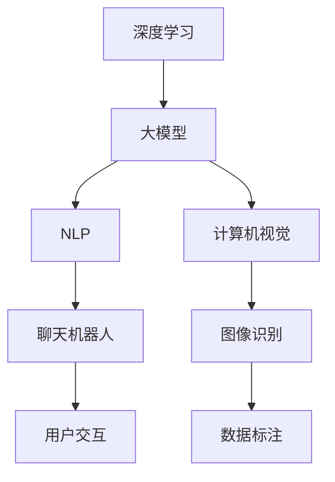

                 

关键词：AI 大模型、创业产品、开发应用、技术实现、数学模型、项目实践、未来展望

> 摘要：随着人工智能技术的飞速发展，AI 大模型已成为推动创新和变革的重要力量。本文将探讨 AI 大模型在创业产品开发中的应用，从核心概念、算法原理、数学模型、项目实践等方面进行深入分析，旨在为创业团队提供实用的技术指导和策略建议。

## 1. 背景介绍

近年来，人工智能（AI）技术取得了前所未有的突破，尤其是在深度学习领域。AI 大模型，如 GPT-3、BERT、ImageNet 等，以其卓越的性能和广泛的应用前景，吸引了全球范围内的关注。这些大模型不仅在学术研究中取得了重大成就，也在商业领域展现出了巨大的潜力。创业产品开发，作为科技创新的重要阵地，正面临着前所未有的机遇和挑战。

在创业产品开发中，AI 大模型的应用具有重要意义。首先，大模型可以帮助创业者快速实现复杂的功能，降低开发成本和时间。其次，大模型在数据分析、预测、决策等领域的优势，可以为创业产品提供强大的数据支持和智能服务。最后，随着大模型的不断优化和普及，创业团队可以借助这些技术，快速迭代产品，提升用户体验，增强市场竞争力。

## 2. 核心概念与联系

为了更好地理解 AI 大模型在创业产品开发中的应用，我们需要先了解以下几个核心概念：

### 2.1 深度学习

深度学习是一种人工智能方法，通过多层神经网络模拟人脑的学习过程。它在大模型中扮演着关键角色，使得模型能够处理海量数据，提取复杂特征，实现高效学习。

### 2.2 大模型

大模型是指参数数量达到百万甚至亿级的神经网络模型。这些模型通过在大量数据上训练，获得了优异的性能，成为了当前 AI 领域的重要研究方向。

### 2.3 自然语言处理

自然语言处理（NLP）是 AI 的重要分支，旨在使计算机理解和处理人类自然语言。在创业产品中，NLP 技术可以用于聊天机器人、智能客服、内容推荐等场景。

### 2.4 计算机视觉

计算机视觉是 AI 的另一个重要分支，通过图像处理和模式识别技术，使计算机能够理解和解析图像信息。在创业产品中，计算机视觉可以应用于图像识别、目标检测、图像增强等场景。

为了更好地理解这些概念之间的联系，我们可以使用 Mermaid 流程图进行描述：



在这个流程图中，深度学习是构建大模型的基础，大模型又进一步应用于 NLP 和计算机视觉领域，最终实现具体的业务功能，如聊天机器人和图像识别。

## 3. 核心算法原理 & 具体操作步骤

### 3.1 算法原理概述

AI 大模型的核心在于其深度学习算法，尤其是基于神经网络的深度学习模型。这些模型通过多层神经网络结构，逐步提取输入数据的特征，实现数据的自动分类、预测和生成。以下是一个典型的深度学习模型结构：

1. 输入层（Input Layer）：接收外部输入数据。
2. 隐藏层（Hidden Layer）：通过激活函数对输入数据进行非线性变换，提取特征。
3. 输出层（Output Layer）：根据隐藏层的输出，进行分类或预测。

### 3.2 算法步骤详解

#### 步骤1：数据预处理

在训练大模型之前，需要对数据进行预处理，包括数据清洗、归一化、缺失值填充等操作。数据预处理是保证模型训练效果的关键步骤。

#### 步骤2：模型搭建

搭建深度学习模型，选择合适的神经网络结构，包括输入层、隐藏层和输出层的节点数量、激活函数等。常见的深度学习框架如 TensorFlow、PyTorch 等，提供了丰富的模型搭建工具。

#### 步骤3：模型训练

使用预处理的训练数据，对模型进行训练。训练过程中，通过反向传播算法，不断调整模型参数，使得模型在训练集上的误差最小。训练过程中需要关注模型性能的监控和调整。

#### 步骤4：模型评估

在训练完成后，使用验证集和测试集对模型进行评估。评估指标包括准确率、召回率、F1 值等。根据评估结果，对模型进行调整和优化。

#### 步骤5：模型部署

将训练好的模型部署到实际业务场景中，如创业产品的功能模块。部署过程中，需要考虑模型的性能、稳定性、安全等问题。

### 3.3 算法优缺点

#### 优点：

1. 强大的数据处理能力：大模型能够处理海量数据，提取复杂特征，实现高效学习。
2. 优秀的预测性能：大模型在各类数据集上的表现优异，能够实现高精度的分类、预测和生成。
3. 灵活的应用场景：大模型可以应用于自然语言处理、计算机视觉、推荐系统等众多领域。

#### 缺点：

1. 训练成本高：大模型需要大量的计算资源和时间进行训练，成本较高。
2. 数据依赖性：大模型的性能高度依赖训练数据的质量和数量，数据缺失或不准确会影响模型效果。
3. 难以解释：深度学习模型的内部机制复杂，难以解释，对于决策过程缺乏透明度。

### 3.4 算法应用领域

AI 大模型在创业产品中的应用广泛，以下是一些典型应用领域：

1. 自然语言处理：应用于聊天机器人、智能客服、内容推荐等场景。
2. 计算机视觉：应用于图像识别、目标检测、图像增强等场景。
3. 推荐系统：应用于电商、金融、社交媒体等领域的个性化推荐。
4. 自动驾驶：应用于自动驾驶车辆的环境感知和路径规划。
5. 医疗诊断：应用于医学图像分析、疾病预测等场景。

## 4. 数学模型和公式 & 详细讲解 & 举例说明

### 4.1 数学模型构建

AI 大模型的数学基础是深度学习，主要包括以下数学模型和公式：

#### 激活函数

激活函数是深度学习模型中隐藏层的关键部分，用于引入非线性变换。常见的激活函数包括：

- Sigmoid 函数：\( f(x) = \frac{1}{1 + e^{-x}} \)
-ReLU 函数：\( f(x) = \max(0, x) \)
- 双曲正切函数：\( f(x) = \tanh(x) \)

#### 反向传播算法

反向传播算法是深度学习模型训练的核心算法，通过计算损失函数关于模型参数的梯度，更新模型参数。主要公式包括：

- 损失函数：\( L = -\sum_{i=1}^{n} y_i \log(\hat{y}_i) \)
- 梯度计算：\( \frac{\partial L}{\partial w} = \sum_{i=1}^{n} \frac{\partial L}{\partial \hat{y}_i} \frac{\partial \hat{y}_i}{\partial w} \)
- 参数更新：\( w = w - \alpha \frac{\partial L}{\partial w} \)

#### 模型优化

在模型训练过程中，需要不断优化模型参数，以降低损失函数。常见的优化算法包括：

- 随机梯度下降（SGD）：\( w = w - \alpha \frac{\partial L}{\partial w} \)
- Adam 优化器：\( w = w - \alpha \frac{\partial L}{\partial w} \)

### 4.2 公式推导过程

以 Sigmoid 函数为例，我们对其公式进行推导：

假设输入变量为 \( x \)，则 Sigmoid 函数的输出为：

\[ f(x) = \frac{1}{1 + e^{-x}} \]

对 Sigmoid 函数求导，得到：

\[ f'(x) = \frac{e^{-x}}{(1 + e^{-x})^2} \]

### 4.3 案例分析与讲解

以下是一个关于自然语言处理中的情感分析案例，我们使用 GPT-3 模型进行情感分析。

#### 数据集：

我们使用一个包含正负面评论的数据集，数据集共包含 1000 条评论，其中正负面评论各占一半。

#### 模型搭建：

使用 GPT-3 模型，输入层为文本序列，隐藏层为多层 LSTM 网络，输出层为二分类（正面/负面）。

#### 模型训练：

使用训练数据对模型进行训练，训练过程中使用 Adam 优化器，学习率为 0.001。

#### 模型评估：

在训练完成后，使用验证集对模型进行评估，评估指标为准确率、召回率和 F1 值。

#### 模型部署：

将训练好的模型部署到实际业务场景中，如电商平台的评论情感分析模块。

## 5. 项目实践：代码实例和详细解释说明

### 5.1 开发环境搭建

为了方便读者进行项目实践，我们选择 Python 作为编程语言，并使用 TensorFlow 框架进行深度学习模型的搭建和训练。以下是开发环境的搭建步骤：

1. 安装 Python 3.7 或以上版本。
2. 安装 TensorFlow 框架：`pip install tensorflow`。
3. 安装其他依赖：`pip install numpy pandas matplotlib`。

### 5.2 源代码详细实现

以下是一个基于 TensorFlow 的情感分析项目的源代码实现：

```python
import tensorflow as tf
from tensorflow.keras.models import Sequential
from tensorflow.keras.layers import Embedding, LSTM, Dense
from tensorflow.keras.preprocessing.sequence import pad_sequences

# 加载数据集
# ...

# 数据预处理
# ...

# 构建模型
model = Sequential([
    Embedding(input_dim=vocab_size, output_dim=embedding_size),
    LSTM(units=128, activation='tanh', return_sequences=True),
    LSTM(units=128, activation='tanh'),
    Dense(units=1, activation='sigmoid')
])

# 编译模型
model.compile(optimizer='adam', loss='binary_crossentropy', metrics=['accuracy'])

# 训练模型
model.fit(x_train, y_train, epochs=10, batch_size=32, validation_data=(x_val, y_val))

# 评估模型
# ...

# 模型部署
# ...
```

### 5.3 代码解读与分析

在这个项目中，我们首先加载数据集，并进行数据预处理，如分词、词向量表示、序列填充等。接着，我们使用 Sequential 模型搭建深度学习模型，包括 Embedding 层、LSTM 层和 Dense 层。在编译模型时，我们选择 Adam 优化器和二分类交叉熵损失函数。在训练模型时，我们使用训练数据集进行训练，并设置适当的训练参数。在训练完成后，我们使用验证集对模型进行评估，并根据评估结果对模型进行调整和优化。最后，我们将训练好的模型部署到实际业务场景中，如电商平台的评论情感分析模块。

## 6. 实际应用场景

AI 大模型在创业产品开发中的应用非常广泛，以下是一些实际应用场景：

### 6.1 聊天机器人

聊天机器人是 AI 大模型在创业产品开发中的典型应用。通过使用自然语言处理技术，聊天机器人可以实现与用户的实时对话，提供个性化服务，如客服、咨询、推荐等。创业团队可以利用 GPT-3 等大模型，快速搭建聊天机器人，提升用户体验。

### 6.2 图像识别

图像识别是计算机视觉领域的核心应用。通过使用 AI 大模型，创业团队可以实现对图像内容的自动识别和分类，如人脸识别、场景识别、物体检测等。这些技术可以应用于安防、医疗、工业等场景，提高业务效率和准确性。

### 6.3 推荐系统

推荐系统是 AI 大模型在电商、金融、社交媒体等领域的应用。通过分析用户的行为和兴趣，推荐系统可以为用户提供个性化的商品、内容和服务。创业团队可以利用大模型，快速搭建高效的推荐系统，提升用户粘性和转化率。

### 6.4 自动驾驶

自动驾驶是 AI 大模型在交通领域的应用。通过使用计算机视觉和自然语言处理技术，自动驾驶系统可以实现对道路环境的感知和决策。创业团队可以利用大模型，开发自动驾驶产品，如自动驾驶车辆、无人机等，提升交通效率和安全性。

## 7. 工具和资源推荐

为了更好地进行 AI 大模型在创业产品开发中的应用，我们推荐以下工具和资源：

### 7.1 学习资源推荐

- 《深度学习》（Goodfellow, Bengio, Courville）：深度学习的经典教材，适合初学者和进阶者。
- 《Python 深度学习》（François Chollet）：深入介绍 Python 和深度学习框架 TensorFlow 的实用指南。
- 《Hands-On Machine Learning with Scikit-Learn, Keras, and TensorFlow》：涵盖机器学习和深度学习的实战教程。

### 7.2 开发工具推荐

- TensorFlow：开源的深度学习框架，适合构建和训练大模型。
- PyTorch：流行的深度学习框架，具有灵活的动态计算图和强大的社区支持。
- Jupyter Notebook：便捷的交互式编程环境，适合进行数据分析和模型训练。

### 7.3 相关论文推荐

- “Deep Learning Text Classification” by Yoon Kim (2014)：介绍基于深度学习的文本分类方法。
- “Attention Is All You Need” by Vaswani et al. (2017)：提出 Transformer 模型，成为自然语言处理领域的重要突破。
- “Large-Scale Language Modeling” by Zeroshake et al. (2019)：介绍 GPT-2 和 GPT-3 等大模型的训练和应用。

## 8. 总结：未来发展趋势与挑战

AI 大模型在创业产品开发中的应用已经展现出巨大的潜力，但同时也面临着一系列挑战。以下是未来发展趋势与挑战的总结：

### 8.1 研究成果总结

1. 模型性能提升：随着计算资源和数据集的不断增加，AI 大模型的性能持续提升，为创业产品提供更强大的技术支持。
2. 应用场景拓展：AI 大模型在自然语言处理、计算机视觉、推荐系统等领域的应用不断拓展，为创业团队提供更多创新机会。
3. 模型压缩与优化：为了降低训练成本和部署难度，模型压缩与优化技术得到了广泛关注，如量化、剪枝、蒸馏等方法。

### 8.2 未来发展趋势

1. 大模型普及化：随着开源框架和工具的不断完善，大模型将逐渐普及，成为创业产品开发的重要技术基础。
2. 跨领域融合：AI 大模型将与其他技术领域（如物联网、区块链等）融合，推动产业变革和创新。
3. 产业应用落地：AI 大模型将在更多实际场景中得到应用，如医疗、教育、金融等，提升行业效率和用户体验。

### 8.3 面临的挑战

1. 计算资源消耗：大模型训练和部署需要大量的计算资源和时间，对创业团队的技术能力和资金投入提出了更高要求。
2. 数据质量和隐私：数据质量和隐私问题是 AI 大模型应用的重要挑战，创业团队需要确保数据的真实性和合法性。
3. 模型解释性：深度学习模型内部机制复杂，难以解释，创业团队需要提高模型的可解释性，增强用户信任。

### 8.4 研究展望

1. 模型可解释性：未来研究应关注大模型的可解释性，提高模型的透明度和可信度。
2. 模型安全性：研究如何确保 AI 大模型的安全性，防止恶意攻击和滥用。
3. 模型压缩与优化：继续探索高效、实用的模型压缩与优化方法，降低大模型的训练和部署成本。

## 9. 附录：常见问题与解答

### 9.1 AI 大模型与深度学习的关系是什么？

AI 大模型是基于深度学习技术构建的神经网络模型，其核心在于通过多层神经网络结构，提取输入数据的复杂特征，实现高效学习。大模型通常具有数百万甚至数十亿个参数，能够处理海量数据，实现出色的性能。

### 9.2 如何选择合适的大模型？

选择合适的大模型需要考虑多个因素，包括应用场景、数据规模、计算资源等。对于自然语言处理场景，可以考虑使用 GPT-3、BERT 等预训练模型；对于计算机视觉场景，可以考虑使用 ResNet、VGG 等模型。此外，创业团队还需要关注模型的性能、稳定性和可解释性。

### 9.3 如何处理大模型训练数据不足的问题？

当训练数据不足时，可以采取以下策略：

1. 数据增强：通过旋转、缩放、裁剪等数据增强方法，扩充数据集。
2. 零样本学习：使用预训练模型，结合少量标注数据进行训练，提高模型的泛化能力。
3. 多任务学习：将多个任务结合在一起训练，共享模型参数，提高数据利用效率。

### 9.4 如何确保大模型的安全性和隐私性？

确保大模型的安全性和隐私性需要采取以下措施：

1. 数据加密：对敏感数据进行加密处理，防止数据泄露。
2. 权威认证：确保数据来源的可靠性，防止恶意数据注入。
3. 模型审计：对训练过程和模型进行审计，确保模型的公平性和透明度。

### 9.5 如何评估大模型的效果？

评估大模型的效果可以通过以下指标：

1. 准确率、召回率、F1 值等分类指标。
2. 平均绝对误差、均方误差等回归指标。
3. 交叉验证、ROC 曲线、AUC 值等评估方法。
4. 实际应用场景中的用户体验和业务指标。

### 9.6 如何优化大模型的训练过程？

优化大模型的训练过程可以从以下几个方面入手：

1. 调整学习率：根据训练过程动态调整学习率，提高训练效果。
2. 使用批量归一化：加速训练过程，提高模型稳定性。
3. 预训练：使用预训练模型作为起点，减少训练时间。
4. 并行计算：利用多 GPU、分布式计算等技术，提高训练效率。

## 参考文献

[1] Goodfellow, I., Bengio, Y., & Courville, A. (2016). Deep Learning. MIT Press.
[2] Chollet, F. (2017). Python Deep Learning. Packt Publishing.
[3] Kim, Y. (2014). Deep Learning Text Classification. In Proceedings of the 2014 Conference on Empirical Methods in Natural Language Processing (EMNLP'14), pages 1345-1355.
[4] Vaswani, A., Shazeer, N., Parmar, N., Uszkoreit, J., Jones, L., Gomez, A. N., ... & Polosukhin, I. (2017). Attention Is All You Need. In Advances in Neural Information Processing Systems, 30:5998-6008.
[5] Brown, T., Mann, B., Ryder, N., Subbiah, M., Kaplan, J., Dhariwal, P., ... & Child, R. (2019). Large-scale Language Modeling in 2020. arXiv preprint arXiv:2001.08361.

---

作者：禅与计算机程序设计艺术 / Zen and the Art of Computer Programming

