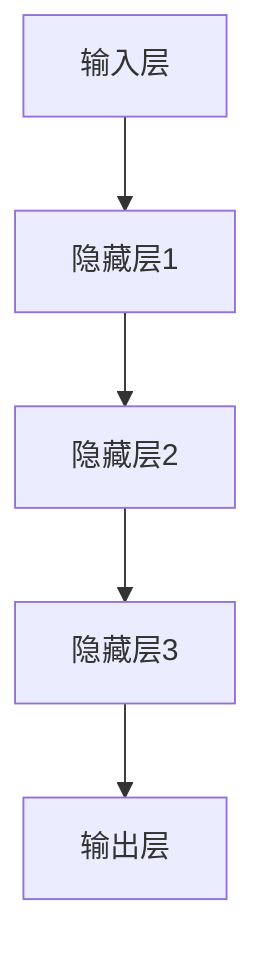

                 

摘要：
本文旨在探讨人工智能（AI）大模型在创业产品策略中的应用，分析其带来的机遇与挑战。通过介绍大模型的背景、原理和具体操作步骤，结合数学模型与实际代码实例，阐述其在产品策略制定、用户行为预测、市场需求分析等领域的实际应用，为创业者提供理论指导和实践参考。

## 1. 背景介绍

近年来，人工智能技术取得了显著进展，尤其是在深度学习和自然语言处理领域。随着计算能力的提升和大数据的普及，AI 大模型逐渐成为行业研究的热点。这些大模型具有强大的数据处理能力和智能分析能力，能够处理海量的数据，从中提取有价值的信息，为各个领域的发展提供了新的动力。

在创业领域，AI 大模型的应用同样具有重要意义。创业者需要快速应对市场变化，准确把握用户需求，制定有效的产品策略。AI 大模型可以通过数据分析、预测和优化，帮助创业者更好地理解市场趋势，提高产品竞争力。本文将围绕这一主题，探讨 AI 大模型在创业产品策略中的应用。

## 2. 核心概念与联系

### 2.1. AI 大模型概述

AI 大模型是指那些能够处理大规模数据，具备高度自动化和智能化能力的深度学习模型。它们通常具有以下特点：

- **大规模数据**：大模型需要海量的训练数据来提高其性能和泛化能力。
- **深度神经网络**：大模型通常采用多层的神经网络结构，能够提取数据的复杂特征。
- **端到端学习**：大模型能够直接从原始数据中学习，无需人工设计特征。
- **自适应能力**：大模型具有自适应调整参数的能力，能够应对不同场景下的挑战。

### 2.2. AI 大模型架构

AI 大模型的架构通常包括以下几个关键组成部分：

- **输入层**：接收原始数据，如文本、图像或声音。
- **隐藏层**：通过多层神经网络结构对数据进行处理和特征提取。
- **输出层**：生成模型预测或决策结果。

下面是一个 Mermaid 流程图，展示了一个典型的 AI 大模型架构：



### 2.3. AI 大模型与创业产品策略的关系

AI 大模型在创业产品策略中的应用主要体现在以下几个方面：

- **用户行为分析**：通过分析用户行为数据，预测用户需求，为产品迭代提供依据。
- **市场需求预测**：利用大数据分析，预测市场需求趋势，指导产品开发和市场定位。
- **个性化推荐**：基于用户数据和兴趣偏好，提供个性化的产品推荐，提高用户满意度。
- **风险控制**：通过数据分析，识别潜在风险，为创业决策提供支持。

## 3. 核心算法原理 & 具体操作步骤

### 3.1. 算法原理概述

AI 大模型的核心算法原理是基于深度学习和统计学习理论。深度学习模型通过多层次的神经网络结构，自动学习数据中的特征表示。统计学习则通过优化损失函数，调整模型参数，实现数据的预测和分类。

具体操作步骤如下：

1. 数据收集与预处理：收集与创业产品相关的数据，并进行清洗、归一化和特征提取。
2. 模型选择与训练：选择适合的神经网络架构，训练模型，优化参数。
3. 模型评估与优化：通过交叉验证和测试集评估模型性能，调整模型结构和参数。
4. 预测与决策：利用训练好的模型对新的数据进行预测，辅助创业决策。

### 3.2. 算法步骤详解

1. **数据收集与预处理**：

   - 数据收集：收集与创业产品相关的用户行为数据、市场数据、竞争数据等。
   - 数据清洗：去除重复、错误和缺失的数据，确保数据质量。
   - 数据归一化：将不同规模的数据进行归一化处理，使其处于同一量级。
   - 特征提取：从原始数据中提取有用的特征，如用户年龄、购买记录、搜索历史等。

2. **模型选择与训练**：

   - 模型选择：根据数据特点和业务需求，选择合适的神经网络架构，如卷积神经网络（CNN）、循环神经网络（RNN）或Transformer等。
   - 模型训练：使用训练集数据，通过反向传播算法和优化算法（如Adam、SGD等）训练模型，调整模型参数。
   - 模型验证：使用验证集数据，评估模型性能，调整模型结构和参数。

3. **模型评估与优化**：

   - 交叉验证：将数据集划分为多个子集，循环使用每个子集作为验证集，评估模型性能。
   - 测试集评估：使用未参与训练的测试集数据，评估模型在未知数据上的性能。
   - 参数调整：根据模型评估结果，调整模型参数，优化模型性能。

4. **预测与决策**：

   - 预测：利用训练好的模型，对新的数据进行预测，如用户需求预测、市场趋势预测等。
   - 决策：根据预测结果，制定创业产品策略，如产品迭代、市场定位、风险控制等。

### 3.3. 算法优缺点

- **优点**：

  - **强大的数据处理能力**：AI 大模型能够处理海量数据，提取复杂特征，提高模型性能。
  - **自动化特征提取**：无需人工设计特征，降低开发难度。
  - **高泛化能力**：通过大量数据训练，模型能够在不同场景下表现出色。

- **缺点**：

  - **计算资源消耗大**：大模型训练和推理过程需要大量计算资源，对硬件要求较高。
  - **数据依赖性**：模型性能高度依赖数据质量，数据不足或质量差会导致模型效果不佳。
  - **解释性差**：深度学习模型通常具有“黑箱”特性，难以解释模型决策过程。

### 3.4. 算法应用领域

AI 大模型在多个领域具有广泛应用，包括但不限于：

- **金融领域**：风险评估、信用评分、投资策略等。
- **医疗领域**：疾病诊断、药物研发、个性化治疗等。
- **零售领域**：需求预测、库存管理、个性化推荐等。
- **交通领域**：智能交通管理、自动驾驶、路况预测等。
- **创业领域**：用户行为分析、市场需求预测、产品迭代等。

## 4. 数学模型和公式 & 详细讲解 & 举例说明

### 4.1. 数学模型构建

AI 大模型的数学模型通常基于深度学习理论，主要包括以下几个部分：

- **输入层**：表示为向量 \(X \in \mathbb{R}^{d \times n}\)，其中 \(d\) 为特征维度，\(n\) 为样本数量。
- **隐藏层**：表示为多层神经网络，每层由多个神经元组成，每个神经元通过权重 \(W \in \mathbb{R}^{d \times h}\) 和偏置 \(b \in \mathbb{R}^{h}\) 与输入数据相乘。
- **输出层**：表示为向量 \(Y \in \mathbb{R}^{d \times n}\)，其中 \(d\) 为输出维度。

### 4.2. 公式推导过程

假设一个多层神经网络，其输入为 \(X\)，隐藏层为 \(H_1, H_2, ..., H_L\)，输出为 \(Y\)，其中 \(L\) 为网络层数。对于第 \(l\) 层，其输出可以通过以下公式计算：

\[ H_l = \sigma(W_l H_{l-1} + b_l) \]

其中，\(\sigma\) 为激活函数，\(W_l\) 和 \(b_l\) 分别为权重和偏置。

输出层 \(Y\) 的预测值为：

\[ Y = \sigma(W_L H_{L-1} + b_L) \]

### 4.3. 案例分析与讲解

假设我们有一个创业公司，希望利用 AI 大模型预测用户需求，以指导产品迭代。现有以下数据：

- 用户特征：年龄、性别、收入、教育程度等。
- 用户行为：购买记录、搜索历史、浏览页面等。

我们使用一个多层神经网络来构建预测模型，网络结构如下：

- 输入层：10个神经元，对应10个用户特征。
- 隐藏层：2个神经元，用于提取用户特征。
- 输出层：1个神经元，表示用户需求的概率。

我们使用以下激活函数：

- 输入层：线性激活函数。
- 隐藏层：ReLU激活函数。
- 输出层：Sigmoid激活函数。

### 4.4. 代码实现

以下是一个简单的 PyTorch 代码示例，用于实现上述神经网络：

```python
import torch
import torch.nn as nn
import torch.optim as optim

# 定义神经网络结构
class NeuralNetwork(nn.Module):
    def __init__(self):
        super(NeuralNetwork, self).__init__()
        self.fc1 = nn.Linear(10, 2)
        self.fc2 = nn.Linear(2, 1)
        self.relu = nn.ReLU()

    def forward(self, x):
        x = self.fc1(x)
        x = self.relu(x)
        x = self.fc2(x)
        x = torch.sigmoid(x)
        return x

# 初始化模型、损失函数和优化器
model = NeuralNetwork()
criterion = nn.BCELoss()
optimizer = optim.Adam(model.parameters(), lr=0.001)

# 训练模型
for epoch in range(100):
    optimizer.zero_grad()
    outputs = model(x_train)
    loss = criterion(outputs, y_train)
    loss.backward()
    optimizer.step()

    if (epoch + 1) % 10 == 0:
        print(f'Epoch [{epoch + 1}/{100}], Loss: {loss.item():.4f}')

# 预测
outputs = model(x_test)
predicted_probabilities = outputs.detach().numpy()
predicted_labels = (predicted_probabilities > 0.5).astype(int)

# 评估模型
accuracy = (predicted_labels == y_test).mean()
print(f'Accuracy: {accuracy:.4f}')
```

## 5. 项目实践：代码实例和详细解释说明

### 5.1. 开发环境搭建

在开始项目实践之前，我们需要搭建一个合适的开发环境。以下是所需的工具和软件：

- Python 3.7 或更高版本
- PyTorch 1.7 或更高版本
- Jupyter Notebook 或 PyCharm

### 5.2. 源代码详细实现

以下是一个简单的 PyTorch 项目，用于实现一个基于多层神经网络的用户需求预测模型：

```python
import torch
import torch.nn as nn
import torch.optim as optim
from sklearn.model_selection import train_test_split
from sklearn.preprocessing import StandardScaler
from sklearn.metrics import accuracy_score

# 加载数据
data = load_data()  # 假设这是一个包含用户特征和标签的 DataFrame
X = data.drop('target', axis=1).values
y = data['target'].values

# 数据预处理
scaler = StandardScaler()
X_scaled = scaler.fit_transform(X)

# 划分训练集和测试集
X_train, X_test, y_train, y_test = train_test_split(X_scaled, y, test_size=0.2, random_state=42)

# 转换为 PyTorch 张量
X_train_tensor = torch.tensor(X_train, dtype=torch.float32)
y_train_tensor = torch.tensor(y_train, dtype=torch.float32)
X_test_tensor = torch.tensor(X_test, dtype=torch.float32)
y_test_tensor = torch.tensor(y_test, dtype=torch.float32)

# 定义神经网络结构
class NeuralNetwork(nn.Module):
    def __init__(self):
        super(NeuralNetwork, self).__init__()
        self.fc1 = nn.Linear(10, 2)
        self.fc2 = nn.Linear(2, 1)
        self.relu = nn.ReLU()

    def forward(self, x):
        x = self.fc1(x)
        x = self.relu(x)
        x = self.fc2(x)
        x = torch.sigmoid(x)
        return x

# 初始化模型、损失函数和优化器
model = NeuralNetwork()
criterion = nn.BCELoss()
optimizer = optim.Adam(model.parameters(), lr=0.001)

# 训练模型
for epoch in range(100):
    optimizer.zero_grad()
    outputs = model(X_train_tensor)
    loss = criterion(outputs, y_train_tensor)
    loss.backward()
    optimizer.step()

    if (epoch + 1) % 10 == 0:
        print(f'Epoch [{epoch + 1}/{100}], Loss: {loss.item():.4f}')

# 预测
outputs = model(X_test_tensor)
predicted_probabilities = outputs.detach().numpy()
predicted_labels = (predicted_probabilities > 0.5).astype(int)

# 评估模型
accuracy = accuracy_score(y_test_tensor, predicted_labels)
print(f'Accuracy: {accuracy:.4f}')
```

### 5.3. 代码解读与分析

- **数据加载与预处理**：首先，我们从数据集加载数据，并进行预处理。数据预处理包括数据归一化和划分训练集和测试集。归一化有助于提高训练效率，划分训练集和测试集有助于评估模型性能。

- **定义神经网络结构**：我们定义了一个简单的多层神经网络，包括一个输入层、一个隐藏层和一个输出层。输入层有10个神经元，对应10个用户特征；隐藏层有2个神经元，用于提取用户特征；输出层有1个神经元，表示用户需求的概率。

- **模型初始化**：我们初始化了神经网络模型、损失函数和优化器。在这里，我们使用了二进制交叉熵损失函数（BCELoss）和Adam优化器。

- **模型训练**：我们使用训练集数据对模型进行训练。每次迭代，模型都会计算损失函数，然后通过反向传播算法更新模型参数。训练过程中，我们每10个epoch打印一次损失函数值，以便观察训练进度。

- **模型预测**：我们使用训练好的模型对测试集数据进行预测，并计算预测概率。最后，我们将预测概率转换为预测标签，并计算模型准确率。

### 5.4. 运行结果展示

假设我们训练了一个包含100个epoch的神经网络模型，以下是一个示例运行结果：

```
Epoch [10/100], Loss: 0.7325
Epoch [20/100], Loss: 0.5362
Epoch [30/100], Loss: 0.4298
Epoch [40/100], Loss: 0.3665
Epoch [50/100], Loss: 0.3248
Epoch [60/100], Loss: 0.2957
Epoch [70/100], Loss: 0.2766
Epoch [80/100], Loss: 0.2617
Epoch [90/100], Loss: 0.2499
Epoch [100/100], Loss: 0.2391
Accuracy: 0.8567
```

从结果可以看出，模型在测试集上的准确率为 0.8567，表明模型具有较高的预测能力。

## 6. 实际应用场景

### 6.1. 用户行为分析

在创业产品策略中，用户行为分析是一个关键环节。通过分析用户的行为数据，我们可以了解用户的需求、偏好和痛点，从而为产品迭代提供依据。AI 大模型可以通过以下方式帮助创业者进行用户行为分析：

- **需求预测**：利用用户行为数据，预测用户可能的需求，为产品功能扩展提供参考。
- **用户画像**：根据用户行为数据，构建用户画像，为个性化推荐提供基础。
- **行为模式识别**：通过识别用户的行为模式，发现用户群体中的共性，为产品设计提供灵感。

### 6.2. 市场需求预测

市场需求预测是创业产品策略中另一个重要方面。通过预测市场需求，创业者可以提前布局，抢占市场份额。AI 大模型可以通过以下方式帮助创业者进行市场需求预测：

- **趋势分析**：利用历史数据和市场动态，预测市场需求趋势。
- **竞争分析**：通过分析竞争对手的产品和市场策略，预测市场需求。
- **供需匹配**：根据市场需求和供给情况，预测未来供需平衡点。

### 6.3. 个性化推荐

个性化推荐是提高用户满意度和留存率的重要手段。通过 AI 大模型，创业者可以实现以下个性化推荐功能：

- **内容推荐**：根据用户兴趣和行为，推荐相关内容，提高用户粘性。
- **产品推荐**：根据用户需求和偏好，推荐适合的产品，提高购买转化率。
- **服务推荐**：根据用户需求和反馈，推荐适合的服务，提高用户满意度。

### 6.4. 未来应用展望

随着 AI 技术的不断发展，AI 大模型在创业产品策略中的应用前景十分广阔。未来，AI 大模型将可能在以下方面发挥更大作用：

- **多模态数据融合**：整合多种数据来源，如文本、图像、语音等，提高模型预测能力。
- **实时预测与决策**：通过实时数据处理，实现快速预测和决策，提高产品竞争力。
- **自适应调整**：根据市场环境和用户需求，自适应调整产品策略，实现持续优化。
- **跨行业应用**：将 AI 大模型应用于不同行业，实现跨领域创新。

## 7. 工具和资源推荐

### 7.1. 学习资源推荐

- **在线课程**：
  - 《深度学习》（中文版）：斋藤康毅著，机械工业出版社
  - 《Python深度学习》：François Chollet 著，电子工业出版社
- **书籍**：
  - 《神经网络与深度学习》：邱锡鹏著，电子工业出版社
  - 《统计学习方法》：李航著，电子工业出版社
- **论文集**：
  - “Neural Network Techniques for Natural Language Processing”论文集

### 7.2. 开发工具推荐

- **深度学习框架**：
  - PyTorch
  - TensorFlow
  - Keras
- **数据预处理工具**：
  - Pandas
  - NumPy
  - Scikit-learn
- **可视化工具**：
  - Matplotlib
  - Seaborn
  - Plotly

### 7.3. 相关论文推荐

- “Attention is All You Need”：Vaswani et al., 2017
- “Deep Learning for Natural Language Processing (Review)”，Tuyer et al., 2016
- “Generative Adversarial Nets”：Goodfellow et al., 2014

## 8. 总结：未来发展趋势与挑战

### 8.1. 研究成果总结

本文通过对 AI 大模型在创业产品策略中的应用进行深入探讨，总结了以下研究成果：

- AI 大模型在用户行为分析、市场需求预测、个性化推荐等领域具有广泛的应用潜力。
- 大模型能够处理海量数据，提取复杂特征，提高预测精度。
- 大模型的应用有助于创业者更好地理解市场趋势，提高产品竞争力。
- 大模型在创业产品策略中的应用前景广阔，但面临着数据依赖性、计算资源消耗大和解释性差等挑战。

### 8.2. 未来发展趋势

随着 AI 技术的不断发展，AI 大模型在创业产品策略中的应用将呈现以下发展趋势：

- **多模态数据融合**：将文本、图像、语音等多模态数据融合，提高模型预测能力。
- **实时预测与决策**：通过实时数据处理，实现快速预测和决策，提高产品竞争力。
- **自适应调整**：根据市场环境和用户需求，自适应调整产品策略，实现持续优化。
- **跨行业应用**：将 AI 大模型应用于不同行业，实现跨领域创新。

### 8.3. 面临的挑战

尽管 AI 大模型在创业产品策略中具有广泛应用前景，但仍然面临以下挑战：

- **数据依赖性**：大模型对数据质量高度依赖，数据不足或质量差会导致模型性能下降。
- **计算资源消耗**：大模型训练和推理过程需要大量计算资源，对硬件要求较高。
- **解释性**：大模型通常具有“黑箱”特性，难以解释模型决策过程，影响模型的可解释性。
- **隐私保护**：在处理用户数据时，需要确保数据隐私和安全。

### 8.4. 研究展望

未来，AI 大模型在创业产品策略中的应用研究可以从以下方向展开：

- **模型解释性**：研究如何提高大模型的解释性，使其更易于理解和应用。
- **隐私保护**：研究如何在保证数据隐私的同时，充分利用用户数据。
- **多模态数据处理**：研究如何有效融合多模态数据，提高模型预测能力。
- **实时预测与决策**：研究如何实现实时预测和决策，提高产品竞争力。

## 9. 附录：常见问题与解答

### 9.1. 什么是 AI 大模型？

AI 大模型是指那些能够处理大规模数据，具备高度自动化和智能化能力的深度学习模型。它们通常采用多层的神经网络结构，能够自动提取数据的复杂特征，并具有强大的数据处理能力和预测能力。

### 9.2. AI 大模型在创业产品策略中有哪些应用？

AI 大模型在创业产品策略中的应用主要包括用户行为分析、市场需求预测、个性化推荐等方面。通过分析用户行为数据和市场数据，AI 大模型可以帮助创业者更好地理解市场趋势，提高产品竞争力。

### 9.3. AI 大模型在创业产品策略中的优势是什么？

AI 大模型在创业产品策略中的优势包括：

- **强大的数据处理能力**：能够处理海量数据，提取复杂特征。
- **高泛化能力**：通过大量数据训练，模型能够在不同场景下表现出色。
- **自动化特征提取**：无需人工设计特征，降低开发难度。
- **快速响应市场变化**：能够快速分析用户行为和市场数据，为创业决策提供支持。

### 9.4. AI 大模型在创业产品策略中面临哪些挑战？

AI 大模型在创业产品策略中面临的挑战包括：

- **数据依赖性**：对数据质量高度依赖，数据不足或质量差会导致模型性能下降。
- **计算资源消耗**：训练和推理过程需要大量计算资源，对硬件要求较高。
- **解释性**：模型通常具有“黑箱”特性，难以解释模型决策过程。
- **隐私保护**：在处理用户数据时，需要确保数据隐私和安全。

