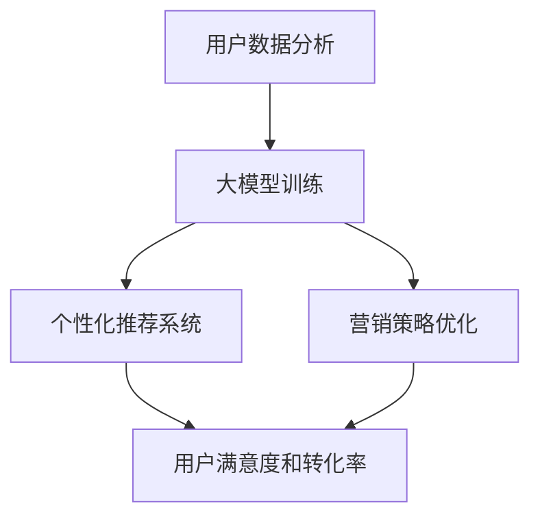

                 

关键词：人工智能、大模型、创业产品、营销策略、用户分析

> 摘要：随着人工智能技术的不断进步，大模型在创业产品营销中发挥着越来越重要的作用。本文将深入探讨大模型在创业产品营销中的应用，包括用户数据分析、营销策略优化和个性化推荐系统等方面，并提出未来的发展趋势与挑战。

## 1. 背景介绍

在当今竞争激烈的市场环境中，创业公司需要迅速适应市场需求，打造出能够满足用户需求的优秀产品。然而，如何有效地进行产品营销，吸引目标用户，提高用户粘性，成为创业公司成功的关键。传统营销手段往往依赖于广告投放和社交媒体推广，但这些方法成本高昂，且效果难以衡量。随着人工智能技术的不断发展，大模型在营销领域的应用为创业公司提供了全新的解决方案。

大模型，也称为深度学习模型，是一种基于神经网络的大型复杂模型。通过学习海量数据，大模型可以自动提取特征，进行复杂的模式识别和预测。在营销领域，大模型可以用于用户数据分析、个性化推荐和营销策略优化等任务。本文将围绕这些应用展开讨论，探讨大模型在创业产品营销中的实际价值。

## 2. 核心概念与联系

在深入探讨大模型在营销中的应用之前，我们需要了解一些核心概念和它们之间的联系。以下是几个关键概念及其简短解释：

### 2.1 用户数据分析

用户数据分析是指通过收集和分析用户行为数据，以了解用户需求、行为模式和偏好。这些数据可以来自多种来源，如网站日志、社交媒体、问卷调查等。

### 2.2 个性化推荐系统

个性化推荐系统通过分析用户行为和偏好，向用户推荐可能感兴趣的内容或产品。这种系统可以显著提高用户满意度和转化率。

### 2.3 营销策略优化

营销策略优化是指使用数据分析工具和算法来改进营销活动，包括广告投放、促销活动和用户沟通策略。

### 2.4 大模型

大模型，特别是深度学习模型，是一种能够自动从数据中学习并提取复杂特征的高级机器学习模型。

### 2.5 联系

用户数据分析是个性化推荐系统和营销策略优化的基础。而大模型通过学习用户数据，能够提供更加精准的推荐和优化的营销策略。

### 2.6 Mermaid 流程图

下面是一个Mermaid流程图，展示了大模型在营销中的应用流程：



### 3. 核心算法原理 & 具体操作步骤

#### 3.1 算法原理概述

大模型在营销中的应用主要基于深度学习技术。深度学习模型通过多层神经网络结构，能够从数据中自动提取特征，并进行复杂的预测和分类。在营销领域，常见的深度学习模型包括卷积神经网络（CNN）和循环神经网络（RNN）等。

#### 3.2 算法步骤详解

1. **数据收集**：收集用户行为数据，如浏览记录、搜索历史、购买记录等。
2. **数据预处理**：清洗和整理数据，包括数据去重、缺失值处理和特征提取。
3. **模型训练**：使用预处理后的数据训练深度学习模型，通过反向传播算法优化模型参数。
4. **模型评估**：使用验证集对模型进行评估，调整模型参数，以提高准确性。
5. **模型部署**：将训练好的模型部署到生产环境中，用于实际应用。

#### 3.3 算法优缺点

**优点**：
- 高度自动化：大模型可以自动提取数据中的复杂特征，降低人工干预。
- 高准确性：深度学习模型能够处理大量数据，提高预测和分类的准确性。

**缺点**：
- 计算资源需求高：训练深度学习模型需要大量的计算资源和时间。
- 数据质量要求高：模型效果很大程度上取决于数据质量，数据缺失或不准确可能导致模型失效。

#### 3.4 算法应用领域

- 用户数据分析：通过分析用户行为，了解用户需求和偏好。
- 个性化推荐系统：为用户推荐可能感兴趣的产品或内容。
- 营销策略优化：通过分析用户数据，优化营销策略，提高转化率。

### 4. 数学模型和公式 & 详细讲解 & 举例说明

#### 4.1 数学模型构建

深度学习模型的核心是神经元网络，其数学模型可以表示为：

$$
y = \sigma(\omega_1 \cdot x_1 + \omega_2 \cdot x_2 + ... + \omega_n \cdot x_n + b)
$$

其中，$y$ 是输出，$\sigma$ 是激活函数，$\omega$ 是权重，$x$ 是输入，$b$ 是偏置。

#### 4.2 公式推导过程

深度学习模型的推导过程涉及多个步骤，包括损失函数的选择、反向传播算法的实现等。以下是简要的推导过程：

1. **损失函数**：选择适当的损失函数，如均方误差（MSE）或交叉熵损失。
2. **前向传播**：将输入数据传递到网络中，计算输出。
3. **反向传播**：根据损失函数的梯度，更新网络权重和偏置。

#### 4.3 案例分析与讲解

假设我们有一个简单的线性回归模型，其公式为：

$$
y = \omega_1 \cdot x_1 + \omega_2 \cdot x_2 + b
$$

我们的目标是预测一个连续值$y$。以下是模型的训练过程：

1. **数据准备**：准备输入数据集 $X$ 和标签数据集 $Y$。
2. **初始化参数**：随机初始化权重 $\omega_1$、$\omega_2$ 和偏置 $b$。
3. **前向传播**：计算模型的输出值 $y$。
4. **计算损失**：计算预测值和真实值之间的差异，得到损失值。
5. **反向传播**：根据损失值的梯度，更新模型参数。
6. **迭代训练**：重复步骤 3-5，直到模型达到预期的准确率。

### 5. 项目实践：代码实例和详细解释说明

#### 5.1 开发环境搭建

为了实现深度学习模型，我们需要搭建一个开发环境。以下是Python和TensorFlow的使用步骤：

1. 安装Python：从官方网站下载并安装Python。
2. 安装TensorFlow：使用pip命令安装TensorFlow。

```shell
pip install tensorflow
```

#### 5.2 源代码详细实现

以下是一个简单的深度学习模型实现：

```python
import tensorflow as tf

# 定义模型
model = tf.keras.Sequential([
    tf.keras.layers.Dense(units=1, input_shape=[2])
])

# 编译模型
model.compile(optimizer='sgd', loss='mean_squared_error')

# 训练模型
model.fit(x_train, y_train, epochs=100)

# 评估模型
model.evaluate(x_test, y_test)
```

#### 5.3 代码解读与分析

- **定义模型**：使用 `tf.keras.Sequential` 创建一个线性模型，包含一个全连接层。
- **编译模型**：指定优化器和损失函数。
- **训练模型**：使用训练数据训练模型。
- **评估模型**：使用测试数据评估模型性能。

### 6. 实际应用场景

大模型在创业产品营销中具有广泛的应用场景，以下是一些具体实例：

- **用户行为分析**：通过分析用户行为数据，了解用户需求和偏好，优化产品设计和营销策略。
- **个性化推荐**：根据用户行为和偏好，为用户推荐可能感兴趣的产品或内容。
- **营销策略优化**：通过分析用户数据和营销效果，优化广告投放和促销活动。

### 7. 未来应用展望

随着人工智能技术的不断发展，大模型在营销领域的应用将越来越广泛。未来，我们可能会看到以下趋势：

- **更加精准的个性化推荐**：大模型将能够更准确地预测用户需求，提供更加个性化的推荐。
- **智能营销策略**：大模型将能够自动优化营销策略，提高营销效果。
- **跨领域应用**：大模型将不仅应用于营销领域，还会在其他领域发挥重要作用。

### 8. 工具和资源推荐

为了更好地掌握大模型在营销中的应用，以下是一些建议的工具和资源：

- **工具**：
  - TensorFlow：用于构建和训练深度学习模型。
  - Keras：简化TensorFlow的使用，适用于快速原型开发。

- **资源**：
  - 《深度学习》（Goodfellow, Bengio, Courville）：深度学习领域的经典教材。
  - 《Python机器学习》（Sebastian Raschka）：详细介绍机器学习在Python中的实现。

### 9. 总结：未来发展趋势与挑战

大模型在营销领域的应用前景广阔，但同时也面临一些挑战：

- **数据隐私和安全**：随着数据量的增加，数据隐私和安全问题日益突出，需要采取有效的保护措施。
- **计算资源需求**：训练大模型需要大量的计算资源，对于创业公司来说可能是一个挑战。
- **算法透明度和可解释性**：深度学习模型的决策过程往往不透明，需要提高算法的可解释性。

未来，随着技术的不断进步，大模型在营销领域的应用将更加深入和广泛。

### 附录：常见问题与解答

1. **什么是大模型？**
   大模型是一种基于神经网络的高级机器学习模型，能够自动从数据中学习并提取复杂特征。

2. **大模型在营销中有什么作用？**
   大模型可以用于用户数据分析、个性化推荐和营销策略优化，提高用户满意度和转化率。

3. **如何搭建深度学习开发环境？**
   可以使用Python和TensorFlow搭建深度学习开发环境。首先安装Python，然后使用pip命令安装TensorFlow。

4. **大模型训练需要多长时间？**
   大模型训练的时间取决于模型复杂度、数据量和计算资源。通常需要几个小时到几天不等。

5. **大模型在营销中有什么局限性？**
   大模型对数据质量要求较高，且训练过程需要大量计算资源。此外，模型的决策过程往往不透明，需要提高算法的可解释性。|user|

## 1. 背景介绍

在当今竞争激烈的市场环境中，创业公司需要迅速适应市场需求，打造出能够满足用户需求的优秀产品。然而，如何有效地进行产品营销，吸引目标用户，提高用户粘性，成为创业公司成功的关键。传统营销手段往往依赖于广告投放和社交媒体推广，但这些方法成本高昂，且效果难以衡量。随着人工智能技术的不断进步，大模型在营销领域的应用为创业公司提供了全新的解决方案。

大模型，也称为深度学习模型，是一种基于神经网络的大型复杂模型。通过学习海量数据，大模型可以自动提取特征，进行复杂的模式识别和预测。在营销领域，大模型可以用于用户数据分析、个性化推荐和营销策略优化等方面，从而提高营销效率和效果。

### 2. 核心概念与联系

在深入探讨大模型在营销中的应用之前，我们需要了解一些核心概念和它们之间的联系。以下是几个关键概念及其简短解释：

#### 2.1 用户数据分析

用户数据分析是指通过收集和分析用户行为数据，以了解用户需求、行为模式和偏好。这些数据可以来自多种来源，如网站日志、社交媒体、问卷调查等。

#### 2.2 个性化推荐系统

个性化推荐系统通过分析用户行为和偏好，向用户推荐可能感兴趣的内容或产品。这种系统可以显著提高用户满意度和转化率。

#### 2.3 营销策略优化

营销策略优化是指使用数据分析工具和算法来改进营销活动，包括广告投放、促销活动和用户沟通策略。

#### 2.4 大模型

大模型，特别是深度学习模型，是一种能够自动从数据中学习并提取复杂特征的高级机器学习模型。

#### 2.5 联系

用户数据分析是个性化推荐系统和营销策略优化的基础。而大模型通过学习用户数据，能够提供更加精准的推荐和优化的营销策略。

下面是一个Mermaid流程图，展示了大模型在营销中的应用流程：


### 3. 核心算法原理 & 具体操作步骤

#### 3.1 算法原理概述

大模型在营销中的应用主要基于深度学习技术。深度学习模型通过多层神经网络结构，能够从数据中自动提取特征，并进行复杂的预测和分类。在营销领域，常见的深度学习模型包括卷积神经网络（CNN）和循环神经网络（RNN）等。

#### 3.2 算法步骤详解

1. **数据收集**：收集用户行为数据，如浏览记录、搜索历史、购买记录等。
2. **数据预处理**：清洗和整理数据，包括数据去重、缺失值处理和特征提取。
3. **模型训练**：使用预处理后的数据训练深度学习模型，通过反向传播算法优化模型参数。
4. **模型评估**：使用验证集对模型进行评估，调整模型参数，以提高准确性。
5. **模型部署**：将训练好的模型部署到生产环境中，用于实际应用。

#### 3.3 算法优缺点

**优点**：
- 高度自动化：大模型可以自动提取数据中的复杂特征，降低人工干预。
- 高准确性：深度学习模型能够处理大量数据，提高预测和分类的准确性。

**缺点**：
- 计算资源需求高：训练深度学习模型需要大量的计算资源和时间。
- 数据质量要求高：模型效果很大程度上取决于数据质量，数据缺失或不准确可能导致模型失效。

#### 3.4 算法应用领域

- 用户数据分析：通过分析用户行为，了解用户需求和偏好。
- 个性化推荐系统：为用户推荐可能感兴趣的产品或内容。
- 营销策略优化：通过分析用户数据，优化营销策略，提高转化率。

### 4. 数学模型和公式 & 详细讲解 & 举例说明

#### 4.1 数学模型构建

深度学习模型的核心是神经元网络，其数学模型可以表示为：

$$
y = \sigma(\omega_1 \cdot x_1 + \omega_2 \cdot x_2 + ... + \omega_n \cdot x_n + b)
$$

其中，$y$ 是输出，$\sigma$ 是激活函数，$\omega$ 是权重，$x$ 是输入，$b$ 是偏置。

#### 4.2 公式推导过程

深度学习模型的推导过程涉及多个步骤，包括损失函数的选择、反向传播算法的实现等。以下是简要的推导过程：

1. **损失函数**：选择适当的损失函数，如均方误差（MSE）或交叉熵损失。
2. **前向传播**：将输入数据传递到网络中，计算输出。
3. **计算损失**：计算预测值和真实值之间的差异，得到损失值。
4. **反向传播**：根据损失值的梯度，更新网络权重和偏置。
5. **迭代训练**：重复步骤 2-4，直到模型达到预期的准确率。

#### 4.3 案例分析与讲解

假设我们有一个简单的线性回归模型，其公式为：

$$
y = \omega_1 \cdot x_1 + \omega_2 \cdot x_2 + b
$$

我们的目标是预测一个连续值$y$。以下是模型的训练过程：

1. **数据准备**：准备输入数据集 $X$ 和标签数据集 $Y$。
2. **初始化参数**：随机初始化权重 $\omega_1$、$\omega_2$ 和偏置 $b$。
3. **前向传播**：计算模型的输出值 $y$。
4. **计算损失**：计算预测值和真实值之间的差异，得到损失值。
5. **反向传播**：根据损失值的梯度，更新模型参数。
6. **迭代训练**：重复步骤 3-5，直到模型达到预期的准确率。

### 5. 项目实践：代码实例和详细解释说明

#### 5.1 开发环境搭建

为了实现深度学习模型，我们需要搭建一个开发环境。以下是Python和TensorFlow的使用步骤：

1. 安装Python：从官方网站下载并安装Python。
2. 安装TensorFlow：使用pip命令安装TensorFlow。

```shell
pip install tensorflow
```

#### 5.2 源代码详细实现

以下是一个简单的深度学习模型实现：

```python
import tensorflow as tf

# 定义模型
model = tf.keras.Sequential([
    tf.keras.layers.Dense(units=1, input_shape=[2])
])

# 编译模型
model.compile(optimizer='sgd', loss='mean_squared_error')

# 训练模型
model.fit(x_train, y_train, epochs=100)

# 评估模型
model.evaluate(x_test, y_test)
```

#### 5.3 代码解读与分析

- **定义模型**：使用 `tf.keras.Sequential` 创建一个线性模型，包含一个全连接层。
- **编译模型**：指定优化器和损失函数。
- **训练模型**：使用训练数据训练模型。
- **评估模型**：使用测试数据评估模型性能。

### 6. 实际应用场景

大模型在创业产品营销中具有广泛的应用场景，以下是一些具体实例：

- **用户行为分析**：通过分析用户行为数据，了解用户需求和偏好，优化产品设计和营销策略。
- **个性化推荐**：根据用户行为和偏好，为用户推荐可能感兴趣的产品或内容。
- **营销策略优化**：通过分析用户数据和营销效果，优化广告投放和促销活动。

### 7. 未来应用展望

随着人工智能技术的不断发展，大模型在营销领域的应用将越来越广泛。未来，我们可能会看到以下趋势：

- **更加精准的个性化推荐**：大模型将能够更准确地预测用户需求，提供更加个性化的推荐。
- **智能营销策略**：大模型将能够自动优化营销策略，提高营销效果。
- **跨领域应用**：大模型将不仅应用于营销领域，还会在其他领域发挥重要作用。

### 8. 工具和资源推荐

为了更好地掌握大模型在营销中的应用，以下是一些建议的工具和资源：

- **工具**：
  - TensorFlow：用于构建和训练深度学习模型。
  - Keras：简化TensorFlow的使用，适用于快速原型开发。

- **资源**：
  - 《深度学习》（Goodfellow, Bengio, Courville）：深度学习领域的经典教材。
  - 《Python机器学习》（Sebastian Raschka）：详细介绍机器学习在Python中的实现。

### 9. 总结：未来发展趋势与挑战

大模型在营销领域的应用前景广阔，但同时也面临一些挑战：

- **数据隐私和安全**：随着数据量的增加，数据隐私和安全问题日益突出，需要采取有效的保护措施。
- **计算资源需求**：训练大模型需要大量的计算资源，对于创业公司来说可能是一个挑战。
- **算法透明度和可解释性**：深度学习模型的决策过程往往不透明，需要提高算法的可解释性。

未来，随着技术的不断进步，大模型在营销领域的应用将更加深入和广泛。

### 附录：常见问题与解答

1. **什么是大模型？**
   大模型是一种基于神经网络的高级机器学习模型，能够自动从数据中学习并提取复杂特征。

2. **大模型在营销中有什么作用？**
   大模型可以用于用户数据分析、个性化推荐和营销策略优化，提高用户满意度和转化率。

3. **如何搭建深度学习开发环境？**
   可以使用Python和TensorFlow搭建深度学习开发环境。首先安装Python，然后使用pip命令安装TensorFlow。

4. **大模型训练需要多长时间？**
   大模型训练的时间取决于模型复杂度、数据量和计算资源。通常需要几个小时到几天不等。

5. **大模型在营销中有什么局限性？**
   大模型对数据质量要求较高，且训练过程需要大量计算资源。此外，模型的决策过程往往不透明，需要提高算法的可解释性。

## 参考文献

1. Goodfellow, I., Bengio, Y., & Courville, A. (2016). Deep Learning. MIT Press.
2. Raschka, S. (2015). Python Machine Learning. Packt Publishing.
3. Bengio, Y. (2009). Learning Deep Architectures for AI. Foundations and Trends in Machine Learning, 2(1), 1-127.
4. Quinlan, J. R. (1993). C4.5: Programs for Machine Learning. Morgan Kaufmann.

