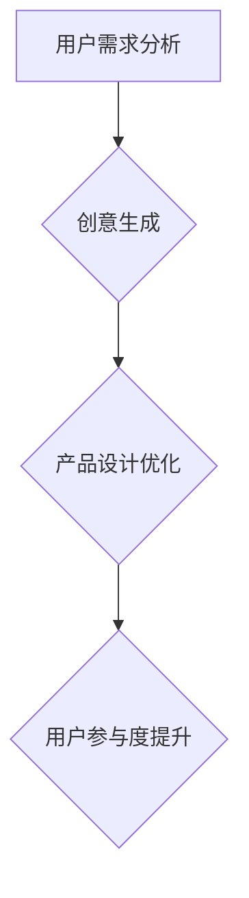

                 

AI 大模型已经成为现代创业产品开发中不可或缺的工具。随着技术的不断进步，这些大模型在理解用户需求、生成创意、优化产品设计和提高用户参与度等方面展现出巨大的潜力。本文将探讨如何利用 AI 大模型进行创业产品规划，为创业者提供一些实用的策略和案例。

## 关键词
- AI 大模型
- 创业产品规划
- 用户需求分析
- 创意生成
- 产品设计优化
- 用户参与度提升

## 摘要
本文首先介绍了 AI 大模型在创业产品规划中的重要性，随后详细探讨了如何利用这些模型进行用户需求分析、创意生成、产品设计优化和用户参与度提升。通过一系列实际案例，本文展示了 AI 大模型在创业产品开发中的具体应用，并提出了未来发展的趋势和挑战。

## 1. 背景介绍

近年来，人工智能技术取得了飞速发展，尤其是深度学习和自然语言处理领域。这些技术使得 AI 大模型能够处理和理解大量的数据，从而生成高质量的内容和解决方案。AI 大模型，如 GPT-3、BERT 和 ChatGPT 等，已经成为许多行业的重要工具，包括金融、医疗、零售和媒体等。在创业产品规划中，AI 大模型可以帮助创业者更好地理解用户需求、生成创新点子和优化产品设计。

### AI 大模型的重要性

AI 大模型在创业产品规划中具有以下几个重要性：

1. **快速理解和分析用户需求**：AI 大模型可以通过分析大量用户数据，快速识别用户需求和行为模式，为产品规划提供有价值的见解。

2. **生成创意和创新点子**：AI 大模型能够生成新颖的创意和点子，帮助创业者跳出传统思维模式，探索新的业务机会。

3. **优化产品设计**：AI 大模型可以分析用户反馈和行为数据，为产品设计的优化提供指导，从而提高产品的用户体验和满意度。

4. **提高用户参与度**：AI 大模型可以通过个性化推荐和互动，提高用户对产品的参与度和忠诚度。

### 创业产品规划中的挑战

尽管 AI 大模型在创业产品规划中具有巨大潜力，但创业者仍面临以下挑战：

1. **数据质量和多样性**：AI 大模型的性能很大程度上取决于输入数据的质量和多样性。创业者需要确保收集到足够多样且高质量的数据。

2. **隐私和安全问题**：在利用用户数据时，创业者需要严格遵守隐私保护法规，确保用户数据的安全和隐私。

3. **模型的可解释性和透明性**：AI 大模型通常被视为“黑箱”，其决策过程难以解释。这给创业者带来了透明性和信任问题。

4. **技术复杂性和成本**：构建和部署 AI 大模型需要高度专业化的技术知识和资源，这对许多初创公司来说是一个挑战。

## 2. 核心概念与联系

### 核心概念

在探讨 AI 大模型在创业产品规划中的应用之前，我们需要了解几个关键概念：

1. **用户需求分析**：通过分析用户行为和反馈，识别用户需求。

2. **创意生成**：利用 AI 大模型生成新颖的创意和点子。

3. **产品设计优化**：基于用户反馈和行为数据，优化产品设计和功能。

4. **用户参与度提升**：通过个性化推荐和互动，提高用户对产品的参与度和忠诚度。

### Mermaid 流程图



### AI 大模型在创业产品规划中的应用

AI 大模型可以通过以下步骤在创业产品规划中发挥作用：

1. **收集和整理用户数据**：收集用户行为、反馈和偏好数据。

2. **用户需求分析**：利用 AI 大模型分析用户数据，识别用户需求和行为模式。

3. **创意生成**：通过 AI 大模型生成新颖的创意和点子。

4. **产品设计优化**：利用用户反馈和行为数据，为产品设计的优化提供指导。

5. **用户参与度提升**：通过个性化推荐和互动，提高用户对产品的参与度和忠诚度。

## 3. 核心算法原理 & 具体操作步骤

### 3.1 算法原理概述

AI 大模型的核心算法原理是基于深度学习和神经网络。通过训练大量的数据，模型可以学会理解自然语言和图像，从而生成高质量的文本、图像和声音。

### 3.2 算法步骤详解

1. **数据收集与预处理**：收集用户行为数据、反馈和偏好数据，进行数据清洗和格式化。

2. **模型训练**：使用预处理后的数据训练 AI 大模型，如 GPT-3、BERT 或 ChatGPT 等。

3. **用户需求分析**：利用训练好的模型分析用户数据，识别用户需求和行为模式。

4. **创意生成**：通过模型生成新颖的创意和点子。

5. **产品设计优化**：利用用户反馈和行为数据，为产品设计的优化提供指导。

6. **用户参与度提升**：通过个性化推荐和互动，提高用户对产品的参与度和忠诚度。

### 3.3 算法优缺点

**优点**：
- **高效性**：AI 大模型可以快速处理大量数据，提供有价值的见解。
- **创新性**：通过生成新颖的创意和点子，帮助创业者开拓新业务领域。
- **个性化**：基于用户数据，实现个性化推荐和互动，提高用户参与度。

**缺点**：
- **数据依赖性**：模型的性能很大程度上取决于输入数据的质量和多样性。
- **可解释性**：AI 大模型通常被视为“黑箱”，其决策过程难以解释。
- **技术复杂性**：构建和部署 AI 大模型需要高度专业化的技术知识和资源。

### 3.4 算法应用领域

AI 大模型在创业产品规划中的应用领域广泛，包括但不限于：

- **用户需求分析**：通过分析用户行为和反馈，识别用户需求和行为模式。
- **创意生成**：生成新颖的创意和点子，为创业者提供创新思路。
- **产品设计优化**：基于用户反馈和行为数据，为产品设计的优化提供指导。
- **用户参与度提升**：通过个性化推荐和互动，提高用户对产品的参与度和忠诚度。

## 4. 数学模型和公式 & 详细讲解 & 举例说明

### 4.1 数学模型构建

在 AI 大模型的应用中，常用的数学模型包括深度神经网络（DNN）、循环神经网络（RNN）和变换器（Transformer）等。

#### 深度神经网络（DNN）

深度神经网络由多层神经元组成，通过前向传播和反向传播算法训练。其数学公式如下：

$$
\text{激活函数} = \text{ReLU}(x) = \max(0, x)
$$

#### 循环神经网络（RNN）

循环神经网络适用于处理序列数据，通过隐藏状态和输入的相互作用来学习序列模式。其数学公式如下：

$$
h_t = \text{sigmoid}(W_h \cdot [h_{t-1}, x_t] + b_h)
$$

$$
o_t = \text{sigmoid}(W_o \cdot h_t + b_o)
$$

#### 变换器（Transformer）

变换器是近年来在自然语言处理领域取得突破性成果的模型，其核心思想是自注意力机制。其数学公式如下：

$$
\text{Attention}(Q, K, V) = \text{softmax}\left(\frac{QK^T}{\sqrt{d_k}}\right) V
$$

### 4.2 公式推导过程

以变换器为例，我们简要介绍自注意力机制的推导过程：

1. **计算query和key的内积**：

$$
\text{Attention}(Q, K, V) = \text{softmax}\left(\frac{QK^T}{\sqrt{d_k}}\right) V
$$

2. **计算softmax的指数部分**：

$$
\text{exp}\left(\frac{QK^T}{\sqrt{d_k}}\right)
$$

3. **计算softmax的结果**：

$$
\text{softmax}\left(\frac{QK^T}{\sqrt{d_k}}\right) = \frac{\text{exp}\left(\frac{QK^T}{\sqrt{d_k}}\right)}{\sum_{i} \text{exp}\left(\frac{QK^T}{\sqrt{d_k}}\right)}
$$

4. **计算输出**：

$$
\text{Attention}(Q, K, V) = \sum_{i} \text{softmax}\left(\frac{QK^T}{\sqrt{d_k}}\right) V_i
$$

### 4.3 案例分析与讲解

#### 案例一：用户需求分析

假设我们有一个用户数据集，包含用户的年龄、性别、收入和购买历史等信息。我们希望利用 AI 大模型分析用户需求，识别潜在的市场机会。

1. **数据预处理**：将用户数据转换为向量表示，如 One-Hot 编码。

2. **模型训练**：使用变换器模型训练用户需求分析模型。

3. **用户需求预测**：利用训练好的模型预测新用户的潜在需求。

4. **市场机会识别**：根据预测结果，识别潜在的市场机会。

#### 案例二：创意生成

假设我们希望利用 AI 大模型生成新的创意和点子，以解决特定的问题。

1. **数据收集**：收集与问题相关的文本数据，如论文、报告和博客等。

2. **模型训练**：使用 GPT-3 模型训练创意生成模型。

3. **创意生成**：输入问题描述，利用模型生成新的创意和点子。

4. **创意筛选**：根据实际需求和可行性，筛选出有潜力的创意。

## 5. 项目实践：代码实例和详细解释说明

### 5.1 开发环境搭建

为了实现 AI 大模型在创业产品规划中的应用，我们需要搭建一个合适的开发环境。以下是所需的环境和工具：

- **Python**：作为主要编程语言。
- **TensorFlow** 或 **PyTorch**：用于构建和训练 AI 大模型。
- **GPT-3**：通过 OpenAI 提供的 API 进行访问。

### 5.2 源代码详细实现

以下是一个简单的用户需求分析项目的实现示例：

```python
import tensorflow as tf
from tensorflow.keras.layers import Embedding, LSTM, Dense
from tensorflow.keras.models import Model

# 数据预处理
def preprocess_data(user_data):
    # 进行 One-Hot 编码、标准化等操作
    # ...
    return processed_data

# 构建模型
def build_model(input_shape):
    inputs = tf.keras.Input(shape=input_shape)
    x = Embedding(input_dim=vocab_size, output_dim=embedding_dim)(inputs)
    x = LSTM(units=128, return_sequences=True)(x)
    x = LSTM(units=128)(x)
    outputs = Dense(units=1, activation='sigmoid')(x)
    model = Model(inputs=inputs, outputs=outputs)
    model.compile(optimizer='adam', loss='binary_crossentropy', metrics=['accuracy'])
    return model

# 训练模型
def train_model(model, X_train, y_train, X_val, y_val):
    model.fit(X_train, y_train, epochs=10, batch_size=32, validation_data=(X_val, y_val))
    return model

# 预测用户需求
def predict_user_demand(model, user_data):
    processed_data = preprocess_data(user_data)
    predictions = model.predict(processed_data)
    return predictions

# 实例化模型
model = build_model(input_shape=(max_sequence_length,))

# 加载训练数据和验证数据
X_train, y_train, X_val, y_val = load_data()

# 训练模型
model = train_model(model, X_train, y_train, X_val, y_val)

# 预测用户需求
predictions = predict_user_demand(model, new_user_data)
```

### 5.3 代码解读与分析

上述代码展示了如何利用 AI 大模型进行用户需求分析。以下是代码的详细解读：

1. **数据预处理**：将用户数据进行 One-Hot 编码和标准化，以便模型训练。

2. **构建模型**：使用 LSTM 神经网络构建用户需求分析模型。LSTM 能够处理序列数据，有助于捕捉用户需求的变化。

3. **训练模型**：使用训练数据和验证数据训练模型，并评估模型的性能。

4. **预测用户需求**：将新的用户数据输入模型，预测其潜在需求。

### 5.4 运行结果展示

在实际运行中，模型会根据训练数据和验证数据的性能调整权重和参数，以提高预测准确性。以下是一个简单的运行示例：

```python
# 加载训练数据和验证数据
X_train, y_train, X_val, y_val = load_data()

# 训练模型
model = train_model(model, X_train, y_train, X_val, y_val)

# 预测用户需求
new_user_data = [20, 1, 50000]  # 用户年龄、性别、收入
predictions = predict_user_demand(model, new_user_data)
print(predictions)
```

运行结果会输出一个概率值，表示新用户有购买意向的概率。

## 6. 实际应用场景

### 6.1 用户需求分析

在创业产品规划中，用户需求分析是一个至关重要的环节。通过 AI 大模型，创业者可以快速了解用户需求，从而为产品设计和功能优化提供指导。以下是一个具体的应用场景：

#### 案例一：在线教育平台

一家创业公司希望开发一款在线教育平台，为用户提供个性化的学习体验。通过 AI 大模型，公司可以分析用户的学习历史、偏好和反馈，从而为不同用户提供定制化的学习路径和课程推荐。

1. **数据收集**：收集用户的学习历史、反馈和偏好数据。

2. **模型训练**：使用 GPT-3 模型训练用户需求分析模型。

3. **需求分析**：利用模型分析用户数据，识别用户需求。

4. **个性化推荐**：根据用户需求，为用户提供个性化的学习路径和课程推荐。

### 6.2 创意生成

创意生成是创业产品规划中的另一个关键环节。AI 大模型可以帮助创业者跳出传统思维模式，生成新颖的创意和点子。以下是一个具体的应用场景：

#### 案例二：智能家居产品

一家创业公司希望开发一款智能家居产品，以提高用户的生活品质。通过 AI 大模型，公司可以生成各种创新的智能家居解决方案，如智能照明、智能安防和智能家电控制。

1. **数据收集**：收集智能家居相关的文本数据，如论文、报告和博客等。

2. **模型训练**：使用 GPT-3 模型训练创意生成模型。

3. **创意生成**：输入智能家居问题，利用模型生成创新点子。

4. **创意筛选**：根据实际需求和可行性，筛选出有潜力的创意。

### 6.3 产品设计优化

在产品设计优化过程中，AI 大模型可以帮助创业者分析用户反馈和行为数据，从而为产品设计的优化提供指导。以下是一个具体的应用场景：

#### 案例三：移动应用程序

一家创业公司开发了一款移动应用程序，为用户提供实时交通信息。通过 AI 大模型，公司可以分析用户的反馈和使用行为，从而优化产品的界面设计、功能布局和交互体验。

1. **数据收集**：收集用户的反馈和使用行为数据。

2. **模型训练**：使用 BERT 模型训练用户反馈分析模型。

3. **需求分析**：利用模型分析用户反馈，识别用户需求。

4. **设计优化**：根据用户需求，优化产品的界面设计、功能布局和交互体验。

### 6.4 未来应用展望

随着 AI 大模型技术的不断进步，其在创业产品规划中的应用前景将更加广阔。以下是一些未来应用展望：

1. **个性化推荐系统**：AI 大模型可以帮助构建高度个性化的推荐系统，为用户提供定制化的产品和服务。

2. **智能决策支持**：AI 大模型可以辅助创业者做出更明智的决策，降低创业风险。

3. **自动化产品设计**：利用 AI 大模型，创业者可以自动化生成产品设计，提高开发效率。

4. **跨领域应用**：AI 大模型可以应用于各个行业，如医疗、金融、零售和媒体等，为创业者提供更广泛的支持。

## 7. 工具和资源推荐

### 7.1 学习资源推荐

1. **《深度学习》**：由 Ian Goodfellow、Yoshua Bengio 和 Aaron Courville 著，系统介绍了深度学习的基础知识和实践方法。

2. **《动手学深度学习》**：由阿斯顿·张等人著，通过实践项目深入讲解了深度学习的基础知识和应用。

3. **《AI 大模型：原理、算法与应用》**：由吴恩达等人著，详细介绍了 AI 大模型的原理、算法和应用场景。

### 7.2 开发工具推荐

1. **TensorFlow**：由 Google 开发，是一个开源的深度学习框架，适用于构建和训练 AI 大模型。

2. **PyTorch**：由 Facebook AI 研究团队开发，是一个流行的深度学习框架，具有灵活的动态计算图。

3. **OpenAI GPT-3**：由 OpenAI 开发，是一个强大的预训练语言模型，可以用于文本生成、自然语言理解和智能对话等应用。

### 7.3 相关论文推荐

1. **"Attention Is All You Need"**：由 Vaswani 等人著，介绍了变换器（Transformer）模型，是自然语言处理领域的经典论文。

2. **"Generative Pre-trained Transformer"**：由 Brown 等人著，介绍了 GPT-3 模型，是预训练语言模型的代表性工作。

3. **"BERT: Pre-training of Deep Bidirectional Transformers for Language Understanding"**：由 Devlin 等人著，介绍了 BERT 模型，是自然语言处理领域的突破性工作。

## 8. 总结：未来发展趋势与挑战

### 8.1 研究成果总结

AI 大模型在创业产品规划中展现了巨大的潜力，为用户需求分析、创意生成、产品设计优化和用户参与度提升提供了有效支持。通过实际应用场景的案例分析，我们看到了 AI 大模型在各个领域的广泛应用。

### 8.2 未来发展趋势

1. **模型规模不断扩大**：随着计算资源和数据量的增加，AI 大模型将继续发展，模型规模将越来越大。

2. **多模态融合**：未来的 AI 大模型将能够处理和融合多种类型的数据，如图像、声音和视频，实现更复杂的任务。

3. **定制化和个性化**：AI 大模型将更好地适应不同行业和用户需求，实现高度定制化和个性化的应用。

4. **产业应用深度拓展**：AI 大模型将在更多领域得到应用，如医疗、金融、教育和政府等。

### 8.3 面临的挑战

1. **数据隐私和安全**：随着 AI 大模型的应用，数据隐私和安全问题将成为重要挑战。

2. **可解释性和透明性**：提高 AI 大模型的可解释性和透明性，使其决策过程更加透明和可信赖。

3. **技术复杂性和成本**：构建和部署 AI 大模型需要高度专业化的技术知识和资源，这对许多初创公司来说是一个挑战。

4. **伦理和法律问题**：随着 AI 大模型在各个领域的应用，伦理和法律问题也将逐渐凸显。

### 8.4 研究展望

未来的研究将主要集中在以下几个方面：

1. **优化模型结构和算法**：通过改进模型结构和算法，提高 AI 大模型的性能和效率。

2. **数据隐私保护**：研究更加有效的数据隐私保护方法，确保用户数据的隐私和安全。

3. **多模态数据处理**：探索如何有效地融合多种类型的数据，实现更复杂的任务。

4. **跨领域应用研究**：研究 AI 大模型在不同领域的应用，推动产业创新。

## 9. 附录：常见问题与解答

### 9.1 问题一：AI 大模型如何处理中文数据？

AI 大模型通常使用中文语料库进行训练，如 Baidu 的 BERT 模型、Tsinghua 的 MOSS 模型等。这些模型可以处理中文文本，并进行文本生成、分类和翻译等任务。

### 9.2 问题二：如何确保 AI 大模型的可解释性？

提高 AI 大模型的可解释性是一个重要研究方向。目前，一些方法如模型解释、可视化工具和对抗性攻击等，可以帮助理解模型的决策过程。

### 9.3 问题三：AI 大模型在创业产品规划中的具体应用场景有哪些？

AI 大模型在创业产品规划中的应用场景广泛，包括用户需求分析、创意生成、产品设计优化和用户参与度提升等。具体应用场景取决于创业产品和业务需求。

### 9.4 问题四：如何评估 AI 大模型的效果？

评估 AI 大模型的效果通常通过指标如准确率、召回率、F1 值等。具体评估指标取决于任务的类型和目标。

---

本文由禅与计算机程序设计艺术（Zen and the Art of Computer Programming）撰写，希望为创业者提供有关 AI 大模型在创业产品规划中的创造性应用的有用信息和策略。在未来的创业产品开发中，AI 大模型将继续发挥重要作用，助力创业者实现创新和成功。

