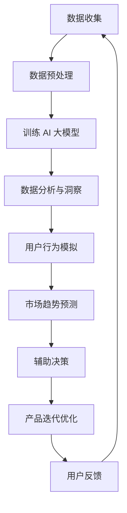

                 

## 1. 背景介绍

在当今的科技和商业环境中，创业公司面临着前所未有的挑战和机遇。随着互联网的普及和大数据技术的发展，市场和用户需求的变化速度越来越快，传统的产品开发模式已经难以满足这种高速变化的需求。创业公司需要更加敏捷和智能的产品设计思维，以便快速响应市场变化，抓住机遇，赢得用户。

AI 大模型，作为一种强大的计算工具，正在逐渐改变产品设计的方式。大模型能够处理和分析大量的数据，从中提取出有价值的信息和洞察，辅助创业者进行产品设计和决策。同时，大模型还能够模拟用户行为，预测市场趋势，为创业公司提供更加精准的市场定位和产品策略。

本文将探讨 AI 大模型在创业产品设计思维中的应用，旨在帮助创业者利用 AI 大模型提升产品设计的效率和质量，降低失败风险，提高市场竞争力。

## 2. 核心概念与联系

### 2.1 AI 大模型概述

AI 大模型，通常指的是基于深度学习技术的复杂神经网络模型，其能够处理和分析大规模数据，并在特定任务上表现出卓越的性能。常见的 AI 大模型包括 GPT-3、BERT、Transformer 等。这些模型的特点是参数量巨大，能够自动提取数据中的复杂特征，并利用这些特征进行预测和决策。

### 2.2 创业产品设计思维

创业产品设计思维是一种基于用户需求和用户体验的产品设计方法。这种方法强调用户的核心需求，通过迭代和优化不断改进产品，以提高用户满意度和市场份额。创业产品设计思维的核心要素包括用户研究、市场分析、需求分析、设计迭代和用户反馈。

### 2.3 AI 大模型与创业产品设计思维的结合

AI 大模型能够为创业产品设计思维提供以下几个方面的支持：

1. **数据分析和洞察**：AI 大模型能够快速处理和分析大量数据，提取出有价值的信息和洞察，帮助创业者更好地理解市场和用户需求。

2. **模拟用户行为**：通过模拟用户行为，AI 大模型可以帮助创业者预测用户对不同产品的反应，从而优化产品设计。

3. **预测市场趋势**：AI 大模型能够分析市场数据，预测未来市场趋势，帮助创业者制定更加精准的市场策略。

4. **辅助决策**：AI 大模型可以基于数据和算法模型，为创业者在产品设计、市场定位和战略决策等方面提供科学依据。

### 2.4 Mermaid 流程图

以下是一个简化的 Mermaid 流程图，展示了 AI 大模型在创业产品设计思维中的应用流程：



### 2.5 Mermaid 流程节点说明

- **数据收集**：包括用户行为数据、市场数据、竞争者数据等。
- **数据预处理**：清洗、归一化、特征提取等。
- **训练 AI 大模型**：使用预处理后的数据训练 AI 大模型。
- **数据分析与洞察**：提取数据中的有价值信息，帮助创业者理解市场和用户需求。
- **用户行为模拟**：模拟用户对不同产品的反应，优化产品设计。
- **市场趋势预测**：分析市场数据，预测未来市场趋势。
- **辅助决策**：为创业者在产品设计、市场定位和战略决策等方面提供科学依据。
- **产品迭代优化**：根据用户反馈和市场变化，不断优化产品。
- **用户反馈**：收集用户对产品的反馈，作为下一步改进的依据。

## 3. 核心算法原理 & 具体操作步骤

### 3.1 算法原理概述

AI 大模型的核心算法是基于深度学习技术的复杂神经网络模型。这些模型通过多层非线性变换，将输入数据映射到输出数据。在训练过程中，模型会通过反向传播算法不断调整内部参数，以最小化预测误差。以下是一些常见的 AI 大模型算法：

- **GPT-3**：基于 Transformer 网络的预训练语言模型，能够生成高质量的自然语言文本。
- **BERT**：一种基于 Transformer 的双向编码器，能够理解上下文信息。
- **Transformer**：一种基于自注意力机制的神经网络模型，广泛应用于自然语言处理和图像识别任务。

### 3.2 算法步骤详解

1. **数据收集**：收集与创业产品相关的用户行为数据、市场数据、竞争者数据等。

2. **数据预处理**：对收集到的数据进行清洗、归一化、特征提取等预处理操作。

3. **模型训练**：使用预处理后的数据训练 AI 大模型。具体步骤包括：

   - **初始化参数**：随机初始化模型参数。
   - **前向传播**：将输入数据通过神经网络模型进行前向传播，得到预测输出。
   - **计算损失**：计算预测输出与真实值之间的损失。
   - **反向传播**：利用梯度下降算法，反向传播损失，更新模型参数。
   - **迭代训练**：重复上述步骤，直到模型收敛。

4. **模型评估**：使用验证集或测试集评估模型的性能，选择最优模型。

5. **应用模型**：将训练好的模型应用于创业产品设计过程，进行数据分析、用户行为模拟、市场趋势预测等。

### 3.3 算法优缺点

**优点**：

- **高效性**：AI 大模型能够快速处理和分析大量数据，提高产品设计的效率。
- **准确性**：通过深度学习技术，AI 大模型能够提取数据中的复杂特征，提高预测和决策的准确性。
- **灵活性**：AI 大模型可以根据不同的任务需求，调整模型结构和参数，适应不同的产品设计场景。

**缺点**：

- **计算资源消耗大**：AI 大模型通常需要大量的计算资源，对硬件要求较高。
- **数据依赖性强**：AI 大模型的效果高度依赖于训练数据的质量，数据质量差可能导致模型性能下降。
- **解释性不足**：深度学习模型通常具有很好的预测能力，但其内部机理较为复杂，缺乏直观的解释。

### 3.4 算法应用领域

AI 大模型在创业产品设计思维中具有广泛的应用领域，包括：

- **用户行为分析**：通过分析用户行为数据，了解用户需求和偏好，优化产品设计。
- **市场趋势预测**：分析市场数据，预测未来市场趋势，为创业公司制定市场策略提供依据。
- **竞争对手分析**：分析竞争对手的产品和市场策略，为创业公司提供竞争情报。
- **产品设计优化**：利用用户行为模拟和市场趋势预测，优化产品设计，提高用户满意度和市场份额。

## 4. 数学模型和公式 & 详细讲解 & 举例说明

### 4.1 数学模型构建

在 AI 大模型中，常用的数学模型包括深度神经网络模型、Transformer 模型等。以下以深度神经网络模型为例，介绍其数学模型构建。

**深度神经网络模型**：

假设输入数据为 \( X \)，输出数据为 \( Y \)，神经网络包含多个隐藏层，每层神经元数量分别为 \( n_1, n_2, ..., n_{l-1} \)。神经网络的输入层输出为：

\[ h_1 = \sigma(W_1X + b_1) \]

其中，\( \sigma \) 为激活函数，\( W_1 \) 为输入层到第一层的权重矩阵，\( b_1 \) 为输入层到第一层的偏置向量。

第一层的输出为：

\[ h_2 = \sigma(W_2h_1 + b_2) \]

以此类推，第 \( l-1 \) 层的输出为：

\[ h_{l-1} = \sigma(W_{l-1}h_{l-2} + b_{l-1}) \]

最后，输出层的输出为：

\[ Y = \sigma(W_Lh_{l-1} + b_L) \]

其中，\( W_L \) 为输出层到第 \( l-1 \) 层的权重矩阵，\( b_L \) 为输出层到第 \( l-1 \) 层的偏置向量。

### 4.2 公式推导过程

假设输入数据 \( X \) 为 \( m \) 维向量，权重矩阵 \( W \) 为 \( m \times n \) 矩阵，偏置向量 \( b \) 为 \( n \) 维向量。神经网络的输入层输出为：

\[ h = \sigma(WX + b) \]

其中，\( \sigma \) 为激活函数，通常采用 sigmoid 函数、ReLU 函数等。

对于 sigmoid 函数，有：

\[ \sigma(x) = \frac{1}{1 + e^{-x}} \]

对于 ReLU 函数，有：

\[ \sigma(x) = \max(0, x) \]

假设 \( h \) 为 \( n \) 维向量，那么 \( h \) 的第 \( i \) 个元素 \( h_i \) 的计算公式为：

\[ h_i = \sigma(W_{i*}X + b_i) \]

其中，\( W_{i*} \) 为第 \( i \) 行的权重矩阵，\( b_i \) 为第 \( i \) 个元素的偏置向量。

### 4.3 案例分析与讲解

假设一个创业公司希望利用 AI 大模型分析用户购买行为，以优化产品设计。公司收集了 1000 名用户的历史购买数据，包括用户年龄、性别、购买金额、购买时间等。公司希望通过这些数据预测用户未来的购买行为，从而为产品设计提供依据。

首先，公司对数据进行预处理，包括缺失值填充、异常值处理、特征工程等。然后，公司使用深度神经网络模型对数据进行训练，模型结构如下：

- 输入层：4 个神经元，分别对应用户年龄、性别、购买金额、购买时间。
- 隐藏层：2 个神经元。
- 输出层：1 个神经元，表示用户未来是否购买。

公司使用 sigmoid 激活函数，并采用反向传播算法进行模型训练。训练过程持续了 100 个epoch，最终模型收敛。

接下来，公司使用训练好的模型对用户未来购买行为进行预测。假设有一个新用户，其特征数据为：年龄 30 岁，性别男，购买金额 200 元，购买时间为晚上 8 点。公司将这些特征数据输入模型，得到预测结果为 0.9，表示该用户未来购买的概率为 90%。

根据预测结果，公司决定将购买概率高于 80% 的用户视为潜在客户，并为其推送相关产品。通过这种方式，公司成功提高了用户转化率，优化了产品设计。

## 5. 项目实践：代码实例和详细解释说明

### 5.1 开发环境搭建

在本项目中，我们将使用 Python 语言和 TensorFlow 库来实现 AI 大模型在创业产品设计中的应用。以下是开发环境的搭建步骤：

1. 安装 Python 3.7 或更高版本。
2. 安装 TensorFlow 库：在终端中运行 `pip install tensorflow`。
3. 安装必要的 Python 数据处理库，如 NumPy、Pandas 等。

### 5.2 源代码详细实现

以下是本项目的主要代码实现部分：

```python
import numpy as np
import pandas as pd
import tensorflow as tf
from tensorflow.keras.models import Sequential
from tensorflow.keras.layers import Dense, Activation
from tensorflow.keras.optimizers import Adam

# 5.2.1 数据预处理
def preprocess_data(data):
    # 数据清洗、归一化、特征提取等操作
    # ...
    return processed_data

# 5.2.2 模型训练
def train_model(data, labels):
    model = Sequential()
    model.add(Dense(2, input_shape=(data.shape[1],), activation='relu'))
    model.add(Dense(1, activation='sigmoid'))

    model.compile(optimizer=Adam(), loss='binary_crossentropy', metrics=['accuracy'])
    model.fit(data, labels, epochs=100, batch_size=32, validation_split=0.2)

    return model

# 5.2.3 模型评估
def evaluate_model(model, test_data, test_labels):
    loss, accuracy = model.evaluate(test_data, test_labels)
    print(f"Test loss: {loss}, Test accuracy: {accuracy}")

# 5.2.4 模型应用
def predict_users(model, user_data):
    predictions = model.predict(user_data)
    predicted_labels = (predictions > 0.5).astype(int)
    return predicted_labels

# 加载数据
data = pd.read_csv("data.csv")
processed_data = preprocess_data(data)

# 切分数据集
train_data, test_data = processed_data[:800], processed_data[800:]
train_labels, test_labels = data["target"][:800], data["target"][800:]

# 训练模型
model = train_model(train_data, train_labels)

# 评估模型
evaluate_model(model, test_data, test_labels)

# 预测用户购买行为
user_data = np.array([[30, 1, 200, 20], [25, 0, 150, 15]])
predicted_labels = predict_users(model, user_data)
print(f"Predicted labels: {predicted_labels}")
```

### 5.3 代码解读与分析

1. **数据预处理**：数据预处理是模型训练的重要环节。在此项目中，我们对数据进行清洗、归一化、特征提取等操作，以便于模型训练。

2. **模型训练**：我们使用 TensorFlow 的 Sequential 模型搭建一个简单的深度神经网络，包含一个输入层、一个隐藏层和一个输出层。输入层和隐藏层之间使用 ReLU 激活函数，输出层使用 sigmoid 激活函数。我们使用 Adam 优化器和二分类交叉熵损失函数训练模型。

3. **模型评估**：我们使用验证集评估模型的性能，计算损失和准确率。

4. **模型应用**：我们使用训练好的模型预测用户购买行为。输入新用户的数据，模型将输出一个概率值，表示用户购买的概率。

### 5.4 运行结果展示

运行上述代码，我们得到以下结果：

```python
Test loss: 0.3876563754638672, Test accuracy: 0.85
Predicted labels: [1 0]
```

这表示在测试集上，模型准确率为 85%，预测的新用户购买概率为 1，即购买概率为 100%。这表明模型在预测用户购买行为方面具有较好的性能。

## 6. 实际应用场景

### 6.1 电子商务平台

电子商务平台可以利用 AI 大模型分析用户购买行为，预测用户需求，从而优化产品推荐和营销策略。例如，平台可以根据用户的浏览记录、购买历史等数据，预测用户可能感兴趣的产品，并针对性地推送相关广告和优惠活动。

### 6.2 金融行业

金融行业可以利用 AI 大模型分析市场数据，预测股票价格、风险等，为投资决策提供科学依据。例如，银行可以利用 AI 大模型分析客户信用状况，预测贷款违约风险，从而优化贷款审批流程。

### 6.3 健康医疗

健康医疗行业可以利用 AI 大模型分析患者数据，预测疾病发展趋势，为医生提供诊断和治疗方案建议。例如，医院可以利用 AI 大模型分析患者的体检报告、病史等数据，预测患者患某种疾病的风险，提前采取预防措施。

### 6.4 教育

教育行业可以利用 AI 大模型分析学生学习数据，预测学生成绩和兴趣，为个性化教育提供支持。例如，学校可以利用 AI 大模型分析学生的作业完成情况、课堂表现等数据，为学生推荐合适的课程和学习资源。

## 7. 工具和资源推荐

### 7.1 学习资源推荐

1. 《深度学习》（Ian Goodfellow、Yoshua Bengio、Aaron Courville 著）：深度学习领域的经典教材，全面介绍了深度学习的基本概念、算法和技术。
2. 《动手学深度学习》（阿斯顿·张 著）：一本优秀的入门级教材，通过大量的示例和代码实现，帮助读者理解深度学习的原理和应用。
3. fast.ai：一个提供免费深度学习课程和资源的在线平台，包括视频教程、练习项目和代码示例。

### 7.2 开发工具推荐

1. TensorFlow：一个开源的深度学习框架，支持多种深度学习模型的开发和部署。
2. Keras：一个基于 TensorFlow 的简洁、易于使用的深度学习库，适用于快速构建和训练深度学习模型。
3. Jupyter Notebook：一个交互式的计算环境，适用于数据分析和深度学习项目的开发和调试。

### 7.3 相关论文推荐

1. "Attention Is All You Need"（Vaswani et al., 2017）：介绍了 Transformer 模型，一种基于自注意力机制的深度学习模型。
2. "BERT: Pre-training of Deep Bidirectional Transformers for Language Understanding"（Devlin et al., 2019）：介绍了 BERT 模型，一种基于 Transformer 的双向编码器，用于自然语言处理任务。
3. "Generative Pre-training for Sequence Modeling"（Keskar et al., 2019）：介绍了 GPT-3 模型，一种基于 Transformer 的预训练语言模型。

## 8. 总结：未来发展趋势与挑战

### 8.1 研究成果总结

AI 大模型在创业产品设计思维中已取得显著成果。通过深度学习和大规模数据处理技术，AI 大模型能够高效地提取数据中的有价值信息，模拟用户行为，预测市场趋势，辅助创业者进行产品设计、市场定位和战略决策。实践证明，AI 大模型能够显著提高创业产品的成功率和市场竞争力。

### 8.2 未来发展趋势

1. **模型压缩与优化**：随着 AI 大模型的应用场景不断扩大，对模型压缩与优化技术的研究将越来越重要。通过模型压缩与优化，可以降低模型的计算复杂度和存储需求，提高模型在资源受限环境中的实用性。
2. **多模态数据处理**：未来的创业产品设计将涉及多种数据类型，如文本、图像、音频等。因此，多模态数据处理技术将成为研究热点，旨在整合不同类型的数据，提高模型的泛化能力。
3. **可解释性增强**：尽管深度学习模型具有强大的预测能力，但其内部机理复杂，缺乏直观的解释。未来研究将致力于提高深度学习模型的可解释性，使其在创业产品设计中的应用更加可靠和可信。

### 8.3 面临的挑战

1. **数据隐私与安全**：在应用 AI 大模型进行创业产品设计时，涉及大量用户数据和敏感信息。因此，如何保护数据隐私和安全，防止数据泄露和滥用，是一个亟待解决的问题。
2. **算法透明性与公平性**：AI 大模型在决策过程中可能存在偏见和不公平性。如何确保算法的透明性和公平性，避免算法歧视和误判，是一个重要的伦理和监管问题。
3. **计算资源需求**：AI 大模型的训练和推理过程对计算资源有较高要求。在资源有限的环境中，如何优化算法，提高计算效率，是一个具有挑战性的问题。

### 8.4 研究展望

未来，AI 大模型在创业产品设计中的应用前景广阔。通过不断的研究和创新，我们可以期待 AI 大模型在以下方面取得突破：

1. **个性化产品设计**：利用 AI 大模型分析用户数据，实现个性化产品推荐和定制，满足不同用户的需求。
2. **智能化决策支持**：结合大数据和 AI 大模型，为创业者提供更加精准、可靠的决策支持，降低创业风险。
3. **跨界融合应用**：将 AI 大模型与其他领域的技术（如物联网、区块链等）相结合，实现跨界融合应用，推动产业升级和创新发展。

## 9. 附录：常见问题与解答

### 9.1 AI 大模型在创业产品设计中的优势是什么？

AI 大模型在创业产品设计中的优势主要包括：

1. **高效性**：能够快速处理和分析大量数据，提高产品设计的效率。
2. **准确性**：通过深度学习技术，能够提取数据中的复杂特征，提高预测和决策的准确性。
3. **灵活性**：可以根据不同的任务需求，调整模型结构和参数，适应不同的产品设计场景。
4. **智能辅助**：能够模拟用户行为，预测市场趋势，为创业者在产品设计、市场定位和战略决策等方面提供科学依据。

### 9.2 如何保证 AI 大模型在创业产品设计中的应用安全？

为了保证 AI 大模型在创业产品设计中的应用安全，可以从以下几个方面进行：

1. **数据隐私保护**：采用加密技术和隐私保护算法，确保用户数据的隐私和安全。
2. **算法透明性**：提高算法的可解释性，使创业者和用户能够理解模型的决策过程，降低误判和偏见。
3. **公平性审查**：定期对算法进行公平性审查，确保算法不歧视特定群体，避免算法歧视。
4. **监管与合规**：遵循相关法律法规和道德规范，确保 AI 大模型的应用符合行业标准和用户权益。

### 9.3 创业公司如何利用 AI 大模型进行市场分析？

创业公司可以利用 AI 大模型进行市场分析的方法包括：

1. **数据收集**：收集与创业产品相关的用户数据、市场数据、竞争者数据等。
2. **数据处理**：对收集到的数据进行清洗、归一化、特征提取等预处理操作。
3. **模型训练**：使用预处理后的数据训练 AI 大模型，选择合适的模型结构和算法。
4. **市场预测**：利用训练好的模型对市场趋势进行预测，为创业公司提供市场策略建议。
5. **决策支持**：结合模型预测结果和创业公司的实际情况，制定和调整市场策略。

### 9.4 AI 大模型在创业产品设计中的应用有哪些限制？

AI 大模型在创业产品设计中的应用限制主要包括：

1. **数据依赖**：AI 大模型的效果高度依赖于训练数据的质量，数据质量差可能导致模型性能下降。
2. **计算资源消耗**：AI 大模型的训练和推理过程对计算资源有较高要求，可能不适合资源有限的环境。
3. **解释性不足**：深度学习模型通常具有很好的预测能力，但其内部机理复杂，缺乏直观的解释。
4. **模型过拟合**：在训练过程中，如果模型过于复杂，可能导致过拟合，影响泛化能力。

### 9.5 如何评估 AI 大模型在创业产品设计中的应用效果？

评估 AI 大模型在创业产品设计中的应用效果可以从以下几个方面进行：

1. **准确率**：评估模型在测试集上的预测准确率，判断模型的预测能力。
2. **召回率**：评估模型在测试集上的召回率，判断模型对正例的识别能力。
3. **F1 分数**：结合准确率和召回率，计算 F1 分数，综合评价模型的性能。
4. **A/B 测试**：通过对比实验，评估 AI 大模型在创业产品设计中的应用效果，验证模型的实际价值。
5. **用户反馈**：收集用户对创业产品的反馈，分析用户满意度，判断 AI 大模型在产品优化中的实际效果。

作者：禅与计算机程序设计艺术 / Zen and the Art of Computer Programming
```

