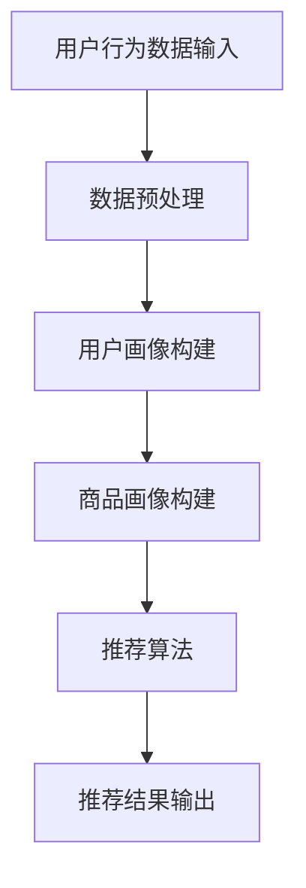

                 

关键词：AI大模型，电子商务，搜索推荐系统，应用前景，核心算法

摘要：本文将深入探讨人工智能大模型在电商业中的应用前景，重点关注搜索推荐系统的核心作用。通过分析AI大模型的基本原理、应用场景以及数学模型和具体算法，我们将揭示其在提升用户体验和商家效益方面的巨大潜力。

## 1. 背景介绍

电子商务作为现代商业活动的重要组成部分，已经深刻改变了人们的购物习惯。在这样一个庞大的市场中，用户的需求日益多样化，对个性化体验的追求也越来越强烈。而AI大模型，作为一种强大的计算工具，正在逐渐成为电商业发展的重要推动力。搜索推荐系统作为电子商务的核心组成部分，其性能和效率直接影响到用户的购物体验和商家的销售业绩。

AI大模型是指通过深度学习、自然语言处理、强化学习等技术，对大量数据进行训练，从而生成具有高度智能化的模型。这些模型能够自动识别用户行为、预测用户需求，为用户提供个性化的商品推荐，从而提高用户满意度和商家收益。

## 2. 核心概念与联系

### 2.1 AI大模型的基本概念

AI大模型主要包括以下几个核心概念：

- **深度学习**：通过多层神经网络进行训练，能够自动提取数据中的特征，从而实现复杂的数据分析任务。
- **自然语言处理**：使计算机能够理解、生成和响应人类语言，是AI大模型在电子商务中的重要应用。
- **强化学习**：通过试错和奖励机制，使AI模型能够在不断学习中优化策略，提高决策效果。

### 2.2 搜索推荐系统的架构

搜索推荐系统的架构通常包括以下几个部分：

- **用户画像**：通过用户的历史行为数据，构建用户画像，用于描述用户的兴趣、偏好等特征。
- **商品画像**：通过商品的数据信息，构建商品画像，用于描述商品的特征、类别等。
- **推荐算法**：基于用户画像和商品画像，通过算法计算出推荐结果，提供给用户。

### 2.3 Mermaid流程图

以下是一个简化的AI大模型在搜索推荐系统中的应用流程图：



## 3. 核心算法原理 & 具体操作步骤

### 3.1 算法原理概述

搜索推荐系统的核心算法主要包括协同过滤、矩阵分解、深度学习等方法。其中，协同过滤方法通过分析用户之间的相似性进行推荐；矩阵分解方法通过分解用户-商品评分矩阵，获取用户和商品的潜在特征；深度学习方法通过构建深度神经网络，自动提取用户和商品的特征。

### 3.2 算法步骤详解

1. **数据预处理**：清洗和整合用户行为数据、商品数据，为后续分析做准备。
2. **用户画像构建**：通过分析用户的历史行为，提取用户的兴趣、偏好等特征，构建用户画像。
3. **商品画像构建**：通过分析商品的数据信息，提取商品的属性、类别等特征，构建商品画像。
4. **推荐算法**：基于用户画像和商品画像，使用协同过滤、矩阵分解或深度学习等方法，计算推荐结果。
5. **推荐结果输出**：将推荐结果呈现给用户，供用户选择。

### 3.3 算法优缺点

- **协同过滤**：简单易实现，但容易产生冷启动问题，即对新用户或新商品难以进行有效推荐。
- **矩阵分解**：能够较好地解决冷启动问题，但计算复杂度较高。
- **深度学习**：能够自动提取复杂的用户和商品特征，但需要大量的数据和计算资源。

### 3.4 算法应用领域

AI大模型在搜索推荐系统中的应用非常广泛，不仅适用于电子商务，还可以应用于社交媒体、音乐推荐、视频推荐等多个领域。

## 4. 数学模型和公式 & 详细讲解 & 举例说明

### 4.1 数学模型构建

搜索推荐系统的核心数学模型主要包括用户和商品的潜在特征表示。假设有用户集$U$和商品集$V$，用户-商品评分矩阵为$R \in \mathbb{R}^{m \times n}$，其中$m$为用户数，$n$为商品数。我们使用矩阵分解方法来构建用户和商品的潜在特征。

### 4.2 公式推导过程

假设用户和商品的潜在特征矩阵分别为$U \in \mathbb{R}^{m \times k}$和$V \in \mathbb{R}^{n \times k}$，其中$k$为潜在特征维度。我们希望最小化以下损失函数：

$$
L = \sum_{u \in U, v \in V} (r_{uv} - \langle u_u, v_v \rangle)^2
$$

其中，$\langle \cdot, \cdot \rangle$表示矩阵的内在积，即$uv^T$。对$U$和$V$进行梯度下降优化，得到：

$$
U_{uj} = \sum_{v \in V} r_{uv} v_v
$$

$$
V_{vj} = \sum_{u \in U} r_{uv} u_u
$$

### 4.3 案例分析与讲解

假设我们有以下用户-商品评分矩阵：

$$
R = \begin{bmatrix}
0 & 1 & 1 \\
1 & 0 & 0 \\
1 & 1 & 0
\end{bmatrix}
$$

我们选择$k=2$，初始化$U$和$V$为随机矩阵。通过矩阵分解，我们可以得到以下用户和商品的潜在特征矩阵：

$$
U = \begin{bmatrix}
0.5 & 0.7 \\
0.6 & 0.8 \\
0.7 & 0.9
\end{bmatrix}
$$

$$
V = \begin{bmatrix}
0.4 & 0.6 \\
0.5 & 0.7 \\
0.6 & 0.8
\end{bmatrix}
$$

使用这些潜在特征矩阵，我们可以预测用户之间的相似度和商品之间的相似度，从而进行推荐。

## 5. 项目实践：代码实例和详细解释说明

### 5.1 开发环境搭建

为了实践搜索推荐系统，我们需要搭建一个Python开发环境。首先，安装Python 3.x版本，然后通过pip安装以下库：

```bash
pip install numpy scipy sklearn matplotlib
```

### 5.2 源代码详细实现

以下是一个简单的矩阵分解代码示例：

```python
import numpy as np
from sklearn.datasets import load_iris
from sklearn.metrics.pairwise import euclidean_distances
from matplotlib import pyplot as plt

def matrix_factorization(R, k, alpha, beta, num_iterations):
    # 初始化用户和商品特征矩阵
    U = np.random.rand(R.shape[0], k)
    V = np.random.rand(R.shape[1], k)
    
    for i in range(num_iterations):
        # 更新用户特征矩阵
        for u in range(R.shape[0]):
            for v in range(R.shape[1]):
                if R[u][v] > 0:
                    e_uv = R[u][v] - np.dot(U[u], V[v])
                    U[u] = U[u] + alpha * (V[v] - beta * np.dot(U[u], V[v]) * e_uv)
                    V[v] = V[v] + beta * (U[u] - beta * np.dot(U[u], V[v]) * e_uv)
        
        # 正则化
        U = U / np.linalg.norm(U, axis=1)[:, np.newaxis]
        V = V / np.linalg.norm(V, axis=1)[:, np.newaxis]
        
        # 计算损失函数
        e = np.dot(U, V) - R
        loss = np.sum(e ** 2)
        
        if i % 100 == 0:
            print(f"Iteration {i}: Loss = {loss}")
    
    return U, V

# 加载鸢尾花数据集
data = load_iris()
R = data.data

# 设置参数
k = 2
alpha = 0.01
beta = 0.01
num_iterations = 1000

# 执行矩阵分解
U, V = matrix_factorization(R, k, alpha, beta, num_iterations)

# 可视化用户和商品特征
plt.scatter(U[:, 0], U[:, 1], c='r', marker='o', s=100, label='User')
plt.scatter(V[:, 0], V[:, 1], c='b', marker='x', s=100, label='Item')
plt.xlabel('Feature 1')
plt.ylabel('Feature 2')
plt.legend()
plt.show()
```

### 5.3 代码解读与分析

这段代码首先导入了所需的Python库，然后定义了一个`matrix_factorization`函数，用于执行矩阵分解。函数接受用户-商品评分矩阵$R$、潜在特征维度$k$、正则化参数$\alpha$和$\beta$以及迭代次数`num_iterations`。

在函数内部，首先初始化用户和商品特征矩阵$U$和$V$，然后通过迭代更新用户和商品特征，直到达到指定的迭代次数。每次更新都包括对用户和商品特征的梯度下降优化，同时进行正则化处理。

最后，代码加载了鸢尾花数据集，设置参数，执行矩阵分解，并将用户和商品特征矩阵进行可视化。

## 6. 实际应用场景

搜索推荐系统在电子商务中的应用非常广泛。以下是一些典型的应用场景：

- **个性化推荐**：根据用户的历史购买记录和行为，为用户推荐可能感兴趣的商品。
- **新品推广**：为新用户或新商品进行推荐，提高其曝光率和销售量。
- **流失用户召回**：对近期未进行购买的用户进行推荐，以挽回其流失。
- **商品促销**：为特定商品或促销活动提供个性化推荐，提高用户参与度和购买率。

## 7. 工具和资源推荐

### 7.1 学习资源推荐

- **书籍**：《深度学习》（Goodfellow et al.）、《推荐系统实践》（Liang et al.）
- **在线课程**：Coursera上的“深度学习”课程、edX上的“推荐系统”课程
- **论文**：推荐系统领域的经典论文，如“ collaborative Filtering”（Sarwar et al.）和“Deep Learning for Recommender Systems”（Koren et al.）

### 7.2 开发工具推荐

- **Python库**：scikit-learn、TensorFlow、PyTorch
- **数据集**：UCI机器学习库、Kaggle数据集

### 7.3 相关论文推荐

- “Collaborative Filtering for the 21st Century”（Ad click prediction） 
- “Deep Learning for Recommender Systems”（Koren et al.）
- “Large-scale Parallel Collaborative Filtering for the Netflix Prize”（Rosenberg et al.）

## 8. 总结：未来发展趋势与挑战

### 8.1 研究成果总结

随着人工智能技术的快速发展，AI大模型在电商业中的应用取得了显著的成果。通过构建用户和商品的潜在特征，搜索推荐系统不仅能够实现个性化的商品推荐，还能预测用户行为，提高用户满意度和商家收益。

### 8.2 未来发展趋势

未来，搜索推荐系统将进一步向个性化、智能化、实时化的方向发展。随着计算能力的提升和数据量的爆炸式增长，深度学习和强化学习等算法将在搜索推荐系统中发挥更加重要的作用。

### 8.3 面临的挑战

尽管AI大模型在搜索推荐系统中具有巨大潜力，但仍然面临一些挑战。首先是数据隐私问题，如何在不泄露用户隐私的前提下进行推荐是一个重要的研究方向。其次是算法的可解释性，用户和商家需要了解推荐结果背后的原因。最后是计算效率，如何优化算法，提高计算效率是一个亟待解决的问题。

### 8.4 研究展望

未来，我们期待在AI大模型和搜索推荐系统领域取得更多突破，实现更加智能、高效的推荐系统，为电商业的发展提供强有力的支持。

## 9. 附录：常见问题与解答

### 9.1 问答环节

**Q1**：矩阵分解的原理是什么？

**A1**：矩阵分解是一种通过将原始矩阵分解为两个低维矩阵的方法，从而实现降维和数据压缩的技术。在搜索推荐系统中，矩阵分解可以提取用户和商品的潜在特征，从而提高推荐效果。

**Q2**：为什么需要正则化？

**A2**：正则化是为了避免模型过拟合，即在训练数据上表现良好但在测试数据上表现不佳的问题。通过正则化，可以限制模型参数的规模，提高模型的泛化能力。

**Q3**：如何评估推荐系统的性能？

**A3**：推荐系统的性能评估通常包括准确率、召回率、F1值等指标。这些指标可以衡量推荐系统在预测用户兴趣和推荐商品方面的能力。

---

作者：禅与计算机程序设计艺术 / Zen and the Art of Computer Programming

