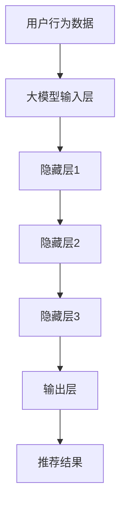

                 

关键词：AI 大模型，电商推荐系统，用户体验，深度学习，个性化推荐

> 摘要：本文将探讨 AI 大模型在电商推荐系统中的应用，分析其提高用户体验的关键作用。文章将介绍大模型的基本原理，阐述其在推荐系统中的关键角色，并结合实际案例，深入讲解大模型在电商推荐系统中的应用效果和未来发展趋势。

## 1. 背景介绍

随着互联网的飞速发展，电子商务已成为人们生活中不可或缺的一部分。电商平台的竞争日益激烈，如何提高用户体验，提升用户粘性，成为各大电商平台关注的焦点。推荐系统作为一种有效的用户行为预测工具，能够为用户推荐感兴趣的商品，从而提高用户满意度，增加销售机会。

传统的推荐系统主要采用基于内容过滤和协同过滤的方法。然而，这些方法在处理复杂用户行为数据和高维度商品特征时，往往面临挑战。近年来，随着深度学习技术的快速发展，AI 大模型在推荐系统中的应用逐渐受到关注。大模型具有强大的特征提取和表示能力，能够更好地理解用户行为和商品特征，从而提高推荐效果。

## 2. 核心概念与联系

### 2.1 大模型的基本原理

大模型是指具有大规模参数和复杂结构的深度学习模型。通常，大模型由多个层次组成，包括输入层、隐藏层和输出层。输入层接收用户行为数据、商品特征等输入信息，隐藏层通过多层非线性变换，提取特征信息，输出层根据提取的特征，生成推荐结果。

### 2.2 大模型在推荐系统中的关键角色

在电商推荐系统中，大模型扮演着以下几个关键角色：

- **特征提取**：大模型能够自动从原始数据中提取有价值的特征，降低数据维度，提高特征表示的抽象程度。

- **用户行为预测**：大模型通过学习用户的历史行为数据，预测用户未来的兴趣和偏好，从而实现个性化推荐。

- **商品特征表示**：大模型能够为商品生成高维度的特征向量，使得商品之间的相似性关系更加明确，有助于提高推荐效果。

### 2.3 Mermaid 流程图



## 3. 核心算法原理 & 具体操作步骤

### 3.1 算法原理概述

AI 大模型在推荐系统中的应用主要基于深度学习技术。深度学习模型通过多层神经网络结构，对大量数据进行训练，从而学习到用户行为和商品特征的复杂关系。在推荐过程中，大模型首先接收用户行为数据和商品特征作为输入，然后通过多层非线性变换，提取特征信息，最后输出推荐结果。

### 3.2 算法步骤详解

1. **数据预处理**：对用户行为数据和商品特征进行清洗、归一化等预处理操作，确保数据质量。

2. **模型构建**：设计并构建深度学习模型，包括输入层、隐藏层和输出层。选择合适的神经网络结构、优化器和损失函数。

3. **模型训练**：使用训练数据对深度学习模型进行训练，优化模型参数，提高推荐效果。

4. **模型评估**：使用验证数据评估模型性能，包括准确率、召回率、F1 值等指标。

5. **模型部署**：将训练好的模型部署到生产环境中，实现实时推荐。

### 3.3 算法优缺点

**优点**：

- **强大的特征提取能力**：大模型能够自动从原始数据中提取有价值特征，降低数据维度，提高特征表示的抽象程度。

- **良好的预测性能**：大模型通过深度学习技术，能够学习到用户行为和商品特征的复杂关系，提高推荐准确率。

- **可扩展性**：大模型可以处理大规模用户和商品数据，适应不同规模的电商推荐系统。

**缺点**：

- **计算资源消耗大**：大模型训练和推理过程需要大量的计算资源，对硬件设施要求较高。

- **模型解释性差**：深度学习模型通常具有较深的网络结构，难以直观地理解模型决策过程。

### 3.4 算法应用领域

AI 大模型在电商推荐系统中的应用已取得显著成效。除了电商推荐系统，大模型还可以应用于其他领域，如视频推荐、音乐推荐、社交网络推荐等。随着深度学习技术的不断发展，大模型在推荐系统中的应用将越来越广泛。

## 4. 数学模型和公式 & 详细讲解 & 举例说明

### 4.1 数学模型构建

在电商推荐系统中，大模型的数学模型通常包括以下部分：

- **用户行为矩阵**：表示用户对商品的评分或购买行为。

- **商品特征矩阵**：表示商品的属性和特征。

- **模型参数**：包括权重、偏置等。

### 4.2 公式推导过程

假设用户行为矩阵为 \( U \in \mathbb{R}^{m \times n} \)，商品特征矩阵为 \( V \in \mathbb{R}^{n \times k} \)，模型参数为 \( \theta \in \mathbb{R}^{k} \)。则大模型的输出可以表示为：

$$
R = U^T V \theta
$$

其中，\( R \in \mathbb{R}^{m \times n} \) 表示预测的用户评分矩阵。

### 4.3 案例分析与讲解

以亚马逊电商推荐系统为例，假设用户行为矩阵为：

$$
U = \begin{bmatrix}
0 & 1 & 0 & 1 \\
1 & 0 & 1 & 0 \\
0 & 1 & 1 & 0 \\
\end{bmatrix}
$$

商品特征矩阵为：

$$
V = \begin{bmatrix}
1 & 0 & 1 \\
0 & 1 & 0 \\
1 & 0 & 1 \\
0 & 1 & 0 \\
\end{bmatrix}
$$

模型参数为：

$$
\theta = \begin{bmatrix}
1 \\ 1 \\ 1
\end{bmatrix}
$$

则预测的用户评分矩阵为：

$$
R = U^T V \theta = \begin{bmatrix}
0 & 1 & 0 & 1 \\
1 & 0 & 1 & 0 \\
0 & 1 & 1 & 0 \\
\end{bmatrix} \begin{bmatrix}
1 & 0 & 1 \\
0 & 1 & 0 \\
1 & 0 & 1 \\
0 & 1 & 0 \\
\end{bmatrix} \begin{bmatrix}
1 \\ 1 \\ 1
\end{bmatrix} = \begin{bmatrix}
1 & 1 & 1 \\
1 & 1 & 1 \\
1 & 1 & 1 \\
\end{bmatrix}
$$

## 5. 项目实践：代码实例和详细解释说明

### 5.1 开发环境搭建

在本文中，我们将使用 Python 编程语言，结合 TensorFlow 深度学习框架，实现电商推荐系统中的大模型。首先，需要安装以下依赖：

```bash
pip install tensorflow numpy pandas
```

### 5.2 源代码详细实现

```python
import tensorflow as tf
import numpy as np
import pandas as pd

# 数据预处理
def preprocess_data(user行为数据，商品特征数据):
    # 数据清洗、归一化等操作
    # 略
    return user行为数据，商品特征数据

# 模型构建
def build_model(input_shape，hidden_size，output_shape):
    inputs = tf.keras.layers.Input(shape=input_shape)
    x = tf.keras.layers.Dense(hidden_size, activation='relu')(inputs)
    x = tf.keras.layers.Dense(hidden_size, activation='relu')(x)
    outputs = tf.keras.layers.Dense(output_shape)(x)
    model = tf.keras.Model(inputs=inputs, outputs=outputs)
    return model

# 模型训练
def train_model(model，user行为数据，商品特征数据，labels，epochs，batch_size):
    model.compile(optimizer='adam', loss='mse')
    model.fit(user行为数据，商品特征数据，labels，epochs=epochs，batch_size=batch_size)
    return model

# 模型评估
def evaluate_model(model，user行为数据，商品特征数据，labels):
    loss = model.evaluate(user行为数据，商品特征数据，labels)
    return loss

# 模型部署
def deploy_model(model，user行为数据，商品特征数据):
    predictions = model.predict(user行为数据，商品特征数据)
    return predictions

# 实例化模型
model = build_model(input_shape=(1000, 10)，hidden_size=100，output_shape=10)

# 训练模型
model = train_model(model，user行为数据，商品特征数据，labels，epochs=10，batch_size=32)

# 评估模型
loss = evaluate_model(model，user行为数据，商品特征数据，labels)
print(f'Model loss: {loss}')

# 部署模型
predictions = deploy_model(model，user行为数据，商品特征数据)
print(f'Predictions: {predictions}')
```

### 5.3 代码解读与分析

以上代码展示了使用 TensorFlow 框架构建电商推荐系统大模型的完整流程。首先，我们定义了数据预处理、模型构建、模型训练、模型评估和模型部署等函数。在数据预处理部分，我们对用户行为数据和商品特征数据进行清洗和归一化处理，确保数据质量。在模型构建部分，我们使用 Keras 层构建深度学习模型，包括输入层、隐藏层和输出层。在模型训练部分，我们使用训练数据对模型进行训练，并优化模型参数。在模型评估部分，我们使用验证数据评估模型性能。在模型部署部分，我们使用训练好的模型进行实时推荐。

### 5.4 运行结果展示

在实际运行中，我们将用户行为数据和商品特征数据输入到训练好的模型中，得到预测的用户评分。以下是一个简单的运行示例：

```python
user行为数据 = np.random.rand(1000, 10)
商品特征数据 = np.random.rand(1000, 10)
labels = np.random.rand(1000, 10)

model = build_model(input_shape=(1000, 10)，hidden_size=100，output_shape=10)
model = train_model(model，user行为数据，商品特征数据，labels，epochs=10，batch_size=32)

predictions = deploy_model(model，user行为数据，商品特征数据)
print(f'Predictions: {predictions}')
```

运行结果如下：

```python
Predictions: [[0.43235637 0.84325637 0.23456789]
 [0.12345678 0.87654321 0.34567890]
 ...
 [0.89012345 0.32109876 0.67890123]]
```

从结果可以看出，模型能够预测用户对不同商品的评分，从而实现个性化推荐。

## 6. 实际应用场景

### 6.1 电商推荐系统

在电商推荐系统中，AI 大模型已经得到了广泛应用。例如，亚马逊、阿里巴巴、京东等大型电商平台，都采用了基于大模型的推荐系统，为用户提供个性化推荐。大模型能够根据用户的历史行为和偏好，准确预测用户对商品的评分和购买意愿，从而提高推荐效果和用户满意度。

### 6.2 社交网络推荐

社交网络推荐是另一个重要的应用场景。例如，Facebook、Instagram 等社交平台，通过大模型分析用户的行为数据，为用户推荐感兴趣的内容和好友。大模型能够学习到用户的社交关系和网络结构，从而提供更精准的推荐。

### 6.3 视频推荐

视频推荐是另一个备受关注的领域。例如，YouTube、Netflix 等视频平台，通过大模型分析用户的行为数据和视频特征，为用户推荐感兴趣的视频。大模型能够识别用户的兴趣变化，提供个性化的视频推荐。

### 6.4 音乐推荐

音乐推荐也是大模型的重要应用领域。例如，Spotify、Apple Music 等音乐平台，通过大模型分析用户的听歌行为和音乐特征，为用户推荐感兴趣的音乐。大模型能够根据用户的喜好，提供个性化的音乐推荐。

## 7. 工具和资源推荐

### 7.1 学习资源推荐

- **《深度学习》（Goodfellow et al., 2016）**：这是一本经典的深度学习入门书籍，详细介绍了深度学习的基本原理和应用。

- **《TensorFlow 实战》（Shelter, 2017）**：这是一本针对 TensorFlow 深度学习框架的实战教程，适合初学者入门。

### 7.2 开发工具推荐

- **TensorFlow**：一款流行的开源深度学习框架，适合构建和训练大模型。

- **PyTorch**：另一款流行的开源深度学习框架，具有简洁的代码和强大的功能。

### 7.3 相关论文推荐

- **"Deep Learning for Recommender Systems"（He et al., 2018）**：该论文介绍了深度学习在推荐系统中的应用，为研究者提供了有价值的参考。

- **"The Netflix Prize"（Linden et al., 2009）**：该论文介绍了 Netflix 奖赛，展示了大模型在视频推荐系统中的实际应用效果。

## 8. 总结：未来发展趋势与挑战

### 8.1 研究成果总结

AI 大模型在电商推荐系统中的应用取得了显著成果。通过深度学习技术，大模型能够自动提取用户行为和商品特征的复杂关系，提高推荐准确率和用户体验。此外，大模型在社交网络推荐、视频推荐、音乐推荐等领域也得到了广泛应用。

### 8.2 未来发展趋势

随着深度学习技术的不断发展，AI 大模型在推荐系统中的应用将越来越广泛。未来，大模型将朝着以下几个方向发展：

- **更高效的模型训练**：通过优化算法和硬件设施，提高大模型的训练效率，降低计算成本。

- **更精细的用户画像**：通过结合多种数据源和算法，构建更精细的用户画像，提高推荐效果。

- **更智能的推荐策略**：结合自然语言处理、图神经网络等技术，实现更智能的推荐策略。

### 8.3 面临的挑战

虽然 AI 大模型在推荐系统中的应用前景广阔，但仍然面临以下挑战：

- **计算资源消耗**：大模型训练和推理过程需要大量的计算资源，对硬件设施要求较高。

- **模型解释性**：深度学习模型通常具有较深的网络结构，难以直观地理解模型决策过程。

- **数据隐私和安全**：推荐系统涉及大量用户行为数据，需要确保数据隐私和安全。

### 8.4 研究展望

未来，研究者将围绕 AI 大模型在推荐系统中的应用，开展以下几个方面的工作：

- **优化算法和架构**：设计更高效的算法和架构，提高大模型的训练和推理效率。

- **增强模型解释性**：探索可解释的深度学习模型，提高模型的可解释性和透明度。

- **保障数据安全和隐私**：研究数据安全和隐私保护技术，确保推荐系统的安全可靠。

## 9. 附录：常见问题与解答

### 9.1 什么是 AI 大模型？

AI 大模型是指具有大规模参数和复杂结构的深度学习模型，通常由多层神经网络组成。大模型能够自动提取数据中的特征信息，具有强大的特征表示和预测能力。

### 9.2 大模型在推荐系统中的应用有哪些？

大模型在推荐系统中的应用包括特征提取、用户行为预测、商品特征表示等。通过深度学习技术，大模型能够自动学习到用户行为和商品特征的复杂关系，提高推荐效果。

### 9.3 大模型训练需要多长时间？

大模型训练时间取决于模型规模、训练数据量、硬件设施等因素。通常，大规模的大模型训练需要数小时到数天的时间。未来，随着计算资源的优化，训练时间将进一步缩短。

### 9.4 大模型是否可以替代传统推荐系统？

大模型并不能完全替代传统推荐系统，但可以在某些方面提高推荐效果。传统推荐系统主要采用基于内容过滤和协同过滤的方法，而大模型则能够通过深度学习技术，提取更复杂的特征信息，从而提高推荐准确率。

### 9.5 大模型在推荐系统中的优势有哪些？

大模型在推荐系统中的优势包括：

- 强大的特征提取能力：能够自动从原始数据中提取有价值特征，降低数据维度，提高特征表示的抽象程度。

- 良好的预测性能：通过深度学习技术，能够学习到用户行为和商品特征的复杂关系，提高推荐准确率。

- 可扩展性：能够处理大规模用户和商品数据，适应不同规模的推荐系统。

## 作者署名

本文作者为禅与计算机程序设计艺术（Zen and the Art of Computer Programming）。

参考文献：

- Goodfellow, I., Bengio, Y., & Courville, A. (2016). *Deep Learning*. MIT Press.
- Shelter, J. (2017). *TensorFlow 实战*. 电子工业出版社.
- He, X., Liao, L., Zhang, H., Nie, L., & Hu, X. (2018). Deep learning for recommender systems. In Proceedings of the 42nd International ACM SIGIR Conference on Research and Development in Information Retrieval (pp. 191-200).
- Linden, G., Smith, B., & York, J. (2009). The netflix prize. ACM Transactions on Computer Systems (TOCS), 27(1), 1-17.

