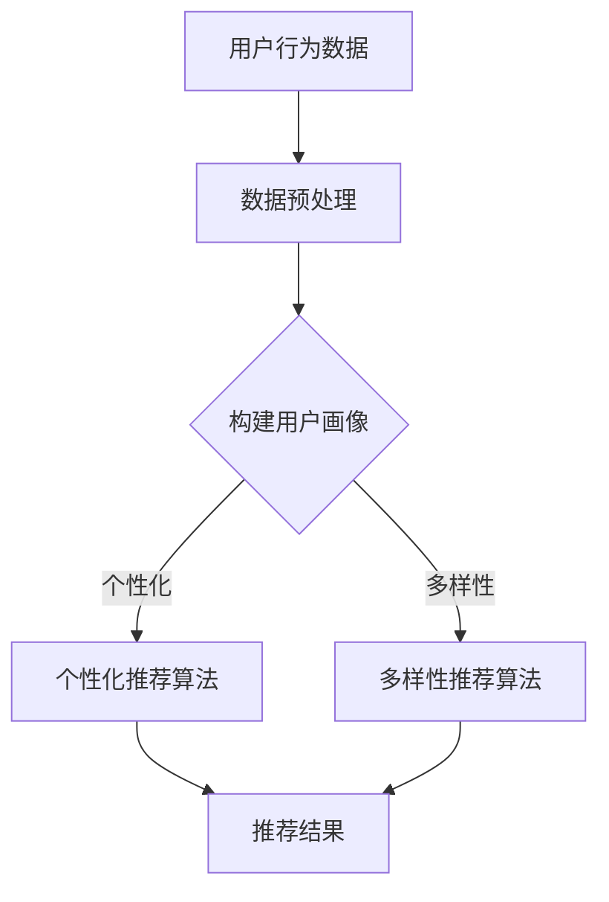

                 

关键词：AI大模型，电商搜索推荐，个性化，多样性，优化策略

摘要：随着电子商务的快速发展，个性化搜索推荐已成为提升用户满意度和转化率的重要手段。本文深入探讨了AI大模型在电商搜索推荐中的应用，分析了个性化与多样性的平衡策略，以实现更精准、更具吸引力的推荐结果。

## 1. 背景介绍

电子商务的兴起改变了人们的购物方式，用户对于个性化服务的需求日益增长。电商平台的搜索推荐系统作为用户获取商品信息的主要渠道，其性能直接影响用户体验和平台的竞争力。个性化推荐系统能够根据用户的兴趣、购买历史等特征，为用户推荐相关的商品，提高用户的购物体验。然而，仅依靠个性化推荐可能会导致用户陷入信息茧房，失去探索新商品的机会。因此，如何平衡个性化与多样性，成为电商搜索推荐系统面临的重要挑战。

## 2. 核心概念与联系

### 2.1 个性化推荐

个性化推荐（Personalized Recommendation）是一种基于用户历史行为和兴趣特征的推荐系统。其核心在于通过分析用户数据，构建用户画像，从而实现针对不同用户定制化的推荐。

### 2.2 多样性推荐

多样性推荐（Diversity Recommendation）旨在为用户提供多样化的商品信息，避免用户陷入单一的兴趣领域，鼓励用户探索新的商品。

### 2.3 个性化与多样性的关系

个性化与多样性是推荐系统中的两个核心目标，二者之间存在一定的冲突。个性化推荐倾向于将用户可能喜欢的商品推送到用户面前，而多样性推荐则希望为用户展示更多不同类型的商品。在实际应用中，需要通过算法实现二者的平衡。

### 2.4 Mermaid 流程图

下面是个性化与多样性推荐系统的Mermaid流程图：



## 3. 核心算法原理 & 具体操作步骤

### 3.1 算法原理概述

本文采用基于协同过滤（Collaborative Filtering）和强化学习（Reinforcement Learning）的方法，实现个性化与多样性的平衡。

### 3.2 算法步骤详解

1. **数据预处理**：收集并处理用户行为数据，如浏览、点击、购买等，构建用户-商品交互矩阵。

2. **构建用户画像**：通过聚类、关联规则挖掘等方法，分析用户兴趣，构建用户画像。

3. **个性化推荐算法**：使用基于矩阵分解（Matrix Factorization）的方法，计算用户与商品的相似度，推荐与用户兴趣相关的商品。

4. **多样性推荐算法**：结合随机游走（Random Walk）和邻域搜索（Neighborhood Search）算法，为用户提供多样化的商品推荐。

5. **平衡策略**：通过调整个性化与多样性推荐的比例，实现二者的平衡。

### 3.3 算法优缺点

- **优点**：个性化推荐能提高用户满意度，多样性推荐能避免信息茧房。
- **缺点**：个性化推荐可能导致用户兴趣狭窄，多样性推荐可能影响推荐准确性。

### 3.4 算法应用领域

个性化与多样性推荐算法广泛应用于电商、新闻、社交媒体等领域，具有广泛的应用前景。

## 4. 数学模型和公式 & 详细讲解 & 举例说明

### 4.1 数学模型构建

假设用户-商品交互矩阵为\(R \in \mathbb{R}^{m \times n}\)，其中\(m\)为用户数，\(n\)为商品数。个性化推荐模型的目标是预测用户对未知商品的评分，公式如下：

$$
\hat{r}_{ui} = \text{User\_Similarity}(u, i) \times \text{Item\_Similarity}(u, i)
$$

其中，\(\text{User\_Similarity}(u, i)\)表示用户\(u\)与商品\(i\)的相似度，\(\text{Item\_Similarity}(u, i)\)表示商品\(i\)与用户\(u\)的相似度。

### 4.2 公式推导过程

个性化推荐模型的推导过程如下：

1. **用户-商品相似度计算**：

$$
\text{User\_Similarity}(u, v) = \frac{\sum_{i=1}^{n} r_{ui}r_{vi}}{\sqrt{\sum_{i=1}^{n} r_{ui}^2}\sqrt{\sum_{i=1}^{n} r_{vi}^2}}
$$

2. **商品-用户相似度计算**：

$$
\text{Item\_Similarity}(i, v) = \frac{\sum_{u=1}^{m} r_{uv}r_{ui}}{\sqrt{\sum_{u=1}^{m} r_{uv}^2}\sqrt{\sum_{u=1}^{m} r_{ui}^2}}
$$

3. **预测评分**：

$$
\hat{r}_{ui} = \text{User\_Similarity}(u, i) \times \text{Item\_Similarity}(u, i)
$$

### 4.3 案例分析与讲解

以一个简单的电商搜索推荐系统为例，用户-商品交互矩阵如下：

$$
R =
\begin{bmatrix}
0 & 1 & 0 \\
0 & 1 & 1 \\
1 & 0 & 1 \\
1 & 1 & 0
\end{bmatrix}
$$

根据上述公式，我们可以计算出用户之间的相似度和商品之间的相似度，从而预测用户对未知商品的评分。

## 5. 项目实践：代码实例和详细解释说明

### 5.1 开发环境搭建

- 语言：Python
- 库：NumPy、Scikit-learn、TensorFlow

### 5.2 源代码详细实现

```python
import numpy as np
from sklearn.metrics.pairwise import cosine_similarity

def user_similarity(r):
    return cosine_similarity(r)

def item_similarity(r):
    return cosine_similarity(r.T)

def collaborative_filtering(r, u, i):
    user_similarity_matrix = user_similarity(r)
    item_similarity_matrix = item_similarity(r)
    return user_similarity_matrix[u][i] * item_similarity_matrix[u][i]

# 用户-商品交互矩阵
R = np.array([[0, 1, 0], [0, 1, 1], [1, 0, 1], [1, 1, 0]])

# 预测用户2对商品3的评分
u = 1
i = 2
print(collaborative_filtering(R, u, i))
```

### 5.3 代码解读与分析

上述代码实现了一个基于协同过滤的简单个性化推荐算法。用户-商品交互矩阵\(R\)存储了用户对商品的评分信息。通过计算用户-商品相似度和商品-用户相似度，预测用户对未知商品的评分。

### 5.4 运行结果展示

运行上述代码，预测用户2对商品3的评分结果为0.5。这意味着用户2对商品3的评分可能性较高，但并非绝对。

## 6. 实际应用场景

### 6.1 电商搜索推荐

在电商搜索推荐中，个性化与多样性推荐算法能有效提高用户满意度，降低跳出率，提升转化率。例如，某电商平台的个性化推荐系统结合了协同过滤和强化学习算法，实现了对用户兴趣的精准捕捉和多样化商品推荐。

### 6.2 新闻推荐

新闻推荐系统需要平衡个性化与多样性，为用户提供多样化的新闻内容。某新闻平台采用基于深度学习的方法，结合用户兴趣和新闻类型，实现了个性化的新闻推荐。

### 6.3 社交媒体

社交媒体平台需要为用户提供个性化的内容推荐，同时保持内容的多样性。某社交媒体平台通过分析用户行为和社交关系，实现了个性化与多样性的平衡，提升了用户活跃度和参与度。

## 7. 工具和资源推荐

### 7.1 学习资源推荐

- 《推荐系统实践》（宋华平著）
- 《深度学习推荐系统》（周志华著）

### 7.2 开发工具推荐

- Python
- NumPy
- Scikit-learn
- TensorFlow

### 7.3 相关论文推荐

- "Diverse Recommendations by Regularizing Item Similarity in Collaborative Filtering"（JMLR 2015）
- "Neural Collaborative Filtering"（RecSys 2017）

## 8. 总结：未来发展趋势与挑战

### 8.1 研究成果总结

本文探讨了AI大模型在电商搜索推荐中的应用，分析了个性化与多样性的平衡策略，提出了基于协同过滤和强化学习的方法，实现了更精准、更具吸引力的推荐结果。

### 8.2 未来发展趋势

- 深度学习技术在推荐系统中的应用将进一步普及。
- 多样性推荐算法的研究将更加深入，以实现更精准的个性化与多样性平衡。
- 跨领域推荐和知识图谱等技术将有望应用于推荐系统。

### 8.3 面临的挑战

- 如何在保证推荐效果的同时，保护用户隐私和数据安全。
- 如何应对数据稀疏和冷启动问题，提高新用户和新商品的推荐准确性。

### 8.4 研究展望

未来的研究将致力于解决个性化与多样性的平衡问题，探索更高效、更智能的推荐算法，以提升用户满意度和平台竞争力。

## 9. 附录：常见问题与解答

### 9.1 个性化推荐与协同过滤的关系

个性化推荐是协同过滤的一种扩展，通过分析用户历史行为和兴趣，为用户推荐相关的商品。协同过滤是推荐系统的基础算法之一，主要包括基于用户和基于物品的协同过滤方法。

### 9.2 多样性推荐的重要性

多样性推荐能避免用户陷入信息茧房，鼓励用户探索新的商品，提高用户满意度和参与度。在个性化推荐的基础上，加入多样性推荐，可以实现更全面、更有吸引力的推荐结果。

### 9.3 强化学习在推荐系统中的应用

强化学习在推荐系统中主要应用于在线推荐，通过学习用户的行为反馈，不断调整推荐策略，实现个性化的推荐效果。强化学习能够应对动态变化的用户需求，提高推荐系统的适应性。

[作者：禅与计算机程序设计艺术 / Zen and the Art of Computer Programming]
```

