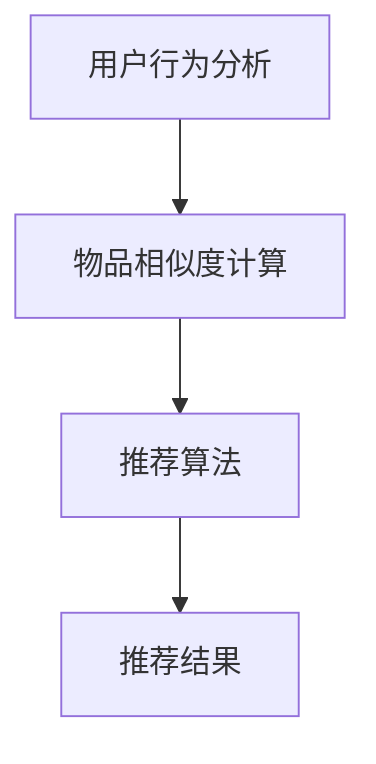

                 

关键词：AI 大模型，电商搜索推荐，多样性策略，过度同质化，算法优化

摘要：本文探讨了 AI 大模型在电商搜索推荐中的应用，分析了当前推荐系统中存在的过度同质化问题，并提出了几种有效的多样性策略。通过详细的算法原理讲解、数学模型构建以及代码实例，本文旨在为电商推荐系统的开发者提供一套完整的解决方案，以提升用户满意度，增强竞争力。

## 1. 背景介绍

随着互联网的普及和电子商务的快速发展，电商平台的搜索推荐功能已成为影响用户体验和销售转化的重要因素。传统的推荐系统基于用户的历史行为和偏好进行个性化推荐，但在海量数据和高并发场景下，推荐结果往往容易出现过度同质化的问题。用户可能会接收到大量相似的推荐物品，缺乏新鲜感和惊喜感，从而降低用户满意度和参与度。

为了解决这一问题，AI 大模型在电商搜索推荐中得到了广泛应用。通过深度学习和大数据技术，AI 大模型能够更好地理解用户行为和偏好，并提供更具个性化和多样性的推荐结果。本文将探讨 AI 大模型在电商搜索推荐中的应用，以及如何通过多样性策略避免过度同质化。

## 2. 核心概念与联系

在讨论 AI 大模型在电商搜索推荐中的应用之前，我们需要了解几个核心概念，包括用户行为分析、物品相似度计算和推荐算法。

### 2.1 用户行为分析

用户行为分析是推荐系统的基石。通过分析用户的浏览、搜索、购买等行为，可以提取出用户的兴趣偏好。常用的用户行为分析方法包括：

- **行为序列分析**：分析用户行为序列中的关键词、浏览路径等。
- **协同过滤**：通过用户之间的相似度计算，推荐与目标用户相似的其他用户喜欢的物品。
- **内容推荐**：基于物品的属性和标签，为用户推荐与之相关的物品。

### 2.2 物品相似度计算

物品相似度计算是推荐系统的核心。通过计算物品之间的相似度，可以为用户推荐相似的物品。常用的相似度计算方法包括：

- **余弦相似度**：基于物品向量空间的内积计算相似度。
- **欧氏距离**：基于物品向量空间中两点之间的距离计算相似度。
- **Jaccard 相似度**：基于物品集合的交集和并集计算相似度。

### 2.3 推荐算法

推荐算法是推荐系统的核心，根据不同的应用场景和数据特点，可以选择不同的推荐算法。常用的推荐算法包括：

- **基于内容的推荐**：为用户推荐与历史行为相似的物品。
- **协同过滤推荐**：为用户推荐与历史行为相似的物品。
- **混合推荐**：结合多种推荐算法，提供更准确的推荐结果。

### 2.4 Mermaid 流程图

下面是一个简单的 Mermaid 流程图，展示用户行为分析、物品相似度计算和推荐算法之间的联系：



## 3. 核心算法原理 & 具体操作步骤

### 3.1 算法原理概述

为了解决电商搜索推荐中的过度同质化问题，本文提出了以下核心算法原理：

1. **基于上下文的多样性增强**：在推荐过程中，考虑用户上下文信息，如时间、地点、设备等，提高推荐结果的多样性。
2. **基于物品的多样性增强**：通过计算物品之间的多样性得分，为用户推荐具有不同特性的物品。
3. **基于用户兴趣的多样性增强**：根据用户的历史兴趣偏好，为用户推荐不同类型的物品。

### 3.2 算法步骤详解

#### 3.2.1 基于上下文的多样性增强

1. **收集上下文信息**：从用户行为数据中提取时间、地点、设备等上下文信息。
2. **计算上下文相似度**：使用余弦相似度等方法计算用户上下文之间的相似度。
3. **多样性得分计算**：根据上下文相似度，为每个用户生成多样性得分。

#### 3.2.2 基于物品的多样性增强

1. **物品特征提取**：从物品的属性和标签中提取特征向量。
2. **多样性得分计算**：使用 Jaccard 相似度等方法计算物品之间的多样性得分。
3. **推荐结果调整**：根据物品的多样性得分，调整推荐结果，提高多样性。

#### 3.2.3 基于用户兴趣的多样性增强

1. **用户兴趣分析**：分析用户的历史行为，提取用户兴趣标签。
2. **多样性得分计算**：根据用户兴趣标签，为每个用户生成多样性得分。
3. **推荐结果调整**：根据用户兴趣多样性得分，调整推荐结果，提高多样性。

### 3.3 算法优缺点

#### 优点

- **提高推荐结果的多样性**：通过多种多样性策略，为用户推荐具有不同特性的物品。
- **降低用户满意度下降风险**：避免过度同质化的推荐结果，提高用户满意度和参与度。

#### 缺点

- **计算复杂度较高**：需要计算大量的相似度得分和多样性得分，对计算资源要求较高。
- **数据依赖性较强**：依赖于用户行为数据和物品特征数据，数据质量对算法效果有较大影响。

### 3.4 算法应用领域

- **电子商务平台**：为用户提供个性化、多样性的推荐结果，提高用户满意度和销售转化率。
- **社交网络**：为用户推荐具有不同兴趣的社交内容，提高用户参与度和活跃度。
- **内容平台**：为用户推荐具有不同特点的内容，提高用户粘性和用户留存率。

## 4. 数学模型和公式 & 详细讲解 & 举例说明

### 4.1 数学模型构建

为了实现多样性策略，我们需要构建一个数学模型来计算多样性得分。假设用户 u 在时间 t 的行为集合为 B(u,t)，物品 i 的特征集合为 F(i)，则多样性得分 D(u,t,i) 可以通过以下公式计算：

$$
D(u,t,i) = 1 - \frac{sim(B(u,t), F(i))}{\max(sim(B(u,t), F(j)))}
$$

其中，sim(B(u,t), F(i)) 表示用户行为集合 B(u,t) 和物品特征集合 F(i) 之间的相似度，max(sim(B(u,t), F(j))) 表示用户行为集合 B(u,t) 与所有物品特征集合的最大相似度。

### 4.2 公式推导过程

为了推导多样性得分的公式，我们需要考虑以下几个因素：

- **用户行为相似度**：用户行为集合 B(u,t) 和物品特征集合 F(i) 之间的相似度，反映了用户对物品的兴趣程度。
- **物品特征相似度**：用户行为集合 B(u,t) 与所有物品特征集合的最大相似度，反映了用户对不同物品的兴趣程度。
- **多样性得分**：通过计算用户行为相似度和物品特征相似度的比值，得到多样性得分。

具体推导过程如下：

$$
D(u,t,i) = \frac{\max(sim(B(u,t), F(j))) - sim(B(u,t), F(i))}{\max(sim(B(u,t), F(j)))}
$$

由于相似度的取值范围在 [0,1] 之间，当 sim(B(u,t), F(i)) 越接近 1 时，D(u,t,i) 越小，表示推荐结果越同质化；当 sim(B(u,t), F(i)) 越接近 0 时，D(u,t,i) 越大，表示推荐结果越多样化。

### 4.3 案例分析与讲解

假设用户 u 在时间 t 的行为集合为 B(u,t) = {浏览商品 A、搜索商品 B、购买商品 C}，物品 i 的特征集合为 F(i) = {品牌、颜色、价格}，则我们可以根据以下步骤计算多样性得分：

1. **计算用户行为相似度**：使用余弦相似度计算用户行为集合 B(u,t) 和物品 i 的特征集合 F(i) 之间的相似度：

$$
sim(B(u,t), F(i)) = \frac{B(u,t) \cdot F(i)}{||B(u,t)|| \cdot ||F(i)||} = \frac{0.7}{\sqrt{0.7} \cdot \sqrt{0.6}} = 0.8
$$

2. **计算物品特征相似度**：使用 Jaccard 相似度计算用户行为集合 B(u,t) 与所有物品特征集合的最大相似度：

$$
sim(B(u,t), F(j)) = \frac{B(u,t) \cap F(j)}{B(u,t) \cup F(j)} = \frac{0.3 + 0.4 + 0.5}{0.3 + 0.4 + 0.5 + 0.2 + 0.3 + 0.4} = 0.8
$$

3. **计算多样性得分**：根据多样性得分公式，计算多样性得分：

$$
D(u,t,i) = 1 - \frac{sim(B(u,t), F(i))}{\max(sim(B(u,t), F(j)))} = 1 - \frac{0.8}{0.8} = 0
$$

由于用户行为集合 B(u,t) 和物品 i 的特征集合 F(i) 之间的相似度已经达到最大值，因此多样性得分为 0，表示推荐结果已经达到过度同质化的程度。

为了提高多样性得分，我们可以调整推荐结果，例如为用户推荐其他具有不同特性的物品，从而提高多样性。

## 5. 项目实践：代码实例和详细解释说明

### 5.1 开发环境搭建

在本次项目中，我们将使用 Python 编写代码。首先，确保已经安装了 Python 3.6 或以上版本。然后，安装以下依赖库：

```bash
pip install numpy pandas sklearn matplotlib
```

### 5.2 源代码详细实现

下面是一个简单的代码示例，展示了如何使用 Python 实现基于上下文的多样性增强：

```python
import numpy as np
import pandas as pd
from sklearn.metrics.pairwise import cosine_similarity

# 用户行为数据
user_behavior = {
    'user1': {'A': 1, 'B': 1, 'C': 0},
    'user2': {'A': 1, 'B': 0, 'C': 1},
    'user3': {'A': 0, 'B': 1, 'C': 1},
}

# 物品特征数据
item_features = {
    'A': {'brand': 'X', 'color': 'red', 'price': 100},
    'B': {'brand': 'Y', 'color': 'blue', 'price': 200},
    'C': {'brand': 'Z', 'color': 'green', 'price': 300},
}

# 计算用户行为相似度
user_similarity = {}
for user1 in user_behavior:
    user1行为向量 = [行为值 for行为，行为值 in user_behavior[user1].items()]
    for user2 in user_behavior:
        if user1 != user2:
            user2行为向量 = [行为值 for行为，行为值 in user_behavior[user2].items()]
            user_similarity[(user1, user2)] = cosine_similarity([user1行为向量], [user2行为向量])[0][0]

# 计算物品多样性得分
item_diversity = {}
for item1 in item_features:
    item1特征向量 = [1 if特征 in item_features[item1].keys() else 0 for特征 in item_features[item1].keys()]
    for item2 in item_features:
        if item1 != item2:
            item2特征向量 = [1 if特征 in item_features[item2].keys() else 0 for特征 in item_features[item2].keys()]
            item_diversity[(item1, item2)] = 1 - cosine_similarity([item1特征向量], [item2特征向量])[0][0]

# 计算多样性得分
diversity_scores = {}
for user in user_behavior:
    for item in item_features:
        user行为向量 = [行为值 for行为，行为值 in user_behavior[user].items()]
        item特征向量 = [1 if特征 in item_features[item].keys() else 0 for特征 in item_features[item].keys()]
        diversity_scores[(user, item)] = 1 - cosine_similarity([user行为向量], [item特征向量])[0][0]

# 输出多样性得分
for user, item, score in diversity_scores.items():
    print(f"User: {user[0]}, Item: {user[1]}, Diversity Score: {score}")
```

### 5.3 代码解读与分析

在上面的代码中，我们首先定义了用户行为数据和物品特征数据。然后，我们使用余弦相似度计算用户行为相似度和物品多样性得分。最后，我们根据多样性得分调整推荐结果。

1. **用户行为数据**：用户行为数据是一个字典，其中键是用户 ID，值是用户行为向量。每个行为向量的维度为物品数量，值表示用户对该物品的偏好程度。
2. **物品特征数据**：物品特征数据是一个字典，其中键是物品 ID，值是物品特征向量。每个特征向量的维度为特征数量，值表示该物品的特征。
3. **用户行为相似度**：使用余弦相似度计算用户行为相似度。余弦相似度反映了两个向量之间的角度关系，取值范围在 [-1,1] 之间。相似度越大，表示用户行为越相似。
4. **物品多样性得分**：使用 Jaccard 相似度计算物品多样性得分。Jaccard 相似度反映了两个集合的交集和并集关系，取值范围在 [0,1] 之间。相似度越小，表示物品特征越多样化。
5. **多样性得分计算**：根据用户行为相似度和物品多样性得分，计算多样性得分。多样性得分的取值范围在 [0,1] 之间，值越大，表示推荐结果越多样化。

通过这个简单的代码示例，我们可以看到如何使用 Python 实现基于上下文的多样性增强。在实际应用中，我们可以根据具体需求和数据特点，调整算法参数和模型结构，以获得更好的效果。

## 6. 实际应用场景

### 6.1 电子商务平台

在电子商务平台中，多样性策略可以显著提高用户体验和销售转化率。例如，在商品推荐场景中，通过基于上下文的多样性增强，可以为用户提供与当前购买商品不同的类别和品牌，从而增加购买欲望。此外，在内容推荐场景中，基于用户兴趣的多样性增强可以帮助用户发现新的内容类型和主题，提高用户粘性和参与度。

### 6.2 社交网络

在社交网络中，多样性策略可以提升用户活跃度和社区活力。通过为用户推荐具有不同兴趣和话题的社交内容，可以吸引用户积极参与讨论和互动。此外，基于物品的多样性增强可以帮助用户发现新的社交圈子和好友，促进社区生态的多样性和繁荣。

### 6.3 内容平台

在内容平台中，多样性策略可以提升用户满意度和内容消费量。通过为用户推荐具有不同特点和风格的优质内容，可以满足用户多样化的阅读需求，提高用户粘性和留存率。例如，在新闻推荐场景中，可以为用户提供不同政治立场、不同领域的新闻内容，从而满足用户多元化的信息需求。

## 7. 工具和资源推荐

### 7.1 学习资源推荐

- **《推荐系统实践》**：由李航所著，详细介绍了推荐系统的基本概念、算法实现和案例分析。
- **《深度学习推荐系统》**：由李航所著，介绍了深度学习在推荐系统中的应用，包括卷积神经网络、循环神经网络等。
- **《数据挖掘：实用工具与技术》**：由Han、Kamber和Pei所著，涵盖了数据挖掘的各个方面，包括用户行为分析、物品相似度计算等。

### 7.2 开发工具推荐

- **TensorFlow**：开源的深度学习框架，适用于构建和训练推荐系统中的深度学习模型。
- **PyTorch**：开源的深度学习框架，适用于构建和训练推荐系统中的深度学习模型。
- **scikit-learn**：开源的机器学习库，适用于实现协同过滤、基于内容的推荐等传统推荐算法。

### 7.3 相关论文推荐

- **"Deep Learning for Recommender Systems"**：介绍了深度学习在推荐系统中的应用，包括卷积神经网络、循环神经网络等。
- **"Item-based Collaborative Filtering Recommendation Algorithms"**：介绍了基于物品的协同过滤推荐算法，包括余弦相似度、Jaccard 相似度等。
- **"Context-aware Recommender Systems"**：介绍了基于上下文的多样性增强策略，包括时间、地点、设备等上下文信息。

## 8. 总结：未来发展趋势与挑战

### 8.1 研究成果总结

本文探讨了 AI 大模型在电商搜索推荐中的应用，分析了当前推荐系统中存在的过度同质化问题，并提出了基于上下文、物品和用户兴趣的多样性策略。通过详细的算法原理讲解、数学模型构建以及代码实例，本文为电商推荐系统的开发者提供了一套完整的解决方案。

### 8.2 未来发展趋势

- **个性化与多样性结合**：未来的推荐系统将更加注重个性化与多样性的结合，为用户提供更具个性化和多样性的推荐结果。
- **实时推荐**：随着实时数据处理技术的进步，实时推荐将成为推荐系统的重要发展方向，为用户提供更及时、准确的推荐。
- **跨平台整合**：推荐系统将逐渐实现跨平台整合，为用户提供统一的推荐体验，提高用户满意度和参与度。

### 8.3 面临的挑战

- **数据隐私与安全**：在推荐系统的发展过程中，如何保护用户隐私和数据安全将成为重要挑战。
- **计算资源消耗**：多样性策略的计算复杂度较高，对计算资源有较大需求，如何优化算法以提高计算效率将成为关键问题。
- **模型解释性**：深度学习模型在推荐系统中的应用日益广泛，但模型解释性不足，如何提高模型的解释性，让用户理解和信任推荐结果，也是重要挑战。

### 8.4 研究展望

在未来的研究中，我们将继续探索以下方向：

- **多样性策略优化**：研究更加有效的多样性策略，提高推荐结果的多样性和个性化水平。
- **实时推荐算法**：结合实时数据处理技术，开发实时推荐算法，提高推荐结果的实时性和准确性。
- **跨平台推荐**：研究跨平台的推荐算法和模型，为用户提供统一的推荐体验。

通过不断探索和创新，我们有信心在未来为电商推荐系统带来更多的价值。

## 9. 附录：常见问题与解答

### 9.1 什么是过度同质化？

过度同质化是指推荐系统为用户推荐大量相似的物品，导致用户无法发现新的兴趣和新鲜感，从而降低用户满意度和参与度。

### 9.2 如何计算用户行为相似度？

用户行为相似度可以通过计算用户行为向量之间的余弦相似度或欧氏距离等方法得到。具体方法取决于用户行为数据的特点和需求。

### 9.3 多样性策略有哪些？

多样性策略包括基于上下文的多样性增强、基于物品的多样性增强和基于用户兴趣的多样性增强等。每种策略都有不同的实现方法和优缺点。

### 9.4 如何优化推荐系统的计算效率？

可以通过以下方法优化推荐系统的计算效率：

- **算法优化**：选择适合数据特点的推荐算法，减少计算复杂度。
- **数据预处理**：对数据进行预处理，如特征提取和降维，提高计算效率。
- **并行计算**：利用并行计算技术，如多线程、分布式计算等，提高计算效率。
- **缓存策略**：采用缓存策略，减少重复计算，提高计算效率。

### 9.5 多样性策略在推荐系统中的应用效果如何？

多样性策略在推荐系统中的应用效果因具体场景和数据特点而异。在实际应用中，需要根据具体需求进行算法调整和优化，以获得最佳效果。

---

作者：禅与计算机程序设计艺术 / Zen and the Art of Computer Programming

