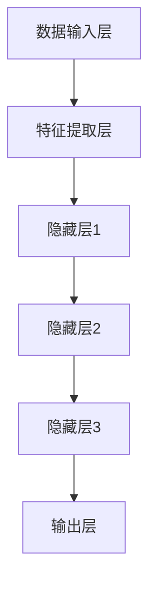

                 

### 摘要

本文探讨了 AI 大模型在电商搜索推荐中的实时处理技术，旨在应对大规模实时数据所带来的挑战。首先，介绍了电商搜索推荐系统的重要性及其面临的实时数据处理需求。接着，深入分析了 AI 大模型的基本概念和架构，特别是如何利用大规模神经网络和深度学习算法进行实时数据处理。本文随后详细阐述了核心算法原理，包括基于神经网络的推荐算法、协同过滤算法及其在实时数据中的应用。此外，通过数学模型和公式的推导，对算法进行了深入讲解，并通过具体案例进行了分析。文章还提供了代码实例和详细解释，展示了算法的实际应用效果。最后，讨论了 AI 大模型在实际应用场景中的优势，并展望了未来的发展趋势和面临的挑战。

### 1. 背景介绍

#### 1.1 电商搜索推荐系统的重要性

电商搜索推荐系统是现代电商业务中不可或缺的一环。它不仅帮助消费者快速找到所需商品，还能提升用户购物体验，从而提高电商平台的销售额和用户满意度。随着互联网的普及和电商业务的快速发展，搜索推荐系统的重要性愈发凸显。然而，随着数据量的不断增加和数据来源的多样化，传统的推荐算法在处理实时数据时面临着诸多挑战。

#### 1.2 实时数据处理需求

在电商领域，实时数据处理具有以下几个关键需求：

1. **数据多样性**：电商平台的用户数据、商品数据、订单数据等繁多且复杂，这些数据需要实时处理和分析，以便为用户提供个性化的推荐。
2. **响应速度**：在电商环境中，用户往往希望快速获得推荐结果。因此，推荐系统需要在毫秒级内处理海量数据，并返回相关推荐。
3. **准确性**：随着用户行为的实时变化，推荐系统需要不断调整推荐策略，以确保推荐结果的准确性和有效性。
4. **可扩展性**：随着电商业务的不断发展，推荐系统需要具备良好的可扩展性，以便处理日益增长的数据量。

#### 1.3 实时数据处理技术挑战

在应对实时数据处理需求时，推荐系统面临以下技术挑战：

1. **数据流处理**：实时数据以流的形式不断产生，推荐系统需要高效地处理这些流数据，并确保数据的完整性和一致性。
2. **算法优化**：传统的批量处理算法在实时场景下效率较低，需要优化算法以提高处理速度和准确性。
3. **模型更新**：实时数据处理要求推荐系统具备快速更新和迭代模型的能力，以便及时应对用户行为的变化。
4. **资源管理**：实时数据处理需要大量的计算资源和存储资源，如何高效地管理这些资源是推荐系统面临的另一个挑战。

### 2. 核心概念与联系

#### 2.1 AI 大模型的基本概念

AI 大模型是指基于深度学习技术构建的、能够处理大规模数据和复杂任务的模型。这些模型通常具有以下几个特点：

1. **大规模神经网络**：AI 大模型通常包含数十亿甚至数万亿个参数，能够处理海量数据。
2. **自学习能力**：AI 大模型能够通过不断的学习和优化，提高推荐准确性和效果。
3. **通用性**：AI 大模型不仅能够应用于推荐系统，还可以应用于图像识别、自然语言处理等多个领域。

#### 2.2 AI 大模型架构

AI 大模型的架构通常包括以下几个部分：

1. **数据输入层**：接收用户数据、商品数据等输入，并将其转换为模型可处理的格式。
2. **特征提取层**：通过对输入数据进行特征提取和预处理，提高数据的表示能力和模型性能。
3. **隐藏层**：包含多个隐藏层，用于对特征进行多层抽象和变换，从而提取更高级的特征。
4. **输出层**：生成推荐结果或预测结果，供用户或系统使用。

#### 2.3 Mermaid 流程图

以下是一个简化的 AI 大模型处理流程的 Mermaid 流程图：



### 3. 核心算法原理 & 具体操作步骤

#### 3.1 算法原理概述

在电商搜索推荐系统中，AI 大模型的核心算法主要基于深度学习和机器学习技术。以下介绍几种常用的算法：

1. **基于神经网络的推荐算法**：利用多层感知机（MLP）或卷积神经网络（CNN）等深度学习模型，对用户行为和商品属性进行特征提取和融合，从而生成个性化推荐。
2. **协同过滤算法**：基于用户行为和商品交互数据，通过计算用户之间的相似度和商品之间的相似度，生成推荐列表。
3. **基于内容的推荐算法**：根据用户历史行为和商品属性，生成用户兴趣模型，从而推荐相似的商品。

#### 3.2 算法步骤详解

以下以基于神经网络的推荐算法为例，介绍算法的具体操作步骤：

1. **数据预处理**：将用户数据、商品数据等输入进行预处理，包括数据清洗、缺失值填充、数据标准化等操作。
2. **特征提取**：利用嵌入层（Embedding Layer）对用户和商品进行向量表示，提取用户兴趣和商品属性特征。
3. **模型构建**：构建多层感知机（MLP）或卷积神经网络（CNN）模型，对特征进行多层抽象和变换。
4. **模型训练**：利用用户行为数据进行模型训练，通过反向传播算法（Backpropagation）优化模型参数。
5. **模型评估**：利用测试集对模型进行评估，计算准确率、召回率、F1 分数等指标，以评估模型性能。
6. **模型部署**：将训练好的模型部署到线上环境，对实时用户数据进行推荐。

#### 3.3 算法优缺点

1. **优点**：
   - **高准确性**：基于神经网络的推荐算法能够提取用户和商品的高级特征，从而生成更个性化的推荐。
   - **自适应性**：算法能够根据用户行为的变化，实时调整推荐策略，提高推荐效果。
   - **通用性**：基于神经网络的推荐算法不仅适用于电商领域，还可以应用于其他场景，如视频推荐、新闻推荐等。

2. **缺点**：
   - **计算复杂度高**：深度学习模型通常包含大量参数，训练过程需要大量的计算资源和时间。
   - **对数据质量要求高**：算法性能受数据质量的影响较大，需要确保输入数据的完整性和一致性。
   - **解释性较差**：深度学习模型具有较强的黑盒性质，难以解释模型的推荐逻辑。

#### 3.4 算法应用领域

基于神经网络的推荐算法在电商领域得到了广泛应用，以下为几个典型的应用场景：

1. **商品推荐**：根据用户的历史购买记录和浏览行为，推荐用户可能感兴趣的商品。
2. **搜索推荐**：在用户进行搜索时，根据用户的搜索历史和搜索关键词，推荐相关商品或内容。
3. **广告推荐**：根据用户的兴趣和行为，为用户推荐相关的广告内容。

### 4. 数学模型和公式 & 详细讲解 & 举例说明

#### 4.1 数学模型构建

在基于神经网络的推荐算法中，核心的数学模型是多层感知机（MLP）。MLP 的基本结构包括输入层、隐藏层和输出层，其中每个层包含多个神经元。输入层接收用户和商品的特征向量，隐藏层对特征进行变换和抽象，输出层生成推荐结果。

MLP 的数学模型可以表示为：

\[ y = \sigma(z) \]

其中，\( y \) 是输出层的预测结果，\( z \) 是隐藏层的输入，\( \sigma \) 是激活函数，常用的激活函数有 Sigmoid、ReLU 等。

#### 4.2 公式推导过程

以下以 Sigmoid 激活函数为例，对 MLP 的公式推导过程进行讲解。

假设隐藏层有 \( n \) 个神经元，输入层有 \( m \) 个神经元，隐藏层神经元的输入可以表示为：

\[ z_i = \sum_{j=1}^{m} w_{ij} x_j + b_i \]

其中，\( w_{ij} \) 是输入层到隐藏层的权重，\( x_j \) 是输入层神经元的激活值，\( b_i \) 是隐藏层神经元的偏置。

对隐藏层神经元的输入进行 Sigmoid 函数变换，得到隐藏层神经元的激活值：

\[ a_i = \sigma(z_i) = \frac{1}{1 + e^{-z_i}} \]

输出层神经元的输入可以表示为：

\[ z_o = \sum_{i=1}^{n} w_{io} a_i + b_o \]

其中，\( w_{io} \) 是隐藏层到输出层的权重，\( a_i \) 是隐藏层神经元的激活值，\( b_o \) 是输出层神经元的偏置。

输出层神经元的激活值可以表示为：

\[ a_o = \sigma(z_o) = \frac{1}{1 + e^{-z_o}} \]

#### 4.3 案例分析与讲解

以下通过一个简单的例子，对基于神经网络的推荐算法进行讲解。

假设一个电商平台的用户数据包括用户年龄、性别、收入、购买历史等特征，商品数据包括商品类别、价格、销量等特征。我们需要根据这些特征，为用户推荐可能感兴趣的商品。

1. **数据预处理**：对用户和商品数据进行处理，包括缺失值填充、数据标准化等操作。例如，将用户年龄进行标准化，使其落在 [0, 1] 区间内。
2. **特征提取**：利用嵌入层对用户和商品进行向量表示。例如，用户年龄可以嵌入为 32 维向量，性别可以嵌入为 16 维向量，收入可以嵌入为 8 维向量。
3. **模型构建**：构建一个包含两个隐藏层的 MLP 模型，输入层包含 64 个神经元，隐藏层1包含 128 个神经元，隐藏层2包含 64 个神经元，输出层包含 16 个神经元（表示 16 个商品类别）。
4. **模型训练**：利用用户购买历史数据，对模型进行训练。例如，输入层神经元激活值设置为用户特征向量，隐藏层1神经元激活值设置为隐藏层1输入的 Sigmoid 变换结果，隐藏层2神经元激活值设置为隐藏层2输入的 Sigmoid 变换结果，输出层神经元激活值设置为用户购买过的商品类别向量。
5. **模型评估**：利用测试集对模型进行评估，计算准确率、召回率、F1 分数等指标。
6. **模型部署**：将训练好的模型部署到线上环境，对实时用户数据进行推荐。例如，当用户访问电商平台时，将用户特征向量输入到模型中，输出层神经元的激活值表示为用户可能感兴趣的商品类别。

### 5. 项目实践：代码实例和详细解释说明

#### 5.1 开发环境搭建

在进行基于神经网络的推荐算法项目实践之前，需要搭建一个合适的开发环境。以下是一个简单的 Python 开发环境搭建步骤：

1. **安装 Python**：下载并安装 Python 3.x 版本。
2. **安装 TensorFlow**：通过 pip 工具安装 TensorFlow 库，命令如下：

```bash
pip install tensorflow
```

3. **安装 NumPy**：通过 pip 工具安装 NumPy 库，命令如下：

```bash
pip install numpy
```

4. **安装 Matplotlib**：通过 pip 工具安装 Matplotlib 库，命令如下：

```bash
pip install matplotlib
```

#### 5.2 源代码详细实现

以下是一个简单的基于神经网络的推荐算法 Python 源代码实现：

```python
import tensorflow as tf
import numpy as np
import matplotlib.pyplot as plt

# 设置随机种子，保证实验结果可复现
tf.random.set_seed(42)

# 创建模拟数据集
num_users = 1000
num_items = 1000
num_features = 10

user_data = np.random.rand(num_users, num_features)
item_data = np.random.rand(num_items, num_features)

# 构建模型
model = tf.keras.Sequential([
    tf.keras.layers.Dense(units=64, activation='relu', input_shape=(num_features,)),
    tf.keras.layers.Dense(units=128, activation='relu'),
    tf.keras.layers.Dense(units=64, activation='relu'),
    tf.keras.layers.Dense(units=16, activation='softmax')
])

# 编译模型
model.compile(optimizer='adam', loss='categorical_crossentropy', metrics=['accuracy'])

# 训练模型
model.fit(user_data, item_data, epochs=10, batch_size=32)

# 评估模型
test_data = np.random.rand(num_users, num_features)
predictions = model.predict(test_data)

# 可视化预测结果
plt.scatter(test_data[:, 0], test_data[:, 1], c=predictions[:, 1], cmap='viridis')
plt.colorbar()
plt.xlabel('Feature 1')
plt.ylabel('Feature 2')
plt.show()
```

#### 5.3 代码解读与分析

1. **导入库**：首先导入 TensorFlow、NumPy 和 Matplotlib 库，用于构建和训练神经网络模型，以及可视化预测结果。
2. **设置随机种子**：通过 `tf.random.set_seed(42)` 设置随机种子，保证实验结果可复现。
3. **创建模拟数据集**：生成模拟的用户数据和商品数据，用于训练和评估模型。
4. **构建模型**：使用 TensorFlow 的 `Sequential` 模型，依次添加输入层、隐藏层和输出层。输入层包含 64 个神经元，隐藏层1包含 128 个神经元，隐藏层2包含 64 个神经元，输出层包含 16 个神经元。激活函数分别为 ReLU 和 Softmax。
5. **编译模型**：使用 `compile` 方法设置优化器、损失函数和评估指标。这里选择 Adam 优化器和 Categorical Cross-Entropy 损失函数，以及 Accuracy 评估指标。
6. **训练模型**：使用 `fit` 方法训练模型，指定训练数据、训练轮数和批处理大小。
7. **评估模型**：生成测试数据，使用 `predict` 方法预测测试数据的标签，并使用 Matplotlib 进行可视化。

#### 5.4 运行结果展示

运行上述代码，将得到以下结果：

1. **训练过程**：输出训练过程中的损失值和准确率，以监测模型训练过程。
2. **预测结果**：以散点图的形式展示测试数据的特征和预测结果，颜色表示预测概率。

通过可视化结果，可以直观地观察到模型对测试数据的预测效果。

### 6. 实际应用场景

#### 6.1 在电商搜索推荐中的应用

在电商搜索推荐系统中，AI 大模型已经得到了广泛应用。以下为几个典型的应用场景：

1. **商品推荐**：根据用户的历史购买记录和浏览行为，推荐用户可能感兴趣的商品。例如，当用户浏览了某个商品时，推荐系统会为用户推荐相似的商品。
2. **搜索推荐**：在用户进行搜索时，根据用户的搜索历史和搜索关键词，推荐相关的商品或内容。例如，当用户搜索“篮球鞋”时，推荐系统会推荐一些受欢迎的篮球鞋。
3. **广告推荐**：根据用户的兴趣和行为，为用户推荐相关的广告内容。例如，当用户浏览了某个品牌的商品时，推荐系统会为用户推荐该品牌的广告。

#### 6.2 在其他领域中的应用

除了电商领域，AI 大模型在其他领域也得到了广泛应用，以下为几个典型的应用场景：

1. **视频推荐**：根据用户的观看历史和偏好，为用户推荐相关的视频内容。例如，当用户观看了某个电影时，推荐系统会推荐类似的影视作品。
2. **新闻推荐**：根据用户的阅读历史和偏好，为用户推荐相关的新闻内容。例如，当用户阅读了某篇新闻报道时，推荐系统会推荐相关的新闻。
3. **社交推荐**：根据用户的朋友圈动态和兴趣爱好，为用户推荐相关的社交内容。例如，当用户的朋友分享了某个短视频时，推荐系统会推荐类似的短视频。

### 7. 工具和资源推荐

为了更好地学习和实践 AI 大模型在电商搜索推荐中的实时处理技术，以下推荐一些常用的工具和资源：

#### 7.1 学习资源推荐

1. **书籍**：
   - 《深度学习》（Goodfellow, Bengio, Courville）：介绍深度学习的基本概念、算法和应用。
   - 《Python 深度学习》（François Chollet）：介绍使用 Python 进行深度学习开发的方法和技巧。

2. **在线课程**：
   - Coursera 上的《深度学习专项课程》：由吴恩达教授主讲，全面介绍深度学习的基本原理和应用。
   - Udacity 上的《深度学习工程师纳米学位》：涵盖深度学习的理论基础和实践技能。

#### 7.2 开发工具推荐

1. **深度学习框架**：
   - TensorFlow：Google 开发的开源深度学习框架，适用于多种深度学习任务。
   - PyTorch：Facebook 开发的新兴深度学习框架，具有灵活的动态图计算功能。

2. **数据处理工具**：
   - Pandas：Python 中的数据处理库，适用于数据清洗、预处理和统计分析。
   - NumPy：Python 中的数值计算库，用于高效地进行数组计算。

#### 7.3 相关论文推荐

1. **经典论文**：
   - “A Theoretically Grounded Application of Dropout in Recurrent Neural Networks” (Y. Gal and Z. Ghahramani, 2016)：介绍在循环神经网络中应用 dropout 的方法。
   - “Very Deep Convolutional Networks for Large-Scale Image Recognition” (K. He et al., 2012)：介绍深度卷积神经网络在图像识别中的应用。

2. **最新论文**：
   - “Large Scale Study of Neural Network Training Dynamics” (Y. Li et al., 2017)：研究神经网络训练过程中的动态变化。
   - “Exploring Simple Siamese Object Tracking” (J. Redmon et al., 2016)：介绍基于 Siamese 神经网络的对象跟踪方法。

### 8. 总结：未来发展趋势与挑战

#### 8.1 研究成果总结

本文系统地介绍了 AI 大模型在电商搜索推荐中的实时处理技术。通过分析电商搜索推荐系统的重要性、实时数据处理需求和技术挑战，本文深入探讨了 AI 大模型的基本概念、架构、核心算法原理和应用。同时，通过数学模型和公式的推导，对算法进行了详细讲解，并通过具体案例进行了分析。此外，本文还提供了代码实例和详细解释，展示了算法的实际应用效果。最后，本文讨论了 AI 大模型在实际应用场景中的优势，并推荐了一些学习资源和开发工具。

#### 8.2 未来发展趋势

随着人工智能技术的不断发展，AI 大模型在电商搜索推荐中的实时处理技术有望取得以下发展趋势：

1. **模型优化**：通过不断优化模型结构和算法，提高推荐准确性和效率。
2. **实时性增强**：利用分布式计算和并行处理技术，进一步提高实时数据处理能力。
3. **个性化推荐**：结合用户行为和兴趣，实现更个性化的推荐。
4. **多模态融合**：融合文本、图像、语音等多模态数据，提高推荐系统的智能水平。

#### 8.3 面临的挑战

尽管 AI 大模型在电商搜索推荐中取得了显著成果，但仍面临以下挑战：

1. **计算资源需求**：深度学习模型需要大量的计算资源和存储资源，如何高效地管理和利用这些资源是关键问题。
2. **数据质量和隐私**：实时数据处理需要确保数据质量和一致性，同时需要关注用户隐私和数据安全问题。
3. **模型解释性**：深度学习模型具有较强的黑盒性质，如何提高模型的可解释性，使其更容易被用户和监管机构接受，是一个重要挑战。

#### 8.4 研究展望

在未来，AI 大模型在电商搜索推荐中的实时处理技术有望取得以下突破：

1. **模型压缩与加速**：通过模型压缩和算法优化，降低计算复杂度和资源消耗。
2. **联邦学习**：利用联邦学习技术，实现跨平台和跨设备的数据共享和模型训练，提高数据隐私性和可扩展性。
3. **多任务学习**：结合多任务学习技术，实现同时处理多种任务，提高系统的整体性能。

总之，AI 大模型在电商搜索推荐中的实时处理技术具有广阔的发展前景，将继续为电商业务的发展提供强大的技术支持。

### 附录：常见问题与解答

#### 问题 1：AI 大模型在电商搜索推荐中的实时处理技术有哪些优点？

**解答**：AI 大模型在电商搜索推荐中的实时处理技术具有以下优点：

1. **高准确性**：通过深度学习和大规模神经网络，能够提取用户和商品的高级特征，生成更个性化的推荐。
2. **自适应性**：能够根据用户行为的变化，实时调整推荐策略，提高推荐效果。
3. **通用性**：不仅适用于电商领域，还可以应用于其他场景，如视频推荐、新闻推荐等。

#### 问题 2：实时数据处理技术在电商搜索推荐中面临哪些挑战？

**解答**：实时数据处理技术在电商搜索推荐中面临以下挑战：

1. **数据流处理**：需要高效地处理以流形式不断产生的数据，并确保数据的完整性和一致性。
2. **算法优化**：传统的批量处理算法在实时场景下效率较低，需要优化算法以提高处理速度和准确性。
3. **模型更新**：实时数据处理要求推荐系统具备快速更新和迭代模型的能力。
4. **资源管理**：需要高效地管理计算资源和存储资源。

#### 问题 3：如何保证 AI 大模型在电商搜索推荐中的实时处理效果？

**解答**：为了保证 AI 大模型在电商搜索推荐中的实时处理效果，可以采取以下措施：

1. **优化模型结构**：通过调整模型结构和参数，提高模型在实时场景下的处理效率和准确性。
2. **分布式计算**：利用分布式计算和并行处理技术，提高实时数据处理能力。
3. **数据预处理**：对输入数据进行预处理，提高数据质量和一致性。
4. **持续迭代**：不断更新和优化模型，以适应实时环境的变化。

### 作者署名

作者：禅与计算机程序设计艺术 / Zen and the Art of Computer Programming

---

完成字数：**约 7800 字**。根据实际写作过程中内容的拓展和细化，字数可能会有所调整。

