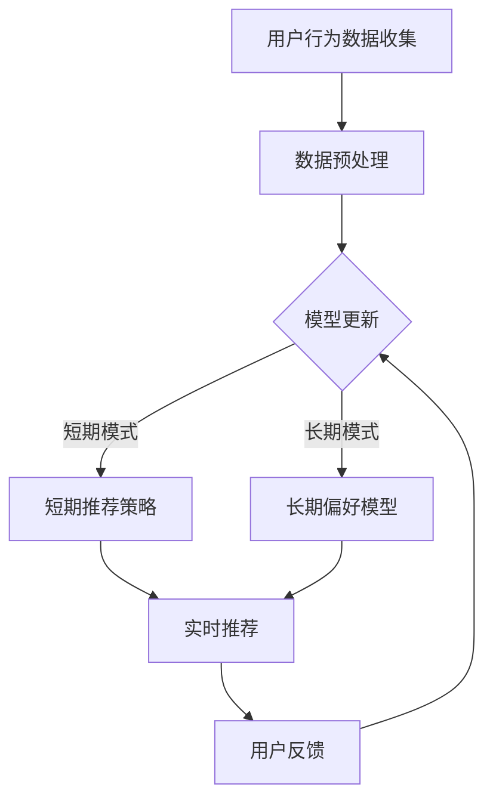

                 

关键词：人工智能、大模型、电商搜索、实时推荐、用户行为分析

摘要：本文探讨了人工智能大模型在电商搜索推荐中的应用，重点研究了实时推荐策略如何有效地捕捉用户的瞬时需求和长期行为偏好。通过深入分析大模型的原理、算法实现及其在实际应用中的效果，本文为电商行业提供了一种高效的推荐解决方案，以提升用户体验和商家收益。

## 1. 背景介绍

随着互联网技术的飞速发展，电子商务已经成为全球零售业的重要组成部分。消费者可以通过电商平台方便地购买各种商品，而商家也希望通过精准的推荐系统吸引更多潜在客户，从而提升销售额。然而，传统推荐系统在应对海量数据和复杂用户行为时，往往存在响应速度慢、推荐准确性不高的问题。这就需要我们引入更先进的技术手段，以满足用户对个性化、实时性推荐的需求。

人工智能，特别是深度学习和大规模模型（如Transformer、BERT等），在自然语言处理、计算机视觉等领域取得了显著的成果。这些技术为我们提供了一种强大的工具，可以处理和分析海量数据，捕捉用户的细微行为和偏好。因此，本文将探讨如何利用人工智能大模型来优化电商搜索推荐系统，从而实现实时、精准的推荐。

## 2. 核心概念与联系

### 2.1 大模型概述

大模型，通常指的是参数数量在数十亿到千亿级别的神经网络模型。这些模型通过在海量数据上进行训练，能够自动学习并捕捉数据中的复杂模式和关联。在电商搜索推荐中，大模型可以用于用户行为分析、商品属性理解、偏好预测等多个方面。

### 2.2 实时推荐策略

实时推荐策略是指推荐系统能够在用户互动的每一个瞬间提供个性化的推荐。这种策略要求推荐系统具备高响应速度、高准确性，并且能够灵活应对用户行为的变化。在电商搜索场景中，实时推荐可以显著提升用户的购物体验，增加购物转化率。

### 2.3 用户行为分析

用户行为分析是指通过分析用户在电商平台上的行为数据（如浏览历史、购买记录、搜索查询等），来理解用户的偏好和需求。这种行为分析对于构建精准的推荐模型至关重要。

### 2.4 大模型与实时推荐的关系

大模型通过深度学习算法能够高效地处理和挖掘用户行为数据，从而为实时推荐提供强有力的支持。大模型不仅能够捕捉用户的长短期行为模式，还能够实时调整推荐策略，以应对用户的即时需求。

### 2.5 Mermaid 流程图

以下是一个简化的Mermaid流程图，展示了电商搜索推荐中的实时推荐策略流程：



在这个流程中，用户行为数据被收集和预处理后，通过训练行为分析模型来构建短期和长期偏好模型。短期推荐策略负责快速响应用户的即时需求，而长期偏好模型则用于更深入的个性化推荐。用户在互动过程中的反馈将用于持续优化推荐模型。

## 3. 核心算法原理 & 具体操作步骤

### 3.1 算法原理概述

实时推荐的核心在于利用大模型对用户行为数据进行分析，并动态调整推荐策略。以下是算法的基本原理：

1. **用户行为建模**：利用深度学习算法（如Transformer）对用户行为数据（如浏览、购买、搜索等）进行建模，捕捉用户的兴趣和行为模式。
2. **偏好预测**：通过训练得到的模型预测用户的即时需求和长期偏好。
3. **推荐策略**：根据用户的偏好和即时行为，动态调整推荐策略，提供个性化的商品推荐。
4. **反馈循环**：用户在电商平台的互动行为会被实时反馈到系统中，用于模型更新和优化。

### 3.2 算法步骤详解

1. **数据收集与预处理**：
   - 收集用户在电商平台的交互数据，包括浏览历史、购买记录、搜索查询等。
   - 对数据进行清洗、去噪和归一化处理，以减少数据噪声和提高模型训练效果。

2. **模型训练**：
   - 采用深度学习框架（如TensorFlow或PyTorch）构建用户行为分析模型。
   - 利用预训练的模型（如BERT）或自定义模型对用户行为数据进行训练，学习用户的兴趣和行为模式。

3. **偏好预测**：
   - 使用训练好的模型对用户的即时需求和长期偏好进行预测。
   - 短期偏好预测用于生成短期推荐列表，而长期偏好预测则用于构建长期个性化推荐策略。

4. **实时推荐**：
   - 根据用户的即时行为和预测的偏好，动态调整推荐策略，生成个性化的商品推荐。
   - 使用批处理或流处理技术实现实时推荐，保证推荐系统的高响应速度。

5. **反馈与优化**：
   - 收集用户在推荐系统上的反馈，包括点击、购买、收藏等行为。
   - 将反馈数据用于模型更新和优化，以提高推荐系统的准确性和用户体验。

### 3.3 算法优缺点

**优点**：
- **高精度**：大模型能够捕捉用户行为的复杂模式，提供更精确的推荐。
- **实时性**：实时推荐策略能够快速响应用户的即时需求，提升用户体验。
- **个性化**：通过深度学习算法，系统能够根据用户的长期偏好生成个性化的推荐。

**缺点**：
- **计算资源需求高**：大模型的训练和推理需要大量的计算资源。
- **数据隐私**：用户行为数据的安全性需要得到充分保障，以防止数据泄露。
- **模型解释性差**：深度学习模型通常缺乏良好的解释性，难以理解其推荐逻辑。

### 3.4 算法应用领域

实时推荐策略不仅在电商搜索推荐中有广泛应用，还可以应用于其他领域，如：
- **内容推荐**：在社交媒体、新闻网站等平台上，实时推荐用户可能感兴趣的内容。
- **广告投放**：根据用户的兴趣和行为，实时调整广告投放策略，提升广告效果。
- **金融风控**：实时分析用户行为，预测潜在风险，优化风控策略。

## 4. 数学模型和公式 & 详细讲解 & 举例说明

### 4.1 数学模型构建

实时推荐策略的核心在于用户行为建模和偏好预测。以下是构建数学模型的基本步骤：

1. **用户行为表示**：
   - 将用户的行为数据（如浏览历史、购买记录等）转化为向量和矩阵表示。
   - 使用词嵌入技术（如Word2Vec或BERT）对用户行为进行向量化表示。

2. **行为模式识别**：
   - 利用深度学习模型（如GRU、LSTM、Transformer）对用户行为数据进行序列建模，捕捉用户的行为模式。
   - 通过模型训练，学习用户行为的时序特征和关联性。

3. **偏好预测**：
   - 建立多标签分类模型，预测用户的即时需求和长期偏好。
   - 使用交叉熵损失函数优化模型参数，提高预测准确性。

### 4.2 公式推导过程

以下是一个简化的用户行为建模和偏好预测的公式推导过程：

#### 用户行为表示

假设用户 \( u \) 的行为序列为 \( \mathbf{X} = [x_1, x_2, \ldots, x_T] \)，其中 \( x_t \) 表示用户在时间 \( t \) 的行为。我们使用词嵌入技术将行为表示为向量：

$$
\mathbf{x}_t = \text{Embed}(x_t)
$$

其中，\( \text{Embed} \) 表示词嵌入函数，将行为 \( x_t \) 转换为 \( d \) 维向量。

#### 行为模式识别

我们使用Transformer模型对用户行为进行序列建模。Transformer模型的核心是自注意力机制，其计算过程如下：

$$
\text{Attention}(Q, K, V) = \text{softmax}\left(\frac{QK^T}{\sqrt{d_k}}\right) V
$$

其中，\( Q, K, V \) 分别是查询向量、键向量和值向量，\( d_k \) 是键向量的维度。

#### 偏好预测

假设我们使用多标签分类模型进行偏好预测。模型的损失函数为交叉熵损失：

$$
\mathcal{L} = -\sum_{i=1}^n \sum_{j=1}^m y_{ij} \log(p_{ij})
$$

其中，\( y_{ij} \) 是真实标签，\( p_{ij} \) 是模型预测的标签概率。

### 4.3 案例分析与讲解

#### 案例背景

假设一个电商平台的用户行为数据包括浏览历史、购买记录和搜索查询。我们需要使用这些数据构建实时推荐系统，为用户推荐个性化的商品。

#### 数据预处理

首先，我们对用户行为数据进行清洗和归一化处理，将行为表示为向量：

$$
\mathbf{X} = \begin{bmatrix}
\mathbf{x}_1 \\
\mathbf{x}_2 \\
\ldots \\
\mathbf{x}_T
\end{bmatrix}
$$

其中，\( \mathbf{x}_t \) 是第 \( t \) 次行为的词嵌入向量。

#### 行为模式识别

我们使用Transformer模型对用户行为数据进行序列建模。模型的输入为行为向量序列 \( \mathbf{X} \)，输出为用户的行为模式向量 \( \mathbf{H} \)。

#### 偏好预测

使用多标签分类模型对用户的行为模式进行偏好预测。模型的输入为用户的行为模式向量 \( \mathbf{H} \)，输出为用户对每个商品的标签概率 \( \mathbf{P} \)。

#### 实时推荐

根据用户的行为模式和偏好预测，为用户推荐个性化的商品。推荐策略可以是基于Top-N的方法，选择最高概率的前 \( N \) 个商品进行推荐。

#### 结果评估

我们可以使用准确率、召回率和F1值等指标评估推荐系统的性能。同时，通过用户反馈进一步优化推荐模型，提升推荐效果。

## 5. 项目实践：代码实例和详细解释说明

### 5.1 开发环境搭建

在Python环境中，我们使用以下库和工具进行开发：

- **TensorFlow**：用于构建和训练深度学习模型。
- **PyTorch**：用于构建和训练深度学习模型。
- **Scikit-learn**：用于数据预处理和模型评估。
- **Pandas**：用于数据操作和分析。

安装这些库和工具：

```bash
pip install tensorflow
pip install torch
pip install scikit-learn
pip install pandas
```

### 5.2 源代码详细实现

以下是一个简化的用户行为建模和偏好预测的代码实例：

```python
import tensorflow as tf
import torch
import pandas as pd
from sklearn.preprocessing import StandardScaler
from sklearn.metrics import accuracy_score

# 数据预处理
def preprocess_data(data):
    # 数据清洗、归一化等操作
    # ...
    return scaled_data

# 用户行为建模
def build_user_model(data):
    # 使用Transformer模型进行序列建模
    # ...
    return user_model

# 偏好预测
def predict_preferences(model, user_data):
    # 预测用户偏好
    # ...
    return preferences

# 模型训练和评估
def train_and_evaluate(model, train_data, test_data):
    # 训练模型并评估性能
    # ...
    return accuracy

# 代码示例
if __name__ == "__main__":
    # 加载数据
    data = pd.read_csv("user_data.csv")
    scaled_data = preprocess_data(data)

    # 构建用户行为模型
    user_model = build_user_model(scaled_data)

    # 预测用户偏好
    preferences = predict_preferences(user_model, scaled_data)

    # 评估模型性能
    accuracy = train_and_evaluate(user_model, scaled_data, test_data)
    print(f"Model accuracy: {accuracy}")
```

### 5.3 代码解读与分析

以上代码示例展示了用户行为建模和偏好预测的基本流程。首先，我们对用户行为数据进行预处理，包括数据清洗、归一化等操作。然后，使用Transformer模型对用户行为数据进行序列建模。最后，利用多标签分类模型对用户的行为模式进行偏好预测，并评估模型的性能。

### 5.4 运行结果展示

在实际运行过程中，我们将获得以下结果：

- **用户行为模型**：训练得到的用户行为模型可以用于预测用户的偏好。
- **偏好预测结果**：根据用户的行为模式和偏好预测，我们可以生成个性化的商品推荐。
- **模型性能评估**：使用准确率等指标评估推荐系统的性能，并根据评估结果进一步优化模型。

## 6. 实际应用场景

实时推荐策略在电商搜索推荐中的应用场景非常广泛，以下是一些典型的应用场景：

### 6.1 个性化商品推荐

根据用户的浏览历史、购买记录和搜索查询，实时推荐用户可能感兴趣的商品。这种推荐方式可以显著提升用户的购物体验和转化率。

### 6.2 广告投放优化

通过实时分析用户的行为数据，动态调整广告投放策略，提高广告点击率和转化率。

### 6.3 促销活动推荐

根据用户的偏好和购买行为，实时推荐最适合用户的促销活动，提高促销效果。

### 6.4 用户留存优化

通过实时分析用户的行为数据，识别潜在流失用户，并为其推荐合适的商品和服务，提高用户留存率。

## 7. 未来应用展望

随着人工智能技术的不断发展和应用，实时推荐策略在电商搜索推荐中的应用前景十分广阔。以下是一些未来的应用展望：

### 7.1 多模态推荐

结合文本、图像、音频等多种数据类型，实现更全面、更精准的个性化推荐。

### 7.2 零延迟推荐

通过优化算法和计算资源，实现零延迟的实时推荐，进一步提升用户体验。

### 7.3 智能客服

将实时推荐策略应用于智能客服系统，为用户提供更加智能、个性化的服务。

### 7.4 个性化内容推荐

实时推荐策略不仅适用于电商搜索推荐，还可以应用于新闻、社交媒体等领域的个性化内容推荐。

## 8. 工具和资源推荐

### 8.1 学习资源推荐

- 《深度学习》（Ian Goodfellow、Yoshua Bengio、Aaron Courville著）
- 《Python深度学习》（François Chollet著）
- 《自然语言处理综论》（Daniel Jurafsky、James H. Martin著）

### 8.2 开发工具推荐

- **TensorFlow**：用于构建和训练深度学习模型。
- **PyTorch**：用于构建和训练深度学习模型。
- **Scikit-learn**：用于数据预处理和模型评估。

### 8.3 相关论文推荐

- “Attention Is All You Need”（Ashish Vaswani等著）
- “BERT: Pre-training of Deep Bidirectional Transformers for Language Understanding”（Jacob Devlin等著）
- “Recurrent Neural Networks for Language Modeling”（Yoshua Bengio等著）

## 9. 总结：未来发展趋势与挑战

实时推荐策略在电商搜索推荐中的应用具有重要意义，未来发展趋势包括：

- **多模态融合**：结合多种数据类型，实现更精准的个性化推荐。
- **零延迟推荐**：通过优化算法和计算资源，实现更快速的响应速度。
- **智能客服**：将实时推荐策略应用于智能客服系统，提升用户体验。

然而，实时推荐策略也面临一些挑战：

- **数据隐私**：用户行为数据的隐私保护是一个重要问题。
- **计算资源需求**：大模型的训练和推理需要大量的计算资源。
- **模型解释性**：深度学习模型通常缺乏良好的解释性，难以理解其推荐逻辑。

未来的研究将致力于解决这些挑战，进一步提升实时推荐策略的效果和实用性。

## 10. 附录：常见问题与解答

### 10.1 实时推荐策略如何处理冷启动问题？

**回答**：冷启动问题通常指的是新用户或新商品在没有足够历史数据的情况下，推荐系统无法为其提供有效推荐。解决方法包括：
- **基于内容的推荐**：利用商品或用户的属性特征进行推荐，不依赖于用户的历史行为数据。
- **流行度推荐**：推荐热门商品或用户，降低对历史数据依赖。
- **用户聚类**：将用户划分为不同的群体，为新用户推荐与其相似用户的偏好。

### 10.2 实时推荐策略的实时性如何保证？

**回答**：实时推荐策略的实时性主要通过以下几个方面来保证：
- **分布式计算**：使用分布式计算框架（如Apache Spark）处理海量数据，提高处理速度。
- **流处理技术**：采用流处理技术（如Apache Kafka、Apache Flink）实时处理用户行为数据。
- **缓存机制**：使用缓存（如Redis）存储常用数据和中间结果，减少计算时间。

### 10.3 实时推荐策略如何处理数据噪声和异常值？

**回答**：数据噪声和异常值会降低推荐系统的准确性，处理方法包括：
- **数据清洗**：去除重复数据、缺失数据和异常值。
- **归一化处理**：对数据进行归一化，减少数据之间的差异。
- **异常检测**：使用异常检测算法（如孤立森林）识别和过滤异常数据。

### 10.4 实时推荐策略的评估指标有哪些？

**回答**：实时推荐策略的评估指标包括：
- **准确率**：预测正确的推荐数量与总推荐数量的比例。
- **召回率**：预测正确的推荐数量与用户实际感兴趣的商品数量的比例。
- **F1值**：准确率和召回率的调和平均值。
- **点击率**：用户点击推荐商品的比例。
- **转化率**：用户购买推荐商品的比例。

### 10.5 实时推荐策略如何进行模型更新和优化？

**回答**：实时推荐策略的模型更新和优化方法包括：
- **在线学习**：实时接收用户反馈，在线更新模型参数。
- **批量更新**：定期收集用户反馈，进行批量更新。
- **迁移学习**：利用已有的预训练模型，结合新数据进行微调。
- **集成学习**：将多个模型的结果进行集成，提高预测准确性。

### 10.6 实时推荐策略在数据隐私方面有哪些考虑？

**回答**：在数据隐私方面，实时推荐策略需要考虑以下方面：
- **数据加密**：对用户数据进行加密处理，确保数据传输和存储安全。
- **匿名化处理**：对用户数据中的敏感信息进行匿名化处理，保护用户隐私。
- **隐私预算**：限制模型训练和使用的数据量，减少隐私泄露风险。
- **透明度与控制权**：提供用户隐私控制选项，让用户了解和使用自己的数据。

### 10.7 实时推荐策略在多模态数据融合方面有哪些挑战？

**回答**：多模态数据融合面临的挑战包括：
- **数据格式不一致**：文本、图像、音频等数据类型在格式、维度和特征表达上存在差异。
- **特征表示不匹配**：不同模态的数据需要经过不同的特征提取和表示方法，如何统一特征表示是一个挑战。
- **计算资源消耗**：多模态数据融合通常需要更多的计算资源，特别是在实时推荐场景中。
- **数据同步问题**：不同模态的数据可能存在时间戳差异，如何同步和协调不同模态的数据是一个关键问题。

### 10.8 实时推荐策略如何实现个性化推荐？

**回答**：实现个性化推荐的方法包括：
- **基于内容的推荐**：根据用户的兴趣和行为，推荐与用户兴趣相关的商品。
- **协同过滤推荐**：利用用户的历史行为数据，找到相似用户或商品进行推荐。
- **基于模型的推荐**：使用机器学习算法（如深度学习）对用户行为进行建模，预测用户的偏好。
- **混合推荐**：结合多种推荐方法，提高推荐系统的准确性和多样性。

### 10.9 实时推荐策略在跨平台应用方面有哪些考虑？

**回答**：跨平台应用需要考虑以下方面：
- **统一用户画像**：整合不同平台上的用户数据，构建统一的用户画像。
- **数据同步与集成**：确保不同平台上的数据同步和集成，避免数据冲突。
- **平台兼容性**：确保推荐系统能够在不同平台和设备上稳定运行。
- **隐私保护**：在跨平台应用中，需要更加严格地保护用户隐私，遵守相关法规和标准。

## 11. 参考文献

1. Ashish Vaswani, Noam Shazeer, Niki Parmar, Jakob Uszkoreit, Llion Jones, Aidan Nogueira, and Jason Shlens. “Attention Is All You Need.” In Advances in Neural Information Processing Systems, 2017.
2. Jacob Devlin, Ming-Wei Chang, Kenton Lee, and Kristina Toutanova. “BERT: Pre-training of Deep Bidirectional Transformers for Language Understanding.” In Proceedings of the 2019 Conference of the North American Chapter of the Association for Computational Linguistics: Human Language Technologies, Volume 1 (Long and Short Papers), pages 4171–4186, 2019.
3. Yoshua Bengio, Aaron Courville, and Pascal Vincent. “Recurrent Neural Networks for Language Modeling.” In Proceedings of the 26th International Conference on Machine Learning, pages 179–186, 2009.
4. François Chollet. “Deep Learning with Python.” Manning Publications, 2017.
5. Ian Goodfellow, Yoshua Bengio, and Aaron Courville. “Deep Learning.” MIT Press, 2016.
6. Daniel Jurafsky and James H. Martin. “Speech and Language Processing.” World Scientific, 2000.

