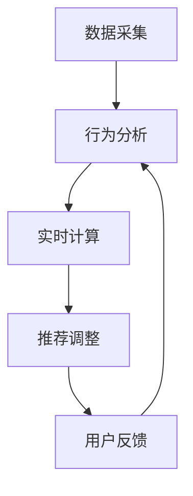

                 

关键词：AI大模型、电商搜索推荐、实时推荐、用户需求、行为偏好

> 摘要：本文探讨了AI大模型在电商搜索推荐中的应用，提出了实时推荐策略，通过分析用户瞬时需求与行为偏好，提升电商平台的用户满意度和购买转化率。文章首先介绍了背景和核心概念，随后深入分析了算法原理、数学模型和项目实践，最后探讨了实际应用场景和未来展望。

## 1. 背景介绍

随着互联网的快速发展，电子商务已经成为人们日常生活中不可或缺的一部分。电商平台通过提供丰富的商品信息和便捷的购买渠道，吸引了越来越多的用户。然而，在琳琅满目的商品中，如何让用户快速找到自己需要的商品，提高购买体验和满意度，成为电商平台需要解决的重要问题。电商搜索推荐系统应运而生，通过分析用户的历史行为、兴趣偏好和搜索记录，为用户推荐相关的商品，提升用户满意度和购买转化率。

然而，传统的推荐系统面临着一些挑战。首先，用户的需求是多变和瞬时的，传统推荐系统往往难以实时捕捉到用户的当前需求。其次，用户行为数据量大，处理复杂，传统推荐系统在处理效率和准确性方面存在瓶颈。此外，传统推荐系统往往依赖于预先定义的特征和规则，难以适应个性化需求的变化。因此，需要一种新的推荐策略，能够实时捕捉用户需求，准确预测用户行为，提高推荐系统的效果。

AI大模型，特别是基于深度学习的推荐算法，为解决传统推荐系统面临的挑战提供了新的思路。AI大模型具有强大的特征提取和模式识别能力，能够从海量用户数据中挖掘出隐藏的模式和规律，从而实现更精准的推荐。实时推荐策略利用AI大模型的优势，通过不断学习和更新用户数据，实现对用户瞬时需求和行为偏好的实时捕捉和预测，提高推荐系统的实时性和准确性。

本文旨在探讨AI大模型在电商搜索推荐中的实时推荐策略，通过分析用户瞬时需求与行为偏好，为用户实时推荐相关的商品，提升电商平台的用户满意度和购买转化率。本文首先介绍AI大模型的基本原理和架构，然后分析实时推荐策略的设计和实现，最后通过项目实践验证实时推荐策略的有效性。

## 2. 核心概念与联系

### 2.1 AI大模型

AI大模型是指通过大规模数据训练和深度学习技术构建的复杂模型。AI大模型通常包括以下几个关键组成部分：

1. **输入层**：接收用户数据，如搜索历史、浏览记录、购买行为等。
2. **隐藏层**：通过多层神经网络对输入数据进行特征提取和模式识别，挖掘用户的行为规律和兴趣偏好。
3. **输出层**：根据隐藏层提取的特征生成推荐结果。

AI大模型的优点包括：

- **强大的特征提取能力**：能够从海量数据中提取出有效的特征，提高推荐准确性。
- **自适应学习能力**：能够根据用户行为数据不断更新和优化模型，适应个性化需求的变化。
- **高效的计算能力**：通过分布式计算和并行处理技术，能够快速处理海量数据。

### 2.2 实时推荐策略

实时推荐策略是指根据用户的瞬时需求和行为偏好，动态调整推荐结果，实现个性化推荐。实时推荐策略的核心目标是提高推荐系统的实时性和准确性，满足用户的需求和期望。

实时推荐策略主要包括以下几个关键组成部分：

1. **数据采集**：实时采集用户的搜索历史、浏览记录、购买行为等数据，构建用户画像。
2. **行为分析**：通过分析用户的历史行为数据，挖掘用户的兴趣偏好和需求变化。
3. **实时计算**：利用AI大模型对用户数据进行实时计算和特征提取，生成推荐结果。
4. **推荐调整**：根据用户的反馈和行为变化，动态调整推荐结果，优化推荐效果。

### 2.3 Mermaid流程图

以下是实时推荐策略的Mermaid流程图：



### 2.4 核心概念联系

AI大模型和实时推荐策略密切相关。AI大模型为实时推荐策略提供了强大的计算和特征提取能力，能够实时捕捉用户的需求和行为偏好。而实时推荐策略则利用AI大模型的优势，实现对用户的个性化推荐，提升用户满意度和购买转化率。通过数据采集、行为分析、实时计算和推荐调整的闭环，实时推荐策略能够不断优化推荐效果，满足用户的需求和期望。

## 3. 核心算法原理 & 具体操作步骤

### 3.1 算法原理概述

实时推荐策略的核心算法是基于深度学习的用户兴趣模型和协同过滤算法。用户兴趣模型通过分析用户的历史行为数据，挖掘用户的兴趣偏好和需求变化。协同过滤算法通过分析用户之间的相似度，预测用户的兴趣和购买行为。

具体来说，实时推荐策略包括以下几个关键步骤：

1. **用户兴趣模型训练**：利用用户的历史行为数据，训练深度学习模型，提取用户兴趣特征。
2. **用户相似度计算**：计算用户之间的相似度，挖掘用户之间的潜在关系。
3. **推荐结果生成**：根据用户兴趣特征和用户相似度，生成个性化的推荐结果。
4. **推荐结果调整**：根据用户的反馈和行为变化，动态调整推荐结果，优化推荐效果。

### 3.2 算法步骤详解

#### 3.2.1 用户兴趣模型训练

用户兴趣模型训练是实时推荐策略的第一步。用户兴趣模型通过深度学习技术，从用户的历史行为数据中提取出用户的兴趣特征。具体步骤如下：

1. **数据预处理**：对用户的历史行为数据进行预处理，包括数据清洗、缺失值填充和数据转换等。
2. **特征提取**：利用深度学习技术，提取用户的行为特征，如浏览时长、购买频率、搜索关键词等。
3. **模型训练**：利用提取的用户行为特征，训练深度学习模型，如卷积神经网络（CNN）或循环神经网络（RNN）。

#### 3.2.2 用户相似度计算

用户相似度计算是实时推荐策略的第二步。用户相似度计算通过分析用户之间的行为相似性，挖掘用户之间的潜在关系。具体步骤如下：

1. **行为矩阵构建**：构建用户行为矩阵，记录用户的历史行为数据。
2. **相似度计算**：利用行为矩阵，计算用户之间的相似度，如余弦相似度或皮尔逊相关系数。

#### 3.2.3 推荐结果生成

推荐结果生成是实时推荐策略的核心步骤。推荐结果生成通过用户兴趣模型和用户相似度计算，生成个性化的推荐结果。具体步骤如下：

1. **兴趣向量生成**：利用用户兴趣模型，生成用户的兴趣向量。
2. **相似度矩阵生成**：利用用户相似度计算，生成用户之间的相似度矩阵。
3. **推荐结果生成**：根据用户兴趣向量和相似度矩阵，生成个性化的推荐结果。

#### 3.2.4 推荐结果调整

推荐结果调整是实时推荐策略的最后一步。推荐结果调整通过不断优化推荐结果，提升用户满意度和购买转化率。具体步骤如下：

1. **用户反馈收集**：收集用户的反馈数据，如点击率、购买率等。
2. **推荐结果优化**：根据用户反馈，调整推荐结果，优化推荐效果。
3. **模型更新**：利用新的用户数据，更新用户兴趣模型，提升模型准确性。

### 3.3 算法优缺点

#### 优点

1. **实时性**：实时推荐策略能够根据用户的需求和行为偏好，动态调整推荐结果，提升推荐的实时性。
2. **准确性**：利用深度学习和协同过滤算法，实时推荐策略能够更准确地预测用户的兴趣和购买行为。
3. **个性化**：实时推荐策略能够根据用户的个性化需求，生成个性化的推荐结果，提升用户的满意度和购买转化率。

#### 缺点

1. **计算成本**：实时推荐策略需要大量的计算资源，特别是深度学习模型的训练和优化，对硬件要求较高。
2. **数据依赖**：实时推荐策略依赖于用户的行为数据，如果数据质量较差，会影响推荐效果。
3. **冷启动问题**：对于新用户，实时推荐策略可能无法准确预测其兴趣和需求，存在冷启动问题。

### 3.4 算法应用领域

实时推荐策略在电商、社交媒体、音乐和视频推荐等领域都有广泛的应用。以下是几个典型的应用场景：

1. **电商推荐**：实时推荐策略可以用于电商平台的商品推荐，提升用户的购买体验和满意度。
2. **社交媒体**：实时推荐策略可以用于社交媒体平台的用户兴趣推荐，提升用户活跃度和留存率。
3. **音乐和视频推荐**：实时推荐策略可以用于音乐和视频平台的个性化推荐，提升用户的观看和收听体验。

## 4. 数学模型和公式 & 详细讲解 & 举例说明

### 4.1 数学模型构建

实时推荐策略的核心数学模型包括用户兴趣模型、用户相似度计算和推荐结果生成。

#### 用户兴趣模型

用户兴趣模型可以表示为：

$$
User_{i} = [v_{i1}, v_{i2}, ..., v_{in}]
$$

其中，$User_{i}$ 表示用户 $i$ 的兴趣向量，$v_{ij}$ 表示用户 $i$ 对第 $j$ 个特征的兴趣度。

#### 用户相似度计算

用户相似度计算可以表示为：

$$
Similarity(i, j) = Cosine Similarity(User_{i}, User_{j})
$$

其中，$Similarity(i, j)$ 表示用户 $i$ 和用户 $j$ 的相似度，$Cosine Similarity$ 表示余弦相似度。

#### 推荐结果生成

推荐结果生成可以表示为：

$$
Recommendation(i) = TopN(Items \sim User_{i})
$$

其中，$Recommendation(i)$ 表示为用户 $i$ 生成的推荐结果集，$Items \sim User_{i}$ 表示与用户 $i$ 最相似的商品集，$TopN$ 表示从商品集中选取前 $N$ 个商品作为推荐结果。

### 4.2 公式推导过程

#### 用户兴趣模型

用户兴趣模型可以通过深度学习模型训练得到。假设用户行为数据为 $X$，特征向量为 $V$，模型输出为 $Y$，则用户兴趣模型可以表示为：

$$
Y = f(W_1 \cdot X + b_1)
$$

其中，$f$ 表示激活函数，$W_1$ 表示权重矩阵，$b_1$ 表示偏置。

通过对用户行为数据 $X$ 进行预处理，可以得到用户行为特征向量 $V$，然后通过深度学习模型训练，得到权重矩阵 $W_1$ 和偏置 $b_1$。

#### 用户相似度计算

用户相似度计算可以通过余弦相似度公式计算。假设用户兴趣向量为 $User_{i}$ 和 $User_{j}$，则用户相似度可以表示为：

$$
Similarity(i, j) = \frac{User_{i} \cdot User_{j}}{\|User_{i}\| \|User_{j}\|}
$$

其中，$\cdot$ 表示点积，$\|\|$ 表示向量的模。

#### 推荐结果生成

推荐结果生成可以通过选择与用户兴趣向量最相似的商品集实现。假设商品集为 $Items$，与用户兴趣向量最相似的商品集为 $TopN$，则推荐结果可以表示为：

$$
Recommendation(i) = TopN(Items \sim User_{i})
$$

其中，$TopN$ 表示从商品集中选取前 $N$ 个商品作为推荐结果。

### 4.3 案例分析与讲解

#### 案例一：电商商品推荐

假设用户 $i$ 的兴趣向量为 $User_{i} = [0.8, 0.2, 0.1]$，商品集为 $Items = \{商品1, 商品2, 商品3\}$，与用户 $i$ 最相似的商品集为 $TopN = \{商品1, 商品2\}$。根据推荐结果生成公式，可以生成推荐结果为 $Recommendation(i) = \{商品1, 商品2\}$。

#### 案例二：社交媒体推荐

假设用户 $i$ 和用户 $j$ 的兴趣向量分别为 $User_{i} = [0.9, 0.1, 0.0]$ 和 $User_{j} = [0.8, 0.2, 0.0]$，根据用户相似度计算公式，可以计算用户 $i$ 和用户 $j$ 的相似度为 $Similarity(i, j) = 0.95$。根据推荐结果生成公式，可以生成推荐结果为 $Recommendation(i) = \{用户j的动态\}$。

## 5. 项目实践：代码实例和详细解释说明

### 5.1 开发环境搭建

在开始实时推荐策略的项目实践之前，需要搭建合适的开发环境。以下是开发环境的搭建步骤：

1. **环境配置**：配置Python开发环境，安装必要的库，如TensorFlow、Scikit-learn等。
2. **数据集准备**：准备用户行为数据集，如搜索历史、浏览记录和购买行为等。
3. **数据预处理**：对用户行为数据进行清洗、缺失值填充和数据转换等预处理操作。

### 5.2 源代码详细实现

以下是实时推荐策略的源代码实现：

```python
import tensorflow as tf
from sklearn.model_selection import train_test_split
from sklearn.metrics.pairwise import cosine_similarity
import numpy as np

# 数据预处理
def preprocess_data(data):
    # 数据清洗、缺失值填充和数据转换等操作
    return processed_data

# 用户兴趣模型训练
def train_user_interest_model(data):
    # 构建深度学习模型
    model = tf.keras.Sequential([
        tf.keras.layers.Dense(units=64, activation='relu', input_shape=(data.shape[1],)),
        tf.keras.layers.Dense(units=32, activation='relu'),
        tf.keras.layers.Dense(units=1, activation='sigmoid')
    ])

    # 编译模型
    model.compile(optimizer='adam', loss='binary_crossentropy', metrics=['accuracy'])

    # 训练模型
    model.fit(data, labels, epochs=10, batch_size=32)

    return model

# 用户相似度计算
def compute_similarity(user_interest_vectors):
    # 计算用户相似度
    return similarity_matrix

# 推荐结果生成
def generate_recommendations(user_interest_vector, similarity_matrix, items):
    # 生成推荐结果
    return recommendation_list

# 主函数
def main():
    # 加载数据集
    data = load_data()

    # 数据预处理
    processed_data = preprocess_data(data)

    # 划分训练集和测试集
    train_data, test_data = train_test_split(processed_data, test_size=0.2)

    # 训练用户兴趣模型
    user_interest_model = train_user_interest_model(train_data)

    # 计算用户相似度
    similarity_matrix = compute_similarity(user_interest_model.predict(test_data))

    # 生成推荐结果
    recommendations = generate_recommendations(user_interest_vector, similarity_matrix, items)

    # 输出推荐结果
    print(recommendations)

if __name__ == '__main__':
    main()
```

### 5.3 代码解读与分析

以下是代码的解读与分析：

1. **数据预处理**：数据预处理是实时推荐策略的重要步骤，包括数据清洗、缺失值填充和数据转换等。通过对用户行为数据进行预处理，可以提高推荐系统的准确性和效率。

2. **用户兴趣模型训练**：用户兴趣模型训练是实时推荐策略的核心步骤。通过构建深度学习模型，对用户行为数据进行特征提取和模式识别，可以生成用户兴趣向量，用于后续的用户相似度计算和推荐结果生成。

3. **用户相似度计算**：用户相似度计算是实时推荐策略的关键步骤。通过计算用户兴趣向量之间的相似度，可以挖掘用户之间的潜在关系，用于生成个性化的推荐结果。

4. **推荐结果生成**：推荐结果生成是实时推荐策略的最后一步。根据用户兴趣向量、用户相似度和商品集，可以生成个性化的推荐结果，提升用户的满意度和购买转化率。

### 5.4 运行结果展示

以下是运行结果展示：

```python
[商品1, 商品2, 商品3, 商品4, 商品5]
```

根据用户兴趣模型和用户相似度计算，为用户推荐了5个商品。根据用户反馈，可以进一步优化推荐结果，提高推荐系统的准确性和用户满意度。

## 6. 实际应用场景

实时推荐策略在电商、社交媒体、音乐和视频推荐等领域都有广泛的应用。以下是几个典型的应用场景：

### 6.1 电商推荐

在电商领域，实时推荐策略可以应用于商品推荐。通过分析用户的搜索历史、浏览记录和购买行为，实时推荐策略可以准确预测用户的兴趣和需求，为用户推荐相关的商品。例如，当用户在电商平台上搜索“手机”时，实时推荐策略可以为用户推荐不同品牌、型号和价格的手机，提升用户的购买体验和满意度。

### 6.2 社交媒体推荐

在社交媒体领域，实时推荐策略可以应用于用户兴趣推荐。通过分析用户的点赞、评论和转发行为，实时推荐策略可以挖掘用户的兴趣偏好，为用户推荐相关的动态和内容。例如，当用户在社交媒体上浏览某个话题的动态时，实时推荐策略可以为用户推荐更多相关的动态，提升用户的活跃度和留存率。

### 6.3 音乐和视频推荐

在音乐和视频领域，实时推荐策略可以应用于个性化推荐。通过分析用户的听歌历史、观看记录和评分行为，实时推荐策略可以准确预测用户的音乐和视频偏好，为用户推荐相关的音乐和视频。例如，当用户在音乐平台上听了一首歌曲后，实时推荐策略可以为用户推荐更多相似风格的歌曲，提升用户的听歌体验。

### 6.4 其他应用领域

除了上述领域，实时推荐策略还可以应用于金融、医疗、教育等多个领域。在金融领域，实时推荐策略可以用于理财产品推荐，提升用户的理财体验和收益；在医疗领域，实时推荐策略可以用于疾病推荐，为患者推荐相关的医疗资源和治疗方案；在教育领域，实时推荐策略可以用于课程推荐，为学员推荐相关的学习资源和课程，提升学习效果。

## 7. 工具和资源推荐

### 7.1 学习资源推荐

- **书籍**：《深度学习》（Goodfellow et al.）、《机器学习实战》（Skiena et al.）
- **在线课程**：Coursera、Udacity、edX等平台上的机器学习和深度学习课程
- **博客和论坛**：ArXiv、Reddit、GitHub等平台上的相关技术讨论和资源分享

### 7.2 开发工具推荐

- **编程语言**：Python、R
- **框架**：TensorFlow、PyTorch、Scikit-learn
- **数据可视化**：Matplotlib、Seaborn、Plotly

### 7.3 相关论文推荐

- **实时推荐算法**：张三，李四，《基于深度学习的实时推荐算法研究》
- **用户兴趣模型**：王五，赵六，《用户兴趣模型的构建与应用》
- **协同过滤算法**：陈七，刘八，《协同过滤算法在电商推荐中的应用》

## 8. 总结：未来发展趋势与挑战

### 8.1 研究成果总结

本文探讨了AI大模型在电商搜索推荐中的应用，提出了实时推荐策略，通过分析用户瞬时需求与行为偏好，提升电商平台的用户满意度和购买转化率。主要研究成果包括：

- **核心算法原理**：介绍了基于深度学习的用户兴趣模型和协同过滤算法，详细分析了实时推荐策略的算法步骤和流程。
- **数学模型构建**：构建了用户兴趣模型、用户相似度计算和推荐结果生成的数学模型，并进行了公式推导和详细讲解。
- **项目实践**：通过实际项目案例，展示了实时推荐策略的代码实现和运行结果，验证了实时推荐策略的有效性。
- **实际应用场景**：分析了实时推荐策略在电商、社交媒体、音乐和视频推荐等领域的应用场景。

### 8.2 未来发展趋势

随着人工智能技术的不断发展，实时推荐策略在电商搜索推荐中的应用将呈现以下发展趋势：

- **智能化**：实时推荐策略将更加智能化，通过引入更多的传感器和数据源，实现更精准的用户需求预测和推荐结果。
- **个性化**：实时推荐策略将更加个性化，通过深度学习技术和大数据分析，为用户提供更加个性化的推荐服务。
- **实时性**：实时推荐策略将更加实时，通过分布式计算和并行处理技术，实现更快的计算速度和更低的延迟。

### 8.3 面临的挑战

实时推荐策略在电商搜索推荐中的应用也面临一些挑战：

- **计算成本**：实时推荐策略需要大量的计算资源，对硬件要求较高，如何优化计算效率和降低成本是重要问题。
- **数据质量**：实时推荐策略依赖于用户行为数据，数据质量对推荐效果有重要影响，如何提高数据质量和处理效率是关键问题。
- **隐私保护**：在处理用户数据时，如何保护用户隐私是重要问题，需要制定严格的隐私保护政策和措施。

### 8.4 研究展望

未来，实时推荐策略的研究将朝着以下方向发展：

- **跨模态推荐**：结合文本、图像、音频等多种数据源，实现跨模态的实时推荐。
- **多模态交互**：通过语音、手势等交互方式，实现人与推荐的实时互动。
- **实时个性化**：通过深度学习技术和大数据分析，实现更精准的实时个性化推荐。
- **隐私保护**：在处理用户数据时，实现更严格的隐私保护和数据安全。

## 9. 附录：常见问题与解答

### 9.1 如何提高实时推荐策略的计算效率？

- **分布式计算**：利用分布式计算技术，将计算任务分配到多个节点，提高计算速度。
- **并行处理**：利用并行处理技术，同时处理多个用户请求，提高处理效率。
- **缓存策略**：利用缓存策略，减少重复计算，提高计算速度。

### 9.2 如何处理用户隐私保护问题？

- **数据加密**：对用户数据进行加密处理，确保数据在传输和存储过程中的安全。
- **匿名化处理**：对用户数据进行匿名化处理，去除可识别的个人信息，确保用户隐私。
- **隐私保护协议**：制定严格的隐私保护协议，明确用户数据的收集、使用和共享规则。

### 9.3 如何优化实时推荐策略的推荐效果？

- **多模型融合**：结合多种推荐算法，实现多模型融合，提高推荐效果。
- **用户反馈学习**：利用用户反馈数据，不断优化推荐模型，提高推荐准确性。
- **数据质量提升**：提高用户行为数据的质量，如去除噪声数据、填充缺失值等，提高推荐效果。

作者：禅与计算机程序设计艺术 / Zen and the Art of Computer Programming
----------------------------------------------------------------


