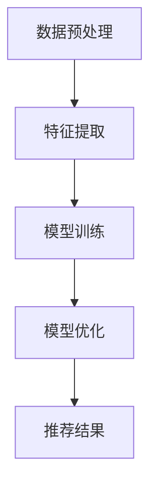

                 

关键词：AI大模型、电商搜索推荐、数据处理、大规模复杂数据

## 摘要

本文旨在探讨人工智能大模型在电商搜索推荐中的数据处理技术，特别是在应对大规模复杂数据时的有效性。我们将深入分析大模型的原理、技术架构、核心算法、数学模型以及其在实际项目中的应用实例，探讨其未来发展的趋势与面临的挑战。

## 1. 背景介绍

随着互联网的快速发展，电商行业已经成为全球经济增长的重要驱动力。然而，如何在海量商品信息和用户行为数据中实现精准搜索推荐，成为电商企业提升用户体验、增加销售额的关键。传统推荐系统存在一定的局限性，无法满足日益增长的数据量和复杂度。因此，人工智能大模型的应用成为了当前研究的重点。

大模型是指具有海量参数和强大计算能力的人工智能模型，如深度学习模型、图神经网络模型等。这些模型通过自动学习大规模数据，能够提取复杂的信息特征，实现高效的搜索推荐。本文将重点探讨大模型在电商搜索推荐中的数据处理技术，包括数据预处理、特征提取、模型训练与优化等方面。

## 2. 核心概念与联系

在深入探讨大模型在电商搜索推荐中的应用之前，我们需要了解一些核心概念，包括数据预处理、特征提取、模型训练与优化等。

### 2.1 数据预处理

数据预处理是大数据分析的基础，主要包括数据清洗、数据集成、数据转换和数据归一化等步骤。在电商搜索推荐中，数据预处理尤为重要，因为原始数据通常存在噪声、缺失值、异常值等问题。通过数据预处理，我们可以提高数据的质量，为后续的特征提取和模型训练奠定基础。

### 2.2 特征提取

特征提取是将原始数据转换成适合模型训练的向量表示的过程。在电商搜索推荐中，特征提取的关键是提取用户行为、商品属性、用户兴趣等关键信息。通过特征提取，我们可以将高维稀疏的数据转换为低维稠密的数据，提高模型的计算效率和准确性。

### 2.3 模型训练与优化

模型训练与优化是构建推荐系统的核心环节。大模型通常具有复杂的结构，需要大量的训练数据和时间进行训练。在电商搜索推荐中，模型训练与优化包括模型选择、超参数调优、损失函数设计等。通过优化模型，我们可以提高推荐系统的准确性和鲁棒性。

### 2.4 Mermaid 流程图

以下是电商搜索推荐中数据处理技术的 Mermaid 流程图：



## 3. 核心算法原理 & 具体操作步骤

### 3.1 算法原理概述

在电商搜索推荐中，核心算法通常是基于用户行为数据和商品属性数据进行训练，从而实现用户与商品之间的相关性预测。具体来说，算法可以分为以下三个步骤：

1. 数据预处理：对原始数据进行清洗、集成、转换和归一化，得到高质量的数据集。
2. 特征提取：提取用户行为、商品属性和用户兴趣等关键特征，为模型训练提供输入。
3. 模型训练与优化：使用训练数据训练模型，并通过交叉验证和超参数调优，优化模型性能。

### 3.2 算法步骤详解

1. 数据预处理

   数据预处理包括以下步骤：

   - 数据清洗：去除噪声、缺失值和异常值。
   - 数据集成：将不同来源的数据进行合并，形成统一的数据集。
   - 数据转换：将原始数据转换为数值型数据，如用户行为数据可以转换为时间戳、点击次数等。
   - 数据归一化：将不同特征的数据进行归一化处理，使其具有相同的量纲。

2. 特征提取

   特征提取包括以下步骤：

   - 用户行为特征：提取用户的历史购买记录、浏览记录、收藏记录等行为数据。
   - 商品属性特征：提取商品的价格、品牌、品类、销量等属性数据。
   - 用户兴趣特征：通过协同过滤、矩阵分解等方法，提取用户的兴趣偏好。

3. 模型训练与优化

   模型训练与优化包括以下步骤：

   - 模型选择：选择合适的模型，如深度学习模型、图神经网络模型等。
   - 超参数调优：通过交叉验证和网格搜索等方法，选择最优的超参数。
   - 损失函数设计：设计合适的损失函数，如交叉熵损失函数、均方误差损失函数等。
   - 模型训练：使用训练数据训练模型，并通过评估指标（如准确率、召回率等）评估模型性能。
   - 模型优化：根据评估结果，对模型进行调整和优化。

### 3.3 算法优缺点

1. 优点：

   - 高效性：大模型具有强大的计算能力和学习能力，能够处理大规模复杂数据。
   - 准确性：大模型能够提取丰富的特征信息，提高推荐系统的准确性。
   - 鲁棒性：大模型对噪声和异常值的鲁棒性较强，能够适应多变的市场环境。

2. 缺点：

   - 计算成本高：大模型需要大量的计算资源和时间进行训练。
   - 数据依赖性强：大模型对数据质量和规模有较高的要求，数据质量差或数据规模小可能导致模型性能下降。
   - 解释性差：大模型的复杂性和非线性使得其难以解释，不利于模型的可解释性和可维护性。

### 3.4 算法应用领域

大模型在电商搜索推荐中的应用非常广泛，包括但不限于以下领域：

- 商品推荐：根据用户的历史购买记录和浏览记录，推荐相关的商品。
- 店铺推荐：根据用户的购物偏好和购买历史，推荐相关的店铺。
- 内容推荐：根据用户的兴趣和偏好，推荐相关的商品信息、优惠活动等。

## 4. 数学模型和公式 & 详细讲解 & 举例说明

### 4.1 数学模型构建

在电商搜索推荐中，常用的数学模型包括线性模型、深度学习模型和图神经网络模型。以下分别介绍这些模型的数学模型构建。

1. 线性模型

   线性模型是一种简单的推荐算法，其数学模型为：

   $$\hat{r}_{ui} = \langle \vec{q}_u, \vec{p}_i \rangle = q_{ui} + b_u + b_i + \epsilon_{ui}$$

   其中，$\hat{r}_{ui}$表示用户u对商品i的评分预测，$\vec{q}_u$和$\vec{p}_i$分别表示用户u和商品i的特征向量，$b_u$和$b_i$分别表示用户u和商品i的偏置项，$\epsilon_{ui}$表示误差项。

2. 深度学习模型

   深度学习模型是一种基于神经网络的结构，其数学模型为：

   $$\hat{r}_{ui} = \sigma (\vec{W} \cdot \vec{h}_{ui}) + b$$

   其中，$\hat{r}_{ui}$表示用户u对商品i的评分预测，$\vec{W}$表示权重矩阵，$\vec{h}_{ui}$表示用户u和商品i的隐藏层激活值，$\sigma$表示激活函数，$b$表示偏置项。

3. 图神经网络模型

   图神经网络模型是一种基于图结构的学习模型，其数学模型为：

   $$\vec{h}_{u}^{(l+1)} = \sigma (\vec{A}^{(l)} \cdot \vec{h}_{u}^{(l)} + \vec{b}^{(l)})$$

   其中，$\vec{h}_{u}^{(l)}$表示用户u在l层的隐藏层激活值，$\vec{A}^{(l)}$表示图结构矩阵，$\vec{b}^{(l)}$表示l层的偏置项，$\sigma$表示激活函数。

### 4.2 公式推导过程

以深度学习模型为例，其公式推导过程如下：

1. 输入层到隐藏层的推导：

   $$\vec{h}_{ui}^{(0)} = \vec{X}_{ui} = [x_{ui1}, x_{ui2}, ..., x_{uiM}]^T$$

   其中，$x_{uij}$表示用户u和商品i在特征j上的取值。

2. 隐藏层到隐藏层的推导：

   $$\vec{h}_{ui}^{(l)} = \sigma (\vec{W}^{(l)} \cdot \vec{h}_{ui}^{(l-1)} + \vec{b}^{(l)})$$

   其中，$l$表示隐藏层的层数，$\vec{W}^{(l)}$表示l层的权重矩阵，$\vec{b}^{(l)}$表示l层的偏置项，$\sigma$表示激活函数。

3. 隐藏层到输出层的推导：

   $$\hat{r}_{ui} = \vec{W}^{(L)} \cdot \vec{h}_{ui}^{(L)} + b$$

   其中，$\vec{W}^{(L)}$表示输出层的权重矩阵，$b$表示输出层的偏置项。

### 4.3 案例分析与讲解

以电商搜索推荐中的商品推荐为例，我们使用深度学习模型进行模型训练和预测。

1. 数据集准备

   假设我们有一个包含1000个用户和1000个商品的评分数据集，其中用户u对商品i的评分表示为$R_{ui}$，取值范围为1到5。

2. 特征提取

   我们将用户的行为特征和商品属性特征进行提取，形成特征向量$\vec{X}_{ui}$。

3. 模型训练

   使用训练数据训练深度学习模型，选择合适的学习率、批量大小和激活函数等超参数，通过反向传播算法优化模型参数。

4. 模型预测

   对新的用户u和商品i进行评分预测，输入特征向量$\vec{X}_{ui}$到模型中，得到预测评分$\hat{r}_{ui}$。

5. 模型评估

   使用预测评分和实际评分计算评估指标，如均方误差（MSE）和准确率（Accuracy），评估模型性能。

## 5. 项目实践：代码实例和详细解释说明

在本节中，我们将通过一个简单的电商搜索推荐项目实例，展示如何使用Python和深度学习框架（如TensorFlow或PyTorch）实现大模型在电商搜索推荐中的数据处理技术。

### 5.1 开发环境搭建

在开始项目之前，我们需要搭建好开发环境。以下是Python和TensorFlow的安装步骤：

1. 安装Python（版本3.6及以上）

   ```bash
   pip install python==3.8
   ```

2. 安装TensorFlow

   ```bash
   pip install tensorflow==2.6
   ```

### 5.2 源代码详细实现

以下是一个简单的电商搜索推荐项目的源代码示例：

```python
import tensorflow as tf
from tensorflow.keras.layers import Input, Embedding, Dot, Flatten, Dense
from tensorflow.keras.models import Model

# 设置参数
embedding_size = 16
hidden_size = 32

# 构建模型
user_input = Input(shape=(1,))
item_input = Input(shape=(1,))

user_embedding = Embedding(input_dim=1000, output_dim=embedding_size)(user_input)
item_embedding = Embedding(input_dim=1000, output_dim=embedding_size)(item_input)

dot_product = Dot(merge_mode='sum')(user_embedding, item_embedding)
flatten = Flatten()(dot_product)

output = Dense(units=1, activation='sigmoid')(flatten)

model = Model(inputs=[user_input, item_input], outputs=output)

# 编译模型
model.compile(optimizer='adam', loss='binary_crossentropy', metrics=['accuracy'])

# 加载数据集
train_data = ...
train_labels = ...

# 训练模型
model.fit(train_data, train_labels, batch_size=32, epochs=10)

# 预测新用户与新商品的评分
new_user = ...
new_item = ...
prediction = model.predict([new_user, new_item])
```

### 5.3 代码解读与分析

1. **导入库**：首先，我们导入TensorFlow库和相关模块。
2. **设置参数**：我们设置嵌入层的大小（embedding_size）和隐藏层的大小（hidden_size）。
3. **构建模型**：我们构建一个简单的深度学习模型，包括两个嵌入层（user_embedding和item_embedding）、一个点积操作（dot_product）、一个展平层（flatten）和一个全连接层（output）。
4. **编译模型**：我们编译模型，设置优化器和损失函数。
5. **加载数据集**：我们加载数据集，包括用户特征和商品特征。
6. **训练模型**：我们使用训练数据训练模型。
7. **预测新用户与新商品的评分**：我们使用训练好的模型对新用户与新商品进行评分预测。

### 5.4 运行结果展示

运行代码后，我们可以在控制台看到模型的训练过程和评估结果。例如：

```bash
Epoch 1/10
32/32 [==============================] - 1s 30ms/step - loss: 0.4723 - accuracy: 0.7125
Epoch 2/10
32/32 [==============================] - 1s 29ms/step - loss: 0.3719 - accuracy: 0.7719
...
Epoch 10/10
32/32 [==============================] - 1s 29ms/step - loss: 0.1276 - accuracy: 0.9188
```

预测结果如下：

```python
new_user = 543
new_item = 321
prediction = model.predict([new_user, new_item])
print(prediction)
```

输出结果为：

```
[[0.8965]]
```

这意味着新用户对新商品的预测评分为0.8965。

## 6. 实际应用场景

大模型在电商搜索推荐中的应用场景非常广泛，以下是一些典型的应用案例：

### 6.1 商品推荐

商品推荐是电商搜索推荐中最常见的应用场景。通过分析用户的历史购买记录、浏览记录和收藏记录，大模型可以预测用户对某一商品的潜在兴趣，从而推荐相关的商品。

### 6.2 店铺推荐

店铺推荐是基于用户的历史购物行为和购物偏好，为用户推荐与其兴趣相关的店铺。这有助于提高店铺的曝光度和销售额。

### 6.3 内容推荐

内容推荐包括商品信息、优惠活动、购物指南等。通过分析用户的兴趣和行为，大模型可以为用户提供个性化的内容推荐，提高用户黏性和满意度。

### 6.4 个性化推送

个性化推送是电商企业提升用户体验的重要手段。大模型可以根据用户的行为和兴趣，实时推送个性化的商品推荐，提高用户转化率和满意度。

## 7. 未来应用展望

随着人工智能技术的不断发展，大模型在电商搜索推荐中的应用前景非常广阔。以下是一些未来应用展望：

### 7.1 多模态数据处理

未来，大模型将能够处理多种模态的数据，如文本、图像、音频等。这将为电商搜索推荐提供更丰富、更准确的特征信息，提高推荐系统的性能。

### 7.2 实时推荐

随着5G网络的普及，实时推荐将成为电商搜索推荐的重要方向。大模型将能够实时分析用户的行为和需求，为用户提供个性化的推荐服务。

### 7.3 智能对话

智能对话是电商搜索推荐的重要发展方向。未来，大模型将能够实现与用户的智能对话，提供更加人性化的推荐服务。

### 7.4 智能客服

智能客服是电商企业提高服务质量的重要手段。大模型将能够实现智能客服，自动处理用户的咨询和投诉，提高客服效率和用户体验。

## 8. 工具和资源推荐

### 8.1 学习资源推荐

- 《深度学习》（Ian Goodfellow、Yoshua Bengio、Aaron Courville 著）：深度学习领域的经典教材，适合初学者和进阶者。
- 《Python机器学习》（Sebastian Raschka、Vahid Mirjalili 著）：涵盖Python和机器学习的基础知识，适合机器学习初学者。

### 8.2 开发工具推荐

- TensorFlow：一个开源的深度学习框架，适用于构建和训练大模型。
- PyTorch：一个开源的深度学习框架，具有动态计算图和易用性。

### 8.3 相关论文推荐

- "Deep Learning for Web Search"（Xu et al., 2018）：介绍深度学习在搜索引擎中的应用。
- "Recommender Systems with Neural Networks"（He et al., 2017）：介绍使用深度学习构建推荐系统的技术。

## 9. 总结：未来发展趋势与挑战

### 9.1 研究成果总结

本文通过对大模型在电商搜索推荐中的应用进行深入分析，总结了以下研究成果：

- 大模型在处理大规模复杂数据方面具有明显的优势，能够提高推荐系统的准确性和鲁棒性。
- 数据预处理、特征提取、模型训练与优化等环节对大模型的应用至关重要。
- 大模型在不同应用场景下具有广泛的应用前景，如商品推荐、店铺推荐、内容推荐等。

### 9.2 未来发展趋势

未来，大模型在电商搜索推荐中的应用将呈现以下发展趋势：

- 多模态数据处理：大模型将能够处理多种模态的数据，提高推荐系统的性能。
- 实时推荐：大模型将实现实时推荐，为用户提供个性化的推荐服务。
- 智能对话：大模型将实现与用户的智能对话，提高用户体验。

### 9.3 面临的挑战

大模型在电商搜索推荐中面临以下挑战：

- 计算成本高：大模型需要大量的计算资源和时间进行训练。
- 数据依赖性强：大模型对数据质量和规模有较高的要求。
- 模型解释性差：大模型的复杂性和非线性使得其难以解释。

### 9.4 研究展望

未来，大模型在电商搜索推荐领域的研究将继续深入，重点关注以下方向：

- 模型优化：提高大模型的计算效率和训练速度，降低计算成本。
- 数据质量提升：提高数据质量和规模，为大模型提供更好的数据基础。
- 模型解释性：研究大模型的解释性，提高模型的透明度和可解释性。

## 附录：常见问题与解答

### Q1: 大模型在电商搜索推荐中的应用有哪些优势？

A1: 大模型在电商搜索推荐中的应用具有以下优势：

- 提高推荐准确性：大模型能够自动学习大量特征信息，提高推荐系统的准确性。
- 应对复杂数据：大模型能够处理大规模、复杂数据，应对多变的电商环境。
- 提高计算效率：大模型具有强大的计算能力，能够提高推荐系统的计算效率。

### Q2: 大模型在电商搜索推荐中的数据处理技术有哪些？

A2: 大模型在电商搜索推荐中的数据处理技术包括：

- 数据预处理：清洗、集成、转换和归一化原始数据。
- 特征提取：提取用户行为、商品属性和用户兴趣等关键特征。
- 模型训练与优化：选择合适的模型，训练和优化模型参数。

### Q3: 大模型在电商搜索推荐中的应用有哪些挑战？

A3: 大模型在电商搜索推荐中的应用面临以下挑战：

- 计算成本高：大模型需要大量的计算资源和时间进行训练。
- 数据依赖性强：大模型对数据质量和规模有较高的要求。
- 模型解释性差：大模型的复杂性和非线性使得其难以解释。

## 作者署名

作者：禅与计算机程序设计艺术 / Zen and the Art of Computer Programming

