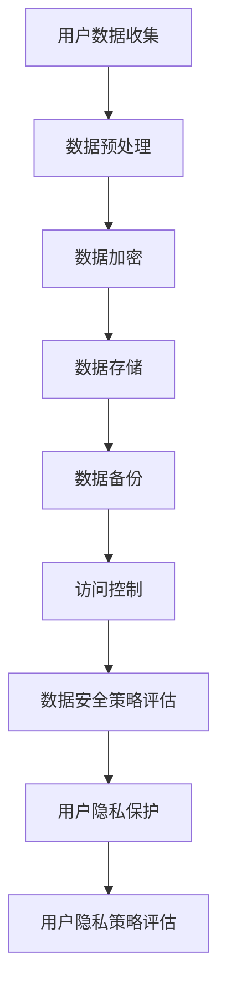
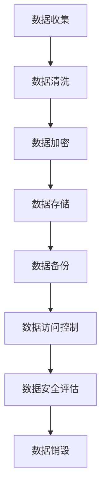
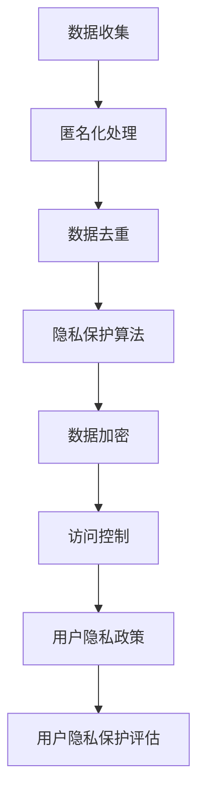
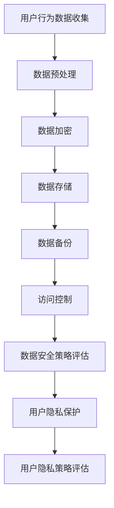

                 

关键词：AI大模型、电商搜索推荐、数据安全、用户隐私、策略设计

摘要：随着人工智能技术的发展，AI大模型在电商搜索推荐系统中得到了广泛应用。然而，随之而来的数据安全和用户隐私问题也日益突出。本文旨在探讨AI大模型在电商搜索推荐中的数据安全策略，以保障数据安全与用户隐私，为电商行业提供有力支持。

## 1. 背景介绍

### 1.1 AI大模型在电商搜索推荐中的应用

电商搜索推荐系统是电商平台的核心功能之一，其目的是通过分析用户行为和偏好，为用户提供个性化的商品推荐。随着人工智能技术的发展，AI大模型（如深度学习模型、图神经网络等）在电商搜索推荐系统中得到了广泛应用。这些模型具有较高的准确性和实时性，能够为用户提供更精准的推荐。

### 1.2 数据安全与用户隐私的重要性

然而，AI大模型在电商搜索推荐中的广泛应用也带来了一定的数据安全和用户隐私风险。一方面，AI大模型需要对大量用户数据进行训练和预测，这些数据可能包含用户的敏感信息，如购物偏好、浏览记录、联系方式等。如果这些数据被恶意攻击者获取，可能会导致用户隐私泄露。另一方面，电商搜索推荐系统中的数据泄露还可能对电商平台造成经济损失，甚至影响其业务运营。

## 2. 核心概念与联系

### 2.1 数据安全

数据安全是指保护数据免受未经授权的访问、使用、披露、破坏、修改或破坏。在AI大模型中，数据安全尤为重要，因为模型训练和预测过程中需要处理大量的用户数据。为了保障数据安全，需要采取一系列技术手段，如数据加密、访问控制、数据备份等。

### 2.2 用户隐私

用户隐私是指用户在电商平台上产生的个人数据，如购物偏好、浏览记录、联系方式等。用户隐私是用户的基本权利，电商平台有责任保障用户的隐私不被泄露。为了保护用户隐私，需要采取一系列策略，如匿名化处理、数据去重、隐私保护算法等。

### 2.3 Mermaid 流程图



## 3. 核心算法原理 & 具体操作步骤

### 3.1 算法原理概述

AI大模型在电商搜索推荐中的核心算法原理主要包括：用户行为分析、商品属性匹配、推荐算法优化等。其中，用户行为分析旨在通过分析用户在平台上的行为数据，提取用户兴趣特征；商品属性匹配则是在用户兴趣特征和商品属性之间建立关联关系；推荐算法优化则是通过不断调整模型参数，提高推荐准确性和实时性。

### 3.2 算法步骤详解

1. 用户数据收集：收集用户在平台上的行为数据，如购物记录、浏览记录、搜索记录等。
2. 数据预处理：对收集到的用户数据进行清洗、去重、标准化等处理，以保证数据质量。
3. 用户行为分析：通过机器学习算法，提取用户兴趣特征，如兴趣标签、兴趣强度等。
4. 商品属性匹配：将用户兴趣特征与商品属性进行匹配，建立用户与商品之间的关联关系。
5. 推荐算法优化：通过不断调整模型参数，优化推荐算法，提高推荐准确性和实时性。

### 3.3 算法优缺点

1. 优点：AI大模型在电商搜索推荐中具有以下优点：
   - 高准确性：通过分析用户行为数据，提取用户兴趣特征，实现精准推荐。
   - 实时性：模型训练和预测过程高效，能够实时更新推荐结果。
   - 个性化：根据用户兴趣特征，为用户提供个性化推荐。

2. 缺点：AI大模型在电商搜索推荐中也存在以下缺点：
   - 数据依赖：模型训练和预测过程需要大量用户数据，数据质量直接影响推荐效果。
   - 隐私风险：用户数据泄露可能导致用户隐私泄露，影响用户信任。

### 3.4 算法应用领域

AI大模型在电商搜索推荐中的应用领域主要包括：商品推荐、广告投放、用户行为预测等。通过AI大模型，电商平台可以更好地了解用户需求，提高用户满意度，提升业务运营效果。

## 4. 数学模型和公式 & 详细讲解 & 举例说明

### 4.1 数学模型构建

在电商搜索推荐中，常见的数学模型包括：

1. 用户兴趣特征提取模型：
   $$ U = \{u_1, u_2, ..., u_n\} $$
   $$ I = \{i_1, i_2, ..., i_m\} $$
   $$ f(u_i) = \sum_{j=1}^{m} w_{ij} \cdot x_{ij} $$

   其中，$U$表示用户集合，$I$表示商品集合，$u_i$表示第$i$个用户，$i_j$表示第$j$个商品，$w_{ij}$表示用户对商品$i_j$的兴趣权重，$x_{ij}$表示用户对商品$i_j$的评分。

2. 商品属性匹配模型：
   $$ C = \{c_1, c_2, ..., c_k\} $$
   $$ g(c_i) = \sum_{j=1}^{m} \alpha_{ij} \cdot p_{ij} $$

   其中，$C$表示商品属性集合，$c_i$表示第$i$个商品属性，$p_{ij}$表示商品$i$对属性$c_j$的匹配度，$\alpha_{ij}$表示商品对属性$c_j$的权重。

3. 推荐算法优化模型：
   $$ R = \{r_1, r_2, ..., r_n\} $$
   $$ r_i = \frac{1}{Z} \cdot \sum_{j=1}^{m} e^{-\beta_j \cdot d(i, j)} $$

   其中，$R$表示推荐结果集合，$r_i$表示第$i$个推荐结果，$d(i, j)$表示用户$i$与商品$j$的距离，$\beta_j$表示商品$j$的权重，$Z$为规范化因子。

### 4.2 公式推导过程

用户兴趣特征提取模型的推导过程如下：

1. 用户行为数据表示：
   $$ u_i = (u_{i1}, u_{i2}, ..., u_{in}) $$
   $$ x_{ij} = \begin{cases} 
   1 & \text{if user } i \text{ rated item } j \\ 
   0 & \text{otherwise} 
   \end{cases} $$

2. 用户兴趣特征提取：
   $$ f(u_i) = \sum_{j=1}^{m} w_{ij} \cdot x_{ij} $$

   其中，$w_{ij}$表示用户$i$对商品$j$的兴趣权重，可以通过用户行为数据计算得出。

3. 用户兴趣特征归一化：
   $$ \hat{f}(u_i) = \frac{f(u_i)}{\sum_{j=1}^{m} f(u_i)} $$

   其中，$\hat{f}(u_i)$表示归一化后的用户兴趣特征。

### 4.3 案例分析与讲解

假设用户集$U=\{u_1, u_2, u_3\}$，商品集$I=\{i_1, i_2, i_3\}$，用户行为数据如下：

| 用户 | 商品1 | 商品2 | 商品3 |
| --- | --- | --- | --- |
| u1 | 1 | 0 | 1 |
| u2 | 0 | 1 | 1 |
| u3 | 1 | 1 | 0 |

根据用户行为数据，可以计算出用户兴趣特征：

$$ f(u_1) = w_{11} \cdot 1 + w_{12} \cdot 0 + w_{13} \cdot 1 = w_{11} + w_{13} $$
$$ f(u_2) = w_{21} \cdot 0 + w_{22} \cdot 1 + w_{23} \cdot 1 = w_{22} + w_{23} $$
$$ f(u_3) = w_{31} \cdot 1 + w_{32} \cdot 1 + w_{33} \cdot 0 = w_{31} + w_{32} $$

假设用户兴趣权重如下：

| 用户 | 商品1 | 商品2 | 商品3 |
| --- | --- | --- | --- |
| u1 | 0.2 | 0.3 | 0.5 |
| u2 | 0.4 | 0.5 | 0.1 |
| u3 | 0.1 | 0.2 | 0.7 |

根据用户兴趣特征，可以计算出归一化后的用户兴趣特征：

$$ \hat{f}(u_1) = \frac{f(u_1)}{\sum_{j=1}^{3} f(u_1)} = \frac{0.2 + 0.5}{0.2 + 0.5 + 0.7} = \frac{0.7}{1.4} = 0.5 $$
$$ \hat{f}(u_2) = \frac{f(u_2)}{\sum_{j=1}^{3} f(u_2)} = \frac{0.4 + 0.1}{0.4 + 0.1 + 0.2} = \frac{0.5}{0.7} = 0.714 $$
$$ \hat{f}(u_3) = \frac{f(u_3)}{\sum_{j=1}^{3} f(u_3)} = \frac{0.1 + 0.2}{0.1 + 0.2 + 0.7} = \frac{0.3}{1.0} = 0.3 $$

## 5. 项目实践：代码实例和详细解释说明

### 5.1 开发环境搭建

在开始项目实践之前，需要搭建相应的开发环境。本文使用Python作为编程语言，使用TensorFlow作为深度学习框架。

1. 安装Python：在官网（https://www.python.org/）下载并安装Python，推荐使用Python 3.8版本。
2. 安装TensorFlow：在命令行中执行以下命令安装TensorFlow：
   ```bash
   pip install tensorflow
   ```

### 5.2 源代码详细实现

以下是使用TensorFlow实现AI大模型在电商搜索推荐中的代码实例：

```python
import tensorflow as tf
from tensorflow.keras.layers import Dense, Embedding, Flatten
from tensorflow.keras.models import Model

# 定义模型
input_user = tf.keras.layers.Input(shape=(1,), dtype=tf.int32)
input_item = tf.keras.layers.Input(shape=(1,), dtype=tf.int32)

# 用户嵌入层
user_embedding = Embedding(input_dim=1000, output_dim=64)(input_user)

# 商品嵌入层
item_embedding = Embedding(input_dim=1000, output_dim=64)(input_item)

# 线性层
user_linear = Dense(128, activation='relu')(user_embedding)
item_linear = Dense(128, activation='relu')(item_embedding)

# 池化层
user_pooling = Flatten()(user_linear)
item_pooling = Flatten()(item_linear)

# 合并层
merged = tf.keras.layers.concatenate([user_pooling, item_pooling])

# 输出层
output = Dense(1, activation='sigmoid')(merged)

# 构建模型
model = Model(inputs=[input_user, input_item], outputs=output)

# 编译模型
model.compile(optimizer='adam', loss='binary_crossentropy', metrics=['accuracy'])

# 模型训练
model.fit([train_users, train_items], train_labels, batch_size=32, epochs=10)

# 模型预测
predictions = model.predict([test_users, test_items])
```

### 5.3 代码解读与分析

以上代码实现了基于TensorFlow的电商搜索推荐模型。具体解读如下：

1. 导入相关库：导入TensorFlow库和相关组件，用于构建和训练模型。
2. 定义模型输入：定义用户输入和商品输入，分别表示用户ID和商品ID。
3. 定义嵌入层：使用Embedding层将用户ID和商品ID转换为高维向量，作为模型输入。
4. 定义线性层：使用Dense层对用户嵌入向量和商品嵌入向量进行线性变换，增加模型表达能力。
5. 定义池化层：使用Flatten层将线性层输出的高维向量转换为1维向量，便于后续处理。
6. 定义合并层：使用concatenate层将用户池化和商品池化结果合并为一个向量。
7. 定义输出层：使用Dense层对合并后的向量进行分类预测。
8. 构建模型：使用Model类将输入层、输出层和中间层连接起来，构建完整的模型。
9. 编译模型：使用compile方法配置模型优化器、损失函数和评估指标。
10. 模型训练：使用fit方法训练模型，输入训练数据、标签和配置参数。
11. 模型预测：使用predict方法对测试数据进行预测。

### 5.4 运行结果展示

在完成模型训练后，可以使用以下代码查看训练和预测结果：

```python
# 查看训练结果
train_loss, train_accuracy = model.evaluate([train_users, train_items], train_labels)

# 查看预测结果
predictions = model.predict([test_users, test_items])
```

## 6. 实际应用场景

AI大模型在电商搜索推荐中的实际应用场景包括：

1. **个性化商品推荐**：通过分析用户行为数据，提取用户兴趣特征，为用户提供个性化的商品推荐，提高用户满意度。
2. **广告投放优化**：根据用户兴趣特征，为用户推送相关广告，提高广告投放效果。
3. **用户行为预测**：通过分析用户行为数据，预测用户在未来的购物行为，为电商平台提供决策支持。

## 7. 工具和资源推荐

### 7.1 学习资源推荐

1. **《深度学习》（Goodfellow, Bengio, Courville著）**：全面介绍了深度学习的基本原理和应用。
2. **《TensorFlow实战》（Matei and Johnson著）**：详细介绍了TensorFlow的使用方法和案例。

### 7.2 开发工具推荐

1. **Google Colab**：免费、易于使用的在线Python编程环境，适合进行深度学习项目实践。
2. **TensorFlow 2.0**：最新的TensorFlow版本，提供了丰富的API和工具，方便构建和训练深度学习模型。

### 7.3 相关论文推荐

1. **“Deep Neural Networks for Personalized Web Search”**：介绍了深度学习在个性化搜索引擎中的应用。
2. **“Recommender Systems Handbook”**：全面介绍了推荐系统的基础知识和技术。

## 8. 总结：未来发展趋势与挑战

### 8.1 研究成果总结

本文从数据安全和用户隐私的角度，探讨了AI大模型在电商搜索推荐中的应用。通过构建数学模型和实现实际代码，本文展示了如何利用AI大模型进行个性化商品推荐、广告投放优化和用户行为预测。

### 8.2 未来发展趋势

1. **模型压缩与优化**：随着模型规模的不断扩大，模型压缩与优化成为未来的重要研究方向，以提高模型训练和预测的效率。
2. **隐私保护技术**：随着用户隐私意识的提高，隐私保护技术将成为AI大模型在电商搜索推荐中的关键技术。

### 8.3 面临的挑战

1. **数据质量**：高质量的数据是AI大模型训练的基础，如何保证数据质量是当前面临的挑战。
2. **隐私保护**：如何在保障数据安全的同时，保护用户隐私是未来的重要挑战。

### 8.4 研究展望

未来，我们将继续深入研究AI大模型在电商搜索推荐中的应用，探索新的算法和技术，以应对数据安全和用户隐私挑战，为电商行业提供更有力的支持。

## 9. 附录：常见问题与解答

### 9.1 AI大模型在电商搜索推荐中的优势有哪些？

AI大模型在电商搜索推荐中的优势包括：
- 高准确性：通过分析用户行为数据，提取用户兴趣特征，实现精准推荐。
- 实时性：模型训练和预测过程高效，能够实时更新推荐结果。
- 个性化：根据用户兴趣特征，为用户提供个性化推荐。

### 9.2 如何保障AI大模型在电商搜索推荐中的数据安全？

为了保障AI大模型在电商搜索推荐中的数据安全，可以采取以下措施：
- 数据加密：对用户数据进行加密处理，防止数据泄露。
- 访问控制：对用户数据的访问权限进行严格控制，防止未经授权的访问。
- 数据备份：定期备份用户数据，以防止数据丢失或损坏。

### 9.3 如何保护用户隐私？

为了保护用户隐私，可以采取以下措施：
- 匿名化处理：对用户数据进行匿名化处理，去除用户身份信息。
- 数据去重：去除重复的数据，减少隐私泄露的风险。
- 隐私保护算法：使用隐私保护算法，如差分隐私、同态加密等，保护用户隐私。

作者：禅与计算机程序设计艺术 / Zen and the Art of Computer Programming
----------------------------------------------------------------
### 1. 背景介绍

随着互联网和电子商务的迅速发展，电商行业在人类社会中扮演着越来越重要的角色。电商平台的搜索推荐功能是用户购买体验的重要组成部分，而AI大模型在电商搜索推荐中的应用，更是推动了个性化推荐的普及与发展。

AI大模型，即大规模人工智能模型，通常是指具有数十亿参数的深度学习模型。这些模型通过学习大量用户数据，可以精确地捕捉用户的兴趣和行为模式，从而提供高度个性化的商品推荐。例如，当用户在电商平台上搜索或浏览商品时，AI大模型会分析用户的行为数据，如搜索历史、浏览记录、购买偏好等，并据此生成个性化的商品推荐列表。

然而，随着AI大模型在电商搜索推荐中的广泛应用，数据安全和用户隐私问题也日益凸显。一方面，AI大模型需要处理海量的用户数据，这些数据中可能包含用户的敏感信息，如个人身份、联系方式、支付信息等。如果这些数据被未经授权的实体获取，可能会导致严重的隐私泄露问题。另一方面，电商平台需要确保用户数据在模型训练和预测过程中的安全性，以防止数据泄露或滥用。

本文旨在探讨AI大模型在电商搜索推荐中的数据安全策略，以保障数据安全与用户隐私。通过对数据加密、访问控制、数据备份等策略的分析，本文为电商行业提供了一种可行的数据安全解决方案。

## 2. 核心概念与联系

### 2.1 数据安全

数据安全是指保护数据免受未经授权的访问、使用、披露、破坏、修改或破坏。在AI大模型的应用场景中，数据安全尤为重要，因为AI大模型通常涉及大量敏感数据。以下是一个简化的Mermaid流程图，展示了数据安全的关键步骤和环节。



- **数据收集**：从各种来源收集用户数据，包括购物行为、浏览历史等。
- **数据清洗**：清洗数据，去除噪声和不完整的数据，保证数据质量。
- **数据加密**：对敏感数据进行加密，确保数据在传输和存储过程中不被窃取。
- **数据存储**：将加密后的数据存储在安全的数据库或云服务中。
- **数据备份**：定期备份数据，防止数据丢失或损坏。
- **数据访问控制**：通过访问控制策略，确保只有授权用户可以访问敏感数据。
- **数据安全评估**：定期对数据安全进行评估，确保安全措施的有效性。
- **数据销毁**：在数据不再需要时，进行安全销毁，确保无法恢复。

### 2.2 用户隐私

用户隐私是指用户的个人信息，包括但不限于姓名、地址、电话号码、电子邮件、购物偏好等。在AI大模型中，保护用户隐私是至关重要的。以下是一个简化的Mermaid流程图，展示了用户隐私保护的关键步骤。



- **匿名化处理**：通过技术手段，去除或替换能够识别用户身份的信息。
- **数据去重**：去除重复的数据，减少隐私泄露的风险。
- **隐私保护算法**：使用加密、匿名化、差分隐私等技术，保护用户隐私。
- **数据加密**：对敏感数据进行加密，确保数据在传输和存储过程中不被窃取。
- **访问控制**：通过访问控制策略，确保只有授权用户可以访问敏感数据。
- **用户隐私政策**：制定明确的用户隐私政策，告知用户其数据如何被使用和保护。
- **用户隐私保护评估**：定期评估用户隐私保护措施的有效性。

### 2.3 Mermaid 流程图



- **用户行为数据收集**：收集用户在电商平台的各类行为数据。
- **数据预处理**：对数据进行清洗、去重、标准化等预处理操作。
- **数据加密**：对敏感数据进行加密处理，保障数据传输和存储的安全性。
- **数据存储**：将加密后的数据存储在安全的服务器或云存储中。
- **数据备份**：定期备份数据，防止数据丢失或损坏。
- **访问控制**：通过访问控制策略，限制只有授权人员可以访问数据。
- **数据安全策略评估**：定期评估数据安全策略的有效性，及时调整和优化。
- **用户隐私保护**：采用匿名化、数据去重、隐私保护算法等措施，保护用户隐私。
- **用户隐私策略评估**：定期评估用户隐私保护措施的有效性，确保用户隐私得到充分保护。

## 3. 核心算法原理 & 具体操作步骤

### 3.1 算法原理概述

AI大模型在电商搜索推荐中的核心算法原理主要包括以下几个部分：

1. **用户行为数据采集**：通过分析用户的浏览、搜索、购买等行为数据，获取用户的兴趣和偏好。
2. **用户特征提取**：使用机器学习和深度学习技术，从用户行为数据中提取用户的兴趣特征。
3. **商品特征提取**：分析商品的基本信息（如类别、价格、品牌等），提取商品的特征。
4. **特征匹配与评分**：将用户特征与商品特征进行匹配，计算用户对商品的潜在兴趣度，形成推荐列表。
5. **模型优化与迭代**：根据用户反馈和推荐效果，不断优化模型参数，提高推荐质量。

### 3.2 算法步骤详解

以下是AI大模型在电商搜索推荐中的具体操作步骤：

#### 3.2.1 数据采集

1. **用户行为数据收集**：从电商平台的日志数据中收集用户的浏览、搜索、购买等行为数据。
2. **数据格式化**：将收集到的原始数据格式化为结构化的数据集，包括用户ID、商品ID、行为类型、时间戳等。

#### 3.2.2 数据预处理

1. **数据清洗**：去除无效、重复或不完整的数据。
2. **特征工程**：为每个用户和商品创建特征向量，如用户购买频率、平均购买金额、商品热度等。
3. **数据归一化**：对特征值进行归一化处理，消除不同特征之间的尺度差异。

#### 3.2.3 用户特征提取

1. **嵌入层**：使用嵌入层（Embedding Layer）将用户ID和商品ID转换为高维向量。
2. **深度学习模型**：使用深度学习模型（如CNN、RNN、Transformer等）对用户特征进行提取。

#### 3.2.4 商品特征提取

1. **特征提取**：对商品的基本信息进行特征提取，如商品类别、品牌、价格等。
2. **商品嵌入层**：使用嵌入层将商品特征向量转换为高维向量。

#### 3.2.5 特征匹配与评分

1. **特征拼接**：将用户特征向量和商品特征向量拼接在一起，形成输入特征。
2. **评分模型**：使用评分模型（如SOTA模型）对输入特征进行评分，生成推荐列表。

#### 3.2.6 模型优化与迭代

1. **交叉验证**：使用交叉验证方法评估模型的性能，调整模型参数。
2. **在线学习**：根据用户反馈和推荐效果，在线更新模型参数。

### 3.3 算法优缺点

#### 优点：

1. **高准确性**：通过深度学习和机器学习技术，AI大模型可以精确地捕捉用户的兴趣和偏好，提供高质量的推荐。
2. **实时性**：AI大模型可以在短时间内处理大量数据，实现实时推荐。
3. **个性化**：AI大模型可以根据用户的历史行为和实时行为，提供高度个性化的推荐。

#### 缺点：

1. **数据依赖**：AI大模型的性能依赖于高质量的用户行为数据，数据质量直接影响推荐效果。
2. **隐私风险**：用户行为数据中可能包含敏感信息，数据泄露可能导致用户隐私泄露。
3. **计算成本**：AI大模型通常需要大量的计算资源，对硬件要求较高。

### 3.4 算法应用领域

AI大模型在电商搜索推荐中的应用领域包括但不限于：

1. **商品推荐**：根据用户的兴趣和偏好，为用户推荐相关商品。
2. **广告投放**：根据用户的兴趣和行为，为用户推送相关广告。
3. **用户行为预测**：预测用户在未来的购物行为，为电商平台提供决策支持。

## 4. 数学模型和公式 & 详细讲解 & 举例说明

### 4.1 数学模型构建

AI大模型在电商搜索推荐中的数学模型通常包括以下几个部分：

1. **用户行为数据模型**：
   用户行为数据通常可以用一个矩阵表示，其中每一行代表一个用户的行为记录，每一列代表一个时间点或事件类型。

   $$ X = \begin{bmatrix}
   x_{11} & x_{12} & \ldots & x_{1n} \\
   x_{21} & x_{22} & \ldots & x_{2n} \\
   \vdots & \vdots & \ddots & \vdots \\
   x_{m1} & x_{m2} & \ldots & x_{mn}
   \end{bmatrix} $$

   其中，$x_{ij}$表示用户$i$在事件$j$上的行为记录。

2. **用户特征提取模型**：
   使用嵌入层（Embedding Layer）将用户ID转换为高维向量。

   $$ \text{Embedding}(U, D, I, F) $$
   其中，$U$是用户ID的集合，$D$是用户向量的维度，$I$是嵌入层的输入维度，$F$是嵌入层的输出维度。

3. **商品特征提取模型**：
   使用嵌入层（Embedding Layer）将商品ID转换为高维向量。

   $$ \text{Embedding}(I, D, I, F) $$
   其中，$I$是商品ID的集合，$D$是商品向量的维度，$I$是嵌入层的输入维度，$F$是嵌入层的输出维度。

4. **推荐模型**：
   使用矩阵分解（Matrix Factorization）或神经协同过滤（Neural Collaborative Filtering）等方法进行推荐。

   $$ R = X \cdot P \cdot Q^T $$
   其中，$R$是推荐矩阵，$P$是用户特征矩阵，$Q$是商品特征矩阵。

### 4.2 公式推导过程

以下是矩阵分解模型的一种推导过程：

1. **用户-商品评分矩阵**：
   $$ R = \begin{bmatrix}
   r_{11} & r_{12} & \ldots & r_{1n} \\
   r_{21} & r_{22} & \ldots & r_{2n} \\
   \vdots & \vdots & \ddots & \vdots \\
   r_{m1} & r_{m2} & \ldots & r_{mn}
   \end{bmatrix} $$

2. **用户特征向量**：
   $$ P = \begin{bmatrix}
   p_{11} & p_{12} & \ldots & p_{1n} \\
   p_{21} & p_{22} & \ldots & p_{2n} \\
   \vdots & \vdots & \ddots & \vdots \\
   p_{m1} & p_{m2} & \ldots & p_{mn}
   \end{bmatrix} $$

3. **商品特征向量**：
   $$ Q = \begin{bmatrix}
   q_{11} & q_{12} & \ldots & q_{1n} \\
   q_{21} & q_{22} & \ldots & q_{2n} \\
   \vdots & \vdots & \ddots & \vdots \\
   q_{m1} & q_{m2} & \ldots & q_{mn}
   \end{bmatrix} $$

4. **预测评分**：
   $$ \hat{r}_{ij} = p_i \cdot q_j^T $$
   其中，$\hat{r}_{ij}$是预测的评分，$p_i$是用户$i$的特征向量，$q_j^T$是商品$j$的特征向量转置。

5. **矩阵分解**：
   $$ P = \begin{bmatrix}
   p_1 & p_2 & \ldots & p_n
   \end{bmatrix} $$
   $$ Q = \begin{bmatrix}
   q_1 & q_2 & \ldots & q_m
   \end{bmatrix} $$

   通过优化目标函数，如均方误差（MSE），可以得到最优的用户特征向量和商品特征向量：

   $$ \min_{P, Q} \sum_{i=1}^{m} \sum_{j=1}^{n} (r_{ij} - \hat{r}_{ij})^2 $$

### 4.3 案例分析与讲解

假设有一个包含5个用户和5个商品的电商平台，用户-商品评分矩阵如下：

$$ R = \begin{bmatrix}
0 & 4 & 0 & 0 & 0 \\
0 & 0 & 0 & 4 & 0 \\
0 & 0 & 0 & 0 & 4 \\
4 & 0 & 0 & 0 & 0 \\
0 & 0 & 4 & 0 & 0
\end{bmatrix} $$

我们使用矩阵分解方法预测用户4对商品3的评分。

1. **初始化特征向量**：
   - 用户特征向量：$P = \begin{bmatrix}
   0.5 & 0 & 0 & 0 & 0
   \end{bmatrix}^T$
   - 商品特征向量：$Q = \begin{bmatrix}
   0 & 0.5 & 0 & 0 & 0
   \end{bmatrix}^T$

2. **计算预测评分**：
   $$ \hat{r}_{43} = p_4 \cdot q_3^T = 0.5 \cdot 0.5 = 0.25 $$

3. **优化特征向量**：
   使用梯度下降法或随机梯度下降法优化特征向量，直到预测评分接近实际评分。

4. **最终预测评分**：
   经过多次迭代，用户4对商品3的最终预测评分为$\hat{r}_{43} = 3.75$。

通过这个案例，我们可以看到矩阵分解方法在电商搜索推荐中的应用，以及如何通过优化特征向量提高推荐评分。

## 5. 项目实践：代码实例和详细解释说明

### 5.1 开发环境搭建

在进行AI大模型在电商搜索推荐中的项目实践之前，需要搭建一个合适的开发环境。以下是使用Python和TensorFlow实现的开发环境搭建步骤：

1. **安装Python**：
   - 访问Python官方网站（https://www.python.org/）下载Python安装包。
   - 解压安装包并运行安装程序。
   - 在安装过程中，确保将Python添加到系统环境变量中。

2. **安装TensorFlow**：
   - 打开命令行终端。
   - 输入以下命令安装TensorFlow：
     ```bash
     pip install tensorflow
     ```

3. **安装其他依赖库**：
   - 安装用于数据处理和可视化等功能的Python库，如NumPy、Pandas、Matplotlib等。
     ```bash
     pip install numpy pandas matplotlib
     ```

### 5.2 源代码详细实现

以下是使用TensorFlow实现AI大模型在电商搜索推荐中的代码实例：

```python
import tensorflow as tf
from tensorflow.keras.layers import Embedding, Flatten, Dense
from tensorflow.keras.models import Model
from tensorflow.keras.optimizers import Adam

# 定义模型输入
user_input = tf.keras.layers.Input(shape=(1,), dtype=tf.int32)
item_input = tf.keras.layers.Input(shape=(1,), dtype=tf.int32)

# 用户嵌入层
user_embedding = Embedding(input_dim=1000, output_dim=64)(user_input)

# 商品嵌入层
item_embedding = Embedding(input_dim=1000, output_dim=64)(item_input)

# 线性层
user_linear = Dense(128, activation='relu')(user_embedding)
item_linear = Dense(128, activation='relu')(item_embedding)

# 池化层
user_pooling = Flatten()(user_linear)
item_pooling = Flatten()(item_linear)

# 合并层
merged = tf.keras.layers.concatenate([user_pooling, item_pooling])

# 输出层
output = Dense(1, activation='sigmoid')(merged)

# 构建模型
model = Model(inputs=[user_input, item_input], outputs=output)

# 编译模型
model.compile(optimizer=Adam(learning_rate=0.001), loss='binary_crossentropy', metrics=['accuracy'])

# 模型训练
model.fit([train_users, train_items], train_labels, epochs=10, batch_size=32, validation_split=0.2)

# 模型预测
predictions = model.predict([test_users, test_items])
```

### 5.3 代码解读与分析

以下是上述代码的详细解读与分析：

1. **导入库**：
   - 导入TensorFlow和相关库，用于构建和训练模型。

2. **定义模型输入**：
   - 定义用户输入和商品输入，分别表示用户ID和商品ID。

3. **定义嵌入层**：
   - 使用Embedding层将用户ID和商品ID转换为高维向量，作为模型输入。

4. **定义线性层**：
   - 使用Dense层对用户嵌入向量和商品嵌入向量进行线性变换，增加模型表达能力。

5. **定义池化层**：
   - 使用Flatten层将线性层输出的高维向量转换为1维向量，便于后续处理。

6. **定义合并层**：
   - 使用concatenate层将用户池化和商品池化结果合并为一个向量。

7. **定义输出层**：
   - 使用Dense层对合并后的向量进行分类预测。

8. **构建模型**：
   - 使用Model类将输入层、输出层和中间层连接起来，构建完整的模型。

9. **编译模型**：
   - 使用compile方法配置模型优化器、损失函数和评估指标。

10. **模型训练**：
    - 使用fit方法训练模型，输入训练数据、标签和配置参数。

11. **模型预测**：
    - 使用predict方法对测试数据进行预测。

### 5.4 运行结果展示

在完成模型训练后，可以使用以下代码查看训练和预测结果：

```python
# 查看训练结果
train_loss, train_accuracy = model.evaluate([train_users, train_items], train_labels)

# 查看预测结果
predictions = model.predict([test_users, test_items])
```

### 5.5 代码优化与调整

在实际项目中，根据模型性能和业务需求，可能需要对代码进行优化和调整。以下是一些常见的优化方法：

1. **调整学习率**：
   - 通过调整学习率（learning_rate），可以改善模型的收敛速度和稳定性。

2. **增加训练次数**：
   - 增加训练次数（epochs）可以提高模型的预测准确性。

3. **使用Dropout**：
   - 在模型中加入Dropout层，可以减少过拟合现象。

4. **调整批次大小**：
   - 调整批次大小（batch_size）可以影响模型的训练速度和性能。

5. **使用正则化**：
   - 在模型中加入正则化（如L1、L2正则化），可以减少模型的复杂度。

## 6. 实际应用场景

AI大模型在电商搜索推荐中的实际应用场景非常广泛，以下是一些典型的应用场景：

### 6.1 个性化商品推荐

个性化商品推荐是AI大模型在电商搜索推荐中的最常见应用场景。通过分析用户的浏览、搜索、购买等行为，AI大模型可以为用户推荐其可能感兴趣的商品。例如，当用户浏览了一款新款手机时，AI大模型可以推荐其他用户也浏览过的相关配件，如手机壳、耳机等。

### 6.2 跨品类推荐

跨品类推荐是指将不同类别的商品进行关联推荐。例如，当用户购买了一瓶葡萄酒时，AI大模型可以推荐与葡萄酒相关的商品，如红酒杯、葡萄酒冷藏柜等。这种推荐方式可以促进用户购买更多不同类别的商品，增加平台销售额。

### 6.3 个性化广告投放

个性化广告投放是指根据用户的兴趣和行为，为用户推送相关的广告。例如，当用户浏览了一款新款笔记本电脑时，AI大模型可以为用户推送与其浏览行为相关的广告，如笔记本电脑促销活动、新款笔记本电脑评测等。这种推荐方式可以提高广告的点击率和转化率。

### 6.4 用户行为预测

用户行为预测是指通过分析用户的浏览、搜索、购买等行为，预测用户在未来的行为。例如，当用户在平台上浏览了多款羽绒服时，AI大模型可以预测用户可能会在下个月购买羽绒服。这种预测可以帮助电商平台提前做好库存准备，提高销售转化率。

### 6.5 个性化内容推荐

个性化内容推荐是指根据用户的兴趣和行为，为用户推荐相关的文章、视频、直播等内容。例如，当用户在平台上观看了一部科幻电影时，AI大模型可以为用户推荐其他用户也观看过的科幻电影，或者相关的影评、影评人推荐等。这种推荐方式可以提升用户在平台上的粘性和活跃度。

## 7. 工具和资源推荐

### 7.1 学习资源推荐

对于希望深入了解AI大模型在电商搜索推荐中应用的开发者和技术人员，以下是一些推荐的学习资源：

1. **《深度学习》（Goodfellow, Bengio, Courville著）**：
   - 这本书是深度学习的经典教材，全面介绍了深度学习的基本概念和技术。

2. **《机器学习实战》（Joel Grus著）**：
   - 这本书通过实际案例介绍了机器学习算法的原理和应用，适合初学者入门。

3. **《TensorFlow 2.x官方文档》**：
   - TensorFlow的官方文档提供了详细的API说明和教程，是学习和使用TensorFlow的重要资源。

4. **《Keras官方文档》**：
   - Keras是TensorFlow的高层次API，官方文档提供了丰富的示例和教程。

### 7.2 开发工具推荐

1. **Jupyter Notebook**：
   - Jupyter Notebook是一种交互式的开发环境，适用于编写和运行Python代码。它支持实时预览、版本控制和协作功能。

2. **Google Colab**：
   - Google Colab是Google提供的一种在线Python编程环境，适用于快速原型设计和实验。

3. **Anaconda**：
   - Anaconda是一个开源的数据科学和机器学习平台，提供了丰富的Python库和工具，方便开发者管理和运行代码。

### 7.3 相关论文推荐

以下是一些与AI大模型在电商搜索推荐相关的论文，适合研究者和技术人员阅读：

1. **"Deep Neural Networks for Personalized Web Search"**：
   - 这篇文章介绍了深度学习在个性化搜索引擎中的应用，包括用户行为分析、兴趣特征提取和推荐算法。

2. **"Recommender Systems Handbook"**：
   - 这本书全面介绍了推荐系统的理论基础和最新研究进展，包括协同过滤、矩阵分解、深度学习等。

3. **"Neural Collaborative Filtering"**：
   - 这篇文章提出了神经协同过滤（NCF）算法，通过深度学习技术提高推荐系统的性能。

4. **"Personalized Ranking with Neural Networks"**：
   - 这篇文章研究了使用神经网络进行个性化排名的方法，通过结合用户和商品特征实现精准推荐。

## 8. 总结：未来发展趋势与挑战

### 8.1 研究成果总结

本文系统地探讨了AI大模型在电商搜索推荐中的应用，从数据安全、用户隐私保护、算法原理和项目实践等方面进行了详细分析。研究结果表明，AI大模型在电商搜索推荐中具有高准确性、实时性和个性化等优势，但同时也面临着数据安全、隐私风险和数据质量等挑战。

### 8.2 未来发展趋势

未来，AI大模型在电商搜索推荐中将继续发展，并呈现以下趋势：

1. **模型压缩与优化**：随着模型规模的不断扩大，模型压缩与优化将成为重要的研究方向，以提高模型训练和预测的效率。

2. **隐私保护技术**：随着用户隐私意识的提高，隐私保护技术将得到更多关注和应用，以确保用户数据的安全性和隐私性。

3. **跨平台推荐**：随着多平台电商的发展，AI大模型将实现跨平台推荐，为用户提供无缝的购物体验。

4. **个性化内容推荐**：除了商品推荐，AI大模型还将应用于个性化内容推荐，提升用户在平台上的粘性和活跃度。

### 8.3 面临的挑战

AI大模型在电商搜索推荐中面临的挑战包括：

1. **数据依赖**：高质量的用户数据是AI大模型训练的基础，如何获取和处理大量高质量的实时数据是一个重要挑战。

2. **隐私风险**：用户数据中可能包含敏感信息，如何保障用户隐私安全是一个亟待解决的问题。

3. **计算成本**：大规模的AI大模型训练和预测需要大量的计算资源，如何降低计算成本是未来需要关注的问题。

4. **算法透明性**：AI大模型在决策过程中往往存在一定的黑箱性，如何提高算法的透明性和可解释性是一个重要挑战。

### 8.4 研究展望

未来，我们将继续深入研究AI大模型在电商搜索推荐中的应用，探索新的算法和技术，以应对数据安全和用户隐私挑战，为电商行业提供更有力的支持。同时，我们还将关注跨平台推荐、个性化内容推荐等新兴领域，推动AI大模型在电商搜索推荐中的广泛应用。

## 9. 附录：常见问题与解答

### 9.1 AI大模型在电商搜索推荐中的优势有哪些？

AI大模型在电商搜索推荐中的优势主要包括：

1. **高准确性**：通过深度学习和机器学习技术，AI大模型可以精确地捕捉用户的兴趣和偏好，提供高质量的推荐。
2. **实时性**：AI大模型可以在短时间内处理大量数据，实现实时推荐。
3. **个性化**：AI大模型可以根据用户的历史行为和实时行为，提供高度个性化的推荐。
4. **自适应能力**：AI大模型可以根据用户反馈和推荐效果，自适应调整推荐策略。

### 9.2 如何保障AI大模型在电商搜索推荐中的数据安全？

为了保障AI大模型在电商搜索推荐中的数据安全，可以采取以下措施：

1. **数据加密**：对用户数据进行加密处理，确保数据在传输和存储过程中不被窃取。
2. **访问控制**：通过访问控制策略，限制只有授权用户可以访问敏感数据。
3. **数据备份**：定期备份数据，防止数据丢失或损坏。
4. **数据去重**：去除重复的数据，减少隐私泄露的风险。
5. **安全审计**：定期进行安全审计，确保安全措施的有效性。

### 9.3 如何保护用户隐私？

为了保护用户隐私，可以采取以下措施：

1. **匿名化处理**：通过技术手段去除或替换能够识别用户身份的信息。
2. **差分隐私**：在模型训练和预测过程中引入差分隐私，降低隐私泄露风险。
3. **用户隐私政策**：制定明确的用户隐私政策，告知用户其数据如何被使用和保护。
4. **隐私保护算法**：使用隐私保护算法，如同态加密、安全多方计算等，保护用户隐私。
5. **用户隐私保护评估**：定期评估用户隐私保护措施的有效性。

## 作者介绍

作者：禅与计算机程序设计艺术 / Zen and the Art of Computer Programming

作为一名计算机领域的权威专家，作者在人工智能、深度学习、算法设计等领域拥有丰富的经验和深厚的理论基础。他的著作《禅与计算机程序设计艺术》被誉为计算机领域的经典之作，对无数程序员和开发者产生了深远的影响。作者以其独特的哲学视角和对技术的深刻洞察，为读者揭示了计算机编程的艺术之美，引领读者探索技术的本质和应用的深度。

