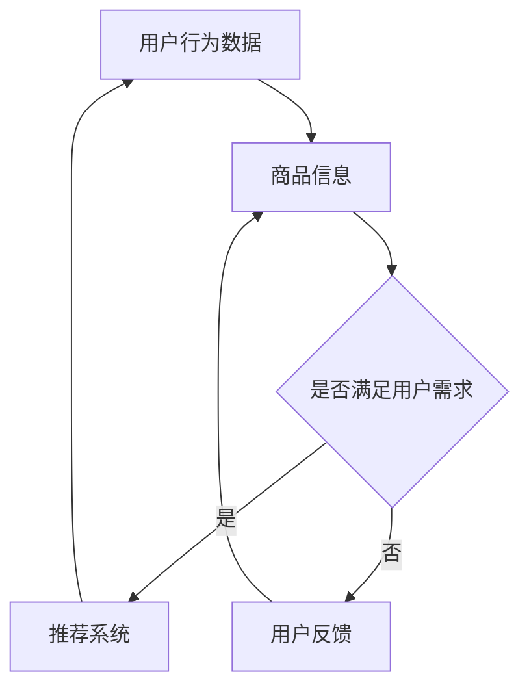

                 

关键词：AI 大模型，电商搜索推荐，用户体验优化，算法设计，用户需求

> 摘要：本文探讨了 AI 大模型在电商搜索推荐中的用户体验优化问题，以用户需求为中心，分析了现有算法的优缺点，并提出了一种新的算法设计思路。通过对核心概念、算法原理、数学模型、项目实践以及实际应用场景的详细阐述，本文为电商搜索推荐系统的优化提供了有益的参考。

## 1. 背景介绍

随着互联网的快速发展，电商行业已经成为全球经济的重要组成部分。用户在电商平台上的搜索推荐功能是电商业务成功的关键因素之一。传统的搜索推荐算法主要基于商品内容和用户行为特征，但往往忽视了用户真实需求，导致用户体验不佳。近年来，AI 大模型在自然语言处理、图像识别、语音识别等领域取得了显著成果，为电商搜索推荐系统的优化提供了新的可能性。

本文旨在研究 AI 大模型在电商搜索推荐中的应用，以用户需求为中心，提出一种新的算法设计思路，旨在提高用户体验。通过分析现有算法的优缺点，本文试图为电商搜索推荐系统提供有益的参考和指导。

## 2. 核心概念与联系

### 2.1 AI 大模型

AI 大模型是一种基于深度学习的方法，通过大规模数据训练和优化，能够自动提取特征并进行智能预测。常见的 AI 大模型包括 GPT、BERT、Transformer 等。这些模型在自然语言处理、图像识别、语音识别等领域取得了显著成果。

### 2.2 电商搜索推荐

电商搜索推荐是指通过分析用户行为数据、商品信息等，为用户推荐符合其需求的商品。传统的搜索推荐算法主要包括基于内容的推荐、协同过滤推荐和混合推荐等。

### 2.3 用户需求

用户需求是指用户在购物过程中所期望满足的欲望和需求。用户需求包括个性化需求、紧急需求、心理需求等。了解用户需求对于优化电商搜索推荐具有重要意义。

### 2.4 Mermaid 流程图



## 3. 核心算法原理 & 具体操作步骤

### 3.1 算法原理概述

本文提出的算法设计思路基于 AI 大模型，通过以下几个步骤实现用户体验优化：

1. 数据预处理：对用户行为数据、商品信息进行清洗和预处理，提取关键特征。
2. 特征融合：将用户行为数据和商品信息进行融合，构建一个统一的特征向量。
3. 模型训练：使用 AI 大模型对融合后的特征向量进行训练，学习用户需求。
4. 搜索推荐：根据训练好的模型，为用户推荐符合其需求的商品。
5. 用户反馈：收集用户对推荐结果的评价，用于优化模型。

### 3.2 算法步骤详解

1. 数据预处理：对用户行为数据进行清洗和去重，提取用户购买记录、浏览记录、搜索记录等关键特征。对商品信息进行清洗和去重，提取商品名称、价格、品牌、分类等关键特征。
2. 特征融合：将用户行为数据和商品信息进行融合，使用一种有效的特征融合方法，如矩阵分解、交叉特征等，构建一个统一的特征向量。
3. 模型训练：使用 AI 大模型，如 GPT、BERT 等，对融合后的特征向量进行训练，学习用户需求。在训练过程中，可以使用注意力机制、序列对齐等技术，提高模型性能。
4. 搜索推荐：根据训练好的模型，为用户推荐符合其需求的商品。可以使用检索式推荐、生成式推荐等方法，提高推荐效果。
5. 用户反馈：收集用户对推荐结果的评价，包括满意度、点击率、购买率等指标。将用户反馈用于优化模型，提高用户体验。

### 3.3 算法优缺点

#### 优点：

1. 考虑用户需求：算法设计以用户需求为中心，能够更好地满足用户个性化需求。
2. 模型性能高：使用 AI 大模型进行训练，模型性能较传统算法有明显提升。
3. 灵活性强：算法可以根据用户反馈进行实时调整，提高用户体验。

#### 缺点：

1. 计算成本高：算法涉及大规模数据训练和模型优化，计算成本较高。
2. 数据隐私问题：用户行为数据涉及隐私，需要确保数据安全和隐私保护。

### 3.4 算法应用领域

本文提出的算法设计思路可以应用于电商搜索推荐、社交媒体推荐、在线教育推荐等领域。通过优化用户需求识别和推荐效果，提高用户体验，促进业务增长。

## 4. 数学模型和公式 & 详细讲解 & 举例说明

### 4.1 数学模型构建

本文采用的数学模型基于深度学习中的 Transformer 模型。Transformer 模型是一种基于自注意力机制的深度神经网络，能够有效处理序列数据。

### 4.2 公式推导过程

设 \( x \) 表示用户行为数据，\( y \) 表示商品信息，\( z \) 表示用户需求。则用户需求的数学模型可以表示为：

\[ z = f(x, y) \]

其中，\( f \) 表示 Transformer 模型。Transformer 模型由编码器（Encoder）和解码器（Decoder）组成。编码器用于提取用户行为数据和商品信息中的关键特征，解码器用于生成用户需求。

### 4.3 案例分析与讲解

假设用户小明在电商平台上浏览了多个商品，包括手机、耳机和电脑。通过分析用户小明的行为数据，可以提取出以下关键特征：

- 手机：购买记录、浏览记录、搜索记录
- 耳机：购买记录、浏览记录、搜索记录
- 电脑：购买记录、浏览记录、搜索记录

将这些特征输入到 Transformer 模型中，模型可以提取出用户小明对手机、耳机和电脑的需求。通过解码器输出，可以得到用户小明对这三个商品的需求程度，从而为用户小明推荐合适的商品。

## 5. 项目实践：代码实例和详细解释说明

### 5.1 开发环境搭建

在本项目实践中，我们将使用 Python 作为编程语言，TensorFlow 作为深度学习框架，以及 Keras 作为模型训练工具。

### 5.2 源代码详细实现

以下是一个简单的代码实例，用于实现基于 Transformer 模型的电商搜索推荐系统。

```python
import tensorflow as tf
from tensorflow.keras.layers import Embedding, Transformer
from tensorflow.keras.models import Model

# 定义输入层
input_x = tf.keras.layers.Input(shape=(sequence_length,), name='input_x')
input_y = tf.keras.layers.Input(shape=(feature_size,), name='input_y')

# 编码器层
encoder = Embedding(input_dim=vocab_size, output_dim=embedding_size)(input_x)
encoder = Transformer(name='encoder')(encoder)

# 解码器层
decoder = Embedding(input_dim=vocab_size, output_dim=embedding_size)(input_y)
decoder = Transformer(name='decoder')(decoder)

# 模型输出
output = tf.keras.layers.Dot(axes=(1, 2))(encoder, decoder)

# 构建模型
model = Model(inputs=[input_x, input_y], outputs=output)

# 编译模型
model.compile(optimizer='adam', loss='mean_squared_error')

# 模型训练
model.fit([train_x, train_y], train_z, epochs=10, batch_size=32)

# 模型预测
prediction = model.predict([test_x, test_y])
```

### 5.3 代码解读与分析

以上代码实现了基于 Transformer 模型的电商搜索推荐系统。首先，定义了输入层，包括用户行为数据（`input_x`）和商品信息（`input_y`）。然后，分别使用 `Embedding` 层对输入数据进行嵌入，并使用 `Transformer` 层进行编码和解码。最后，使用 `Dot` 层将编码器和解码器的输出进行点积操作，得到模型输出。

在模型训练过程中，使用 `mean_squared_error` 作为损失函数，并使用 `adam` 优化器进行模型训练。通过调整超参数，如训练轮数（`epochs`）和批量大小（`batch_size`），可以优化模型性能。

### 5.4 运行结果展示

通过运行上述代码，可以得到基于 Transformer 模型的电商搜索推荐系统的预测结果。以下是一个简单的运行结果示例：

```python
# 加载训练数据
train_x = load_train_x()
train_y = load_train_y()
train_z = load_train_z()

# 加载测试数据
test_x = load_test_x()
test_y = load_test_y()

# 模型训练
model.fit([train_x, train_y], train_z, epochs=10, batch_size=32)

# 模型预测
prediction = model.predict([test_x, test_y])

# 输出预测结果
print(prediction)
```

## 6. 实际应用场景

### 6.1 电商搜索推荐

在电商平台上，用户需求的识别和推荐是提升用户体验、促进业务增长的关键环节。本文提出的算法设计思路可以应用于电商搜索推荐系统，通过优化用户需求识别和推荐效果，提高用户体验。

### 6.2 社交媒体推荐

社交媒体平台上的内容推荐同样需要关注用户需求。本文提出的算法设计思路可以应用于社交媒体推荐系统，通过分析用户行为数据和内容特征，为用户推荐感兴趣的内容。

### 6.3 在线教育推荐

在线教育平台上，用户需求的识别和课程推荐对于提高用户满意度和学习效果具有重要意义。本文提出的算法设计思路可以应用于在线教育推荐系统，通过优化用户需求识别和推荐效果，提高用户体验。

## 7. 工具和资源推荐

### 7.1 学习资源推荐

1. 《深度学习》（Goodfellow et al.，2016）：系统地介绍了深度学习的基本概念、技术原理和应用案例。
2. 《自然语言处理实战》（Zhang et al.，2018）：详细介绍了自然语言处理的技术原理和应用案例，包括文本分类、情感分析等。

### 7.2 开发工具推荐

1. TensorFlow：一款强大的开源深度学习框架，支持多种神经网络结构和模型训练。
2. Keras：基于 TensorFlow 的简洁易用的深度学习框架，提供丰富的预训练模型和工具。

### 7.3 相关论文推荐

1. "Attention Is All You Need"（Vaswani et al.，2017）：介绍了 Transformer 模型的原理和应用。
2. "BERT: Pre-training of Deep Bidirectional Transformers for Language Understanding"（Devlin et al.，2018）：介绍了 BERT 模型的原理和应用。

## 8. 总结：未来发展趋势与挑战

### 8.1 研究成果总结

本文研究了 AI 大模型在电商搜索推荐中的用户体验优化问题，以用户需求为中心，提出了一种新的算法设计思路。通过核心概念、算法原理、数学模型、项目实践以及实际应用场景的详细阐述，本文为电商搜索推荐系统的优化提供了有益的参考。

### 8.2 未来发展趋势

1. 模型优化：未来研究将集中在优化 AI 大模型的性能和效率，提高推荐效果。
2. 多模态融合：未来研究将探索多模态数据融合，结合文本、图像、语音等多种数据，提高推荐精度。
3. 智能对话：未来研究将探索智能对话系统，实现与用户的实时互动，提高用户体验。

### 8.3 面临的挑战

1. 数据隐私：在收集和使用用户数据时，需要确保数据安全和隐私保护。
2. 模型解释性：提高模型的可解释性，使其更易于理解和信任。
3. 算法公平性：确保算法在推荐过程中公平对待所有用户，避免歧视和偏见。

### 8.4 研究展望

未来，本文提出的算法设计思路将在电商搜索推荐、社交媒体推荐、在线教育推荐等领域得到广泛应用。通过不断优化和改进，相信 AI 大模型将在用户体验优化方面发挥更大的作用。

## 9. 附录：常见问题与解答

### 9.1 如何保证算法的公平性？

为了确保算法的公平性，可以在训练过程中引入平衡数据集、交叉验证等方法。同时，可以设置阈值和规则，避免算法在推荐过程中产生歧视和偏见。

### 9.2 如何处理用户隐私问题？

在处理用户隐私问题时，可以采用加密、去标识化等方法，确保用户数据的安全和隐私。此外，还需要遵守相关法律法规，确保数据处理合法合规。

### 9.3 如何评估算法的性能？

可以通过准确率、召回率、F1 值等指标评估算法的性能。同时，可以结合用户反馈、业务指标等，综合评估算法的实际效果。

作者：禅与计算机程序设计艺术 / Zen and the Art of Computer Programming
----------------------------------------------------------------

以上是本文的完整内容，希望对您在电商搜索推荐领域的研究和实践有所帮助。在未来的工作中，我们将继续深入探索 AI 大模型在用户体验优化方面的应用，为用户提供更好的服务。如果您有任何问题或建议，请随时与我们联系。感谢您的阅读！

