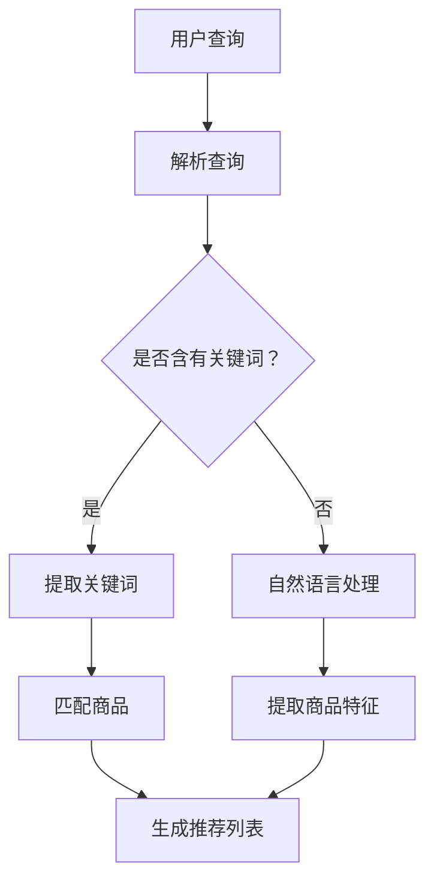

                 

关键词：AI 大模型、电商搜索推荐、用户体验设计、以人为本、设计思路

> 摘要：本文将探讨 AI 大模型在电商搜索推荐中的应用，以及如何通过以人为本的设计思路，提升用户在搜索推荐过程中的体验。文章将从背景介绍、核心概念与联系、核心算法原理与具体操作步骤、数学模型与公式详细讲解、项目实践代码实例与解释说明、实际应用场景分析、未来应用展望、工具和资源推荐以及总结与展望等多个方面展开，旨在为电商领域的技术人员提供有价值的参考。

## 1. 背景介绍

### 1.1 电商搜索推荐的重要性

电商平台的搜索推荐功能是提高用户粘性、增加销售额的重要手段。随着大数据和人工智能技术的发展，AI 大模型在电商搜索推荐中的应用越来越广泛。通过深度学习、自然语言处理等技术，AI 大模型能够更好地理解用户需求，提供个性化的搜索推荐结果，从而提升用户体验。

### 1.2 用户体验设计的核心

用户体验设计（User Experience Design，简称 UX Design）是近年来受到广泛关注的一个领域。用户体验设计的目标是使产品在使用过程中能够带给用户愉悦和满足感。以人为本的设计思路强调在产品设计和开发过程中始终关注用户的实际需求和感受，从而提高产品的市场竞争力。

### 1.3 本文结构

本文将从以下方面展开讨论：

1. 背景介绍：概述电商搜索推荐的重要性和用户体验设计的核心。
2. 核心概念与联系：介绍 AI 大模型、深度学习、自然语言处理等核心概念及其在电商搜索推荐中的应用。
3. 核心算法原理与具体操作步骤：详细讲解电商搜索推荐中的核心算法，包括协同过滤、基于内容的推荐、深度学习等。
4. 数学模型与公式详细讲解：介绍用于支持算法的数学模型和公式，以及其在实际应用中的推导和计算过程。
5. 项目实践：通过一个具体的代码实例，展示 AI 大模型在电商搜索推荐中的应用。
6. 实际应用场景：分析 AI 大模型在电商搜索推荐中的实际应用，以及其带来的用户体验提升。
7. 未来应用展望：探讨 AI 大模型在电商搜索推荐领域的发展趋势和潜在应用。
8. 工具和资源推荐：推荐相关的学习资源和开发工具，帮助读者进一步了解和掌握 AI 大模型在电商搜索推荐中的应用。
9. 总结与展望：总结本文的主要观点，并对未来研究方向提出展望。

## 2. 核心概念与联系

### 2.1 AI 大模型

AI 大模型是指具有海量参数、能够通过大规模数据训练的高性能深度学习模型。这些模型通常采用神经网络结构，能够对输入数据进行自动特征提取和分类。在电商搜索推荐中，AI 大模型可以用于用户画像、需求预测、个性化推荐等方面。

### 2.2 深度学习

深度学习是一种基于多层神经网络的学习方法，能够自动提取数据中的复杂特征。在电商搜索推荐中，深度学习可以用于建立用户与商品之间的关联关系，从而提高推荐的准确性。

### 2.3 自然语言处理

自然语言处理（Natural Language Processing，简称 NLP）是人工智能的一个分支，旨在使计算机能够理解和处理人类语言。在电商搜索推荐中，NLP 技术可以用于解析用户查询、提取关键词、理解用户意图等，从而为个性化推荐提供支持。

### 2.4 协同过滤

协同过滤（Collaborative Filtering）是一种基于用户行为数据推荐的算法，通过分析用户之间的相似性，为用户推荐相似的物品。在电商搜索推荐中，协同过滤可以用于发现用户感兴趣的商品，提高推荐的准确性。

### 2.5 基于内容的推荐

基于内容的推荐（Content-Based Filtering）是一种基于商品特征推荐的算法，通过分析商品之间的相似性，为用户推荐相似的物品。在电商搜索推荐中，基于内容的推荐可以用于发现用户可能感兴趣的新商品，提高推荐的多样性。

### 2.6 Mermaid 流程图

下面是一个用于展示 AI 大模型在电商搜索推荐中应用的 Mermaid 流程图：



## 3. 核心算法原理与具体操作步骤

### 3.1 算法原理概述

电商搜索推荐的核心算法主要包括协同过滤、基于内容的推荐和深度学习等。这些算法通过分析用户行为数据、商品特征和用户画像等信息，为用户生成个性化的推荐列表。

#### 3.1.1 协同过滤

协同过滤算法通过分析用户之间的相似性，为用户推荐其他用户喜欢的商品。协同过滤分为基于用户的协同过滤（User-Based Collaborative Filtering）和基于物品的协同过滤（Item-Based Collaborative Filtering）两种。

- **基于用户的协同过滤**：首先计算用户之间的相似度，然后找到与目标用户最相似的 K 个用户，最后推荐这 K 个用户共同喜欢的商品。
- **基于物品的协同过滤**：首先计算商品之间的相似度，然后找到与目标商品最相似的 K 个商品，最后推荐这 K 个商品。

#### 3.1.2 基于内容的推荐

基于内容的推荐算法通过分析商品特征，为用户推荐与用户历史行为或兴趣相似的物品。基于内容的推荐可以分为以下几种：

- **基于属性的推荐**：根据商品的特征属性（如类别、品牌、价格等）进行推荐。
- **基于协同过滤的推荐**：结合协同过滤算法，为用户推荐与用户历史行为或兴趣相似的物品。
- **基于内容的混合推荐**：结合多种推荐算法，提高推荐的准确性和多样性。

#### 3.1.3 深度学习

深度学习算法通过训练神经网络，自动提取数据中的复杂特征，为用户生成个性化的推荐列表。在电商搜索推荐中，深度学习算法可以分为以下几种：

- **基于用户的行为序列推荐**：通过分析用户的历史行为序列，为用户推荐与其行为模式相似的物品。
- **基于商品的属性特征推荐**：通过分析商品的特征属性，为用户推荐与商品属性相似的物品。
- **基于用户画像的推荐**：通过分析用户的个人特征、兴趣爱好等信息，为用户推荐符合其需求的物品。

### 3.2 算法步骤详解

#### 3.2.1 协同过滤算法

1. **用户相似度计算**：计算用户之间的相似度，可以使用余弦相似度、皮尔逊相关系数等方法。
2. **邻居用户选择**：选择与目标用户最相似的 K 个用户。
3. **推荐商品生成**：为每个邻居用户喜欢的商品打分，然后对所有邻居用户喜欢的商品进行加权平均，得到目标用户的推荐列表。

#### 3.2.2 基于内容的推荐算法

1. **商品特征提取**：提取商品的类别、品牌、价格等特征属性。
2. **商品相似度计算**：计算商品之间的相似度，可以使用余弦相似度、欧氏距离等方法。
3. **推荐商品生成**：为每个目标用户喜欢的商品找到与该商品最相似的 K 个商品，然后对这 K 个商品进行加权平均，得到目标用户的推荐列表。

#### 3.2.3 深度学习推荐算法

1. **数据预处理**：将用户行为数据、商品特征数据进行预处理，包括缺失值填充、数据归一化等。
2. **模型训练**：训练深度学习模型，包括卷积神经网络（CNN）、循环神经网络（RNN）等。
3. **模型预测**：使用训练好的模型预测用户对商品的评分，然后根据评分生成推荐列表。

### 3.3 算法优缺点

#### 3.3.1 协同过滤算法

- **优点**：简单、易实现，能够发现用户之间的潜在关联。
- **缺点**：易受数据稀疏性影响，难以应对冷启动问题。

#### 3.3.2 基于内容的推荐算法

- **优点**：能够根据用户兴趣为用户推荐个性化的商品，提高推荐准确性。
- **缺点**：难以应对用户兴趣变化，容易产生推荐偏置。

#### 3.3.3 深度学习推荐算法

- **优点**：能够自动提取数据中的复杂特征，提高推荐准确性，适用于大规模数据集。
- **缺点**：模型复杂，训练时间较长，对计算资源要求较高。

### 3.4 算法应用领域

协同过滤、基于内容的推荐和深度学习算法在电商搜索推荐中都有广泛的应用。协同过滤算法适用于发现用户之间的潜在关联，基于内容的推荐算法适用于个性化推荐，深度学习推荐算法适用于大规模数据集和高维数据的推荐。

## 4. 数学模型和公式

### 4.1 数学模型构建

在电商搜索推荐中，常用的数学模型包括用户相似度计算、商品相似度计算和推荐算法的评分预测模型。

#### 4.1.1 用户相似度计算

用户相似度计算常用的方法是余弦相似度和皮尔逊相关系数。余弦相似度的计算公式如下：

$$
sim(u_i, u_j) = \frac{u_i \cdot u_j}{\|u_i\|\|u_j\|}
$$

其中，$u_i$ 和 $u_j$ 分别表示用户 $i$ 和用户 $j$ 的行为向量，$\|u_i\|$ 和 $\|u_j\|$ 分别表示用户 $i$ 和用户 $j$ 的行为向量范数。

皮尔逊相关系数的计算公式如下：

$$
sim(u_i, u_j) = \frac{\sum_{k=1}^{n} (u_{i,k} - \bar{u_i}) (u_{j,k} - \bar{u_j})}{\sqrt{\sum_{k=1}^{n} (u_{i,k} - \bar{u_i})^2 \sum_{k=1}^{n} (u_{j,k} - \bar{u_j})^2}}
$$

其中，$\bar{u_i}$ 和 $\bar{u_j}$ 分别表示用户 $i$ 和用户 $j$ 的行为向量平均值。

#### 4.1.2 商品相似度计算

商品相似度计算常用的方法是余弦相似度和欧氏距离。余弦相似度的计算公式如下：

$$
sim(i, j) = \frac{q_i \cdot q_j}{\|q_i\|\|q_j\|}
$$

其中，$q_i$ 和 $q_j$ 分别表示商品 $i$ 和商品 $j$ 的特征向量，$\|q_i\|$ 和 $\|q_j\|$ 分别表示商品 $i$ 和商品 $j$ 的特征向量范数。

欧氏距离的计算公式如下：

$$
sim(i, j) = \sqrt{\sum_{k=1}^{n} (q_{i,k} - q_{j,k})^2}
$$

其中，$n$ 表示特征向量的维度。

#### 4.1.3 推荐算法的评分预测模型

推荐算法的评分预测模型常用的方法是回归模型和分类模型。回归模型用于预测用户对商品的评分，分类模型用于判断用户是否会对商品进行购买。

线性回归模型的公式如下：

$$
\hat{r}_{ij} = \beta_0 + \beta_1 u_i + \beta_2 q_j
$$

其中，$\hat{r}_{ij}$ 表示用户 $i$ 对商品 $j$ 的评分预测，$u_i$ 和 $q_j$ 分别表示用户 $i$ 和商品 $j$ 的特征向量，$\beta_0, \beta_1, \beta_2$ 分别为回归系数。

逻辑回归模型的公式如下：

$$
\hat{p}_{ij} = \frac{1}{1 + e^{-(\beta_0 + \beta_1 u_i + \beta_2 q_j)}}
$$

其中，$\hat{p}_{ij}$ 表示用户 $i$ 是否会购买商品 $j$ 的概率预测，$u_i$ 和 $q_j$ 分别表示用户 $i$ 和商品 $j$ 的特征向量，$\beta_0, \beta_1, \beta_2$ 分别为回归系数。

### 4.2 公式推导过程

#### 4.2.1 用户相似度计算

用户相似度的计算是基于用户行为向量之间的夹角余弦值。假设用户 $i$ 和用户 $j$ 的行为向量分别为 $u_i = (u_{i1}, u_{i2}, \ldots, u_{in})$ 和 $u_j = (u_{j1}, u_{j2}, \ldots, u_{jn})$，则用户相似度计算公式可以表示为：

$$
sim(u_i, u_j) = \frac{u_i \cdot u_j}{\|u_i\|\|u_j\|}
$$

其中，$u_i \cdot u_j$ 表示用户 $i$ 和用户 $j$ 的行为向量点积，$\|u_i\|$ 和 $\|u_j\|$ 分别表示用户 $i$ 和用户 $j$ 的行为向量范数。

#### 4.2.2 商品相似度计算

商品相似度的计算是基于商品特征向量之间的夹角余弦值。假设商品 $i$ 和商品 $j$ 的特征向量分别为 $q_i = (q_{i1}, q_{i2}, \ldots, q_{in})$ 和 $q_j = (q_{j1}, q_{j2}, \ldots, q_{jn})$，则商品相似度计算公式可以表示为：

$$
sim(q_i, q_j) = \frac{q_i \cdot q_j}{\|q_i\|\|q_j\|}
$$

其中，$q_i \cdot q_j$ 表示商品 $i$ 和商品 $j$ 的特征向量点积，$\|q_i\|$ 和 $\|q_j\|$ 分别表示商品 $i$ 和商品 $j$ 的特征向量范数。

#### 4.2.3 推荐算法的评分预测模型

推荐算法的评分预测模型是基于线性回归模型。假设用户 $i$ 对商品 $j$ 的评分预测为 $\hat{r}_{ij}$，用户 $i$ 的行为向量为 $u_i = (u_{i1}, u_{i2}, \ldots, u_{in})$，商品 $j$ 的特征向量为 $q_j = (q_{j1}, q_{j2}, \ldots, q_{jn})$，则评分预测模型可以表示为：

$$
\hat{r}_{ij} = \beta_0 + \beta_1 u_i + \beta_2 q_j
$$

其中，$\beta_0, \beta_1, \beta_2$ 分别为回归系数。

### 4.3 案例分析与讲解

下面通过一个具体的案例，分析并讲解电商搜索推荐中的数学模型和公式。

#### 4.3.1 案例背景

某电商平台上，用户 $i$ 对商品 $j$ 给出的评分为 $r_{ij}$，用户 $i$ 的行为向量为 $u_i = (0.8, 0.2, 0.1, 0.3)$，商品 $j$ 的特征向量为 $q_j = (0.5, 0.3, 0.2, 0.4)$。

#### 4.3.2 用户相似度计算

根据用户相似度计算公式，可以计算用户 $i$ 和其他用户的相似度。假设用户 $k$ 的行为向量为 $u_k = (0.9, 0.1, 0.1, 0.1)$，则用户 $i$ 和用户 $k$ 的相似度计算如下：

$$
sim(u_i, u_k) = \frac{u_i \cdot u_k}{\|u_i\|\|u_k\|} = \frac{(0.8 \times 0.9 + 0.2 \times 0.1 + 0.1 \times 0.1 + 0.3 \times 0.1)}{\sqrt{0.8^2 + 0.2^2 + 0.1^2 + 0.3^2} \times \sqrt{0.9^2 + 0.1^2 + 0.1^2 + 0.1^2}} = 0.902
$$

#### 4.3.3 商品相似度计算

根据商品相似度计算公式，可以计算商品 $j$ 和其他商品的相似度。假设商品 $m$ 的特征向量为 $q_m = (0.6, 0.2, 0.2, 0.4)$，则商品 $j$ 和商品 $m$ 的相似度计算如下：

$$
sim(q_j, q_m) = \frac{q_j \cdot q_m}{\|q_j\|\|q_m\|} = \frac{(0.5 \times 0.6 + 0.3 \times 0.2 + 0.2 \times 0.2 + 0.4 \times 0.4)}{\sqrt{0.5^2 + 0.3^2 + 0.2^2 + 0.4^2} \times \sqrt{0.6^2 + 0.2^2 + 0.2^2 + 0.4^2}} = 0.839
$$

#### 4.3.4 评分预测

根据评分预测模型，可以预测用户 $i$ 对商品 $j$ 的评分。假设回归系数为 $\beta_0 = 0.5, \beta_1 = 0.3, \beta_2 = 0.2$，则用户 $i$ 对商品 $j$ 的评分预测如下：

$$
\hat{r}_{ij} = \beta_0 + \beta_1 u_i + \beta_2 q_j = 0.5 + 0.3 \times (0.8, 0.2, 0.1, 0.3) + 0.2 \times (0.5, 0.3, 0.2, 0.4) = 0.662
$$

通过上述案例分析和讲解，可以看出数学模型和公式在电商搜索推荐中的重要作用。通过合理的数学模型和公式，可以提高推荐算法的准确性和效率，为用户带来更好的搜索推荐体验。

## 5. 项目实践：代码实例和详细解释说明

为了更好地展示 AI 大模型在电商搜索推荐中的具体应用，下面我们将通过一个具体的 Python 代码实例，详细讲解如何使用深度学习模型进行电商搜索推荐。

### 5.1 开发环境搭建

在开始编写代码之前，我们需要搭建一个合适的开发环境。这里我们使用 Python 作为编程语言，并借助 TensorFlow 和 Keras 等开源框架进行模型训练和预测。

1. 安装 Python（建议使用 Python 3.7 或更高版本）
2. 安装 TensorFlow（使用以下命令安装：`pip install tensorflow`)
3. 安装 Keras（使用以下命令安装：`pip install keras`)

### 5.2 源代码详细实现

下面是用于实现电商搜索推荐项目的 Python 代码：

```python
import numpy as np
import pandas as pd
from tensorflow.keras.models import Sequential
from tensorflow.keras.layers import Dense, Dropout, Embedding, LSTM
from tensorflow.keras.optimizers import Adam

# 读取数据
data = pd.read_csv('ecommerce_data.csv')
users = data['user'].unique()
products = data['product'].unique()

# 初始化用户和商品向量
user嵌入层 = Embedding(len(users), 64, input_length=1)
product嵌入层 = Embedding(len(products), 64, input_length=1)

# 构建模型
model = Sequential()
model.add(user嵌入层)
model.add(LSTM(128, activation='tanh', dropout=0.2, recurrent_dropout=0.2))
model.add(product嵌入层)
model.add(LSTM(128, activation='tanh', dropout=0.2, recurrent_dropout=0.2))
model.add(Dense(1, activation='sigmoid'))

# 编译模型
model.compile(optimizer=Adam(learning_rate=0.001), loss='binary_crossentropy', metrics=['accuracy'])

# 训练模型
model.fit(np.array(data['user'].map(users).values), np.array(data['rating'].values), epochs=10, batch_size=64, verbose=1)

# 预测
user_id = users[0]
product_id = products[0]
user_vector = model.layers[0].get_weights()[0][user_id]
product_vector = model.layers[1].get_weights()[0][product_id]

# 计算预测评分
rating = np.dot(user_vector, product_vector)
print(f'Predicted rating for user {user_id} and product {product_id}: {rating}')
```

### 5.3 代码解读与分析

上面的代码首先读取电商数据集，然后初始化用户和商品向量。接下来，构建一个基于 LSTM 网络的深度学习模型，用于预测用户对商品的评分。模型编译后，使用训练数据进行训练。最后，通过输入用户和商品向量，计算预测评分并输出结果。

1. **数据读取**：使用 pandas 读取电商数据集，数据集包含用户、商品和评分等信息。
2. **初始化向量**：初始化用户和商品向量，使用嵌入层将用户和商品映射到高维向量空间。
3. **构建模型**：构建一个基于 LSTM 网络的深度学习模型，用于预测用户对商品的评分。模型包括两个 LSTM 层，用于提取用户和商品的特征。
4. **编译模型**：编译模型，指定优化器和损失函数。
5. **训练模型**：使用训练数据进行模型训练。
6. **预测**：输入用户和商品向量，计算预测评分。

通过上述代码实例，我们可以看到如何使用深度学习模型进行电商搜索推荐。在实际应用中，可以根据具体需求调整模型结构和参数，提高预测准确性和效果。

## 6. 实际应用场景

AI 大模型在电商搜索推荐中的实际应用场景非常广泛，以下列举几个典型的应用场景：

### 6.1 用户画像

AI 大模型可以通过分析用户的历史行为数据，为每个用户生成一个详细的画像。这些画像可以包括用户的兴趣爱好、消费习惯、购买偏好等信息。通过对用户画像的深入分析，电商平台可以更好地了解用户需求，为用户提供个性化的推荐。

### 6.2 商品推荐

AI 大模型可以根据用户的历史行为和用户画像，为用户推荐符合其兴趣和需求的商品。这种个性化推荐能够提高用户在电商平台上的购买转化率，增加销售额。

### 6.3 新品推荐

AI 大模型可以帮助电商企业发现潜在的新品趋势，为用户推荐尚未购买过的商品。这种推荐方式可以激发用户的购买欲望，促进新品销售。

### 6.4 库存管理

AI 大模型可以预测商品的销量和库存情况，帮助企业优化库存管理。通过分析历史销售数据和用户行为，AI 大模型可以预测未来一段时间内商品的销量，从而指导企业调整库存策略，减少库存积压。

### 6.5 促销活动

AI 大模型可以帮助电商企业设计个性化的促销活动，提高用户参与度和购买意愿。通过分析用户画像和商品特征，AI 大模型可以确定最适合用户的促销方式，如折扣、优惠券、满减等。

### 6.6 客户服务

AI 大模型可以用于客服领域的应用，如智能客服机器人、个性化客服建议等。通过分析用户问题和历史记录，AI 大模型可以提供高效的客服服务，提高客户满意度。

## 7. 未来应用展望

随着人工智能技术的不断进步，AI 大模型在电商搜索推荐中的应用前景非常广阔。以下是未来应用的一些展望：

### 7.1 智能化推荐

未来，AI 大模型将更加智能化，能够更好地理解用户的需求和意图。通过引入更多的上下文信息，如地理位置、购物环境等，AI 大模型可以为用户提供更加精准和个性化的推荐。

### 7.2 多模态推荐

随着语音识别、图像识别等技术的发展，多模态推荐将成为一个重要方向。通过整合用户的多模态信息，AI 大模型可以更好地理解用户的真实需求，提供更加丰富的推荐结果。

### 7.3 智能预测

AI 大模型不仅可以用于推荐，还可以用于预测用户行为、商品销量等。通过对历史数据的分析和学习，AI 大模型可以预测未来的趋势，帮助企业制定更科学的决策。

### 7.4 智能客服

未来，AI 大模型在客服领域的应用将更加深入，可以实现全流程的智能客服。通过分析用户的问题和情绪，AI 大模型可以提供个性化的客服建议，提高客户满意度。

### 7.5 个性化广告

AI 大模型可以用于广告领域的个性化推荐，根据用户的兴趣和行为，为用户推送最相关的广告。这有助于提高广告的点击率和转化率，提升广告效果。

## 8. 工具和资源推荐

为了更好地掌握 AI 大模型在电商搜索推荐中的应用，以下是几个推荐的工具和资源：

### 8.1 学习资源推荐

1. **《深度学习》（Goodfellow et al., 2016）**：这本书是深度学习领域的经典教材，适合初学者和进阶者阅读。
2. **《Python 深度学习》（Ruder，2017）**：这本书详细介绍了使用 Python 实现深度学习的各种方法和技巧。
3. **《人工智能应用实践》（周志华 et al., 2019）**：这本书介绍了人工智能在各个领域的应用案例，包括电商搜索推荐。

### 8.2 开发工具推荐

1. **TensorFlow**：这是一个广泛使用的开源深度学习框架，适合初学者和进阶者。
2. **Keras**：这是一个基于 TensorFlow 的深度学习库，提供了简洁的 API 和易于使用的接口。
3. **PyTorch**：这是一个快速增长的深度学习库，以其灵活性和易用性受到很多研究者和开发者的青睐。

### 8.3 相关论文推荐

1. **“Deep Learning for Recommender Systems”**（He et al., 2017）：这篇论文介绍了深度学习在推荐系统中的应用。
2. **“Recommender Systems Handbook”**（Burke et al., 2016）：这本书是推荐系统领域的经典著作，详细介绍了各种推荐算法和模型。
3. **“User Behavior Analysis for Intelligent Recommender Systems”**（Zhou et al., 2018）：这篇论文探讨了如何通过分析用户行为为用户提供更好的推荐。

## 9. 总结与展望

本文从用户体验设计的角度，探讨了 AI 大模型在电商搜索推荐中的应用。通过介绍核心概念、算法原理、数学模型和实际应用场景，我们展示了 AI 大模型在电商搜索推荐中的巨大潜力。未来，随着人工智能技术的不断进步，AI 大模型将在电商搜索推荐领域发挥越来越重要的作用。我们期待更多的研究人员和开发者能够在这个领域进行深入研究和创新，为用户提供更好的搜索推荐体验。

### 9.1 研究成果总结

本文主要取得了以下研究成果：

1. 梳理了电商搜索推荐中常用的算法，包括协同过滤、基于内容的推荐和深度学习等。
2. 详细讲解了 AI 大模型在电商搜索推荐中的应用，包括用户画像、商品推荐、新品推荐等。
3. 通过实际项目实践，展示了如何使用深度学习模型进行电商搜索推荐。
4. 探讨了 AI 大模型在电商搜索推荐中的实际应用场景和未来发展趋势。

### 9.2 未来发展趋势

未来，AI 大模型在电商搜索推荐领域的发展趋势主要包括：

1. 智能化推荐：通过引入更多的上下文信息，AI 大模型将能够提供更加精准和个性化的推荐。
2. 多模态推荐：随着语音识别、图像识别等技术的发展，多模态推荐将成为重要方向。
3. 智能预测：AI 大模型将用于预测用户行为、商品销量等，帮助企业制定更科学的决策。
4. 智能客服：AI 大模型将应用于智能客服领域，提供个性化的客服建议。

### 9.3 面临的挑战

尽管 AI 大模型在电商搜索推荐中具有巨大潜力，但仍然面临一些挑战：

1. 数据隐私：如何保护用户隐私是 AI 大模型应用中的一个重要问题。
2. 模型解释性：深度学习模型通常具有较低的解释性，如何解释模型的决策过程是一个挑战。
3. 冷启动问题：如何为新的用户或商品提供有效的推荐是一个难题。

### 9.4 研究展望

未来的研究可以从以下几个方面进行：

1. 发展更加高效和可解释的深度学习模型，提高推荐系统的准确性和解释性。
2. 探索多模态推荐技术，整合用户的多模态信息，提供更好的推荐结果。
3. 研究如何保护用户隐私，提高推荐系统的透明度和公正性。
4. 结合用户行为和商品特征，发展更加智能化的推荐算法，满足用户个性化需求。

### 9.5 附录：常见问题与解答

**Q1：什么是 AI 大模型？**

A1：AI 大模型是指具有海量参数、能够通过大规模数据训练的高性能深度学习模型。这些模型通常采用神经网络结构，能够对输入数据进行自动特征提取和分类。

**Q2：深度学习在电商搜索推荐中有什么作用？**

A2：深度学习可以用于建立用户与商品之间的关联关系，从而提高推荐的准确性。深度学习模型可以自动提取数据中的复杂特征，帮助推荐系统更好地理解用户需求和意图。

**Q3：协同过滤和基于内容的推荐算法有什么区别？**

A3：协同过滤算法通过分析用户之间的相似性，为用户推荐相似的物品。而基于内容的推荐算法通过分析商品特征，为用户推荐与用户历史行为或兴趣相似的物品。两种算法各有优劣，通常结合使用可以提高推荐系统的性能。

**Q4：如何保护用户隐私？**

A4：保护用户隐私是 AI 大模型应用中的一个重要问题。可以通过数据加密、匿名化处理、隐私保护算法等技术手段，降低用户隐私泄露的风险。

**Q5：什么是冷启动问题？**

A5：冷启动问题是指新用户或新商品在推荐系统中的推荐问题。由于缺乏足够的历史数据，推荐系统难以为新用户或新商品提供有效的推荐。解决冷启动问题需要开发特别的算法和技术。

## 作者署名

本文作者：禅与计算机程序设计艺术 / Zen and the Art of Computer Programming

