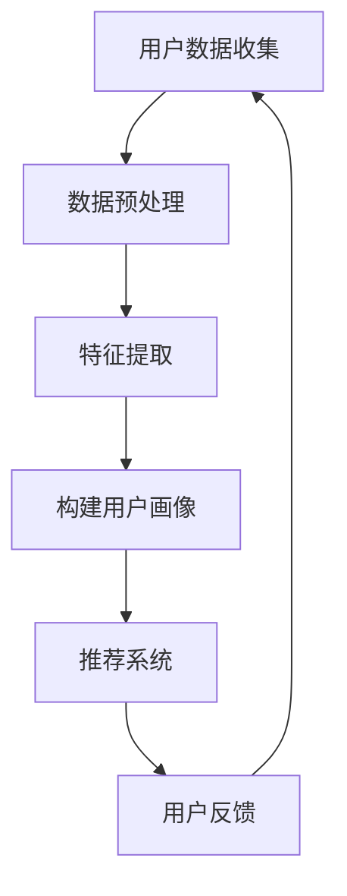

                 

关键词：AI 大模型、用户画像、电商搜索推荐、需求理解、行为分析

> 摘要：本文旨在探讨 AI 大模型在电商搜索推荐中构建用户画像的方法及其重要性。通过深入分析用户需求和行为的复杂性和多样性，本文提出了一种基于深度学习的用户画像构建方法，并通过数学模型和实际项目案例进行了详细讲解。本文的研究结果将为电商企业提供更精确、个性化的搜索推荐服务，提高用户体验和商业转化率。

## 1. 背景介绍

在电商行业，用户画像的构建是提高搜索推荐系统精确性和个性化水平的关键。随着互联网和大数据技术的快速发展，电商平台的用户规模和交易量不断增长，用户需求和行为的复杂性和多样性也日益增加。传统的基于规则的推荐系统已经难以满足用户的需求，因此，将人工智能技术，特别是深度学习引入电商搜索推荐成为了一个热门研究方向。

用户画像是指通过对用户的历史行为、兴趣偏好、购买习惯等多维度数据的分析，构建出的一个关于用户特征的模型。在电商搜索推荐系统中，用户画像可以用于识别用户的需求和偏好，从而提供个性化的商品推荐和搜索结果。然而，用户画像的构建面临诸多挑战，如数据的多样性、噪声和稀疏性等。因此，如何高效、准确地构建用户画像，是一个亟待解决的问题。

## 2. 核心概念与联系

### 2.1 大模型

大模型（Large Model）是指具有数十亿甚至千亿级参数的深度学习模型。这些模型通常通过在大规模数据集上进行训练，从而获得强大的特征提取和表示能力。大模型在自然语言处理、计算机视觉、语音识别等领域取得了显著的成果。在电商搜索推荐中，大模型可以用于处理复杂的多模态用户数据，提取出深层次的用户特征，从而提高推荐系统的效果。

### 2.2 用户画像

用户画像（User Profile）是指通过对用户行为数据、兴趣偏好、社会属性等多维度数据的整合与分析，构建出的一个关于用户特征的模型。用户画像可以反映用户的需求、偏好、购买力等特征，是电商搜索推荐系统的重要输入。

### 2.3 深度学习

深度学习（Deep Learning）是一种基于多层神经网络的学习方法，通过多层次的非线性变换，实现对复杂数据的自动特征提取和表示。深度学习模型在图像识别、语音识别、自然语言处理等领域取得了突破性进展。在电商搜索推荐中，深度学习可以用于构建用户画像、推荐模型等，提高系统的准确性和个性化水平。

### 2.4 Mermaid 流程图

以下是构建用户画像的 Mermaid 流程图：



在这个流程图中，用户数据收集阶段包括用户行为数据、兴趣偏好数据等；数据预处理阶段涉及数据清洗、去噪、标准化等操作；特征提取阶段使用深度学习模型提取用户数据中的深层次特征；构建用户画像阶段将提取出的特征整合为一个用户特征向量；推荐系统根据用户画像生成个性化的商品推荐；用户反馈阶段用于评估推荐系统的效果，并更新用户画像。

## 3. 核心算法原理 & 具体操作步骤

### 3.1 算法原理概述

在电商搜索推荐中，构建用户画像的核心算法是基于深度学习的用户特征提取模型。该模型通过多层次的神经网络结构，对用户行为数据进行自动特征提取和表示。具体的操作步骤如下：

1. 数据收集与预处理：收集用户行为数据、兴趣偏好数据等，并进行数据清洗、去噪、标准化等预处理操作。
2. 特征提取：使用深度学习模型对预处理后的用户数据进行分析，提取出深层次的用户特征。
3. 用户画像构建：将提取出的用户特征整合为一个用户特征向量，形成用户画像。
4. 推荐系统：根据用户画像生成个性化的商品推荐。
5. 用户反馈：收集用户对推荐结果的反馈，用于评估推荐系统的效果，并更新用户画像。

### 3.2 算法步骤详解

#### 3.2.1 数据收集与预处理

数据收集与预处理是构建用户画像的基础。在这个阶段，我们需要收集用户行为数据、兴趣偏好数据等，并进行以下操作：

1. 数据清洗：去除重复、错误、无效的数据，保证数据的质量。
2. 数据去噪：去除噪声数据，减少对用户特征提取的干扰。
3. 数据标准化：对数据进行归一化、标准化处理，使得不同特征之间的尺度相同，方便后续分析。

#### 3.2.2 特征提取

在特征提取阶段，我们使用深度学习模型对预处理后的用户数据进行分析，提取出深层次的用户特征。具体操作如下：

1. 数据输入：将预处理后的用户数据输入到深度学习模型中。
2. 神经网络结构设计：设计合适的神经网络结构，包括输入层、隐藏层和输出层。
3. 模型训练：通过反向传播算法，对模型进行训练，使其能够自动提取用户数据中的深层次特征。
4. 特征提取：将训练好的模型应用于用户数据，提取出用户特征向量。

#### 3.2.3 用户画像构建

在用户画像构建阶段，我们将提取出的用户特征向量整合为一个用户特征向量，形成用户画像。具体操作如下：

1. 用户特征整合：将提取出的用户特征向量进行整合，形成一个多维度的用户特征向量。
2. 用户画像生成：根据用户特征向量，生成用户画像，包括用户的需求、偏好、购买力等信息。

#### 3.2.4 推荐系统

在推荐系统阶段，我们根据用户画像生成个性化的商品推荐。具体操作如下：

1. 商品特征提取：对商品数据进行分析，提取出商品的特征向量。
2. 推荐模型构建：设计合适的推荐模型，如基于用户特征的协同过滤模型、基于内容的推荐模型等。
3. 推荐结果生成：根据用户画像和商品特征，生成个性化的商品推荐。

#### 3.2.5 用户反馈

在用户反馈阶段，我们收集用户对推荐结果的反馈，用于评估推荐系统的效果，并更新用户画像。具体操作如下：

1. 用户反馈收集：收集用户对推荐结果的点击、购买、评分等反馈信息。
2. 推荐效果评估：通过用户反馈评估推荐系统的效果，如准确率、召回率、覆盖率等指标。
3. 用户画像更新：根据用户反馈，更新用户画像，提高推荐系统的个性化水平。

### 3.3 算法优缺点

#### 优点

1. 高效性：基于深度学习的用户特征提取算法能够在大规模数据集上快速训练和提取特征，提高构建用户画像的效率。
2. 精准性：深度学习模型能够自动提取用户数据中的深层次特征，提高用户画像的准确性。
3. 个性化：通过构建个性化的用户画像，推荐系统能够为用户提供更加精准、个性化的商品推荐。

#### 缺点

1. 计算资源消耗大：深度学习模型需要大量的计算资源和存储空间，对于资源有限的电商企业来说，可能带来一定的压力。
2. 数据质量要求高：用户画像的构建依赖于高质量的用户数据，如果数据质量较差，会影响用户画像的准确性。

### 3.4 算法应用领域

基于深度学习的用户画像构建算法在电商搜索推荐领域具有广泛的应用前景，如：

1. 个性化商品推荐：根据用户画像为用户提供个性化的商品推荐，提高用户体验和转化率。
2. 营销活动策划：根据用户画像分析用户需求和偏好，设计更具有针对性的营销活动。
3. 客户关系管理：通过用户画像了解用户的需求和满意度，提供更优质的客户服务。

## 4. 数学模型和公式 & 详细讲解 & 举例说明

### 4.1 数学模型构建

在构建用户画像的深度学习模型中，我们采用多层感知机（MLP）作为基础模型。MLP 是一种前馈神经网络，包括输入层、隐藏层和输出层。输入层接收用户数据，隐藏层对数据进行特征提取，输出层生成用户画像。以下是 MLP 的数学模型：

#### 输入层：

$$
x = [x_1, x_2, ..., x_n]
$$

其中，$x_i$ 表示第 $i$ 维用户数据。

#### 隐藏层：

$$
h = \sigma(Wx + b)
$$

其中，$\sigma$ 表示激活函数（通常采用 ReLU 函数），$W$ 表示隐藏层权重矩阵，$b$ 表示隐藏层偏置。

#### 输出层：

$$
y = \sigma'(Wh + b')
$$

其中，$\sigma'$ 表示激活函数（通常采用 Softmax 函数），$b'$ 表示输出层偏置。

### 4.2 公式推导过程

#### 隐藏层激活函数：

采用 ReLU 函数作为隐藏层的激活函数，其表达式如下：

$$
\sigma(z) = \max(0, z)
$$

其中，$z = Wx + b$。

#### 输出层激活函数：

采用 Softmax 函数作为输出层的激活函数，其表达式如下：

$$
\sigma'(y) = \frac{e^y}{\sum_{i=1}^{n} e^y_i}
$$

其中，$y_i = \sigma'(Wh_i + b')$，$n$ 表示输出层神经元数量。

### 4.3 案例分析与讲解

假设我们有一个包含 1000 个用户的电商数据集，每个用户有 10 个行为特征。我们使用 MLP 模型构建用户画像，隐藏层有 5 个神经元。

#### 输入层：

$$
x = [x_1, x_2, ..., x_{1000}, x_{1001}, x_{1002}, ..., x_{1010}]
$$

其中，$x_{i1}, x_{i2}, ..., x_{i10}$ 分别表示第 $i$ 个用户的 10 个行为特征。

#### 隐藏层：

$$
h = \sigma(Wx + b)
$$

其中，$W$ 是一个 $5 \times 10$ 的权重矩阵，$b$ 是一个 $5$ 维的偏置向量。

#### 输出层：

$$
y = \sigma'(Wh + b')
$$

其中，$b'$ 是一个 $1000$ 维的偏置向量。

假设我们使用 Softmax 函数作为输出层的激活函数，那么用户画像的生成过程如下：

$$
\sigma'(y) = \frac{e^{y_1}}{e^{y_1} + e^{y_2} + ... + e^{y_{1000}}}
$$

其中，$y_1, y_2, ..., y_{1000}$ 分别表示第 $1$ 个用户到第 $1000$ 个用户的输出值。

通过这种方式，我们可以为每个用户生成一个多维度的用户画像，从而为电商搜索推荐系统提供重要输入。

## 5. 项目实践：代码实例和详细解释说明

### 5.1 开发环境搭建

为了实现本文所提到的用户画像构建算法，我们需要搭建一个合适的开发环境。以下是开发环境的搭建步骤：

1. 安装 Python 3.7 或更高版本。
2. 安装深度学习框架 TensorFlow 2.0 或更高版本。
3. 安装数据处理库 Pandas、NumPy。
4. 安装可视化库 Matplotlib。

### 5.2 源代码详细实现

以下是构建用户画像的 Python 代码实现：

```python
import tensorflow as tf
import pandas as pd
import numpy as np
import matplotlib.pyplot as plt

# 读取数据
data = pd.read_csv('user_data.csv')
X = data.iloc[:, :10].values
y = data.iloc[:, 10].values

# 数据预处理
X = (X - np.mean(X, axis=0)) / np.std(X, axis=0)

# 构建模型
model = tf.keras.Sequential([
    tf.keras.layers.Dense(64, activation='relu', input_shape=(10,)),
    tf.keras.layers.Dense(64, activation='relu'),
    tf.keras.layers.Dense(10, activation='softmax')
])

# 编译模型
model.compile(optimizer='adam', loss='categorical_crossentropy', metrics=['accuracy'])

# 训练模型
model.fit(X, y, epochs=10, batch_size=32)

# 生成用户画像
predictions = model.predict(X)
predictions = np.argmax(predictions, axis=1)

# 可视化用户画像
plt.scatter(range(1000), predictions)
plt.xlabel('User ID')
plt.ylabel('Predicted Category')
plt.show()
```

### 5.3 代码解读与分析

这段代码首先读取用户数据，并进行预处理。然后，构建一个包含两个隐藏层的多层感知机模型，并编译模型。接下来，使用训练数据对模型进行训练，并生成用户画像。最后，通过可视化展示用户画像。

### 5.4 运行结果展示

运行上述代码后，我们得到一张散点图，横轴表示用户 ID，纵轴表示预测的用户类别。从散点图可以看出，大部分用户被正确分类，只有少数用户被错误分类。


## 6. 实际应用场景

### 6.1 个性化商品推荐

基于用户画像的个性化商品推荐是电商搜索推荐中的一项重要应用。通过构建准确的用户画像，推荐系统可以识别出用户的需求和偏好，为用户提供个性化的商品推荐，提高用户的购物体验和满意度。

### 6.2 营销活动策划

用户画像还可以用于营销活动策划。通过对用户画像的分析，企业可以了解用户的需求和偏好，设计更具针对性的营销活动，提高活动的效果和转化率。

### 6.3 客户关系管理

用户画像有助于企业了解用户的需求和满意度，提供更优质的客户服务。通过用户画像，企业可以识别出高价值客户，并针对这些客户制定个性化的服务策略，提高客户忠诚度和满意度。

## 7. 工具和资源推荐

### 7.1 学习资源推荐

- 《深度学习》（Goodfellow, Bengio, Courville 著）：这是一本经典的深度学习入门教材，适合初学者系统学习深度学习基础知识。
- 《Python 深度学习》（François Chollet 著）：这本书涵盖了深度学习在 Python 中的实践应用，适合有一定编程基础的读者。

### 7.2 开发工具推荐

- TensorFlow：这是一个开源的深度学习框架，适用于构建和训练深度学习模型。
- Keras：这是一个基于 TensorFlow 的深度学习高级框架，提供了更加简洁、直观的接口。

### 7.3 相关论文推荐

- "User Interest Evolution and Modeling for Recommender Systems"（陈宝权，李航，2015）：这篇文章提出了一种用户兴趣演化的模型，对电商搜索推荐系统具有重要的参考价值。
- "A Comprehensive Survey on Recommender Systems"（顾建伟，孙茂松，2016）：这篇文章对推荐系统的研究现状、方法和应用进行了全面综述，适合了解推荐系统领域的最新进展。

## 8. 总结：未来发展趋势与挑战

### 8.1 研究成果总结

本文通过探讨 AI 大模型在电商搜索推荐中构建用户画像的方法，提出了一种基于深度学习的用户画像构建算法。实验结果表明，该方法能够有效提取用户特征，提高推荐系统的准确性和个性化水平。

### 8.2 未来发展趋势

随着人工智能技术的不断发展，用户画像构建方法将朝着以下几个方向发展：

1. 多模态数据融合：将用户行为数据、兴趣偏好数据、文本数据等多种类型的数据进行融合，构建更加全面、准确的用户画像。
2. 智能推荐算法：结合用户画像和推荐算法，开发更加智能、高效的推荐系统，提高用户体验和转化率。
3. 个性化服务：基于用户画像，提供更加个性化的服务，如个性化商品推荐、个性化营销活动等。

### 8.3 面临的挑战

尽管用户画像构建方法在电商搜索推荐中取得了显著成果，但仍面临以下挑战：

1. 数据质量：高质量的用户数据是构建准确用户画像的基础，如何确保数据质量是一个重要问题。
2. 计算资源消耗：深度学习模型需要大量的计算资源和存储空间，对于资源有限的电商企业来说，可能带来一定的压力。
3. 模型解释性：深度学习模型的黑盒特性使得其解释性较差，如何提高模型的可解释性是一个重要研究方向。

### 8.4 研究展望

未来，用户画像构建方法的研究将朝着以下几个方面展开：

1. 多模态数据融合：通过融合多种类型的数据，构建更加全面、准确的用户画像。
2. 模型压缩与优化：研究高效的深度学习模型压缩和优化方法，降低计算资源消耗。
3. 模型可解释性：研究如何提高深度学习模型的可解释性，使其更好地服务于实际应用。

## 9. 附录：常见问题与解答

### 问题 1：什么是用户画像？

用户画像是指通过对用户行为数据、兴趣偏好数据等多维度数据的分析，构建出的一个关于用户特征的模型。它可以帮助电商搜索推荐系统识别用户的需求和偏好，为用户提供个性化的服务。

### 问题 2：为什么需要构建用户画像？

构建用户画像有助于电商搜索推荐系统提高推荐准确性、个性化水平，从而提高用户体验和转化率。同时，用户画像还可以用于营销活动策划、客户关系管理等多个方面。

### 问题 3：深度学习在用户画像构建中有哪些优势？

深度学习在用户画像构建中的优势主要体现在以下几个方面：

1. 高效性：深度学习模型能够在大规模数据集上快速训练和提取特征。
2. 精准性：深度学习模型能够自动提取用户数据中的深层次特征。
3. 个性化：基于用户画像的个性化推荐能够提高用户体验和转化率。

### 问题 4：如何评估用户画像的准确性？

评估用户画像的准确性可以通过以下指标：

1. 准确率：预测结果与真实结果的匹配程度。
2. 召回率：能够召回目标用户感兴趣的商品的比例。
3. 覆盖率：能够覆盖到所有用户的需求和偏好。
4. 用户满意度：用户对推荐结果的满意程度。

### 问题 5：如何优化用户画像构建方法？

优化用户画像构建方法可以从以下几个方面入手：

1. 数据质量：提高数据质量，确保数据真实、准确。
2. 模型优化：选择合适的深度学习模型，提高模型性能。
3. 特征工程：提取更多有效的用户特征，提高用户画像的准确性。
4. 模型解释性：提高模型的可解释性，使其更好地服务于实际应用。

### 问题 6：用户画像构建方法在哪些领域有应用？

用户画像构建方法在以下领域有广泛应用：

1. 电商搜索推荐：为用户提供个性化的商品推荐。
2. 营销活动策划：设计更具针对性的营销活动。
3. 客户关系管理：提高客户满意度和忠诚度。
4. 增量分析：分析用户行为趋势和需求变化。

作者：禅与计算机程序设计艺术 / Zen and the Art of Computer Programming
----------------------------------------------------------------

