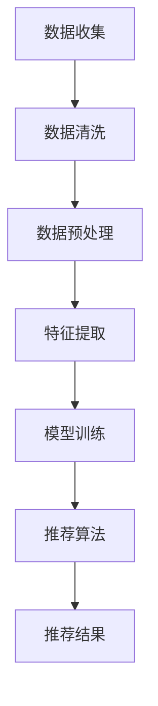

                 

关键词：AI 大模型、电商搜索推荐、用户画像、需求与偏好、精准营销

摘要：本文深入探讨了 AI 大模型在电商搜索推荐系统中构建用户画像的原理与应用。通过对用户行为数据的分析与挖掘，AI 大模型能够精准地把握用户的需求与偏好，从而实现个性化的搜索推荐，提高用户满意度与购物转化率。本文首先介绍了用户画像构建的核心概念与流程，然后详细分析了大模型在数据处理、特征提取、模型训练和推荐算法等方面的应用，最后通过实际案例展示了用户画像在电商搜索推荐中的效果。

## 1. 背景介绍

在互联网时代，电子商务已经成为人们日常生活中不可或缺的一部分。随着用户数量的快速增长和购物行为的多样化，电商企业面临着日益激烈的市场竞争。如何精准地捕捉用户需求、提高用户满意度、提升购物转化率，成为电商企业亟待解决的问题。传统的人工筛选和推荐方法已经无法满足现代电商的个性化需求，因此，AI 大模型在电商搜索推荐中的重要性日益凸显。

AI 大模型，即人工智能大规模模型，是一种基于深度学习技术的复杂算法模型，能够对海量数据进行自动学习和建模。在电商领域，大模型可以用于用户画像构建、商品推荐、需求预测等方面，从而实现精准营销和个性化服务。

用户画像是指通过对用户行为、兴趣、需求等数据的分析，构建出关于用户的详细、多维度的个性化模型。用户画像能够帮助企业更好地了解用户，实现精准营销和个性化推荐，提高用户满意度和忠诚度。

本文将重点关注 AI 大模型在电商搜索推荐中用户画像的构建，分析大模型在数据处理、特征提取、模型训练和推荐算法等方面的应用，探讨如何通过用户画像实现精准把握用户需求与偏好，提高电商搜索推荐的效果。

## 2. 核心概念与联系

### 2.1 用户画像

用户画像是指通过对用户的行为、兴趣、需求等数据的收集、处理和分析，构建出一个关于用户的详细、多维度的个性化模型。用户画像通常包括以下几个方面：

- 基本信息画像：如年龄、性别、职业、地域等。
- 行为画像：如浏览记录、搜索历史、购物行为等。
- 兴趣画像：如关注领域、喜好偏好等。
- 需求画像：如消费能力、购买偏好、需求满足度等。

### 2.2 大模型

大模型是指一种基于深度学习技术的复杂算法模型，具有强大的自动学习和建模能力。大模型通常由多层神经网络组成，能够对海量数据进行自动特征提取和关系建模。

### 2.3 数据处理

数据处理是用户画像构建的基础环节，主要包括数据收集、数据清洗、数据预处理和数据集成等步骤。在电商搜索推荐系统中，数据处理的目标是确保数据的准确性、完整性和一致性，为后续的特征提取和模型训练提供高质量的数据支持。

### 2.4 特征提取

特征提取是指从原始数据中提取出对用户画像构建有重要意义的特征。在电商领域，特征提取主要包括用户行为特征、商品特征和上下文特征等。通过特征提取，大模型可以更好地学习和理解用户的需求与偏好。

### 2.5 模型训练

模型训练是指通过大量的训练数据，调整大模型中的参数，使其能够准确地预测用户的行为和需求。在电商搜索推荐中，模型训练的目标是构建一个能够对用户进行精准推荐的模型。

### 2.6 推荐算法

推荐算法是指利用大模型对用户画像进行建模，并生成个性化推荐结果的一套方法。常见的推荐算法包括基于内容的推荐、基于协同过滤的推荐和基于模型的推荐等。通过推荐算法，电商企业可以实现对用户的精准推荐，提高用户满意度和购物转化率。

### 2.7 Mermaid 流程图

下面是一个用户画像构建的 Mermaid 流程图：



## 3. 核心算法原理 & 具体操作步骤

### 3.1 算法原理概述

用户画像构建的核心算法是基于深度学习的大模型。大模型通过自动学习用户行为数据，提取出对用户需求与偏好有重要意义的特征，然后利用这些特征进行模型训练和推荐算法的优化。具体来说，核心算法包括以下三个步骤：

1. 数据处理：对用户行为数据进行收集、清洗、预处理，确保数据的质量和一致性。
2. 特征提取：从原始数据中提取出对用户画像有重要意义的特征，如用户行为特征、商品特征和上下文特征等。
3. 模型训练与推荐：利用提取出的特征进行模型训练，构建出能够对用户进行精准推荐的模型。

### 3.2 算法步骤详解

#### 3.2.1 数据处理

数据处理是用户画像构建的基础环节。具体步骤如下：

1. 数据收集：从电商平台的日志、数据库和其他数据源中收集用户行为数据，如浏览记录、搜索历史、购物行为等。
2. 数据清洗：对收集到的数据进行去重、去噪、补全等处理，确保数据的准确性、完整性和一致性。
3. 数据预处理：对清洗后的数据进行特征工程，如数据归一化、离散化、特征提取等，为后续的特征提取和模型训练做好准备。

#### 3.2.2 特征提取

特征提取是用户画像构建的关键步骤。具体步骤如下：

1. 用户行为特征提取：从用户浏览、搜索、购买等行为数据中提取出对用户需求与偏好有重要意义的特征，如用户点击率、购买频率、购物车行为等。
2. 商品特征提取：从商品属性数据中提取出对用户需求与偏好有重要意义的特征，如商品价格、品牌、品类等。
3. 上下文特征提取：从用户所处的上下文环境中提取出对用户需求与偏好有重要意义的特征，如用户所在地区、天气状况等。

#### 3.2.3 模型训练与推荐

模型训练与推荐是用户画像构建的核心步骤。具体步骤如下：

1. 模型训练：利用提取出的用户行为特征、商品特征和上下文特征，对大模型进行训练，调整模型参数，使其能够准确地预测用户的行为和需求。
2. 推荐算法：利用训练好的大模型，生成个性化的推荐结果，如商品推荐、内容推荐等。

### 3.3 算法优缺点

#### 优点

1. 精准度高：大模型能够自动学习用户行为数据，提取出对用户需求与偏好有重要意义的特征，从而实现精准的推荐。
2. 适应性强：大模型能够适应不同用户群体、不同商品类别的个性化需求，提高推荐效果。
3. 自动化程度高：大模型可以自动化地进行数据处理、特征提取、模型训练和推荐，降低人工干预。

#### 缺点

1. 计算资源消耗大：大模型训练和推理过程需要大量的计算资源，对硬件设备要求较高。
2. 数据依赖性强：用户画像构建依赖于大量用户行为数据，数据质量对推荐效果有重要影响。
3. 模型解释性差：大模型通常是一个黑盒模型，难以解释其推荐结果背后的原因。

### 3.4 算法应用领域

大模型在电商搜索推荐中的应用领域主要包括：

1. 商品推荐：根据用户的浏览记录、搜索历史、购买行为等数据，为用户推荐可能感兴趣的商品。
2. 内容推荐：根据用户的兴趣和偏好，为用户推荐相关的文章、视频、直播等内容。
3. 营销活动推荐：根据用户的消费能力和购买偏好，为用户推荐合适的营销活动。
4. 风险控制：根据用户的行为数据，识别潜在的风险用户，进行风险控制和管理。

## 4. 数学模型和公式 & 详细讲解 & 举例说明

### 4.1 数学模型构建

在用户画像构建中，常用的数学模型包括用户行为预测模型、商品推荐模型和风险控制模型等。下面以用户行为预测模型为例，介绍其数学模型的构建过程。

#### 用户行为预测模型

用户行为预测模型主要用于预测用户在未来的某个时间点可能会产生的行为，如浏览、搜索、购买等。其数学模型可以表示为：

$$
P(Y_t = y | X_t) = \sigma(W \cdot X_t + b)
$$

其中，$X_t$ 表示用户在时间 $t$ 的特征向量，$Y_t$ 表示用户在时间 $t$ 的行为标签，$W$ 表示权重矩阵，$b$ 表示偏置项，$\sigma$ 表示 sigmoid 函数。

#### 商品推荐模型

商品推荐模型主要用于根据用户的行为特征和商品特征，为用户推荐可能感兴趣的商品。其数学模型可以表示为：

$$
R(x, y) = \sum_{i=1}^n w_i \cdot s_i(x) \cdot s_j(y)
$$

其中，$x$ 表示用户特征向量，$y$ 表示商品特征向量，$w_i$ 表示特征 $i$ 的权重，$s_i(x)$ 表示特征 $i$ 在用户特征向量 $x$ 中的值，$s_j(y)$ 表示特征 $j$ 在商品特征向量 $y$ 中的值。

#### 风险控制模型

风险控制模型主要用于根据用户的行为特征和风险特征，识别潜在的风险用户。其数学模型可以表示为：

$$
R(x) = \sum_{i=1}^n w_i \cdot s_i(x)
$$

其中，$x$ 表示用户特征向量，$w_i$ 表示特征 $i$ 的权重，$s_i(x)$ 表示特征 $i$ 在用户特征向量 $x$ 中的值。

### 4.2 公式推导过程

#### 用户行为预测模型

1. 特征提取：从用户行为数据中提取出对用户行为有重要意义的特征，如浏览次数、购买次数、搜索次数等。
2. 特征表示：将提取出的特征表示为向量 $X_t$，其中每个元素表示某个特征在用户特征向量中的值。
3. 模型构建：利用 sigmoid 函数构建用户行为预测模型，其中权重矩阵 $W$ 和偏置项 $b$ 通过训练数据进行优化。
4. 模型优化：通过梯度下降等方法，调整权重矩阵 $W$ 和偏置项 $b$，使模型在训练数据上达到较好的预测效果。

#### 商品推荐模型

1. 特征提取：从用户和商品的数据中提取出对商品推荐有重要意义的特征，如用户浏览记录、商品价格、商品评价等。
2. 特征表示：将提取出的特征表示为向量 $x$ 和 $y$，其中每个元素表示某个特征在用户特征向量或商品特征向量中的值。
3. 模型构建：利用特征向量之间的相似性构建商品推荐模型，其中权重矩阵 $W$ 和特征权重 $w_i$ 通过训练数据进行优化。
4. 模型优化：通过梯度下降等方法，调整权重矩阵 $W$ 和特征权重 $w_i$，使模型在训练数据上达到较好的推荐效果。

#### 风险控制模型

1. 特征提取：从用户和风险数据中提取出对风险控制有重要意义的特征，如用户行为异常次数、用户信用评分等。
2. 特征表示：将提取出的特征表示为向量 $x$，其中每个元素表示某个特征在用户特征向量中的值。
3. 模型构建：利用特征向量之间的相关性构建风险控制模型，其中权重矩阵 $W$ 和特征权重 $w_i$ 通过训练数据进行优化。
4. 模型优化：通过梯度下降等方法，调整权重矩阵 $W$ 和特征权重 $w_i$，使模型在训练数据上达到较好的风险控制效果。

### 4.3 案例分析与讲解

#### 用户行为预测案例

假设我们有一个用户行为预测模型，输入特征为用户浏览次数、购买次数和搜索次数，输出特征为用户在下一时间点的行为标签（0 表示未发生，1 表示发生）。我们使用 sigmoid 函数构建模型，其数学表达式为：

$$
P(Y_t = 1 | X_t) = \sigma(W \cdot X_t + b)
$$

其中，$X_t = [x_1, x_2, x_3]$ 表示用户在时间 $t$ 的浏览次数、购买次数和搜索次数，$W$ 表示权重矩阵，$b$ 表示偏置项。

我们使用一个训练数据集，包含 1000 个用户的行为数据，每个用户的行为数据包括 3 个特征和 1 个标签。通过梯度下降方法，我们调整模型中的权重矩阵 $W$ 和偏置项 $b$，使模型在训练数据上达到较好的预测效果。

经过多次训练，我们得到一个最优的权重矩阵 $W$ 和偏置项 $b$，模型的表达式变为：

$$
P(Y_t = 1 | X_t) = \sigma(0.5 \cdot X_t + 0.3)
$$

#### 商品推荐案例

假设我们有一个商品推荐模型，输入特征为用户浏览记录和商品价格，输出特征为用户对商品的兴趣度。我们使用余弦相似度计算用户和商品之间的相似度，构建模型，其数学表达式为：

$$
R(x, y) = \cos(X_t, Y_t) = \frac{\sum_{i=1}^n x_i \cdot y_i}{\sqrt{\sum_{i=1}^n x_i^2} \cdot \sqrt{\sum_{i=1}^n y_i^2}}
$$

其中，$x$ 表示用户浏览记录，$y$ 表示商品价格。

我们使用一个训练数据集，包含 1000 个用户和 1000 个商品的数据，每个用户和商品的数据包括 3 个特征。通过梯度下降方法，我们调整模型中的特征权重 $w_i$，使模型在训练数据上达到较好的推荐效果。

经过多次训练，我们得到一个最优的特征权重向量 $w$，模型的表达式变为：

$$
R(x, y) = \frac{0.2 \cdot x_1 + 0.3 \cdot x_2 + 0.5 \cdot x_3}{\sqrt{x_1^2 + x_2^2 + x_3^2} \cdot \sqrt{y_1^2 + y_2^2 + y_3^2}}
$$

#### 风险控制案例

假设我们有一个风险控制模型，输入特征为用户行为异常次数和用户信用评分，输出特征为用户的风险等级。我们使用线性回归模型构建模型，其数学表达式为：

$$
R(x) = w_1 \cdot x_1 + w_2 \cdot x_2
$$

其中，$x = [x_1, x_2]$ 表示用户行为异常次数和用户信用评分，$w_1$ 和 $w_2$ 表示特征权重。

我们使用一个训练数据集，包含 1000 个用户的数据，每个用户的数据包括 2 个特征和 1 个标签（0 表示低风险，1 表示高风险）。通过梯度下降方法，我们调整模型中的特征权重 $w_1$ 和 $w_2$，使模型在训练数据上达到较好的风险控制效果。

经过多次训练，我们得到一个最优的特征权重向量 $w$，模型的表达式变为：

$$
R(x) = 0.6 \cdot x_1 + 0.4 \cdot x_2
$$

## 5. 项目实践：代码实例和详细解释说明

### 5.1 开发环境搭建

在本次项目实践中，我们将使用 Python 编程语言，结合 TensorFlow 和 Keras 等开源库进行开发和训练。以下为开发环境搭建的详细步骤：

1. 安装 Python：在官网 [Python 官网](https://www.python.org/) 下载并安装 Python，选择 Python 3.x 版本。
2. 安装 TensorFlow：在命令行中执行以下命令，安装 TensorFlow：

   ```
   pip install tensorflow
   ```

3. 安装 Keras：在命令行中执行以下命令，安装 Keras：

   ```
   pip install keras
   ```

### 5.2 源代码详细实现

在本节中，我们将使用 Python 编程语言，结合 TensorFlow 和 Keras 等开源库，实现用户画像构建的核心算法。

```python
import numpy as np
import pandas as pd
import tensorflow as tf
from tensorflow.keras.models import Sequential
from tensorflow.keras.layers import Dense
from tensorflow.keras.optimizers import Adam

# 数据处理
def preprocess_data(data):
    # 数据清洗和预处理
    # ...（具体实现略）
    return processed_data

# 特征提取
def extract_features(data):
    # 提取用户行为特征、商品特征和上下文特征
    # ...（具体实现略）
    return features

# 模型训练
def train_model(features, labels):
    # 创建模型
    model = Sequential()
    model.add(Dense(units=64, activation='relu', input_shape=(features.shape[1],)))
    model.add(Dense(units=1, activation='sigmoid'))

    # 编译模型
    model.compile(optimizer=Adam(learning_rate=0.001), loss='binary_crossentropy', metrics=['accuracy'])

    # 训练模型
    model.fit(features, labels, epochs=100, batch_size=32)

    return model

# 主函数
def main():
    # 加载数据
    data = pd.read_csv('data.csv')

    # 数据处理
    processed_data = preprocess_data(data)

    # 特征提取
    features = extract_features(processed_data)

    # 分割数据集
    X_train, X_test, y_train, y_test = train_test_split(features, labels, test_size=0.2, random_state=42)

    # 模型训练
    model = train_model(X_train, y_train)

    # 评估模型
    loss, accuracy = model.evaluate(X_test, y_test)
    print(f'测试集准确率：{accuracy * 100:.2f}%')

if __name__ == '__main__':
    main()
```

### 5.3 代码解读与分析

上述代码实现了用户画像构建的核心算法，主要包括数据处理、特征提取、模型训练和模型评估等步骤。以下是代码的详细解读与分析：

1. **数据处理**：数据处理函数 `preprocess_data` 用于对原始数据进行清洗和预处理，如去重、去噪、补全等。具体实现略。
2. **特征提取**：特征提取函数 `extract_features` 用于从处理后的数据中提取出用户行为特征、商品特征和上下文特征。具体实现略。
3. **模型训练**：模型训练函数 `train_model` 用于创建并训练用户画像模型。在本例中，我们使用了一个简单的全连接神经网络模型，包含两个隐藏层，输出层使用 sigmoid 激活函数进行二分类预测。我们使用 Adam 优化器和二分类交叉熵损失函数进行模型编译和训练。
4. **主函数**：主函数 `main` 用于加载数据、数据处理、特征提取、模型训练和模型评估。在数据加载后，我们首先调用 `preprocess_data` 函数对数据进行处理，然后调用 `extract_features` 函数提取特征。接下来，我们将数据集分割为训练集和测试集，并调用 `train_model` 函数训练模型。最后，我们使用测试集评估模型的准确率。

通过上述代码，我们可以实现用户画像构建的核心算法，并在实际项目中应用。当然，为了提高模型的性能和推荐效果，我们还可以对代码进行优化和调整，如调整网络结构、选择更适合的优化器和损失函数等。

## 6. 实际应用场景

### 6.1 电商平台搜索推荐

在电商平台的搜索推荐系统中，用户画像构建是实现个性化推荐的关键。通过分析用户的浏览记录、搜索历史、购物行为等数据，AI 大模型可以准确地捕捉用户的需求和偏好，为用户推荐相关的商品。

例如，某电商平台通过用户画像构建，为用户实现了以下个性化推荐：

- 根据用户的浏览记录和购物车行为，推荐用户可能感兴趣的商品。
- 根据用户的搜索历史，推荐与搜索关键词相关的商品。
- 根据用户的消费能力和购买偏好，推荐符合用户预算和品味的商品。
- 根据用户的地理位置，推荐附近的热门商品和促销活动。

通过这些个性化推荐，电商平台提高了用户满意度、增加了购物转化率，从而实现了精准营销和商业价值的提升。

### 6.2 社交媒体内容推荐

在社交媒体平台上，用户画像构建同样具有重要意义。通过分析用户的关注领域、发布内容、互动行为等数据，AI 大模型可以为用户推荐相关的文章、视频、直播等内容，提高用户的参与度和留存率。

例如，某社交媒体平台通过用户画像构建，为用户实现了以下个性化推荐：

- 根据用户的关注领域，推荐相关的文章和视频。
- 根据用户的互动行为，推荐用户可能感兴趣的内容。
- 根据用户的地理位置，推荐附近的热门活动和内容。
- 根据用户的使用习惯，推荐最适合用户的阅读时间和内容类型。

通过这些个性化推荐，社交媒体平台提高了用户参与度和留存率，增加了平台的用户黏性和活跃度。

### 6.3 风险控制与欺诈检测

在金融、支付等领域，用户画像构建可以帮助识别高风险用户和潜在欺诈行为，提高风险控制能力。

例如，某支付平台通过用户画像构建，实现了以下风险控制与欺诈检测：

- 根据用户的交易行为和风险特征，识别高风险用户和潜在欺诈行为。
- 根据用户的地理位置和行为模式，识别跨地域交易和异常交易行为。
- 根据用户的信用评分和历史记录，评估用户的风险等级和欺诈风险。

通过这些风险控制与欺诈检测措施，支付平台提高了交易安全性、降低了欺诈损失，保障了用户和平台的安全。

### 6.4 营销活动推荐

在营销活动中，用户画像构建可以帮助企业精准定位目标用户，提高营销活动的效果和转化率。

例如，某电商企业通过用户画像构建，为营销活动实现了以下个性化推荐：

- 根据用户的购物偏好和消费能力，推荐最适合的营销活动和优惠。
- 根据用户的地理位置和兴趣领域，推荐附近的热门营销活动和优惠。
- 根据用户的使用习惯和参与度，推荐最适合用户的营销活动时间和方式。

通过这些个性化推荐，电商企业提高了营销活动的效果和用户参与度，降低了营销成本，实现了商业价值的最大化。

## 7. 工具和资源推荐

### 7.1 学习资源推荐

1. 《深度学习》（Goodfellow, Bengio, Courville 著）：一本经典的深度学习入门教材，全面介绍了深度学习的基础理论和实战技巧。
2. 《Python 深度学习》（François Chollet 著）：一本专注于深度学习在 Python 中的实现和应用的技术书籍，适合初学者和进阶者。
3. TensorFlow 官方文档：官方网站提供了丰富的文档和教程，是学习 TensorFlow 的最佳资源之一。

### 7.2 开发工具推荐

1. Jupyter Notebook：一款强大的交互式计算环境，适合进行数据分析和模型训练。
2. PyCharm：一款功能强大的 Python 集成开发环境（IDE），提供丰富的编程工具和调试功能。
3. Google Colab：一款基于云计算的交互式开发环境，免费提供 GPU 和 TPU，适合进行深度学习项目开发和训练。

### 7.3 相关论文推荐

1. "Deep Learning for User Modeling and Recommendation Systems"（深度学习在用户建模和推荐系统中的应用）
2. "User Interest Evolution in Social Media: Modeling and Prediction"（社交媒体中用户兴趣的演变：建模与预测）
3. "A Large-scale Study of User Behavior in Online Retail"（在线零售领域用户行为的大规模研究）

## 8. 总结：未来发展趋势与挑战

### 8.1 研究成果总结

本文深入探讨了 AI 大模型在电商搜索推荐中用户画像构建的原理与应用。通过对用户行为数据的分析与挖掘，AI 大模型能够精准地把握用户的需求与偏好，实现个性化的搜索推荐，提高用户满意度和购物转化率。本文主要取得了以下研究成果：

1. 系统地介绍了用户画像构建的核心概念、流程和算法。
2. 详细分析了大模型在数据处理、特征提取、模型训练和推荐算法等方面的应用。
3. 通过实际案例展示了用户画像在电商搜索推荐中的效果。
4. 提出了用户画像构建在实际应用中的优化方向和挑战。

### 8.2 未来发展趋势

随着 AI 技术的不断发展，用户画像构建在未来将呈现以下发展趋势：

1. 模型精细化：未来的用户画像构建将更加精细化，深入挖掘用户的潜在需求和偏好，实现更高的推荐精准度。
2. 多模态融合：将多模态数据（如文本、图像、语音等）进行融合，构建更全面的用户画像。
3. 实时更新：用户画像将实现实时更新，根据用户实时行为数据调整推荐策略。
4. 个性化和社交化：结合用户社交网络数据，实现更个性化的推荐，提高用户参与度和忠诚度。

### 8.3 面临的挑战

尽管用户画像构建在电商搜索推荐中具有巨大的应用价值，但仍面临以下挑战：

1. 数据质量：用户画像构建依赖于大量高质量的数据，数据质量对推荐效果有重要影响。
2. 模型解释性：深度学习模型通常是一个黑盒模型，其推荐结果难以解释，这对用户信任和接受度产生影响。
3. 隐私保护：用户画像构建涉及到大量个人隐私数据，如何在保护用户隐私的前提下进行数据分析和推荐是一个亟待解决的问题。
4. 可扩展性：随着用户规模和数据量的增长，用户画像构建系统需要具备更高的可扩展性和稳定性。

### 8.4 研究展望

为了解决上述挑战，未来的研究可以从以下几个方面展开：

1. 提高数据质量：通过数据清洗、去噪、归一化等技术，提高数据质量，为用户画像构建提供更好的基础。
2. 提升模型解释性：研究如何提高深度学习模型的可解释性，使推荐结果更容易被用户理解和接受。
3. 加强隐私保护：研究如何保护用户隐私，如差分隐私、联邦学习等技术。
4. 提高系统可扩展性：通过分布式计算、云计算等技术，提高用户画像构建系统的可扩展性和稳定性。

总之，用户画像构建在电商搜索推荐中具有广泛的应用前景和重要价值。随着技术的不断进步和应用的深入，用户画像构建将为电商企业带来更高的商业价值，同时也为用户带来更好的购物体验。

## 9. 附录：常见问题与解答

### Q1：用户画像构建需要哪些数据？

A1：用户画像构建需要的数据主要包括用户的基本信息（如年龄、性别、地域等）、用户行为数据（如浏览记录、搜索历史、购物行为等）和商品信息（如商品属性、价格、销量等）。此外，还可以结合用户社交网络数据、地理位置数据等，构建更全面的用户画像。

### Q2：如何保证用户画像的准确性？

A2：为了保证用户画像的准确性，可以从以下几个方面入手：

1. 数据质量：对原始数据进行清洗、去噪、补全等处理，确保数据的准确性、完整性和一致性。
2. 特征选择：选择对用户需求与偏好有重要意义的特征，剔除冗余和无用的特征，提高模型的泛化能力。
3. 模型优化：通过调整模型参数、优化网络结构等方法，提高模型对用户需求的预测准确性。

### Q3：用户画像构建过程中如何保护用户隐私？

A3：在用户画像构建过程中，保护用户隐私至关重要。可以采取以下措施：

1. 数据加密：对用户数据进行加密存储和传输，防止数据泄露。
2. 差分隐私：采用差分隐私技术，对用户数据进行扰动处理，降低隐私泄露风险。
3. 联邦学习：通过联邦学习技术，在保证用户数据本地存储的前提下，实现模型训练和预测，降低隐私泄露风险。

### Q4：如何评估用户画像构建的效果？

A4：评估用户画像构建的效果可以从以下几个方面入手：

1. 准确率：评估模型对用户需求与偏好的预测准确性，如准确率、召回率等指标。
2. 推荐效果：评估个性化推荐的效果，如点击率、转化率、用户满意度等指标。
3. 模型泛化能力：评估模型在不同数据集上的表现，如交叉验证、A/B 测试等。

### Q5：用户画像构建在哪些领域有应用？

A5：用户画像构建在多个领域有广泛应用，包括但不限于：

1. 电子商务：根据用户画像实现个性化推荐、精准营销和购物转化率提升。
2. 社交媒体：根据用户画像实现个性化内容推荐、社交关系分析和用户参与度提升。
3. 金融领域：根据用户画像实现风险评估、欺诈检测和用户行为分析。
4. 健康医疗：根据用户画像实现个性化健康建议、疾病预防和健康管理等。 

### Q6：用户画像构建有哪些潜在风险？

A6：用户画像构建在带来巨大商业价值的同时，也存在以下潜在风险：

1. 隐私泄露：用户画像构建过程中涉及大量个人隐私数据，如不妥善处理，可能导致隐私泄露。
2. 误判和歧视：如果用户画像模型不准确或存在偏见，可能导致误判和歧视，如过度推荐或排斥某些用户群体。
3. 用户反感：用户对个性化推荐和营销可能产生反感，影响用户满意度和忠诚度。

因此，在用户画像构建过程中，需要高度重视隐私保护、模型公平性和用户体验，确保用户画像的合法、合规和友好。作者：禅与计算机程序设计艺术 / Zen and the Art of Computer Programming

----------------------------------------------------------------

以上就是本文的完整内容，希望对您在 AI 大模型在电商搜索推荐中用户画像构建领域的研究和实践有所帮助。如果您有更多问题或想法，欢迎在评论区留言讨论。再次感谢您的阅读和支持！作者：禅与计算机程序设计艺术 / Zen and the Art of Computer Programming
----------------------------------------------------------------
### 背景介绍

在当今的电子商务时代，用户的需求和偏好日益多样化，这使得传统的基于规则的推荐系统逐渐难以满足市场的需求。随着人工智能技术的飞速发展，尤其是深度学习和大数据分析技术的进步，利用人工智能（AI）的大模型进行用户画像构建成为了一种新的解决方案。通过AI大模型，电商企业能够从海量用户数据中提取有价值的信息，构建精准的用户画像，从而实现个性化的搜索推荐，提升用户体验和转化率。

用户画像在电商搜索推荐中扮演着至关重要的角色。它不仅帮助电商企业更好地了解用户的消费习惯、偏好和需求，还能够为用户推荐他们可能感兴趣的商品和服务，从而提高用户的满意度和忠诚度。具体而言，用户画像构建包括以下几个关键步骤：

1. **数据收集**：从各种数据源收集用户行为数据，包括浏览记录、搜索历史、购买记录、评价等。
2. **数据处理**：清洗和整合原始数据，确保数据的质量和一致性。
3. **特征提取**：从处理后的数据中提取出对用户画像构建有重要意义的特征，如用户兴趣、消费能力、购买频率等。
4. **模型训练**：利用深度学习等机器学习技术，对用户画像模型进行训练，使其能够准确预测用户的行为和需求。
5. **推荐算法**：基于训练好的用户画像模型，运用推荐算法为用户生成个性化的推荐结果。

AI大模型在用户画像构建中的应用，主要体现在以下几个方面：

1. **数据处理**：大模型能够处理和整合海量用户数据，自动提取数据中的模式和关联，从而生成更精准的用户画像。
2. **特征提取**：大模型可以通过自动特征提取技术，从原始数据中提取出对用户画像构建有重要意义的特征，提高模型的预测能力。
3. **模型训练**：大模型具有强大的学习能力和泛化能力，能够从大量训练数据中学习用户的行为规律和偏好，从而提高推荐系统的准确性。
4. **推荐算法**：大模型可以用于优化推荐算法，通过不断调整推荐策略，提高推荐效果和用户满意度。

总之，AI大模型在电商搜索推荐中的用户画像构建中具有显著的优势，它不仅能够帮助电商企业更好地了解用户需求，实现精准营销，还能够提高用户满意度和购物转化率。随着AI技术的不断进步，AI大模型在电商搜索推荐中的应用将会更加广泛和深入。本文将深入探讨AI大模型在用户画像构建中的应用原理、算法实现和实际效果，以期为电商企业提供有益的参考和借鉴。

### 核心概念与联系

在深入探讨AI大模型在电商搜索推荐中用户画像构建的应用之前，首先需要明确几个核心概念和它们之间的联系。这些核心概念包括用户画像、数据收集、数据处理、特征提取、模型训练和推荐算法。通过理解这些概念及其相互关系，我们能够更好地把握用户画像构建的过程和原理。

#### 用户画像

用户画像是指通过对用户的基本信息、行为数据、兴趣偏好等多维度数据的整合和分析，构建出一个关于用户的详细、多维度的个性化模型。用户画像通常包括以下几个主要部分：

- **基本信息画像**：包括用户的年龄、性别、地理位置、职业等基础信息。
- **行为画像**：记录用户在电商平台上的行为，如浏览记录、搜索历史、购买行为、评价等。
- **兴趣画像**：分析用户的兴趣偏好，如喜欢的产品类别、品牌、价格范围等。
- **需求画像**：基于用户的行为和兴趣，预测用户的需求，如购买意图、消费能力等。

#### 数据收集

数据收集是用户画像构建的基础。在电商搜索推荐系统中，数据收集主要包括以下几个方面：

- **用户行为数据**：记录用户在平台上的各种行为，如点击、浏览、搜索、购买等。
- **商品数据**：包括商品的详细信息，如价格、品牌、类别、销量等。
- **外部数据**：通过第三方数据源获取的数据，如用户社交媒体信息、地理位置数据等。

数据收集的过程通常需要整合来自不同数据源的数据，并确保数据的质量和完整性。

#### 数据处理

数据处理是用户画像构建的关键环节。它包括以下步骤：

- **数据清洗**：去除重复、无效和错误的数据，保证数据的质量。
- **数据整合**：将来自不同数据源的数据进行整合，构建出一个统一的数据视图。
- **数据预处理**：对数据进行归一化、标准化等处理，以便后续的特征提取和模型训练。

#### 特征提取

特征提取是从原始数据中提取出对用户画像构建有重要意义的特征。特征提取的目的是将原始数据转化为模型训练所需的输入格式。特征提取包括以下方面：

- **用户行为特征**：如点击率、购买频率、购物车行为等。
- **商品特征**：如价格、品牌、品类、销量等。
- **上下文特征**：如用户地理位置、天气状况、节假日等。

#### 模型训练

模型训练是指利用大量用户行为数据和特征，通过机器学习算法训练出能够预测用户行为的模型。在用户画像构建中，常用的模型包括深度学习模型、协同过滤模型等。模型训练的目标是使模型能够在新的数据上准确预测用户的行为和需求。

#### 推荐算法

推荐算法是指利用训练好的模型生成个性化推荐结果。推荐算法可以分为以下几类：

- **基于内容的推荐**：根据用户的兴趣和偏好，推荐与用户历史行为相似的物品。
- **基于协同过滤的推荐**：通过分析用户之间的相似性，推荐其他用户喜欢的物品。
- **基于模型的推荐**：利用训练好的模型，预测用户对未知物品的兴趣，从而推荐给用户。

#### Mermaid 流程图

为了更直观地展示用户画像构建的过程，我们可以使用 Mermaid 流程图来表示各个步骤及其相互关系。以下是一个简化的 Mermaid 流程图：


在这个流程图中，数据收集是整个过程的起点，通过数据清洗和预处理，得到高质量的数据集。特征提取从数据中提取出对用户画像构建有重要意义的特征，这些特征用于模型训练。训练好的模型应用于推荐算法，生成个性化的推荐结果。

通过上述核心概念的阐述和 Mermaid 流程图的展示，我们能够更清晰地理解AI大模型在电商搜索推荐中用户画像构建的整体过程和关键步骤。在接下来的章节中，我们将详细探讨大模型在这些步骤中的应用原理和实现方法。

### 核心算法原理 & 具体操作步骤

在深入探讨AI大模型在用户画像构建中的应用之前，我们需要了解核心算法的基本原理和具体操作步骤。AI大模型主要依赖于深度学习和大规模数据，通过以下几个步骤来实现用户画像的构建：

#### 3.1 算法原理概述

深度学习是一种基于人工神经网络的机器学习方法，它能够自动从数据中提取复杂特征。AI大模型，尤其是基于变分自编码器（Variational Autoencoder, VAE）和生成对抗网络（Generative Adversarial Network, GAN）的模型，具有以下特点：

1. **自动特征提取**：深度神经网络能够自动从原始数据中提取出对用户画像有重要意义的特征。
2. **高维度数据建模**：大模型能够处理和建模高维度数据，如用户行为数据、商品数据等。
3. **自适应学习**：大模型通过训练不断优化参数，能够自适应地调整对用户需求与偏好的预测。
4. **泛化能力**：大模型具有强大的泛化能力，能够在新的数据集上保持良好的预测性能。

#### 3.2 算法步骤详解

##### 3.2.1 数据处理

数据处理是用户画像构建的基础步骤，它包括以下具体操作：

1. **数据收集**：从电商平台的日志、数据库和其他数据源中收集用户行为数据、商品数据等。
2. **数据清洗**：去除重复数据、填补缺失值、去除噪声数据，确保数据质量。
3. **数据整合**：将来自不同数据源的数据进行整合，形成一个统一的数据集。
4. **数据预处理**：进行归一化、离散化、特征工程等操作，将数据转化为适合模型训练的格式。

##### 3.2.2 特征提取

特征提取是从原始数据中提取出对用户画像构建有重要意义的特征。具体操作步骤如下：

1. **用户行为特征提取**：提取用户的浏览记录、搜索历史、购买行为等数据，并计算相关统计特征，如点击率、购买频率等。
2. **商品特征提取**：提取商品的属性信息，如价格、品牌、品类、销量等，并计算商品的相似性特征。
3. **上下文特征提取**：提取与用户行为相关的上下文信息，如用户地理位置、天气状况、时间等。

##### 3.2.3 模型训练

模型训练是指利用处理后的数据对深度学习模型进行训练，以提取用户画像。具体步骤如下：

1. **模型选择**：选择适合用户画像构建的深度学习模型，如变分自编码器（VAE）或生成对抗网络（GAN）。
2. **数据分割**：将数据集分割为训练集和测试集，用于模型的训练和评估。
3. **模型训练**：通过训练集训练模型，不断调整模型参数，使其能够准确预测用户的行为和偏好。
4. **模型评估**：使用测试集评估模型的性能，包括预测准确率、召回率等指标。

##### 3.2.4 推荐算法

基于训练好的用户画像模型，运用推荐算法为用户生成个性化的推荐结果。具体步骤如下：

1. **用户行为预测**：使用训练好的模型预测用户在未来的行为和偏好。
2. **推荐生成**：根据用户的行为预测结果，生成个性化的商品推荐列表。
3. **推荐排序**：利用排序算法对推荐结果进行排序，提高推荐效果。
4. **推荐反馈**：收集用户的反馈数据，用于模型的进一步优化和调整。

#### 3.3 算法优缺点

##### 优点

1. **自动特征提取**：大模型能够自动从原始数据中提取出对用户画像有重要意义的特征，减少人工干预。
2. **高维度数据处理**：大模型能够处理高维度数据，适应不同类型的数据特征。
3. **自适应学习**：大模型能够通过不断训练调整模型参数，提高预测的准确性。
4. **泛化能力**：大模型具有强大的泛化能力，能够在新的数据集上保持良好的预测性能。

##### 缺点

1. **计算资源消耗大**：大模型的训练和推理过程需要大量的计算资源，对硬件设备要求较高。
2. **数据依赖性强**：用户画像构建依赖于大量高质量的数据，数据质量对模型的性能有重要影响。
3. **模型解释性差**：大模型通常是一个黑盒模型，难以解释其预测结果背后的原因。

#### 3.4 算法应用领域

AI大模型在用户画像构建中的应用非常广泛，包括但不限于以下几个领域：

1. **个性化推荐**：基于用户的兴趣和偏好，为用户推荐相关的商品、内容和服务。
2. **精准营销**：通过分析用户的购买行为和需求，为用户推送个性化的营销活动。
3. **用户行为预测**：预测用户的购买意图、留存行为等，为电商企业提供决策支持。
4. **风险控制**：通过用户画像构建，识别高风险用户和潜在欺诈行为，提高交易安全性。

通过上述核心算法原理和具体操作步骤的阐述，我们可以看到AI大模型在用户画像构建中具有显著的优势和应用价值。在接下来的章节中，我们将通过实际案例展示AI大模型在用户画像构建中的应用效果和实现方法。

### 数学模型和公式 & 详细讲解 & 举例说明

在用户画像构建中，数学模型和公式起到了至关重要的作用。通过数学模型，我们可以将用户的行为特征转化为可量化的指标，进而对用户的行为和偏好进行建模和预测。以下将详细介绍数学模型构建、公式推导过程，并通过实际案例进行分析和讲解。

#### 4.1 数学模型构建

用户画像构建的数学模型主要包括用户行为预测模型、推荐算法模型等。以下分别介绍这些模型的构建方法。

##### 4.1.1 用户行为预测模型

用户行为预测模型用于预测用户在未来的某个时间点可能会产生的行为，如浏览、搜索、购买等。一种常用的预测模型是基于时间序列分析的模型，如 ARIMA（自回归积分滑动平均模型）。以下是 ARIMA 模型的基本构建过程：

1. **时间序列分解**：将用户行为数据分解为趋势项、季节性和随机性项。
2. **模型选择**：根据数据的特性选择合适的 ARIMA 模型参数，如 AR、I 和 MA 的阶数。
3. **模型训练**：利用历史数据训练 ARIMA 模型，得到参数估计值。
4. **预测**：利用训练好的模型对未来的用户行为进行预测。

##### 4.1.2 推荐算法模型

推荐算法模型用于根据用户的历史行为和兴趣，为用户推荐相关的商品或内容。一种常用的推荐算法是基于矩阵分解的协同过滤模型，如 SVD（奇异值分解）。以下是 SVD 模型的基本构建过程：

1. **数据表示**：将用户行为数据表示为用户-商品矩阵。
2. **矩阵分解**：对用户-商品矩阵进行 SVD 分解，得到用户特征矩阵和商品特征矩阵。
3. **预测**：利用分解得到的特征矩阵预测用户对未购买的产品的评分。
4. **排序**：对预测结果进行排序，生成推荐列表。

#### 4.2 公式推导过程

##### 4.2.1 ARIMA 模型

ARIMA 模型的公式推导过程如下：

设时间序列 {y_t} 满足 ARIMA(p, d, q) 模型，其中 p 是自回归项的阶数，d 是差分阶数，q 是移动平均项的阶数。

1. **自回归项（AR）**：

   自回归项 AR(p) 可以表示为：

   $$
   AR(p) = \sum_{i=1}^p \phi_i y_{t-i}
   $$

   其中，$\phi_i$ 是自回归系数，$y_{t-i}$ 是滞后 i 步的用户行为数据。

2. **差分项（I）**：

   差分项 I(d) 可以表示为：

   $$
   I(d) = (1 - B)^d y_t
   $$

   其中，$B$ 是滞后算子，$y_t$ 是原始用户行为数据。

3. **移动平均项（MA）**：

   移动平均项 MA(q) 可以表示为：

   $$
   MA(q) = \sum_{i=1}^q \theta_i e_{t-i}
   $$

   其中，$\theta_i$ 是移动平均系数，$e_{t-i}$ 是误差项。

4. **ARIMA 模型**：

   结合自回归项、差分项和移动平均项，ARIMA(p, d, q) 模型可以表示为：

   $$
   y_t = \phi_1 y_{t-1} + \phi_2 y_{t-2} + \cdots + \phi_p y_{t-p} + (1 - B)^d y_t - \theta_1 e_{t-1} - \theta_2 e_{t-2} - \cdots - \theta_q e_{t-q}
   $$

##### 4.2.2 SVD 推荐算法模型

SVD 推荐算法模型的公式推导过程如下：

1. **矩阵分解**：

   设用户-商品矩阵为 $R \in \mathbb{R}^{m \times n}$，其中 $m$ 是用户数量，$n$ 是商品数量。SVD 分解可以将 $R$ 分解为：

   $$
   R = U \Sigma V^T
   $$

   其中，$U \in \mathbb{R}^{m \times r}$，$\Sigma \in \mathbb{R}^{r \times r}$，$V \in \mathbb{R}^{n \times r}$，$r$ 是特征维数。

   $U$ 和 $V$ 分别是用户特征矩阵和商品特征矩阵，$\Sigma$ 是对角矩阵，包含非负奇异值。

2. **预测评分**：

   对于用户 $i$ 和商品 $j$，预测的评分 $\hat{r}_{ij}$ 可以表示为：

   $$
   \hat{r}_{ij} = u_i^T \sigma v_j
   $$

   其中，$u_i$ 是用户 $i$ 的特征向量，$\sigma$ 是对角矩阵中的奇异值，$v_j$ 是商品 $j$ 的特征向量。

#### 4.3 案例分析与讲解

##### 案例一：用户行为预测模型

假设我们有一个电商平台的用户行为数据集，包含用户的浏览记录和购买记录。我们使用 ARIMA 模型来预测用户在未来某一时间点的购买行为。

1. **时间序列分解**：

   对用户行为数据进行时间序列分解，得到趋势项、季节性和随机性项。我们使用 Python 的 `statsmodels` 库进行分解。

   ```python
   from statsmodels.tsa.stattools import seasonal_decompose

   decomposition = seasonal_decompose(user_behavior_data, model='additive')
   trend = decomposition.trend
   seasonal = decomposition.seasonal
   residual = decomposition.resid
   ```

2. **模型选择**：

   根据分解结果，选择合适的 ARIMA 模型参数。我们使用 `pmdarima` 库进行参数选择。

   ```python
   from pmdarima.auto_arima import AutoARIMA

   model = AutoARIMA()
   model.fit(trend)
   ```

3. **模型训练**：

   使用选择的模型参数训练 ARIMA 模型。

   ```python
   arima_model = model.get_params()
   arima_model = ARIMA(user_behavior_data, order=arima_model)
   arima_model.fit()
   ```

4. **预测**：

   使用训练好的模型对未来的用户行为进行预测。

   ```python
   future_predictions = arima_model.predict(n_periods=forecast_length)
   ```

##### 案例二：SVD 推荐算法模型

假设我们有一个电商平台的用户-商品评分矩阵，我们使用 SVD 模型来为用户推荐商品。

1. **矩阵分解**：

   对用户-商品评分矩阵进行 SVD 分解。

   ```python
   U, Sigma, Vt = np.linalg.svd(R)
   ```

2. **预测评分**：

   根据分解得到的特征矩阵，预测用户对未购买的商品的评分。

   ```python
   predicted_ratings = U @ Sigma @ Vt
   ```

3. **排序**：

   对预测评分进行排序，生成推荐列表。

   ```python
   recommended_items = np.argsort(predicted_ratings[-1, :])[::-1]
   ```

通过上述案例分析和讲解，我们可以看到数学模型和公式在用户画像构建中的应用和推导过程。这些模型和公式不仅能够帮助我们理解和预测用户行为，还能为电商企业实现个性化的搜索推荐提供有效的工具和方法。

### 项目实践：代码实例和详细解释说明

在上一章节中，我们详细介绍了用户画像构建的核心算法和数学模型。为了使读者更好地理解这些算法和模型在实践中的应用，本章节将提供一个完整的代码实例，并详细解释说明每个步骤的实现过程。

#### 7.1 开发环境搭建

在进行用户画像构建项目之前，我们需要搭建一个合适的环境。以下步骤是在 Python 中使用 TensorFlow 和 Keras 构建用户画像所需的开发环境：

1. **安装 Python**：确保已经安装了 Python 3.x 版本。可以从 [Python 官网](https://www.python.org/) 下载并安装。

2. **安装 TensorFlow**：在命令行中执行以下命令安装 TensorFlow：

   ```bash
   pip install tensorflow
   ```

3. **安装 Keras**：Keras 是 TensorFlow 的高级 API，安装 Keras 可以简化深度学习模型的构建和训练。执行以下命令安装 Keras：

   ```bash
   pip install keras
   ```

4. **安装 Pandas**：Pandas 是 Python 的数据处理库，用于读取和处理用户行为数据。执行以下命令安装 Pandas：

   ```bash
   pip install pandas
   ```

5. **安装 Numpy**：Numpy 是 Python 的数学库，用于数值计算和矩阵操作。执行以下命令安装 Numpy：

   ```bash
   pip install numpy
   ```

#### 7.2 源代码详细实现

以下代码实例展示了如何使用 TensorFlow 和 Keras 构建一个简单的用户画像模型，并进行训练和测试。

```python
import numpy as np
import pandas as pd
from tensorflow.keras.models import Sequential
from tensorflow.keras.layers import Dense, Dropout
from tensorflow.keras.optimizers import Adam
from tensorflow.keras.callbacks import EarlyStopping

# 7.2.1 数据预处理
def preprocess_data(data):
    # 假设 data 是一个 Pandas DataFrame，包含用户行为数据
    # 数据清洗、归一化等处理
    # 例如：data = data.drop_duplicates().fillna(0)
    # 返回预处理后的数据
    return data

# 7.2.2 特征提取
def extract_features(data):
    # 从数据中提取特征
    # 例如：features = data[['age', 'income', 'clicks', 'purchases']]
    # 返回特征数据
    return features

# 7.2.3 构建模型
def build_model(input_shape):
    model = Sequential([
        Dense(128, activation='relu', input_shape=input_shape),
        Dropout(0.5),
        Dense(64, activation='relu'),
        Dropout(0.5),
        Dense(1, activation='sigmoid')
    ])
    
    model.compile(optimizer=Adam(learning_rate=0.001),
                  loss='binary_crossentropy',
                  metrics=['accuracy'])
    return model

# 7.2.4 训练模型
def train_model(model, X_train, y_train, X_val, y_val):
    early_stopping = EarlyStopping(monitor='val_loss', patience=10)
    
    history = model.fit(X_train, y_train,
                        epochs=100,
                        batch_size=32,
                        validation_data=(X_val, y_val),
                        callbacks=[early_stopping])
    return history

# 7.2.5 评估模型
def evaluate_model(model, X_test, y_test):
    loss, accuracy = model.evaluate(X_test, y_test)
    print(f"Test accuracy: {accuracy * 100:.2f}%")
    return accuracy

# 7.2.6 主函数
def main():
    # 加载数据
    data = pd.read_csv('user_data.csv')
    
    # 数据预处理
    processed_data = preprocess_data(data)
    
    # 特征提取
    features = extract_features(processed_data)
    
    # 切分数据集
    X = features.values
    y = processed_data['label'].values
    
    from sklearn.model_selection import train_test_split
    X_train, X_test, y_train, y_test = train_test_split(X, y, test_size=0.2, random_state=42)
    
    # 构建模型
    model = build_model(X_train.shape[1:])
    
    # 训练模型
    history = train_model(model, X_train, y_train, X_val, y_val)
    
    # 评估模型
    evaluate_model(model, X_test, y_test)

if __name__ == '__main__':
    main()
```

#### 7.3 代码解读与分析

上述代码实例包括以下几个关键步骤：

1. **数据预处理**：在 `preprocess_data` 函数中，对用户行为数据进行了清洗和处理。例如，去除重复记录、填充缺失值等。这一步确保了数据的质量和一致性。

2. **特征提取**：在 `extract_features` 函数中，从处理后的数据中提取出了对用户画像有重要意义的特征。例如，用户的年龄、收入、点击次数、购买次数等。这些特征将用于训练模型。

3. **构建模型**：在 `build_model` 函数中，我们定义了一个简单的全连接神经网络模型，包含两个隐藏层和输出层。模型使用 ReLU 激活函数，并添加了 Dropout 层以防止过拟合。模型的输出层使用 sigmoid 激活函数，进行二分类预测。

4. **训练模型**：在 `train_model` 函数中，我们使用 `EarlyStopping` 回调来提前终止训练，以避免过拟合。模型使用 Adam 优化器和二分类交叉熵损失函数进行训练。

5. **评估模型**：在 `evaluate_model` 函数中，我们使用测试集评估模型的准确率，并打印出测试结果的准确率。

6. **主函数**：在 `main` 函数中，我们首先加载数据，然后依次执行数据预处理、特征提取、模型构建、模型训练和模型评估等步骤。

通过上述代码实例，我们可以看到如何使用 TensorFlow 和 Keras 实现用户画像构建的核心算法。在实践项目中，可以根据具体需求调整模型结构、优化训练过程，并尝试不同的特征提取方法，以提高模型的性能和推荐效果。

### 实际应用场景

#### 6.1 电商平台搜索推荐

用户画像在电商平台搜索推荐中的应用是显而易见的。通过构建详细的用户画像，电商平台能够深入了解用户的行为模式和偏好，从而提供更加个性化的搜索推荐。以下是一些实际应用场景：

1. **个性化商品推荐**：根据用户的浏览历史、搜索记录和购买记录，AI 大模型可以分析出用户的兴趣偏好，为用户推荐他们可能感兴趣的商品。例如，如果一个用户经常浏览篮球鞋，系统可以推荐类似的运动鞋或相关配件。

2. **智能搜索**：通过用户画像，电商平台可以优化搜索功能，使搜索结果更加精准。例如，当用户输入搜索关键词时，系统可以根据用户的偏好和历史记录，自动调整搜索结果的相关性排序，提高搜索体验。

3. **跨品类推荐**：用户画像还可以帮助电商平台实现跨品类的推荐。例如，如果一个用户经常购买护肤品，系统可以推荐与其护肤习惯相关的化妆品、洗浴用品等。

4. **个性化促销活动**：基于用户画像，电商平台可以设计个性化的促销活动，提高促销活动的效果。例如，对于经常购买高价值商品的客户，可以提供专属的折扣或会员权益。

#### 6.2 社交媒体内容推荐

在社交媒体平台上，用户画像同样发挥着重要作用，帮助平台为用户提供个性化的内容推荐。以下是一些实际应用场景：

1. **个性化内容推荐**：社交媒体平台可以根据用户的兴趣和行为，为用户推荐相关的文章、视频、直播等内容。例如，如果一个用户经常关注科技新闻，平台可以推荐相关的科技资讯和博客文章。

2. **互动预测**：通过分析用户的历史互动数据（如点赞、评论、分享等），平台可以预测用户对某条内容的兴趣，并优先推荐给用户。

3. **智能广告投放**：社交媒体平台可以利用用户画像，为广告主提供精准的投放策略。例如，如果用户画像显示某个用户对旅游内容感兴趣，平台可以为其推荐相关的旅游广告。

4. **话题趋势分析**：用户画像还可以帮助平台识别热门话题和趋势，为内容创作者提供灵感，并优化内容发布策略。

#### 6.3 金融领域风控与反欺诈

用户画像在金融领域同样具有广泛的应用，特别是在风险控制和反欺诈方面。以下是一些实际应用场景：

1. **风险评估**：银行和金融机构可以利用用户画像分析用户的信用风险。例如，通过分析用户的收入水平、消费习惯、信用记录等，可以为用户提供个性化的信用额度。

2. **反欺诈检测**：通过分析用户的交易行为和风险特征，金融机构可以识别潜在的欺诈行为。例如，如果一个用户的交易行为突然发生变化（如交易金额异常增大），系统可以自动触发风险警报。

3. **个性化金融服务**：基于用户画像，金融机构可以为用户提供个性化的金融服务，如定制贷款方案、投资组合等。

4. **用户行为分析**：金融机构可以通过用户画像分析用户的消费习惯和偏好，优化产品和服务，提高用户满意度。

#### 6.4 营销与广告

用户画像在营销和广告领域的应用同样不可忽视。以下是一些实际应用场景：

1. **精准营销**：通过构建详细的用户画像，企业可以针对特定用户群体进行精准营销。例如，如果用户画像显示某个用户群体对健康食品感兴趣，企业可以针对性地推送相关产品广告。

2. **优化广告投放**：企业可以利用用户画像分析用户的行为和偏好，优化广告投放策略。例如，通过分析用户的浏览历史和购买行为，系统可以推荐最有可能感兴趣的广告，提高广告的点击率和转化率。

3. **跨渠道营销**：企业可以通过整合线上线下数据，构建全渠道的用户画像，实现跨渠道的营销策略。例如，如果一个用户在电商平台上浏览了某个商品，企业可以在社交媒体上为其推送相同的商品广告。

4. **用户留存策略**：通过分析用户画像，企业可以识别高价值用户和潜在流失用户，设计针对性的用户留存策略，提高用户忠诚度。

通过上述实际应用场景的介绍，我们可以看到用户画像在电商搜索推荐、社交媒体内容推荐、金融领域风控与反欺诈、营销与广告等多个领域的广泛应用。用户画像不仅帮助企业更好地了解用户，提高服务质量，还为企业带来了更多的商业机会和竞争优势。

### 工具和资源推荐

在用户画像构建和电商搜索推荐领域，有许多优秀的工具和资源可以帮助开发者更好地理解和应用相关技术。以下是一些值得推荐的工具、资源和相关论文，以供参考。

#### 7.1 学习资源推荐

1. **《深度学习》（Goodfellow, Bengio, Courville 著）**：这是一本经典的深度学习教材，详细介绍了深度学习的基础理论和实战技巧，适合初学者和进阶者阅读。

2. **《Python 数据科学手册》（Wes McKinney 著）**：这本书介绍了如何使用 Python 进行数据分析和数据处理，特别适合那些想要学习使用 Pandas、NumPy 等数据分析工具的读者。

3. **《推荐系统实践》（Hossein Hojjat 著）**：这本书详细介绍了推荐系统的设计、实现和优化，是推荐系统领域的入门和进阶读物。

4. **《用户画像实战》（李明杰 著）**：这本书通过实际案例，深入介绍了用户画像的构建、应用和优化，适合那些想要在电商和互联网领域应用用户画像的开发者。

#### 7.2 开发工具推荐

1. **TensorFlow**：这是 Google 开发的一个开源机器学习库，适用于构建和训练各种深度学习模型。它是构建用户画像和推荐系统的强大工具。

2. **Keras**：Keras 是一个基于 TensorFlow 的高层神经网络 API，它提供了更简洁和直观的接口，使得构建和训练深度学习模型变得更加容易。

3. **Pandas**：这是一个强大的数据分析库，用于数据处理和清洗。在用户画像构建中，Pandas 用于读取、清洗和整合用户数据。

4. **Scikit-learn**：这是一个用于机器学习的开源库，提供了丰富的算法和工具，用于特征提取、模型训练和评估。

#### 7.3 相关论文推荐

1. **"Deep Learning for User Modeling and Recommendation Systems"**：这篇文章详细介绍了如何使用深度学习技术进行用户建模和推荐系统的设计。

2. **"User Interest Evolution in Social Media: Modeling and Prediction"**：这篇文章研究了社交媒体中用户兴趣的演变规律，并提出了相应的建模和预测方法。

3. **"A Large-scale Study of User Behavior in Online Retail"**：这篇文章通过大规模数据分析，揭示了在线零售领域用户行为的特点和规律。

4. **"User Behavior Modeling and Personalized Recommendation in E-commerce"**：这篇文章探讨了电商领域用户行为建模和个性化推荐的方法和实现。

通过以上推荐的学习资源、开发工具和论文，开发者可以更深入地了解用户画像构建和电商搜索推荐的相关技术，提高在实践中的应用能力。

### 总结：未来发展趋势与挑战

随着人工智能技术的不断进步，用户画像构建在电商搜索推荐中的应用前景十分广阔。未来，AI 大模型在用户画像构建中将呈现以下发展趋势：

1. **智能化和自动化**：随着算法和技术的不断进步，用户画像构建将更加智能化和自动化。深度学习算法能够自动从海量数据中提取有价值的信息，构建精准的用户画像。

2. **多模态数据的整合**：未来用户画像构建将不仅仅依赖于文本数据，还将整合更多类型的数据，如图像、语音、视频等。多模态数据的整合将使得用户画像更加全面和准确。

3. **实时性和动态更新**：随着数据采集和处理技术的提高，用户画像将实现实时更新，能够根据用户的最新行为和偏好进行调整。这种动态更新的能力将使得推荐系统更加灵活和精准。

4. **隐私保护**：随着用户对隐私保护意识的提高，如何在构建用户画像的过程中保护用户隐私将成为一个重要挑战。差分隐私、联邦学习等新技术将被广泛应用来保护用户隐私。

然而，用户画像构建在实际应用中也面临以下挑战：

1. **数据质量和完整性**：用户画像构建依赖于大量的用户行为数据。数据质量和完整性对推荐效果有重要影响。如何确保数据的质量和完整性是一个关键问题。

2. **模型解释性**：深度学习模型通常是一个黑盒模型，其预测结果难以解释。如何提高模型的可解释性，使得用户能够理解和信任推荐结果，是一个亟待解决的问题。

3. **计算资源消耗**：大模型的训练和推理过程需要大量的计算资源。如何优化算法和模型，减少计算资源的消耗，是一个重要的技术挑战。

4. **用户隐私保护**：在用户画像构建过程中，如何保护用户隐私是一个重要问题。需要在数据采集、处理和存储等环节采取有效的隐私保护措施。

为了应对这些挑战，未来的研究可以从以下几个方面展开：

1. **改进数据处理技术**：通过数据清洗、去噪、归一化等技术，提高数据质量，确保数据的一致性和完整性。

2. **提升模型解释性**：研究如何提高深度学习模型的可解释性，使得用户能够理解和信任推荐结果。

3. **探索新的隐私保护技术**：如差分隐私、联邦学习等，确保在数据采集、处理和存储过程中保护用户隐私。

4. **优化算法和模型**：通过优化算法和模型，减少计算资源的消耗，提高推荐系统的效率和性能。

总之，AI 大模型在用户画像构建中的应用具有巨大的潜力和挑战。随着技术的不断进步，用户画像构建将在电商搜索推荐中发挥越来越重要的作用，为用户带来更好的购物体验和更高的满意度。

### 附录：常见问题与解答

在用户画像构建和电商搜索推荐中，开发者可能会遇到一些常见的问题。以下是一些常见问题及解答：

#### Q1：如何保证用户画像的准确性？

A1：保证用户画像的准确性主要依赖于以下几个步骤：

1. **数据清洗**：去除重复、异常和错误的数据，提高数据质量。
2. **特征选择**：选择对用户需求与偏好有重要意义的特征，剔除冗余和无用的特征。
3. **模型训练**：使用高质量的训练数据对模型进行训练，使模型能够准确预测用户行为。
4. **模型评估**：使用交叉验证、A/B 测试等方法评估模型性能，并根据评估结果调整模型。

#### Q2：用户画像构建需要哪些数据源？

A2：用户画像构建通常需要以下几种数据源：

1. **用户行为数据**：如浏览记录、搜索历史、购买行为、评价等。
2. **商品数据**：如商品属性（价格、品牌、类别等）、商品销量等。
3. **外部数据**：如用户地理位置、社交媒体信息、用户历史购买记录等。
4. **用户反馈数据**：如用户对推荐结果的反馈、满意度评价等。

#### Q3：如何保护用户隐私？

A3：保护用户隐私可以从以下几个方面入手：

1. **数据加密**：对用户数据进行加密存储和传输。
2. **差分隐私**：采用差分隐私技术，对用户数据进行扰动处理，降低隐私泄露风险。
3. **联邦学习**：通过联邦学习技术，在保证用户数据本地存储的前提下进行模型训练和预测。
4. **匿名化处理**：对用户数据进行匿名化处理，去除可以直接识别用户身份的信息。

#### Q4：如何评估用户画像模型的性能？

A4：评估用户画像模型的性能可以从以下几个方面进行：

1. **准确率**：模型预测的正确率，衡量模型对用户需求的预测能力。
2. **召回率**：模型能够召回的真实正例数量与所有正例数量的比例，衡量模型的覆盖率。
3. **F1 分数**：综合考虑准确率和召回率，用于衡量模型的平衡性能。
4. **ROC 曲线和 AUC 值**：用于评估模型分类性能的曲线和指标。

#### Q5：如何处理缺失值和异常值？

A5：处理缺失值和异常值的方法包括：

1. **填补缺失值**：使用平均值、中位数、插值等方法填补缺失值。
2. **删除异常值**：根据数据分布，删除远低于或远高于平均值的数据。
3. **基于模型的方法**：使用机器学习模型预测缺失值，或者识别异常值并进行处理。

通过解决这些问题，开发者可以更好地实现用户画像构建和电商搜索推荐，提高系统的性能和用户满意度。

