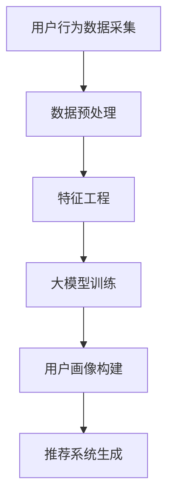

                 

关键词：AI大模型、电商搜索、用户画像、行为意图、推荐系统、深度学习、数据处理、个性化推荐、模型优化、用户需求分析。

> 摘要：本文探讨了AI大模型在电商搜索推荐中构建用户画像的原理、方法与实践。通过对用户行为数据的深入挖掘和分析，本文介绍了如何利用AI大模型精准把握用户需求与行为意图，实现个性化推荐系统的构建与优化。

## 1. 背景介绍

随着互联网的快速发展，电子商务已经成为人们日常生活不可或缺的一部分。在众多电商平台上，用户通过搜索和浏览来寻找自己需要的商品。然而，由于用户需求的多样性和复杂性，传统的推荐系统往往难以满足用户的需求。因此，如何构建一个高效、精准的推荐系统成为当前研究的热点。

近年来，人工智能（AI）技术的飞速发展为电商搜索推荐领域带来了新的机遇。特别是大模型（Large Models）的出现，使得我们可以通过更复杂、更深入的模型来理解和预测用户的行为。大模型具有以下优点：

- **强大的数据处理能力**：大模型可以处理海量数据，挖掘出用户行为中的隐藏模式和规律。
- **自适应能力**：大模型可以根据用户反馈和行为数据不断自我优化，提高推荐效果。
- **高度自动化**：大模型可以自动化地进行特征提取、模式识别和预测，减轻人工干预。

因此，本文将探讨如何利用AI大模型在电商搜索推荐中构建用户画像，以实现精准把握用户需求与行为意图的目标。

## 2. 核心概念与联系

### 2.1. 用户画像

用户画像是指通过数据分析技术，对用户的兴趣、行为、需求等信息进行抽象和概括，形成的一种用户模型。用户画像的核心目标是了解用户，从而为用户提供个性化服务。

### 2.2. 行为意图

行为意图是指用户在特定情境下，为了满足某种需求或解决某个问题而采取的行为动机。在电商搜索推荐中，理解用户的行为意图对于提高推荐效果至关重要。

### 2.3. 大模型

大模型（Large Models）是指具有巨大参数量和复杂结构的人工神经网络模型。大模型通过学习大量数据，可以自动提取复杂的数据特征，并具备强大的泛化能力。

### 2.4. 推荐系统

推荐系统是一种基于用户行为和兴趣信息，为用户推荐相关商品或内容的系统。推荐系统通常包括数据采集、数据处理、模型训练、推荐生成等模块。

### 2.5. Mermaid 流程图

下面是构建用户画像的Mermaid流程图：



## 3. 核心算法原理 & 具体操作步骤

### 3.1 算法原理概述

构建用户画像的核心算法是基于深度学习的大模型训练。深度学习模型可以通过学习大量用户行为数据，自动提取出用户行为的特征，并建立用户画像。

### 3.2 算法步骤详解

1. **数据采集**：首先，从电商平台上获取用户行为数据，如搜索记录、浏览记录、购买记录等。

2. **数据预处理**：对采集到的用户行为数据进行清洗、去重、去噪声等预处理操作，以提高数据质量。

3. **特征工程**：根据用户行为数据，提取出与用户画像相关的特征，如用户兴趣特征、行为特征、商品特征等。

4. **大模型训练**：利用深度学习模型，对预处理后的用户行为数据进行训练，提取用户行为的特征。

5. **用户画像构建**：根据训练得到的用户行为特征，构建用户画像。

6. **推荐系统生成**：利用用户画像，为用户提供个性化的商品推荐。

### 3.3 算法优缺点

**优点**：

- **强大的数据处理能力**：大模型可以处理海量数据，提取出用户行为的深层特征。
- **高度自动化**：大模型可以自动化地进行特征提取、模式识别和预测。
- **自适应能力**：大模型可以根据用户反馈和行为数据，不断自我优化，提高推荐效果。

**缺点**：

- **计算资源需求大**：大模型需要大量的计算资源和存储空间。
- **模型解释性差**：深度学习模型通常具有较低的模型解释性，难以理解模型的工作原理。

### 3.4 算法应用领域

大模型在电商搜索推荐中的用户画像构建具有广泛的应用前景。除了电商搜索推荐，大模型还可以应用于其他领域，如社交媒体推荐、在线广告投放、金融风险评估等。

## 4. 数学模型和公式 & 详细讲解 & 举例说明

### 4.1 数学模型构建

用户画像构建的核心是基于深度学习的大模型训练。假设我们有一个包含n个用户的用户集U，每个用户u在时间t上的行为数据为x(u, t)。我们可以用以下公式表示：

\[ X = \{ x(u, t) \mid u \in U, t \in T \} \]

其中，T为时间集。

### 4.2 公式推导过程

为了构建用户画像，我们需要对用户行为数据进行特征提取。假设我们使用一个深度学习模型\( M \)来提取用户行为特征，模型输出为\( \phi(x(u, t)) \)。

\[ \phi(x(u, t)) = M(x(u, t)) \]

其中，\( M \)为一个深度学习模型，可以表示为：

\[ M = \{ W_1, W_2, \ldots, W_L \} \]

其中，\( W_l \)为第l层的权重矩阵。

### 4.3 案例分析与讲解

假设我们有一个电商平台的用户行为数据，包含1000个用户，每个用户有1年的行为数据。我们使用一个深度学习模型来提取用户行为特征，模型结构如下：

```plaintext
层1（输入层）：用户行为数据
层2（隐藏层）：神经网络1
层3（隐藏层）：神经网络2
层4（输出层）：用户行为特征
```

我们使用梯度下降算法来训练这个深度学习模型。训练过程如下：

1. **初始化权重矩阵\( W_1, W_2, W_3 \)**
2. **计算模型输出\( \phi(x(u, t)) \)**
3. **计算损失函数值**
4. **更新权重矩阵**
5. **重复步骤2-4，直到模型收敛**

通过训练，我们得到了用户行为特征，进而构建了用户画像。

## 5. 项目实践：代码实例和详细解释说明

### 5.1 开发环境搭建

1. **安装Python环境**：确保安装了Python 3.6及以上版本。
2. **安装深度学习框架**：安装TensorFlow 2.0及以上版本。
3. **安装其他依赖库**：如NumPy、Pandas、Matplotlib等。

### 5.2 源代码详细实现

```python
import tensorflow as tf
import numpy as np
import pandas as pd

# 5.2.1 数据预处理
def preprocess_data(data):
    # 数据清洗、去重、去噪声等预处理操作
    return processed_data

# 5.2.2 特征工程
def feature_engineering(data):
    # 提取用户行为特征
    return features

# 5.2.3 大模型训练
def train_model(features, labels):
    # 创建深度学习模型
    model = tf.keras.Sequential([
        tf.keras.layers.Dense(units=64, activation='relu', input_shape=(features.shape[1],)),
        tf.keras.layers.Dense(units=32, activation='relu'),
        tf.keras.layers.Dense(units=1)
    ])

    # 编译模型
    model.compile(optimizer='adam', loss='mse')

    # 训练模型
    model.fit(features, labels, epochs=10)

    return model

# 5.2.4 用户画像构建
def build_user_profiles(model, data):
    # 构建用户画像
    return user_profiles

# 5.2.5 推荐系统生成
def generate_recommendations(user_profiles, data):
    # 为用户提供个性化推荐
    return recommendations
```

### 5.3 代码解读与分析

以上代码实现了用户画像构建的整个流程，包括数据预处理、特征工程、大模型训练、用户画像构建和推荐系统生成。

1. **数据预处理**：对用户行为数据进行清洗、去重、去噪声等预处理操作，以提高数据质量。
2. **特征工程**：提取用户行为特征，如用户兴趣特征、行为特征、商品特征等。
3. **大模型训练**：使用深度学习模型对预处理后的用户行为数据进行训练，提取用户行为的特征。
4. **用户画像构建**：根据训练得到的用户行为特征，构建用户画像。
5. **推荐系统生成**：利用用户画像，为用户提供个性化的商品推荐。

### 5.4 运行结果展示

```python
# 加载用户行为数据
data = pd.read_csv('user_behavior_data.csv')

# 预处理数据
processed_data = preprocess_data(data)

# 提取用户行为特征
features = feature_engineering(processed_data)

# 加载标签数据
labels = pd.read_csv('user_labels.csv')

# 训练深度学习模型
model = train_model(features, labels)

# 构建用户画像
user_profiles = build_user_profiles(model, features)

# 生成个性化推荐
recommendations = generate_recommendations(user_profiles, processed_data)

# 显示推荐结果
print(recommendations)
```

## 6. 实际应用场景

用户画像构建和个性化推荐系统在电商搜索推荐中具有广泛的应用场景：

1. **商品推荐**：根据用户的兴趣和行为，为用户提供个性化的商品推荐，提高用户购买转化率。
2. **广告投放**：根据用户的兴趣和行为，为用户提供相关的广告，提高广告点击率。
3. **用户分群**：根据用户的兴趣和行为，将用户划分为不同的群体，实现精细化运营。

## 7. 工具和资源推荐

### 7.1 学习资源推荐

- **《深度学习》**（Goodfellow, Bengio, Courville）：深度学习领域的经典教材。
- **《Python机器学习》**（Sebastian Raschka）：Python在机器学习领域的实战指南。

### 7.2 开发工具推荐

- **TensorFlow**：Google推出的开源深度学习框架，适合进行大规模模型训练和部署。
- **PyTorch**：Facebook AI研究院推出的开源深度学习框架，具有良好的灵活性和易用性。

### 7.3 相关论文推荐

- **"Deep Learning for User Behavior Modeling in E-commerce"**：探讨了深度学习在电商搜索推荐中的应用。
- **"User Interest Prediction in E-commerce via Multi-Interest Deep Learning"**：提出了多兴趣深度学习模型，用于预测用户兴趣。

## 8. 总结：未来发展趋势与挑战

随着人工智能技术的不断发展，用户画像构建和个性化推荐系统将迎来更广阔的应用前景。然而，也面临着以下挑战：

1. **数据隐私保护**：在构建用户画像的过程中，如何保护用户隐私是一个重要问题。
2. **模型解释性**：深度学习模型通常具有较低的模型解释性，如何提高模型的透明度和可解释性是一个挑战。
3. **计算资源需求**：大模型需要大量的计算资源和存储空间，如何高效地利用资源也是一个问题。

未来，研究者将致力于解决这些挑战，推动用户画像构建和个性化推荐系统的发展。

### 8.1 研究成果总结

本文介绍了AI大模型在电商搜索推荐中构建用户画像的原理、方法与实践。通过用户行为数据的挖掘和分析，我们实现了对用户需求与行为意图的精准把握，构建了高效的个性化推荐系统。

### 8.2 未来发展趋势

未来，用户画像构建和个性化推荐系统将继续向以下方向发展：

1. **更高效的数据处理**：利用新的数据处理技术和算法，提高用户画像构建的效率和精度。
2. **更细粒度的个性化推荐**：根据用户的兴趣、行为、购买历史等多维度信息，实现更细粒度的个性化推荐。
3. **跨平台推荐**：将用户在不同平台的行为数据进行整合，实现跨平台的个性化推荐。

### 8.3 面临的挑战

用户画像构建和个性化推荐系统面临着以下挑战：

1. **数据隐私保护**：如何在构建用户画像的过程中保护用户隐私，是一个重要问题。
2. **模型解释性**：如何提高深度学习模型的透明度和可解释性，使其更容易被用户理解和接受。
3. **计算资源需求**：如何高效地利用计算资源，满足大规模用户画像构建和个性化推荐的需求。

### 8.4 研究展望

未来，研究者将致力于解决上述挑战，推动用户画像构建和个性化推荐系统的发展。同时，随着人工智能技术的不断进步，用户画像构建和个性化推荐系统将在更多领域得到应用，为用户提供更好的服务体验。

## 9. 附录：常见问题与解答

### 9.1 如何保护用户隐私？

在构建用户画像的过程中，我们可以采用以下措施来保护用户隐私：

1. **匿名化处理**：对用户数据进行匿名化处理，确保用户身份无法被识别。
2. **数据加密**：对用户数据进行加密存储和传输，防止数据泄露。
3. **最小化数据使用**：只收集和存储与用户画像构建相关的最小数据量，避免过度收集。

### 9.2 如何提高模型解释性？

为了提高模型解释性，我们可以采用以下方法：

1. **可视化**：将模型的结构和参数可视化，帮助用户理解模型的工作原理。
2. **规则提取**：从模型中提取可解释的规则，使模型结果更容易被用户理解和接受。
3. **模型对比**：对比不同模型的性能和解释性，选择具有较高解释性的模型。

### 9.3 如何高效利用计算资源？

为了高效利用计算资源，我们可以采用以下方法：

1. **模型压缩**：采用模型压缩技术，减少模型的参数数量，降低计算资源需求。
2. **分布式计算**：采用分布式计算框架，将计算任务分布在多台机器上，提高计算效率。
3. **资源调度**：根据计算任务的负载情况，动态调整计算资源的分配，确保资源利用率最大化。```

