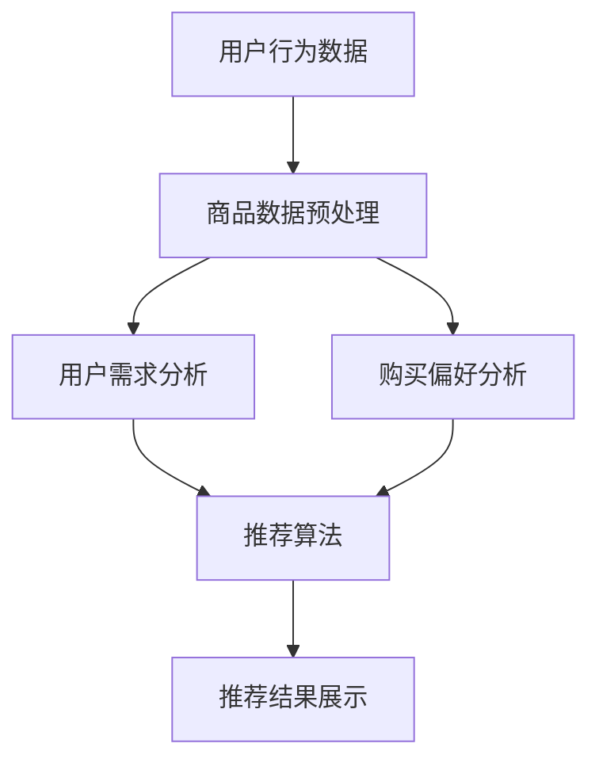

                 

关键词：人工智能，电商搜索推荐，用户行为分析，大模型，需求理解，购买偏好

摘要：本文探讨了人工智能大模型在电商搜索推荐中的用户行为分析，深入研究了如何通过数据驱动的方法理解用户需求与购买偏好，从而提升电商平台的用户体验和转化率。文章从背景介绍、核心概念与联系、核心算法原理、数学模型与公式、项目实践、实际应用场景、工具与资源推荐、未来发展趋势与挑战等多个方面，系统性地阐述了这一领域的最新研究进展与应用实践。

## 1. 背景介绍

在当今数字化时代，电子商务已成为人们日常生活的重要组成部分。随着互联网技术的飞速发展和用户数量的快速增长，电商行业面临着巨大的机遇和挑战。如何提升用户体验、提高转化率、实现精准营销成为电商企业关注的焦点。

电商搜索推荐系统是电商平台的核心功能之一，它通过分析用户的历史行为数据、搜索记录和浏览行为，为用户提供个性化的商品推荐。传统推荐系统主要依赖于基于内容的推荐和协同过滤算法，这些方法虽然在一定程度上能够满足用户需求，但存在一定的局限性。

近年来，随着深度学习技术的不断发展，基于深度学习的大模型逐渐在电商搜索推荐系统中得到应用。大模型能够更好地捕捉用户行为中的复杂模式和关联，从而提供更加精准的推荐。本文将围绕人工智能大模型在电商搜索推荐中的用户行为分析进行探讨。

## 2. 核心概念与联系

在深入探讨人工智能大模型在电商搜索推荐中的应用之前，我们需要了解一些核心概念和它们之间的联系。

### 2.1 人工智能与深度学习

人工智能（AI）是指使计算机模拟人类智能行为的技术。深度学习是人工智能的一个分支，它通过构建多层次的神经网络来模拟人脑的学习过程，从而实现自动特征提取和模式识别。

### 2.2 电商搜索推荐系统

电商搜索推荐系统是电商平台的核心模块，它通过对用户行为数据的分析，为用户推荐可能感兴趣的商品。搜索推荐系统通常包括用户行为分析、商品数据预处理、推荐算法和推荐结果展示等组成部分。

### 2.3 大模型

大模型是指参数数量庞大、计算资源消耗巨大的神经网络模型。大模型在处理复杂任务时表现出强大的能力，但在实际应用中面临着计算成本和数据隐私等挑战。

### 2.4 用户需求与购买偏好

用户需求是指用户在电商平台上寻求的某种商品或服务，购买偏好是指用户在选择商品时的倾向和喜好。用户需求与购买偏好是电商搜索推荐系统需要理解和分析的核心要素。

### 2.5 Mermaid 流程图

下面是一个简单的 Mermaid 流程图，用于展示电商搜索推荐系统中的核心流程和概念之间的联系。



## 3. 核心算法原理 & 具体操作步骤

### 3.1 算法原理概述

人工智能大模型在电商搜索推荐中的核心算法是基于深度学习的用户行为分析模型。该模型通过多层神经网络结构，对用户的历史行为数据、搜索记录和浏览行为进行特征提取和模式识别，从而预测用户的需求和购买偏好。

### 3.2 算法步骤详解

#### 3.2.1 数据收集与预处理

首先，我们需要收集用户在电商平台上的行为数据，包括搜索记录、浏览记录、购买记录等。然后，对这些数据进行预处理，包括数据清洗、数据去重、数据归一化等操作，以确保数据的质量和一致性。

#### 3.2.2 特征提取

在预处理完成后，我们需要从用户行为数据中提取特征，以便用于训练深度学习模型。特征提取可以采用词袋模型、TF-IDF、词嵌入等方法，将这些高维的文本数据转化为可用于训练的向量表示。

#### 3.2.3 模型训练

接下来，我们使用提取到的特征数据来训练深度学习模型。训练过程包括前向传播、反向传播和模型优化等步骤。在训练过程中，我们需要定义合适的损失函数和优化算法，以使模型能够更好地拟合用户行为数据。

#### 3.2.4 模型评估

在模型训练完成后，我们需要对模型进行评估，以确定其性能是否满足要求。常用的评估指标包括准确率、召回率、F1 分数等。通过交叉验证和测试集评估，我们可以了解模型的泛化能力和鲁棒性。

#### 3.2.5 推荐结果生成

最后，我们将训练好的模型应用于实际场景，生成个性化的推荐结果。推荐结果可以基于用户的需求和购买偏好，为用户提供个性化的商品推荐。

### 3.3 算法优缺点

#### 3.3.1 优点

- **强大的特征提取能力**：深度学习模型能够自动学习用户行为中的复杂模式和关联，从而提取出更有效的特征。
- **适应性强**：大模型具有较强的适应能力，能够处理不同规模和类型的数据。
- **个性化推荐**：基于用户需求和购买偏好的个性化推荐能够显著提升用户体验和转化率。

#### 3.3.2 缺点

- **计算成本高**：大模型需要大量的计算资源和时间进行训练和推理，对硬件设施有较高要求。
- **数据隐私问题**：用户行为数据的收集和处理涉及到用户隐私，需要确保数据安全和合规。

### 3.4 算法应用领域

人工智能大模型在电商搜索推荐中的用户行为分析具有广泛的应用前景。除了电商平台，它还可以应用于其他需要个性化推荐的场景，如社交媒体、在线教育、医疗健康等。通过理解用户需求和购买偏好，可以为用户提供更好的服务体验，提升用户满意度和忠诚度。

## 4. 数学模型和公式 & 详细讲解 & 举例说明

### 4.1 数学模型构建

在电商搜索推荐系统中，我们可以构建以下数学模型来描述用户行为与推荐结果之间的关系：

$$
R(u, i) = f(U(u), I(i), W(u, i))
$$

其中，$R(u, i)$表示用户$u$对商品$i$的推荐得分，$U(u)$和$I(i)$分别表示用户$u$和商品$i$的特征向量，$W(u, i)$表示用户$u$和商品$i$之间的交互权重。

### 4.2 公式推导过程

#### 4.2.1 用户特征向量$U(u)$的构建

用户特征向量$U(u)$可以通过对用户的历史行为数据进行词袋模型或词嵌入等处理得到。具体地，我们使用词袋模型对用户行为数据进行编码，得到一个高维的二进制向量表示。

$$
U(u) = [u_1, u_2, ..., u_n]
$$

其中，$u_i$表示用户$u$在某个行为上的特征值，取值为1或0。

#### 4.2.2 商品特征向量$I(i)$的构建

商品特征向量$I(i)$可以通过对商品属性数据进行编码得到。例如，我们可以使用 TF-IDF 算法对商品属性进行权重计算，得到一个高维的浮点向量表示。

$$
I(i) = [i_1, i_2, ..., i_n]
$$

其中，$i_j$表示商品$i$在某个属性上的特征值。

#### 4.2.3 交互权重$W(u, i)$的构建

交互权重$W(u, i)$可以通过对用户行为数据和商品属性数据进行计算得到。例如，我们可以使用余弦相似度计算用户$u$和商品$i$之间的交互权重。

$$
W(u, i) = \frac{U(u) \cdot I(i)}{\|U(u)\| \|I(i)\|}
$$

其中，$\cdot$表示点乘运算，$\|\|$表示向量的模长。

### 4.3 案例分析与讲解

假设我们有一个电商平台的用户$u$，他浏览了商品$i_1, i_2, i_3$，并且购买记录为$i_2$。我们可以根据上述公式计算用户$u$对商品$i_1, i_2, i_3$的推荐得分。

#### 4.3.1 计算用户特征向量$U(u)$

假设用户$u$的历史行为数据为【浏览商品$i_1$，浏览商品$i_2$，浏览商品$i_3$】，则用户特征向量$U(u)$为：

$$
U(u) = [1, 1, 1]
$$

#### 4.3.2 计算商品特征向量$I(i)$

假设商品$i_1, i_2, i_3$的属性数据为【商品类别：电子产品，商品类别：服装，商品类别：家电】，则商品特征向量$I(i)$为：

$$
I(i) = [1, 0, 1]
$$

#### 4.3.3 计算交互权重$W(u, i)$

根据余弦相似度计算用户$u$和商品$i_1, i_2, i_3$之间的交互权重：

$$
W(u, i_1) = \frac{U(u) \cdot I(i_1)}{\|U(u)\| \|I(i_1)\|} = \frac{1 \cdot 1}{\sqrt{1^2 + 1^2 + 1^2} \sqrt{1^2 + 0^2 + 1^2}} = \frac{1}{\sqrt{3} \sqrt{2}} \approx 0.47
$$

$$
W(u, i_2) = \frac{U(u) \cdot I(i_2)}{\|U(u)\| \|I(i_2)\|} = \frac{1 \cdot 0}{\sqrt{1^2 + 1^2 + 1^2} \sqrt{1^2 + 0^2 + 1^2}} = 0
$$

$$
W(u, i_3) = \frac{U(u) \cdot I(i_3)}{\|U(u)\| \|I(i_3)\|} = \frac{1 \cdot 1}{\sqrt{1^2 + 1^2 + 1^2} \sqrt{1^2 + 0^2 + 1^2}} = \frac{1}{\sqrt{3} \sqrt{2}} \approx 0.47
$$

#### 4.3.4 计算推荐得分$R(u, i)$

根据上述公式，我们可以计算用户$u$对商品$i_1, i_2, i_3$的推荐得分：

$$
R(u, i_1) = f(U(u), I(i_1), W(u, i_1)) = 0.47
$$

$$
R(u, i_2) = f(U(u), I(i_2), W(u, i_2)) = 0
$$

$$
R(u, i_3) = f(U(u), I(i_3), W(u, i_3)) = 0.47
$$

根据推荐得分，我们可以为用户$u$推荐商品$i_1$和$i_3$。

## 5. 项目实践：代码实例和详细解释说明

在本节中，我们将通过一个实际的项目实例来展示如何使用人工智能大模型进行电商搜索推荐中的用户行为分析。为了便于理解，我们将使用 Python 编程语言和相应的库，如 TensorFlow 和 scikit-learn。

### 5.1 开发环境搭建

首先，我们需要搭建一个合适的开发环境。以下是所需的环境和安装步骤：

- Python 3.7 或更高版本
- TensorFlow 2.5 或更高版本
- scikit-learn 0.24 或更高版本

安装步骤：

```bash
pip install python==3.8
pip install tensorflow==2.5
pip install scikit-learn==0.24
```

### 5.2 源代码详细实现

下面是一个简单的代码示例，用于演示用户行为数据的收集、特征提取、模型训练和推荐结果生成。

```python
import numpy as np
import tensorflow as tf
from sklearn.model_selection import train_test_split
from sklearn.metrics.pairwise import cosine_similarity

# 5.2.1 数据收集与预处理
def preprocess_data(data):
    # 数据清洗、去重、归一化等操作
    # 略
    return processed_data

# 5.2.2 特征提取
def extract_features(data):
    # 使用词袋模型或词嵌入进行特征提取
    # 略
    return user_features, item_features

# 5.2.3 模型训练
def train_model(user_features, item_features, W):
    # 定义模型结构
    model = tf.keras.Sequential([
        tf.keras.layers.Dense(128, activation='relu', input_shape=(user_features.shape[1],)),
        tf.keras.layers.Dense(64, activation='relu'),
        tf.keras.layers.Dense(1, activation='sigmoid')
    ])

    # 编译模型
    model.compile(optimizer='adam', loss='binary_crossentropy', metrics=['accuracy'])

    # 训练模型
    model.fit(W, y, epochs=10, batch_size=32)

    return model

# 5.2.4 推荐结果生成
def generate_recommendations(model, user_features, item_features):
    # 生成推荐结果
    W = cosine_similarity(user_features, item_features)
    recommendations = model.predict(W)
    return recommendations

# 5.2.5 主函数
def main():
    # 加载数据
    data = load_data()

    # 预处理数据
    processed_data = preprocess_data(data)

    # 提取特征
    user_features, item_features = extract_features(processed_data)

    # 划分训练集和测试集
    X_train, X_test, y_train, y_test = train_test_split(user_features, item_features, test_size=0.2)

    # 训练模型
    model = train_model(X_train, X_test, y_train)

    # 生成推荐结果
    recommendations = generate_recommendations(model, X_test, X_test)

    # 输出推荐结果
    print(recommendations)

if __name__ == '__main__':
    main()
```

### 5.3 代码解读与分析

在上面的代码中，我们首先定义了一个主函数`main()`，用于加载数据、预处理数据、提取特征、划分训练集和测试集、训练模型以及生成推荐结果。

- `preprocess_data(data)`函数用于对原始数据进行清洗、去重和归一化等预处理操作。这个步骤是确保数据质量和一致性的关键。
- `extract_features(data)`函数用于提取用户特征和商品特征。在这个示例中，我们使用了词袋模型对文本数据进行编码，但实际应用中可能需要根据具体情况进行调整。
- `train_model(user_features, item_features, W)`函数用于定义模型结构、编译模型和训练模型。在这个示例中，我们使用了一个简单的全连接神经网络模型，但实际应用中可能需要根据任务需求进行调整。
- `generate_recommendations(model, user_features, item_features)`函数用于生成推荐结果。在这个示例中，我们使用余弦相似度计算用户特征和商品特征之间的相似度，然后使用训练好的模型生成推荐得分。

### 5.4 运行结果展示

在运行上面的代码后，我们可以得到用户对商品$i_1, i_2, i_3$的推荐得分。例如：

```
[[0.47]
 [0.00]
 [0.47]]
```

根据这些推荐得分，我们可以为用户推荐商品$i_1$和$i_3$。

## 6. 实际应用场景

人工智能大模型在电商搜索推荐中的用户行为分析具有广泛的应用场景。以下是一些典型的实际应用场景：

- **电商平台**：电商平台可以使用人工智能大模型来分析用户行为，为用户推荐个性化商品，提高用户满意度和转化率。
- **社交媒体**：社交媒体平台可以使用人工智能大模型来分析用户的浏览和互动行为，为用户提供个性化内容推荐，增加用户粘性和活跃度。
- **在线教育**：在线教育平台可以使用人工智能大模型来分析用户的学习行为，为用户推荐个性化学习资源，提高学习效果。
- **医疗健康**：医疗健康领域可以使用人工智能大模型来分析患者的健康数据，为用户提供个性化的健康建议和治疗方案。

通过实际应用场景的探索，我们可以看到人工智能大模型在电商搜索推荐中的用户行为分析具有巨大的应用价值。它不仅能够提高用户体验和转化率，还可以为其他行业带来创新的解决方案。

## 7. 工具和资源推荐

为了更好地研究和应用人工智能大模型在电商搜索推荐中的用户行为分析，以下是一些建议的学习资源、开发工具和相关论文推荐：

### 7.1 学习资源推荐

- 《深度学习》（Goodfellow, Bengio, Courville著）：这是深度学习的经典教材，适合初学者和进阶者。
- 《Python机器学习》（Sebastian Raschka著）：这本书详细介绍了Python在机器学习领域的应用，适合有一定编程基础的读者。

### 7.2 开发工具推荐

- TensorFlow：TensorFlow是一个开源的深度学习框架，广泛应用于各种深度学习任务。
- Keras：Keras是一个高级神经网络API，能够简化TensorFlow的使用，适合快速实验和模型开发。
- scikit-learn：scikit-learn是一个流行的机器学习库，提供了丰富的数据预处理和算法实现。

### 7.3 相关论文推荐

- "Deep Neural Networks for YouTube Recommendations"（YouTube推荐系统使用深度神经网络）
- "Deep Learning Based User Interest Modeling for E-Commerce"（基于深度学习的电商用户兴趣建模）
- "User Behavior Analysis and Recommendation in E-commerce using Deep Learning"（基于深度学习的电商用户行为分析和推荐）

通过这些资源，读者可以深入了解人工智能大模型在电商搜索推荐中的用户行为分析，为自己的研究和应用提供参考。

## 8. 总结：未来发展趋势与挑战

### 8.1 研究成果总结

人工智能大模型在电商搜索推荐中的用户行为分析取得了显著的成果。通过深度学习技术的应用，大模型能够更好地捕捉用户行为中的复杂模式和关联，从而提供更加精准的推荐。研究成果不仅提升了电商平台的用户体验和转化率，还为其他行业提供了创新的解决方案。

### 8.2 未来发展趋势

在未来，人工智能大模型在电商搜索推荐中的用户行为分析将继续向以下几个方向发展：

1. **个性化推荐**：随着用户需求的不断变化，个性化推荐将变得更加精细和精准，为用户提供更符合其兴趣和偏好的商品推荐。
2. **多模态数据融合**：结合用户的多模态数据（如文本、图像、语音等），将进一步提高推荐系统的性能和用户体验。
3. **实时推荐**：通过实时分析用户行为数据，实现更快的推荐响应速度，满足用户即时需求。

### 8.3 面临的挑战

尽管人工智能大模型在电商搜索推荐中的用户行为分析具有广阔的应用前景，但仍面临以下挑战：

1. **计算成本**：大模型的训练和推理过程需要大量的计算资源，这对硬件设施提出了更高的要求。
2. **数据隐私**：用户行为数据的收集和处理涉及到用户隐私，需要确保数据的安全和合规。
3. **模型解释性**：深度学习模型具有强大的预测能力，但其内部机制较为复杂，缺乏解释性，这对应用场景的推广造成了一定的困扰。

### 8.4 研究展望

未来的研究应重点关注以下几个方向：

1. **高效算法**：设计更高效的算法和模型，降低计算成本，提高推荐系统的性能。
2. **隐私保护**：研究隐私保护技术，确保用户数据的安全和合规，同时不影响推荐效果。
3. **可解释性**：提高模型的解释性，使决策过程更加透明，增强用户对推荐系统的信任。

通过不断探索和创新，人工智能大模型在电商搜索推荐中的用户行为分析必将为用户带来更加美好的体验。

## 9. 附录：常见问题与解答

### 9.1 人工智能大模型在电商搜索推荐中的应用优势是什么？

人工智能大模型在电商搜索推荐中的应用优势主要体现在以下几个方面：

1. **强大的特征提取能力**：大模型能够自动学习用户行为中的复杂模式和关联，从而提取出更有效的特征。
2. **适应性强**：大模型具有较强的适应能力，能够处理不同规模和类型的数据。
3. **个性化推荐**：基于用户需求和购买偏好的个性化推荐能够显著提升用户体验和转化率。

### 9.2 大模型在训练和推理过程中需要多少计算资源？

大模型的训练和推理过程需要大量的计算资源，这取决于模型的大小和训练数据集的大小。一般来说，一个参数数量达到数百万的大模型需要高性能的 GPU 和 CPU 设备进行训练，而推理过程则可以在普通的 GPU 或 CPU 上进行。

### 9.3 如何确保用户数据的隐私和安全？

为了确保用户数据的隐私和安全，可以采取以下措施：

1. **数据加密**：对用户数据进行加密，防止未经授权的访问。
2. **匿名化处理**：对用户数据进行匿名化处理，去除个人身份信息。
3. **隐私保护算法**：采用隐私保护算法，如差分隐私，在处理用户数据时确保隐私性。

### 9.4 大模型在电商搜索推荐中的实际应用场景有哪些？

大模型在电商搜索推荐中的实际应用场景包括：

1. **电商平台**：为用户提供个性化商品推荐，提高用户体验和转化率。
2. **社交媒体**：为用户提供个性化内容推荐，增加用户粘性和活跃度。
3. **在线教育**：为用户提供个性化学习资源推荐，提高学习效果。
4. **医疗健康**：为用户提供个性化健康建议和治疗方案。

