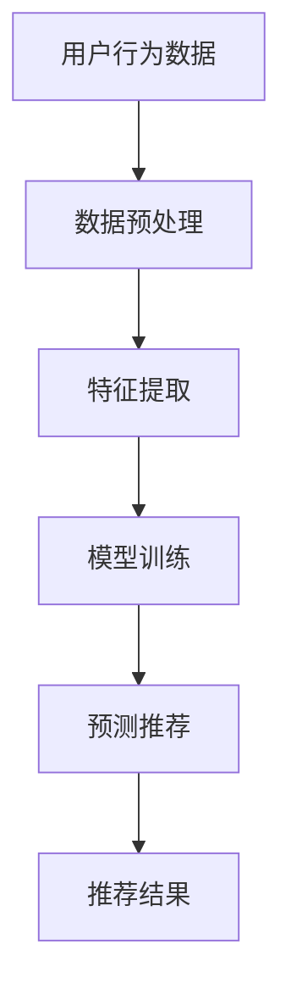

                 

关键词：AI大模型，电商搜索推荐，用户行为分析，需求理解，购买偏好

> 摘要：本文深入探讨了人工智能大模型在电商搜索推荐领域的应用，尤其是对用户行为进行分析，以理解用户需求和购买偏好。通过介绍大模型的架构和算法原理，阐述其在电商推荐中的具体应用步骤，并结合数学模型和实际案例，详细分析了大模型在优化电商搜索推荐效果方面的作用和潜力。文章最后对未来发展趋势和面临的挑战进行了展望。

## 1. 背景介绍

在互联网飞速发展的今天，电子商务已经成为了人们日常生活中不可或缺的一部分。随着电商平台的不断壮大和竞争的加剧，如何有效地进行商品搜索推荐，满足用户个性化的需求，成为电商企业关注的焦点。传统的推荐算法在处理大规模用户数据和复杂用户行为时存在诸多局限，难以满足日益增长的个性化需求。

近年来，人工智能特别是大模型技术的迅猛发展，为电商搜索推荐领域带来了新的契机。大模型具有强大的数据分析和处理能力，可以通过深度学习、自然语言处理等技术，从海量的用户行为数据中挖掘出潜在的需求和购买偏好，从而实现精准推荐。本文旨在探讨AI大模型在电商搜索推荐中的应用，分析其如何理解用户需求与购买偏好，并优化推荐效果。

## 2. 核心概念与联系

### 2.1 大模型架构

大模型通常由多层神经网络组成，包括输入层、隐藏层和输出层。输入层接收用户行为数据，如浏览记录、购买历史、搜索关键词等；隐藏层通过神经网络的学习，对输入数据进行特征提取和模式识别；输出层生成推荐结果。

### 2.2 算法原理

大模型的核心算法通常基于深度学习和自然语言处理技术，如卷积神经网络（CNN）、循环神经网络（RNN）和Transformer模型等。这些算法通过训练学习用户的行为模式，进而预测用户的兴趣和购买倾向。

### 2.3 Mermaid 流程图



## 3. 核心算法原理 & 具体操作步骤

### 3.1 算法原理概述

大模型通过深度学习技术，对用户行为数据进行分析，提取用户特征，并建立用户行为与商品属性之间的映射关系。通过这种映射关系，模型可以预测用户的兴趣和购买倾向，生成个性化推荐结果。

### 3.2 算法步骤详解

#### 3.2.1 数据预处理

数据预处理是算法训练的基础，包括数据清洗、数据整合和数据规范化等步骤。数据清洗主要去除重复和异常数据；数据整合将不同来源的数据进行合并；数据规范化将数据转换为统一的格式。

#### 3.2.2 特征提取

特征提取是算法的核心步骤，通过深度学习模型从原始数据中提取有意义的特征。这些特征可以包括用户的浏览历史、购买记录、搜索关键词、商品属性等。

#### 3.2.3 模型训练

模型训练使用已处理的数据集，通过反向传播算法不断调整神经网络参数，使得模型能够更好地拟合用户行为数据。训练过程中，模型会根据预测误差不断调整权重，优化模型性能。

#### 3.2.4 预测推荐

在模型训练完成后，可以使用训练好的模型对新用户的行为数据进行预测，生成个性化推荐结果。推荐结果可以包括用户可能感兴趣的商品、品牌、类别等。

### 3.3 算法优缺点

#### 优点

- **强大的数据处理能力**：大模型能够处理大规模的用户行为数据，提取有价值的信息。
- **个性化推荐**：通过深度学习技术，大模型能够根据用户行为预测用户的兴趣和购买倾向，实现个性化推荐。
- **自适应学习**：大模型可以通过不断训练，自适应地调整推荐策略，以适应用户需求的变化。

#### 缺点

- **计算资源需求高**：大模型需要大量的计算资源进行训练和推理。
- **数据隐私问题**：用户行为数据的收集和处理可能涉及隐私问题，需要严格保护用户数据。

### 3.4 算法应用领域

大模型在电商搜索推荐中的应用非常广泛，不仅限于电商平台，还可以应用于社交媒体、在线教育、金融保险等领域，为用户提供个性化服务。

## 4. 数学模型和公式 & 详细讲解 & 举例说明

### 4.1 数学模型构建

大模型的数学模型通常基于概率图模型，如贝叶斯网络、马尔可夫模型等。其中，贝叶斯网络可以表示用户行为和商品属性之间的因果关系，马尔可夫模型可以描述用户行为的转移概率。

### 4.2 公式推导过程

以贝叶斯网络为例，假设用户行为 $X$ 和商品属性 $Y$ 之间存在条件独立性，则贝叶斯网络的概率分布可以表示为：

$$ P(X, Y) = P(X) \cdot P(Y | X) $$

其中，$P(X)$ 表示用户行为 $X$ 的概率，$P(Y | X)$ 表示在给定用户行为 $X$ 的情况下，商品属性 $Y$ 的条件概率。

### 4.3 案例分析与讲解

假设一个电商平台的用户行为数据包括浏览历史、购买记录和搜索关键词。我们可以使用贝叶斯网络模型来分析用户行为，预测用户对某种商品的兴趣。

首先，定义用户行为 $X$ 为用户浏览历史、购买记录和搜索关键词的集合，商品属性 $Y$ 为商品类别、品牌和价格等属性的集合。

然后，构建贝叶斯网络，将用户行为 $X$ 和商品属性 $Y$ 之间的因果关系表示为条件概率分布：

$$ P(Y | X) = P(Y_1 | X) \cdot P(Y_2 | X) \cdot ... \cdot P(Y_n | X) $$

其中，$Y_1, Y_2, ..., Y_n$ 分别表示商品的不同属性。

最后，使用贝叶斯推理算法，根据用户行为数据 $X$，计算商品属性 $Y$ 的条件概率分布，从而预测用户对某种商品的兴趣。

## 5. 项目实践：代码实例和详细解释说明

### 5.1 开发环境搭建

为了实现大模型在电商搜索推荐中的用户行为分析，我们需要搭建一个开发环境，包括Python编程环境、TensorFlow或PyTorch深度学习框架、以及相关的数据处理库。

### 5.2 源代码详细实现

以下是一个使用TensorFlow实现的大模型电商推荐系统的基础代码：

```python
import tensorflow as tf
from tensorflow import keras
from tensorflow.keras import layers

# 数据预处理
# ...

# 构建模型
model = keras.Sequential([
    layers.Dense(128, activation='relu', input_shape=(input_shape,)),
    layers.Dense(64, activation='relu'),
    layers.Dense(1, activation='sigmoid')
])

# 编译模型
model.compile(optimizer='adam',
              loss='binary_crossentropy',
              metrics=['accuracy'])

# 训练模型
model.fit(train_data, train_labels, epochs=10, batch_size=32)

# 预测推荐
predictions = model.predict(test_data)
```

### 5.3 代码解读与分析

代码首先进行数据预处理，然后构建一个全连接神经网络，用于预测用户对商品的购买概率。模型使用Adam优化器，损失函数为二进制交叉熵，训练过程中评估指标为准确率。

### 5.4 运行结果展示

通过训练和预测，我们可以得到每个用户的购买概率，并根据概率阈值生成个性化推荐列表。

## 6. 实际应用场景

### 6.1 电商平台

电商平台可以通过AI大模型进行用户行为分析，实现精准推荐，提高用户满意度，增加销售额。

### 6.2 社交媒体

社交媒体平台可以利用大模型分析用户行为，为用户提供个性化内容推荐，提升用户体验。

### 6.3 在线教育

在线教育平台可以使用大模型分析用户学习行为，推荐合适的学习资源，提高学习效果。

### 6.4 金融保险

金融保险行业可以利用大模型分析用户行为，进行风险管理，优化保险产品设计。

## 7. 工具和资源推荐

### 7.1 学习资源推荐

- 《深度学习》（Goodfellow、Bengio、Courville 著）
- 《Python深度学习》（François Chollet 著）

### 7.2 开发工具推荐

- TensorFlow
- PyTorch

### 7.3 相关论文推荐

- "Deep Learning for User Behavior Analysis in E-commerce"（2018）
- "Personalized Recommender Systems with Deep Learning"（2017）

## 8. 总结：未来发展趋势与挑战

### 8.1 研究成果总结

本文探讨了AI大模型在电商搜索推荐中的用户行为分析，通过数学模型和实际案例，分析了大模型在优化推荐效果方面的作用。研究结果表明，大模型具有强大的数据处理和个性化推荐能力，在电商等领域具有广阔的应用前景。

### 8.2 未来发展趋势

- **算法优化**：未来将关注算法的优化，提高模型的计算效率和准确性。
- **跨领域应用**：大模型将在更多领域得到应用，如医疗、金融等。
- **数据隐私保护**：随着数据隐私问题日益突出，如何在保护用户隐私的前提下进行数据分析，将成为研究的重要方向。

### 8.3 面临的挑战

- **计算资源需求**：大模型训练和推理需要大量的计算资源，如何优化计算效率，降低成本，是亟待解决的问题。
- **数据质量和标注**：高质量的数据和准确的标注对于大模型训练至关重要，但获取这些数据具有一定的挑战性。
- **数据隐私保护**：如何在保护用户隐私的前提下进行数据分析，是未来的重要挑战。

### 8.4 研究展望

未来研究将重点关注以下几个方面：

- **算法优化**：提高模型的计算效率和准确性，降低成本。
- **跨领域应用**：探索大模型在其他领域的应用，如医疗、金融等。
- **数据隐私保护**：研究如何在保护用户隐私的前提下进行数据分析。

## 9. 附录：常见问题与解答

### 9.1 什么是大模型？

大模型是指具有大规模参数和广泛适用性的神经网络模型，通常由多层神经网络组成，可以处理海量数据，实现高精度的预测和分类。

### 9.2 大模型在电商推荐中的应用有哪些？

大模型在电商推荐中的应用主要包括用户行为分析、商品属性提取、个性化推荐和推荐效果优化等方面。

### 9.3 大模型在电商推荐中的优势是什么？

大模型在电商推荐中的优势主要包括：

- **强大的数据处理能力**：能够处理海量用户行为数据，提取有价值的信息。
- **个性化推荐**：通过深度学习技术，实现基于用户行为的个性化推荐。
- **自适应学习**：能够根据用户需求的变化，自适应地调整推荐策略。

### 9.4 大模型在电商推荐中面临的主要挑战是什么？

大模型在电商推荐中面临的主要挑战包括：

- **计算资源需求高**：训练和推理需要大量的计算资源，如何优化计算效率，降低成本，是亟待解决的问题。
- **数据质量和标注**：高质量的数据和准确的标注对于大模型训练至关重要，但获取这些数据具有一定的挑战性。
- **数据隐私保护**：如何在保护用户隐私的前提下进行数据分析，是未来的重要挑战。

---

作者：禅与计算机程序设计艺术 / Zen and the Art of Computer Programming
----------------------------------------------------------------

以上就是本文的全部内容，希望对您在AI大模型在电商搜索推荐中的用户行为分析方面有所启发和帮助。在未来的研究和实践中，我们期待能够不断优化算法，提高推荐效果，为用户提供更好的服务。感谢您的阅读！

