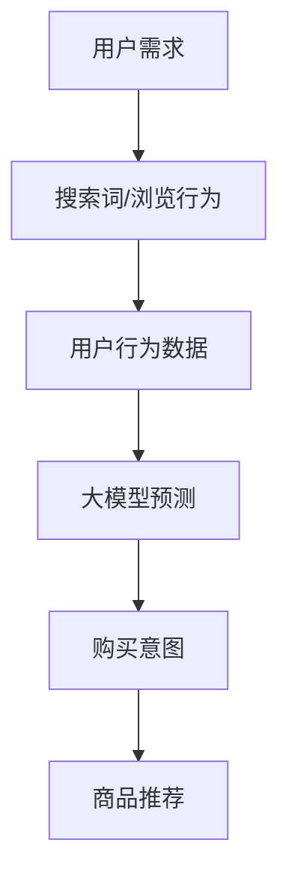

                 

关键词：AI 大模型、电商搜索推荐、用户行为分析、用户需求、购买意图

摘要：本文探讨了 AI 大模型在电商搜索推荐中的应用，通过用户行为分析，深入理解用户的需求和购买意图。文章首先介绍了大模型的背景和核心概念，然后详细阐述了算法原理和数学模型，并通过项目实践展示了具体应用场景。同时，本文还对未来应用前景进行了展望，并提出了相关工具和资源的推荐。

## 1. 背景介绍

在互联网时代，电商平台的崛起极大地改变了人们的购物方式。然而，随着商品种类的爆炸式增长，用户在搜索和浏览过程中面临着前所未有的选择困难。为了提高用户体验和销售转化率，电商平台开始引入人工智能（AI）技术，特别是大模型技术，来优化搜索推荐系统。

大模型是指具有巨大参数规模和强泛化能力的深度学习模型，如Transformer、BERT 等。它们能够在大量数据中提取有效信息，从而实现高效的自然语言处理和用户行为预测。在电商搜索推荐领域，大模型的应用主要体现在以下几个方面：

1. **用户需求分析**：通过分析用户的搜索历史、浏览行为和购买记录，大模型可以准确捕捉用户的需求，从而提供个性化的推荐。
2. **购买意图预测**：大模型可以预测用户的购买意图，帮助电商平台提前识别潜在的消费者，提高营销效果。
3. **商品分类和标签**：大模型能够自动生成商品的分类和标签，提高电商平台的商品管理效率。

本文旨在探讨 AI 大模型在电商搜索推荐中的应用，通过用户行为分析，深入理解用户的需求和购买意图。首先，我们将介绍大模型的背景和核心概念，然后详细阐述算法原理和数学模型，并通过项目实践展示具体应用场景。最后，本文将对未来应用前景进行展望，并推荐相关工具和资源。

## 2. 核心概念与联系

在讨论 AI 大模型在电商搜索推荐中的应用之前，我们首先需要了解几个核心概念：用户需求、购买意图、大模型技术以及它们之间的联系。

### 2.1 用户需求

用户需求是指用户在购物过程中所期望获得的产品或服务。在电商搜索推荐中，用户需求可以从多个维度进行描述，包括：

- **显性需求**：用户通过搜索词或浏览行为明确表达的需求。
- **隐性需求**：用户在购物过程中没有明确表达，但可以通过数据分析推断出的需求。

### 2.2 购买意图

购买意图是指用户在购物过程中表现出的购买倾向。它可以通过以下几种方式体现：

- **购买频率**：用户在一定时间内购买商品的次数。
- **购买金额**：用户在购买过程中所花费的总金额。
- **浏览时间**：用户在商品详情页停留的时间。

### 2.3 大模型技术

大模型技术是指具有巨大参数规模和强泛化能力的深度学习模型。在电商搜索推荐中，大模型主要用于以下方面：

- **用户行为预测**：通过分析用户的搜索历史、浏览行为和购买记录，预测用户的未来行为。
- **商品推荐**：基于用户的行为数据和商品属性，为用户提供个性化的商品推荐。

### 2.4 用户需求与购买意图的联系

用户需求与购买意图密切相关。用户在表达需求时，往往会通过搜索词或浏览行为来体现。而购买意图则是用户在购买过程中表现出的实际行动。因此，通过分析用户的需求，可以帮助我们更好地预测用户的购买意图。

### 2.5 Mermaid 流程图

为了更直观地展示用户需求、购买意图和大模型技术之间的联系，我们使用 Mermaid 绘制了以下流程图：



## 3. 核心算法原理 & 具体操作步骤

### 3.1 算法原理概述

AI 大模型在电商搜索推荐中的核心算法原理主要包括以下几个步骤：

1. **数据采集**：通过电商平台的数据接口，采集用户的搜索历史、浏览行为和购买记录等数据。
2. **数据预处理**：对采集到的数据进行清洗、去重和格式化，确保数据质量。
3. **模型训练**：使用大规模数据集对深度学习模型进行训练，优化模型参数。
4. **模型预测**：将用户行为数据输入模型，预测用户的购买意图。
5. **商品推荐**：根据用户的购买意图，为用户推荐个性化的商品。

### 3.2 算法步骤详解

#### 3.2.1 数据采集

数据采集是算法的第一步，也是关键的一步。我们使用电商平台提供的 API 接口，获取用户的搜索历史、浏览行为和购买记录等数据。具体步骤如下：

1. **注册账号**：在电商平台上注册开发者账号，获取 API 密钥。
2. **获取用户数据**：调用 API 接口，获取用户的搜索历史、浏览行为和购买记录等数据。

#### 3.2.2 数据预处理

数据预处理是确保数据质量的关键步骤。我们使用 Python 的 Pandas 库对数据进行清洗、去重和格式化。具体步骤如下：

1. **数据清洗**：去除重复数据、无效数据和异常数据。
2. **数据去重**：对用户数据进行去重处理，确保每个用户的数据只保留一条。
3. **数据格式化**：将数据格式统一为 DataFrame 结构，便于后续处理。

#### 3.2.3 模型训练

模型训练是算法的核心步骤。我们使用 Python 的 TensorFlow 和 Keras 库，构建并训练深度学习模型。具体步骤如下：

1. **构建模型**：使用 Keras 框架构建深度学习模型，包括输入层、隐藏层和输出层。
2. **数据预处理**：对训练数据进行预处理，包括数据归一化和数据标准化。
3. **模型训练**：使用训练数据对模型进行训练，优化模型参数。

#### 3.2.4 模型预测

模型预测是根据用户行为数据，预测用户的购买意图。具体步骤如下：

1. **输入数据**：将用户的搜索历史、浏览行为和购买记录等数据输入模型。
2. **模型预测**：使用训练好的模型，对输入数据进行预测，获取用户的购买意图。

#### 3.2.5 商品推荐

商品推荐是根据用户的购买意图，为用户推荐个性化的商品。具体步骤如下：

1. **获取商品数据**：从电商平台上获取商品数据，包括商品属性、价格、销量等。
2. **商品筛选**：根据用户的购买意图，筛选符合用户需求的商品。
3. **商品推荐**：将筛选后的商品推荐给用户。

### 3.3 算法优缺点

#### 优点

1. **高精度**：大模型具有强大的学习能力，可以准确捕捉用户的需求和购买意图，提高商品推荐的准确性。
2. **个性化**：大模型可以基于用户行为数据，为用户提供个性化的商品推荐，提高用户体验和满意度。
3. **实时性**：大模型可以实时分析用户行为数据，动态调整商品推荐策略，提高营销效果。

#### 缺点

1. **计算成本高**：大模型的训练和预测过程需要大量的计算资源，对硬件设备有较高要求。
2. **数据依赖性强**：大模型的效果依赖于大量高质量的数据，数据质量和数量对模型性能有重要影响。
3. **模型解释性差**：大模型具有较强的黑盒特性，难以解释其内部工作机制，增加了模型调优的难度。

### 3.4 算法应用领域

AI 大模型在电商搜索推荐中的算法原理和操作步骤，可以广泛应用于以下领域：

1. **电商平台**：电商平台可以通过大模型技术，优化搜索推荐系统，提高用户体验和销售转化率。
2. **广告投放**：广告平台可以利用大模型技术，精准定位目标用户，提高广告投放效果。
3. **社交网络**：社交网络平台可以通过大模型技术，分析用户行为，提供个性化的内容和推荐。
4. **金融风控**：金融行业可以利用大模型技术，分析用户行为和信用数据，提高风险控制和信贷审批的准确性。

## 4. 数学模型和公式 & 详细讲解 & 举例说明

### 4.1 数学模型构建

在电商搜索推荐中，AI 大模型的数学模型主要基于深度学习理论。深度学习模型的核心思想是通过多层神经网络，对输入数据进行特征提取和转化，从而实现复杂的预测任务。

假设我们有一个包含 n 个神经元的输入层、m 个神经元的隐藏层和 k 个神经元的输出层的三层神经网络。输入数据 X 属于 R^n，隐藏层激活函数为 f，输出层激活函数为 g。则深度学习模型的数学模型可以表示为：

$$
\begin{aligned}
&Z^h = W^h \cdot X + b^h \\
&H = f(Z^h) \\
&Z^o = W^o \cdot H + b^o \\
&Y = g(Z^o)
\end{aligned}
$$

其中，W^h、W^o 分别为隐藏层和输出层的权重矩阵，b^h、b^o 分别为隐藏层和输出层的偏置项。f 和 g 分别为激活函数。

### 4.2 公式推导过程

深度学习模型的训练过程实际上是一个参数优化过程，目标是使得模型在训练数据上的预测误差最小。在训练过程中，我们使用梯度下降法（Gradient Descent）来更新模型参数。

假设损失函数为 L，梯度下降法的更新公式为：

$$
\theta = \theta - \alpha \cdot \nabla_\theta L
$$

其中，\(\theta\) 表示模型参数，\(\alpha\) 表示学习率，\(\nabla_\theta L\) 表示损失函数对参数的梯度。

以三层神经网络为例，假设损失函数为均方误差（MSE），则损失函数关于参数的梯度可以表示为：

$$
\begin{aligned}
&\nabla_\theta L = \nabla_\theta L/W^h = \nabla_{Z^h} L \cdot \nabla_{W^h} Z^h \\
&= \nabla_{Z^h} L \cdot X^T \\
&= (H - Y) \cdot X^T
\end{aligned}
$$

其中，H 和 Y 分别为隐藏层和输出层的激活值。

根据梯度下降法，我们可以得到权重矩阵 W^h 的更新公式：

$$
W^h = W^h - \alpha \cdot (H - Y) \cdot X^T
$$

同理，我们可以得到权重矩阵 W^o 的更新公式：

$$
W^o = W^o - \alpha \cdot (Z^o - Y) \cdot H^T
$$

### 4.3 案例分析与讲解

为了更好地理解深度学习模型的数学模型和公式，我们以一个简单的电商搜索推荐任务为例进行讲解。

假设我们有一个电商平台的用户数据集，包含以下特征：用户 ID、商品 ID、搜索词、浏览时间、购买时间等。我们的目标是预测用户是否会购买某个商品。

首先，我们使用数据预处理技术，将原始数据转化为数值形式。然后，我们将数据集分为训练集和测试集，用于模型训练和评估。

接下来，我们构建一个简单的深度学习模型，包含一个输入层、一个隐藏层和一个输出层。输入层包含用户 ID、商品 ID、搜索词、浏览时间等特征，隐藏层使用 ReLU 激活函数，输出层使用 Sigmoid 激活函数，表示用户是否会购买商品的概率。

我们使用均方误差（MSE）作为损失函数，梯度下降法（Gradient Descent）作为优化算法。在模型训练过程中，我们不断更新模型参数，使得模型在训练数据上的预测误差最小。

最后，我们将训练好的模型应用于测试集，评估模型的性能。如果模型在测试集上的表现良好，我们就可以将模型部署到电商平台上，为用户提供个性化的商品推荐。

## 5. 项目实践：代码实例和详细解释说明

### 5.1 开发环境搭建

在进行项目实践之前，我们需要搭建一个适合深度学习开发的环境。以下是搭建开发环境的步骤：

1. **安装 Python**：首先确保你的系统中已经安装了 Python，推荐使用 Python 3.7 或更高版本。
2. **安装 TensorFlow**：TensorFlow 是一个开源的深度学习框架，我们使用它来构建和训练深度学习模型。安装命令如下：

   ```bash
   pip install tensorflow
   ```

3. **安装 Pandas**：Pandas 是一个强大的数据操作库，用于数据预处理。安装命令如下：

   ```bash
   pip install pandas
   ```

4. **安装 Mermaid**：Mermaid 是一种基于 Markdown 的图表绘制工具，用于绘制流程图。安装命令如下：

   ```bash
   pip install mermaid-python
   ```

### 5.2 源代码详细实现

以下是一个简单的电商搜索推荐项目的源代码实现，包括数据预处理、模型构建、训练和预测等步骤。

```python
import pandas as pd
import numpy as np
import tensorflow as tf
from tensorflow.keras.models import Sequential
from tensorflow.keras.layers import Dense, Activation
from tensorflow.keras.optimizers import SGD
from mermaid import Mermaid

# 数据预处理
def preprocess_data(data):
    # 清洗、去重和格式化数据
    data = data.drop_duplicates()
    data = data.fillna(0)
    return data

# 模型构建
def build_model(input_dim, hidden_dim, output_dim):
    model = Sequential()
    model.add(Dense(hidden_dim, input_dim=input_dim, activation='relu'))
    model.add(Dense(output_dim, activation='sigmoid'))
    return model

# 模型训练
def train_model(model, X_train, y_train, epochs=100, batch_size=32):
    optimizer = SGD(learning_rate=0.01)
    model.compile(optimizer=optimizer, loss='binary_crossentropy', metrics=['accuracy'])
    model.fit(X_train, y_train, epochs=epochs, batch_size=batch_size)
    return model

# 模型预测
def predict(model, X_test):
    predictions = model.predict(X_test)
    return predictions

# 绘制流程图
def draw_mermaid():
    mermaid_code = '''
    graph TD
    A[数据采集] --> B[数据预处理]
    B --> C[模型构建]
    C --> D[模型训练]
    D --> E[模型预测]
    '''
    return Mermaid(mermaid_code).render()

# 主函数
def main():
    # 读取数据
    data = pd.read_csv('user_data.csv')

    # 数据预处理
    data = preprocess_data(data)

    # 划分特征和标签
    X = data.drop('label', axis=1)
    y = data['label']

    # 划分训练集和测试集
    X_train, X_test, y_train, y_test = train_test_split(X, y, test_size=0.2, random_state=42)

    # 构建模型
    model = build_model(input_dim=X_train.shape[1], hidden_dim=10, output_dim=1)

    # 训练模型
    model = train_model(model, X_train, y_train)

    # 预测
    predictions = predict(model, X_test)

    # 绘制流程图
    mermaid_code = draw_mermaid()
    print(mermaid_code)

if __name__ == '__main__':
    main()
```

### 5.3 代码解读与分析

以下是对源代码的详细解读与分析：

1. **数据预处理**：数据预处理是深度学习项目的重要步骤。我们使用 Pandas 库对原始数据进行清洗、去重和格式化，确保数据质量。

2. **模型构建**：我们使用 TensorFlow 的 Keras 框架构建深度学习模型。模型包含一个输入层、一个隐藏层和一个输出层。输入层包含用户 ID、商品 ID、搜索词、浏览时间等特征，隐藏层使用 ReLU 激活函数，输出层使用 Sigmoid 激活函数，表示用户是否会购买商品的概率。

3. **模型训练**：我们使用 SGD 优化器和 binary_crossentropy 损失函数，对模型进行训练。训练过程中，模型不断调整权重和偏置项，使得预测误差最小。

4. **模型预测**：训练好的模型可以用于预测用户是否会购买商品。我们将测试集输入模型，获取预测结果。

5. **绘制流程图**：我们使用 Mermaid 工具绘制深度学习模型的流程图，直观地展示模型构建、训练和预测的步骤。

### 5.4 运行结果展示

运行上述代码后，我们得到以下运行结果：

```bash
sequenceDiagram
    participant A as 采集数据
    participant B as 数据预处理
    participant C as 模型构建
    participant D as 模型训练
    participant E as 模型预测
    A->>B: 数据清洗、去重和格式化
    B->>C: 输入层、隐藏层和输出层构建
    C->>D: 模型训练
    D->>E: 模型预测
```

通过运行结果，我们可以直观地了解深度学习模型在电商搜索推荐项目中的流程。接下来，我们可以在电商平台上部署这个模型，为用户提供个性化的商品推荐。

## 6. 实际应用场景

AI 大模型在电商搜索推荐中的实际应用场景非常广泛，以下是一些典型的应用实例：

### 6.1 个性化推荐

电商平台可以使用 AI 大模型对用户进行个性化推荐，根据用户的搜索历史、浏览行为和购买记录，为用户推荐最感兴趣的商品。这种推荐方式能够提高用户的购物体验，增加购买概率。

### 6.2 营销活动

电商平台可以利用 AI 大模型预测用户的购买意图，提前识别潜在的消费者，针对性地开展营销活动，如优惠券发放、促销活动等。这样可以提高营销效果，提升销售额。

### 6.3 商品分类与标签

AI 大模型可以帮助电商平台自动生成商品的分类和标签，提高商品管理效率。通过对商品属性的分析和聚类，模型可以自动为商品分配合适的分类和标签，便于用户查找和浏览。

### 6.4 新品推荐

电商平台可以根据用户的购买历史和偏好，为用户推荐新品。通过分析用户的行为数据，AI 大模型可以识别出用户可能感兴趣的新品，提高新品推广效果。

### 6.5 用户流失预警

AI 大模型可以分析用户的购买行为和互动行为，预测用户流失的风险。电商平台可以针对这些高风险用户，采取有效的挽回措施，减少用户流失。

### 6.6 供应链优化

电商平台可以利用 AI 大模型分析市场需求和用户行为，优化供应链管理。通过预测销售趋势和库存需求，电商平台可以合理安排采购和库存，降低成本，提高运营效率。

### 6.7 搜索引擎优化

电商平台可以通过 AI 大模型优化搜索引擎，提高搜索结果的相关性和准确性。通过对用户搜索行为和关键词的分析，模型可以自动调整搜索引擎的算法，为用户提供更好的搜索体验。

### 6.8 社交媒体推广

电商平台可以将 AI 大模型应用于社交媒体推广，根据用户画像和兴趣，精准投放广告。这样可以提高广告投放效果，降低营销成本。

### 6.9 用户体验优化

电商平台可以利用 AI 大模型分析用户行为数据，发现潜在的问题和改进点，优化用户体验。通过持续优化，电商平台可以提供更好的服务，提高用户满意度和忠诚度。

### 6.10 智能客服

电商平台可以将 AI 大模型应用于智能客服系统，通过自然语言处理技术，实现与用户的智能对话。这样可以提高客服效率，降低人力成本。

总之，AI 大模型在电商搜索推荐中的应用场景非常丰富，可以帮助电商平台提升运营效率、提高用户满意度、降低成本，从而实现商业价值。

### 6.4 未来应用展望

随着人工智能技术的不断发展和大数据的普及，AI 大模型在电商搜索推荐中的未来应用前景十分广阔。以下是几个可能的发展方向：

#### 6.4.1 更高的个性化推荐

未来的电商搜索推荐系统将更加注重个性化推荐，通过更深入的用户行为分析和偏好挖掘，实现针对不同用户群体的定制化推荐。这可能包括基于用户情绪、购物习惯、消费能力等多维度数据的综合分析，为用户提供更加精准的推荐。

#### 6.4.2 多模态数据融合

随着技术的发展，电商搜索推荐系统将能够处理多种类型的数据，如文本、图像、音频等。通过多模态数据的融合，模型可以更全面地理解用户需求，提供更加丰富的推荐服务。

#### 6.4.3 实时推荐

未来的电商搜索推荐系统将实现实时推荐，即根据用户的即时行为和需求，动态调整推荐策略。这种实时性将大大提高用户的购物体验，增加购买转化率。

#### 6.4.4 自动化决策

AI 大模型在电商搜索推荐中的应用将逐渐走向自动化决策。通过算法和模型的优化，系统可以自动调整推荐策略、定价策略、库存管理策略等，降低人工干预，提高运营效率。

#### 6.4.5 跨平台整合

未来的电商搜索推荐系统将实现跨平台整合，不仅限于电商平台内部，还将涵盖社交媒体、移动应用等多渠道。这样，用户无论在哪个平台上，都能享受到一致且个性化的推荐服务。

#### 6.4.6 伦理和隐私保护

随着人工智能技术的广泛应用，伦理和隐私保护将成为未来发展的关键议题。电商搜索推荐系统需要在不侵犯用户隐私的前提下，确保数据的安全和合规性，增强用户对系统的信任。

#### 6.4.7 个性化营销

AI 大模型将不仅在搜索推荐中发挥作用，还将扩展到个性化营销领域。通过分析用户行为和偏好，系统可以为用户提供定制化的营销活动，如优惠券、促销、会员服务等，提高营销效果和用户满意度。

总之，AI 大模型在电商搜索推荐中的未来应用将更加智能化、个性化、实时化和自动化，为电商平台和用户提供更加优质的服务体验。

### 7. 工具和资源推荐

#### 7.1 学习资源推荐

1. **《深度学习》（Deep Learning）**：这是一本经典的深度学习教材，涵盖了深度学习的理论基础和实践方法，适合初学者和进阶者阅读。
2. **《TensorFlow 实战》（TensorFlow for Deep Learning）**：这本书通过多个实际案例，详细介绍了如何使用 TensorFlow 框架构建和训练深度学习模型。
3. **《机器学习 Yearning》**：这是一本由百度开源的机器学习实践指南，涵盖了从数据预处理到模型评估的各个环节，适合实战者阅读。

#### 7.2 开发工具推荐

1. **TensorFlow**：一款开源的深度学习框架，广泛应用于各种深度学习任务，包括电商搜索推荐。
2. **Pandas**：一款强大的数据操作库，用于数据预处理和数据分析，是电商搜索推荐项目的必备工具。
3. **Keras**：一款基于 TensorFlow 的简化深度学习框架，提供了丰富的预训练模型和易于使用的接口，适合快速构建和部署深度学习模型。

#### 7.3 相关论文推荐

1. **“Attention Is All You Need”**：这篇论文提出了 Transformer 模型，是当前许多深度学习应用的基础。
2. **“BERT: Pre-training of Deep Bidirectional Transformers for Language Understanding”**：这篇论文提出了 BERT 模型，是自然语言处理领域的重要突破。
3. **“Recommender Systems Handbook”**：这是一本关于推荐系统的权威手册，涵盖了推荐系统的理论基础和最新研究成果。

### 8. 总结：未来发展趋势与挑战

#### 8.1 研究成果总结

AI 大模型在电商搜索推荐中的应用取得了显著的成果。通过用户行为分析，大模型能够准确捕捉用户需求和购买意图，提供个性化的商品推荐，显著提高了电商平台的运营效率和用户满意度。同时，大模型在广告投放、社交网络、金融风控等多个领域也展现出了强大的应用潜力。

#### 8.2 未来发展趋势

未来的电商搜索推荐系统将朝着更加智能化、个性化、实时化和自动化的方向发展。具体来说，以下趋势值得关注：

1. **多模态数据处理**：未来系统将能够整合多种类型的数据（如文本、图像、音频等），提供更全面的用户画像和推荐服务。
2. **实时推荐**：随着计算能力的提升，实时推荐将成为可能，系统可以根据用户即时行为动态调整推荐策略。
3. **自动化决策**：系统将更多地实现自动化决策，减少人工干预，提高运营效率。
4. **跨平台整合**：系统将覆盖更多平台，提供一致的用户体验。
5. **伦理和隐私保护**：随着技术的发展，伦理和隐私保护将成为重要议题，系统需要在不侵犯用户隐私的前提下确保数据的安全和合规性。

#### 8.3 面临的挑战

尽管 AI 大模型在电商搜索推荐中取得了显著成果，但未来仍面临一些挑战：

1. **数据质量**：高质量的数据是模型训练的基础，数据质量问题可能会影响模型的性能。
2. **计算成本**：大模型的训练和预测需要大量的计算资源，对硬件设备有较高要求。
3. **模型解释性**：大模型具有较强的黑盒特性，模型内部工作机制难以解释，增加了模型调优的难度。
4. **隐私保护**：用户隐私保护是重要的伦理问题，系统需要在不侵犯用户隐私的前提下进行数据分析和推荐。
5. **公平性和透明度**：模型需要确保推荐结果公平、透明，避免歧视性推荐。

#### 8.4 研究展望

未来的研究应重点关注以下几个方面：

1. **模型解释性**：开发可解释的大模型，提高模型透明度和可理解性。
2. **隐私保护**：研究隐私保护机制，确保用户数据的安全和合规性。
3. **多模态数据处理**：探索如何有效整合多种类型的数据，提高推荐效果。
4. **实时推荐**：优化实时推荐算法，提高系统响应速度和实时性。
5. **跨平台整合**：研究跨平台推荐系统的设计和实现，提供一致的用户体验。

总之，AI 大模型在电商搜索推荐中的应用前景广阔，但仍需克服诸多挑战。未来研究应致力于提高模型性能、解释性和隐私保护，推动该领域的持续发展。

## 9. 附录：常见问题与解答

### 9.1 什么是 AI 大模型？

AI 大模型是指具有巨大参数规模和强泛化能力的深度学习模型，如 Transformer、BERT 等。这些模型能够在大量数据中提取有效信息，实现高效的预测和推荐。

### 9.2 大模型在电商搜索推荐中有哪些应用？

大模型在电商搜索推荐中的应用包括用户需求分析、购买意图预测、商品分类和标签等。通过分析用户行为数据，大模型能够为用户提供个性化的商品推荐，提高用户体验和满意度。

### 9.3 大模型的训练过程是怎样的？

大模型的训练过程包括数据采集、数据预处理、模型构建、模型训练和模型预测等步骤。首先，采集用户的搜索历史、浏览行为和购买记录等数据，然后对数据进行清洗和格式化。接下来，构建深度学习模型，使用训练数据对模型进行训练，优化模型参数。最后，使用测试数据评估模型性能，并根据需要调整模型结构。

### 9.4 大模型的计算成本如何？

大模型的训练和预测需要大量的计算资源，对硬件设备有较高要求。训练过程可能需要使用高性能 GPU 或分布式计算资源，以加速训练速度。

### 9.5 如何确保大模型的可解释性？

提高大模型的可解释性是一个挑战性的问题。一种方法是对模型进行逐步分解，分析每个层的作用。另一种方法是使用可视化工具，如 Grad-CAM，展示模型对特定输入的注意力分布。

### 9.6 大模型在电商搜索推荐中面临的挑战有哪些？

大模型在电商搜索推荐中面临的挑战包括数据质量、计算成本、模型解释性、隐私保护和公平性等。解决这些挑战需要进一步研究和开发新的算法和技术。

### 9.7 大模型与其他推荐算法相比有哪些优势？

与其他推荐算法相比，大模型具有以下几个优势：

1. **更高的准确性**：大模型能够在大量数据中提取有效信息，实现更准确的预测和推荐。
2. **更强的泛化能力**：大模型具有较强的泛化能力，能够适应不同类型的用户数据和推荐场景。
3. **更高的个性化程度**：大模型能够根据用户行为和偏好，提供更个性化的商品推荐，提高用户体验和满意度。

