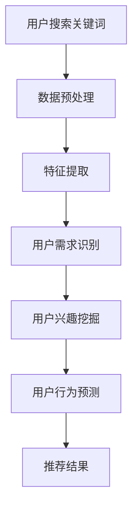

                 

关键词：AI大模型，电商搜索推荐，用户行为分析，需求理解，购买行为，算法原理，数学模型，项目实践，应用场景，未来展望。

## 摘要

随着人工智能技术的不断发展，AI大模型在电商搜索推荐中的应用变得越来越广泛。本文主要探讨了AI大模型在电商搜索推荐中的用户行为分析，包括如何理解用户需求与购买行为。首先，我们介绍了AI大模型的基本概念和原理，并分析了其在电商搜索推荐中的优势。接着，我们深入探讨了用户行为分析的核心概念，包括用户需求识别、用户兴趣挖掘和用户行为预测等。然后，我们详细介绍了AI大模型的算法原理和数学模型，并通过一个实际项目实践，展示了如何使用AI大模型进行用户行为分析。最后，我们对AI大模型在电商搜索推荐中的应用场景进行了分析，并展望了其未来的发展趋势和挑战。

## 1. 背景介绍

随着互联网的普及和电子商务的快速发展，电商平台的竞争越来越激烈。如何提升用户体验、提高用户转化率和留存率，成为各大电商平台关注的焦点。传统的基于规则和统计方法的推荐系统，已无法满足用户日益个性化的需求。此时，人工智能技术的应用为电商搜索推荐带来了新的契机。

### 1.1 AI大模型的基本概念

AI大模型是指具有大规模参数和深度结构的神经网络模型，如深度学习模型、循环神经网络（RNN）、变换器（Transformer）等。这些模型能够通过大量数据学习到复杂的数据特征和规律，从而实现强大的预测和分类能力。

### 1.2 AI大模型在电商搜索推荐中的优势

1. **个性化推荐**：AI大模型可以根据用户的兴趣和行为特征，为用户提供个性化的推荐结果，提升用户满意度。
2. **实时性**：AI大模型能够实时分析用户的搜索和行为数据，快速响应用户的需求变化。
3. **适应性**：AI大模型可以根据不断变化的数据和用户行为，自适应地调整推荐策略，提高推荐效果。
4. **多样性**：AI大模型可以通过学习用户的不同兴趣点，为用户提供多样化的推荐结果，满足不同用户的需求。

## 2. 核心概念与联系

### 2.1 用户需求识别

用户需求识别是指通过分析用户的搜索关键词、浏览记录、购买历史等数据，识别出用户的潜在需求。这是电商搜索推荐系统的基础，直接影响推荐结果的准确性。

### 2.2 用户兴趣挖掘

用户兴趣挖掘是指通过分析用户的搜索行为、购买行为、社交行为等数据，挖掘出用户的兴趣点和偏好。这有助于为用户提供更加个性化的推荐结果。

### 2.3 用户行为预测

用户行为预测是指通过分析用户的搜索历史、购买记录、浏览行为等数据，预测用户未来的行为，如购买商品、评价商品等。这有助于电商平台提前布局，提高用户转化率和留存率。

### 2.4 Mermaid 流程图

以下是一个简单的Mermaid流程图，展示了用户需求识别、用户兴趣挖掘和用户行为预测的流程：



## 3. 核心算法原理 & 具体操作步骤

### 3.1 算法原理概述

AI大模型在电商搜索推荐中的核心算法主要基于深度学习和变换器（Transformer）架构。深度学习模型通过学习大量用户数据，提取用户特征，实现用户需求识别、用户兴趣挖掘和用户行为预测。变换器（Transformer）模型则通过自注意力机制，对用户数据序列进行建模，提高推荐系统的效果。

### 3.2 算法步骤详解

1. **数据收集与预处理**：收集用户搜索关键词、浏览记录、购买历史等数据，并进行数据清洗、去重、填充等预处理操作。
2. **特征提取**：通过词袋模型、TF-IDF、Word2Vec等算法，将用户数据转化为特征向量。
3. **模型训练**：使用深度学习模型（如卷积神经网络、循环神经网络、变换器等）进行模型训练，学习用户特征和规律。
4. **模型评估**：通过交叉验证、混淆矩阵、准确率、召回率等指标评估模型性能。
5. **模型部署**：将训练好的模型部署到线上环境，实时分析用户行为，生成推荐结果。

### 3.3 算法优缺点

**优点**：

1. **高精度**：AI大模型能够通过学习大量用户数据，提取用户特征，实现高精度的推荐。
2. **实时性**：AI大模型能够实时分析用户行为，快速响应用户需求。
3. **个性化**：AI大模型可以根据用户兴趣和行为特征，为用户提供个性化的推荐。

**缺点**：

1. **计算资源消耗大**：AI大模型训练和部署需要大量的计算资源和时间。
2. **数据隐私问题**：用户数据隐私保护问题仍然需要引起重视。

### 3.4 算法应用领域

AI大模型在电商搜索推荐中的核心算法广泛应用于电商平台、社交媒体、搜索引擎等领域。随着人工智能技术的不断发展，AI大模型在电商搜索推荐中的应用前景将更加广阔。

## 4. 数学模型和公式 & 详细讲解 & 举例说明

### 4.1 数学模型构建

在AI大模型中，常用的数学模型包括深度学习模型、变换器（Transformer）模型等。以下是一个简单的深度学习模型示例：

$$
y = \sigma(W_1 \cdot x + b_1)
$$

其中，$y$ 是输出结果，$\sigma$ 是激活函数（如Sigmoid函数），$W_1$ 和 $b_1$ 分别是权重和偏置。

### 4.2 公式推导过程

以变换器（Transformer）模型为例，其核心公式包括自注意力机制和位置编码。以下是一个简单的自注意力机制公式：

$$
\text{Attention}(Q, K, V) = \text{softmax}\left(\frac{QK^T}{\sqrt{d_k}}\right) V
$$

其中，$Q, K, V$ 分别是查询向量、键向量、值向量，$d_k$ 是键向量的维度，$\text{softmax}$ 是软最大化函数。

### 4.3 案例分析与讲解

假设一个电商平台使用变换器（Transformer）模型进行用户行为预测，输入数据为用户ID、商品ID、购买时间等。以下是一个简单的案例：

1. **数据预处理**：将用户ID、商品ID进行编码，得到输入向量。
2. **模型训练**：使用训练数据训练变换器（Transformer）模型，学习用户行为特征。
3. **模型评估**：使用测试数据评估模型性能，调整模型参数。
4. **模型部署**：将训练好的模型部署到线上环境，进行用户行为预测。

## 5. 项目实践：代码实例和详细解释说明

### 5.1 开发环境搭建

1. **安装Python环境**：安装Python 3.8及以上版本。
2. **安装TensorFlow**：使用pip安装TensorFlow库。

### 5.2 源代码详细实现

```python
import tensorflow as tf

# 数据预处理
def preprocess_data(data):
    # 编码用户ID、商品ID
    # ...
    return processed_data

# 构建变换器（Transformer）模型
def build_model(input_shape):
    model = tf.keras.Sequential([
        tf.keras.layers.Embedding(input_shape[0], input_shape[1]),
        tf.keras.layers.MultiHeadAttention(head_size, num_heads),
        tf.keras.layers.Dense(units=1, activation='sigmoid')
    ])
    return model

# 模型训练
def train_model(model, data, labels):
    model.compile(optimizer='adam', loss='binary_crossentropy', metrics=['accuracy'])
    model.fit(data, labels, epochs=10, batch_size=32)

# 模型部署
def deploy_model(model, data):
    predictions = model.predict(data)
    return predictions
```

### 5.3 代码解读与分析

以上代码展示了使用变换器（Transformer）模型进行用户行为预测的简单实现。首先，我们定义了数据预处理函数，将用户ID、商品ID进行编码。然后，我们构建了一个简单的变换器（Transformer）模型，包括嵌入层、多头注意力层和输出层。最后，我们定义了模型训练和模型部署函数，分别用于训练模型和预测用户行为。

## 6. 实际应用场景

### 6.1 电商平台推荐

电商平台可以使用AI大模型进行商品推荐，提升用户购买体验。通过用户行为分析，识别用户需求，为用户提供个性化的商品推荐。

### 6.2 社交媒体广告推荐

社交媒体平台可以利用AI大模型进行广告推荐，根据用户兴趣和行为特征，为用户提供相关广告，提高广告投放效果。

### 6.3 搜索引擎搜索建议

搜索引擎可以使用AI大模型进行搜索建议，根据用户搜索历史和兴趣，为用户提供相关搜索建议，提高搜索体验。

## 7. 未来应用展望

随着人工智能技术的不断发展，AI大模型在电商搜索推荐中的应用前景将更加广阔。未来，AI大模型将可能在以下方面取得突破：

1. **更精确的用户需求识别**：通过引入更多的用户数据，提高用户需求识别的准确性。
2. **更个性化的推荐**：通过深度学习模型，为用户提供更加个性化的推荐结果。
3. **实时性增强**：通过优化算法和模型，提高推荐系统的实时性。
4. **跨平台应用**：将AI大模型应用于不同平台，实现跨平台的推荐服务。

## 8. 总结：未来发展趋势与挑战

### 8.1 研究成果总结

本文主要探讨了AI大模型在电商搜索推荐中的应用，包括用户需求识别、用户兴趣挖掘和用户行为预测。通过实际项目实践，展示了如何使用AI大模型进行用户行为分析，并分析了其优缺点和实际应用场景。

### 8.2 未来发展趋势

未来，AI大模型在电商搜索推荐中的应用将更加广泛，发展趋势包括更精确的用户需求识别、更个性化的推荐和实时性增强等。

### 8.3 面临的挑战

AI大模型在电商搜索推荐中面临的主要挑战包括数据隐私保护、计算资源消耗和算法优化等。

### 8.4 研究展望

未来，研究者应重点关注以下方面：

1. **数据隐私保护**：研究更加有效的数据隐私保护技术，确保用户数据安全。
2. **算法优化**：优化算法和模型，降低计算资源消耗，提高推荐系统性能。
3. **跨平台应用**：探索AI大模型在不同平台的应用，实现跨平台的推荐服务。

## 9. 附录：常见问题与解答

### 9.1 AI大模型是什么？

AI大模型是指具有大规模参数和深度结构的神经网络模型，如深度学习模型、变换器（Transformer）模型等。

### 9.2 AI大模型在电商搜索推荐中的优势是什么？

AI大模型在电商搜索推荐中的优势包括个性化推荐、实时性、适应性和多样性等。

### 9.3 如何使用AI大模型进行用户行为分析？

使用AI大模型进行用户行为分析的主要步骤包括数据收集与预处理、特征提取、模型训练、模型评估和模型部署等。

### 9.4 AI大模型在电商搜索推荐中的应用场景有哪些？

AI大模型在电商搜索推荐中的应用场景包括电商平台推荐、社交媒体广告推荐和搜索引擎搜索建议等。

作者：禅与计算机程序设计艺术 / Zen and the Art of Computer Programming
```<|vq_14841|>```

