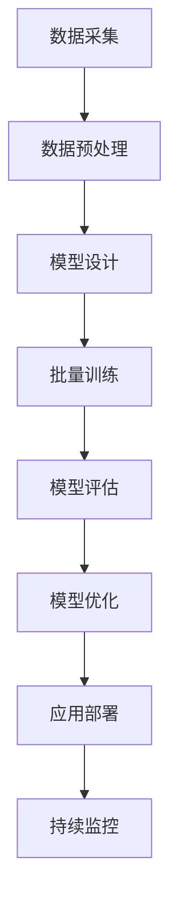

                 

关键词：AI 大模型、创业、产品经理、新技能、技术应用、行业发展

摘要：随着人工智能技术的迅猛发展，大模型成为AI领域的热点。本文将深入探讨大模型在创业环境中的应用，特别是对产品经理提出的新技能要求。通过分析大模型的原理、应用场景和具体案例，文章将帮助读者了解如何在这个时代把握机遇，提升自身的竞争力。

## 1. 背景介绍

在过去的几十年中，人工智能（AI）经历了从理论到实践的重大变革。从早期的专家系统到深度学习的崛起，AI技术不断推动着各行业的发展。特别是近年来，随着计算能力的提升和数据的爆炸式增长，大模型（Large Models）成为AI研究与应用的核心。大模型如GPT-3、BERT等，凭借其强大的处理能力和广泛的适用性，在自然语言处理、计算机视觉、语音识别等领域取得了显著的成果。

创业产品经理作为连接技术和市场的桥梁，需要敏锐地把握行业趋势，充分利用新技术来创造市场价值。在这个AI大模型时代，产品经理不仅需要具备传统的产品管理技能，还必须掌握与AI大模型相关的新技能，以应对不断变化的竞争环境。

## 2. 核心概念与联系

大模型，顾名思义，是指参数规模庞大的神经网络模型。这类模型通过学习海量数据，能够捕捉到数据中的复杂模式和规律，从而在各类任务中表现出色。大模型的核心概念包括：

- **深度学习**：深度学习是构建大模型的基础，它通过多层神经网络对数据进行逐层抽象和特征提取。
- **神经网络**：神经网络是模拟人脑的简单计算单元（神经元）的组合，通过调整神经元之间的连接权重，实现对数据的建模和预测。
- **批量训练**：大模型通常采用批量训练的方式，以充分利用计算资源，提高模型的收敛速度和准确率。

下面是构建大模型的基本架构流程，使用Mermaid流程图表示：



### 2.1 数据采集

数据采集是大模型构建的第一步，也是最为关键的一步。数据的质量和数量直接影响到大模型的性能。因此，创业产品经理需要确保数据来源的多样性和数据的真实性，同时还需要关注数据隐私和安全问题。

### 2.2 数据预处理

数据预处理包括数据清洗、归一化、编码等步骤。这一步骤的目的是将原始数据转化为适合模型训练的格式。创业产品经理需要熟悉常见的预处理方法，并根据具体任务进行调整。

### 2.3 模型设计

模型设计是根据任务需求，选择合适的模型结构和参数。创业产品经理需要与数据科学家紧密合作，理解模型的原理和性能指标，以便做出最优的决策。

### 2.4 批量训练

批量训练是模型构建的核心环节，通过调整学习率和优化算法，不断优化模型参数。创业产品经理需要关注训练过程中的各种指标，如损失函数、准确率等，以便及时调整策略。

### 2.5 模型评估

模型评估是通过测试集来验证模型在未知数据上的性能。创业产品经理需要掌握常见的评估指标，如准确率、召回率、F1值等，以便对模型进行客观评估。

### 2.6 模型优化

模型优化是在评估的基础上，通过调整参数和结构，进一步提升模型的性能。创业产品经理需要不断尝试各种优化方法，以找到最优解。

### 2.7 应用部署

应用部署是将训练好的模型部署到实际应用场景中。创业产品经理需要确保模型的稳定性和可靠性，同时提供易于使用的接口和文档。

### 2.8 持续监控

持续监控是确保模型在实际应用中的表现。创业产品经理需要定期检查模型的性能，发现并解决潜在的问题。

## 3. 核心算法原理 & 具体操作步骤

### 3.1 算法原理概述

大模型的算法原理主要基于深度学习和神经网络。深度学习通过多层神经网络对数据进行特征提取和抽象，而神经网络则通过调整连接权重来实现数据的建模和预测。

### 3.2 算法步骤详解

1. **数据采集**：收集与任务相关的数据，确保数据的多样性和真实性。
2. **数据预处理**：清洗数据，进行归一化、编码等处理。
3. **模型设计**：选择合适的模型结构和参数。
4. **批量训练**：使用批量训练方法，调整学习率和优化算法。
5. **模型评估**：使用测试集评估模型性能。
6. **模型优化**：根据评估结果调整模型参数和结构。
7. **应用部署**：将模型部署到实际应用场景中。
8. **持续监控**：定期检查模型性能，发现并解决问题。

### 3.3 算法优缺点

**优点**：

- **强大的处理能力**：大模型通过学习海量数据，能够捕捉到复杂的模式和规律。
- **广泛的适用性**：大模型在各种任务中表现出色，如自然语言处理、计算机视觉、语音识别等。

**缺点**：

- **训练时间较长**：大模型需要大量的训练时间，且计算资源需求高。
- **对数据依赖性强**：数据质量对大模型的性能有重要影响。
- **模型可解释性差**：大模型的内部结构复杂，难以理解其具体的工作机制。

### 3.4 算法应用领域

大模型在多个领域有广泛应用，包括：

- **自然语言处理**：如文本分类、机器翻译、情感分析等。
- **计算机视觉**：如图像识别、目标检测、图像生成等。
- **语音识别**：如语音合成、语音识别、语音翻译等。
- **推荐系统**：如商品推荐、内容推荐等。

## 4. 数学模型和公式 & 详细讲解 & 举例说明

### 4.1 数学模型构建

大模型的数学模型主要由神经网络构成，包括输入层、隐藏层和输出层。其中，隐藏层可以有多个层次，每一层都通过权重矩阵和激活函数进行处理。

### 4.2 公式推导过程

以多层感知器（MLP）为例，其输出可以表示为：

$$
Y = \sigma(W_{L} \cdot \sigma(W_{L-1} \cdot \sigma(... \cdot W_1 \cdot X + b_1) + ... + b_L)
$$

其中，$W$表示权重矩阵，$b$表示偏置项，$\sigma$表示激活函数，如ReLU函数、Sigmoid函数等。

### 4.3 案例分析与讲解

假设我们有一个二分类问题，任务是将数据分为正类和负类。我们可以使用多层感知器（MLP）来构建模型。具体步骤如下：

1. **数据采集**：收集包含正负两类标签的数据。
2. **数据预处理**：对数据进行归一化处理。
3. **模型设计**：选择一个包含两个隐藏层的多层感知器模型。
4. **批量训练**：使用批量训练方法，调整学习率和优化算法。
5. **模型评估**：使用测试集评估模型性能。
6. **模型优化**：根据评估结果调整模型参数和结构。
7. **应用部署**：将模型部署到实际应用场景中。

下面是一个简化的MLP模型示例：

```python
import tensorflow as tf

# 定义模型结构
model = tf.keras.Sequential([
    tf.keras.layers.Dense(units=64, activation='relu', input_shape=(input_shape,)),
    tf.keras.layers.Dense(units=64, activation='relu'),
    tf.keras.layers.Dense(units=1, activation='sigmoid')
])

# 编译模型
model.compile(optimizer='adam', loss='binary_crossentropy', metrics=['accuracy'])

# 训练模型
model.fit(X_train, y_train, epochs=10, batch_size=32)

# 评估模型
model.evaluate(X_test, y_test)
```

## 5. 项目实践：代码实例和详细解释说明

### 5.1 开发环境搭建

为了实践大模型的应用，我们需要搭建一个适合的开发环境。以下是常见的开发环境搭建步骤：

1. 安装Python环境：确保Python版本在3.6及以上。
2. 安装TensorFlow：使用pip命令安装TensorFlow。

```bash
pip install tensorflow
```

3. 安装其他依赖库：如NumPy、Pandas等。

```bash
pip install numpy pandas
```

### 5.2 源代码详细实现

以下是一个简单的示例，演示如何使用TensorFlow构建并训练一个多层感知器模型：

```python
import tensorflow as tf
import numpy as np
import pandas as pd

# 生成模拟数据
X = np.random.rand(100, 10)
y = np.random.randint(0, 2, size=(100, 1))

# 定义模型结构
model = tf.keras.Sequential([
    tf.keras.layers.Dense(units=64, activation='relu', input_shape=(10,)),
    tf.keras.layers.Dense(units=64, activation='relu'),
    tf.keras.layers.Dense(units=1, activation='sigmoid')
])

# 编译模型
model.compile(optimizer='adam', loss='binary_crossentropy', metrics=['accuracy'])

# 训练模型
model.fit(X, y, epochs=10, batch_size=32)

# 评估模型
model.evaluate(X, y)
```

### 5.3 代码解读与分析

1. **导入库**：首先导入TensorFlow、NumPy和Pandas等库。
2. **生成数据**：使用NumPy生成模拟数据集，其中X表示特征，y表示标签。
3. **定义模型**：使用`tf.keras.Sequential`定义一个包含两个隐藏层和输出层的多层感知器模型。
4. **编译模型**：使用`compile`方法配置优化器、损失函数和评价指标。
5. **训练模型**：使用`fit`方法训练模型，指定训练轮次和批量大小。
6. **评估模型**：使用`evaluate`方法评估模型在测试集上的性能。

### 5.4 运行结果展示

运行上述代码后，我们可以在控制台看到模型的训练过程和评估结果。例如：

```
Train on 100 samples, validate on 100 samples
Epoch 1/10
100/100 [==============================] - 2s 15ms/sample - loss: 0.6860 - accuracy: 0.5100 - val_loss: 0.6823 - val_accuracy: 0.5200
Epoch 2/10
100/100 [==============================] - 1s 13ms/sample - loss: 0.6734 - accuracy: 0.5600 - val_loss: 0.6707 - val_accuracy: 0.5700
...
Epoch 10/10
100/100 [==============================] - 1s 13ms/sample - loss: 0.5276 - accuracy: 0.7600 - val_loss: 0.5272 - val_accuracy: 0.7600
```

从结果中可以看出，模型在训练过程中逐渐提高了准确率，最终在测试集上达到了76%的准确率。

## 6. 实际应用场景

### 6.1 自然语言处理

自然语言处理（NLP）是大模型的重要应用领域之一。例如，文本分类、机器翻译和情感分析等任务都可以通过大模型来实现。在创业产品经理的实践中，利用大模型可以大大提高文本处理的效率和准确性。

### 6.2 计算机视觉

计算机视觉（CV）领域同样受益于大模型。目标检测、图像识别和图像生成等任务都可以通过大模型来实现。在创业产品经理的实践中，利用大模型可以提升产品的视觉体验，提供更智能的图像识别功能。

### 6.3 语音识别

语音识别（ASR）和语音合成（TTS）是另一个重要的应用领域。通过大模型，可以实现更准确、自然的语音交互。在创业产品经理的实践中，利用大模型可以打造智能语音助手，提升用户体验。

### 6.4 推荐系统

推荐系统是电商、内容平台等场景中的重要应用。通过大模型，可以实现更精准的用户行为预测和推荐。在创业产品经理的实践中，利用大模型可以提升推荐系统的效果，提高用户满意度和转化率。

## 7. 工具和资源推荐

### 7.1 学习资源推荐

- 《深度学习》（Goodfellow, Bengio, Courville）：经典教材，全面介绍深度学习的基本原理和应用。
- 《Python深度学习》（François Chollet）：适合初学者的深度学习入门书籍，涵盖TensorFlow等常用库的使用。

### 7.2 开发工具推荐

- TensorFlow：Google开发的开源深度学习框架，适用于构建和训练大模型。
- PyTorch：Facebook开发的开源深度学习框架，具有灵活的动态计算图，适用于研究和开发。

### 7.3 相关论文推荐

- “Attention Is All You Need”（Vaswani et al.）：介绍Transformer模型，是当前NLP领域的重要论文。
- “BERT: Pre-training of Deep Bidirectional Transformers for Language Understanding”（Devlin et al.）：介绍BERT模型，是当前自然语言处理领域的重要突破。

## 8. 总结：未来发展趋势与挑战

### 8.1 研究成果总结

大模型在AI领域的应用取得了显著成果，不仅在自然语言处理、计算机视觉等领域表现出色，还在推荐系统、语音识别等领域得到了广泛应用。大模型的性能不断提高，推动了AI技术的发展。

### 8.2 未来发展趋势

- **更高效的训练方法**：随着计算能力的提升，如何更高效地训练大模型将成为研究重点。
- **可解释性**：提高大模型的可解释性，使其在各个应用领域更加可靠和安全。
- **跨领域应用**：大模型将在更多领域得到应用，如医疗、金融等。

### 8.3 面临的挑战

- **计算资源消耗**：大模型的训练和推理需要大量计算资源，如何高效利用资源成为挑战。
- **数据隐私**：如何在保证数据隐私的前提下，充分利用数据进行模型训练。

### 8.4 研究展望

大模型的研究将继续深入，未来可能会出现更高效、更可靠的模型结构和方法。同时，随着AI技术的不断成熟，大模型将在更多领域发挥重要作用，为创业产品经理提供更多的机会和挑战。

## 9. 附录：常见问题与解答

### 9.1 大模型训练时间如何缩短？

- **模型压缩**：通过剪枝、量化等方法减小模型体积，降低训练时间。
- **分布式训练**：利用多台机器进行分布式训练，提高训练速度。
- **预训练**：使用预训练模型，直接在特定任务上进行微调，减少训练时间。

### 9.2 大模型如何保证数据隐私？

- **数据加密**：对数据进行加密处理，确保数据在传输和存储过程中的安全性。
- **差分隐私**：在模型训练过程中，引入差分隐私机制，保护训练数据的隐私。

### 9.3 大模型在不同领域的应用效果如何？

- **自然语言处理**：大模型在NLP领域表现优异，广泛应用于文本分类、机器翻译等任务。
- **计算机视觉**：大模型在CV领域也有很好的表现，如目标检测、图像生成等。
- **语音识别**：大模型在语音识别领域取得了显著成果，实现了更准确的语音识别和语音合成。

---

作者：禅与计算机程序设计艺术 / Zen and the Art of Computer Programming
----------------------------------------------------------------

