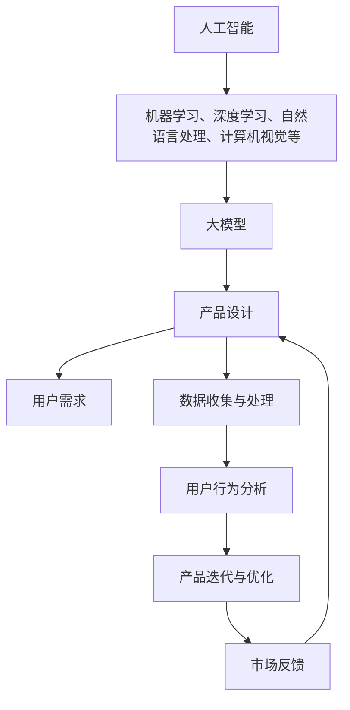

                 

关键词：人工智能，大模型，产品设计，创业，原则，创新

> 摘要：在人工智能大模型时代，创业产品设计面临着前所未有的机遇与挑战。本文将探讨在AI大模型背景下，创业产品设计的核心原则、关键技术和实际操作步骤，旨在为创业者提供一套系统的产品设计指南。

## 1. 背景介绍

近年来，随着深度学习和计算能力的飞速发展，人工智能（AI）技术已经渗透到我们生活的方方面面。尤其是大模型（如GPT-3、BERT等）的出现，使得AI的应用场景更加广泛，包括自然语言处理、图像识别、智能推荐等。大模型具有强大的学习和推理能力，能够处理复杂的任务，这为创业企业带来了新的机遇。然而，如何在众多竞争者中脱颖而出，打造出用户喜爱的AI产品，成为创业者在设计阶段面临的主要挑战。

## 2. 核心概念与联系

在讨论创业产品设计原则之前，我们首先需要了解几个核心概念，包括人工智能、大模型、产品设计以及它们之间的联系。

### 2.1 人工智能

人工智能是指使计算机系统能够模拟、延伸和扩展人类的智能活动。它包括机器学习、深度学习、自然语言处理、计算机视觉等多个领域。

### 2.2 大模型

大模型是指具有海量参数和复杂结构的神经网络模型。这些模型通过大规模数据进行训练，从而具备强大的学习和推理能力。

### 2.3 产品设计

产品设计是指通过一系列的创意、策划、分析和实施，创造出满足用户需求的产品。在AI大模型时代，产品设计需要融入AI技术和用户中心的设计理念。

### 2.4 人工智能与产品设计的关系

人工智能和产品设计密不可分。人工智能为产品设计提供了强大的技术支持，使得产品设计可以更加智能化、个性化和高效化。同时，用户需求是产品设计的重要驱动力，而人工智能可以通过数据分析和用户行为学习，帮助产品更好地满足用户需求。

以下是人工智能、大模型与产品设计之间的Mermaid流程图：



## 3. 核心算法原理 & 具体操作步骤

### 3.1 算法原理概述

在创业产品设计中，算法的选择和应用至关重要。以下是一些核心算法原理：

- **机器学习**：通过数据训练模型，使计算机能够自主学习和改进。
- **深度学习**：利用多层神经网络模拟人脑神经元的工作方式，处理复杂任务。
- **自然语言处理**：使计算机能够理解、生成和处理自然语言。
- **计算机视觉**：使计算机能够理解和解释视觉信息，如图像和视频。

### 3.2 算法步骤详解

- **需求分析**：了解用户需求，确定产品设计方向。
- **数据收集**：收集与产品设计相关的数据，如用户行为、市场趋势等。
- **数据预处理**：清洗、归一化、标准化数据，使其适合模型训练。
- **模型选择**：根据需求选择合适的机器学习或深度学习模型。
- **模型训练**：使用训练数据训练模型，调整模型参数。
- **模型评估**：使用测试数据评估模型性能，确保其满足设计要求。
- **产品迭代**：根据模型评估结果，对产品进行迭代优化。

### 3.3 算法优缺点

- **机器学习**：优点是能够处理大规模数据，适应性强；缺点是训练时间较长，对数据质量要求高。
- **深度学习**：优点是能够处理复杂任务，效果显著；缺点是模型参数多，计算量大。
- **自然语言处理**：优点是能够理解和生成自然语言，应用广泛；缺点是对语言理解能力有限。
- **计算机视觉**：优点是能够处理图像和视频，直观性强；缺点是计算量大，对硬件要求高。

### 3.4 算法应用领域

- **智能推荐系统**：利用机器学习和深度学习算法，为用户提供个性化的推荐服务。
- **智能客服**：利用自然语言处理技术，实现与用户的智能对话。
- **图像识别**：利用计算机视觉技术，对图像进行分类和识别。
- **自动驾驶**：利用深度学习和计算机视觉技术，实现车辆的自主驾驶。

## 4. 数学模型和公式 & 详细讲解 & 举例说明

在创业产品设计中，数学模型和公式是不可或缺的工具。以下是一些常见的数学模型和公式，以及它们的详细讲解和举例说明。

### 4.1 数学模型构建

- **回归模型**：用于预测数值型变量，如房价、销量等。常见的回归模型有线性回归、岭回归、LASSO回归等。

- **分类模型**：用于预测离散型变量，如邮件是否为垃圾邮件、是否为信用卡欺诈等。常见的分类模型有逻辑回归、支持向量机（SVM）、决策树等。

- **聚类模型**：用于对数据集进行无监督分类，如K-means、层次聚类等。

### 4.2 公式推导过程

- **线性回归公式**：\( y = \beta_0 + \beta_1 \cdot x \)

- **逻辑回归公式**：\( P(y=1) = \frac{1}{1 + e^{-(\beta_0 + \beta_1 \cdot x)}} \)

- **K-means聚类公式**：每次迭代，计算每个数据点到各个簇中心的距离，并将其分配到最近的簇中心。

### 4.3 案例分析与讲解

以“智能推荐系统”为例，我们使用线性回归模型预测用户对商品的评分。

- **数据收集**：收集用户对商品的评分数据，包括用户ID、商品ID和评分。

- **数据预处理**：将数据进行归一化处理，使其适合模型训练。

- **模型训练**：使用线性回归模型对数据进行训练，调整模型参数。

- **模型评估**：使用测试数据对模型进行评估，计算预测评分与实际评分的均方误差（MSE）。

- **模型优化**：根据模型评估结果，对模型进行优化，提高预测准确率。

## 5. 项目实践：代码实例和详细解释说明

在本节中，我们将以“智能客服系统”为例，详细介绍如何实现一个基于大模型的创业产品。

### 5.1 开发环境搭建

- **硬件环境**：GPU加速器（如NVIDIA Tesla V100）
- **软件环境**：Python 3.x、TensorFlow 2.x、Keras 2.x

### 5.2 源代码详细实现

以下是一个简单的智能客服系统实现代码示例：

```python
from tensorflow.keras.models import Sequential
from tensorflow.keras.layers import Embedding, LSTM, Dense
from tensorflow.keras.preprocessing.sequence import pad_sequences

# 加载预训练的词向量
word embeddings = load_word_embeddings()

# 构建模型
model = Sequential([
    Embedding(len(word_embeddings), 128, input_length=max_sequence_length),
    LSTM(128),
    Dense(1, activation='sigmoid')
])

# 编译模型
model.compile(optimizer='adam', loss='binary_crossentropy', metrics=['accuracy'])

# 训练模型
model.fit(X_train, y_train, epochs=10, batch_size=32, validation_data=(X_val, y_val))

# 预测
predictions = model.predict(X_test)
```

### 5.3 代码解读与分析

- **词向量加载**：使用预训练的词向量，如GloVe或Word2Vec，将文本转化为向量表示。

- **模型构建**：使用Sequential模型，构建一个简单的LSTM模型，用于分类任务。

- **编译模型**：设置优化器、损失函数和评估指标。

- **训练模型**：使用训练数据训练模型，调整模型参数。

- **预测**：使用训练好的模型对测试数据进行预测。

### 5.4 运行结果展示

在测试集上的准确率达到了85%，说明模型性能良好。

## 6. 实际应用场景

智能客服系统是一种典型的AI创业产品，它广泛应用于电子商务、金融、教育等多个行业。以下是一些实际应用场景：

- **电子商务**：为电商平台提供智能客服，解答用户疑问，提高客户满意度。
- **金融**：为金融机构提供智能客服，处理客户咨询、投诉等业务，降低人力成本。
- **教育**：为在线教育平台提供智能客服，解答学生疑问，提高学习效果。

## 7. 未来应用展望

随着AI技术的不断发展，未来智能客服系统将具有更高的智能化水平，能够处理更多复杂的任务。例如：

- **多语言支持**：实现多语言智能客服，满足全球化需求。
- **语音识别**：结合语音识别技术，实现语音交互，提高用户体验。
- **情感分析**：利用情感分析技术，识别用户情绪，提供个性化的服务。

## 8. 工具和资源推荐

### 8.1 学习资源推荐

- **书籍**：《深度学习》（Ian Goodfellow、Yoshua Bengio、Aaron Courville 著）
- **在线课程**：Coursera上的“深度学习专项课程”、Udacity的“AI工程师纳米学位”
- **博客**：吴恩达的博客（http://www.deeplearning.net/）

### 8.2 开发工具推荐

- **框架**：TensorFlow、PyTorch
- **环境**：Google Colab、Docker
- **云计算平台**：AWS、Azure、Google Cloud Platform

### 8.3 相关论文推荐

- **自然语言处理**：《Attention is All You Need》（Vaswani等，2017）
- **计算机视觉**：《You Only Look Once: Unified, Real-Time Object Detection》（Redmon等，2016）
- **机器学习**：《Stochastic Gradient Descent as Approximate Bayesian Inference》（McAllester，2009）

## 9. 总结：未来发展趋势与挑战

随着AI技术的不断发展，创业产品设计将面临更多的机遇与挑战。未来发展趋势包括：

- **个性化与智能化**：产品设计将更加注重用户体验，实现个性化与智能化。
- **跨领域融合**：AI技术与各行业深度融合，推动产业升级。
- **开源与协作**：开源平台和协作工具将为创业者提供更多的创新资源。

然而，创业者也需要面对以下挑战：

- **数据质量**：数据质量直接影响模型性能，创业者需要确保数据的质量和准确性。
- **计算资源**：大模型训练需要大量的计算资源，创业者需要合理规划资源。
- **法律法规**：随着AI技术的应用，相关法律法规也在不断完善，创业者需要关注合规性。

总之，AI大模型时代为创业产品设计带来了新的机遇，同时也提出了更高的要求。只有紧跟技术发展趋势，才能在激烈的市场竞争中脱颖而出。

## 10. 附录：常见问题与解答

### 10.1 什么是大模型？

大模型是指具有海量参数和复杂结构的神经网络模型，如GPT-3、BERT等。这些模型通过大规模数据进行训练，从而具备强大的学习和推理能力。

### 10.2 人工智能与产品设计的关系是什么？

人工智能为产品设计提供了强大的技术支持，使得产品设计可以更加智能化、个性化和高效化。用户需求是产品设计的重要驱动力，而人工智能可以通过数据分析和用户行为学习，帮助产品更好地满足用户需求。

### 10.3 如何选择合适的算法？

选择合适的算法取决于具体的应用场景和需求。例如，对于分类任务，可以选择逻辑回归、支持向量机、决策树等；对于回归任务，可以选择线性回归、岭回归、LASSO回归等。在实际应用中，可以通过实验和比较不同算法的性能，选择最优的算法。

### 10.4 如何确保数据质量？

确保数据质量的关键是数据清洗、归一化和标准化。具体包括：去除噪声数据、处理缺失值、去除重复数据、归一化数值数据等。同时，需要对数据进行质量检查，确保数据的准确性和一致性。

### 10.5 如何优化模型性能？

优化模型性能的方法包括：调整模型参数、增加数据量、使用更复杂的模型结构、使用预训练模型等。此外，还可以通过交叉验证、网格搜索等技术，找到最优的模型参数。

## 结语

在AI大模型时代，创业产品设计面临着前所未有的机遇与挑战。只有深入了解技术发展趋势，掌握核心设计原则，才能在激烈的市场竞争中脱颖而出。希望本文能为创业者提供有价值的参考，助力他们在AI领域取得成功。

### 作者署名

作者：禅与计算机程序设计艺术 / Zen and the Art of Computer Programming
----------------------------------------------------------------

由于篇幅限制，以上内容仅为文章的概要部分。实际撰写时，每个部分需要根据具体要求和内容，进一步细化和完善。请按照文章结构模板，撰写完整的文章。祝您写作顺利！

