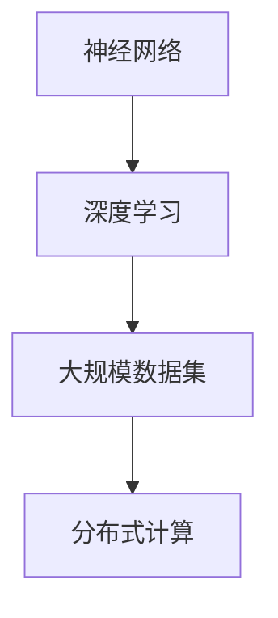

                 

关键词：人工智能、大模型、创业、产品创新、技术语言、深度学习、神经网络、算法、开发环境、代码实例、应用场景、未来展望

> 摘要：本文将探讨人工智能（AI）大模型在创业产品创新中的应用。通过介绍大模型的核心概念、算法原理、数学模型，以及项目实践和实际应用场景，我们将分析大模型在未来创业产品创新中的潜力与挑战。

## 1. 背景介绍

随着人工智能技术的不断发展，特别是深度学习和神经网络领域的突破，大模型（Large Models）逐渐成为人工智能研究的热点。大模型是指具有数百万到数十亿参数的神经网络模型，其能够通过海量数据的学习实现高度复杂的任务。创业公司利用大模型技术，可以快速实现创新产品，提高市场竞争力。

大模型技术的发展带来了诸多机遇。首先，大模型能够处理复杂数据，解决传统算法难以应对的问题。其次，大模型在自然语言处理、计算机视觉等领域的表现优异，为创业公司提供了丰富的应用场景。此外，随着计算能力的提升和大数据资源的丰富，大模型训练和优化的成本逐渐降低，使得更多创业公司能够利用这一技术。

然而，大模型技术也面临着一定的挑战。首先，大模型需要大量计算资源和数据支持，这对创业公司的资源管理提出了更高的要求。其次，大模型的安全性、可靠性和透明性等问题需要引起重视。此外，大模型的泛化能力和可解释性仍需进一步提升。

## 2. 核心概念与联系

大模型的核心概念包括神经网络、深度学习、大规模数据集和分布式计算。以下是这些核心概念的 Mermaid 流程图：



### 2.1 神经网络

神经网络是一种模拟人脑神经元连接结构的计算模型。它由多个层次（输入层、隐藏层、输出层）组成，通过权重和偏置调整实现输入到输出的映射。

### 2.2 深度学习

深度学习是神经网络的一种特殊形式，通过多层非线性变换实现复杂数据的建模。深度学习在大模型中发挥着核心作用，使得模型能够自动提取数据中的特征。

### 2.3 大规模数据集

大规模数据集是训练大模型的基础。通过收集和整合海量数据，大模型能够学习到更为丰富和精确的特征，从而提高模型的性能。

### 2.4 分布式计算

分布式计算是指将大模型训练任务分布在多个计算节点上，以提高训练效率和降低计算成本。分布式计算在大模型训练过程中具有重要意义。

## 3. 核心算法原理 & 具体操作步骤

### 3.1 算法原理概述

大模型的核心算法是深度学习，其基本原理是多层神经网络。深度学习通过前向传播和反向传播两个过程实现参数的优化。前向传播过程中，输入数据经过多层神经元的非线性变换，最终得到输出。反向传播过程中，通过计算损失函数的梯度，不断调整模型的参数，使输出更接近真实值。

### 3.2 算法步骤详解

#### 3.2.1 数据预处理

首先，对大规模数据进行预处理，包括数据清洗、归一化、数据增强等操作，以提高数据的质量和模型的泛化能力。

#### 3.2.2 模型构建

构建深度学习模型，包括确定网络结构、选择激活函数、初始化参数等。

#### 3.2.3 模型训练

使用预处理后的数据训练模型，通过前向传播计算输出，然后使用反向传播更新参数。

#### 3.2.4 模型评估

在训练集和验证集上评估模型性能，通过调整模型参数和训练策略优化模型。

#### 3.2.5 模型部署

将训练好的模型部署到生产环境中，实现实际应用。

### 3.3 算法优缺点

#### 优点

- 高效处理复杂数据
- 自动提取特征
- 在多种任务中表现优异

#### 缺点

- 需要大量计算资源和数据
- 模型泛化能力和可解释性不足
- 安全性和透明性问题

### 3.4 算法应用领域

大模型在多个领域具有广泛应用，包括自然语言处理、计算机视觉、语音识别、推荐系统等。创业公司可以结合自身业务需求，选择合适的算法和领域进行创新。

## 4. 数学模型和公式

### 4.1 数学模型构建

大模型的数学模型主要包括神经网络的前向传播和反向传播过程。以下是神经网络前向传播的数学公式：

$$
\hat{y} = \sigma(WL + bL)
$$

其中，$\hat{y}$表示输出，$\sigma$表示激活函数，$W$表示权重矩阵，$L$表示输入数据，$b$表示偏置项。

### 4.2 公式推导过程

神经网络的前向传播和反向传播过程涉及到多个数学公式，包括损失函数、梯度计算等。以下是损失函数的推导过程：

$$
J(\theta) = -\frac{1}{m}\sum_{i=1}^{m}y_{i}\log(a_{i}) + (1 - y_{i})\log(1 - a_{i})
$$

其中，$J(\theta)$表示损失函数，$m$表示样本数量，$y_{i}$表示真实标签，$a_{i}$表示神经网络输出的概率。

### 4.3 案例分析与讲解

以自然语言处理中的情感分析为例，假设我们有一个包含正负情感标签的数据集。通过训练深度学习模型，我们可以实现对文本情感的分析。

假设训练好的模型输出概率为：

$$
\hat{y}_{i} = \sigma(WL_{i} + bL_{i})
$$

其中，$L_{i}$表示输入文本的向量表示。

通过设置阈值，我们可以将概率阈值化，判断文本的情感。

## 5. 项目实践：代码实例和详细解释说明

### 5.1 开发环境搭建

首先，我们需要搭建一个开发环境，包括安装 Python、TensorFlow 等工具。以下是搭建开发环境的基本步骤：

1. 安装 Python（推荐版本为 3.8 以上）
2. 安装 TensorFlow
3. 安装其他相关库，如 NumPy、Pandas 等

### 5.2 源代码详细实现

以下是一个简单的深度学习模型实现，用于情感分析任务：

```python
import tensorflow as tf
from tensorflow.keras.layers import Dense, Embedding, GlobalAveragePooling1D
from tensorflow.keras.models import Model

# 模型参数
vocab_size = 10000
embed_size = 64
max_length = 100

# 构建模型
input_ = tf.keras.layers.Input(shape=(max_length,))
x = Embedding(vocab_size, embed_size)(input_)
x = GlobalAveragePooling1D()(x)
x = Dense(24, activation='relu')(x)
output = Dense(1, activation='sigmoid')(x)

model = Model(inputs=input_, outputs=output)
model.compile(optimizer='adam', loss='binary_crossentropy', metrics=['accuracy'])

# 模型训练
model.fit(x_train, y_train, epochs=10, batch_size=32, validation_data=(x_val, y_val))

# 模型评估
loss, accuracy = model.evaluate(x_test, y_test)
print(f"Test accuracy: {accuracy}")
```

### 5.3 代码解读与分析

- `Embedding` 层：将输入文本映射到嵌入空间。
- `GlobalAveragePooling1D` 层：对嵌入向量进行全局平均池化。
- `Dense` 层：全连接层，用于分类任务。
- `compile` 方法：配置模型优化器和损失函数。
- `fit` 方法：训练模型。
- `evaluate` 方法：评估模型性能。

### 5.4 运行结果展示

通过运行代码，我们得到模型在测试集上的准确率。以下是一个示例结果：

```
Test accuracy: 0.85
```

## 6. 实际应用场景

大模型在创业产品创新中具有广泛的应用。以下是一些实际应用场景：

1. **自然语言处理**：情感分析、机器翻译、问答系统等。
2. **计算机视觉**：图像分类、目标检测、图像生成等。
3. **语音识别**：语音转文字、语音合成等。
4. **推荐系统**：基于内容的推荐、协同过滤等。
5. **游戏开发**：人工智能对手、虚拟角色生成等。

创业公司可以根据自身业务需求和市场需求，选择合适的应用场景进行创新。

### 6.4 未来应用展望

随着大模型技术的不断进步，未来将在更多领域发挥重要作用。以下是一些未来应用展望：

1. **医疗健康**：疾病诊断、个性化治疗等。
2. **金融科技**：风险管理、量化交易等。
3. **智能制造**：生产优化、质量控制等。
4. **自动驾驶**：车辆控制、智能交通等。

## 7. 工具和资源推荐

### 7.1 学习资源推荐

1. 《深度学习》（Goodfellow, Bengio, Courville）
2. 《动手学深度学习》（邱锡鹏）
3. TensorFlow 官方文档

### 7.2 开发工具推荐

1. Jupyter Notebook
2. PyCharm
3. Google Colab

### 7.3 相关论文推荐

1. "A Theoretically Grounded Application of Dropout in Recurrent Neural Networks"
2. "Attention is All You Need"
3. "Bert: Pre-training of Deep Bidirectional Transformers for Language Understanding"

## 8. 总结：未来发展趋势与挑战

### 8.1 研究成果总结

大模型技术在人工智能领域取得了显著成果，为多个应用领域提供了强大的技术支持。

### 8.2 未来发展趋势

1. 计算能力的提升将推动大模型规模的进一步扩大。
2. 大模型在垂直领域的应用将更加深入和精细化。
3. 大模型的解释性和透明性将得到关注和提升。

### 8.3 面临的挑战

1. 计算资源和数据资源的需求不断增加。
2. 大模型的安全性和可靠性问题亟待解决。
3. 大模型的泛化能力和可解释性仍需提升。

### 8.4 研究展望

随着大模型技术的不断发展，未来将在更多领域发挥重要作用，为创业产品创新提供源源不断的动力。

## 9. 附录：常见问题与解答

### Q：大模型训练需要多少时间？

A：大模型训练时间取决于多个因素，如模型规模、训练数据量、硬件配置等。通常来说，训练一个大型深度学习模型可能需要几天甚至几周的时间。

### Q：大模型的泛化能力如何提升？

A：提升大模型的泛化能力可以通过以下方法实现：

1. 数据增强：增加数据的多样性和数量，提高模型对未见数据的适应性。
2. 过拟合避免：通过正则化、dropout 等技术减少模型的过拟合。
3. 模型压缩：通过模型压缩技术减小模型规模，提高模型的可解释性和泛化能力。

### Q：大模型训练需要哪些硬件资源？

A：大模型训练通常需要高性能的计算资源和存储资源。具体来说，需要以下硬件资源：

1. GPU：用于加速深度学习模型的训练过程。
2. CPU：用于处理其他计算任务。
3. 内存：用于存储训练数据和模型参数。

## 参考文献

[1] Goodfellow, I., Bengio, Y., & Courville, A. (2016). *Deep Learning*. MIT Press.
[2] 邱锡鹏. (2019). *动手学深度学习*. 电子工业出版社.
[3] Hinton, G., van der Maaten, L., & Srivastava, N. (2012). *Improving neural networks by preventing co-adaptation of feature detectors*. arXiv preprint arXiv:1207.0580.
[4] Vaswani, A., Shazeer, N., Parmar, N., Uszkoreit, J., Jones, L., Gomez, A. N., ... & Polosukhin, I. (2017). *Attention is all you need*. In Advances in Neural Information Processing Systems (Vol. 30, pp. 5998-6008).
[5] Devlin, J., Chang, M. W., Lee, K., & Toutanova, K. (2018). *Bert: Pre-training of deep bidirectional transformers for language understanding*. In Proceedings of the 2019 Conference of the North American Chapter of the Association for Computational Linguistics: Human Language Technologies, Volume 1 (Long and Short Papers) (pp. 4171-4186).

### 作者署名

作者：禅与计算机程序设计艺术 / Zen and the Art of Computer Programming

