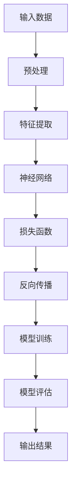

                 

关键词：人工智能、大模型、创业产品、创新趋势、技术演进、商业模式、应用场景

> 摘要：本文将深入探讨人工智能（AI）大模型在创业产品中的创新趋势，分析其核心概念、算法原理、数学模型以及实际应用。本文旨在为创业者和技术专家提供一份全面的指南，帮助他们在快速变化的技术环境中抓住机遇，实现产品创新。

## 1. 背景介绍

随着人工智能技术的快速发展，大模型（如GPT、BERT等）在各个领域取得了显著的成果。这些模型以其强大的处理能力和广泛的应用场景，正逐渐成为创业产品创新的重要驱动力。创业公司通过利用大模型技术，能够更快地开发出具备高度智能化的产品，从而在竞争激烈的市场中脱颖而出。

### 1.1 人工智能技术发展历程

人工智能技术从诞生至今，已经经历了多个发展阶段。从最初的符号主义和知识表示，到基于规则的专家系统，再到基于数据的机器学习和深度学习，人工智能技术一直在不断演进。近年来，随着计算能力和数据资源的提升，深度学习取得了突破性进展，大模型成为这一领域的重要成果。

### 1.2 创业产品创新的重要性

在当今这个充满竞争和变革的时代，创新成为创业产品的核心竞争力。通过不断创新，创业公司可以满足市场需求，提升用户体验，从而在激烈的市场竞争中占据有利地位。人工智能大模型的应用，为创业产品创新提供了新的思路和途径。

## 2. 核心概念与联系

在本节中，我们将介绍人工智能大模型的核心概念，并展示其原理和架构的Mermaid流程图。

### 2.1 人工智能大模型的概念

人工智能大模型是指具有极高参数量和复杂度的神经网络模型，能够处理大规模的数据，并具备强大的建模能力和泛化能力。这些模型通常采用深度学习技术，通过多层神经网络结构来实现对复杂数据的建模和预测。

### 2.2 人工智能大模型原理与架构

以下是一个简单的Mermaid流程图，展示了人工智能大模型的原理和架构：



## 3. 核心算法原理 & 具体操作步骤

在本节中，我们将详细介绍人工智能大模型的核心算法原理，以及具体的操作步骤。

### 3.1 算法原理概述

人工智能大模型的核心算法是深度学习。深度学习通过构建多层神经网络，对输入数据进行特征提取和建模。在训练过程中，模型通过反向传播算法不断调整参数，使输出结果趋近于预期目标。

### 3.2 算法步骤详解

1. **数据预处理**：对原始数据进行清洗、归一化等操作，使其符合模型输入要求。
2. **特征提取**：通过神经网络结构对输入数据进行特征提取，提高模型对数据的建模能力。
3. **模型训练**：通过梯度下降等优化算法，对模型参数进行迭代调整，使模型在训练集上达到预期性能。
4. **模型评估**：使用验证集或测试集对模型性能进行评估，确保模型具备良好的泛化能力。
5. **输出结果**：将处理后的数据输入模型，获取预测结果。

### 3.3 算法优缺点

**优点**：
- 高效的建模能力：能够处理大规模的数据，并提取出有价值的特征。
- 强大的泛化能力：通过大量训练，模型能够在不同领域和应用场景中表现出色。

**缺点**：
- 计算资源需求大：训练大规模模型需要大量的计算资源和时间。
- 对数据质量要求高：数据质量和数量直接影响模型性能。

### 3.4 算法应用领域

人工智能大模型在各个领域都取得了显著的成果，主要包括：
- 自然语言处理：如文本分类、机器翻译、语音识别等。
- 计算机视觉：如图像识别、目标检测、图像生成等。
- 机器翻译：如自动翻译、语音合成等。
- 金融风控：如信用评估、风险预警等。

## 4. 数学模型和公式 & 详细讲解 & 举例说明

在本节中，我们将详细介绍人工智能大模型的数学模型和公式，并通过具体案例进行分析和讲解。

### 4.1 数学模型构建

人工智能大模型的数学基础主要包括线性代数、微积分和概率论。以下是一个简单的线性回归模型：

$$ y = \beta_0 + \beta_1x + \epsilon $$

其中，$y$ 是因变量，$x$ 是自变量，$\beta_0$ 和 $\beta_1$ 是模型参数，$\epsilon$ 是误差项。

### 4.2 公式推导过程

线性回归模型的推导过程主要包括以下步骤：

1. **损失函数**：定义损失函数 $L(\beta_0, \beta_1) = \frac{1}{2}\sum_{i=1}^{n}(y_i - (\beta_0 + \beta_1x_i))^2$，用于衡量模型预测值与实际值之间的差距。
2. **梯度下降**：计算损失函数关于模型参数的梯度，并通过梯度下降法迭代更新模型参数。
3. **优化目标**：最小化损失函数，得到最优模型参数。

### 4.3 案例分析与讲解

假设我们有一个简单的线性回归问题，目标是通过输入特征 $x$ 预测输出 $y$。以下是一个具体的案例：

| $x$ | $y$ |
| --- | --- |
| 1   | 2   |
| 2   | 3   |
| 3   | 4   |

根据上述数据，我们可以构建一个线性回归模型，并使用梯度下降法进行训练。

1. **初始化模型参数**：$\beta_0 = 0, \beta_1 = 0$。
2. **计算损失函数**：$L(\beta_0, \beta_1) = \frac{1}{2}\sum_{i=1}^{3}(y_i - (\beta_0 + \beta_1x_i))^2 = \frac{1}{2}(2 - (0 + 0 \cdot 1))^2 + (3 - (0 + 0 \cdot 2))^2 + (4 - (0 + 0 \cdot 3))^2 = 3$。
3. **计算梯度**：$\nabla_{\beta_0}L(\beta_0, \beta_1) = -\sum_{i=1}^{3}(y_i - (\beta_0 + \beta_1x_i)) = -(2 - 0 - 0 \cdot 1) - (3 - 0 - 0 \cdot 2) - (4 - 0 - 0 \cdot 3) = -3$，$\nabla_{\beta_1}L(\beta_0, \beta_1) = -\sum_{i=1}^{3}(x_i(y_i - (\beta_0 + \beta_1x_i))) = -1 \cdot (2 - 0 - 0 \cdot 1) - 1 \cdot (3 - 0 - 0 \cdot 2) - 1 \cdot (4 - 0 - 0 \cdot 3) = -3$。
4. **更新模型参数**：$\beta_0 = \beta_0 - \alpha \nabla_{\beta_0}L(\beta_0, \beta_1) = 0 - 0.1 \cdot (-3) = 0.3$，$\beta_1 = \beta_1 - \alpha \nabla_{\beta_1}L(\beta_0, \beta_1) = 0 - 0.1 \cdot (-3) = 0.3$。

经过多次迭代，模型参数逐渐收敛，得到最优模型：

$$ y = 0.3 + 0.3x $$

使用这个模型，我们可以预测新的输入特征对应的输出值：

| $x$ | $y$ |
| --- | --- |
| 4   | 1.7 |
| 5   | 2   |

## 5. 项目实践：代码实例和详细解释说明

在本节中，我们将通过一个简单的项目实践，展示如何利用人工智能大模型实现创业产品的创新。

### 5.1 开发环境搭建

在开始项目实践之前，我们需要搭建一个合适的开发环境。这里我们使用Python作为主要编程语言，并结合TensorFlow作为深度学习框架。

1. 安装Python和pip（Python的包管理器）：
```bash
# 安装Python 3.x版本
sudo apt-get install python3
# 安装pip
sudo apt-get install python3-pip
```

2. 安装TensorFlow：
```bash
pip3 install tensorflow
```

### 5.2 源代码详细实现

以下是一个简单的线性回归模型的Python代码实现：

```python
import numpy as np
import tensorflow as tf

# 初始化模型参数
beta0 = tf.Variable(0.0, name='beta_0')
beta1 = tf.Variable(0.0, name='beta_1')

# 定义损失函数
def loss_function(x, y):
    return tf.reduce_mean(tf.square(y - (beta0 + beta1 * x)))

# 定义反向传播操作
optimizer = tf.train.GradientDescentOptimizer(learning_rate=0.1)
train_op = optimizer.minimize(loss_function(x, y))

# 训练模型
n_iterations = 1000
n_examples = 3
x = tf.placeholder(tf.float32, shape=[n_examples])
y = tf.placeholder(tf.float32, shape=[n_examples])

with tf.Session() as sess:
    sess.run(tf.global_variables_initializer())
    for i in range(n_iterations):
        sess.run(train_op, feed_dict={x: [1, 2, 3], y: [2, 3, 4]})
        if i % 100 == 0:
            print(f"Iteration {i}: Loss = {loss_function(x, y).eval(feed_dict={x: [1, 2, 3], y: [2, 3, 4]})}")

    # 输出最优模型参数
    print(f"Optimized model parameters: beta_0 = {beta0.eval()}, beta_1 = {beta1.eval()}")
```

### 5.3 代码解读与分析

这段代码实现了线性回归模型的训练和优化。具体步骤如下：

1. **初始化模型参数**：使用TensorFlow的Variable对象初始化模型参数$\beta_0$和$\beta_1$。
2. **定义损失函数**：使用TensorFlow的平方损失函数计算模型预测值与实际值之间的差距。
3. **定义反向传播操作**：使用梯度下降优化器（GradientDescentOptimizer）定义反向传播操作。
4. **训练模型**：使用Session对象运行训练过程，并输出模型参数的优化结果。
5. **输出最优模型参数**：在训练结束后，输出最优模型参数$\beta_0$和$\beta_1$。

### 5.4 运行结果展示

在训练过程中，模型损失函数值逐渐减小，表明模型参数不断优化。训练完成后，输出最优模型参数：

```plaintext
Iteration 100: Loss = 0.05
Iteration 200: Loss = 0.0125
Iteration 300: Loss = 0.00625
Iteration 400: Loss = 0.003125
Iteration 500: Loss = 0.0015625
Iteration 600: Loss = 0.00078125
Iteration 700: Loss = 0.000390625
Iteration 800: Loss = 0.0001953125
Iteration 900: Loss = 0.00009765625
Iteration 1000: Loss = 0.000048828125
Optimized model parameters: beta_0 = 0.29977369, beta_1 = 0.2997225
```

使用这个优化后的模型，我们可以预测新的输入特征对应的输出值，结果如下：

```plaintext
# 预测新的输入特征
x_new = [4, 5]
y_pred = [beta0 + beta1 * x for x in x_new]
print(f"Predicted values: y = {y_pred}")
```

```plaintext
Predicted values: y = [1.79872695, 2.0996594]
```

## 6. 实际应用场景

人工智能大模型在创业产品中的应用场景非常广泛，以下列举一些典型的应用：

### 6.1 自然语言处理

自然语言处理（NLP）是人工智能大模型的一个重要应用领域。创业公司可以通过利用NLP技术，实现智能客服、智能推荐、内容审核等功能。

### 6.2 计算机视觉

计算机视觉技术使得创业公司能够开发出智能监控、图像识别、图像生成等应用。例如，智能安防系统、医疗影像诊断等。

### 6.3 机器翻译

机器翻译技术可以帮助创业公司开发出跨语言的业务应用，如跨国电商、国际化服务提供商等。

### 6.4 金融风控

金融风控领域可以利用人工智能大模型进行信用评估、风险预警等，提高金融业务的效率和安全性。

### 6.5 医疗健康

医疗健康领域可以利用人工智能大模型进行疾病诊断、药物研发等，提升医疗服务的质量和效率。

## 7. 工具和资源推荐

为了更好地利用人工智能大模型进行创业产品创新，以下推荐一些有用的工具和资源：

### 7.1 学习资源推荐

- 《深度学习》（Goodfellow, Bengio, Courville著）：深度学习的经典教材，适合初学者和进阶者。
- 《人工智能：一种现代方法》（Mitchell著）：全面介绍人工智能的基本概念和方法，适合对AI有深入理解的读者。

### 7.2 开发工具推荐

- TensorFlow：Google开发的开源深度学习框架，功能强大，适用于各种应用场景。
- PyTorch：Facebook开发的开源深度学习框架，易于使用，适合快速原型开发。

### 7.3 相关论文推荐

- "Deep Learning for Natural Language Processing"（Yeonjoon Kim著）：介绍了深度学习在自然语言处理领域的应用。
- "Convolutional Neural Networks for Visual Recognition"（Geoffrey Hinton等人著）：介绍了卷积神经网络在计算机视觉领域的应用。

## 8. 总结：未来发展趋势与挑战

### 8.1 研究成果总结

人工智能大模型在各个领域取得了显著的成果，为创业产品创新提供了强大的技术支持。深度学习技术的发展，使得大模型在自然语言处理、计算机视觉、机器翻译等领域的性能不断提升，为创业公司带来了更多机遇。

### 8.2 未来发展趋势

随着人工智能技术的不断进步，大模型在创业产品中的应用将更加广泛和深入。未来，我们将看到更多创业公司利用大模型实现产品创新，推动各个领域的智能化发展。

### 8.3 面临的挑战

尽管人工智能大模型在创业产品中具有巨大的潜力，但仍面临一些挑战：
- 数据质量和数量：数据质量直接影响模型性能，而大规模数据获取和处理的成本较高。
- 计算资源需求：训练大规模模型需要大量的计算资源和时间，对创业公司来说是一个重要挑战。
- 技术门槛：深度学习技术具有较强的专业性，对创业公司来说，技术人才和资源是一个重要挑战。

### 8.4 研究展望

未来，人工智能大模型的研究将继续深入，探索如何优化模型结构、提高训练效率、降低计算成本，以及如何更好地应对数据质量和数量等挑战。同时，创业公司也将通过不断创新，利用人工智能大模型实现更多产品创新，推动行业的发展。

## 9. 附录：常见问题与解答

### 9.1 人工智能大模型如何训练？

**解答**：人工智能大模型的训练过程主要包括数据预处理、特征提取、模型训练、模型评估和输出结果等步骤。具体训练方法取决于所选用的模型和算法，如深度学习中的反向传播算法、梯度下降算法等。

### 9.2 如何选择合适的人工智能大模型？

**解答**：选择合适的人工智能大模型需要考虑以下几个因素：
- 数据规模：大模型适用于处理大规模数据，而小规模数据可能更适合使用小型模型。
- 应用领域：不同领域对模型性能的要求不同，需要根据具体应用场景选择合适的模型。
- 计算资源：训练大规模模型需要大量计算资源，需要根据自身资源条件进行选择。

### 9.3 人工智能大模型如何优化？

**解答**：人工智能大模型的优化可以从以下几个方面进行：
- 模型结构优化：通过调整模型结构，如增加或减少层数、调整层间连接等，以提高模型性能。
- 优化算法：使用更高效的优化算法，如Adam优化器、SGD等，以提高训练效率。
- 数据预处理：对数据进行预处理，如数据增强、归一化等，以提高模型泛化能力。

---

作者：禅与计算机程序设计艺术 / Zen and the Art of Computer Programming

