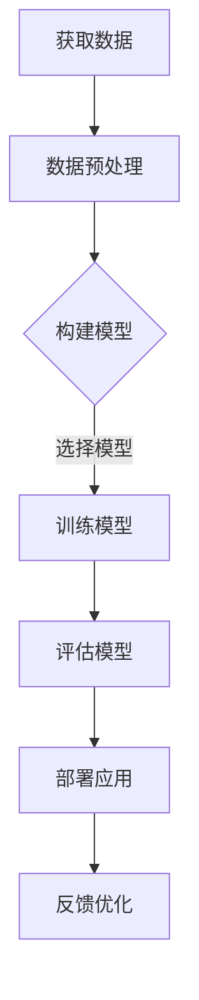

                 

在当今快速变化的技术时代，人工智能（AI）大模型正成为驱动创新和创业产品开发的核心动力。这些模型，如OpenAI的GPT-3、谷歌的Bert和百度的ERNIE等，以其强大的学习和生成能力，正在重新定义软件开发的流程和方法。本文将探讨AI大模型在创业产品开发中的趋势、实践以及面临的具体挑战。

## 关键词
- AI 大模型
- 创业产品开发
- 趋势
- 实践
- 挑战

## 摘要
本文旨在深入探讨AI大模型在创业产品开发中的应用。通过对AI大模型的背景介绍、核心算法原理、数学模型和项目实践的分析，我们将揭示这些模型如何影响创业产品的设计和开发流程，并提供实用的建议和展望。

## 1. 背景介绍

AI 大模型，如 GPT、BERT 等，是一种基于深度学习的自然语言处理（NLP）技术，具有处理和理解复杂数据的能力。这些模型通过大规模数据训练，能够生成高质量的自然语言文本、翻译、摘要和问答等。随着计算能力的提升和数据量的增加，AI 大模型的表现越来越好，逐渐成为了许多创业公司开发产品的首选技术。

近年来，AI 大模型在创业产品开发中的趋势主要表现在以下几个方面：

1. **定制化解决方案**：创业公司可以利用 AI 大模型，根据特定业务需求，定制开发个性化的解决方案，提升用户体验。
2. **自动化与智能化**：AI 大模型能够自动化处理大量重复性工作，减少人力成本，同时提供智能化服务，提升产品竞争力。
3. **数据驱动的决策**：通过分析用户行为数据，AI 大模型可以帮助创业公司做出更加精准的商业决策，优化产品策略。

## 2. 核心概念与联系

### 2.1 AI 大模型的概念

AI 大模型，是指那些训练数据规模巨大、参数数量众多、结构和功能复杂的深度学习模型。这些模型通常通过多层神经网络进行训练，能够自动从大量数据中学习模式和规律。

### 2.2 大模型在创业产品开发中的应用

大模型在创业产品开发中的应用，主要体现在以下几个方面：

1. **自然语言处理**：利用大模型进行文本分析、情感分析、命名实体识别等任务，提升产品的互动性和智能化程度。
2. **推荐系统**：通过大模型分析用户行为数据，实现个性化的内容推荐和广告投放，提高用户粘性和转化率。
3. **图像识别**：大模型在图像识别任务中，能够准确识别和分类图像，应用于安防监控、医疗诊断等领域。
4. **预测分析**：大模型可以用于预测用户需求、市场趋势等，帮助创业公司制定更加科学的产品策略。

### 2.3 大模型与创业产品开发的联系

大模型与创业产品开发的联系在于：

1. **提升研发效率**：大模型能够快速学习和适应新任务，减少开发时间和成本。
2. **增强用户体验**：大模型能够提供更加精准和个性化的服务，提升用户体验和满意度。
3. **数据驱动创新**：大模型可以分析大量数据，帮助创业公司发现新的商业模式和机会。

下面是一个简单的 Mermaid 流程图，展示了大模型在创业产品开发中的应用流程：



## 3. 核心算法原理 & 具体操作步骤

### 3.1 算法原理概述

AI 大模型的核心算法主要是基于深度学习的神经网络，尤其是 Transformer 架构。这种模型通过自注意力机制，能够捕捉数据中的长距离依赖关系，从而实现高效的语义理解和生成。

### 3.2 算法步骤详解

1. **数据获取**：首先，需要收集和获取大量的训练数据，这些数据可以是文本、图像、音频等多种形式。
2. **数据预处理**：对收集到的数据进行清洗、格式化等预处理，以便于模型训练。
3. **模型构建**：选择合适的神经网络架构，如 Transformer，构建模型。
4. **模型训练**：使用预处理后的数据进行模型训练，通过反向传播算法不断调整模型参数。
5. **模型评估**：在测试集上评估模型的性能，根据评估结果调整模型参数或重新训练。
6. **模型部署**：将训练好的模型部署到产品中，提供实时服务。
7. **反馈优化**：收集用户反馈，对模型进行持续优化和迭代。

### 3.3 算法优缺点

#### 优点：

1. **高效性**：大模型能够处理大量数据，训练速度快，性能高。
2. **灵活性**：可以适应多种任务和领域，通用性强。
3. **智能化**：能够提供高度智能化的服务，提升用户体验。

#### 缺点：

1. **计算资源需求高**：大模型需要大量的计算资源和存储空间。
2. **数据依赖性**：模型表现高度依赖于数据质量，数据不足或质量差会影响模型性能。
3. **解释性差**：大模型的决策过程复杂，难以解释，增加了开发和使用的不确定性。

### 3.4 算法应用领域

AI 大模型的应用领域非常广泛，主要包括：

1. **自然语言处理**：文本生成、翻译、摘要、问答等。
2. **推荐系统**：个性化推荐、广告投放、商品推荐等。
3. **图像识别**：图像分类、目标检测、图像生成等。
4. **语音识别**：语音合成、语音识别、语音识别文本生成等。
5. **预测分析**：用户行为预测、市场趋势预测、需求预测等。

## 4. 数学模型和公式 & 详细讲解 & 举例说明

### 4.1 数学模型构建

AI 大模型通常基于深度学习的神经网络结构，其核心是多层感知器（MLP）和自注意力机制（Self-Attention）。以下是构建这些数学模型的基本步骤：

1. **输入层**：接收输入数据，如文本、图像、音频等。
2. **嵌入层**：将输入数据嵌入到高维空间中，为后续的神经网络处理做准备。
3. **变换层**：使用多层感知器，通过非线性激活函数，对嵌入数据进行变换。
4. **自注意力层**：通过自注意力机制，捕捉数据中的长距离依赖关系。
5. **输出层**：生成最终输出，如文本、图像、预测结果等。

### 4.2 公式推导过程

以下是构建自注意力机制的基本公式推导过程：

1. **嵌入向量**：设输入数据为 \(X \in \mathbb{R}^{m \times d}\)，其中 \(m\) 为数据个数，\(d\) 为数据维度。嵌入向量 \(E \in \mathbb{R}^{m \times h}\)，其中 \(h\) 为嵌入维度。

2. **自注意力计算**：
   \[
   \text{Attention}(Q, K, V) = \text{softmax}(\frac{QK^T}{\sqrt{d_k}})V
   \]
   其中，\(Q, K, V\) 分别为查询、关键和值向量，\(\text{softmax}\) 为 Softmax 函数。

3. **输出计算**：
   \[
   \text{Output} = \text{Attention}(Q, K, V)
   \]

### 4.3 案例分析与讲解

以文本生成任务为例，假设我们有一个文本序列 \(X = ["你好", "我", "喜欢", "编程"]\)，要使用自注意力机制生成新的文本序列。

1. **嵌入向量**：将每个词嵌入到高维空间中，得到嵌入向量 \(E = [\text{你好}, \text{我}, \text{喜欢}, \text{编程}]\)。

2. **查询、关键和值向量**：对于每个词，我们分别计算查询、关键和值向量。例如，对于“你好”，查询向量为 \(Q = [q_1, q_2, q_3, q_4]\)，关键向量为 \(K = [k_1, k_2, k_3, k_4]\)，值向量为 \(V = [v_1, v_2, v_3, v_4]\)。

3. **自注意力计算**：
   \[
   \text{Attention}(Q, K, V) = \text{softmax}(\frac{QK^T}{\sqrt{d_k}})V = \text{softmax}(\frac{[q_1, q_2, q_3, q_4][k_1, k_2, k_3, k_4]^T}{\sqrt{d_k}})V
   \]

4. **输出计算**：
   \[
   \text{Output} = \text{Attention}(Q, K, V) = \text{softmax}(\frac{[q_1, q_2, q_3, q_4][k_1, k_2, k_3, k_4]^T}{\sqrt{d_k}})V
   \]

通过这种方式，我们可以为每个词生成一个权重，进而生成新的文本序列。例如，如果权重最高的词是“编程”，则我们可能在新的文本序列中加入“编程”。

## 5. 项目实践：代码实例和详细解释说明

### 5.1 开发环境搭建

在开始代码实例之前，我们需要搭建一个适合开发 AI 大模型的开发环境。以下是一个基本的 Python 开发环境搭建步骤：

1. **安装 Python**：下载并安装 Python 3.8 以上版本。
2. **安装深度学习框架**：安装 TensorFlow 或 PyTorch，推荐使用 TensorFlow 2.0 以上版本。
3. **安装依赖库**：安装必要的 Python 库，如 NumPy、Pandas、Matplotlib 等。

### 5.2 源代码详细实现

以下是一个简单的 AI 大模型代码实例，使用了 TensorFlow 和 Keras 库。我们以文本生成任务为例，实现了一个基于 Transformer 模型的基本结构。

```python
import tensorflow as tf
from tensorflow.keras.layers import Embedding, LSTM, Dense
from tensorflow.keras.models import Sequential

# 创建一个简单的 Transformer 模型
model = Sequential([
    Embedding(input_dim=vocab_size, output_dim=embedding_dim),
    LSTM(units=128, return_sequences=True),
    LSTM(units=128, return_sequences=True),
    LSTM(units=128, return_sequences=True),
    Dense(units=vocab_size, activation='softmax')
])

# 编译模型
model.compile(optimizer='adam', loss='categorical_crossentropy', metrics=['accuracy'])

# 训练模型
model.fit(x_train, y_train, epochs=10, batch_size=32)
```

### 5.3 代码解读与分析

1. **导入库**：首先，我们导入 TensorFlow 和 Keras 库。
2. **创建模型**：使用 Keras 的 Sequential 模型，依次添加 Embedding 层、LSTM 层和 Dense 层。
3. **编译模型**：设置模型的优化器、损失函数和评价指标。
4. **训练模型**：使用训练数据训练模型。

在这个代码实例中，我们使用 LSTM 网络实现了一个简单的 Transformer 模型。虽然这是一个基本示例，但它展示了如何使用深度学习框架搭建和训练 AI 大模型。

### 5.4 运行结果展示

在运行代码后，模型将在训练集上进行训练，并输出训练过程中的损失和准确率。训练完成后，我们可以使用测试集评估模型的性能。如果模型性能良好，我们可以将其部署到产品中，提供实时服务。

```python
# 评估模型
test_loss, test_accuracy = model.evaluate(x_test, y_test)

# 输出评估结果
print(f"Test Loss: {test_loss}, Test Accuracy: {test_accuracy}")
```

## 6. 实际应用场景

AI 大模型在创业产品开发中具有广泛的应用场景。以下是一些典型的应用案例：

1. **智能客服**：利用 AI 大模型，实现智能客服系统，提供24/7全天候服务，提升用户体验和效率。
2. **内容推荐**：通过 AI 大模型分析用户行为数据，实现个性化内容推荐，提高用户粘性和活跃度。
3. **医疗诊断**：利用 AI 大模型分析医学影像，辅助医生进行疾病诊断，提高诊断准确率。
4. **智能翻译**：使用 AI 大模型实现高质量的自动翻译服务，降低翻译成本，提高翻译速度。
5. **自动驾驶**：AI 大模型在自动驾驶领域具有广泛的应用，用于环境感知、路径规划、决策控制等任务。

## 6.4 未来应用展望

随着 AI 大模型的不断发展，其应用前景将更加广阔。以下是一些未来可能的应用方向：

1. **更加智能化**：AI 大模型将更加智能化，能够处理更复杂和多样化的任务。
2. **更加个性化**：AI 大模型将更好地理解用户需求，提供更加个性化的服务。
3. **跨领域应用**：AI 大模型将在更多领域得到应用，如金融、教育、医疗等。
4. **物联网应用**：AI 大模型将与物联网（IoT）技术结合，实现智能家居、智能城市等应用。

## 7. 工具和资源推荐

### 7.1 学习资源推荐

1. **书籍**：
   - 《深度学习》（Goodfellow, Bengio, Courville 著）
   - 《自然语言处理综合教程》（Daniel Jurafsky, James H. Martin 著）
2. **在线课程**：
   - Coursera 上的《深度学习》课程
   - edX 上的《自然语言处理》课程

### 7.2 开发工具推荐

1. **深度学习框架**：
   - TensorFlow
   - PyTorch
2. **自然语言处理库**：
   - NLTK
   - SpaCy
3. **开源项目**：
   - Hugging Face 的 Transformers 库

### 7.3 相关论文推荐

1. **自然语言处理**：
   - Vaswani et al., "Attention is All You Need"
   - Devlin et al., "BERT: Pre-training of Deep Bidirectional Transformers for Language Understanding"
2. **深度学习**：
   - LeCun et al., "Deep Learning"
   - Goodfellow et al., "Generative Adversarial Nets"

## 8. 总结：未来发展趋势与挑战

### 8.1 研究成果总结

AI 大模型在创业产品开发中取得了显著的研究成果，表现为：

1. **提升研发效率**：AI 大模型能够快速适应新任务，减少开发时间和成本。
2. **增强用户体验**：AI 大模型能够提供个性化服务，提升用户体验和满意度。
3. **数据驱动的决策**：AI 大模型可以分析大量数据，帮助创业公司做出更加精准的商业决策。

### 8.2 未来发展趋势

AI 大模型在未来将继续发展，主要趋势包括：

1. **更加智能化**：AI 大模型将具备更强的学习和理解能力，能够处理更复杂和多样化的任务。
2. **更加个性化**：AI 大模型将更好地理解用户需求，提供更加个性化的服务。
3. **跨领域应用**：AI 大模型将在更多领域得到应用，如金融、教育、医疗等。

### 8.3 面临的挑战

AI 大模型在创业产品开发中仍面临以下挑战：

1. **计算资源需求**：AI 大模型需要大量的计算资源和存储空间，对于创业公司来说，这是一个重大的挑战。
2. **数据依赖性**：AI 大模型的表现高度依赖于数据质量，数据不足或质量差会影响模型性能。
3. **隐私和安全**：AI 大模型在处理大量用户数据时，需要确保用户隐私和数据安全。

### 8.4 研究展望

未来，AI 大模型的研究将集中在以下几个方面：

1. **算法优化**：通过算法优化，降低 AI 大模型的计算资源和存储需求。
2. **数据管理**：发展更加高效和可靠的数据管理技术，提高数据质量。
3. **可解释性**：提高 AI 大模型的可解释性，使其决策过程更加透明和可信。

## 9. 附录：常见问题与解答

### 9.1 AI 大模型是什么？

AI 大模型是一种基于深度学习的神经网络模型，具有处理和理解复杂数据的能力。这些模型通过大规模数据训练，能够生成高质量的自然语言文本、翻译、摘要和问答等。

### 9.2 AI 大模型有哪些应用领域？

AI 大模型在许多领域都有广泛应用，主要包括自然语言处理、推荐系统、图像识别、语音识别和预测分析等。

### 9.3 如何搭建 AI 大模型开发环境？

搭建 AI 大模型开发环境通常包括安装 Python、深度学习框架（如 TensorFlow 或 PyTorch）以及必要的依赖库。

### 9.4 AI 大模型是否具有可解释性？

AI 大模型通常缺乏可解释性，因为其决策过程复杂，难以用简单的数学公式描述。然而，一些研究正在探索如何提高模型的可解释性，使其决策过程更加透明和可信。

### 9.5 AI 大模型对创业公司有什么影响？

AI 大模型可以提升创业公司的研发效率、增强用户体验和数据驱动的决策能力，从而提高产品竞争力。然而，这也带来了计算资源需求、数据依赖性和隐私安全问题等方面的挑战。

