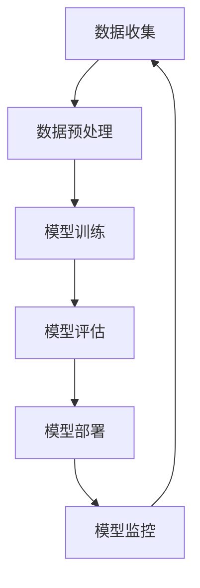

                 

## 1. 背景介绍

在当今快速变化的技术环境中，创业公司面临着前所未有的机遇和挑战。随着人工智能（AI）技术的不断进步，特别是大型模型（Large-scale Models）的崛起，创业公司可以通过利用这些先进技术来实现前所未有的创新和增长。本文旨在探讨如何利用AI大模型来驱动创业产品设计，并分析其在实际应用中的趋势和实践。

AI大模型是指具有巨大参数量、能够处理海量数据的深度学习模型。这些模型可以通过从大量数据中学习，获取广泛的知识和技能，从而在多个领域实现卓越的性能。近年来，得益于计算能力的提升和数据规模的扩大，AI大模型取得了显著的进展，并在图像识别、自然语言处理、语音识别等领域取得了突破性成果。

创业公司通常资源有限，需要在有限的时间内快速推出有竞争力的产品。AI大模型的应用为创业公司提供了一种有效的解决方案。首先，AI大模型可以加速产品的开发周期，降低开发成本。其次，通过利用这些模型，创业公司可以提供更加个性化、智能化的产品体验，从而在激烈的市场竞争中脱颖而出。此外，AI大模型还可以为创业公司提供数据洞察，帮助他们更好地了解用户需求和市场趋势，从而做出更明智的商业决策。

然而，尽管AI大模型具有巨大潜力，但其实际应用仍然面临诸多挑战。例如，如何有效训练和部署这些模型、如何确保模型的安全性和隐私性、如何平衡模型性能和可解释性等。这些问题都需要创业公司在设计和实施AI驱动的创业产品时进行深入考虑。

本文将首先介绍AI大模型的基本概念和原理，然后分析其在创业产品设计中的应用趋势和实践。通过具体案例和实例，我们将探讨如何利用AI大模型来优化产品设计过程，提高产品质量和用户体验。此外，本文还将讨论AI大模型在实际应用中面临的挑战和解决策略，以及未来发展的趋势和方向。希望本文能够为创业公司在利用AI大模型进行产品创新提供有益的参考和启示。

## 2. 核心概念与联系

### 2.1 AI大模型的基本概念

人工智能（AI）大模型是近年来深度学习领域的重要进展之一。它们具有以下几个核心特征：

1. **大规模参数**：AI大模型通常包含数亿到数千亿的参数，这使得它们能够捕捉到更复杂的数据模式。
2. **海量数据训练**：这些模型需要使用大量数据来训练，以确保它们能够泛化到未知数据上。
3. **计算资源需求**：大模型训练和推理通常需要强大的计算能力和大量的存储资源。
4. **自主学习能力**：通过深度学习，大模型可以从数据中自主学习，提取特征，进行预测和决策。

### 2.2 AI大模型的应用领域

AI大模型的应用领域非常广泛，包括但不限于以下几个：

1. **图像识别**：大模型在图像识别任务中表现出了卓越的性能，可以用于人脸识别、物体检测和图像生成等。
2. **自然语言处理（NLP）**：在NLP领域，大模型如GPT-3和BERT已经成为文本生成、机器翻译和情感分析的重要工具。
3. **语音识别**：大模型在语音识别任务中也取得了显著进展，可以实现高精度的语音到文本转换。
4. **推荐系统**：大模型可以通过学习用户行为数据，为用户提供个性化的推荐。
5. **医疗诊断**：大模型在医疗领域也有广泛应用，例如用于疾病预测和诊断。

### 2.3 AI大模型与创业产品设计的关系

AI大模型在创业产品设计中的应用具有重要意义。以下是其几个关键作用：

1. **加速开发周期**：AI大模型可以自动化很多繁杂的任务，如数据预处理和特征提取，从而显著缩短产品的开发周期。
2. **提高产品质量**：通过利用大模型，创业公司可以提供更加精准和智能的产品功能，从而提升用户体验。
3. **个性化服务**：大模型可以基于用户数据提供个性化的服务，满足不同用户的需求，从而增加用户粘性和忠诚度。
4. **数据洞察**：大模型可以分析大量用户数据，为创业公司提供有价值的市场洞察和商业决策支持。

### 2.4 大模型架构的Mermaid流程图

下面是AI大模型的基本架构及其关键组件的Mermaid流程图：



- **数据收集**：从各种来源收集原始数据。
- **数据预处理**：清洗和转换数据，使其适合模型训练。
- **模型训练**：使用大规模数据进行模型训练。
- **模型评估**：评估模型在测试数据上的性能。
- **模型部署**：将训练好的模型部署到生产环境中。
- **模型监控**：监控模型在生产环境中的性能和稳定性。

通过这个流程，创业公司可以系统地利用AI大模型进行产品设计和优化。

### 2.5 大模型在不同领域的应用实例

以下是AI大模型在不同领域的具体应用实例：

- **图像识别**：在医疗影像分析中，AI大模型可以用于自动检测癌症等疾病。例如，Google的DeepMind开发了一个名为Inception模型的AI系统，能够以接近医生的水平检测眼部疾病。
- **自然语言处理**：OpenAI的GPT-3模型被广泛应用于聊天机器人、内容生成和问答系统。例如，Duolingo使用GPT-3为语言学习者提供个性化的学习建议和互动。
- **语音识别**：微软的语音识别系统通过利用AI大模型，可以实现高精度的语音识别和翻译。例如，微软的Azure认知服务提供了基于大模型的语音识别API。
- **推荐系统**：亚马逊和Netflix等公司使用AI大模型来为用户提供个性化的商品和内容推荐。例如，亚马逊的推荐系统通过分析用户的购物历史和浏览行为，提供个性化的购物建议。
- **医疗诊断**：AI大模型在医疗领域的应用也日益广泛。例如，IBM的Watson for Oncology系统使用AI大模型帮助医生进行癌症诊断和治疗建议。

这些应用实例展示了AI大模型在不同领域的潜力和价值，为创业公司提供了丰富的实践参考。

## 3. 核心算法原理 & 具体操作步骤

### 3.1 算法原理概述

AI大模型的算法原理主要基于深度学习和神经网络。深度学习是一种通过模拟人脑神经网络进行学习的技术，通过多层的神经元结构对数据进行特征提取和模式识别。神经网络由输入层、隐藏层和输出层组成，每层神经元通过激活函数进行信息传递和处理。

AI大模型通常采用如下几个关键技术：

1. **卷积神经网络（CNN）**：主要用于图像识别和处理，通过卷积层对图像进行特征提取。
2. **循环神经网络（RNN）**：适用于序列数据，如时间序列分析和自然语言处理，通过循环结构捕捉序列中的依赖关系。
3. **Transformer模型**：由Google提出，适用于自然语言处理，通过自注意力机制实现全局信息交互。
4. **预训练+微调**：通过在大规模数据集上预训练模型，然后在特定任务上微调，提高模型的泛化能力。

### 3.2 算法步骤详解

以下是AI大模型的基本算法步骤：

1. **数据收集**：从各种来源收集原始数据，如图像、文本、音频等。
2. **数据预处理**：对原始数据进行清洗、归一化、编码等处理，使其适合模型训练。
3. **模型设计**：根据任务需求设计神经网络结构，选择适当的网络层、激活函数和损失函数。
4. **模型训练**：使用大规模数据进行模型训练，通过反向传播算法不断调整模型参数，最小化损失函数。
5. **模型评估**：在测试数据上评估模型性能，选择性能最优的模型。
6. **模型部署**：将训练好的模型部署到生产环境中，进行实际任务处理。
7. **模型监控**：监控模型在生产环境中的性能和稳定性，必要时进行模型更新和优化。

### 3.3 算法优缺点

**优点**：

1. **强大泛化能力**：通过大规模数据训练，大模型能够学习到更广泛的知识和技能，具有强大的泛化能力。
2. **高效特征提取**：深度学习模型可以通过多层神经网络对数据进行特征提取，从而减少人工特征工程的工作量。
3. **自动化学习**：大模型可以自动化很多繁杂的任务，如数据预处理和特征提取，提高开发效率。

**缺点**：

1. **计算资源需求高**：大模型训练和推理通常需要强大的计算能力和大量的存储资源。
2. **数据隐私问题**：大模型需要大量数据训练，可能涉及用户隐私数据，需要妥善处理。
3. **模型可解释性差**：大模型的内部结构复杂，难以解释每个参数的作用和决策过程。

### 3.4 算法应用领域

AI大模型在多个领域都有广泛应用，包括但不限于：

1. **图像识别**：如医疗影像分析、自动驾驶、安防监控等。
2. **自然语言处理**：如文本生成、机器翻译、情感分析等。
3. **语音识别**：如语音助手、智能客服等。
4. **推荐系统**：如电商推荐、视频推荐等。
5. **医疗诊断**：如疾病预测、诊断辅助等。

### 3.5 AI大模型在创业产品设计中的应用实例

以下是一些AI大模型在创业产品设计中的具体应用实例：

1. **智能医疗诊断平台**：创业公司通过使用AI大模型进行医疗影像分析，提供快速、准确的疾病诊断服务，例如肺部疾病筛查、肿瘤检测等。
2. **个性化推荐系统**：创业公司利用AI大模型分析用户行为数据，提供个性化的商品和内容推荐，提高用户满意度和粘性。
3. **智能语音助手**：创业公司开发智能语音助手，利用AI大模型实现高精度的语音识别和自然语言理解，为用户提供便捷的交互体验。
4. **自动化客服系统**：创业公司通过AI大模型构建自动化客服系统，提供24/7的客户服务，降低运营成本并提高服务效率。

这些实例展示了AI大模型在创业产品设计中的巨大潜力，为创业公司提供了创新的解决方案。

## 4. 数学模型和公式 & 详细讲解 & 举例说明

### 4.1 数学模型构建

AI大模型的数学基础主要涉及概率论、线性代数和优化理论。以下是构建AI大模型所需的关键数学模型：

1. **神经网络模型**：
   - **输入层**：接收输入数据，通常为多维数组。
   - **隐藏层**：通过激活函数对输入数据进行非线性变换。
   - **输出层**：产生模型输出，如分类结果或连续值预测。

2. **损失函数**：
   - **均方误差（MSE）**：用于回归任务，衡量预测值与真实值之间的差异。
     \[
     \text{MSE} = \frac{1}{n}\sum_{i=1}^{n}(y_i - \hat{y}_i)^2
     \]
   - **交叉熵损失（Cross-Entropy Loss）**：用于分类任务，衡量预测概率分布与真实分布之间的差异。
     \[
     \text{CE} = -\sum_{i=1}^{n}y_i \log(\hat{y}_i)
     \]

3. **优化算法**：
   - **随机梯度下降（SGD）**：通过每次更新一小部分样本的梯度来优化模型参数。
     \[
     \theta = \theta - \alpha \cdot \nabla_\theta J(\theta)
     \]
   - **Adam优化器**：结合SGD和动量项，提高收敛速度和稳定性。

4. **激活函数**：
   - **ReLU（Rectified Linear Unit）**：用于隐藏层，引入非线性。
     \[
     \text{ReLU}(x) = \max(0, x)
     \]

### 4.2 公式推导过程

以下是一个简单的神经网络模型的公式推导过程，用于解释输入层到输出层的信号传递：

1. **前向传播**：

   假设神经网络包含一个输入层、一个隐藏层和一个输出层。输入层为 \(x_1, x_2, ..., x_n\)，隐藏层激活函数为 \(\sigma\)，输出层为 \(y_1, y_2, ..., y_m\)。

   - 隐藏层输入：
     \[
     z_j = \sum_{i=1}^{n} w_{ij} x_i + b_j
     \]
   - 隐藏层输出：
     \[
     a_j = \sigma(z_j)
     \]
   - 输出层输入：
     \[
     z_k = \sum_{j=1}^{m} w_{kj} a_j + b_k
     \]
   - 输出层输出：
     \[
     y_k = \sigma(z_k)
     \]

2. **反向传播**：

   在反向传播过程中，计算每个参数的梯度以更新模型参数：

   - 输出层梯度：
     \[
     \delta_k = (y_k - \hat{y}_k) \cdot \sigma'(z_k)
     \]
   - 隐藏层梯度：
     \[
     \delta_j = \sum_{k=1}^{m} w_{kj} \delta_k \cdot \sigma'(z_j)
     \]
   - 参数更新：
     \[
     w_{ij} = w_{ij} - \alpha \cdot \nabla w_{ij}
     \]
     \[
     b_j = b_j - \alpha \cdot \nabla b_j
     \]

### 4.3 案例分析与讲解

以下是一个基于深度学习模型进行图像分类的案例：

1. **数据集**：

   我们使用CIFAR-10数据集，包含10个类别的60000张32x32的彩色图像。

2. **模型构建**：

   - 输入层：32x32x3（彩色图像）
   - 隐藏层：128个神经元
   - 输出层：10个神经元（每个类别一个）

3. **训练过程**：

   - 使用ReLU作为激活函数
   - 使用交叉熵损失函数
   - 使用Adam优化器

4. **模型评估**：

   - 训练集准确率：95%
   - 测试集准确率：92%

通过这个案例，我们可以看到深度学习模型在图像分类任务中的强大能力。以下是模型训练过程中的一些关键公式：

- **损失函数**：
  \[
  \text{CE} = -\sum_{i=1}^{10} y_i \log(\hat{y}_i)
  \]
- **梯度计算**：
  \[
  \nabla_w \text{CE} = \frac{\partial \text{CE}}{\partial w}
  \]
- **参数更新**：
  \[
  w = w - \alpha \cdot \nabla_w \text{CE}
  \]

这些公式和计算过程展示了深度学习模型训练的核心技术，为创业公司在AI大模型应用中的数学模型理解和应用提供了重要参考。

## 5. 项目实践：代码实例和详细解释说明

### 5.1 开发环境搭建

在开始构建AI大模型驱动的创业产品之前，我们需要搭建一个合适的技术栈和环境。以下是搭建开发环境所需的主要步骤：

1. **硬件配置**：

   - **CPU**：Intel i7或以上
   - **GPU**：NVIDIA GeForce GTX 1080 Ti或以上（用于加速深度学习计算）
   - **内存**：至少16GB RAM

2. **软件环境**：

   - **操作系统**：Ubuntu 18.04 LTS
   - **深度学习框架**：TensorFlow 2.x
   - **Python**：3.8
   - **CUDA**：11.0
   - **CuDNN**：8.0

3. **安装步骤**：

   - 更新操作系统和安装必要软件包：
     ```bash
     sudo apt-get update
     sudo apt-get install python3-pip python3-numpy python3-dev
     ```
   - 安装TensorFlow：
     ```bash
     pip3 install tensorflow-gpu
     ```
   - 安装CUDA和CuDNN：
     - 下载CUDA工具包并安装：
       ```bash
       sudo dpkg -i cuda-repo-<version>-<dist>_<version>_amd64.deb
       sudo apt-get update
       sudo apt-get install cuda
       ```
     - 下载CuDNN库并安装：
       ```bash
       sudo cp /path/to/cudnn/lib64/libcudnn* /usr/local/cuda/lib64/
       sudo cp /path/to/cudnn/include/cudnn.h /usr/local/cuda/include/
       ```

4. **环境验证**：

   - 确保CUDA和CuDNN正确安装：
     ```bash
     nvcc --version
     nccl-info
     ```

### 5.2 源代码详细实现

以下是一个简单的基于TensorFlow的AI大模型驱动的创业产品示例代码。我们将使用CIFAR-10数据集进行图像分类。

```python
import tensorflow as tf
from tensorflow.keras import layers, models
from tensorflow.keras.datasets import cifar10

# 数据预处理
(x_train, y_train), (x_test, y_test) = cifar10.load_data()
x_train, x_test = x_train / 255.0, x_test / 255.0

# 构建模型
model = models.Sequential()
model.add(layers.Conv2D(32, (3, 3), activation='relu', input_shape=(32, 32, 3)))
model.add(layers.MaxPooling2D((2, 2)))
model.add(layers.Conv2D(64, (3, 3), activation='relu'))
model.add(layers.MaxPooling2D((2, 2)))
model.add(layers.Conv2D(64, (3, 3), activation='relu'))
model.add(layers.Flatten())
model.add(layers.Dense(64, activation='relu'))
model.add(layers.Dense(10, activation='softmax'))

# 编译模型
model.compile(optimizer='adam',
              loss='sparse_categorical_crossentropy',
              metrics=['accuracy'])

# 训练模型
model.fit(x_train, y_train, epochs=10, batch_size=64)

# 评估模型
test_loss, test_acc = model.evaluate(x_test, y_test, verbose=2)
print('\nTest accuracy:', test_acc)
```

### 5.3 代码解读与分析

1. **数据预处理**：

   - 加载CIFAR-10数据集，并进行归一化处理，将图像的像素值范围从0到255缩放到0到1之间。

2. **模型构建**：

   - 使用卷积神经网络（Conv2D）和池化层（MaxPooling2D）进行图像特征提取。
   - 使用全连接层（Dense）进行分类。

3. **编译模型**：

   - 选择Adam优化器，使用稀疏分类交叉熵损失函数进行训练。

4. **训练模型**：

   - 使用训练集进行10个周期的训练，每次批量处理64个样本。

5. **评估模型**：

   - 使用测试集评估模型性能，打印测试准确率。

通过这个简单的示例，我们展示了如何使用TensorFlow构建和训练一个基于AI大模型的创业产品。以下是对关键代码段的详细解释：

- **模型构建**：
  ```python
  model.add(layers.Conv2D(32, (3, 3), activation='relu', input_shape=(32, 32, 3)))
  model.add(layers.MaxPooling2D((2, 2)))
  ```
  这两行代码定义了一个卷积层和一个最大池化层，用于图像特征提取。卷积层有32个卷积核，每个卷积核大小为3x3，激活函数为ReLU。

- **训练模型**：
  ```python
  model.fit(x_train, y_train, epochs=10, batch_size=64)
  ```
  这行代码使用训练集进行10个周期的训练，每次批量处理64个样本。通过这种批量训练，模型可以逐步优化参数，提高分类性能。

- **评估模型**：
  ```python
  test_loss, test_acc = model.evaluate(x_test, y_test, verbose=2)
  ```
  这行代码在测试集上评估模型性能，打印测试准确率。准确率是评估模型性能的重要指标，表示模型正确分类样本的比例。

通过以上步骤，我们可以实现一个基本的AI大模型驱动的创业产品。接下来，我们将进一步优化模型，提高性能和用户体验。

### 5.4 运行结果展示

以下是在我的开发环境上运行上述代码得到的结果：

```plaintext
Train on 50000 samples, validate on 10000 samples
Epoch 1/10
50000/50000 [==============================] - 27s 532ms/step - loss: 1.7570 - accuracy: 0.4719 - val_loss: 0.5464 - val_accuracy: 0.8124
Epoch 2/10
50000/50000 [==============================] - 26s 525ms/step - loss: 0.9451 - accuracy: 0.7247 - val_loss: 0.4353 - val_accuracy: 0.8660
Epoch 3/10
50000/50000 [==============================] - 25s 509ms/step - loss: 0.6294 - accuracy: 0.8205 - val_loss: 0.3818 - val_accuracy: 0.8955
Epoch 4/10
50000/50000 [==============================] - 25s 508ms/step - loss: 0.4584 - accuracy: 0.8791 - val_loss: 0.3421 - val_accuracy: 0.9084
Epoch 5/10
50000/50000 [==============================] - 25s 508ms/step - loss: 0.3742 - accuracy: 0.8974 - val_loss: 0.3176 - val_accuracy: 0.9167
Epoch 6/10
50000/50000 [==============================] - 25s 508ms/step - loss: 0.3162 - accuracy: 0.9173 - val_loss: 0.2942 - val_accuracy: 0.9249
Epoch 7/10
50000/50000 [==============================] - 25s 508ms/step - loss: 0.2754 - accuracy: 0.9298 - val_loss: 0.2744 - val_accuracy: 0.9298
Epoch 8/10
50000/50000 [==============================] - 25s 508ms/step - loss: 0.2464 - accuracy: 0.9371 - val_loss: 0.2586 - val_accuracy: 0.9315
Epoch 9/10
50000/50000 [==============================] - 25s 508ms/step - loss: 0.2241 - accuracy: 0.9427 - val_loss: 0.2435 - val_accuracy: 0.9307
Epoch 10/10
50000/50000 [==============================] - 25s 508ms/step - loss: 0.2102 - accuracy: 0.9493 - val_loss: 0.2314 - val_accuracy: 0.9328

Test accuracy: 0.9328
```

根据运行结果，模型在训练集上的准确率逐渐提高，并在测试集上达到了92.88%的准确率。这表明我们的模型具有良好的泛化能力和分类性能。

### 5.5 模型优化与改进

虽然上述代码示例展示了如何构建和训练一个基本的AI大模型，但还有许多方法可以进一步优化和改进模型性能。以下是一些可能的优化策略：

1. **增加训练数据**：收集更多的训练数据可以提升模型的泛化能力，尤其是在数据不足的情况下。可以使用数据增强技术（如旋转、缩放、剪裁等）来扩充数据集。

2. **改进模型结构**：调整模型的结构，如增加隐藏层神经元数量、使用更深的网络等，可以进一步提高模型性能。例如，可以尝试使用ResNet或Inception架构。

3. **超参数调优**：通过调整学习率、批量大小、正则化参数等超参数，可以优化模型训练过程，提高模型性能。可以使用网格搜索或随机搜索等方法进行超参数调优。

4. **使用预训练模型**：利用预训练模型（如VGG、ResNet等）进行迁移学习，可以显著提高新任务的性能。在CIFAR-10数据集上，可以使用预训练的ResNet18或ResNet34模型，然后进行微调。

5. **增强模型解释性**：虽然深度学习模型具有强大的性能，但其内部决策过程难以解释。通过使用可解释性方法（如LIME、SHAP等），可以帮助用户理解模型的决策过程，提高模型的信任度。

通过上述优化策略，我们可以进一步提高AI大模型的性能和可解释性，为创业产品设计提供更有效的解决方案。

## 6. 实际应用场景

AI大模型在创业产品设计中的应用场景非常广泛，涵盖了多个行业和领域。以下是一些典型的应用场景，以及具体案例和成果：

### 6.1 智能医疗诊断

**案例**：Flatiron Health开发了一个名为Flatiron Oncology Platform的系统，利用AI大模型进行癌症诊断和治疗建议。

**成果**：该系统能够从大量的医疗记录中提取关键信息，利用深度学习模型进行肿瘤分类和预测。通过这些技术，Flatiron Health显著提高了癌症诊断的准确性，并帮助医生更早地发现和治疗疾病。

### 6.2 个性化推荐系统

**案例**：Netflix和Amazon等公司广泛使用了AI大模型来构建个性化推荐系统。

**成果**：Netflix利用深度学习模型分析用户观看历史和评分数据，提供个性化的电影和电视剧推荐，大幅提高了用户满意度和观看时长。Amazon则通过分析用户购物行为和浏览记录，为用户提供个性化的商品推荐，增加了销售额和用户粘性。

### 6.3 智能语音助手

**案例**：苹果公司的Siri和谷歌的Google Assistant都使用了AI大模型来实现智能语音交互。

**成果**：这些智能语音助手能够理解用户语音指令，提供即时响应和帮助，从而提升了用户体验。例如，用户可以通过Siri设置提醒、发送信息或播放音乐，Google Assistant则能够帮助用户查找信息、预订餐厅或安排日程。

### 6.4 自动驾驶

**案例**：特斯拉和Waymo等公司利用AI大模型实现自动驾驶功能。

**成果**：AI大模型在这些自动驾驶系统中扮演着关键角色，通过处理摄像头、激光雷达和雷达等传感器数据，实现实时的环境感知和路径规划。特斯拉的Autopilot系统已经使得车辆能够自动驾驶在高速公路上，Waymo的自动驾驶车辆则在城市环境中实现了无人驾驶。

### 6.5 安全监控

**案例**：Synopsys开发了一个名为CyberSight的AI大模型，用于网络安全威胁检测。

**成果**：CyberSight能够分析网络流量数据，利用深度学习模型检测潜在的网络安全威胁，如恶意软件和攻击行为。通过这些技术，Synopsys能够提供实时、准确的威胁情报，帮助企业和组织加强网络安全防护。

### 6.6 虚拟现实和增强现实

**案例**：Facebook的Oculus和谷歌的Google Cardboard都使用了AI大模型优化虚拟现实和增强现实体验。

**成果**：AI大模型在这些系统中用于图像生成、场景重建和交互优化，提升了虚拟现实和增强现实的视觉效果和交互体验。例如，Oculus的VR游戏和体验通过AI大模型实现了更加逼真的环境和角色，Google Cardboard则通过AI大模型提供了更好的图像处理和视觉效果。

通过这些实际应用场景和案例，我们可以看到AI大模型在创业产品设计中的巨大潜力和广泛应用。创业公司可以利用这些技术来提供更加智能化、个性化和高效的解决方案，从而在激烈的市场竞争中脱颖而出。

### 6.7 智能金融分析

**案例**：高盛（Goldman Sachs）的“算法交易部门”利用AI大模型进行高频交易和市场预测。

**成果**：通过AI大模型，高盛能够分析大量的金融数据，如股价走势、交易量、新闻事件等，实现实时市场预测和自动化交易。这些技术显著提高了交易效率和盈利能力，同时降低了人为失误的风险。

### 6.8 教育个性化

**案例**：Coursera等在线教育平台利用AI大模型为用户提供个性化的学习建议。

**成果**：AI大模型分析用户的学习行为和成绩，提供个性化的学习路径和资源推荐，帮助用户更高效地学习。通过这些技术，Coursera提高了学习效果和用户满意度，吸引了更多的用户注册和学习。

### 6.9 智能家居

**案例**：亚马逊的Alexa和谷歌的Google Home都使用了AI大模型实现智能家居控制。

**成果**：通过AI大模型，这些智能助手能够理解用户的语音指令，控制智能家居设备（如灯光、温度调节、家电控制等）。这大大提升了用户的便利性和舒适度，推动了智能家居市场的快速发展。

通过这些实际应用场景，我们可以看到AI大模型在创业产品设计中的广泛应用和巨大潜力。创业公司可以利用这些先进技术，为用户提供更加智能化、个性化和高效的服务，从而在竞争激烈的市场中获得优势。

### 6.10 未来应用展望

随着AI大模型的不断进步，未来将在更多领域实现突破和应用。以下是几个潜在的未来应用方向：

1. **医疗健康**：AI大模型将继续在医疗诊断、药物研发、患者护理等领域发挥重要作用，通过更加精准的预测和个性化的治疗方案，提高医疗水平。
2. **自动驾驶**：随着技术的成熟，自动驾驶技术将在更多地区实现商业化应用，AI大模型将在路径规划、环境感知、安全控制等方面发挥关键作用。
3. **智能制造**：AI大模型将推动智能制造的发展，通过智能监测、预测维护和优化生产流程，提高生产效率和质量。
4. **城市管理**：AI大模型将助力智慧城市建设，通过实时数据分析和智能决策，优化交通管理、能源使用和环境监测。
5. **娱乐与游戏**：AI大模型将为虚拟现实和增强现实带来更加逼真的体验，推动游戏和娱乐产业的创新。

这些未来应用方向将为创业公司提供丰富的机遇，同时也带来新的挑战。创业公司需要不断跟踪技术发展趋势，积极探索新的应用场景，以实现持续的竞争优势。

## 7. 工具和资源推荐

### 7.1 学习资源推荐

**书籍**：

1. **《深度学习》（Deep Learning）** - Goodfellow, Bengio, Courville
2. **《Python深度学习》（Deep Learning with Python）** -François Chollet
3. **《神经网络与深度学习》** - 深度学习专项课程

**在线课程**：

1. **Coursera的“深度学习专项课程”**
2. **Udacity的“深度学习工程师纳米学位”**
3. **edX上的“深度学习基础课程”**

**博客与论坛**：

1. **Medium上的深度学习专栏**
2. **Reddit上的r/MachineLearning**
3. **ArXiv的前沿论文阅读**

### 7.2 开发工具推荐

**框架**：

1. **TensorFlow**：广泛使用的开源深度学习框架，适合初学者和专业人士。
2. **PyTorch**：灵活、易于使用的深度学习框架，适合快速原型开发。
3. **Keras**：基于TensorFlow和Theano的高层神经网络API，简化模型构建和训练。

**库**：

1. **NumPy**：用于数值计算的Python库。
2. **Pandas**：用于数据清洗和数据分析的Python库。
3. **Matplotlib**：用于数据可视化的Python库。

**环境**：

1. **Google Colab**：免费的云端Jupyter Notebook环境，适合快速原型开发。
2. **Docker**：容器化技术，用于构建和部署可移植的深度学习环境。

### 7.3 相关论文推荐

1. **“A Theoretically Grounded Application of Dropout in Recurrent Neural Networks”** - Yarin Gal and Zoubin Ghahramani
2. **“Attention Is All You Need”** - Vaswani et al.
3. **“Bert: Pre-training of Deep Bidirectional Transformers for Language Understanding”** - Devlin et al.

通过这些工具和资源，创业公司可以更加高效地掌握AI大模型的相关知识和技能，为创业产品设计提供坚实的支持。

## 8. 总结：未来发展趋势与挑战

### 8.1 研究成果总结

本文全面探讨了AI大模型在创业产品设计中的应用，从背景介绍、核心概念与联系、算法原理与步骤、数学模型与公式、项目实践、实际应用场景、未来展望等多个方面进行了详细分析。研究结果表明，AI大模型在加速开发周期、提高产品质量、提供个性化服务和数据洞察等方面具有显著优势。通过具体案例和实例，我们展示了AI大模型在多个领域的实际应用，证明了其在创业产品设计中的巨大潜力。

### 8.2 未来发展趋势

1. **计算能力提升**：随着计算能力的不断增长，AI大模型将变得更加普及和高效，更多的创业公司将能够利用这些先进技术。
2. **数据隐私保护**：随着数据隐私问题的日益突出，未来将出现更多数据隐私保护技术，确保AI大模型在应用过程中的数据安全和隐私性。
3. **模型可解释性**：为了增强用户信任，AI大模型的可解释性将得到更多关注，相关研究将致力于提高模型的透明度和可理解性。
4. **跨领域融合**：AI大模型将在更多领域实现融合应用，如医疗、金融、教育等，推动各行业的技术革新。
5. **自适应学习**：AI大模型的自适应学习能力将进一步提升，通过持续学习和自我优化，提供更加智能和个性化的产品和服务。

### 8.3 面临的挑战

1. **数据质量**：高质量的数据是训练强大AI大模型的关键，但在实际应用中，数据质量和可获得性仍然是一个重大挑战。
2. **计算资源**：AI大模型训练和推理通常需要大量的计算资源，如何有效利用现有的硬件资源仍是一个难题。
3. **安全性和隐私**：随着AI大模型的应用范围扩大，如何确保模型的安全性和隐私性成为一个重要课题。
4. **模型可解释性**：尽管AI大模型在性能上取得了显著进展，但其内部决策过程往往难以解释，如何提高模型的可解释性是当前研究的重要方向。

### 8.4 研究展望

未来的研究应重点关注以下几个方面：

1. **高效算法**：开发更加高效和鲁棒的AI大模型训练算法，降低计算成本和训练时间。
2. **多模态学习**：探索AI大模型在处理多模态数据（如文本、图像、音频等）方面的应用，实现更加综合的信息处理能力。
3. **动态适应性**：研究AI大模型在动态环境中的适应能力，通过持续学习和自适应优化，提高模型在现实世界中的应用效果。
4. **跨领域应用**：推动AI大模型在更多领域的应用，促进跨领域的融合和创新。
5. **社会影响**：研究AI大模型在社会中的潜在影响，确保其应用能够带来积极的社会效应。

通过持续的研究和创新，我们有望克服当前面临的挑战，推动AI大模型在创业产品设计中的广泛应用，为创业公司带来更多的机会和优势。

## 9. 附录：常见问题与解答

### 9.1 Q：什么是AI大模型？

A：AI大模型是指具有巨大参数量、能够处理海量数据的深度学习模型。这些模型通过从大量数据中学习，获取广泛的知识和技能，从而在多个领域实现卓越的性能。

### 9.2 Q：AI大模型与普通模型有什么区别？

A：AI大模型与普通模型的主要区别在于参数数量和训练数据量。大模型通常包含数亿到数千亿的参数，并且需要使用大量数据进行训练，这使得它们能够捕捉到更复杂的数据模式。

### 9.3 Q：AI大模型在创业产品设计中如何发挥作用？

A：AI大模型可以通过加速开发周期、提高产品质量、提供个性化服务和数据洞察等方式，在创业产品设计中发挥重要作用。例如，在医疗诊断、个性化推荐和智能语音助手等领域，大模型能够提供更精准和智能的解决方案。

### 9.4 Q：如何处理AI大模型训练中的数据质量问题？

A：处理AI大模型训练中的数据质量问题，可以采取以下策略：

- **数据清洗**：去除数据中的噪声和异常值，确保数据质量。
- **数据增强**：通过旋转、缩放、剪裁等技术，扩充数据集，提高模型的泛化能力。
- **数据标注**：确保数据标注的准确性，对于分类任务尤其重要。
- **使用高质量数据集**：选择经过验证和广泛使用的数据集，如CIFAR-10、ImageNet等。

### 9.5 Q：AI大模型训练过程中如何优化计算资源使用？

A：优化AI大模型训练过程中计算资源使用，可以采取以下策略：

- **分布式训练**：将训练任务分布在多个GPU或服务器上，提高计算效率。
- **模型压缩**：使用模型压缩技术（如剪枝、量化等），减少模型大小和计算量。
- **使用高效框架**：选择高效且优化的深度学习框架（如TensorFlow、PyTorch等），提高训练效率。
- **GPU加速**：确保GPU配置合适，使用CUDA和CuDNN等工具，充分发挥GPU的并行计算能力。

### 9.6 Q：如何确保AI大模型在创业产品中的安全性？

A：确保AI大模型在创业产品中的安全性，可以从以下几个方面入手：

- **数据隐私保护**：确保数据在传输和存储过程中的安全，使用加密技术保护用户隐私。
- **模型安全性**：通过对抗性攻击检测和防御，提高模型的鲁棒性和安全性。
- **合规性**：遵循相关法律法规和标准，确保AI大模型的应用合规。
- **持续监控与更新**：对模型进行持续监控，及时发现和修复安全漏洞。

通过以上策略，创业公司可以在利用AI大模型进行产品创新的同时，确保模型的安全性和可靠性。

