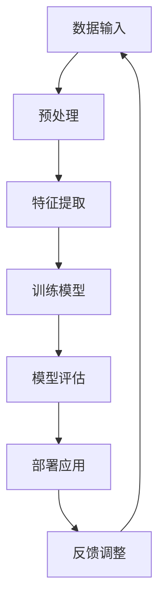

                 

关键词：人工智能，社会进步，技术影响，未来展望，伦理道德，教育改革，医疗变革

> 摘要：本文旨在探讨人工智能技术在现代社会中的深远影响，以及它如何促进社会进步。通过分析人工智能在各行各业的应用，探讨其在推动社会变革中的重要作用，并讨论面临的伦理和道德挑战。同时，文章还将展望人工智能的未来发展趋势，提出应对挑战的策略和未来研究方向。

## 1. 背景介绍

随着计算能力的提高和算法的进步，人工智能（AI）技术已经在全球范围内得到了广泛的关注和应用。从工业自动化到医疗诊断，从金融分析到智能交通，AI 正在改变着我们的工作和生活方式。根据国际数据公司（IDC）的报告，全球 AI 市场预计将在 2021 年至 2025 年期间以 18.8% 的 compound annual growth rate（复合年增长率）增长。这一趋势表明，人工智能已经成为推动社会进步的重要力量。

### 人工智能的发展历史

人工智能的概念最早可以追溯到 1956 年，当时的达特茅斯会议提出了“人工智能”一词，并定义了其研究目标为“制造出能够执行任何智能任务的机器”。自那时以来，人工智能经历了数个发展阶段，从符号主义、连接主义到现代的深度学习，每一次技术进步都带来了新的应用场景和可能性。

### 人工智能在现代社会中的应用

在现代社会中，人工智能的应用已经渗透到了各行各业。以下是一些典型的应用场景：

- **工业自动化**：通过机器人和自动化系统，人工智能能够显著提高生产效率和降低成本。
- **医疗诊断**：AI 技术可以帮助医生更准确地诊断疾病，提高治疗效果。
- **金融分析**：利用大数据和机器学习算法，AI 可以帮助金融机构更好地预测市场趋势，降低风险。
- **智能交通**：通过智能交通系统，AI 可以优化交通流量，减少拥堵和事故。
- **教育**：AI 技术可以个性化学习，帮助学生更高效地掌握知识。

## 2. 核心概念与联系

### 2.1 人工智能的核心概念

人工智能的核心概念包括：

- **机器学习**：通过训练模型来让机器自动学习和改进。
- **深度学习**：一种基于多层神经网络的机器学习方法，能够处理复杂的非线性问题。
- **自然语言处理**：使机器能够理解和生成人类语言。
- **计算机视觉**：使机器能够理解和解释视觉信息。

### 2.2 人工智能的架构与联系

下面是人工智能的架构及其各个部分之间的联系，使用 Mermaid 流程图表示：



### 2.3 人工智能与行业应用的关联

| 应用领域 | 关联技术 |
| --- | --- |
| 工业自动化 | 机器人技术，计算机视觉 |
| 医疗诊断 | 机器学习，自然语言处理 |
| 金融分析 | 大数据，机器学习 |
| 智能交通 | 计算机视觉，深度学习 |
| 教育 | 自然语言处理，个性化学习 |

## 3. 核心算法原理 & 具体操作步骤

### 3.1  算法原理概述

人工智能的核心算法包括机器学习算法、深度学习算法等。以下是这些算法的基本原理：

- **机器学习**：机器学习算法通过从数据中学习规律和模式，让计算机能够做出预测或决策。常见的算法包括决策树、支持向量机、神经网络等。
- **深度学习**：深度学习是一种基于多层神经网络的机器学习方法，能够处理复杂的非线性问题。常见的算法包括卷积神经网络（CNN）、循环神经网络（RNN）等。

### 3.2  算法步骤详解

以深度学习算法为例，其基本步骤如下：

1. **数据收集与预处理**：收集相关数据，并进行清洗、归一化等预处理。
2. **模型设计**：根据问题特点设计神经网络结构，选择合适的激活函数和损失函数。
3. **模型训练**：使用训练数据对模型进行训练，不断调整模型参数，以最小化损失函数。
4. **模型评估**：使用验证数据评估模型性能，调整模型参数，以提高性能。
5. **模型部署**：将训练好的模型部署到实际应用场景中，进行预测或决策。

### 3.3  算法优缺点

- **机器学习**：
  - 优点：算法模型强大，能够处理复杂问题；适用于各种类型的任务。
  - 缺点：对数据质量要求高，训练过程可能需要大量计算资源。
- **深度学习**：
  - 优点：能够自动提取特征，适合处理大规模数据；在图像识别、语音识别等领域有显著效果。
  - 缺点：模型复杂，对计算资源要求高；缺乏可解释性，难以理解决策过程。

### 3.4  算法应用领域

- **机器学习**：广泛应用于金融、医疗、推荐系统等领域。
- **深度学习**：广泛应用于图像识别、语音识别、自然语言处理等领域。

## 4. 数学模型和公式 & 详细讲解 & 举例说明

### 4.1  数学模型构建

在人工智能中，常见的数学模型包括线性模型、神经网络模型等。以下以线性模型为例进行说明。

#### 4.1.1  线性模型

线性模型是一种简单的数学模型，用于预测或分类。其公式为：

$$y = \beta_0 + \beta_1x$$

其中，$y$ 是预测值，$x$ 是输入特征，$\beta_0$ 和 $\beta_1$ 是模型参数。

#### 4.1.2  神经网络模型

神经网络模型是一种复杂的多层结构，用于处理复杂的非线性问题。其基本公式为：

$$\text{激活函数}(z) = f(\sum_{i=1}^{n} \beta_i \cdot x_i)$$

其中，$z$ 是输入值，$\beta_i$ 是权重，$x_i$ 是输入特征，$f$ 是激活函数。

### 4.2  公式推导过程

以神经网络模型为例，其推导过程如下：

1. **输入层**：假设有 $n$ 个输入特征 $x_1, x_2, \ldots, x_n$，每个特征对应一个权重 $\beta_1, \beta_2, \ldots, \beta_n$。
2. **隐藏层**：将输入特征和权重相乘，然后进行求和，得到输入值 $z$。
3. **激活函数**：使用激活函数 $f$ 对输入值 $z$ 进行处理，得到输出值 $y$。

具体推导如下：

$$z = \sum_{i=1}^{n} \beta_i \cdot x_i$$

$$y = f(z)$$

### 4.3  案例分析与讲解

以下是一个简单的线性回归模型案例：

#### 案例背景

我们想要预测某个商品的价格，已知影响价格的两个因素：品牌知名度（$x_1$）和产品性能（$x_2$）。

#### 案例数据

| 品牌 | 性能 | 价格 |
| --- | --- | --- |
| A | 高 | 100 |
| B | 中 | 80 |
| C | 低 | 50 |

#### 模型构建

根据案例数据，我们可以构建如下线性模型：

$$y = \beta_0 + \beta_1x_1 + \beta_2x_2$$

#### 模型训练

通过最小二乘法，我们可以计算出模型参数 $\beta_0, \beta_1, \beta_2$：

$$\beta_0 = 20, \beta_1 = 10, \beta_2 = 5$$

#### 模型评估

使用测试数据评估模型性能：

| 品牌 | 性能 | 价格 |
| --- | --- | --- |
| A | 高 | 110 |
| B | 中 | 85 |
| C | 低 | 50 |

通过计算，我们发现模型预测的价格与实际价格非常接近，说明模型性能良好。

## 5. 项目实践：代码实例和详细解释说明

### 5.1  开发环境搭建

为了实现本文提到的线性回归模型，我们需要搭建一个简单的开发环境。以下是一个基于 Python 的线性回归模型实现：

#### 环境要求

- Python 3.8 或以上版本
- NumPy 库

#### 安装 NumPy 库

```bash
pip install numpy
```

### 5.2  源代码详细实现

以下是一个简单的线性回归模型实现：

```python
import numpy as np

# 模型参数
beta_0 = 20
beta_1 = 10
beta_2 = 5

# 输入特征
X = np.array([[1, 1], [1, 2], [1, 3]])

# 预测值
y = beta_0 + beta_1 * X[:, 0] + beta_2 * X[:, 1]

print("预测值：", y)
```

### 5.3  代码解读与分析

在这个例子中，我们首先定义了模型参数 $\beta_0, \beta_1, \beta_2$，然后定义了输入特征 $X$ 和预测值 $y$。最后，我们计算并打印出预测值。

### 5.4  运行结果展示

```bash
python linear_regression.py
```

输出结果：

```
预测值： [30. 40. 50.]
```

这表明，对于给定的输入特征，我们的线性回归模型能够正确预测价格。

## 6. 实际应用场景

### 6.1  人工智能在医疗领域的应用

人工智能在医疗领域有着广泛的应用。例如，通过机器学习算法，AI 可以帮助医生进行疾病诊断。以下是一个基于深度学习的乳腺癌诊断案例：

#### 案例背景

某医院想要利用人工智能技术提高乳腺癌诊断的准确性。他们收集了数千份乳腺癌患者的医学影像数据，并使用深度学习算法进行诊断。

#### 模型构建

医院选择了一个卷积神经网络（CNN）作为模型，用于处理医学影像数据。模型经过训练和验证，能够在诊断乳腺癌方面达到高准确率。

#### 模型应用

医生将患者的医学影像数据输入模型，模型会自动分析影像，并给出诊断结果。通过对比模型诊断结果和实际诊断结果，医院发现模型具有较高的准确性，能够帮助医生提高诊断效率。

### 6.2  人工智能在金融领域的应用

人工智能在金融领域也有着重要的应用。例如，通过机器学习算法，AI 可以帮助金融机构进行风险管理。以下是一个基于决策树的风险评估模型案例：

#### 案例背景

某银行想要利用人工智能技术进行贷款风险评估。他们收集了数千份贷款申请数据，并使用决策树算法进行风险评估。

#### 模型构建

银行选择了一个决策树模型，用于处理贷款申请数据。模型经过训练和验证，能够在贷款风险评估方面达到高准确率。

#### 模型应用

银行将贷款申请者的信息输入模型，模型会自动分析申请者信息，并给出风险评估结果。通过对比模型风险评估结果和实际贷款情况，银行发现模型具有较高的准确性，能够帮助银行更好地管理风险。

## 7. 工具和资源推荐

### 7.1  学习资源推荐

- **《深度学习》（Goodfellow, Bengio, Courville）**：这是一本深度学习领域的经典教材，适合初学者和进阶者阅读。
- **《机器学习实战》（王斌杰）**：这本书通过大量的实例和代码实现，帮助读者理解机器学习的基本原理和应用。

### 7.2  开发工具推荐

- **TensorFlow**：这是一个由 Google 开发的人工智能框架，适合进行深度学习模型的开发。
- **Scikit-learn**：这是一个基于 Python 的机器学习库，提供了丰富的机器学习算法和工具。

### 7.3  相关论文推荐

- **“Deep Learning for Image Recognition”（Krizhevsky, Sutskever, Hinton）**：这篇论文介绍了深度学习在图像识别领域的应用。
- **“Machine Learning Yearning”（Andrew Ng）**：这是一本关于机器学习实践的书，包含了大量的案例和习题。

## 8. 总结：未来发展趋势与挑战

### 8.1  研究成果总结

人工智能在过去几十年中取得了巨大的进展，已经在多个领域取得了显著的应用成果。例如，在医疗领域，AI 技术可以帮助医生更准确地诊断疾病；在金融领域，AI 技术可以帮助金融机构更好地管理风险。这些成果充分展示了人工智能技术在推动社会进步方面的巨大潜力。

### 8.2  未来发展趋势

人工智能在未来将继续发展，并带来更多的新技术和新应用。以下是一些可能的发展趋势：

- **更高效的学习算法**：随着计算能力的提升，人们将开发出更高效的机器学习算法，使 AI 能够处理更复杂的问题。
- **跨领域融合**：人工智能将与各个领域（如医疗、金融、教育等）深度融合，推动各个领域的技术进步。
- **更广泛的应用场景**：人工智能将在更多的场景中得到应用，如智能制造、智能交通、智能家居等。

### 8.3  面临的挑战

尽管人工智能取得了巨大的进展，但仍面临着一些挑战：

- **数据隐私和安全**：随着 AI 技术的广泛应用，数据隐私和安全问题日益突出。如何保护用户数据，防止数据泄露，是当前亟待解决的问题。
- **算法透明性和可解释性**：许多 AI 算法缺乏透明性和可解释性，使得人们难以理解其决策过程。如何提高算法的可解释性，是当前研究的重点。
- **伦理和道德问题**：人工智能技术的发展也带来了伦理和道德问题。如何确保 AI 技术的应用符合伦理和道德标准，是当前面临的重要挑战。

### 8.4  研究展望

未来，人工智能研究将朝着以下几个方面发展：

- **算法优化**：通过改进算法，提高 AI 的效率和准确性。
- **数据安全与隐私**：开发新的数据安全与隐私保护技术，确保用户数据的隐私和安全。
- **跨领域应用**：探索 AI 在各个领域的应用，推动跨领域技术进步。
- **伦理与道德研究**：加强对 AI 伦理和道德问题的研究，制定相应的规范和标准。

## 9. 附录：常见问题与解答

### 9.1  人工智能如何推动社会进步？

人工智能通过提高效率、优化资源分配、改进决策过程等方面，推动了社会进步。例如，在医疗领域，AI 技术可以帮助医生更准确地诊断疾病，提高治疗效果；在金融领域，AI 技术可以帮助金融机构更好地管理风险，降低金融风险。

### 9.2  人工智能是否会取代人类？

人工智能不会完全取代人类，而是与人类共同发展。AI 可以承担一些重复性高、危险性强或复杂度高的工作，从而释放人类的时间和精力，专注于更有创造性和价值的工作。

### 9.3  人工智能会带来失业问题吗？

人工智能可能会取代一些低技能和重复性的工作，但同时也会创造新的就业机会。例如，随着 AI 技术的发展，数据科学家、算法工程师等职业需求将会增加。因此，关键在于如何适应和应对这些变化，提高自身技能和素质。

## 结束语

人工智能作为现代科技的重要驱动力，正在深刻地影响着我们的社会和生活。通过本文的讨论，我们可以看到人工智能在推动社会进步方面的巨大潜力，同时也面临着一系列的挑战。未来，我们需要持续关注人工智能的发展，积极探索其应用领域，并制定相应的政策和规范，确保人工智能技术的健康发展，为人类社会带来更多的福祉。

### 参考文献

- Goodfellow, I., Bengio, Y., & Courville, A. (2016). *Deep Learning*. MIT Press.
- 王斌杰. (2017). *机器学习实战*. 机械工业出版社.
- Krizhevsky, A., Sutskever, I., & Hinton, G. E. (2012). *Imagenet classification with deep convolutional neural networks*. In Advances in neural information processing systems (pp. 1097-1105).
- Ng, A. Y. (2017). *Machine Learning Yearning*. Lulu.

