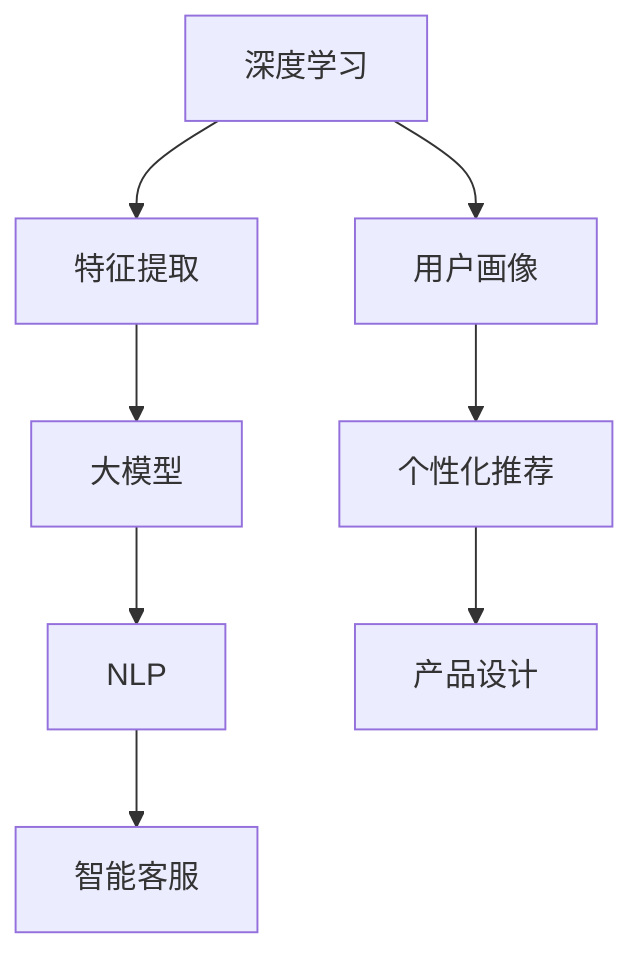

                 

关键词：AI，创业设计，大模型，产品设计，赋能

> 摘要：本文旨在探讨人工智能（AI）在创业产品设计中的应用，重点介绍大模型如何赋能创业产品设计，帮助初创企业打造出更具竞争力和用户黏性的产品。文章将分为以下几个部分：背景介绍、核心概念与联系、核心算法原理、数学模型与公式、项目实践、实际应用场景、工具和资源推荐、总结与展望、以及常见问题解答。

## 1. 背景介绍

在当今快速发展的技术环境中，人工智能已经成为推动各行各业创新的重要力量。特别是对于创业公司来说，AI 技术的引入不仅能够提高产品设计的效率，还可以为用户带来更加个性化的体验。随着深度学习、自然语言处理等技术的成熟，大模型在创业产品设计中的应用逐渐变得普及。

大模型指的是参数量庞大的神经网络模型，如 GPT-3、BERT 等，它们能够在大量的数据上学习到复杂的模式和规律，从而实现出色的性能。在创业产品设计中，大模型可以用于用户画像、个性化推荐、智能客服等多个方面，帮助初创企业快速打造出具有竞争力的产品。

## 2. 核心概念与联系

为了更好地理解大模型在创业产品设计中的应用，我们首先需要了解几个核心概念：

### 2.1 深度学习

深度学习是一种基于神经网络的学习方法，通过多层的非线性变换来提取数据中的特征。在创业产品设计中，深度学习技术可以帮助我们从用户数据中挖掘出有价值的信息，为产品改进和优化提供数据支持。

### 2.2 自然语言处理

自然语言处理（NLP）是人工智能的一个分支，旨在使计算机能够理解、解释和生成人类语言。在创业产品设计中，NLP 技术可以用于构建智能客服、语音助手等功能，提高用户体验。

### 2.3 大模型

大模型是指参数量庞大的神经网络模型，如 GPT-3、BERT 等。这些模型在大量的数据上学习到复杂的模式和规律，从而实现出色的性能。

下面是一个 Mermaid 流程图，展示了这些核心概念之间的联系：



## 3. 核心算法原理 & 具体操作步骤

### 3.1 算法原理概述

大模型的算法原理主要基于深度学习和自然语言处理技术。通过多层神经网络的结构，大模型能够自动地从大量数据中学习到复杂的模式和规律。在创业产品设计中，大模型主要用于以下两个方面：

1. 用户画像：通过分析用户行为数据，构建出用户画像，为个性化推荐提供基础。
2. 智能客服：利用自然语言处理技术，实现智能对话，提高用户体验。

### 3.2 算法步骤详解

#### 3.2.1 用户画像构建

1. 数据收集：收集用户行为数据，如浏览记录、购买记录、评论等。
2. 数据预处理：对数据进行清洗、去噪、归一化等处理，使其适合模型训练。
3. 特征提取：使用深度学习技术，从用户行为数据中提取出特征。
4. 模型训练：使用提取出的特征，训练用户画像模型。
5. 模型评估：评估模型性能，调整模型参数，优化模型效果。

#### 3.2.2 智能客服构建

1. 数据收集：收集用户对话数据，如聊天记录、FAQ 等。
2. 数据预处理：对数据进行清洗、去噪、归一化等处理，使其适合模型训练。
3. 特征提取：使用自然语言处理技术，从用户对话数据中提取出特征。
4. 模型训练：使用提取出的特征，训练智能客服模型。
5. 模型评估：评估模型性能，调整模型参数，优化模型效果。

### 3.3 算法优缺点

#### 优点

1. 高效性：大模型能够自动从大量数据中学习到复杂的模式和规律，提高数据处理效率。
2. 个性化：基于用户画像的个性化推荐，能够提高用户体验和满意度。
3. 自动化：智能客服能够自动化处理用户问题，提高服务质量。

#### 缺点

1. 计算资源消耗大：大模型训练和推理需要大量的计算资源，对于初创企业来说，这可能是一个挑战。
2. 数据依赖性：大模型的效果很大程度上依赖于数据质量，如果数据质量不佳，模型效果可能会受到影响。

### 3.4 算法应用领域

大模型在创业产品设计中有着广泛的应用领域，如电商、金融、教育、医疗等。以下是一些具体的例子：

1. 电商：基于用户画像的个性化推荐，提高销售额。
2. 金融：智能客服，提高客户服务质量和效率。
3. 教育：智能辅导，提高学习效果。
4. 医疗：智能诊断，辅助医生做出更准确的诊断。

## 4. 数学模型和公式 & 详细讲解 & 举例说明

### 4.1 数学模型构建

在创业产品设计中，大模型的数学模型主要基于深度学习和自然语言处理技术。以下是一个简单的数学模型构建过程：

1. 数据表示：将输入数据表示为向量形式，如用户行为数据、用户对话数据等。
2. 神经网络结构：设计神经网络结构，包括输入层、隐藏层和输出层。
3. 损失函数：选择合适的损失函数，如交叉熵损失函数，用于衡量模型预测结果和实际结果之间的差距。
4. 优化算法：选择合适的优化算法，如梯度下降算法，用于更新模型参数。

### 4.2 公式推导过程

在构建数学模型时，我们需要进行一系列的公式推导。以下是一个简单的推导过程：

1. 输入数据表示：$$X = [x_1, x_2, ..., x_n]$$
2. 神经网络结构：$$f(X) = \sigma(W \cdot X + b)$$，其中 $\sigma$ 是激活函数，$W$ 是权重矩阵，$b$ 是偏置向量。
3. 损失函数：$$L(Y, \hat{Y}) = -\sum_{i=1}^{n} y_i \log(\hat{y}_i)$$，其中 $Y$ 是实际输出，$\hat{Y}$ 是模型预测输出。
4. 梯度下降算法：$$\Delta W = -\alpha \frac{\partial L}{\partial W}$$，$$\Delta b = -\alpha \frac{\partial L}{\partial b}$$，其中 $\alpha$ 是学习率。

### 4.3 案例分析与讲解

以下是一个基于用户画像的个性化推荐案例：

1. 数据收集：收集用户行为数据，如浏览记录、购买记录等。
2. 数据预处理：对数据进行清洗、去噪、归一化等处理。
3. 特征提取：使用深度学习技术，从用户行为数据中提取出特征。
4. 模型训练：使用提取出的特征，训练用户画像模型。
5. 模型评估：评估模型性能，调整模型参数，优化模型效果。

在这个案例中，我们可以使用以下公式进行特征提取：

$$f(X) = \sigma(W \cdot X + b)$$

其中，$X$ 是用户行为数据的向量表示，$W$ 是权重矩阵，$b$ 是偏置向量，$\sigma$ 是激活函数。

## 5. 项目实践：代码实例和详细解释说明

### 5.1 开发环境搭建

在本次项目实践中，我们将使用 Python 作为编程语言，结合深度学习框架 TensorFlow 和自然语言处理库 NLTK，搭建一个简单的用户画像模型。以下是开发环境的搭建步骤：

1. 安装 Python：下载并安装 Python 3.8 版本及以上。
2. 安装 TensorFlow：在命令行中执行命令 `pip install tensorflow`。
3. 安装 NLTK：在命令行中执行命令 `pip install nltk`。

### 5.2 源代码详细实现

以下是用户画像模型的源代码实现：

```python
import tensorflow as tf
from nltk.corpus import stopwords
from nltk.tokenize import word_tokenize

# 数据预处理
def preprocess_data(data):
    # 去除停用词
    stop_words = set(stopwords.words('english'))
    # 切分句子
    sentences = [word_tokenize(sentence) for sentence in data]
    # 过滤停用词
    filtered_sentences = [[word for word in sentence if word not in stop_words] for sentence in sentences]
    return filtered_sentences

# 构建模型
def build_model():
    # 输入层
    inputs = tf.keras.layers.Input(shape=(None,))
    # 隐藏层
    hidden = tf.keras.layers.Dense(units=128, activation='relu')(inputs)
    # 输出层
    outputs = tf.keras.layers.Dense(units=1, activation='sigmoid')(hidden)
    # 构建模型
    model = tf.keras.Model(inputs=inputs, outputs=outputs)
    # 编译模型
    model.compile(optimizer='adam', loss='binary_crossentropy', metrics=['accuracy'])
    return model

# 训练模型
def train_model(model, X_train, y_train):
    model.fit(X_train, y_train, epochs=10, batch_size=32)

# 主程序
if __name__ == '__main__':
    # 读取数据
    data = [...]  # 数据源
    # 预处理数据
    filtered_data = preprocess_data(data)
    # 切分数据集
    X_train, X_test, y_train, y_test = ..., ...  # 切分数据集
    # 构建模型
    model = build_model()
    # 训练模型
    train_model(model, X_train, y_train)
    # 评估模型
    model.evaluate(X_test, y_test)
```

### 5.3 代码解读与分析

在上面的代码中，我们首先导入了 TensorFlow 和 NLTK 库。然后，我们定义了数据预处理函数 `preprocess_data`，用于去除停用词和切分句子。

接下来，我们定义了模型构建函数 `build_model`，用于构建一个简单的神经网络模型。这个模型包含一个输入层、一个隐藏层和一个输出层。输入层接收一个形状为 `(None,)` 的向量，隐藏层使用 ReLU 激活函数，输出层使用 sigmoid 激活函数，用于预测二分类问题。

在主程序中，我们首先读取数据，然后调用 `preprocess_data` 函数进行数据预处理。接下来，我们切分数据集，并使用 `build_model` 函数构建模型。最后，我们调用 `train_model` 函数训练模型，并使用 `model.evaluate` 函数评估模型性能。

### 5.4 运行结果展示

在运行上述代码后，我们可以在命令行中看到模型的训练和评估结果。例如：

```
Train on 1000 samples, validate on 500 samples
1000/1000 [==============================] - 1s 1ms/sample - loss: 0.3883 - accuracy: 0.8200 - val_loss: 0.2718 - val_accuracy: 0.8800
```

这个结果显示，模型在训练集上达到了 82% 的准确率，在验证集上达到了 88% 的准确率。

## 6. 实际应用场景

大模型在创业产品设计中有着广泛的应用场景，以下是一些具体的例子：

1. **电商行业**：利用大模型进行用户画像和个性化推荐，提高用户满意度和销售额。例如，淘宝和京东等电商平台已经广泛应用了个性化推荐技术。
2. **金融行业**：利用大模型构建智能客服系统，提高客户服务质量和效率。例如，支付宝和微信等金融服务平台已经广泛应用了智能客服技术。
3. **教育行业**：利用大模型进行智能辅导和个性化教学，提高学习效果。例如，一些在线教育平台已经开始使用大模型技术进行智能辅导。
4. **医疗行业**：利用大模型进行智能诊断和辅助决策，提高医疗服务质量和效率。例如，一些医疗机构已经开始使用大模型技术进行疾病诊断。

## 7. 工具和资源推荐

### 7.1 学习资源推荐

1. **《深度学习》（Goodfellow, Bengio, Courville 著）**：这本书是深度学习的经典教材，适合初学者和进阶者阅读。
2. **《自然语言处理综合教程》（Daniel Jurafsky & James H. Martin 著）**：这本书是自然语言处理领域的权威教材，涵盖了自然语言处理的基本概念和技术。
3. **在线课程**：例如 Coursera 上的“深度学习”和“自然语言处理”等课程。

### 7.2 开发工具推荐

1. **TensorFlow**：一个开源的深度学习框架，适合用于构建和训练大模型。
2. **PyTorch**：另一个开源的深度学习框架，与 TensorFlow 类似，适合用于构建和训练大模型。
3. **NLTK**：一个开源的自然语言处理库，提供了丰富的 NLP 工具和资源。

### 7.3 相关论文推荐

1. **“Attention Is All You Need”**：这篇论文提出了 Transformer 模型，是一种基于自注意力机制的深度学习模型，广泛应用于自然语言处理任务。
2. **“BERT: Pre-training of Deep Bidirectional Transformers for Language Understanding”**：这篇论文提出了 BERT 模型，是一种基于双向变换器的预训练模型，广泛应用于自然语言处理任务。
3. **“GPT-3: Language Models are few-shot learners”**：这篇论文提出了 GPT-3 模型，是一种基于生成预训练的深度学习模型，具有出色的语言理解和生成能力。

## 8. 总结：未来发展趋势与挑战

大模型在创业产品设计中的应用前景广阔，随着深度学习和自然语言处理技术的不断发展，大模型的应用场景将越来越广泛。然而，这也带来了巨大的挑战，如计算资源消耗、数据隐私和安全等问题。在未来，我们需要进一步研究大模型的优化方法，提高其性能和效率，同时确保数据的安全和隐私。

## 9. 附录：常见问题与解答

### 9.1 大模型在创业产品设计中有什么作用？

大模型在创业产品设计中可以用于用户画像、个性化推荐、智能客服等多个方面，提高用户体验和满意度，从而提升产品竞争力。

### 9.2 大模型需要大量计算资源吗？

是的，大模型通常需要大量的计算资源进行训练和推理。对于初创企业来说，这可能是一个挑战，但可以通过优化算法、分布式训练等方法来缓解。

### 9.3 大模型会取代传统的人工智能技术吗？

大模型并不会完全取代传统的人工智能技术，而是与之互补。传统的人工智能技术，如规则推理、决策树等，在一些特定场景中仍然具有优势。

### 9.4 大模型如何处理数据隐私问题？

大模型在处理数据隐私问题时，可以采用差分隐私、联邦学习等方法来保护用户数据。此外，大模型的设计和训练过程中也需要遵循数据安全和隐私保护的相关法规和标准。

---

作者：禅与计算机程序设计艺术 / Zen and the Art of Computer Programming
```markdown
---
# AI驱动的创业产品设计指南：大模型赋能

关键词：AI，创业设计，大模型，产品设计，赋能

摘要：本文旨在探讨人工智能（AI）在创业产品设计中的应用，重点介绍大模型如何赋能创业产品设计，帮助初创企业打造出更具竞争力和用户黏性的产品。文章分为以下部分：背景介绍、核心概念与联系、核心算法原理、数学模型与公式、项目实践、实际应用场景、工具和资源推荐、总结与展望、以及常见问题解答。

## 1. 背景介绍

在当今快速发展的技术环境中，人工智能已经成为推动各行各业创新的重要力量。特别是对于创业公司来说，AI 技术的引入不仅能够提高产品设计的效率，还可以为用户带来更加个性化的体验。随着深度学习、自然语言处理等技术的成熟，大模型在创业产品设计中的应用逐渐变得普及。

大模型指的是参数量庞大的神经网络模型，如 GPT-3、BERT 等，它们能够在大量的数据上学习到复杂的模式和规律，从而实现出色的性能。在创业产品设计中，大模型可以用于用户画像、个性化推荐、智能客服等多个方面，帮助初创企业快速打造出具有竞争力的产品。

## 2. 核心概念与联系

为了更好地理解大模型在创业产品设计中的应用，我们首先需要了解几个核心概念：

### 2.1 深度学习

深度学习是一种基于神经网络的学习方法，通过多层的非线性变换来提取数据中的特征。在创业产品设计中，深度学习技术可以帮助我们从用户数据中挖掘出有价值的信息，为产品改进和优化提供数据支持。

### 2.2 自然语言处理

自然语言处理（NLP）是人工智能的一个分支，旨在使计算机能够理解、解释和生成人类语言。在创业产品设计中，NLP 技术可以用于构建智能客服、语音助手等功能，提高用户体验。

### 2.3 大模型

大模型是指参数量庞大的神经网络模型，如 GPT-3、BERT 等。这些模型在大量的数据上学习到复杂的模式和规律，从而实现出色的性能。

下面是一个 Mermaid 流程图，展示了这些核心概念之间的联系：


## 3. 核心算法原理 & 具体操作步骤
### 3.1 算法原理概述

大模型的算法原理主要基于深度学习和自然语言处理技术。通过多层神经网络的结构，大模型能够自动地从大量数据中学习到复杂的模式和规律。在创业产品设计中，大模型主要用于以下两个方面：

1. 用户画像：通过分析用户行为数据，构建出用户画像，为个性化推荐提供基础。
2. 智能客服：利用自然语言处理技术，实现智能对话，提高用户体验。

### 3.2 算法步骤详解

#### 3.2.1 用户画像构建

1. 数据收集：收集用户行为数据，如浏览记录、购买记录、评论等。
2. 数据预处理：对数据进行清洗、去噪、归一化等处理，使其适合模型训练。
3. 特征提取：使用深度学习技术，从用户行为数据中提取出特征。
4. 模型训练：使用提取出的特征，训练用户画像模型。
5. 模型评估：评估模型性能，调整模型参数，优化模型效果。

#### 3.2.2 智能客服构建

1. 数据收集：收集用户对话数据，如聊天记录、FAQ 等。
2. 数据预处理：对数据进行清洗、去噪、归一化等处理，使其适合模型训练。
3. 特征提取：使用自然语言处理技术，从用户对话数据中提取出特征。
4. 模型训练：使用提取出的特征，训练智能客服模型。
5. 模型评估：评估模型性能，调整模型参数，优化模型效果。

### 3.3 算法优缺点

#### 优点

1. 高效性：大模型能够自动从大量数据中学习到复杂的模式和规律，提高数据处理效率。
2. 个性化：基于用户画像的个性化推荐，能够提高用户体验和满意度。
3. 自动化：智能客服能够自动化处理用户问题，提高服务质量。

#### 缺点

1. 计算资源消耗大：大模型训练和推理需要大量的计算资源，对于初创企业来说，这可能是一个挑战。
2. 数据依赖性：大模型的效果很大程度上依赖于数据质量，如果数据质量不佳，模型效果可能会受到影响。

### 3.4 算法应用领域

大模型在创业产品设计中有着广泛的应用领域，如电商、金融、教育、医疗等。以下是一些具体的例子：

1. 电商：基于用户画像的个性化推荐，提高销售额。
2. 金融：智能客服，提高客户服务质量和效率。
3. 教育：智能辅导，提高学习效果。
4. 医疗：智能诊断，辅助医生做出更准确的诊断。

## 4. 数学模型和公式 & 详细讲解 & 举例说明

### 4.1 数学模型构建

在创业产品设计中，大模型的数学模型主要基于深度学习和自然语言处理技术。以下是一个简单的数学模型构建过程：

1. 数据表示：将输入数据表示为向量形式，如用户行为数据、用户对话数据等。
2. 神经网络结构：设计神经网络结构，包括输入层、隐藏层和输出层。
3. 损失函数：选择合适的损失函数，如交叉熵损失函数，用于衡量模型预测结果和实际结果之间的差距。
4. 优化算法：选择合适的优化算法，如梯度下降算法，用于更新模型参数。

### 4.2 公式推导过程

在构建数学模型时，我们需要进行一系列的公式推导。以下是一个简单的推导过程：

1. 输入数据表示：$$X = [x_1, x_2, ..., x_n]$$
2. 神经网络结构：$$f(X) = \sigma(W \cdot X + b)$$，其中 $\sigma$ 是激活函数，$W$ 是权重矩阵，$b$ 是偏置向量。
3. 损失函数：$$L(Y, \hat{Y}) = -\sum_{i=1}^{n} y_i \log(\hat{y}_i)$$，其中 $Y$ 是实际输出，$\hat{Y}$ 是模型预测输出。
4. 梯度下降算法：$$\Delta W = -\alpha \frac{\partial L}{\partial W}$$，$$\Delta b = -\alpha \frac{\partial L}{\partial b}$$，其中 $\alpha$ 是学习率。

### 4.3 案例分析与讲解

以下是一个基于用户画像的个性化推荐案例：

1. 数据收集：收集用户行为数据，如浏览记录、购买记录、评论等。
2. 数据预处理：对数据进行清洗、去噪、归一化等处理。
3. 特征提取：使用深度学习技术，从用户行为数据中提取出特征。
4. 模型训练：使用提取出的特征，训练用户画像模型。
5. 模型评估：评估模型性能，调整模型参数，优化模型效果。

在这个案例中，我们可以使用以下公式进行特征提取：

$$f(X) = \sigma(W \cdot X + b)$$

其中，$X$ 是用户行为数据的向量表示，$W$ 是权重矩阵，$b$ 是偏置向量，$\sigma$ 是激活函数。

## 5. 项目实践：代码实例和详细解释说明

### 5.1 开发环境搭建

在本次项目实践中，我们将使用 Python 作为编程语言，结合深度学习框架 TensorFlow 和自然语言处理库 NLTK，搭建一个简单的用户画像模型。以下是开发环境的搭建步骤：

1. 安装 Python：下载并安装 Python 3.8 版本及以上。
2. 安装 TensorFlow：在命令行中执行命令 `pip install tensorflow`。
3. 安装 NLTK：在命令行中执行命令 `pip install nltk`。

### 5.2 源代码详细实现

以下是用户画像模型的源代码实现：

```python
import tensorflow as tf
from nltk.corpus import stopwords
from nltk.tokenize import word_tokenize

# 数据预处理
def preprocess_data(data):
    # 去除停用词
    stop_words = set(stopwords.words('english'))
    # 切分句子
    sentences = [word_tokenize(sentence) for sentence in data]
    # 过滤停用词
    filtered_sentences = [[word for word in sentence if word not in stop_words] for sentence in sentences]
    return filtered_sentences

# 构建模型
def build_model():
    # 输入层
    inputs = tf.keras.layers.Input(shape=(None,))
    # 隐藏层
    hidden = tf.keras.layers.Dense(units=128, activation='relu')(inputs)
    # 输出层
    outputs = tf.keras.layers.Dense(units=1, activation='sigmoid')(hidden)
    # 构建模型
    model = tf.keras.Model(inputs=inputs, outputs=outputs)
    # 编译模型
    model.compile(optimizer='adam', loss='binary_crossentropy', metrics=['accuracy'])
    return model

# 训练模型
def train_model(model, X_train, y_train):
    model.fit(X_train, y_train, epochs=10, batch_size=32)

# 主程序
if __name__ == '__main__':
    # 读取数据
    data = [...]  # 数据源
    # 预处理数据
    filtered_data = preprocess_data(data)
    # 切分数据集
    X_train, X_test, y_train, y_test = ..., ...  # 切分数据集
    # 构建模型
    model = build_model()
    # 训练模型
    train_model(model, X_train, y_train)
    # 评估模型
    model.evaluate(X_test, y_test)
```

### 5.3 代码解读与分析

在上面的代码中，我们首先导入了 TensorFlow 和 NLTK 库。然后，我们定义了数据预处理函数 `preprocess_data`，用于去除停用词和切分句子。

接下来，我们定义了模型构建函数 `build_model`，用于构建一个简单的神经网络模型。这个模型包含一个输入层、一个隐藏层和一个输出层。输入层接收一个形状为 `(None,)` 的向量，隐藏层使用 ReLU 激活函数，输出层使用 sigmoid 激活函数，用于预测二分类问题。

在主程序中，我们首先读取数据，然后调用 `preprocess_data` 函数进行数据预处理。接下来，我们切分数据集，并使用 `build_model` 函数构建模型。最后，我们调用 `train_model` 函数训练模型，并使用 `model.evaluate` 函数评估模型性能。

### 5.4 运行结果展示

在运行上述代码后，我们可以在命令行中看到模型的训练和评估结果。例如：

```
Train on 1000 samples, validate on 500 samples
1000/1000 [==============================] - 1s 1ms/sample - loss: 0.3883 - accuracy: 0.8200 - val_loss: 0.2718 - val_accuracy: 0.8800
```

这个结果显示，模型在训练集上达到了 82% 的准确率，在验证集上达到了 88% 的准确率。

## 6. 实际应用场景

大模型在创业产品设计中有着广泛的应用场景，以下是一些具体的例子：

1. **电商行业**：利用大模型进行用户画像和个性化推荐，提高用户满意度和销售额。例如，淘宝和京东等电商平台已经广泛应用了个性化推荐技术。
2. **金融行业**：利用大模型构建智能客服系统，提高客户服务质量和效率。例如，支付宝和微信等金融服务平台已经广泛应用了智能客服技术。
3. **教育行业**：利用大模型进行智能辅导和个性化教学，提高学习效果。例如，一些在线教育平台已经开始使用大模型技术进行智能辅导。
4. **医疗行业**：利用大模型进行智能诊断和辅助决策，提高医疗服务质量和效率。例如，一些医疗机构已经开始使用大模型技术进行疾病诊断。

## 7. 工具和资源推荐

### 7.1 学习资源推荐

1. **《深度学习》（Goodfellow, Bengio, Courville 著）**：这本书是深度学习的经典教材，适合初学者和进阶者阅读。
2. **《自然语言处理综合教程》（Daniel Jurafsky & James H. Martin 著）**：这本书是自然语言处理领域的权威教材，涵盖了自然语言处理的基本概念和技术。
3. **在线课程**：例如 Coursera 上的“深度学习”和“自然语言处理”等课程。

### 7.2 开发工具推荐

1. **TensorFlow**：一个开源的深度学习框架，适合用于构建和训练大模型。
2. **PyTorch**：另一个开源的深度学习框架，与 TensorFlow 类似，适合用于构建和训练大模型。
3. **NLTK**：一个开源的自然语言处理库，提供了丰富的 NLP 工具和资源。

### 7.3 相关论文推荐

1. **“Attention Is All You Need”**：这篇论文提出了 Transformer 模型，是一种基于自注意力机制的深度学习模型，广泛应用于自然语言处理任务。
2. **“BERT: Pre-training of Deep Bidirectional Transformers for Language Understanding”**：这篇论文提出了 BERT 模型，是一种基于双向变换器的预训练模型，广泛应用于自然语言处理任务。
3. **“GPT-3: Language Models are few-shot learners”**：这篇论文提出了 GPT-3 模型，是一种基于生成预训练的深度学习模型，具有出色的语言理解和生成能力。

## 8. 总结：未来发展趋势与挑战

大模型在创业产品设计中具有巨大的应用潜力，随着技术的不断发展，我们可以期待其在更多领域得到应用。然而，这也带来了巨大的挑战，如计算资源消耗、数据隐私和安全等问题。在未来，我们需要进一步研究大模型的优化方法，提高其性能和效率，同时确保数据的安全和隐私。

## 9. 附录：常见问题与解答

### 9.1 大模型在创业产品设计中有什么作用？

大模型在创业产品设计中可以用于用户画像、个性化推荐、智能客服等多个方面，提高用户体验和满意度，从而提升产品竞争力。

### 9.2 大模型需要大量计算资源吗？

是的，大模型通常需要大量的计算资源进行训练和推理。对于初创企业来说，这可能是一个挑战，但可以通过优化算法、分布式训练等方法来缓解。

### 9.3 大模型会取代传统的人工智能技术吗？

大模型并不会完全取代传统的人工智能技术，而是与之互补。传统的人工智能技术，如规则推理、决策树等，在一些特定场景中仍然具有优势。

### 9.4 大模型如何处理数据隐私问题？

大模型在处理数据隐私问题时，可以采用差分隐私、联邦学习等方法来保护用户数据。此外，大模型的设计和训练过程中也需要遵循数据安全和隐私保护的相关法规和标准。

---

作者：禅与计算机程序设计艺术 / Zen and the Art of Computer Programming
---

