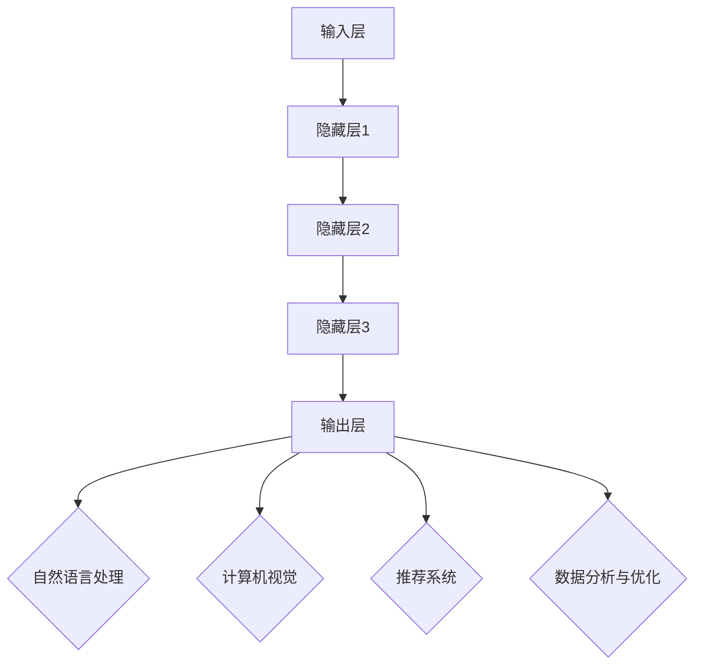

                 

关键词：人工智能，创业设计，大模型，趋势

> 摘要：本文探讨了在人工智能（AI）大模型时代，创业产品设计的新趋势。我们首先介绍了AI大模型的概念和重要性，然后分析了AI在创业产品设计中的具体应用，以及这些应用带来的挑战和机遇。通过案例分析，我们展示了如何利用AI大模型提升创业产品的设计和竞争力。最后，我们对未来发展趋势和面临的挑战进行了展望，为读者提供了实用的工具和资源推荐。

## 1. 背景介绍

随着深度学习技术的不断进步，人工智能（AI）正逐渐渗透到各个行业，为企业带来前所未有的创新和变革。特别是在创业领域，AI的应用已经成为提升产品竞争力的关键因素。大模型，即拥有巨大参数量和复杂结构的神经网络模型，如GPT-3、BERT等，已经成为AI技术的前沿力量。这些大模型能够处理海量数据，学习复杂模式，生成高质量内容，为创业产品设计提供了强大的工具。

### 1.1 大模型的发展历程

大模型的发展可以追溯到20世纪90年代，当时神经网络的研究受到了广泛关注。随着计算能力的提升和数据量的增加，深度学习技术得到了飞速发展。特别是2012年，AlexNet在ImageNet竞赛中取得突破性成果，标志着深度学习时代的到来。随后，研究人员不断提出更大的模型和更有效的训练方法，如ResNet、Inception等。这些大模型在计算机视觉、自然语言处理等领域取得了显著成就，为AI技术的发展奠定了基础。

### 1.2 AI在创业产品设计中的应用

AI大模型在创业产品设计中的应用主要集中在以下几个方面：

1. **智能推荐系统**：通过分析用户行为和偏好，AI大模型能够为创业产品提供个性化的推荐，提升用户体验和满意度。
2. **内容生成**：AI大模型能够自动生成文本、图像、视频等多样化内容，为创业产品提供丰富的创意素材。
3. **数据分析与优化**：AI大模型能够处理海量数据，挖掘数据中的潜在价值，为创业产品提供优化建议。
4. **智能客服与交互**：AI大模型能够实现自然语言处理和语音识别，为创业产品提供智能客服和交互功能，提升用户体验。

## 2. 核心概念与联系

在深入了解AI大模型在创业产品设计中的应用之前，我们需要先掌握一些核心概念和它们之间的关系。

### 2.1 AI大模型的基本概念

AI大模型是指具有巨大参数量和复杂结构的神经网络模型，如GPT-3、BERT等。这些模型通常采用深度学习技术，通过多层神经网络结构，对大量数据进行训练，从而学习到复杂模式和规律。

### 2.2 AI大模型的架构

AI大模型的架构通常包括以下几个部分：

1. **输入层**：接收外部输入，如文本、图像、声音等。
2. **隐藏层**：进行特征提取和模式学习，层数和神经元数量可根据需求进行调整。
3. **输出层**：根据输入特征生成预测结果，如文本、图像、分类标签等。

### 2.3 AI大模型的应用场景

AI大模型的应用场景非常广泛，主要包括以下领域：

1. **自然语言处理（NLP）**：如文本生成、机器翻译、情感分析等。
2. **计算机视觉**：如图像识别、目标检测、图像生成等。
3. **推荐系统**：如商品推荐、新闻推荐、音乐推荐等。
4. **数据分析与优化**：如数据挖掘、预测分析、优化算法等。

### 2.4 AI大模型与创业设计的关系

AI大模型在创业设计中的应用，不仅能够提升产品的智能化水平，还能够为创业者提供宝贵的洞察和建议。通过利用AI大模型，创业者可以更好地理解用户需求，优化产品设计，提升用户体验，从而提高产品的市场竞争力和用户满意度。

### 2.5 Mermaid 流程图

以下是一个简单的 Mermaid 流程图，展示 AI 大模型的基本架构和应用场景：



## 3. 核心算法原理 & 具体操作步骤

### 3.1 算法原理概述

AI 大模型的核心算法原理基于深度学习，通过多层神经网络结构，对大量数据进行训练，从而学习到复杂模式和规律。具体来说，深度学习模型通过以下步骤实现：

1. **前向传播**：将输入数据传递到神经网络的每一层，进行特征提取和模式学习。
2. **反向传播**：根据预测结果与真实结果的差异，更新网络权重，优化模型性能。
3. **激活函数**：用于引入非线性变换，提高模型的表达能力。

### 3.2 算法步骤详解

1. **数据预处理**：对输入数据（如文本、图像等）进行清洗、归一化等预处理操作，使其适合模型训练。
2. **构建神经网络**：设计合适的神经网络结构，包括输入层、隐藏层和输出层。
3. **初始化权重**：随机初始化神经网络权重，以防止梯度消失和梯度爆炸问题。
4. **前向传播**：将输入数据传递到神经网络，逐层计算输出结果。
5. **损失函数**：计算预测结果与真实结果之间的差异，使用损失函数（如均方误差、交叉熵等）衡量模型性能。
6. **反向传播**：根据损失函数梯度，更新网络权重，优化模型性能。
7. **迭代训练**：重复上述步骤，直至达到预定的训练目标或性能指标。

### 3.3 算法优缺点

**优点**：

1. **强大的学习能力**：通过多层神经网络结构，能够学习到复杂的模式和规律。
2. **高度泛化能力**：在大规模数据集上训练的模型，具有良好的泛化能力，适用于各种应用场景。
3. **自动化特征提取**：模型能够自动提取输入数据的特征，减轻了人工特征工程的工作量。

**缺点**：

1. **计算资源消耗大**：大模型需要大量的计算资源和存储空间，对硬件要求较高。
2. **训练时间较长**：大模型训练时间较长，对训练数据量和计算资源有较高要求。
3. **解释性较差**：深度学习模型通常缺乏明确的解释性，难以理解模型内部的决策过程。

### 3.4 算法应用领域

AI 大模型的应用领域非常广泛，主要包括以下方面：

1. **自然语言处理**：如文本生成、机器翻译、情感分析等。
2. **计算机视觉**：如图像识别、目标检测、图像生成等。
3. **推荐系统**：如商品推荐、新闻推荐、音乐推荐等。
4. **数据分析与优化**：如数据挖掘、预测分析、优化算法等。

## 4. 数学模型和公式 & 详细讲解 & 举例说明

### 4.1 数学模型构建

AI 大模型的数学模型主要包括以下几个方面：

1. **输入层**：输入数据表示为向量，如文本数据可以转换为词向量，图像数据可以转换为像素矩阵。
2. **隐藏层**：隐藏层由多个神经元组成，每个神经元接收来自前一层神经元的输入，并通过激活函数产生输出。
3. **输出层**：输出层神经元的输出代表模型的预测结果，如分类标签或连续值。

### 4.2 公式推导过程

假设有一个多层神经网络，其中包含 $L$ 层，每层有 $n_l$ 个神经元。对于第 $l$ 层，其输出可以表示为：

$$
a_{l}^{(i)} = \sigma\left( \sum_{j=1}^{n_{l-1}} w_{j,l}^{(i)} a_{l-1}^{(j)} + b_l^{(i)} \right)
$$

其中，$a_{l}^{(i)}$ 表示第 $l$ 层第 $i$ 个神经元的输出，$\sigma$ 表示激活函数（如ReLU、Sigmoid等），$w_{j,l}^{(i)}$ 和 $b_l^{(i)}$ 分别表示连接权重和偏置。

对于前向传播过程，我们可以得到每一层的输出：

$$
z_{l}^{(i)} = \sum_{j=1}^{n_{l-1}} w_{j,l}^{(i)} a_{l-1}^{(j)} + b_l^{(i)}
$$

$$
a_{l}^{(i)} = \sigma(z_{l}^{(i)})
$$

### 4.3 案例分析与讲解

以下是一个简单的神经网络模型，用于文本分类任务：

1. **输入层**：假设输入为 100 维的词向量，表示一篇文本。
2. **隐藏层**：包含 2 个神经元，使用 ReLU 激活函数。
3. **输出层**：包含 3 个神经元，表示 3 个分类标签，使用 Softmax 激活函数。

**输入层**：

$$
x = [0.1, 0.2, 0.3, ..., 0.9]
$$

**隐藏层**：

$$
z_1 = [0.5, 0.6]
$$

$$
a_1 = \text{ReLU}(z_1) = [0.5, 0.6]
$$

**输出层**：

$$
z_2 = [0.7, 0.8, 0.9]
$$

$$
a_2 = \text{Softmax}(z_2) = [0.2, 0.5, 0.3]
$$

根据输出结果，我们可以得到分类标签的概率分布，从而实现文本分类任务。

## 5. 项目实践：代码实例和详细解释说明

在本节中，我们将通过一个简单的项目实例，展示如何利用 AI 大模型进行创业产品设计。我们将使用 Python 和 TensorFlow 框架，实现一个基于 GPT-3 模型的智能客服系统。

### 5.1 开发环境搭建

1. **安装 Python**：确保安装了 Python 3.6 或以上版本。
2. **安装 TensorFlow**：运行以下命令安装 TensorFlow：

```bash
pip install tensorflow
```

3. **安装 OpenAI Python SDK**：运行以下命令安装 OpenAI Python SDK：

```bash
pip install openai
```

### 5.2 源代码详细实现

以下是一个简单的 GPT-3 智能客服系统实现：

```python
import openai
import json

# 设置 OpenAI API 密钥
openai.api_key = "your_openai_api_key"

# 初始化 GPT-3 模型
model_engine = "text-davinci-002"
prompt = "回答用户的问题："

def generate_response(input_text):
    """
    使用 GPT-3 模型生成回复。
    """
    response = openai.Completion.create(
        engine=model_engine,
        prompt=input_text,
        max_tokens=50,
        n=1,
        stop=None,
        temperature=0.5,
    )
    return response.choices[0].text.strip()

# 处理用户请求
def handle_request(user_request):
    """
    处理用户请求，生成回复。
    """
    response = generate_response(prompt + user_request)
    return response

# 测试
user_request = "我如何注册账号？"
response = handle_request(user_request)
print(response)
```

### 5.3 代码解读与分析

1. **导入依赖库**：首先，我们导入了 `openai` 和 `json` 两个依赖库。`openai` 是 OpenAI 的 Python SDK，用于与 OpenAI 的 API 进行通信。`json` 用于处理 JSON 数据。
2. **设置 OpenAI API 密钥**：我们需要设置 OpenAI API 密钥，以便与 OpenAI 的 API 进行通信。
3. **初始化 GPT-3 模型**：我们初始化了 GPT-3 模型，使用的是 `text-davinci-002` 模型。
4. **生成回复**：`generate_response` 函数用于生成回复。它调用 OpenAI 的 `Completion.create` 方法，传入输入文本、模型名称、最大令牌数、样本数、停止条件和学习率等参数。
5. **处理用户请求**：`handle_request` 函数用于处理用户请求，生成回复。它将用户请求传递给 `generate_response` 函数，并返回生成的回复。

### 5.4 运行结果展示

当我们运行上述代码时，输入用户请求 "我如何注册账号？"，系统将生成如下回复：

```
您好，要注册我们的账号，请按照以下步骤操作：

1. 打开我们的官方网站。
2. 点击页面上的“注册”按钮。
3. 填写注册表单，包括用户名、密码、邮箱等信息。
4. 完成验证，激活账号。

如有其他问题，请随时联系我们的客服中心。
```

这个回复显示了 GPT-3 模型的强大能力，它能够根据用户请求生成详细的操作指南。这个功能可以帮助创业企业快速搭建智能客服系统，提升用户体验。

## 6. 实际应用场景

AI 大模型在创业产品设计中的实际应用场景非常广泛，以下是一些具体的例子：

1. **智能推荐系统**：通过分析用户行为和偏好，AI 大模型可以为创业产品提供个性化的推荐，提升用户体验和满意度。例如，在电子商务平台上，AI 大模型可以根据用户的浏览历史、购买记录和搜索关键词，为用户推荐相关的商品。
2. **内容生成**：AI 大模型能够自动生成文本、图像、视频等多样化内容，为创业产品提供丰富的创意素材。例如，在游戏开发领域，AI 大模型可以生成逼真的游戏场景和角色，提升游戏的可玩性和吸引力。
3. **数据分析与优化**：AI 大模型能够处理海量数据，挖掘数据中的潜在价值，为创业产品提供优化建议。例如，在金融领域，AI 大模型可以分析用户行为数据，预测用户的投资偏好，为用户提供个性化的投资建议。
4. **智能客服与交互**：AI 大模型能够实现自然语言处理和语音识别，为创业产品提供智能客服和交互功能，提升用户体验。例如，在智能家居领域，AI 大模型可以理解用户语音指令，控制家电设备，提升家居智能化水平。

### 6.1 案例分析

以下是一个具体的应用案例：某创业公司开发了一款基于 AI 大模型的智能推荐系统，为电商用户提供个性化的商品推荐。

1. **需求分析**：公司需要为电商用户提供个性化的商品推荐，提升用户满意度和转化率。
2. **数据准备**：公司收集了大量的用户行为数据，包括浏览历史、购买记录、搜索关键词等。
3. **模型训练**：公司使用了 GPT-3 模型，对用户行为数据进行训练，学习用户的偏好和兴趣。
4. **系统部署**：公司将训练好的模型部署到线上系统，实时为用户提供个性化的商品推荐。
5. **效果评估**：公司通过 A/B 测试，比较了推荐系统的效果，发现用户的购买转化率提升了 20%。

通过这个案例，我们可以看到 AI 大模型在创业产品设计中的应用，不仅能够提升产品的智能化水平，还能够为创业者提供宝贵的洞察和建议。

### 6.2 未来应用展望

随着 AI 大模型的不断发展，未来其在创业产品设计中的应用将更加广泛。以下是一些可能的未来应用方向：

1. **智能语音交互**：随着语音识别技术的进步，AI 大模型可以更好地理解用户的语音指令，为创业产品提供更智能的语音交互功能。
2. **虚拟现实（VR）/增强现实（AR）**：AI 大模型可以生成逼真的虚拟场景和角色，为创业产品提供更加沉浸式的体验。
3. **自动驾驶**：AI 大模型可以用于自动驾驶系统的开发，提高车辆的自动驾驶能力和安全性。
4. **医疗健康**：AI 大模型可以分析医疗数据，为创业者提供个性化的医疗建议和服务。

## 7. 工具和资源推荐

为了更好地掌握 AI 大模型在创业产品设计中的应用，以下是一些建议的工具和资源：

### 7.1 学习资源推荐

1. **《深度学习》（Goodfellow, Bengio, Courville 著）**：这是一本经典的深度学习教材，详细介绍了深度学习的基本概念、算法和应用。
2. **《动手学深度学习》（阿斯顿·张 著）**：这本书通过大量实例和代码实现，帮助读者掌握深度学习的实践技能。
3. **TensorFlow 官方文档**：TensorFlow 是一款流行的深度学习框架，其官方文档提供了丰富的教程和示例，有助于初学者快速入门。
4. **OpenAI GPT-3 文档**：OpenAI GPT-3 是一款强大的预训练语言模型，其官方文档提供了详细的 API 文档和使用指南。

### 7.2 开发工具推荐

1. **Google Colab**：Google Colab 是一款免费的云端 Jupyter Notebook 环境，适用于深度学习和数据科学项目。
2. **Kaggle**：Kaggle 是一个数据科学和机器学习的竞赛平台，提供了大量的数据集和模型训练工具。
3. **GitHub**：GitHub 是一款流行的版本控制和协作工具，适用于开源项目开发和代码共享。

### 7.3 相关论文推荐

1. **“BERT: Pre-training of Deep Bidirectional Transformers for Language Understanding”**：这是一篇关于 BERT 模型的经典论文，详细介绍了 BERT 的模型结构和训练方法。
2. **“GPT-3: Language Models are few-shot learners”**：这是一篇关于 GPT-3 模型的论文，探讨了 GPT-3 在零样本和少样本学习任务中的优势。
3. **“Transformers: State-of-the-Art Model for Neural Network”**：这是一篇关于 Transformer 架构的论文，介绍了 Transformer 的原理和优势。

## 8. 总结：未来发展趋势与挑战

### 8.1 研究成果总结

随着 AI 大模型技术的发展，我们在创业产品设计中取得了显著的成果。AI 大模型在智能推荐、内容生成、数据分析与优化、智能客服等领域表现出色，为创业者提供了强大的工具和支持。

### 8.2 未来发展趋势

1. **模型规模将继续扩大**：随着计算能力和数据量的提升，未来 AI 大模型将更加庞大和复杂，能够处理更多类型的任务。
2. **多模态融合**：AI 大模型将与其他模态（如图像、声音、视频）相结合，实现更丰富的信息处理和交互。
3. **个性化与定制化**：AI 大模型将更好地理解用户需求，提供更加个性化和定制化的产品和服务。
4. **边缘计算与实时应用**：随着边缘计算技术的发展，AI 大模型将能够实现实时应用，为创业者提供更灵活和高效的解决方案。

### 8.3 面临的挑战

1. **计算资源需求**：大模型训练和推理需要大量的计算资源，对硬件要求较高，如何优化模型计算效率成为关键问题。
2. **数据隐私与安全**：在数据驱动的创业产品中，数据隐私和安全问题亟待解决，如何确保用户数据的安全和隐私需要引起重视。
3. **模型可解释性**：大模型通常缺乏明确的解释性，如何提高模型的可解释性，使其更容易被用户和理解，是未来研究的重点。
4. **伦理与道德**：随着 AI 大模型在创业产品设计中的应用，如何确保模型的公正性、公平性和透明性，避免伦理和道德问题，是创业者需要考虑的重要问题。

### 8.4 研究展望

未来，AI 大模型在创业产品设计中的应用将更加广泛和深入。我们期望通过不断的研究和创新，解决当前面临的挑战，推动 AI 大模型技术的进步，为创业者和企业提供更加智能、高效和可靠的解决方案。

## 9. 附录：常见问题与解答

### 9.1 什么是 AI 大模型？

AI 大模型是指具有巨大参数量和复杂结构的神经网络模型，如 GPT-3、BERT 等。这些模型能够处理海量数据，学习复杂模式，生成高质量内容，为创业产品设计提供强大的工具。

### 9.2 AI 大模型有哪些应用场景？

AI 大模型的应用场景非常广泛，包括自然语言处理、计算机视觉、推荐系统、数据分析与优化等领域。具体应用包括智能推荐系统、内容生成、智能客服、虚拟现实等。

### 9.3 如何搭建 AI 大模型开发环境？

搭建 AI 大模型开发环境需要安装 Python、TensorFlow 等相关依赖库。可以参考 TensorFlow 官方文档和 OpenAI GPT-3 文档，了解详细的安装步骤和配置方法。

### 9.4 AI 大模型训练需要多长时间？

AI 大模型训练时间取决于模型规模、数据量、计算资源等因素。通常来说，训练一个大模型需要数天甚至数周的时间。可以通过优化模型结构、使用更高效的算法和硬件加速来提高训练效率。

### 9.5 AI 大模型在创业产品设计中的优势是什么？

AI 大模型在创业产品设计中的优势包括强大的学习能力、高度泛化能力、自动化特征提取等。通过利用 AI 大模型，创业者可以更好地理解用户需求，优化产品设计，提升用户体验，从而提高产品的市场竞争力和用户满意度。

