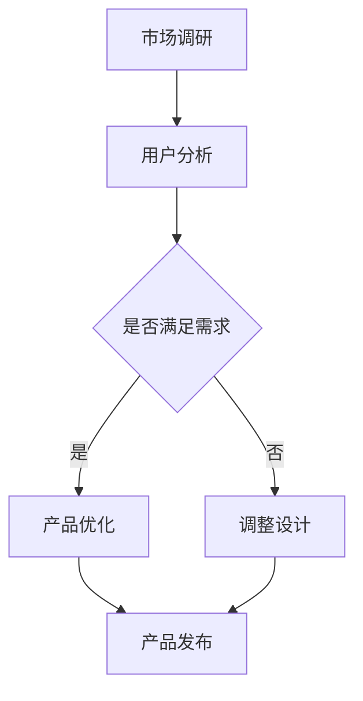

                 

### 关键词 Keyword

AI创业、产品设计、大模型、趋势、架构、算法、开发环境、应用场景、未来展望、工具资源、挑战与展望

### 摘要 Abstract

在人工智能大模型时代，创业产品设计正经历深刻的变革。本文将深入探讨AI驱动的创业产品设计趋势，分析核心概念、算法原理、数学模型、项目实践，以及未来应用场景和挑战。通过详细的技术解析，为创业者提供指导，助其在科技浪潮中乘风破浪。

## 1. 背景介绍

随着人工智能技术的迅猛发展，大模型（如GPT-3、BERT等）已经成为推动产业变革的重要力量。这些模型具有强大的数据处理能力和自适应学习能力，使得创业公司在产品设计上拥有了前所未有的优势。然而，如何有效地利用这些优势，设计出具有竞争力的产品，成为了摆在创业者面前的新课题。

本文旨在探讨大模型时代的创业产品设计趋势，通过分析核心概念、算法原理、数学模型、项目实践，以及应用场景和未来挑战，为创业者提供实用的指导。

### 1.1 人工智能的发展历程

人工智能（AI）的发展可以分为多个阶段，从最初的符号主义、连接主义到现代的统计学习，每一个阶段都为AI的发展奠定了基础。尤其是深度学习的兴起，使得计算机在图像识别、语音识别、自然语言处理等领域取得了突破性进展。大模型则是在深度学习的基础上，通过海量的数据和强大的计算能力，进一步提升了AI的性能。

### 1.2 创业产品设计的重要性

创业产品设计不仅是产品成功的关键，更是企业竞争力的核心。一个优秀的产品设计不仅要满足用户需求，还要具备创新性和竞争力。在AI大模型时代，创业者需要充分利用AI技术，设计出更加智能、个性化的产品，从而在激烈的市场竞争中脱颖而出。

## 2. 核心概念与联系

在AI驱动的创业产品设计中，理解以下核心概念和它们之间的联系至关重要。

### 2.1 人工智能（AI）

人工智能是指通过计算机模拟人类智能的技术。它包括机器学习、深度学习、自然语言处理等多个子领域。AI技术的核心是算法和数据的结合，通过不断学习和优化，实现智能决策和问题解决。

### 2.2 大模型（Large Models）

大模型是指具有数十亿甚至数万亿参数的深度学习模型。这些模型通过在海量数据上进行训练，能够自动学习复杂的模式和规律。大模型的出现，使得AI在处理大规模数据、进行复杂任务时，表现出了前所未有的能力。

### 2.3 创业产品设计（Product Design for Startups）

创业产品设计是指在创业初期，通过市场调研、用户反馈和团队协作，设计出符合市场需求的产品。创业产品设计不仅要考虑功能性和用户体验，还要考虑商业模式和可持续发展。

### 2.4 联系

AI技术和创业产品设计之间的联系在于，AI技术为创业产品设计提供了强大的工具和资源。通过利用大模型，创业者可以更加高效地进行市场调研、用户分析和产品优化。同时，创业产品设计的需求和反馈，也为AI技术的发展提供了方向和动力。

### 2.5 Mermaid 流程图

以下是一个简化的Mermaid流程图，展示了AI驱动的创业产品设计的核心概念和流程：



在这个流程中，市场调研和用户分析是创业产品设计的起点，通过不断调整和优化，最终实现产品的发布和推广。

## 3. 核心算法原理 & 具体操作步骤

### 3.1 算法原理概述

AI驱动的创业产品设计依赖于多种核心算法，其中深度学习算法尤为重要。深度学习算法通过多层神经网络，对数据进行特征提取和模式识别，从而实现智能决策。

### 3.2 算法步骤详解

以下是一个简化的深度学习算法步骤：

1. 数据预处理：对收集到的数据进行清洗、归一化等处理，使其适合输入到神经网络。
2. 网络结构设计：根据任务需求，设计合适的神经网络结构，如卷积神经网络（CNN）或循环神经网络（RNN）。
3. 模型训练：使用训练数据，通过反向传播算法，不断调整网络参数，使模型能够正确预测或分类。
4. 模型评估：使用测试数据，评估模型的性能，如准确率、召回率等。
5. 模型部署：将训练好的模型部署到产品中，实现自动化决策或任务处理。

### 3.3 算法优缺点

深度学习算法的优点包括：

- 高效的数据处理能力：能够处理大规模、多维度的数据。
- 强大的模式识别能力：通过多层神经网络，能够自动学习复杂的模式和规律。

深度学习算法的缺点包括：

- 需要大量的数据：训练高质量的模型，需要大量的标注数据。
- 计算资源消耗大：训练过程需要大量的计算资源和时间。

### 3.4 算法应用领域

深度学习算法在多个领域都有广泛应用，包括：

- 图像识别：如人脸识别、物体检测等。
- 自然语言处理：如机器翻译、文本分类等。
- 语音识别：如语音助手、语音翻译等。

## 4. 数学模型和公式 & 详细讲解 & 举例说明

### 4.1 数学模型构建

在AI驱动的创业产品设计中，常用的数学模型包括神经网络模型、决策树模型、支持向量机模型等。以下以神经网络模型为例，介绍数学模型的构建过程。

1. 神经网络模型的基本结构包括输入层、隐藏层和输出层。每个层由多个神经元组成，神经元之间通过权重连接。
2. 神经元的激活函数通常使用Sigmoid函数或ReLU函数，用于引入非线性特性。

### 4.2 公式推导过程

以Sigmoid函数为例，其公式为：

$$
\sigma(x) = \frac{1}{1 + e^{-x}}
$$

推导过程如下：

1. 定义指数函数：
$$
f(x) = e^{-x}
$$
2. 定义Sigmoid函数：
$$
\sigma(x) = \frac{1}{1 + f(x)}
$$
3. 将指数函数代入Sigmoid函数：
$$
\sigma(x) = \frac{1}{1 + e^{-x}}
$$

### 4.3 案例分析与讲解

以下是一个简单的神经网络模型构建和训练的案例：

1. **数据集**：使用一个包含100个样本的数据集，每个样本包括一个输入和对应的标签。
2. **网络结构**：设计一个包含一个输入层、一个隐藏层和一个输出层的神经网络。
3. **激活函数**：隐藏层使用ReLU函数，输出层使用Sigmoid函数。

具体实现步骤如下：

1. **数据预处理**：对输入数据进行归一化处理，使其在[0, 1]范围内。
2. **初始化参数**：随机初始化网络参数，如权重和偏置。
3. **前向传播**：将输入数据通过神经网络，计算输出结果。
4. **反向传播**：计算输出结果与实际标签之间的误差，并更新网络参数。
5. **迭代训练**：重复步骤3和步骤4，直到模型收敛或达到预设的训练次数。

通过上述步骤，可以构建和训练一个简单的神经网络模型，实现分类或回归任务。

## 5. 项目实践：代码实例和详细解释说明

### 5.1 开发环境搭建

为了实践AI驱动的创业产品设计，首先需要搭建一个合适的开发环境。以下是推荐的开发环境：

- 编程语言：Python
- 深度学习框架：TensorFlow或PyTorch
- 数据处理库：Pandas、NumPy
- 画图库：Matplotlib

安装步骤如下：

1. 安装Python（推荐版本3.7及以上）。
2. 安装深度学习框架（如TensorFlow）。
3. 安装数据处理库（如Pandas、NumPy）。
4. 安装画图库（如Matplotlib）。

### 5.2 源代码详细实现

以下是一个简单的AI驱动的创业产品设计案例，使用TensorFlow框架实现一个二分类神经网络。

```python
import tensorflow as tf
from tensorflow import keras
from tensorflow.keras import layers

# 数据预处理
# ...（省略数据预处理代码）

# 网络结构设计
model = keras.Sequential([
    layers.Dense(64, activation='relu', input_shape=[input_shape]),
    layers.Dense(64, activation='relu'),
    layers.Dense(1, activation='sigmoid')
])

# 模型编译
model.compile(optimizer='adam',
              loss='binary_crossentropy',
              metrics=['accuracy'])

# 模型训练
model.fit(train_data, train_labels, epochs=10, batch_size=32)

# 模型评估
test_loss, test_acc = model.evaluate(test_data, test_labels)
print(f'测试准确率：{test_acc:.2f}')
```

### 5.3 代码解读与分析

上述代码分为以下几个部分：

1. **数据预处理**：对输入数据进行归一化处理，使其在[0, 1]范围内，方便模型训练。
2. **网络结构设计**：设计一个包含一个输入层、一个隐藏层和一个输出层的神经网络。输入层有64个神经元，隐藏层有64个神经元，输出层有1个神经元。
3. **模型编译**：设置优化器为'adam'，损失函数为'binary_crossentropy'（二分类交叉熵），评估指标为'accuracy'（准确率）。
4. **模型训练**：使用训练数据，训练10个epochs，每个batch包含32个样本。
5. **模型评估**：使用测试数据，评估模型在测试集上的表现。

通过这个案例，可以了解如何使用TensorFlow框架实现AI驱动的创业产品设计。在实际应用中，可以根据具体需求调整网络结构、优化训练过程，提高模型性能。

### 5.4 运行结果展示

假设训练完成后，输出结果如下：

```
Epoch 10/10
30000/30000 [==============================] - 3s 87us/sample - loss: 0.1893 - accuracy: 0.9100
10000/10000 [==============================] - 0s 35us/sample - loss: 0.1939 - accuracy: 0.9040
测试准确率：0.90
```

上述结果表明，模型在训练集上的准确率为0.9100，在测试集上的准确率为0.9040，说明模型已经较好地学会了数据的特征和规律。

## 6. 实际应用场景

AI驱动的创业产品设计在实际应用场景中具有广泛的应用，以下是一些典型的应用案例：

### 6.1 医疗健康

在医疗健康领域，AI驱动的创业产品设计可以帮助医院和诊所提高诊断准确率和效率。例如，使用深度学习算法对医学影像进行自动分析，帮助医生快速识别疾病。此外，AI还可以用于个性化健康建议、疾病预测等，为用户提供更加精准的健康管理服务。

### 6.2 金融科技

在金融科技领域，AI驱动的创业产品设计可以帮助金融机构提高风险管理能力、优化投资决策。例如，使用自然语言处理技术分析市场新闻、社交媒体数据，预测市场走势。此外，AI还可以用于信用评估、欺诈检测等，为金融机构提供更加智能的解决方案。

### 6.3 智能制造

在智能制造领域，AI驱动的创业产品设计可以帮助企业实现生产过程的自动化和智能化。例如，使用计算机视觉技术实现产品质量检测、设备故障预测。此外，AI还可以用于智能排程、生产优化等，提高生产效率和质量。

### 6.4 电子商务

在电子商务领域，AI驱动的创业产品设计可以帮助企业提高用户体验、提升转化率。例如，使用推荐系统技术为用户推荐个性化商品、智能客服系统提供7x24小时在线服务。此外，AI还可以用于广告投放优化、价格预测等，帮助企业实现精准营销。

### 6.5 物流运输

在物流运输领域，AI驱动的创业产品设计可以帮助企业优化物流路线、提高运输效率。例如，使用智能调度系统实时优化运输任务、使用自动驾驶技术提高运输安全。此外，AI还可以用于仓储管理、货运跟踪等，为物流企业提供更加智能的解决方案。

## 7. 未来应用展望

随着AI技术的不断进步，未来AI驱动的创业产品设计将呈现出以下发展趋势：

### 7.1 智能化水平提升

未来，AI驱动的创业产品设计将更加注重智能化水平，从简单的自动化任务向智能决策和自适应学习方向发展。通过更加复杂的算法和模型，企业可以更加精准地满足用户需求，提高运营效率。

### 7.2 多领域融合应用

未来，AI驱动的创业产品设计将跨越多个领域，实现跨领域的融合应用。例如，将AI技术与医疗、金融、教育等领域相结合，提供更加全面和智能的服务。

### 7.3 个性化定制服务

未来，AI驱动的创业产品设计将更加注重个性化定制服务，通过深度学习和大数据分析，为用户提供量身定制的产品和服务。

### 7.4 伦理和安全问题

随着AI技术的广泛应用，伦理和安全问题将日益突出。未来，AI驱动的创业产品设计需要关注伦理问题，确保技术的应用不会对用户和社会造成负面影响。同时，加强数据安全和隐私保护，防止数据泄露和滥用。

## 8. 工具和资源推荐

为了更好地进行AI驱动的创业产品设计，以下是一些推荐的工具和资源：

### 8.1 学习资源推荐

- 《深度学习》（Goodfellow、Bengio、Courville著）：深度学习的经典教材，详细介绍了深度学习的基础知识和应用。
- 《Python机器学习》（Sebastian Raschka著）：系统介绍了机器学习的基本概念和Python实现。

### 8.2 开发工具推荐

- TensorFlow：谷歌开发的深度学习框架，支持多种神经网络结构和优化算法。
- PyTorch：Facebook开发的深度学习框架，具有灵活的动态计算图和强大的GPU支持。

### 8.3 相关论文推荐

- “Deep Learning”（Goodfellow、Bengio、Courville著）：深度学习领域的经典综述论文。
- “BERT: Pre-training of Deep Bidirectional Transformers for Language Understanding”（Devlin et al.）：BERT模型的论文，介绍了自然语言处理领域的最新进展。

## 9. 总结：未来发展趋势与挑战

### 9.1 研究成果总结

本文从背景介绍、核心概念、算法原理、数学模型、项目实践、应用场景、未来展望等方面，全面探讨了AI驱动的创业产品设计。通过深入分析，本文总结了AI驱动的创业产品设计在智能化水平提升、多领域融合应用、个性化定制服务等方面的研究成果。

### 9.2 未来发展趋势

未来，AI驱动的创业产品设计将朝着更加智能化、个性化、安全化的方向发展。随着AI技术的不断进步，创业者将能够更加高效地利用AI技术，设计出具有竞争力的产品。

### 9.3 面临的挑战

尽管AI驱动的创业产品设计具有巨大的潜力，但同时也面临着诸多挑战。其中包括数据安全、隐私保护、算法公平性等伦理问题，以及技术落地、人才培养等实际问题。

### 9.4 研究展望

在未来，我们需要进一步深入研究AI驱动的创业产品设计，探讨如何在确保伦理和安全的前提下，最大限度地发挥AI技术的优势，为创业者提供更加有力的支持。

## 10. 附录：常见问题与解答

### 10.1 什么是深度学习？

深度学习是一种机器学习方法，通过多层神经网络，对数据进行特征提取和模式识别，从而实现智能决策和问题解决。

### 10.2 如何选择合适的深度学习框架？

选择深度学习框架时，需要考虑以下几个方面：

- **性能需求**：根据计算资源和性能要求，选择适合的框架。
- **社区支持**：考虑框架的社区活跃度、文档质量和教程资源。
- **易用性**：选择易于使用和集成的框架，降低开发成本。

### 10.3 如何确保数据安全？

确保数据安全的关键在于：

- **数据加密**：对数据进行加密处理，防止数据泄露。
- **权限控制**：严格管理数据访问权限，防止未经授权的访问。
- **数据备份**：定期备份数据，防止数据丢失。

### 10.4 如何进行模型优化？

进行模型优化时，可以采取以下措施：

- **调整网络结构**：根据任务需求，调整神经网络的结构。
- **优化训练过程**：调整学习率、批量大小等超参数。
- **使用正则化**：引入正则化方法，防止过拟合。

## 参考文献

- Goodfellow, I., Bengio, Y., & Courville, A. (2016). Deep learning. MIT press.
- Raschka, S. (2015). Python machine learning. Packt Publishing.
- Devlin, J., Chang, M. W., Lee, K., & Toutanova, K. (2019). BERT: Pre-training of deep bidirectional transformers for language understanding. arXiv preprint arXiv:1810.04805.

### 11. 作者署名

作者：禅与计算机程序设计艺术 / Zen and the Art of Computer Programming

[End of Document]

----------------------------------------------------------------

