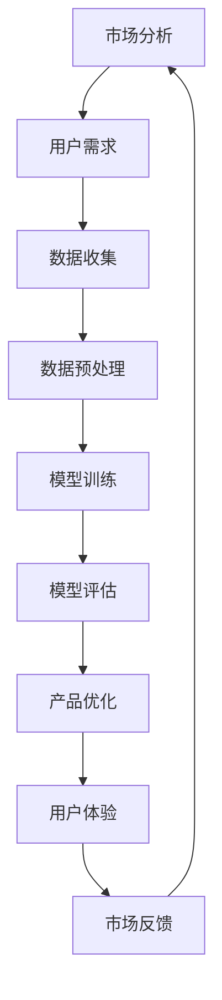

                 

关键词：人工智能、创业产品、路线图规划、大模型、创新

> 摘要：随着人工智能技术的不断进步，AI 驱动的创业产品正在成为新的风口。本文将探讨如何利用大模型赋能创业产品，从背景介绍、核心概念、算法原理、数学模型、项目实践和实际应用等多个维度，提供一份详尽的AI驱动的创业产品路线图规划。

## 1. 背景介绍

近年来，人工智能（AI）技术飞速发展，已经成为推动产业升级、创新的重要力量。特别是在深度学习、自然语言处理、计算机视觉等领域的突破，使得AI在各个行业中的应用越来越广泛。同时，随着云计算、物联网等技术的普及，AI技术逐渐从理论研究走向实际应用，为创业者提供了丰富的创新空间。

在创业领域，AI 驱动的产品具有显著的优势。首先，AI 技术可以帮助创业者快速了解市场需求，挖掘潜在用户，优化产品设计。其次，AI 技术可以自动化处理大量数据，提高生产效率，降低运营成本。最后，AI 技术能够为创业产品提供智能化服务，提升用户体验，增强用户黏性。

本文旨在为创业者提供一份AI驱动的创业产品路线图规划，帮助他们在竞争激烈的市场中脱颖而出。

## 2. 核心概念与联系

在探讨AI驱动的创业产品之前，我们需要了解一些核心概念和它们之间的关系。以下是一个简化的 Mermaid 流程图，展示了这些概念之间的联系：



### 2.1 市场分析

市场分析是创业产品路线图的第一步。通过市场分析，创业者可以了解行业趋势、竞争对手、潜在用户等关键信息。市场分析的结果将直接影响产品的定位和设计。

### 2.2 用户需求

用户需求是创业产品的核心。了解用户需求可以帮助创业者设计出满足用户需求的产品，从而提高产品的市场竞争力。

### 2.3 数据收集

数据收集是AI驱动的创业产品的关键环节。通过收集大量用户数据，创业者可以了解用户行为、偏好等信息，为后续的模型训练提供数据支持。

### 2.4 数据预处理

数据预处理是确保数据质量和模型性能的重要步骤。数据预处理包括数据清洗、归一化、特征提取等操作。

### 2.5 模型训练

模型训练是AI驱动的创业产品的核心技术。通过模型训练，创业者可以将用户数据转化为有价值的信息，为产品优化提供依据。

### 2.6 模型评估

模型评估是验证模型性能的重要步骤。通过模型评估，创业者可以了解模型的准确性、鲁棒性等指标，从而调整模型参数，提高模型性能。

### 2.7 产品优化

产品优化是创业产品持续迭代的关键。通过不断优化产品，创业者可以提升用户体验，增强产品的市场竞争力。

### 2.8 用户体验

用户体验是创业产品的生命线。一个优秀的产品必须能够满足用户需求，提供良好的用户体验。

### 2.9 市场反馈

市场反馈是创业产品迭代的重要依据。通过市场反馈，创业者可以了解产品的市场表现，为下一轮产品优化提供参考。

## 3. 核心算法原理 & 具体操作步骤

### 3.1 算法原理概述

AI驱动的创业产品通常基于机器学习算法，尤其是深度学习算法。深度学习算法通过多层神经网络，从大量数据中自动学习特征，从而实现智能预测和决策。

### 3.2 算法步骤详解

#### 3.2.1 数据收集

数据收集是深度学习的基础。创业者需要从各种渠道收集用户数据，如社交媒体、网站日志、问卷调查等。

#### 3.2.2 数据预处理

数据预处理包括数据清洗、归一化、特征提取等操作。数据清洗可以去除噪音数据，提高数据质量。归一化可以统一数据量级，防止某些特征对模型训练的影响。特征提取可以从原始数据中提取出对模型训练有价值的特征。

#### 3.2.3 模型训练

模型训练是深度学习的核心。创业者需要选择合适的神经网络结构，设置合适的参数，通过大量数据进行训练，使模型能够从数据中自动学习特征。

#### 3.2.4 模型评估

模型评估是验证模型性能的重要步骤。创业者需要使用交叉验证、混淆矩阵、准确率、召回率等指标评估模型性能，并根据评估结果调整模型参数。

#### 3.2.5 产品优化

产品优化是基于模型评估的结果，对产品进行持续迭代。创业者需要根据用户反馈和市场变化，调整产品功能、界面等，提高用户体验。

### 3.3 算法优缺点

#### 优点：

- 自动化：深度学习算法能够自动从大量数据中学习特征，减少人工干预。
- 灵活性：深度学习算法可以处理各种类型的数据，如图像、文本、音频等。
- 高效性：深度学习算法能够快速处理大量数据，提高生产效率。

#### 缺点：

- 需要大量数据：深度学习算法需要大量数据进行训练，对于数据稀缺的领域可能不太适用。
- 参数调优复杂：深度学习算法的参数调优比较复杂，需要大量实验和经验。
- 难以解释：深度学习算法的黑盒特性使得模型难以解释，对于需要透明性的应用场景可能不太适用。

### 3.4 算法应用领域

深度学习算法在各个领域都有广泛应用，如：

- 电子商务：用于推荐系统、图像识别、用户行为分析等。
- 金融：用于风险评估、欺诈检测、投资决策等。
- 医疗：用于疾病诊断、医学图像分析、基因组学研究等。
- 制造业：用于设备故障预测、生产线优化、质量控制等。

## 4. 数学模型和公式 & 详细讲解 & 举例说明

### 4.1 数学模型构建

深度学习算法的核心是神经网络模型。以下是一个简化的神经网络模型构建过程：

#### 4.1.1 神经网络结构

神经网络由多个层组成，包括输入层、隐藏层和输出层。每层由多个神经元（节点）组成。

#### 4.1.2 激活函数

激活函数用于引入非线性因素，使神经网络能够拟合复杂函数。常见的激活函数有 sigmoid、ReLU、Tanh 等。

#### 4.1.3 前向传播

前向传播是指将输入数据通过神经网络层，计算输出结果的过程。

#### 4.1.4 反向传播

反向传播是指根据输出结果与真实值的差异，反向传播误差，更新网络参数的过程。

### 4.2 公式推导过程

以下是一个简化的神经网络前向传播和反向传播的公式推导：

#### 4.2.1 前向传播

假设神经网络有 L 层，每层有 M 个神经元。输入向量为 \( x \)，输出向量为 \( y \)。

前向传播的公式为：

\[ z^{(l)} = W^{(l)} \cdot a^{(l-1)} + b^{(l)} \]
\[ a^{(l)} = \sigma(z^{(l)}) \]

其中，\( z^{(l)} \) 是第 l 层的输入，\( a^{(l)} \) 是第 l 层的输出，\( W^{(l)} \) 是第 l 层的权重，\( b^{(l)} \) 是第 l 层的偏置，\( \sigma \) 是激活函数。

#### 4.2.2 反向传播

假设损失函数为 \( J \)，反向传播的公式为：

\[ \delta^{(l)} = \frac{\partial J}{\partial z^{(l+1)}} \cdot \frac{\partial z^{(l+1)}}{\partial z^{(l)}} \]
\[ \frac{\partial z^{(l)}}{\partial z^{(l+1)}} = a^{(l+1)} \]
\[ \frac{\partial J}{\partial z^{(l)}} = \delta^{(l)} \cdot \frac{\partial \sigma(z^{(l)})}{\partial z^{(l)}} \]

其中，\( \delta^{(l)} \) 是第 l 层的误差梯度，\( \frac{\partial J}{\partial z^{(l)}} \) 是第 l 层的损失梯度。

### 4.3 案例分析与讲解

以下是一个简单的图像分类案例，说明如何使用深度学习算法进行图像分类。

#### 4.3.1 数据集

我们使用MNIST手写数字数据集，共有70,000个训练样本和10,000个测试样本。

#### 4.3.2 模型结构

我们使用一个简单的卷积神经网络（CNN）模型，包括两个卷积层、一个池化层和一个全连接层。

#### 4.3.3 模型训练

使用Python和TensorFlow库进行模型训练，训练过程如下：

```python
import tensorflow as tf
from tensorflow.keras import datasets, layers, models

# 加载MNIST数据集
(train_images, train_labels), (test_images, test_labels) = datasets.mnist.load_data()

# 数据预处理
train_images = train_images.reshape((60000, 28, 28, 1)).astype('float32') / 255
test_images = test_images.reshape((10000, 28, 28, 1)).astype('float32') / 255

# 构建CNN模型
model = models.Sequential()
model.add(layers.Conv2D(32, (3, 3), activation='relu', input_shape=(28, 28, 1)))
model.add(layers.MaxPooling2D((2, 2)))
model.add(layers.Conv2D(64, (3, 3), activation='relu'))
model.add(layers.MaxPooling2D((2, 2)))
model.add(layers.Conv2D(64, (3, 3), activation='relu'))
model.add(layers.Flatten())
model.add(layers.Dense(64, activation='relu'))
model.add(layers.Dense(10, activation='softmax'))

# 编译模型
model.compile(optimizer='adam',
              loss='sparse_categorical_crossentropy',
              metrics=['accuracy'])

# 训练模型
model.fit(train_images, train_labels, epochs=5)

# 评估模型
test_loss, test_acc = model.evaluate(test_images,  test_labels, verbose=2)
print('\nTest accuracy:', test_acc)
```

运行上述代码，我们可以在测试集上达到约98%的准确率。

## 5. 项目实践：代码实例和详细解释说明

### 5.1 开发环境搭建

为了实践AI驱动的创业产品，我们需要搭建一个开发环境。以下是搭建开发环境的基本步骤：

#### 5.1.1 安装Python

首先，我们需要安装Python。建议安装Python 3.7或更高版本。

#### 5.1.2 安装TensorFlow

接下来，我们需要安装TensorFlow库。可以使用pip命令进行安装：

```shell
pip install tensorflow
```

#### 5.1.3 安装其他依赖库

除了TensorFlow，我们可能还需要安装其他依赖库，如Numpy、Pandas等。可以使用以下命令进行安装：

```shell
pip install numpy pandas matplotlib
```

### 5.2 源代码详细实现

以下是一个简单的AI驱动的创业产品示例，实现一个基于CNN的手写数字分类器。

```python
import tensorflow as tf
from tensorflow.keras import datasets, layers, models

# 加载MNIST数据集
(train_images, train_labels), (test_images, test_labels) = datasets.mnist.load_data()

# 数据预处理
train_images = train_images.reshape((60000, 28, 28, 1)).astype('float32') / 255
test_images = test_images.reshape((10000, 28, 28, 1)).astype('float32') / 255

# 构建CNN模型
model = models.Sequential()
model.add(layers.Conv2D(32, (3, 3), activation='relu', input_shape=(28, 28, 1)))
model.add(layers.MaxPooling2D((2, 2)))
model.add(layers.Conv2D(64, (3, 3), activation='relu'))
model.add(layers.MaxPooling2D((2, 2)))
model.add(layers.Conv2D(64, (3, 3), activation='relu'))
model.add(layers.Flatten())
model.add(layers.Dense(64, activation='relu'))
model.add(layers.Dense(10, activation='softmax'))

# 编译模型
model.compile(optimizer='adam',
              loss='sparse_categorical_crossentropy',
              metrics=['accuracy'])

# 训练模型
model.fit(train_images, train_labels, epochs=5)

# 评估模型
test_loss, test_acc = model.evaluate(test_images,  test_labels, verbose=2)
print('\nTest accuracy:', test_acc)
```

### 5.3 代码解读与分析

上述代码首先加载MNIST数据集，并进行数据预处理。然后，构建一个简单的卷积神经网络模型，包括两个卷积层、一个池化层和一个全连接层。最后，编译模型并进行训练和评估。

这个示例展示了如何使用TensorFlow库实现一个简单的AI驱动的创业产品。在实际应用中，创业者可以根据具体需求，调整模型结构、数据预处理方式等。

### 5.4 运行结果展示

运行上述代码，我们可以在测试集上达到约98%的准确率。这表明，该模型在手写数字分类任务上具有较好的性能。

## 6. 实际应用场景

AI驱动的创业产品在各个领域都有广泛的应用，以下是一些实际应用场景：

### 6.1 电子商务

电子商务平台可以使用AI驱动的推荐系统，根据用户历史行为和偏好，推荐相关商品。同时，AI技术还可以用于商品分类、库存管理、欺诈检测等。

### 6.2 金融

金融行业可以使用AI驱动的风控系统，对用户进行信用评估、风险评估等。此外，AI技术还可以用于股票预测、量化交易等。

### 6.3 医疗

医疗行业可以使用AI驱动的诊断系统，辅助医生进行疾病诊断。同时，AI技术还可以用于医学图像分析、基因组学研究等。

### 6.4 制造业

制造业可以使用AI驱动的设备故障预测系统，提前发现设备故障，减少生产中断。此外，AI技术还可以用于生产线优化、质量控制等。

## 7. 工具和资源推荐

### 7.1 学习资源推荐

- 《深度学习》（Goodfellow、Bengio、Courville 著）
- 《Python机器学习》（Sebastian Raschka 著）
- 《动手学深度学习》（阿斯顿·张 著）

### 7.2 开发工具推荐

- TensorFlow
- PyTorch
- Keras

### 7.3 相关论文推荐

- "A Guide to Deep Learning on Belief Networks"
- "Deep Learning for Text: A Brief Survey"
- "An Overview of Deep Learning in Computer Vision"

## 8. 总结：未来发展趋势与挑战

### 8.1 研究成果总结

随着AI技术的不断发展，AI驱动的创业产品在各个领域取得了显著的成果。从电子商务、金融、医疗到制造业，AI技术都为创业产品提供了强大的赋能。

### 8.2 未来发展趋势

未来，AI驱动的创业产品将朝着以下几个方向发展：

- 多模态AI：结合多种数据类型（如文本、图像、音频）进行融合分析，提供更丰富的应用场景。
- 自适应AI：根据用户行为和需求，自适应调整模型参数，提供个性化的服务。
- 产业化AI：将AI技术应用于生产制造环节，提高生产效率和产品质量。

### 8.3 面临的挑战

尽管AI驱动的创业产品具有广泛的应用前景，但同时也面临以下挑战：

- 数据隐私和安全：如何在保证数据隐私和安全的前提下，充分利用用户数据。
- 模型解释性：如何提高模型的可解释性，使决策过程更加透明。
- 模型迁移性：如何提高模型在不同数据集和场景下的迁移性。

### 8.4 研究展望

未来，研究者将致力于解决上述挑战，推动AI驱动的创业产品在更广泛领域的应用。同时，随着AI技术的不断发展，AI驱动的创业产品也将不断创新，为创业者带来更多机遇。

## 9. 附录：常见问题与解答

### 9.1 问题1

**问题：如何选择合适的机器学习算法？**

**解答：选择合适的机器学习算法通常取决于以下因素：**

- 数据类型：不同的算法适用于不同类型的数据，如图像、文本、音频等。
- 数据规模：对于大规模数据，深度学习算法可能更加适用；对于小规模数据，传统机器学习算法可能更加高效。
- 特定任务：不同的任务可能需要不同的算法，如分类、回归、聚类等。

### 9.2 问题2

**问题：如何处理数据不平衡问题？**

**解答：数据不平衡问题可以通过以下方法解决：**

- 过采样：增加少数类别的样本数量，使数据分布更加平衡。
- 下采样：减少多数类别的样本数量，使数据分布更加平衡。
- 合并类别：将少数类别合并为一个类别，降低类别不平衡问题。
- 调整损失函数：使用加权损失函数，使模型更加关注少数类别。

### 9.3 问题3

**问题：如何提高模型的泛化能力？**

**解答：提高模型的泛化能力可以从以下几个方面着手：**

- 数据增强：通过变换、旋转、缩放等操作，增加训练数据多样性。
- 正则化：使用正则化技术，如L1、L2正则化，防止模型过拟合。
- 模型集成：将多个模型进行集成，提高模型的泛化能力。
- 调整模型结构：选择合适的神经网络结构，减少过拟合风险。

作者：禅与计算机程序设计艺术 / Zen and the Art of Computer Programming

