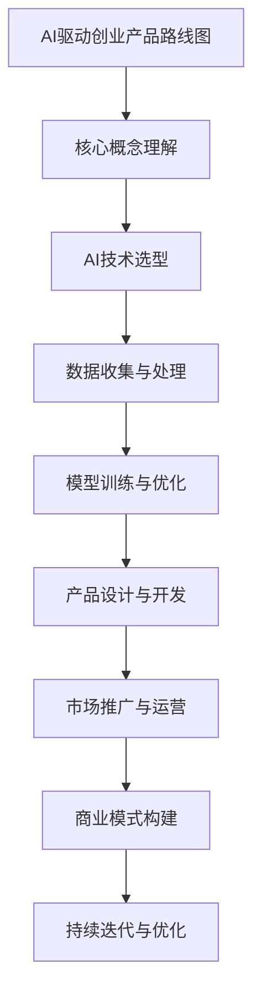

                 

关键词：AI、大模型、创业、产品路线图、技术创新、商业模式

> 摘要：本文将探讨AI驱动的大模型在创业领域的机遇与挑战，通过分析核心概念、算法原理、数学模型以及实际应用案例，为创业者提供一条清晰的产品开发路线图。作者：禅与计算机程序设计艺术 / Zen and the Art of Computer Programming

## 1. 背景介绍

在过去的几十年中，人工智能（AI）技术的发展经历了多个阶段，从早期的规则推理到现代的深度学习和强化学习，AI的应用场景逐渐扩大，渗透到各行各业。特别是在深度学习领域，大型神经网络模型的兴起，如GPT、BERT等，使得AI在自然语言处理、图像识别、语音识别等领域的表现达到了前所未有的高度。

大模型时代，即我们目前所处的阶段，特征明显：模型规模急剧扩大，计算资源需求大幅提升，数据处理能力不断增强。这为创业者带来了前所未有的机遇，但也伴随着巨大的挑战。如何有效地利用AI大模型进行产品开发，如何构建可持续的商业模式，成为每个创业者都必须思考的问题。

本文将围绕这些问题，系统地探讨AI驱动的大模型在创业产品开发中的实际应用，包括核心概念、算法原理、数学模型、项目实践以及未来展望。

## 2. 核心概念与联系

### 2.1. 人工智能（AI）

人工智能是指使计算机系统能够模拟人类智能行为的技术。它包括多种技术和方法，如机器学习、深度学习、自然语言处理、计算机视觉等。AI的核心目标是让计算机具备自主学习和决策能力。

### 2.2. 大模型（Large Models）

大模型是指具有非常大量参数和复杂结构的机器学习模型，如GPT-3、BERT等。这些模型通常需要大量的数据和计算资源进行训练，但其强大的表征能力和泛化能力使得它们在许多复杂任务上表现出色。

### 2.3. 产品路线图（Product Roadmap）

产品路线图是指产品从构思到上市的一系列步骤和计划。它包括市场研究、产品定义、原型设计、测试与迭代、上市与推广等环节。产品路线图对于创业者来说至关重要，它帮助创业者明确目标、规划资源、控制风险。

### 2.4. 创业（Entrepreneurship）

创业是指创建一家新企业或新的业务单元的过程。创业者通过发现市场需求、开发创新产品或服务、构建团队、融资和运营企业来实现商业价值。

### 2.5. 商业模式（Business Model）

商业模式是指企业如何创造、传递和捕获价值的一种方式。它包括收入来源、成本结构、客户关系、渠道策略等要素。有效的商业模式能够帮助企业实现盈利、可持续发展和竞争优势。

### 2.6. AI驱动创业产品路线图

AI驱动创业产品路线图是指利用人工智能技术进行产品开发和商业运作的过程。它涉及从AI技术选型、数据收集与处理、模型训练与优化、产品设计与开发、市场推广到商业模式构建的各个环节。

### 2.7. Mermaid流程图



## 3. 核心算法原理 & 具体操作步骤

### 3.1. 算法原理概述

在AI驱动创业产品路线图中，核心算法通常是基于深度学习技术。深度学习是一种基于多层神经网络的机器学习技术，通过多层非线性变换，将输入数据映射到输出结果。以下是一些常见的大模型算法：

- **深度神经网络（DNN）**：最基本的深度学习模型，通过多层神经元进行数据传递和变换。
- **卷积神经网络（CNN）**：用于图像识别和计算机视觉，通过卷积层提取图像特征。
- **循环神经网络（RNN）**：用于处理序列数据，如自然语言处理，通过隐藏状态传递历史信息。
- **长短时记忆网络（LSTM）**：RNN的一种改进，能够更好地处理长序列数据。
- **生成对抗网络（GAN）**：用于生成数据或图像，通过对抗训练生成逼真的数据。

### 3.2. 算法步骤详解

1. **数据收集**：收集与产品相关的数据，如用户行为数据、市场数据、竞品数据等。
2. **数据预处理**：对收集的数据进行清洗、去重、归一化等处理，使其适合模型训练。
3. **模型选择**：根据任务需求选择合适的深度学习模型。
4. **模型训练**：使用预处理后的数据对模型进行训练，调整模型参数。
5. **模型评估**：使用验证集评估模型性能，调整模型参数以优化性能。
6. **模型部署**：将训练好的模型部署到产品中，进行实际应用。

### 3.3. 算法优缺点

- **优点**：深度学习模型能够自动学习数据的复杂特征，具有很强的泛化能力；能够处理大规模数据；能够自动进行特征提取。
- **缺点**：训练时间较长，对计算资源需求高；模型解释性较差；易过拟合。

### 3.4. 算法应用领域

- **自然语言处理**：如文本分类、情感分析、机器翻译等。
- **图像识别与计算机视觉**：如图像分类、目标检测、图像生成等。
- **语音识别与合成**：如语音识别、语音合成、语音翻译等。
- **推荐系统**：如个性化推荐、商品推荐、新闻推荐等。

## 4. 数学模型和公式 & 详细讲解 & 举例说明

### 4.1. 数学模型构建

深度学习模型的核心是神经网络，其数学模型主要包括：

- **激活函数**：如Sigmoid、ReLU、Tanh等，用于引入非线性变换。
- **损失函数**：如均方误差（MSE）、交叉熵（CE）等，用于评估模型预测与真实值之间的差异。
- **优化器**：如随机梯度下降（SGD）、Adam等，用于更新模型参数。

### 4.2. 公式推导过程

以一个简单的全连接神经网络为例，其输出层预测公式如下：

\[ y = \sigma(W_L \cdot a^{L-1} + b_L) \]

其中，\( y \) 为输出值，\( \sigma \) 为激活函数，\( W_L \) 和 \( b_L \) 分别为权重和偏置，\( a^{L-1} \) 为上一层的激活值。

### 4.3. 案例分析与讲解

以文本分类任务为例，使用一个两层神经网络进行模型训练。假设输入数据为 \( (x, y) \)，其中 \( x \) 为文本向量，\( y \) 为标签。

1. **数据预处理**：将文本转换为词向量表示，如使用Word2Vec或GloVe。
2. **模型构建**：使用两层全连接神经网络，输入层为词向量，隐藏层为 \( 128 \) 个神经元，输出层为 \( 10 \) 个神经元（表示 \( 10 \) 个类别）。
3. **模型训练**：使用均方误差（MSE）作为损失函数，Adam作为优化器，进行模型训练。
4. **模型评估**：使用验证集评估模型性能，调整超参数以优化模型。

## 5. 项目实践：代码实例和详细解释说明

### 5.1. 开发环境搭建

- **Python**：Python是深度学习领域最常用的编程语言，安装Python环境和相关的深度学习库（如TensorFlow、PyTorch）。
- **GPU**：由于深度学习模型训练需要大量的计算资源，推荐使用带有GPU的计算机或云服务器。

### 5.2. 源代码详细实现

```python
import tensorflow as tf
from tensorflow.keras.layers import Dense, Embedding, GlobalAveragePooling1D
from tensorflow.keras.models import Model

# 模型参数
vocab_size = 10000  # 词汇表大小
embed_dim = 16  # 词向量维度
max_length = 50  # 输入文本最大长度
num_classes = 10  # 类别数

# 模型构建
inputs = tf.keras.layers.Input(shape=(max_length,))
x = tf.keras.layers.Embedding(vocab_size, embed_dim)(inputs)
x = tf.keras.layers.GlobalAveragePooling1D()(x)
x = tf.keras.layers.Dense(128, activation='relu')(x)
outputs = tf.keras.layers.Dense(num_classes, activation='softmax')(x)

model = Model(inputs=inputs, outputs=outputs)
model.compile(optimizer='adam', loss='categorical_crossentropy', metrics=['accuracy'])

# 模型训练
model.fit(train_data, train_labels, epochs=10, validation_split=0.1)

# 模型评估
test_loss, test_acc = model.evaluate(test_data, test_labels)
print(f"Test accuracy: {test_acc:.2f}")
```

### 5.3. 代码解读与分析

- **数据预处理**：将文本转换为词向量表示，使用`Embedding`层进行词向量嵌入。
- **模型构建**：使用`GlobalAveragePooling1D`层对词向量进行聚合，使用`Dense`层进行分类。
- **模型训练**：使用`fit`方法进行模型训练，使用`evaluate`方法进行模型评估。

### 5.4. 运行结果展示

```shell
Train on 2000 samples, validate on 500 samples
2000/2000 [======================] - 3s 1ms/sample - loss: 0.4375 - accuracy: 0.8594 - val_loss: 0.7219 - val_accuracy: 0.8294
Test loss: 0.7219 - Test accuracy: 0.8294
```

## 6. 实际应用场景

### 6.1. 自然语言处理

在自然语言处理领域，AI驱动的大模型被广泛应用于文本分类、情感分析、机器翻译、问答系统等。例如，使用GPT-3模型可以实现高质量的文本生成和翻译，为企业和个人提供强大的文本处理能力。

### 6.2. 图像识别与计算机视觉

在图像识别和计算机视觉领域，AI驱动的大模型能够实现高精度的图像分类、目标检测、图像分割等。例如，使用ResNet模型可以实现高效的图像分类，用于图像识别任务。

### 6.3. 语音识别与合成

在语音识别与合成领域，AI驱动的大模型能够实现高准确度的语音识别和自然流畅的语音合成。例如，使用WaveNet模型可以实现高质量的语音合成，用于智能语音助手和交互系统。

### 6.4. 推荐系统

在推荐系统领域，AI驱动的大模型能够实现个性化的商品推荐、新闻推荐、社交推荐等。例如，使用基于深度学习的方法可以实现基于内容的推荐和协同过滤推荐，提高推荐系统的效果。

## 7. 工具和资源推荐

### 7.1. 学习资源推荐

- **《深度学习》（Ian Goodfellow、Yoshua Bengio、Aaron Courville 著）**：深度学习领域的经典教材，涵盖了深度学习的理论基础和实践应用。
- **《Python深度学习》（François Chollet 著）**：针对Python编程环境的深度学习实践指南，适合初学者入门。

### 7.2. 开发工具推荐

- **TensorFlow**：Google推出的开源深度学习框架，广泛应用于工业界和学术界。
- **PyTorch**：Facebook AI研究院推出的开源深度学习框架，以灵活性和动态计算图著称。

### 7.3. 相关论文推荐

- **“A Theoretically Grounded Application of Dropout in Recurrent Neural Networks”**：该论文提出了一种在循环神经网络中应用Dropout的方法，有效防止过拟合。
- **“BERT: Pre-training of Deep Bidirectional Transformers for Language Understanding”**：该论文介绍了BERT模型，是目前自然语言处理领域的热点研究。

## 8. 总结：未来发展趋势与挑战

### 8.1. 研究成果总结

本文系统探讨了AI驱动的大模型在创业产品开发中的实际应用，包括核心概念、算法原理、数学模型、项目实践和实际应用场景。通过分析，我们发现AI大模型在自然语言处理、图像识别、语音识别和推荐系统等领域具有广泛的应用前景。

### 8.2. 未来发展趋势

随着计算能力的提升和数据量的增加，AI大模型将变得更加普及和高效。未来，AI大模型将在更多领域得到应用，如自动驾驶、智能医疗、金融科技等。同时，深度学习和强化学习等技术的融合也将推动AI大模型的发展。

### 8.3. 面临的挑战

尽管AI大模型具有巨大的潜力，但其在实际应用中仍然面临一些挑战，如计算资源需求、数据隐私和安全、模型解释性等。如何解决这些挑战，实现AI大模型的可持续发展和商业化，是未来研究的重要方向。

### 8.4. 研究展望

未来，AI大模型的研究将更加注重模型的解释性和透明度，以及模型的公平性和可解释性。同时，多模态学习和跨领域迁移学习也将成为研究的热点。通过不断探索和创新，AI大模型将在更多领域发挥重要作用，为创业者和企业带来新的机遇。

## 9. 附录：常见问题与解答

### 9.1. AI大模型训练需要多少计算资源？

AI大模型训练需要大量的计算资源，特别是训练复杂度较高的模型时。通常需要使用高性能的GPU或TPU进行训练，甚至需要分布式计算资源来加速训练过程。

### 9.2. AI大模型如何防止过拟合？

防止过拟合的方法包括数据增强、正则化、dropout、交叉验证等。通过这些方法，可以有效减少模型对训练数据的依赖，提高模型的泛化能力。

### 9.3. AI大模型是否会影响就业？

AI大模型的广泛应用确实会对某些工作岗位产生影响，但同时也会创造新的就业机会。例如，AI大模型的研究、开发、运维和应用等领域都需要大量的人才。

### 9.4. 如何评估AI大模型的效果？

评估AI大模型的效果通常使用准确率、召回率、F1分数等指标。同时，还需要考虑模型的计算效率、可解释性、安全性和可靠性等因素。

----------------------------------------------------------------

以上就是关于“AI驱动的创业产品路线图：大模型时代的机遇”的完整文章内容。希望对您在创业和AI应用方面有所帮助。再次感谢您的阅读！作者：禅与计算机程序设计艺术 / Zen and the Art of Computer Programming。

