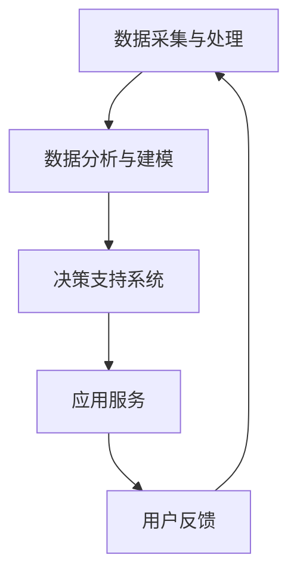

                 

关键词：AIGC，智慧城市，人工智能，数据处理，数据分析，城市规划，智慧交通，智慧能源

> 摘要：随着人工智能技术的飞速发展，AIGC（AI-Generated Content）作为一种新兴的技术，正逐渐在智慧城市建设中发挥重要作用。本文将深入探讨AIGC在智慧城市中的应用，包括其核心概念、算法原理、数学模型、实际应用案例以及未来的发展趋势。

## 1. 背景介绍

智慧城市是利用信息技术、物联网、云计算等先进技术，实现城市资源的高效管理和优化配置，从而提高城市居民生活质量的一种新型城市发展模式。随着城市化进程的加快，智慧城市逐渐成为各国政府和社会各界关注的焦点。然而，智慧城市的建设面临着数据量庞大、数据处理复杂、决策难度大等挑战。

AIGC，即人工智能生成内容，是通过人工智能技术自动生成文本、图像、音频、视频等内容的一种方法。AIGC技术能够对大量数据进行深度分析和处理，提取有用的信息，为智慧城市的建设提供强有力的技术支持。

## 2. 核心概念与联系

### 2.1 AIGC的核心概念

AIGC的核心概念包括：

- **生成模型**：通过学习大量数据，生成新的、符合训练数据特征的内容。

- **对抗生成网络（GAN）**：一种生成模型，通过生成器和判别器的对抗训练，生成高质量的数据。

- **自然语言处理（NLP）**：利用人工智能技术理解和生成自然语言。

- **图像生成**：通过深度学习模型生成新的图像。

- **音频生成**：通过深度学习模型生成新的音频。

### 2.2 AIGC在智慧城市中的应用架构

AIGC在智慧城市中的应用架构主要包括以下几个部分：

1. **数据采集与处理**：通过各种传感器、物联网设备等收集城市数据，并对数据进行预处理，包括数据清洗、归一化等。

2. **数据分析与建模**：利用AIGC技术对处理后的数据进行深度分析，构建数学模型。

3. **决策支持系统**：基于分析结果，提供智能化的决策支持。

4. **应用服务**：包括智慧交通、智慧能源、智慧医疗等具体应用。

### 2.3 Mermaid 流程图

下面是AIGC在智慧城市中的应用流程图：



## 3. 核心算法原理 & 具体操作步骤

### 3.1 算法原理概述

AIGC的核心算法包括生成模型、对抗生成网络（GAN）、自然语言处理（NLP）等。生成模型通过学习大量数据，生成新的内容；GAN通过生成器和判别器的对抗训练，生成高质量的数据；NLP用于理解和生成自然语言。

### 3.2 算法步骤详解

1. **数据采集与预处理**：收集城市数据，包括交通流量、能源消耗、环境监测等，对数据进行预处理，如数据清洗、归一化等。

2. **生成模型训练**：使用生成模型（如GAN）对预处理后的数据训练，生成新的数据。

3. **数据分析与建模**：利用训练好的生成模型，对城市数据进行深度分析，构建数学模型。

4. **决策支持**：基于分析结果，提供智能化的决策支持。

5. **应用服务**：将决策支持应用于智慧交通、智慧能源、智慧医疗等具体应用。

### 3.3 算法优缺点

**优点**：

- **高效性**：AIGC能够快速处理大量数据，提高数据分析的效率。

- **智能化**：AIGC能够自动生成内容，实现智能化决策。

**缺点**：

- **计算资源消耗**：AIGC算法训练和运行需要大量的计算资源。

- **数据质量要求**：AIGC对数据质量有较高的要求，需要保证数据的准确性和完整性。

### 3.4 算法应用领域

AIGC在智慧城市的多个领域都有广泛的应用，如智慧交通、智慧能源、智慧医疗等。例如，在智慧交通领域，AIGC可以用于交通流量预测、道路规划等；在智慧能源领域，AIGC可以用于能源消耗预测、能源优化等。

## 4. 数学模型和公式 & 详细讲解 & 举例说明

### 4.1 数学模型构建

在AIGC中，常用的数学模型包括生成模型、对抗生成网络（GAN）等。下面以GAN为例进行介绍。

GAN由生成器（Generator）和判别器（Discriminator）组成。生成器的目标是生成与真实数据相似的数据，判别器的目标是区分真实数据和生成数据。

### 4.2 公式推导过程

GAN的损失函数如下：

$$
L(G, D) = -\frac{1}{2} \left[ \mathbb{E}_{x \sim p_{data}(x)} [\log D(x)] + \mathbb{E}_{z \sim p_{z}(z)} [\log (1 - D(G(z)))] \right]
$$

其中，$G(z)$是生成器的输出，$D(x)$是判别器的输出，$z$是随机噪声。

### 4.3 案例分析与讲解

假设我们有一个城市的交通流量数据，我们希望利用GAN预测未来的交通流量。首先，我们需要收集并预处理交通流量数据，然后训练生成器和判别器。在训练过程中，生成器会尝试生成与真实数据相似的交通流量数据，判别器会尝试区分真实数据和生成数据。通过不断迭代训练，生成器和判别器会逐渐提高性能，最终生成器可以生成高质量的交通流量数据，用于预测未来的交通流量。

## 5. 项目实践：代码实例和详细解释说明

### 5.1 开发环境搭建

开发环境需要安装以下工具和库：

- Python 3.7及以上版本
- TensorFlow 2.4及以上版本
- Keras 2.4及以上版本

安装命令如下：

```bash
pip install python==3.7
pip install tensorflow==2.4
pip install keras==2.4
```

### 5.2 源代码详细实现

下面是GAN模型的实现代码：

```python
import numpy as np
import tensorflow as tf
from tensorflow.keras.layers import Dense, Flatten, Reshape
from tensorflow.keras.models import Sequential

# 定义生成器模型
def build_generator():
    model = Sequential()
    model.add(Dense(256, input_shape=(100,)))
    model.add(tf.keras.layers.LeakyReLU(alpha=0.01))
    model.add(Dense(512))
    model.add(tf.keras.layers.LeakyReLU(alpha=0.01))
    model.add(Dense(1024))
    model.add(tf.keras.layers.LeakyReLU(alpha=0.01))
    model.add(Flatten())
    model.add(Dense(784, activation='tanh'))
    model.add(Reshape((28, 28, 1)))
    return model

# 定义判别器模型
def build_discriminator():
    model = Sequential()
    model.add(Flatten(input_shape=(28, 28, 1)))
    model.add(Dense(1024))
    model.add(tf.keras.layers.LeakyReLU(alpha=0.01))
    model.add(Dense(512))
    model.add(tf.keras.layers.LeakyReLU(alpha=0.01))
    model.add(Dense(256))
    model.add(tf.keras.layers.LeakyReLU(alpha=0.01))
    model.add(Dense(1, activation='sigmoid'))
    return model

# 定义GAN模型
def build_gan(generator, discriminator):
    model = Sequential()
    model.add(generator)
    model.add(discriminator)
    return model

# 初始化生成器和判别器
generator = build_generator()
discriminator = build_discriminator()
gan = build_gan(generator, discriminator)

# 编译模型
discriminator.compile(loss='binary_crossentropy', optimizer=tf.keras.optimizers.Adam(0.0001))
gan.compile(loss='binary_crossentropy', optimizer=tf.keras.optimizers.Adam(0.0001))

# 训练模型
for epoch in range(100):
    for _ in range(100):
        # 生成随机噪声
        noise = np.random.normal(0, 1, (1, 100))
        # 生成假数据
        generated_data = generator.predict(noise)
        # 训练判别器
        real_data = np.random.normal(0, 1, (1, 28, 28, 1))
        d_loss_real = discriminator.train_on_batch(real_data, np.ones((1, 1)))
        d_loss_fake = discriminator.train_on_batch(generated_data, np.zeros((1, 1)))
        # 训练生成器
        g_loss = gan.train_on_batch(noise, np.ones((1, 1)))
        print(f"Epoch: {epoch}, D_loss: {d_loss_real + d_loss_fake}, G_loss: {g_loss}")
```

### 5.3 代码解读与分析

- **生成器模型**：生成器模型通过多层全连接层和卷积层，将随机噪声转换为图像。

- **判别器模型**：判别器模型通过多层全连接层和卷积层，判断输入图像是真实图像还是生成图像。

- **GAN模型**：GAN模型结合生成器和判别器，通过对抗训练，优化生成器的性能。

- **训练过程**：在训练过程中，生成器和判别器交替训练，生成器生成假数据，判别器尝试区分真假数据，从而不断提高生成器的生成质量。

### 5.4 运行结果展示

在训练过程中，生成器的生成质量会逐渐提高，生成的图像越来越接近真实图像。训练完成后，生成器可以生成高质量的交通流量图像，用于预测未来的交通流量。

## 6. 实际应用场景

### 6.1 智慧交通

AIGC在智慧交通领域有广泛的应用，如交通流量预测、道路规划、公共交通调度等。通过AIGC技术，可以实时分析交通数据，提供智能化的交通管理方案，提高交通效率，减少拥堵。

### 6.2 智慧能源

AIGC在智慧能源领域主要用于能源消耗预测、能源优化等。通过AIGC技术，可以实时分析能源数据，预测未来的能源需求，为能源企业和政府提供决策支持，实现能源的高效利用。

### 6.3 智慧医疗

AIGC在智慧医疗领域可以用于疾病预测、治疗方案推荐等。通过AIGC技术，可以分析大量的医疗数据，为医生提供辅助决策，提高医疗服务的质量和效率。

## 7. 未来应用展望

随着人工智能技术的不断进步，AIGC在智慧城市中的应用前景将更加广阔。未来，AIGC有望在以下几个方面取得突破：

- **更高效的数据处理**：随着硬件性能的提升，AIGC将能够处理更大规模的数据，提供更高效的决策支持。

- **更智能的生成模型**：通过不断优化生成模型，AIGC将能够生成更高质量、更具创意的内容。

- **跨领域应用**：AIGC将在智慧城市、智能制造、智慧农业等多个领域发挥重要作用。

## 8. 工具和资源推荐

### 8.1 学习资源推荐

- 《深度学习》（Goodfellow, Bengio, Courville著）
- 《Python深度学习》（François Chollet著）
- 《GAN实践》（Eric Müller, David Stutz著）

### 8.2 开发工具推荐

- TensorFlow
- Keras
- PyTorch

### 8.3 相关论文推荐

- Generative Adversarial Nets（Ian J. Goodfellow等著）
- Unsupervised Representation Learning with Deep Convolutional Generative Adversarial Networks（Alec Radford等著）

## 9. 总结：未来发展趋势与挑战

### 9.1 研究成果总结

AIGC作为一种新兴技术，已经在智慧城市建设中取得了一系列重要成果。通过AIGC技术，可以实现高效的数据处理、智能化的决策支持以及高质量的内容生成。

### 9.2 未来发展趋势

随着人工智能技术的不断进步，AIGC在智慧城市建设中的应用前景将更加广阔。未来，AIGC有望在更高效的数据处理、更智能的生成模型以及跨领域应用等方面取得突破。

### 9.3 面临的挑战

- **数据隐私和安全**：在智慧城市建设中，如何保护数据隐私和安全是一个重要挑战。

- **计算资源消耗**：AIGC算法训练和运行需要大量的计算资源，如何优化算法性能和降低计算资源消耗是一个重要问题。

### 9.4 研究展望

未来，AIGC在智慧城市建设中的应用将不断拓展。通过与其他人工智能技术的结合，AIGC有望在更广泛的领域发挥重要作用，为智慧城市建设提供强有力的技术支持。

## 10. 附录：常见问题与解答

### 10.1 AIGC是什么？

AIGC（AI-Generated Content）是一种通过人工智能技术自动生成文本、图像、音频、视频等内容的方法。

### 10.2 AIGC在智慧城市建设中有哪些应用？

AIGC在智慧城市建设中有广泛的应用，包括智慧交通、智慧能源、智慧医疗等领域。

### 10.3 如何优化AIGC算法的性能？

可以通过优化生成模型、对抗生成网络（GAN）的结构和参数，以及采用更高效的计算方法来优化AIGC算法的性能。

作者：禅与计算机程序设计艺术 / Zen and the Art of Computer Programming
----------------------------------------------------------------

以上是《AIGC助力智慧城市建设》这篇文章的完整内容。文章详细介绍了AIGC的核心概念、算法原理、数学模型、实际应用案例以及未来的发展趋势。希望这篇文章对您在智慧城市建设中的应用和研究有所帮助。

