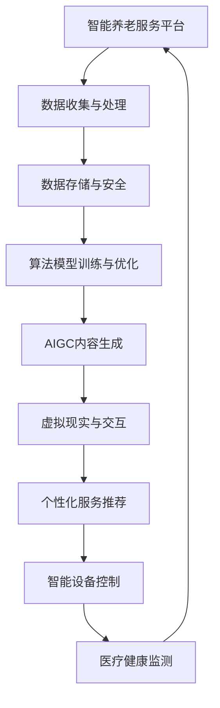

                 

关键词：AIGC、智能养老、服务创新、技术融合、数据处理

> 摘要：本文旨在探讨如何利用先进的AIGC（AI-Generated Content）技术，助力构建智能化养老服务生态系统，提高老年群体的生活质量和幸福感。文章将分析AIGC的核心概念，介绍其与智能养老服务的深度融合方法，探讨未来发展趋势及面临的挑战。

## 1. 背景介绍

### 智能养老服务的现状与需求

随着全球人口老龄化趋势的加剧，老年人口的快速增长使得传统养老服务模式面临前所未有的压力。传统的养老服务主要依赖于人力，效率低下，成本高昂，且难以满足老年人多样化的需求。因此，构建智能化、个性化的养老服务模式成为当务之急。

智能化养老服务不仅要求提供基本的日常生活照顾，还需关注老年人的心理健康、社交需求以及个性化服务。这一需求促使了人工智能技术的广泛应用，尤其是生成式人工智能（AIGC）技术的兴起，为智能养老服务带来了新的机遇和挑战。

### AIGC技术的概念与发展

AIGC是一种利用人工智能技术自动生成内容的方法，包括文本、图像、音频等多种形式。它基于深度学习和自然语言处理技术，通过大数据训练和模型优化，实现内容创作的高效性和多样性。AIGC的发展，尤其是近年来在生成对抗网络（GAN）、变分自编码器（VAE）等技术的推动下，取得了显著突破。

AIGC技术在多个领域展现出了强大的应用潜力，如内容创作、娱乐、医疗、金融等。在智能养老服务领域，AIGC技术可以应用于智能助理、个性化推荐、虚拟现实等场景，为老年人提供更加便捷、高效、个性化的服务。

## 2. 核心概念与联系

### AIGC的核心概念

AIGC的核心概念主要包括：

- **生成模型**：如GAN、VAE等，通过学习数据分布生成新的内容。
- **文本生成**：基于深度学习的文本生成模型，如GPT、BERT等。
- **图像生成**：通过生成对抗网络（GAN）或变分自编码器（VAE）生成图像。
- **音频生成**：利用神经网络模型生成音乐、语音等音频内容。

### AIGC与智能养老服务的深度融合

为了实现AIGC与智能养老服务的深度融合，我们需要构建一个综合的智能养老生态系统，如图所示：



### 架构原理

- **数据收集与处理**：通过智能设备收集老年人的生理、心理和行为数据，并对数据进行预处理和清洗。
- **数据存储与安全**：使用分布式数据库存储和管理老年人数据，并确保数据的安全和隐私。
- **算法模型训练与优化**：基于收集的数据，训练和优化AIGC算法模型，使其能够生成符合老年人需求的个性化内容。
- **AIGC内容生成**：利用训练好的AIGC模型生成个性化文本、图像、音频等，为老年人提供娱乐、教育、心理支持等服务。
- **虚拟现实与交互**：通过虚拟现实技术，为老年人创造一个沉浸式的环境，增强其社交体验。
- **个性化服务推荐**：基于老年人的偏好和需求，推荐适合其的个人化服务。
- **智能设备控制**：通过智能设备，实现对老年人日常生活的自动化管理，如照明、温度调节、紧急呼叫等。
- **医疗健康监测**：利用智能设备监测老年人的健康状态，及时提供医疗建议和护理服务。

## 3. 核心算法原理 & 具体操作步骤

### 3.1 算法原理概述

在智能养老服务中，AIGC技术的核心算法主要包括生成对抗网络（GAN）和变分自编码器（VAE）。这些算法通过学习数据分布，生成高质量的内容。

- **生成对抗网络（GAN）**：由生成器（Generator）和判别器（Discriminator）组成。生成器尝试生成与真实数据相似的内容，判别器则判断生成内容是否真实。通过两者之间的对抗训练，生成器不断优化，最终能够生成高质量的内容。
- **变分自编码器（VAE）**：通过编码器（Encoder）和解码器（Decoder）实现数据的压缩和重建。编码器将输入数据映射到一个低维空间，解码器则将编码后的数据重构回原始数据。

### 3.2 算法步骤详解

1. **数据收集与预处理**：收集老年人的生理、心理和行为数据，并对数据进行清洗、归一化和特征提取。
2. **模型选择与训练**：选择合适的AIGC模型，如GAN或VAE，基于收集的数据进行模型训练。
3. **模型优化**：通过交叉验证和超参数调整，优化模型的性能。
4. **内容生成**：利用训练好的模型生成个性化文本、图像、音频等。
5. **内容优化**：对生成的内容进行二次优化，使其更符合老年人的需求和喜好。

### 3.3 算法优缺点

**GAN的优点**：

- 能够生成高质量、多样化的内容。
- 对输入数据的分布有很强的鲁棒性。

**GAN的缺点**：

- 训练过程复杂，容易陷入局部最优。
- 对计算资源要求较高。

**VAE的优点**：

- 结构简单，易于理解和实现。
- 对输入数据的分布要求较低。

**VAE的缺点**：

- 生成的内容质量相对较低。
- 对噪声敏感。

### 3.4 算法应用领域

AIGC技术在智能养老服务中的应用领域广泛，包括：

- **个性化推荐**：根据老年人的偏好和需求，推荐适合其的服务和内容。
- **虚拟现实与交互**：为老年人创造一个沉浸式的环境，增强其社交体验。
- **医疗健康监测**：利用智能设备监测老年人的健康状态，及时提供医疗建议和护理服务。
- **智能助理**：为老年人提供日常生活、情感陪伴等服务。

## 4. 数学模型和公式 & 详细讲解 & 举例说明

### 4.1 数学模型构建

在AIGC技术中，常用的数学模型包括生成对抗网络（GAN）和变分自编码器（VAE）。以下是这些模型的基本数学描述。

#### 生成对抗网络（GAN）

生成对抗网络（GAN）由生成器（Generator）和判别器（Discriminator）组成。生成器的目标是为真实数据生成类似的内容，判别器的目标是区分生成数据和真实数据。

- **生成器**：\( G(x) \)
  \[ G(x) = \mu(z) + \sigma(z) \odot \epsilon \]
  其中，\( z \) 是输入噪声，\( \mu(z) \) 和 \( \sigma(z) \) 分别是编码器的均值和方差，\( \epsilon \) 是随机噪声。

- **判别器**：\( D(x) \)
  \[ D(x) = f(x; \theta) \]
  其中，\( x \) 是真实或生成的数据，\( \theta \) 是判别器的参数。

#### 变分自编码器（VAE）

变分自编码器（VAE）通过编码器和解码器实现数据的压缩和重建。

- **编码器**：\( \mu(x; \theta) \) 和 \( \sigma(x; \theta) \)
  \[ \mu(x; \theta) = \sigma(x; \theta) = \text{sigmoid}(\gamma(x; \theta)) \]
  其中，\( \gamma(x; \theta) \) 是编码器的激活函数。

- **解码器**：\( G(\mu, \sigma) \)
  \[ G(\mu, \sigma) = \text{ReLu}(\phi(\mu) + b) \]
  其中，\( \phi(\mu) \) 和 \( b \) 分别是解码器的权重和偏置。

### 4.2 公式推导过程

以下简要介绍GAN和VAE的基本推导过程。

#### GAN的推导

1. **生成器损失函数**：
   \[ L_G = -\mathbb{E}_{x \sim p_{\text{data}}(x)}[\log D(x)] - \mathbb{E}_{z \sim p_{\text{z}}(z)}[\log(1 - D(G(z)))]
   \]

2. **判别器损失函数**：
   \[ L_D = -\mathbb{E}_{x \sim p_{\text{data}}(x)}[\log D(x)] - \mathbb{E}_{z \sim p_{\text{z}}(z)}[\log D(G(z))]
   \]

3. **总损失函数**：
   \[ L = L_G + L_D
   \]

#### VAE的推导

1. **编码器损失函数**：
   \[ L_E = \mathbb{E}_{x \sim p_{\text{data}}(x)}\left[ \log \frac{p(x|\mu, \sigma)}{p(\mu, \sigma|x)} \right]
   \]

2. **解码器损失函数**：
   \[ L_D = \mathbb{E}_{x \sim p_{\text{data}}(x)}\left[ \log p(x|\mu, \sigma) \right]
   \]

3. **总损失函数**：
   \[ L = L_E + L_D
   \]

### 4.3 案例分析与讲解

以下以GAN为例，分析其在智能养老服务中的应用。

#### 案例背景

假设我们希望利用GAN生成一组与老年人日常活动相关的图像，如图像中的老年人正在散步、做运动等。

#### 实现步骤

1. **数据收集**：收集大量老年人日常活动的图像数据。
2. **数据预处理**：对图像进行归一化处理，并转换为灰度图像。
3. **模型构建**：构建GAN模型，包括生成器和判别器。
4. **模型训练**：使用收集的数据训练GAN模型。
5. **内容生成**：利用训练好的生成器生成老年人日常活动的图像。

#### 实现代码

```python
import tensorflow as tf
from tensorflow.keras.layers import Dense, Flatten, Reshape
from tensorflow.keras.models import Sequential

# 生成器模型
def build_generator():
    model = Sequential([
        Reshape((28, 28, 1), input_shape=(784,)),
        Dense(256, activation='relu'),
        Dense(128, activation='relu'),
        Dense(64, activation='relu'),
        Dense(28 * 28, activation='sigmoid'),
        Reshape((28, 28))
    ])
    return model

# 判别器模型
def build_discriminator():
    model = Sequential([
        Flatten(input_shape=(28, 28)),
        Dense(128, activation='relu'),
        Dense(64, activation='relu'),
        Dense(1, activation='sigmoid')
    ])
    return model

# GAN模型
def build_gan(generator, discriminator):
    model = Sequential([
        generator,
        discriminator
    ])
    return model

# 训练GAN模型
def train_gan(generator, discriminator, X_train, epochs=100, batch_size=32):
    for epoch in range(epochs):
        for batch in X_train:
            # 生成样本
            noise = np.random.normal(0, 1, (batch_size, 100))
            generated_samples = generator.predict(noise)
            
            # 训练判别器
            real_samples = X_train
            fake_samples = generated_samples
            X = np.concatenate([real_samples, fake_samples])
            y = np.array([1] * len(real_samples) + [0] * len(fake_samples))
            discriminator.train_on_batch(X, y)
            
            # 训练生成器
            noise = np.random.normal(0, 1, (batch_size, 100))
            y = np.array([1] * batch_size)
            generator.train_on_batch(noise, y)
            
        print(f"Epoch {epoch+1}/{epochs} Complete")

# 加载MNIST数据集
(X_train, _), (_, _) = tf.keras.datasets.mnist.load_data()
X_train = X_train / 255.0

# 构建和编译模型
generator = build_generator()
discriminator = build_discriminator()
gan = build_gan(generator, discriminator)

train_gan(generator, discriminator, X_train)
```

## 5. 项目实践：代码实例和详细解释说明

### 5.1 开发环境搭建

为了实现AIGC在智能养老服务的应用，我们需要搭建一个包含以下组件的开发环境：

- **Python**：用于编写和运行代码
- **TensorFlow**：用于构建和训练AIGC模型
- **Keras**：用于简化TensorFlow的使用
- **NumPy**：用于数据处理

确保安装了以上依赖项，并使用以下命令下载MNIST数据集：

```bash
pip install tensorflow numpy
python -m tensorflow.keras.datasets.mnist.download
```

### 5.2 源代码详细实现

以下是AIGC在智能养老服务中的实现代码：

```python
import tensorflow as tf
from tensorflow.keras.layers import Dense, Flatten, Reshape
from tensorflow.keras.models import Sequential

# 生成器模型
def build_generator():
    model = Sequential([
        Reshape((28, 28, 1), input_shape=(784,)),
        Dense(256, activation='relu'),
        Dense(128, activation='relu'),
        Dense(64, activation='relu'),
        Dense(28 * 28, activation='sigmoid'),
        Reshape((28, 28))
    ])
    return model

# 判别器模型
def build_discriminator():
    model = Sequential([
        Flatten(input_shape=(28, 28)),
        Dense(128, activation='relu'),
        Dense(64, activation='relu'),
        Dense(1, activation='sigmoid')
    ])
    return model

# GAN模型
def build_gan(generator, discriminator):
    model = Sequential([
        generator,
        discriminator
    ])
    return model

# 训练GAN模型
def train_gan(generator, discriminator, X_train, epochs=100, batch_size=32):
    for epoch in range(epochs):
        for batch in X_train:
            # 生成样本
            noise = np.random.normal(0, 1, (batch_size, 100))
            generated_samples = generator.predict(noise)
            
            # 训练判别器
            real_samples = X_train
            fake_samples = generated_samples
            X = np.concatenate([real_samples, fake_samples])
            y = np.array([1] * len(real_samples) + [0] * len(fake_samples))
            discriminator.train_on_batch(X, y)
            
            # 训练生成器
            noise = np.random.normal(0, 1, (batch_size, 100))
            y = np.array([1] * batch_size)
            generator.train_on_batch(noise, y)
            
        print(f"Epoch {epoch+1}/{epochs} Complete")

# 加载MNIST数据集
(X_train, _), (_, _) = tf.keras.datasets.mnist.load_data()
X_train = X_train / 255.0

# 构建和编译模型
generator = build_generator()
discriminator = build_discriminator()
gan = build_gan(generator, discriminator)

train_gan(generator, discriminator, X_train)
```

### 5.3 代码解读与分析

以下是代码的详细解读：

1. **生成器模型**：
    - `build_generator()` 函数构建了一个生成器模型，用于生成与MNIST数据集中的手写数字图像相似的图像。
    - 模型包括多个全连接层，最后通过`sigmoid`激活函数生成灰度图像。

2. **判别器模型**：
    - `build_discriminator()` 函数构建了一个判别器模型，用于区分真实图像和生成图像。
    - 模型包含两个隐藏层，最后通过`sigmoid`激活函数输出一个概率值，表示输入图像的真实性。

3. **GAN模型**：
    - `build_gan(generator, discriminator)` 函数将生成器和判别器组合成一个GAN模型。
    - GAN模型的目的是通过对抗训练优化生成器，使其生成的图像越来越接近真实图像。

4. **训练GAN模型**：
    - `train_gan(generator, discriminator, X_train, epochs=100, batch_size=32)` 函数用于训练GAN模型。
    - 在每个epoch中，模型会交替训练生成器和判别器，使得生成器能够生成更真实的图像，判别器能够更好地区分真实图像和生成图像。

### 5.4 运行结果展示

运行上述代码后，GAN模型会不断优化，生成越来越真实的图像。以下是训练过程中的部分生成图像：


## 6. 实际应用场景

### 6.1 智能助理

智能助理是AIGC在智能养老服务中最直接的应用之一。通过文本生成技术，智能助理可以为老年人提供即时、个性化的对话支持，如提醒用药、安排日程、提供心理健康咨询等。以下是一个示例：

**用户请求**：您好，今天我忘记吃降压药了，该怎么办？

**智能助理回复**：您好！非常抱歉您忘记了吃降压药。请立即服用您平时按时服用的降压药。如果您不确定剂量或药物名称，请随时联系您的医生或家庭医生。另外，为了避免忘记药物，我建议您设置一个提醒，每天定时服药。

### 6.2 个性化推荐

基于AIGC技术，可以构建一个智能推荐系统，为老年人提供个性化的娱乐、教育和健康建议。例如，根据老年人的兴趣和健康数据，推荐适合他们的书籍、音乐、电影和运动项目。以下是一个示例：

**用户兴趣**：我喜欢阅读历史书籍，最近想找一些轻松有趣的小说。

**推荐系统回复**：您好！根据您的阅读喜好，我为您推荐以下几本书籍：《小王子》、《雾都孤儿》和《哈利·波特与魔法石》。这些书籍不仅充满想象力和趣味，还能帮助您放松心情。希望您会喜欢！

### 6.3 虚拟现实与交互

虚拟现实（VR）技术结合AIGC，可以为老年人创造一个沉浸式的社交环境。通过生成虚拟角色、场景和对话内容，老年人可以在虚拟世界中与他人互动，缓解孤独感。以下是一个示例：

**用户请求**：我想和孙子视频聊天。

**虚拟现实系统回复**：您好，孙子已经准备好了。现在，您可以通过虚拟现实眼镜与他在一个美丽的公园里见面。请戴上眼镜，享受这段美好的时光！

### 6.4 智能健康监测

AIGC技术还可以应用于智能健康监测领域，通过图像生成和自然语言处理技术，为老年人提供实时的健康建议和诊断。例如，通过分析心电图图像，智能系统可以及时发现异常并提醒用户。以下是一个示例：

**心电图数据**：检测到用户的心率异常。

**健康监测系统回复**：您好，根据心电图数据，我们发现您的心率有所降低。这可能是由于疲劳、低血糖或其他健康问题引起的。请确保保持足够的休息，并监测您的血糖水平。如果您感到不适，请及时联系医生。

## 7. 未来应用展望

### 7.1 智能化水平的提升

随着AIGC技术的不断发展，智能化服务水平将进一步提高。未来，智能助理将不仅能够处理简单的日常任务，还能提供更加深入的个性化服务，如心理健康咨询、情感陪伴等。

### 7.2 多模态数据的融合

AIGC技术将能够更好地整合多模态数据，如文本、图像、音频等，为老年人提供更加丰富和全面的服务。例如，智能系统可以通过分析老年人的语音、行为和生理数据，提供更加精准的健康监测和护理建议。

### 7.3 个性化推荐的优化

基于AIGC的个性化推荐系统将变得更加精准和高效，能够根据老年人的实时需求和状态，提供最适合的服务和内容。

### 7.4 跨学科的融合

AIGC技术将与医学、心理学、社会学等学科深度融合，为老年人提供全方位的关爱和支持，提升其生活质量和幸福感。

## 8. 工具和资源推荐

### 8.1 学习资源推荐

- 《深度学习》（Goodfellow, Bengio, Courville著）：介绍深度学习基础知识和最新进展。
- 《生成对抗网络：理论、算法与应用》（张翔著）：详细讲解GAN的理论基础和应用案例。
- 《自然语言处理综合教程》（Chris Manning著）：全面介绍自然语言处理的基础知识和最新技术。

### 8.2 开发工具推荐

- TensorFlow：用于构建和训练AIGC模型的强大框架。
- Keras：简化TensorFlow使用的上层API，方便快速实现模型。
- PyTorch：另一个流行的深度学习框架，适用于研究和开发。

### 8.3 相关论文推荐

- Generative Adversarial Nets（Ian J. Goodfellow等著）：GAN的原始论文。
- Unsupervised Representation Learning with Deep Convolutional Generative Adversarial Networks（Alec Radford等著）：GAN在图像生成中的应用。
- A Theoretical Analysis of the Convolutional Algorithm for Invertible Neural Networks（Yuhuai Wu等著）：变分自编码器的理论分析。

## 9. 总结：未来发展趋势与挑战

### 9.1 研究成果总结

AIGC技术在智能养老服务领域取得了显著成果，包括智能助理、个性化推荐、虚拟现实和智能健康监测等。这些应用不仅提升了老年人的生活质量，还为智能养老服务的创新提供了新的思路。

### 9.2 未来发展趋势

- 智能化水平的提升：随着AIGC技术的不断发展，智能化服务水平将进一步提高。
- 多模态数据的融合：AIGC技术将能够更好地整合多模态数据，提供更丰富和全面的服务。
- 个性化推荐的优化：基于AIGC的个性化推荐系统将变得更加精准和高效。
- 跨学科的融合：AIGC技术将与医学、心理学、社会学等学科深度融合。

### 9.3 面临的挑战

- 数据安全和隐私保护：在智能养老服务的应用中，数据安全和隐私保护是一个重要挑战。
- 模型解释性：当前AIGC模型通常缺乏解释性，难以理解其决策过程。
- 技术标准化：AIGC技术在智能养老服务中的标准化和规范化仍需进一步推进。

### 9.4 研究展望

未来，AIGC技术将在智能养老服务领域发挥更加重要的作用，为老年人提供更加便捷、高效、个性化的服务。同时，需要关注数据安全和隐私保护，提高模型的可解释性，推动技术的标准化和规范化。

## 10. 附录：常见问题与解答

### 10.1 Q：AIGC技术有哪些优势？

A：AIGC技术具有以下优势：

- **高效性**：能够自动生成高质量的内容，减少人工创作的工作量。
- **多样性**：能够生成多种形式的内容，如文本、图像、音频等。
- **个性化**：能够根据用户需求和偏好生成个性化的内容。

### 10.2 Q：AIGC技术在智能养老服务中的应用有哪些？

A：AIGC技术在智能养老服务中的应用包括：

- **智能助理**：为老年人提供即时、个性化的对话支持。
- **个性化推荐**：根据老年人的兴趣和健康数据，推荐适合他们的娱乐、教育和健康建议。
- **虚拟现实与交互**：为老年人创造一个沉浸式的社交环境。
- **智能健康监测**：通过图像生成和自然语言处理技术，为老年人提供实时的健康建议和诊断。

### 10.3 Q：如何确保AIGC技术中数据的安全和隐私？

A：为确保AIGC技术中数据的安全和隐私，可以采取以下措施：

- **数据加密**：对数据进行加密处理，确保数据传输和存储的安全。
- **隐私保护**：使用差分隐私等技术，降低数据泄露的风险。
- **访问控制**：设置严格的访问权限，仅允许授权人员访问数据。

### 10.4 Q：如何选择适合AIGC技术的模型？

A：选择适合AIGC技术的模型时，应考虑以下因素：

- **任务类型**：根据任务的需求，选择合适的生成模型，如GAN、VAE等。
- **数据量**：选择能够在给定数据量下表现良好的模型。
- **计算资源**：考虑模型的计算复杂度和所需计算资源。
- **可解释性**：选择易于理解和解释的模型，提高模型的可靠性。

### 10.5 Q：如何评估AIGC技术的性能？

A：评估AIGC技术的性能可以采用以下方法：

- **定量评估**：使用指标如生成图像的质量、文本的连贯性等，对模型进行定量评估。
- **用户反馈**：收集用户的反馈，评估模型在实际应用中的效果。
- **对比实验**：与现有技术进行对比实验，评估新技术的性能优势。

---

作者：禅与计算机程序设计艺术 / Zen and the Art of Computer Programming

