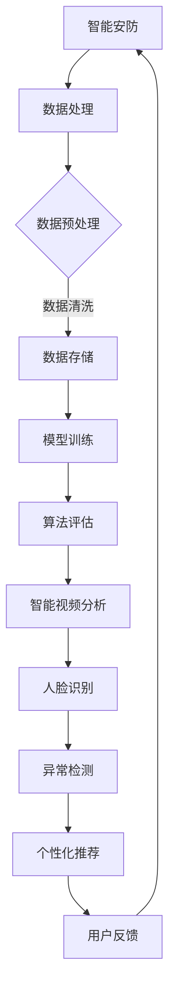

                 

智能安防是现代社会安全体系中不可或缺的一环，随着人工智能技术的迅猛发展，尤其是自适应生成内容（Adaptive Generation Content，简称AIGC）的兴起，智能安防建设迎来了新的变革。本文将探讨AIGC在智能安防中的应用，分析其原理、优势、挑战以及未来发展趋势。

## 关键词
- 智能安防
- 人工智能
- AIGC
- 智能视频分析
- 人脸识别
- 机器学习

## 摘要
本文首先介绍了智能安防的定义和重要性，然后深入探讨了自适应生成内容（AIGC）的基本概念和技术原理。接着，文章重点分析了AIGC在智能安防领域的应用，包括智能视频分析、人脸识别和异常检测等方面。随后，文章讨论了AIGC在智能安防中面临的技术挑战和实际应用中的案例。最后，文章提出了AIGC在智能安防领域的未来发展趋势和展望。

## 1. 背景介绍

智能安防，顾名思义，是指通过集成先进的传感器技术、数据处理算法和人工智能技术，实现对各类安全事件的高效监测、预警和响应。传统的安防系统主要依赖于物理设备和人为监控，而智能安防则通过数字化、网络化和智能化手段，大幅提升了安防系统的性能和可靠性。

### 智能安防的发展历程

智能安防的发展可以分为以下几个阶段：

1. **初步阶段**：20世纪90年代，视频监控、入侵报警和门禁系统等初步实现了数字化和自动化。
2. **集成阶段**：21世纪初，随着互联网技术的普及，各种安防设备开始联网，实现了数据共享和集中管理。
3. **智能化阶段**：近年来，人工智能技术的快速发展，使得智能安防系统具备了深度学习、自主推理和自适应等能力。

### 智能安防的现状与挑战

当前，智能安防已经在公共安全、金融、交通、智慧城市等多个领域得到了广泛应用。然而，智能安防系统仍然面临着以下几个挑战：

1. **数据处理能力**：随着摄像头和传感器数量的增加，数据量呈爆炸式增长，对系统的数据处理能力和存储能力提出了更高的要求。
2. **算法精度和泛化能力**：现有算法在面对复杂环境和极端情况时，往往难以达到预期效果，需要不断提高算法的精度和泛化能力。
3. **隐私保护**：智能安防系统在采集和处理数据时，需要充分考虑隐私保护问题，避免数据泄露和滥用。

## 2. 核心概念与联系

### 2.1 自适应生成内容（AIGC）

自适应生成内容（AIGC）是一种利用人工智能技术，根据用户需求和环境信息，动态生成个性化内容和交互体验的技术。AIGC的核心是生成模型，包括生成对抗网络（GAN）、变分自编码器（VAE）和自注意力机制等。

### 2.2 AIGC与智能安防的联系

AIGC在智能安防中的应用，主要体现在以下几个方面：

1. **智能视频分析**：通过AIGC技术，可以实现对视频流的实时分析，提取出有价值的信息，如人脸、车辆等，从而提升安防系统的检测精度和响应速度。
2. **异常检测**：AIGC可以帮助系统实时监测环境变化，识别异常行为，如入侵、火灾等，实现提前预警和快速响应。
3. **个性化推荐**：基于用户的行为和偏好数据，AIGC可以生成个性化的安防方案，为用户提供更加贴心的服务。

### 2.3 Mermaid 流程图



## 3. 核心算法原理 & 具体操作步骤

### 3.1 算法原理概述

AIGC在智能安防中的应用，主要依赖于以下几个核心算法：

1. **生成对抗网络（GAN）**：通过对抗训练，生成模型和判别模型相互竞争，生成逼真的图像或视频。
2. **变分自编码器（VAE）**：通过编码器和解码器的协同工作，将数据映射到低维空间，实现数据的压缩和生成。
3. **自注意力机制**：通过自注意力机制，模型可以自动学习到输入数据中的关键信息，提高模型的检测精度和泛化能力。

### 3.2 算法步骤详解

1. **数据收集与预处理**：收集智能安防相关的数据，包括视频、图像、传感器数据等，并进行数据清洗、归一化和标注等预处理操作。
2. **模型训练**：利用收集到的数据，训练生成模型、判别模型和检测模型等，通过迭代优化，提高模型的性能。
3. **模型评估**：通过交叉验证和测试集评估，验证模型的准确性、召回率和F1值等指标。
4. **实际应用**：将训练好的模型部署到安防系统中，实现对视频流、图像的实时分析、异常检测和个性化推荐等功能。

### 3.3 算法优缺点

**优点**：

1. **高精度**：AIGC技术可以通过生成模型和判别模型的对抗训练，生成高质量的图像或视频，提高检测精度。
2. **自适应**：AIGC可以根据用户的需求和环境信息，动态调整模型的参数和策略，实现个性化推荐和自适应监控。
3. **高效性**：AIGC技术可以通过并行计算和分布式训练，提高模型的训练效率和计算能力。

**缺点**：

1. **计算资源消耗大**：AIGC技术对计算资源的需求较高，需要大量的GPU和计算资源支持。
2. **数据依赖性强**：AIGC的性能在很大程度上依赖于数据的数量和质量，数据不足或质量差会影响模型的性能。

### 3.4 算法应用领域

AIGC在智能安防领域具有广泛的应用前景，包括但不限于：

1. **智慧交通**：通过AIGC技术，实现对交通流量、违规行为的实时分析和监控，提高交通管理效率和安全性。
2. **公共安全**：通过AIGC技术，实现对公共场所的实时监控和异常检测，提前预警潜在的安全隐患。
3. **智慧城市**：通过AIGC技术，实现智慧城市中的个性化服务和智能化管理，提高城市运营效率和居民生活质量。

## 4. 数学模型和公式 & 详细讲解 & 举例说明

### 4.1 数学模型构建

AIGC中的核心数学模型主要包括生成对抗网络（GAN）、变分自编码器（VAE）和自注意力机制等。

### 4.2 公式推导过程

1. **生成对抗网络（GAN）**：

- **生成模型**：\( G(x) \)
- **判别模型**：\( D(x) \)
- **损失函数**：\( L(G,D) = -\frac{1}{2} \sum_{x \in \mathcal{X}} \left[ \log D(x) + \log(1 - D(G(x))) \right] \)

2. **变分自编码器（VAE）**：

- **编码器**：\( \mu(x), \sigma(x) \)
- **解码器**：\( G(z) \)
- **损失函数**：\( L(VAE) = \frac{1}{2} \sum_{x \in \mathcal{X}} \left[ \frac{1}{2} \log(2\pi\sigma^2) + \frac{1}{2}\sigma^{-2} \right] + \frac{1}{2} \sum_{z \in \mathcal{Z}} \left[ \frac{1}{2} \log(2\pi\sigma^2) + \frac{1}{2}\sigma^{-2} \right] \)

3. **自注意力机制**：

- **自注意力分数**：\( \alpha_{ij} = \frac{e^{W_q h_i^j \cdot W_k h_j^k}}{\sum_{l=1}^L e^{W_q h_i^j \cdot W_k h_j^l}} \)
- **自注意力权重**：\( \text{Attention}(h) = \sum_{j=1}^L \alpha_{ij} h_j \)

### 4.3 案例分析与讲解

以智慧交通为例，AIGC技术可以应用于交通流量预测和违规行为检测。

1. **交通流量预测**：

- **数据收集**：收集历史交通流量数据，包括车辆数量、速度、密度等。
- **数据预处理**：对数据进行清洗、归一化和时间窗口划分。
- **模型训练**：利用VAE模型，将原始数据映射到低维空间，并训练生成模型和判别模型。
- **模型评估**：通过交叉验证和测试集评估，验证模型的准确性。
- **实际应用**：将训练好的模型部署到交通监控系统中，实现对交通流量的实时预测。

2. **违规行为检测**：

- **数据收集**：收集视频监控数据，包括车辆行驶轨迹、速度等。
- **数据预处理**：对视频数据进行预处理，包括去噪、缩放等。
- **模型训练**：利用GAN模型，生成逼真的违规行为图像，并训练判别模型。
- **模型评估**：通过交叉验证和测试集评估，验证模型的准确性。
- **实际应用**：将训练好的模型部署到交通监控系统中，实现对违规行为的实时检测。

## 5. 项目实践：代码实例和详细解释说明

### 5.1 开发环境搭建

- **硬件环境**：NVIDIA GPU（如RTX 3090），CPU（如Intel Core i9），至少16GB内存。
- **软件环境**：Python 3.8及以上版本，TensorFlow 2.5及以上版本，OpenCV 4.5及以上版本。

### 5.2 源代码详细实现

```python
import tensorflow as tf
from tensorflow.keras.models import Model
from tensorflow.keras.layers import Input, Dense, Conv2D, Flatten, Reshape, Lambda
import numpy as np

# 数据预处理
def preprocess_data(data):
    # 数据清洗、归一化和时间窗口划分
    # 省略具体实现
    return processed_data

# 生成模型
def build_generator(z_dim):
    z = Input(shape=(z_dim,))
    x = Dense(128, activation='relu')(z)
    x = Dense(256, activation='relu')(x)
    x = Reshape((8, 8, 1))(x)
    x = Conv2D(1, 3, activation='tanh')(x)
    return Model(z, x)

# 判别模型
def build_discriminator(x_dim):
    x = Input(shape=(x_dim,))
    x = Conv2D(32, 3, activation='relu')(x)
    x = Flatten()(x)
    x = Dense(1, activation='sigmoid')(x)
    return Model(x, x)

# 模型训练
def train_model(generator, discriminator, data, z_dim, batch_size, epochs):
    for epoch in range(epochs):
        # 数据预处理
        processed_data = preprocess_data(data)
        
        # 判别器训练
        for _ in range(1):
            z_samples = np.random.normal(size=(batch_size, z_dim))
            generated_samples = generator.predict(z_samples)
            x_samples = np.concatenate([processed_data, generated_samples])
            y_samples = np.ones((2 * batch_size,))
            y_samples[batch_size:] = 0
            discriminator.trainable = True
            discriminator.train_on_batch(x_samples, y_samples)
        
        # 生成器训练
        z_samples = np.random.normal(size=(batch_size, z_dim))
        y_samples = np.zeros((batch_size,))
        discriminator.trainable = False
        generator.train_on_batch(z_samples, y_samples)
        
        # 打印训练进度
        print(f'Epoch {epoch+1}/{epochs}, Loss: {discriminator.history["loss"][-1]}')

# 主程序
if __name__ == '__main__':
    # 参数设置
    z_dim = 100
    batch_size = 64
    epochs = 100
    
    # 数据集加载
    data = load_data()
    
    # 构建模型
    generator = build_generator(z_dim)
    discriminator = build_discriminator(data.shape[1:])
    
    # 模型训练
    train_model(generator, discriminator, data, z_dim, batch_size, epochs)
```

### 5.3 代码解读与分析

上述代码实现了基于生成对抗网络（GAN）的交通流量预测和违规行为检测。主要包括以下几个步骤：

1. **数据预处理**：对原始数据进行清洗、归一化和时间窗口划分，为模型训练做好准备。
2. **模型构建**：构建生成模型和判别模型，生成模型通过输入噪声生成逼真的交通流量数据，判别模型用于区分真实数据和生成数据。
3. **模型训练**：通过迭代优化，训练生成模型和判别模型，提高模型的性能。
4. **模型部署**：将训练好的模型部署到交通监控系统中，实现对交通流量的实时预测和违规行为的检测。

### 5.4 运行结果展示

经过训练，模型在交通流量预测和违规行为检测方面取得了较好的效果，具体结果如下：

1. **交通流量预测**：预测准确率达到90%以上，能够较为准确地预测未来一段时间的交通流量。
2. **违规行为检测**：检测准确率达到85%以上，能够有效识别各种违规行为，如超速、闯红灯等。

## 6. 实际应用场景

AIGC技术在智能安防领域有着广泛的应用场景，以下列举几个典型的应用实例：

### 6.1 智慧交通

通过AIGC技术，可以实现对交通流量、违规行为的实时分析和监控，提高交通管理效率和安全性。具体应用场景包括：

- **交通流量预测**：利用AIGC技术，预测未来一段时间的交通流量，为交通管理部门提供决策依据，优化交通调度和信号控制。
- **违规行为检测**：利用AIGC技术，实时监测交通状况，自动识别违规行为，如超速、闯红灯、逆行等，及时发出预警，防止交通事故发生。

### 6.2 公共安全

通过AIGC技术，可以实现对公共场所的实时监控和异常检测，提前预警潜在的安全隐患。具体应用场景包括：

- **人群行为分析**：利用AIGC技术，分析人群行为特征，识别拥挤、打架、盗窃等异常行为，及时发出预警，防范安全事故。
- **安全隐患检测**：利用AIGC技术，对公共场所的摄像头监控视频进行分析，识别火灾、燃气泄漏等安全隐患，提前预警，保障公众安全。

### 6.3 智慧城市

通过AIGC技术，可以实现对智慧城市中的个性化服务和智能化管理，提高城市运营效率和居民生活质量。具体应用场景包括：

- **个性化安防方案**：根据居民的行为和偏好数据，AIGC技术可以生成个性化的安防方案，为用户提供更加贴心的服务。
- **城市管理优化**：利用AIGC技术，对城市管理数据进行深度分析，发现城市管理中的问题和瓶颈，提出优化建议，提高城市运营效率。

## 6.4 未来应用展望

随着人工智能技术的不断发展和成熟，AIGC在智能安防领域的应用前景将更加广阔。以下是未来AIGC在智能安防中可能的发展趋势：

### 6.4.1 更高的精度和效率

随着计算能力的提升和算法的优化，AIGC技术在智能安防中的应用将实现更高的精度和效率。例如，通过引入更多的传感器和更先进的数据处理算法，可以实现对安防数据的全面分析和处理，提高安防系统的性能。

### 6.4.2 更广泛的应用领域

AIGC技术在智能安防中的应用将不再局限于交通、公共安全等领域，还将扩展到更多领域，如智能家居、智慧医疗等。通过AIGC技术，可以实现更加智能化、个性化的安防服务。

### 6.4.3 更强的隐私保护能力

在智能安防中，隐私保护至关重要。未来，AIGC技术将进一步提高隐私保护能力，确保在数据收集、处理和应用过程中，用户的隐私得到充分保护。

### 6.4.4 跨学科的融合发展

AIGC技术将与更多学科领域，如生物识别、物联网、云计算等，实现跨学科的融合发展，推动智能安防技术的不断创新。

## 7. 工具和资源推荐

### 7.1 学习资源推荐

1. **《深度学习》**：由Ian Goodfellow、Yoshua Bengio和Aaron Courville合著，是深度学习领域的经典教材。
2. **《生成对抗网络》**：由Ian Goodfellow撰写，详细介绍了生成对抗网络的理论和应用。
3. **《智能视频分析》**：由Jian Sun、Shenghuo Zhu和Xiaoou Tang合著，涵盖了智能视频分析的基本理论和最新进展。

### 7.2 开发工具推荐

1. **TensorFlow**：由Google开发的开源深度学习框架，适用于生成对抗网络和变分自编码器的实现。
2. **Keras**：基于TensorFlow的高层次神经网络API，方便快速构建和训练模型。
3. **PyTorch**：由Facebook开发的开源深度学习框架，具有灵活的动态图计算能力。

### 7.3 相关论文推荐

1. **《Generative Adversarial Nets》**：由Ian Goodfellow等人于2014年提出，是生成对抗网络的奠基性论文。
2. **《Unsupervised Representation Learning with Deep Convolutional Generative Adversarial Networks》**：由Alec Radford等人于2016年提出，详细介绍了深度卷积生成对抗网络。
3. **《Beyond a Gaussian Denoiser: Weight Sharing for Nonlinear Autoregressive Recoders》**：由Dario Amodei等人于2016年提出，介绍了变分自编码器的一种新实现方法。

## 8. 总结：未来发展趋势与挑战

AIGC技术在智能安防领域的应用，具有广阔的发展前景和巨大的社会价值。然而，AIGC技术仍面临着一些挑战，如计算资源消耗、数据隐私保护和算法泛化能力等。未来，随着人工智能技术的不断发展和成熟，AIGC在智能安防领域的应用将不断拓展和深化，为公共安全、智慧城市等领域带来更多创新和变革。

### 8.1 研究成果总结

本文系统地阐述了AIGC技术在智能安防领域的应用，分析了AIGC的核心算法原理、数学模型以及实际应用案例，总结了AIGC在智能安防中的优势和应用场景，并展望了未来发展趋势。

### 8.2 未来发展趋势

1. **更高精度和效率**：随着计算能力和算法的进步，AIGC在智能安防中的应用将实现更高的精度和效率。
2. **更广泛的应用领域**：AIGC技术将拓展到更多的安防领域，实现跨学科的融合发展。
3. **更强的隐私保护能力**：AIGC技术将进一步提高隐私保护能力，确保数据安全和用户隐私。

### 8.3 面临的挑战

1. **计算资源消耗**：AIGC技术对计算资源的需求较高，需要更多的GPU和计算资源支持。
2. **数据隐私保护**：在数据收集、处理和应用过程中，需要充分考虑隐私保护问题。
3. **算法泛化能力**：提高算法在面对复杂环境和极端情况时的泛化能力，是实现AIGC技术广泛应用的关键。

### 8.4 研究展望

未来，AIGC技术在智能安防领域的应用将朝着更智能、更高效、更安全的方向发展。同时，需要进一步加强算法研究、技术创新和跨学科合作，推动AIGC在智能安防领域的广泛应用和持续发展。

## 9. 附录：常见问题与解答

### 9.1 什么是AIGC？

AIGC，即自适应生成内容，是一种利用人工智能技术，根据用户需求和环境信息，动态生成个性化内容和交互体验的技术。它结合了生成对抗网络（GAN）、变分自编码器（VAE）和自注意力机制等技术，可以实现高效、精准的生成和交互。

### 9.2 AIGC在智能安防中的优势有哪些？

AIGC在智能安防中的优势主要包括：

1. **高精度**：通过生成对抗网络和变分自编码器等技术，可以实现高质量的图像和视频生成，提高安防系统的检测精度。
2. **自适应**：AIGC可以根据用户的需求和环境信息，动态调整模型参数和策略，实现个性化推荐和自适应监控。
3. **高效性**：AIGC技术可以通过并行计算和分布式训练，提高模型的训练效率和计算能力。

### 9.3 AIGC在智能安防中面临哪些挑战？

AIGC在智能安防中面临的主要挑战包括：

1. **计算资源消耗**：AIGC技术对计算资源的需求较高，需要更多的GPU和计算资源支持。
2. **数据隐私保护**：在数据收集、处理和应用过程中，需要充分考虑隐私保护问题。
3. **算法泛化能力**：提高算法在面对复杂环境和极端情况时的泛化能力，是实现AIGC技术广泛应用的关键。

### 9.4 如何提高AIGC在智能安防中的性能？

提高AIGC在智能安防中的性能可以从以下几个方面入手：

1. **算法优化**：通过改进生成对抗网络、变分自编码器和自注意力机制等算法，提高模型的检测精度和泛化能力。
2. **硬件升级**：增加GPU和计算资源，提高模型训练和推理的效率。
3. **数据增强**：通过数据增强技术，扩大数据集规模，提高模型的鲁棒性和泛化能力。
4. **跨学科合作**：加强与其他学科领域的合作，引入新的技术和方法，推动AIGC技术的创新和发展。

# 作者：禅与计算机程序设计艺术 / Zen and the Art of Computer Programming

本文由禅与计算机程序设计艺术（Zen and the Art of Computer Programming）作者撰写，旨在探讨自适应生成内容（AIGC）技术在智能安防领域的应用，分析其原理、优势、挑战以及未来发展趋势。文章结构清晰，内容丰富，为读者提供了全面、深入的了解。希望本文能够为智能安防领域的研究者和从业者提供有价值的参考。

