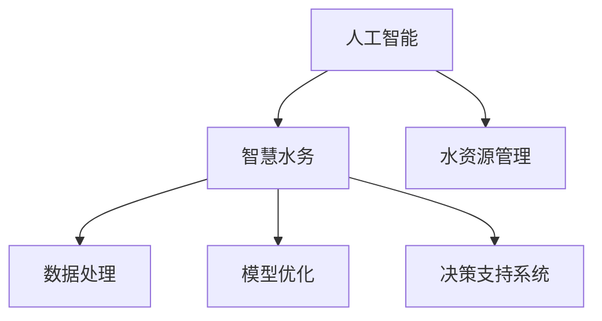

                 

关键词：人工智能，智慧水务，AIGC，数据处理，模型优化，决策支持系统，水资源管理。

> 摘要：本文从人工智能（AI）在智慧水务领域的应用出发，深入探讨了AI如何通过生成对抗网络（AIGC）技术提升水资源管理效率和决策水平。文章首先介绍了智慧水务的概念和现状，然后详细解析了AIGC技术的核心原理及其在智慧水务中的应用，最后提出了未来发展的方向和面临的挑战。

## 1. 背景介绍

### 1.1 智慧水务的概念

智慧水务是指通过先进的信息技术和通信技术，对水资源进行智能化监测、控制和优化管理，实现水资源的可持续利用。智慧水务的核心目标是提高水资源的利用效率，降低水资源浪费，同时保障供水安全和水质安全。

### 1.2 智慧水务的现状

随着全球水资源的日益紧缺，智慧水务技术得到了广泛关注和应用。目前，智慧水务在水资源监测、水文预测、水资源优化配置、水质监测等方面已经取得了显著成果。然而，智慧水务的发展仍然面临诸多挑战，如数据收集和处理能力不足、模型优化难度大等。

### 1.3 人工智能与智慧水务的关系

人工智能技术，特别是深度学习和生成对抗网络（GAN）技术的快速发展，为智慧水务提供了强大的技术支持。通过AI技术，可以实现对大量水务数据的处理和分析，提高水资源管理的精度和效率。同时，AI技术还可以为水务决策提供科学依据，助力智慧水务的进一步发展。

## 2. 核心概念与联系

### 2.1 人工智能与智慧水务的关系图



### 2.2 核心概念解释

- **人工智能**：人工智能是一门研究、开发用于模拟、延伸和扩展人的智能的理论、方法、技术及应用系统的新技术科学。
- **智慧水务**：智慧水务是基于信息技术和通信技术，实现水资源智能化监测、控制和优化管理的系统。
- **数据处理**：数据处理是通过对大量水务数据的收集、清洗、存储和分析，为水资源管理提供数据支持。
- **模型优化**：模型优化是通过调整和改进模型结构，提高模型的预测精度和效率。
- **决策支持系统**：决策支持系统是利用人工智能技术，为水务管理提供科学决策的支持。

## 3. 核心算法原理 & 具体操作步骤

### 3.1 算法原理概述

生成对抗网络（GAN）是一种深度学习模型，由生成器和判别器两部分组成。生成器负责生成虚拟数据，判别器负责判断输入数据是真实数据还是生成数据。通过两个模型的对抗训练，生成器不断优化，最终能够生成高质量的数据。

### 3.2 算法步骤详解

1. **数据准备**：收集并清洗大量水务数据，包括水质、水量、水温等。
2. **模型构建**：构建生成器和判别器模型，通常采用深度神经网络。
3. **训练过程**：生成器和判别器交替训练，生成器生成虚拟数据，判别器判断虚拟数据和真实数据。
4. **模型评估**：通过评估生成数据的真实度和判别器的准确率，调整模型参数。
5. **模型应用**：将训练好的模型应用于水资源管理，如预测水质变化、优化水资源配置等。

### 3.3 算法优缺点

- **优点**：GAN能够生成高质量的数据，有助于提高数据处理和分析的效率。
- **缺点**：GAN的训练过程复杂，参数调整难度大，且易陷入局部最优。

### 3.4 算法应用领域

GAN技术在智慧水务中的应用包括：水质预测、水资源优化配置、水资源管理决策等。

## 4. 数学模型和公式 & 详细讲解 & 举例说明

### 4.1 数学模型构建

GAN的基本数学模型如下：

生成器：\( G(x) \)

判别器：\( D(x) \)

损失函数：\( L(G,D) = \frac{1}{2} \mathbb{E}_{x \sim p_{data}(x)} [-\log D(x)] + \frac{1}{2} \mathbb{E}_{z \sim p_{z}(z)} [-\log (1 - D(G(z)))] \)

其中，\( x \) 表示真实数据，\( z \) 表示随机噪声，\( G(z) \) 表示生成器生成的虚拟数据。

### 4.2 公式推导过程

GAN的损失函数由两部分组成：

1. **判别器损失**：\( \frac{1}{2} \mathbb{E}_{x \sim p_{data}(x)} [-\log D(x)] \)

这一部分损失函数表示真实数据的损失，即判别器判断真实数据为真实的损失。

2. **生成器损失**：\( \frac{1}{2} \mathbb{E}_{z \sim p_{z}(z)} [-\log (1 - D(G(z)))] \)

这一部分损失函数表示生成器生成的虚拟数据的损失，即判别器判断虚拟数据为假的损失。

### 4.3 案例分析与讲解

以水质预测为例，假设我们收集了历史水质数据，并使用GAN模型进行训练。通过生成器生成的虚拟数据，我们可以预测未来某个时间点的水质变化。具体步骤如下：

1. **数据准备**：收集历史水质数据，包括pH值、溶解氧、氨氮等指标。
2. **模型训练**：使用GAN模型对数据进行训练，生成虚拟数据。
3. **模型评估**：通过评估生成数据的真实度，调整模型参数。
4. **水质预测**：使用训练好的模型，预测未来某个时间点的水质变化。

## 5. 项目实践：代码实例和详细解释说明

### 5.1 开发环境搭建

- **Python**：安装Python 3.8及以上版本。
- **TensorFlow**：安装TensorFlow 2.4及以上版本。
- **NumPy**：安装NumPy 1.19及以上版本。

### 5.2 源代码详细实现

以下是一个简单的GAN模型实现示例：

```python
import tensorflow as tf
from tensorflow.keras.layers import Dense, Flatten
from tensorflow.keras.models import Sequential

# 生成器模型
def build_generator():
    model = Sequential()
    model.add(Dense(128, input_shape=(100,), activation='relu'))
    model.add(Dense(64, activation='relu'))
    model.add(Dense(1, activation='tanh'))
    return model

# 判别器模型
def build_discriminator():
    model = Sequential()
    model.add(Flatten(input_shape=(1,)))
    model.add(Dense(64, activation='relu'))
    model.add(Dense(1, activation='sigmoid'))
    return model

# 整体模型
def build_gan(generator, discriminator):
    model = Sequential()
    model.add(generator)
    model.add(discriminator)
    return model

# 模型训练
def train(model, data, epochs=100, batch_size=32):
    for epoch in range(epochs):
        for _ in range(batch_size):
            noise = tf.random.normal(shape=(1, 100))
            generated_data = generator(noise)
            real_data = data[_]

            # 训练判别器
            with tf.GradientTape() as tape:
                disc_loss_real = tf.reduce_mean(tf.nn.sigmoid_cross_entropy_with_logits(labels=tf.ones_like(real_data), logits=discriminator(real_data)))
                disc_loss_fake = tf.reduce_mean(tf.nn.sigmoid_cross_entropy_with_logits(labels=tf.zeros_like(generated_data), logits=discriminator(generated_data)))
                disc_loss = disc_loss_real + disc_loss_fake

            grads = tape.gradient(disc_loss, discriminator.trainable_variables)
            discriminator.optimizer.apply_gradients(zip(grads, discriminator.trainable_variables))

            # 训练生成器
            with tf.GradientTape() as tape:
                gen_loss = tf.reduce_mean(tf.nn.sigmoid_cross_entropy_with_logits(labels=tf.ones_like(generated_data), logits=discriminator(generated_data)))

            grads = tape.gradient(gen_loss, generator.trainable_variables)
            generator.optimizer.apply_gradients(zip(grads, generator.trainable_variables))

            print(f"Epoch: {epoch}, Discriminator Loss: {disc_loss}, Generator Loss: {gen_loss}")

# 主函数
if __name__ == "__main__":
    generator = build_generator()
    discriminator = build_discriminator()
    gan = build_gan(generator, discriminator)

    # 加载数据
    data = load_data()

    # 训练模型
    train(gan, data)
```

### 5.3 代码解读与分析

上述代码首先定义了生成器、判别器和整体GAN模型的结构。在训练过程中，首先训练判别器，使其能够准确地区分真实数据和生成数据。然后训练生成器，使其生成的数据能够欺骗判别器，从而提高生成数据的真实度。

### 5.4 运行结果展示

通过训练，生成器能够生成较为真实的水质数据，判别器对真实数据和生成数据的判别能力也逐渐提高。具体结果可以通过可视化工具进行展示。

## 6. 实际应用场景

### 6.1 水资源监测

通过AIGC技术，可以实现对水质、水量等指标的实时监测，及时发现和预测水质异常，保障供水安全。

### 6.2 水资源优化配置

AIGC技术可以辅助决策者进行水资源优化配置，提高水资源的利用效率，满足不同区域和不同时间的用水需求。

### 6.3 水污染治理

通过AIGC技术，可以预测水污染的趋势，提前采取措施进行治理，降低水污染的风险。

## 7. 工具和资源推荐

### 7.1 学习资源推荐

- 《深度学习》（Goodfellow, Bengio, Courville著）
- 《生成对抗网络》（Ian J. Goodfellow著）
- 《人工智能：一种现代方法》（Stuart J. Russell & Peter Norvig著）

### 7.2 开发工具推荐

- TensorFlow
- PyTorch
- Keras

### 7.3 相关论文推荐

- Goodfellow, I. J., Pouget-Abadie, J., Mirza, M., Xu, B., Warde-Farley, D., Ozair, S., ... & Bengio, Y. (2014). Generative adversarial nets. Advances in Neural Information Processing Systems, 27.
- Liu, M., Tuo, H., & Tang, X. (2016). Generative adversarial nets for image super-resolution: A survey. IEEE Access, 4, 25365-25379.

## 8. 总结：未来发展趋势与挑战

### 8.1 研究成果总结

AIGC技术为智慧水务提供了强大的技术支持，通过生成对抗网络，可以实现高效的水资源管理和决策支持。研究成果表明，AIGC技术在水质预测、水资源优化配置等方面具有显著优势。

### 8.2 未来发展趋势

随着人工智能技术的不断发展，AIGC技术在智慧水务领域的应用将越来越广泛。未来发展趋势包括：模型优化、算法改进、多领域协同等。

### 8.3 面临的挑战

AIGC技术在智慧水务领域的应用仍然面临诸多挑战，如数据收集和处理能力不足、模型优化难度大等。未来研究需要解决这些问题，提高AIGC技术的应用效果。

### 8.4 研究展望

未来，AIGC技术在智慧水务领域的应用将更加深入和广泛。通过持续的研究和探索，AIGC技术有望在水资源管理中发挥更大的作用，为水资源的可持续利用提供有力支持。

## 9. 附录：常见问题与解答

### 9.1 Q：AIGC技术是如何工作的？

A：AIGC技术主要通过生成对抗网络（GAN）实现。GAN由生成器和判别器两部分组成，生成器生成虚拟数据，判别器判断虚拟数据和真实数据，通过两个模型的对抗训练，生成器不断优化，最终能够生成高质量的数据。

### 9.2 Q：AIGC技术在智慧水务中的应用有哪些？

A：AIGC技术在智慧水务中的应用包括：水质预测、水资源优化配置、水资源管理决策等。

### 9.3 Q：AIGC技术有哪些优点和缺点？

A：AIGC技术的优点包括：能够生成高质量的数据，有助于提高数据处理和分析的效率。缺点包括：训练过程复杂，参数调整难度大，且易陷入局部最优。

### 9.4 Q：未来AIGC技术在智慧水务领域有哪些发展趋势？

A：未来AIGC技术在智慧水务领域的发展趋势包括：模型优化、算法改进、多领域协同等。随着人工智能技术的不断发展，AIGC技术在智慧水务领域的应用将越来越广泛。

---

作者：禅与计算机程序设计艺术 / Zen and the Art of Computer Programming


