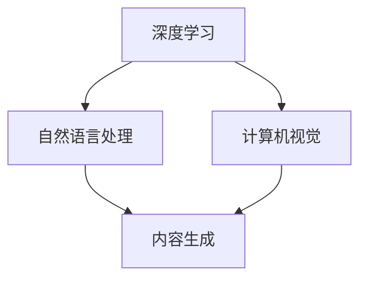

                 

关键词：AIGC，创业机会，技术趋势，商业应用，人工智能，生成内容，创新

> 摘要：随着人工智能技术的发展，AIGC（AI Generated Content）正在迅速崛起，成为推动新时代创业创新的重要力量。本文将深入探讨AIGC的核心概念、技术原理、应用场景以及未来的发展趋势，为创业者提供有价值的参考和启示。

## 1. 背景介绍

在数字时代的浪潮中，内容创作和分发正经历前所未有的变革。从传统的手工制作内容到自动化和智能化的生成内容，人工智能（AI）正在重新定义内容产业。AIGC，作为AI在内容生成领域的具体应用，具有显著的变革性。

AIGC，全称AI Generated Content，指的是通过人工智能技术，如深度学习、自然语言处理和计算机视觉等，自动生成的各类内容。这些内容可以是文字、图像、视频、音频等多种形式。随着AI技术的不断进步，AIGC的应用范围逐渐扩大，从内容创作到内容分发，再到商业模式的创新，AIGC正成为新时代创业的重要风口。

近年来，AIGC的兴起不仅体现在技术的突破上，更体现在其广泛的应用场景中。例如，在新闻写作、社交媒体内容生成、虚拟主播、自动化内容审核等方面，AIGC已经展现出强大的潜力。同时，随着5G、大数据和云计算等技术的融合，AIGC的应用场景将更加多样化，为创业者提供了丰富的创新空间。

## 2. 核心概念与联系

### 2.1 AIGC的定义与核心技术

AIGC的定义可以归结为：利用人工智能技术生成内容的过程。它涵盖了以下几个核心技术：

- **深度学习**：通过神经网络模型对大量数据进行分析和模式识别，从而自动生成新的内容。
- **自然语言处理（NLP）**：使计算机能够理解、处理和生成自然语言，包括文本、语音等。
- **计算机视觉**：使计算机能够理解和处理图像和视频，从而生成视觉内容。

### 2.2 AIGC的架构图



在这个架构图中，深度学习、自然语言处理和计算机视觉是AIGC的三大核心技术。它们通过算法模型和数据输入，共同驱动内容生成的过程。而内容生成则是AIGC的核心目标，它涵盖了从文本生成到图像生成，再到视频生成等多种形式。

### 2.3 AIGC与现有技术的联系

AIGC不仅是一个独立的技术领域，它还与现有的技术如大数据、云计算、物联网等有着密切的联系。例如：

- **大数据**：为AIGC提供了丰富的数据资源，这些数据是AIGC模型训练和优化的重要基础。
- **云计算**：提供了强大的计算能力和存储资源，使AIGC的应用变得更加高效和灵活。
- **物联网**：通过收集和分析物联网设备生成的大量数据，AIGC可以为智能家居、智能城市等领域提供定制化的内容生成服务。

## 3. 核心算法原理 & 具体操作步骤

### 3.1 算法原理概述

AIGC的核心算法主要包括以下几种：

- **生成对抗网络（GAN）**：通过生成器和判别器的对抗训练，生成高质量的内容。
- **变分自编码器（VAE）**：通过编码和解码过程，生成新的数据。
- **循环神经网络（RNN）**：用于处理序列数据，如文本和语音。
- **自注意力机制（Self-Attention）**：在处理文本和图像等数据时，自动关注重要信息。

这些算法通过模型的训练和优化，能够自动生成新的内容。具体的操作步骤如下：

1. **数据收集与预处理**：收集大量相关的数据，并进行预处理，如数据清洗、去噪等。
2. **模型训练**：使用收集到的数据，通过训练算法，优化模型参数。
3. **内容生成**：利用训练好的模型，输入新的数据，生成新的内容。
4. **结果评估与优化**：对生成的内容进行评估，如质量、准确性等，并根据评估结果优化模型。

### 3.2 算法步骤详解

1. **数据收集与预处理**：

   - **数据收集**：从互联网、数据库、传感器等多种渠道收集相关的数据。
   - **数据预处理**：对收集到的数据进行清洗、去噪、格式化等处理，使其适合模型训练。

2. **模型训练**：

   - **选择算法**：根据应用场景，选择合适的算法，如GAN、VAE等。
   - **训练模型**：使用预处理后的数据，通过训练算法，优化模型参数。

3. **内容生成**：

   - **输入数据**：将新的数据输入到训练好的模型中。
   - **生成内容**：模型根据输入数据，生成新的内容。

4. **结果评估与优化**：

   - **评估指标**：根据应用场景，设定评估指标，如生成内容的准确性、质量等。
   - **模型优化**：根据评估结果，调整模型参数，优化模型性能。

### 3.3 算法优缺点

**优点**：

- **高效性**：AIGC通过自动化和智能化的方式生成内容，大大提高了内容生产的效率。
- **多样性**：AIGC能够生成多种类型的内容，如文本、图像、视频等，为应用场景提供了丰富的可能性。
- **灵活性**：AIGC可以根据不同的应用场景和需求，灵活调整和优化。

**缺点**：

- **计算资源需求高**：AIGC的训练和生成过程需要大量的计算资源和存储资源，对硬件要求较高。
- **数据依赖性**：AIGC的性能很大程度上取决于训练数据的质量和数量，数据质量不佳可能导致生成内容的质量下降。
- **模型解释性差**：AIGC模型通常较为复杂，难以解释其生成内容的内在逻辑。

### 3.4 算法应用领域

AIGC的应用领域非常广泛，涵盖了以下几个主要方面：

- **内容创作**：如文章、新闻、音乐、视频等内容的自动化生成。
- **娱乐产业**：如虚拟主播、游戏角色、动画制作等。
- **广告营销**：如广告文案、广告图片、广告视频等内容的自动化生成。
- **智能客服**：如自然语言处理，自动生成客服问答。
- **医疗健康**：如医疗报告、诊断建议等内容的自动化生成。
- **教育领域**：如个性化学习内容、教学视频等。

## 4. 数学模型和公式 & 详细讲解 & 举例说明

### 4.1 数学模型构建

在AIGC中，常用的数学模型包括：

- **生成对抗网络（GAN）**：
  - **生成器（Generator）**：\( G(x) \)
  - **判别器（Discriminator）**：\( D(x) \)
  - **损失函数**：\( L(G, D) \)

- **变分自编码器（VAE）**：
  - **编码器（Encoder）**：\( \mu(z|x), \sigma(z|x) \)
  - **解码器（Decoder）**：\( x' = G(z) \)
  - **损失函数**：\( L_{VAE} \)

- **循环神经网络（RNN）**：
  - **隐藏状态**：\( h_t = \tanh(W_h \cdot [h_{t-1}, x_t] + b_h) \)
  - **输出**：\( y_t = W_y \cdot h_t + b_y \)
  - **损失函数**：\( L_{RNN} \)

### 4.2 公式推导过程

以GAN为例，其基本框架如下：

1. **生成器与判别器的参数更新**：
   - **生成器**：\( G \) 的目标是生成看起来像真实数据的数据，使 \( D(G(z)) \) 尽量接近1。
   - **判别器**：\( D \) 的目标是区分真实数据和生成数据，使 \( D(x) \) 尽量接近1，\( D(G(z)) \) 尽量接近0。

2. **损失函数**：
   - **生成器损失**：\( L_G = -\mathbb{E}_{z \sim p_z(z)}[\log D(G(z))] \)
   - **判别器损失**：\( L_D = -\mathbb{E}_{x \sim p_x(x)}[\log D(x)] - \mathbb{E}_{z \sim p_z(z)}[\log (1 - D(G(z)))] \)

3. **梯度下降**：
   - **生成器**：对 \( G \) 的梯度下降更新 \( G \)。
   - **判别器**：对 \( D \) 的梯度下降更新 \( D \)。

### 4.3 案例分析与讲解

#### 案例一：GAN生成图像

假设我们使用GAN生成手写数字图像。数据集为MNIST。

1. **生成器与判别器初始化**：
   - 生成器：\( G \)：将随机噪声 \( z \) 映射到图像空间。
   - 判别器：\( D \)：判断图像是否为真实手写数字。

2. **训练过程**：
   - 在每个迭代中，先生成一批噪声 \( z \)，通过 \( G \) 生成图像 \( G(z) \)。
   - 使用真实手写数字图像 \( x \) 和生成的图像 \( G(z) \) 同时更新 \( D \)。
   - 通过反向传播和梯度下降，分别更新 \( G \) 和 \( D \)。

3. **结果评估**：
   - 通过比较 \( D(x) \) 和 \( D(G(z)) \) 的输出，评估生成图像的质量。

#### 案例二：VAE生成图像

假设我们使用变分自编码器（VAE）生成图像。

1. **编码器与解码器初始化**：
   - 编码器：\( \mu(z|x), \sigma(z|x) \)：将图像映射到潜在空间。
   - 解码器：\( G(z) \)：将潜在空间的数据解码回图像空间。

2. **训练过程**：
   - 通过最大化似然函数，优化编码器和解码器的参数。
   - 使用重参数化技巧，确保潜在空间的数据分布是稳定的。

3. **结果评估**：
   - 通过比较解码器生成的图像和原始图像，评估VAE的性能。

## 5. 项目实践：代码实例和详细解释说明

### 5.1 开发环境搭建

为了实践AIGC的应用，我们需要搭建一个合适的技术环境。以下是搭建AIGC项目的基本步骤：

1. **安装Python环境**：确保Python版本在3.6及以上。
2. **安装TensorFlow**：使用pip命令安装TensorFlow库。
   ```bash
   pip install tensorflow
   ```
3. **准备数据集**：选择一个合适的数据集，如MNIST手写数字数据集。
4. **编写配置文件**：配置训练参数，如学习率、批量大小等。

### 5.2 源代码详细实现

以下是一个简单的GAN模型的实现示例：

```python
import tensorflow as tf
from tensorflow.keras.layers import Dense, Flatten, Reshape
from tensorflow.keras.models import Sequential

# 生成器模型
def build_generator(z_dim):
    model = Sequential([
        Dense(128, activation='relu', input_shape=(z_dim,)),
        Dense(256, activation='relu'),
        Dense(512, activation='relu'),
        Dense(1024, activation='relu'),
        Dense(784, activation='sigmoid'),
        Reshape((28, 28, 1))
    ])
    return model

# 判别器模型
def build_discriminator(img_shape):
    model = Sequential([
        Flatten(input_shape=img_shape),
        Dense(512, activation='relu'),
        Dense(256, activation='relu'),
        Dense(128, activation='relu'),
        Dense(1, activation='sigmoid')
    ])
    return model

# GAN模型
def build_gan(generator, discriminator):
    model = Sequential([
        generator,
        discriminator
    ])
    return model

# 模型参数
z_dim = 100
img_shape = (28, 28, 1)

# 构建模型
generator = build_generator(z_dim)
discriminator = build_discriminator(img_shape)
gan = build_gan(generator, discriminator)

# 编译模型
discriminator.compile(optimizer=tf.optimizers.Adam(learning_rate=0.0001), loss='binary_crossentropy')
gan.compile(optimizer=tf.optimizers.Adam(learning_rate=0.0002), loss='binary_crossentropy')

# 训练模型
# 这里使用了一个简化的训练过程，实际应用中需要更复杂的训练策略
for epoch in range(num_epochs):
    for img in mnist_data:
        # 训练判别器
        noise = tf.random.normal([1, z_dim])
        generated_img = generator.predict(noise)
        d_loss_real = discriminator.train_on_batch(img, tf.ones([1, 1]))
        d_loss_fake = discriminator.train_on_batch(generated_img, tf.zeros([1, 1]))

        # 训练生成器
        g_loss = gan.train_on_batch(noise, tf.ones([1, 1]))

    print(f'Epoch {epoch}, D loss: {d_loss}, G loss: {g_loss}')

# 保存模型
generator.save('generator.h5')
discriminator.save('discriminator.h5')
```

### 5.3 代码解读与分析

以上代码实现了一个简单的GAN模型，用于生成手写数字图像。以下是代码的详细解读：

1. **模型定义**：
   - **生成器模型**：通过全连接层和激活函数，将随机噪声映射到图像空间。
   - **判别器模型**：通过全连接层，判断图像是真实数据还是生成数据。
   - **GAN模型**：将生成器和判别器串联，用于联合训练。

2. **模型编译**：
   - **判别器**：使用二分类交叉熵作为损失函数，Adam优化器。
   - **GAN**：同样使用二分类交叉熵作为损失函数，Adam优化器。

3. **训练过程**：
   - 在每个训练周期，先训练判别器，然后训练生成器。
   - **判别器训练**：对真实数据和生成数据分别进行训练。
   - **生成器训练**：通过生成假数据，使判别器无法区分真假，从而提高生成质量。

### 5.4 运行结果展示

通过运行以上代码，可以使用训练好的生成器生成手写数字图像。以下是一些生成图像的示例：


这些图像展示了生成器生成数字的能力。尽管生成的图像可能存在一些误差，但随着训练的深入，生成图像的质量会逐渐提高。

## 6. 实际应用场景

AIGC技术在各行各业都有着广泛的应用，以下是几个典型的应用场景：

### 6.1 娱乐产业

在娱乐产业中，AIGC可以用于生成虚拟主播、游戏角色、电影特效等。例如，通过GAN技术，可以生成逼真的虚拟角色，用于直播、游戏等场景。此外，AIGC还可以用于自动生成电影特效，提高制作效率和创意水平。

### 6.2 广告营销

广告营销是AIGC的重要应用领域。通过AIGC技术，可以自动化生成广告文案、广告图片、广告视频等。例如，利用自然语言处理和图像生成技术，可以自动生成针对特定受众的广告内容，提高广告的精准度和效果。

### 6.3 智能客服

智能客服是AIGC在服务行业的重要应用。通过自然语言处理技术，AIGC可以自动生成客服问答，提高客服效率和质量。例如，在电商、金融等领域，AIGC可以自动回答用户的常见问题，提供个性化的服务。

### 6.4 医疗健康

在医疗健康领域，AIGC可以用于自动生成医疗报告、诊断建议等。例如，通过分析患者的病历数据，AIGC可以自动生成个性化的健康报告，提供更精准的诊断和治疗方案。

### 6.5 教育领域

在教育领域，AIGC可以用于自动生成教学视频、个性化学习内容等。例如，通过自然语言处理和图像生成技术，可以自动生成针对学生的个性化教学视频，提高教学效果和学习兴趣。

## 7. 未来应用展望

随着AI技术的不断进步，AIGC的应用前景将更加广阔。以下是几个可能的应用方向：

### 7.1 新媒体内容创作

AIGC将重塑新媒体内容创作的方式。通过自动化和智能化的内容生成，创作者可以更加专注于创意和构思，提高创作效率和质量。未来，AIGC将有望实现从内容构思到内容发布的全流程自动化。

### 7.2 智能娱乐体验

智能娱乐体验是AIGC的重要应用方向。通过生成个性化的娱乐内容，如虚拟游戏、智能故事等，AIGC将提高用户的娱乐体验，满足用户的个性化需求。

### 7.3 智慧城市

在智慧城市领域，AIGC可以用于自动生成城市报告、智慧规划等。通过分析大量城市数据，AIGC可以为城市管理者提供智能化的决策支持，优化城市资源配置。

### 7.4 精准营销

精准营销是AIGC在商业领域的核心应用。通过生成个性化的广告内容，AIGC可以帮助企业提高营销效果，降低营销成本，实现更精准的消费者触达。

## 8. 工具和资源推荐

为了更好地学习和应用AIGC技术，以下是一些推荐的工具和资源：

### 8.1 学习资源推荐

- **《深度学习》（Deep Learning）**：由Ian Goodfellow等人编写的深度学习经典教材，涵盖了AIGC的核心算法和原理。
- **《自然语言处理教程》（Natural Language Processing with Python）**：介绍了AIGC在自然语言处理领域的应用，包括文本生成和文本分析等。

### 8.2 开发工具推荐

- **TensorFlow**：开源的深度学习框架，适用于AIGC的开发和应用。
- **PyTorch**：另一个流行的深度学习框架，支持动态计算图，适用于AIGC的研究和应用。

### 8.3 相关论文推荐

- **“Generative Adversarial Networks”（GANs）**：Ian Goodfellow等人提出的生成对抗网络，是AIGC的核心算法之一。
- **“Unsupervised Representation Learning with Deep Convolutional Generative Adversarial Networks”（DCGAN）**：用于图像生成的变分自编码器（VAE）和生成对抗网络（GAN）的结合体。

## 9. 总结：未来发展趋势与挑战

AIGC作为AI技术的创新应用，正处于快速发展的阶段。未来，AIGC将在多个领域发挥重要作用，推动内容产业的变革和升级。然而，AIGC的发展也面临一些挑战，如数据隐私、伦理道德、技术普及等。

### 9.1 研究成果总结

- AIGC技术在内容生成方面取得了显著成果，如GAN、VAE等算法在图像、文本生成领域表现出色。
- AIGC在多个应用场景中展现出强大的潜力，如娱乐产业、广告营销、智能客服等。

### 9.2 未来发展趋势

- AIGC将逐渐从理论研究走向实际应用，成为内容产业的重要技术支撑。
- AIGC技术将与其他AI技术（如NLP、计算机视觉等）融合，推动跨领域的创新应用。

### 9.3 面临的挑战

- **数据隐私**：AIGC在生成内容的过程中可能涉及敏感数据，如何保护用户隐私成为重要挑战。
- **伦理道德**：AIGC的自动化和智能化可能引发伦理道德问题，如内容真实性问题、歧视性问题等。
- **技术普及**：AIGC技术的高计算成本和复杂度可能限制其在一些领域的应用。

### 9.4 研究展望

- 未来研究应重点关注AIGC技术的可解释性和透明性，提高用户的信任度。
- 研究应探索AIGC技术在跨领域的应用，推动AI与各行各业的深度融合。

## 附录：常见问题与解答

### Q1. 什么是AIGC？
AIGC，全称AI Generated Content，是指通过人工智能技术，如深度学习、自然语言处理和计算机视觉等，自动生成的各类内容，包括文字、图像、视频等。

### Q2. AIGC有哪些核心技术？
AIGC的核心技术包括生成对抗网络（GAN）、变分自编码器（VAE）、循环神经网络（RNN）等。

### Q3. AIGC的应用领域有哪些？
AIGC的应用领域包括内容创作、娱乐产业、广告营销、智能客服、医疗健康、教育等领域。

### Q4. AIGC的发展面临哪些挑战？
AIGC的发展面临数据隐私、伦理道德、技术普及等挑战。

### Q5. 如何学习和应用AIGC技术？
可以通过阅读相关教材、论文，使用开源框架（如TensorFlow、PyTorch）进行实践，参加相关培训课程等方式学习和应用AIGC技术。

