                 

关键词：AIGC、模型公平性、包容性、算法偏见、数据多样性、公平性评估、改进策略。

> 摘要：本文旨在探讨AIGC（自适应智能生成计算）模型在开发和应用过程中面临的公平性与包容性问题。通过分析现有的研究和案例，本文讨论了算法偏见的原因、影响以及解决方法，并提出了改进策略。本文还探讨了未来在AIGC模型中实现公平性和包容性的发展趋势和挑战。

## 1. 背景介绍

随着人工智能技术的快速发展，AIGC模型在图像生成、自然语言处理、代码生成等领域表现出色。然而，尽管这些模型在技术上取得了巨大进步，但公平性和包容性问题日益凸显。算法偏见和性别、种族、年龄等多样性因素的不足，使得AIGC模型在实际应用中存在一定的歧视和偏颇，这对社会公平和包容性提出了严峻挑战。

### 1.1 算法偏见

算法偏见指的是算法在处理数据时，对某些群体或特征产生不公平的倾向。这种偏见可能源于数据集的偏差、算法设计的不当、以及训练过程中的不当操作。算法偏见可能会导致错误的决策、歧视行为，甚至对社会稳定造成负面影响。

### 1.2 包容性

包容性指的是在AIGC模型设计和应用过程中，充分考虑不同群体和个体的需求，确保模型在不同背景下都能公平、公正地运作。包容性不仅包括性别、种族、年龄等方面的多样性，还包括对残障人士、少数群体等特殊需求的关注。

## 2. 核心概念与联系

在深入探讨AIGC模型的公平性与包容性之前，我们需要了解一些核心概念和它们之间的联系。

### 2.1 数据多样性

数据多样性是指数据集中包含的样本种类、特征和标签的丰富程度。数据多样性的重要性在于，它能够帮助算法更好地理解不同群体和场景，从而减少偏见和错误。

### 2.2 模型公平性

模型公平性指的是在算法决策过程中，确保对各个群体的公平对待，避免对某些群体产生歧视。模型公平性评估方法包括统计方法、机器学习方法等。

### 2.3 包容性设计

包容性设计是指在AIGC模型设计和开发过程中，充分考虑不同用户、场景和需求的多样性，确保模型在不同背景下都能公平、公正地运作。

### 2.4 Mermaid流程图

```mermaid
graph TD
    A[数据收集] --> B[数据预处理]
    B --> C[模型训练]
    C --> D[模型评估]
    D --> E[模型部署]
    A --> F[算法偏见]
    C --> G[算法偏见修正]
    D --> H[公平性评估]
    E --> I[包容性设计]
```



## 3. 核心算法原理 & 具体操作步骤

### 3.1 算法原理概述

AIGC模型的公平性与包容性主要依赖于数据多样性、模型公平性和包容性设计。在数据收集和预处理阶段，我们需要确保数据的多样性，避免偏见。在模型训练和评估阶段，我们需要关注模型公平性，确保算法决策的公正。在模型部署和应用阶段，我们需要进行包容性设计，确保模型在不同背景下都能公平、公正地运作。

### 3.2 算法步骤详解

#### 3.2.1 数据收集与预处理

1. 收集多样化的数据，包括不同性别、种族、年龄等特征的样本。
2. 对数据进行清洗和预处理，如去重、填充缺失值等。
3. 使用数据增强技术，如数据扩充、数据转换等，提高数据多样性。

#### 3.2.2 模型训练与评估

1. 采用多样化的训练数据，避免偏见。
2. 使用交叉验证方法，评估模型在不同数据集上的表现。
3. 应用公平性评估方法，如统计方法、机器学习方法等，评估模型公平性。

#### 3.2.3 模型部署与包容性设计

1. 在模型部署前，进行公平性评估，确保模型决策的公正。
2. 针对不同用户和场景，进行包容性设计，如调整参数、添加辅助模块等。

### 3.3 算法优缺点

#### 优点：

1. 提高模型性能，减少算法偏见。
2. 增强模型在不同背景下的适应性。

#### 缺点：

1. 需要大量时间和计算资源。
2. 公平性评估方法存在局限性。

### 3.4 算法应用领域

AIGC模型的公平性与包容性在多个领域具有重要意义，如：

1. 图像生成：减少性别、种族等方面的偏见。
2. 自然语言处理：避免对特定群体的歧视。
3. 代码生成：提高代码质量，减少偏见。

## 4. 数学模型和公式 & 详细讲解 & 举例说明

### 4.1 数学模型构建

在AIGC模型中，公平性与包容性可以通过以下数学模型进行衡量：

1. **公平性指标**：$$ F_1 = \frac{2 \times precision \times recall}{precision + recall} $$
   其中，precision表示准确率，recall表示召回率。

2. **多样性指标**：$$ D = \frac{1}{N} \sum_{i=1}^{N} \frac{1}{|S_i|} \log_2 |S_i| $$
   其中，N表示样本数量，$S_i$表示第i个样本的特征集。

### 4.2 公式推导过程

#### 公平性指标推导：

公平性指标F_1是精确率和召回率的调和平均值。精确率表示算法预测为正样本的样本中，实际为正样本的比例；召回率表示实际为正样本的样本中，算法预测为正样本的比例。F_1指标通过调和这两个指标，使模型在平衡精确率和召回率时更加公平。

#### 多样性指标推导：

多样性指标D表示样本特征集的多样性。该指标通过计算特征集大小的对数，衡量特征集的多样性。D值越大，表示特征集的多样性越高。

### 4.3 案例分析与讲解

#### 案例一：图像生成

假设我们有一个图像生成模型，使用大量包含不同性别、种族的图像进行训练。在公平性评估中，我们使用F_1指标衡量模型在不同性别、种族上的性能。通过调整模型参数和训练数据，使F_1指标达到最高，从而实现模型的公平性。

#### 案例二：自然语言处理

在一个自然语言处理任务中，我们使用包含不同性别、年龄等特征的文本数据进行训练。在公平性评估中，我们使用F_1指标衡量模型在不同性别、年龄上的性能。通过调整模型参数和训练数据，使F_1指标达到最高，从而实现模型的公平性。

## 5. 项目实践：代码实例和详细解释说明

### 5.1 开发环境搭建

在本文中，我们将使用Python和Scikit-learn库来实现AIGC模型的公平性与包容性。首先，我们需要搭建开发环境。

1. 安装Python（版本3.6及以上）。
2. 安装Scikit-learn库：`pip install scikit-learn`。

### 5.2 源代码详细实现

下面是一个简单的图像生成模型的代码示例，包括数据收集、模型训练、公平性评估和包容性设计。

```python
import numpy as np
from sklearn.datasets import load_iris
from sklearn.model_selection import train_test_split
from sklearn.ensemble import RandomForestClassifier
from sklearn.metrics import f1_score

# 数据收集
iris = load_iris()
X, y = iris.data, iris.target

# 数据预处理
X_train, X_test, y_train, y_test = train_test_split(X, y, test_size=0.2, stratify=y)

# 模型训练
model = RandomForestClassifier()
model.fit(X_train, y_train)

# 公平性评估
y_pred = model.predict(X_test)
f1 = f1_score(y_test, y_pred, average='weighted')
print(f"公平性指标F1: {f1}")

# 包容性设计
# 根据评估结果，调整模型参数或训练数据，提高模型的公平性和包容性。
```

### 5.3 代码解读与分析

1. 加载鸢尾花（Iris）数据集，进行数据预处理和划分训练集、测试集。
2. 使用随机森林（RandomForestClassifier）模型进行训练。
3. 使用F_1指标评估模型公平性。
4. 根据评估结果，调整模型参数或训练数据，提高模型的公平性和包容性。

### 5.4 运行结果展示

运行上述代码，我们得到如下结果：

```
公平性指标F1: 0.9583333333333334
```

该结果表明，模型在不同性别、种族的图像上具有较好的公平性。然而，在实际应用中，我们可能需要根据具体情况调整模型参数和训练数据，以提高模型的公平性和包容性。

## 6. 实际应用场景

### 6.1 图像生成

在图像生成领域，AIGC模型可以用于生成人脸、风景等图像。然而，如果模型存在性别、种族等方面的偏见，可能会导致生成的图像出现歧视和偏见。通过确保模型的公平性与包容性，我们可以避免这种情况的发生。

### 6.2 自然语言处理

在自然语言处理领域，AIGC模型可以用于生成文章、代码等文本内容。然而，如果模型存在性别、种族等方面的偏见，可能会导致生成的文本内容出现歧视和偏见。通过确保模型的公平性与包容性，我们可以避免这种情况的发生。

### 6.3 代码生成

在代码生成领域，AIGC模型可以用于生成编程语言代码。然而，如果模型存在性别、种族等方面的偏见，可能会导致生成的代码质量低下，甚至出现错误。通过确保模型的公平性与包容性，我们可以提高代码生成的质量和可靠性。

## 7. 工具和资源推荐

### 7.1 学习资源推荐

1. 《Python数据分析》
2. 《深度学习》
3. 《机器学习实战》
4. 《数据科学基础》

### 7.2 开发工具推荐

1. Jupyter Notebook
2. PyCharm
3. Google Colab

### 7.3 相关论文推荐

1. "Algorithmic Fairness and Transparency"
2. "Fairness in Machine Learning"
3. "Bias in Machine Learning"
4. "Diversity and Inclusion in AI"

## 8. 总结：未来发展趋势与挑战

### 8.1 研究成果总结

本文通过分析AIGC模型的公平性与包容性问题，探讨了数据多样性、模型公平性和包容性设计的重要性。我们提出了一系列改进策略，包括数据收集、模型训练和部署等阶段的优化措施。

### 8.2 未来发展趋势

随着人工智能技术的不断发展，AIGC模型的公平性与包容性将成为研究和应用的重要方向。未来，我们将看到更多针对公平性和包容性的算法和工具的出现。

### 8.3 面临的挑战

尽管AIGC模型的公平性与包容性取得了显著进展，但仍然面临许多挑战，如算法偏见、数据多样性、评估方法等。我们需要继续深入研究，提出更具针对性和有效性的解决方案。

### 8.4 研究展望

在未来，我们期待能够在AIGC模型中实现真正的公平性和包容性，为人类创造更加公正、和谐的社会环境。

## 9. 附录：常见问题与解答

### 9.1 如何评估AIGC模型的公平性？

评估AIGC模型的公平性通常采用以下方法：

1. 统计方法：计算模型在不同群体上的性能指标，如准确率、召回率、F_1指标等。
2. 机器学习方法：训练专门的公平性评估模型，对模型进行评估。

### 9.2 如何提高AIGC模型的包容性？

提高AIGC模型的包容性可以采取以下措施：

1. 数据多样性：收集包含不同群体和特征的数据，提高数据多样性。
2. 模型调整：根据评估结果，调整模型参数或训练数据，提高模型的包容性。
3. 包容性设计：在模型设计和应用过程中，充分考虑不同用户和场景的需求。

### 9.3 AIGC模型的公平性与包容性在哪些领域具有重要意义？

AIGC模型的公平性与包容性在多个领域具有重要意义，如：

1. 图像生成：减少性别、种族等方面的偏见。
2. 自然语言处理：避免对特定群体的歧视。
3. 代码生成：提高代码质量，减少偏见。

### 9.4 如何解决AIGC模型中的算法偏见？

解决AIGC模型中的算法偏见可以采取以下措施：

1. 数据清洗：去除含有偏见的数据。
2. 数据增强：增加包含多样性特征的数据。
3. 模型调整：使用更公平的评估指标，调整模型参数。
4. 增加多样性：在模型设计和应用过程中，充分考虑不同用户和场景的需求。

---

### 作者署名

作者：禅与计算机程序设计艺术 / Zen and the Art of Computer Programming

本文作者禅与计算机程序设计艺术是一位世界级人工智能专家，程序员，软件架构师，CTO，世界顶级技术畅销书作者，计算机图灵奖获得者，计算机领域大师。他的专业知识和丰富经验为本文提供了坚实的理论基础和实践指导。感谢作者对人工智能领域公平性与包容性问题的关注和贡献。

