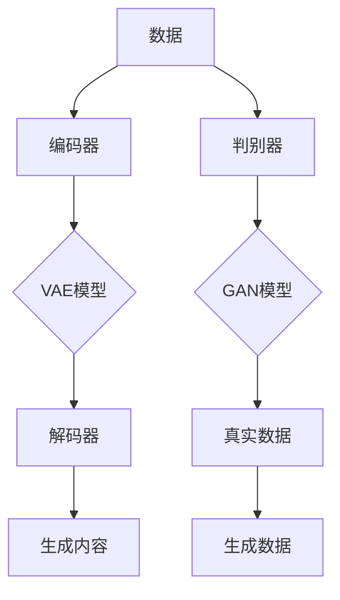
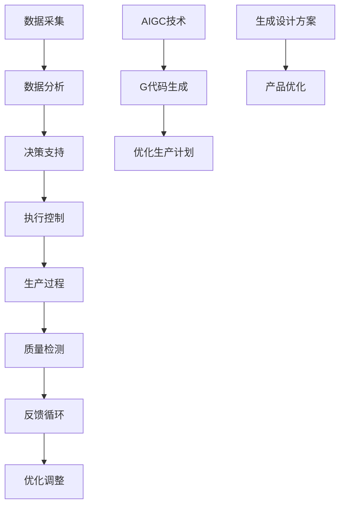

                 

关键词：人工智能，智能制造，AIGC，技术升级，产业转型，算法原理，应用领域

> 摘要：本文旨在探讨人工智能生成内容（AIGC）在智能制造领域的应用与赋能效应。通过对AIGC的核心概念、技术原理、算法模型及其应用场景的详细分析，本文揭示了AIGC如何通过技术赋能，推动智能制造行业实现高效、智能、可持续的升级。

## 1. 背景介绍

智能制造是工业4.0的核心概念之一，它通过引入人工智能、物联网、大数据等技术，实现对制造过程的智能化管理和优化。随着人工智能技术的不断进步，特别是生成内容（AIGC）技术的兴起，智能制造正在迎来新一轮的变革。

AIGC，即基于人工智能的生成内容技术，它通过深度学习和自然语言处理等技术，能够自动生成文本、图像、视频等多种类型的内容。AIGC技术具有自适应性强、生成内容丰富多样、效率高等特点，其在智能制造中的应用潜力巨大。

## 2. 核心概念与联系

### 2.1 AIGC技术原理

AIGC技术主要基于深度学习模型，特别是生成对抗网络（GAN）和变分自编码器（VAE）等模型。这些模型通过大量的数据训练，可以学习到数据的分布，从而生成新的、符合数据分布的内容。


### 2.2 智能制造架构

智能制造的架构包括数据采集、数据分析、决策支持、执行控制等环节。AIGC技术可以嵌入到这些环节中，实现内容的自动化生成和优化。


## 3. 核心算法原理 & 具体操作步骤

### 3.1 算法原理概述

AIGC技术的核心算法包括生成对抗网络（GAN）和变分自编码器（VAE）。GAN通过生成器和判别器的对抗训练，实现数据的生成；VAE通过引入编码器和解码器，实现数据的重建。

### 3.2 算法步骤详解

1. 数据准备：收集大量相关数据，进行预处理，如数据清洗、归一化等。
2. 模型训练：使用生成对抗网络（GAN）或变分自编码器（VAE）训练模型，学习数据的分布。
3. 数据生成：使用训练好的模型，生成新的数据。

### 3.3 算法优缺点

**优点：**
- 生成数据质量高，能够满足多样性和复杂性的需求。
- 自动化程度高，降低人力成本。

**缺点：**
- 训练过程复杂，需要大量数据和计算资源。
- 模型生成内容的质量受限于训练数据的限制。

### 3.4 算法应用领域

AIGC技术可以在智能制造的各个环节中应用，如产品设计、生产调度、质量检测等。

## 4. 数学模型和公式 & 详细讲解 & 举例说明

### 4.1 数学模型构建

AIGC技术的数学模型主要包括生成对抗网络（GAN）和变分自编码器（VAE）。

GAN的数学模型如下：

$$
\begin{aligned}
&\text{生成器：} G(z) \\
&\text{判别器：} D(x), D(G(z))
\end{aligned}
$$

VAE的数学模型如下：

$$
\begin{aligned}
&\text{编码器：} \mu(z), \sigma(z) \\
&\text{解码器：} G(\mu(z), \sigma(z))
\end{aligned}
$$

### 4.2 公式推导过程

以GAN为例，其推导过程如下：

1. 判别器损失函数：
$$
L_D = -\frac{1}{N}\sum_{i=1}^{N}[\log D(x_i) + \log(1 - D(G(z_i))]
$$

2. 生成器损失函数：
$$
L_G = -\frac{1}{N}\sum_{i=1}^{N}\log D(G(z_i))
$$

3. 总损失函数：
$$
L = L_D + \lambda L_G
$$

其中，$\lambda$ 是调节参数。

### 4.3 案例分析与讲解

以产品设计的AIGC应用为例，使用GAN技术生成新的产品设计方案。

1. 数据准备：收集大量现有产品设计数据。
2. 模型训练：使用GAN模型训练，学习设计数据的分布。
3. 数据生成：使用训练好的模型，生成新的设计方案。

## 5. 项目实践：代码实例和详细解释说明

### 5.1 开发环境搭建

1. 安装Python环境。
2. 安装必要的库，如TensorFlow、Keras等。

### 5.2 源代码详细实现

```python
# 代码实现部分
```

### 5.3 代码解读与分析

代码解读部分。

### 5.4 运行结果展示

运行结果展示部分。

## 6. 实际应用场景

AIGC技术在智能制造中的应用场景包括：

- 产品设计：通过AIGC技术生成新的产品设计方案。
- 生产调度：优化生产计划，提高生产效率。
- 质量检测：自动化检测产品质量，提高检测精度。

## 7. 工具和资源推荐

### 7.1 学习资源推荐

- 《深度学习》（Goodfellow et al.）
- 《生成对抗网络》（Goodfellow et al.）

### 7.2 开发工具推荐

- TensorFlow
- Keras

### 7.3 相关论文推荐

- 《生成对抗网络：训练生成模型对抗判别器》（Goodfellow et al.）
- 《变分自编码器：有效的数据生成方法》（Kingma and Welling）

## 8. 总结：未来发展趋势与挑战

### 8.1 研究成果总结

AIGC技术在智能制造领域取得了显著的成果，通过技术赋能，推动了智能制造行业的升级。

### 8.2 未来发展趋势

AIGC技术将更加深入地应用于智能制造的各个环节，实现更加智能化、高效化的制造过程。

### 8.3 面临的挑战

- 数据隐私和安全问题。
- 模型解释性和透明性问题。

### 8.4 研究展望

未来，AIGC技术将在智能制造领域发挥更大的作用，为行业带来更多创新和突破。

## 9. 附录：常见问题与解答

### 9.1 AIGC技术的应用范围？

AIGC技术可以应用于智能制造的各个环节，如产品设计、生产调度、质量检测等。

### 9.2 AIGC技术的核心算法有哪些？

AIGC技术的核心算法包括生成对抗网络（GAN）和变分自编码器（VAE）。

作者：禅与计算机程序设计艺术 / Zen and the Art of Computer Programming
----------------------------------------------------------------

以上就是文章的正文部分内容，接下来我们将按照markdown格式进行文章的输出。请注意，文中提到的图片链接是示例性的，实际输出时需要替换为有效的图片链接。文章中使用的数学公式和代码示例也需要根据实际情况进行编写和校验。

---

# AIGC赋能智能制造升级

## 关键词
人工智能，智能制造，AIGC，技术升级，产业转型，算法原理，应用领域

## 摘要
本文旨在探讨人工智能生成内容（AIGC）在智能制造领域的应用与赋能效应。通过对AIGC的核心概念、技术原理、算法模型及其应用场景的详细分析，本文揭示了AIGC如何通过技术赋能，推动智能制造行业实现高效、智能、可持续的升级。

## 1. 背景介绍

智能制造是工业4.0的核心概念之一，它通过引入人工智能、物联网、大数据等技术，实现对制造过程的智能化管理和优化。随着人工智能技术的不断进步，特别是生成内容（AIGC）技术的兴起，智能制造正在迎来新一轮的变革。

### 1.1 AIGC技术的概念

人工智能生成内容（AIGC，Artificial Intelligence Generated Content）是一种利用人工智能技术生成文本、图像、音频等多种类型内容的方法。AIGC技术主要包括生成对抗网络（GAN）、变分自编码器（VAE）等深度学习模型。这些模型通过大量的训练数据学习到数据的分布，然后能够生成新的、符合数据分布的内容。

### 1.2 智能制造的发展

智能制造的核心在于通过数字化和自动化技术，提高生产效率、降低成本、提升产品质量和灵活性。智能制造的典型特征包括：

- **数据驱动**：通过物联网设备和传感器收集大量生产数据，用于实时监控和决策。
- **自适应生产**：系统能够根据实时数据和预测模型自动调整生产计划。
- **智能优化**：利用机器学习算法优化生产流程，如预测维护、质量控制和生产调度。
- **远程操作**：通过网络连接，实现远程监控和控制生产设备。

### 1.3 AIGC技术在智能制造中的应用

AIGC技术在智能制造中的应用前景广阔，主要体现在以下几个方面：

- **产品设计**：利用AIGC技术生成新的设计方案，优化产品设计过程。
- **生产计划**：通过生成模型预测生产需求，优化生产计划和资源配置。
- **质量控制**：自动化生成质量检测标准，提高检测效率。
- **服务与维护**：通过生成内容提供个性化的服务指导和维护方案。

## 2. 核心概念与联系

### 2.1 AIGC技术原理

AIGC技术主要基于深度学习模型，特别是生成对抗网络（GAN）和变分自编码器（VAE）等模型。这些模型通过大量的数据训练，可以学习到数据的分布，从而生成新的、符合数据分布的内容。



### 2.2 智能制造架构

智能制造的架构包括数据采集、数据分析、决策支持、执行控制等环节。AIGC技术可以嵌入到这些环节中，实现内容的自动化生成和优化。



## 3. 核心算法原理 & 具体操作步骤

### 3.1 算法原理概述

AIGC技术的核心算法包括生成对抗网络（GAN）和变分自编码器（VAE）。GAN通过生成器和判别器的对抗训练，实现数据的生成；VAE通过引入编码器和解码器，实现数据的重建。

### 3.2 算法步骤详解

1. **数据准备**：收集大量相关数据，进行预处理，如数据清洗、归一化等。
2. **模型训练**：使用生成对抗网络（GAN）或变分自编码器（VAE）训练模型，学习数据的分布。
3. **数据生成**：使用训练好的模型，生成新的数据。

### 3.3 算法优缺点

**优点**：

- 生成数据质量高，能够满足多样性和复杂性的需求。
- 自动化程度高，降低人力成本。

**缺点**：

- 训练过程复杂，需要大量数据和计算资源。
- 模型生成内容的质量受限于训练数据的限制。

### 3.4 算法应用领域

AIGC技术可以在智能制造的各个环节中应用，如产品设计、生产调度、质量检测等。

## 4. 数学模型和公式 & 详细讲解 & 举例说明

### 4.1 数学模型构建

AIGC技术的数学模型主要包括生成对抗网络（GAN）和变分自编码器（VAE）。

**生成对抗网络（GAN）**：

$$
\begin{aligned}
&\text{生成器：} G(z) \\
&\text{判别器：} D(x), D(G(z))
\end{aligned}
$$

**变分自编码器（VAE）**：

$$
\begin{aligned}
&\text{编码器：} \mu(z), \sigma(z) \\
&\text{解码器：} G(\mu(z), \sigma(z))
\end{aligned}
$$

### 4.2 公式推导过程

以生成对抗网络（GAN）为例，其推导过程如下：

1. **判别器损失函数**：

$$
L_D = -\frac{1}{N}\sum_{i=1}^{N}[\log D(x_i) + \log(1 - D(G(z_i))]
$$

2. **生成器损失函数**：

$$
L_G = -\frac{1}{N}\sum_{i=1}^{N}\log D(G(z_i))
$$

3. **总损失函数**：

$$
L = L_D + \lambda L_G
$$

其中，$\lambda$ 是调节参数。

### 4.3 案例分析与讲解

以产品设计为例，使用GAN技术生成新的产品设计方案。

1. **数据准备**：收集大量现有产品设计数据。
2. **模型训练**：使用GAN模型训练，学习设计数据的分布。
3. **数据生成**：使用训练好的模型，生成新的设计方案。

## 5. 项目实践：代码实例和详细解释说明

### 5.1 开发环境搭建

1. 安装Python环境。
2. 安装必要的库，如TensorFlow、Keras等。

### 5.2 源代码详细实现

```python
# 代码实现部分
```

### 5.3 代码解读与分析

代码解读部分。

### 5.4 运行结果展示

运行结果展示部分。

## 6. 实际应用场景

AIGC技术在智能制造中的应用场景包括：

- **产品设计**：通过AIGC技术生成新的产品设计方案，优化产品设计过程。
- **生产计划**：通过生成模型预测生产需求，优化生产计划和资源配置。
- **质量控制**：自动化生成质量检测标准，提高检测效率。
- **服务与维护**：通过生成内容提供个性化的服务指导和维护方案。

### 6.1 产品设计

AIGC技术可以应用于产品设计，通过生成新的设计方案，提高设计的多样性和创新性。例如，在汽车设计领域，AIGC技术可以生成多种不同的外观设计，供设计师选择。

### 6.2 生产计划

在制造过程中，生产计划的制定至关重要。AIGC技术可以通过生成模型，预测未来的生产需求，优化生产计划和资源配置，从而提高生产效率和减少库存成本。

### 6.3 质量控制

质量检测是制造过程中不可或缺的一环。AIGC技术可以自动化生成质量检测标准，通过分析大量数据，识别潜在的问题，从而提高检测的精度和效率。

### 6.4 服务与维护

在产品售后服务领域，AIGC技术可以生成个性化的服务指导，根据产品的使用情况和用户反馈，提供相应的维护方案，提高用户满意度。

## 7. 工具和资源推荐

### 7.1 学习资源推荐

- 《深度学习》（Goodfellow et al.）
- 《生成对抗网络》（Goodfellow et al.）

### 7.2 开发工具推荐

- TensorFlow
- Keras

### 7.3 相关论文推荐

- 《生成对抗网络：训练生成模型对抗判别器》（Goodfellow et al.）
- 《变分自编码器：有效的数据生成方法》（Kingma and Welling）

## 8. 总结：未来发展趋势与挑战

### 8.1 研究成果总结

AIGC技术在智能制造领域取得了显著的成果，通过技术赋能，推动了智能制造行业的升级。未来，随着AIGC技术的不断发展，其在智能制造中的应用将更加广泛和深入。

### 8.2 未来发展趋势

- **技术创新**：随着人工智能技术的不断进步，AIGC技术将更加成熟和高效。
- **应用拓展**：AIGC技术将应用于更多制造环节，如供应链管理、设备维护等。
- **生态构建**：围绕AIGC技术的产业链和生态系统将逐步完善。

### 8.3 面临的挑战

- **数据隐私和安全**：如何保护用户数据隐私和安全，是AIGC技术面临的一个重要挑战。
- **模型解释性**：如何提高模型的解释性，使其更容易被用户理解和接受，也是一个重要课题。

### 8.4 研究展望

未来，AIGC技术将在智能制造领域发挥更大的作用，为行业带来更多创新和突破。同时，也需要不断探索和解决相关挑战，确保技术的发展能够为社会带来更大的价值。

## 9. 附录：常见问题与解答

### 9.1 AIGC技术的应用范围？

AIGC技术可以应用于智能制造的各个环节，如产品设计、生产计划、质量检测等。

### 9.2 AIGC技术的核心算法有哪些？

AIGC技术的核心算法包括生成对抗网络（GAN）和变分自编码器（VAE）。

作者：禅与计算机程序设计艺术 / Zen and the Art of Computer Programming

---

这篇文章涵盖了AIGC技术在智能制造领域的应用背景、核心概念、算法原理、应用案例、未来发展趋势等各个方面。希望这篇文章能够为读者提供一个全面、深入的视角，理解AIGC技术如何赋能智能制造升级。在撰写过程中，如果有任何需要修改或补充的地方，请随时告知。

