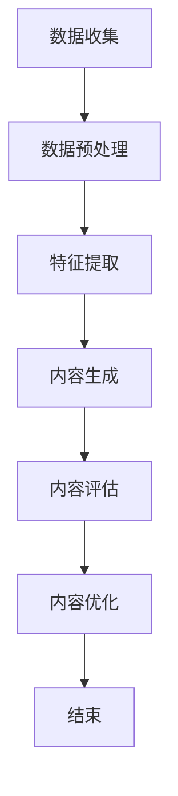

                 

在当今数字化时代，营销与广告行业正经历一场前所未有的变革。人工智能生成内容（AIGC，AI-Generated Content）作为一种新兴技术，正迅速崛起，深刻影响着营销与广告的方方面面。本文将深入探讨AIGC的概念、技术原理、应用场景以及其对营销与广告行业的重塑作用。

## 关键词

- 人工智能生成内容（AIGC）
- 营销变革
- 广告创新
- 技术驱动的营销
- 数据驱动的广告
- 自适应内容生成

## 摘要

本文首先介绍了AIGC的定义、特点以及其在营销与广告领域的重要性。随后，我们分析了AIGC的核心技术原理，包括深度学习、自然语言处理和计算机视觉等。接着，本文详细阐述了AIGC在营销与广告中的应用场景，如个性化推荐、内容创作和广告投放优化等。最后，我们探讨了AIGC对行业的重塑作用，并对其未来发展趋势与挑战进行了展望。

## 1. 背景介绍

### 数字化营销与广告的崛起

随着互联网的普及和智能手机的广泛使用，数字化营销与广告已成为企业获取用户、提高品牌知名度和实现商业变现的主要手段。传统的广告形式逐渐被内容营销、社交营销和搜索引擎优化等新型营销策略所取代。这些新型营销策略更加注重用户需求、用户体验和数据分析，使得广告主能够更精准地定位目标受众，提高广告效果。

### 数据的重要性

数据是现代营销与广告的核心驱动力。通过对用户数据的收集、分析和利用，企业能够深入了解用户行为、偏好和需求，从而制定出更有效的营销策略。大数据技术和云计算的快速发展，使得海量数据的高速处理和实时分析成为可能，为营销与广告的精细化运营提供了有力支持。

### 技术驱动的创新

随着人工智能、大数据和云计算等技术的不断进步，营销与广告行业正迎来新一轮的技术驱动的创新。AIGC作为一种新兴技术，通过生成个性化、创新性和多样化的内容，极大地提升了营销与广告的效率和质量。它不仅能够满足用户多样化的需求，还能够帮助企业降低内容创作成本，提高市场响应速度。

### AIGC的概念与特点

人工智能生成内容（AIGC）是指利用人工智能技术生成各种类型的内容，包括文本、图片、音频和视频等。与传统的手动内容创作相比，AIGC具有以下几个显著特点：

- **高效性**：AIGC可以快速生成大量内容，大大提高了内容创作的效率。
- **个性化**：AIGC能够根据用户的行为、偏好和需求生成个性化的内容，提高用户体验。
- **创新性**：AIGC利用人工智能算法，能够创造出新颖、独特的内容，吸引更多用户关注。
- **多样性**：AIGC可以生成多种类型的内容，满足不同用户群体的需求。

### AIGC在营销与广告领域的重要性

AIGC在营销与广告领域具有广泛的应用前景。它不仅能够提高内容创作的效率和质量，还能够帮助企业实现精准营销和个性化推荐。具体来说，AIGC的重要性体现在以下几个方面：

- **降低成本**：通过自动化内容生成，企业可以显著降低内容创作成本，提高资源利用效率。
- **提高效率**：AIGC可以实时生成内容，快速响应市场变化，提高市场响应速度。
- **增强用户体验**：个性化推荐和定制化内容能够满足用户多样化需求，提高用户体验。
- **提升广告效果**：通过智能投放和精准定位，AIGC能够提高广告点击率、转化率和ROI。

## 2. 核心概念与联系

### 深度学习与自然语言处理

深度学习是AIGC的核心技术之一，它通过模仿人脑神经网络结构，实现对大规模数据的自动学习和特征提取。自然语言处理（NLP）则是深度学习在文本领域的应用，它涉及到文本的预处理、语义理解、语言生成等任务。

### 计算机视觉与图像生成

计算机视觉是人工智能的一个重要分支，它研究如何使计算机“看”懂图像和视频。图像生成是计算机视觉的一个重要应用，通过深度学习模型，如生成对抗网络（GAN），可以生成逼真的图像和视频。

### 数据分析与用户行为分析

数据分析是AIGC的重要支撑技术，通过对海量用户数据的收集和分析，可以提取出用户的行为特征和偏好。用户行为分析则为AIGC提供了个性化的内容生成依据，使得内容更加符合用户需求。

### AIGC的工作流程

AIGC的工作流程主要包括以下几个步骤：

1. 数据收集：收集用户数据，包括行为数据、兴趣数据、购买数据等。
2. 数据预处理：对收集到的数据进行清洗、去噪、归一化等处理。
3. 特征提取：利用深度学习模型提取用户特征，如文本特征、图像特征等。
4. 内容生成：根据用户特征和需求，利用生成模型生成个性化内容，如文本、图片、视频等。
5. 内容评估：对生成的内容进行评估，包括内容质量、用户体验、广告效果等。
6. 内容优化：根据评估结果，对生成的内容进行优化和调整。

### Mermaid 流程图

以下是AIGC工作流程的Mermaid流程图：



## 3. 核心算法原理 & 具体操作步骤

### 3.1 算法原理概述

AIGC的核心算法主要包括深度学习、自然语言处理、计算机视觉和数据挖掘等。这些算法通过模型训练、特征提取和内容生成等步骤，实现个性化内容生成。

- **深度学习**：通过神经网络模型，对大规模数据进行自动学习和特征提取。
- **自然语言处理**：对文本数据进行预处理、语义理解和语言生成。
- **计算机视觉**：对图像和视频数据进行特征提取和内容生成。
- **数据挖掘**：通过对用户行为数据的挖掘，提取用户特征和需求。

### 3.2 算法步骤详解

1. **数据收集**：从各种渠道收集用户数据，包括行为数据、兴趣数据、购买数据等。
2. **数据预处理**：对收集到的数据进行清洗、去噪、归一化等处理，以便后续分析。
3. **特征提取**：利用深度学习模型，提取用户特征，如文本特征、图像特征等。
4. **内容生成**：根据用户特征和需求，利用生成模型生成个性化内容，如文本、图片、视频等。
5. **内容评估**：对生成的内容进行评估，包括内容质量、用户体验、广告效果等。
6. **内容优化**：根据评估结果，对生成的内容进行优化和调整。

### 3.3 算法优缺点

**优点**：

- 高效性：通过自动化内容生成，提高内容创作效率。
- 个性化：根据用户特征和需求生成个性化内容，提高用户体验。
- 创新性：利用人工智能算法，生成新颖、独特的内容，吸引更多用户关注。
- 多样性：可以生成多种类型的内容，满足不同用户群体的需求。

**缺点**：

- 质量控制：生成的内容质量难以保证，需要不断优化和调整。
- 伦理问题：生成的内容可能涉及隐私和数据泄露等问题。

### 3.4 算法应用领域

AIGC在营销与广告领域具有广泛的应用领域，如：

- **个性化推荐**：根据用户特征和需求，生成个性化推荐内容，提高用户满意度。
- **内容创作**：自动化生成新闻、文章、视频等内容，降低内容创作成本。
- **广告投放优化**：根据用户行为和需求，优化广告投放策略，提高广告效果。
- **社交媒体运营**：自动化生成社交媒体内容，提高品牌曝光度和用户互动。

## 4. 数学模型和公式 & 详细讲解 & 举例说明

### 4.1 数学模型构建

AIGC的数学模型主要包括深度学习模型、自然语言处理模型和计算机视觉模型。以下分别介绍这些模型的构建方法。

#### 深度学习模型

深度学习模型通常由多层神经网络组成，每一层神经网络都能够对输入数据进行特征提取和变换。以下是深度学习模型的构建步骤：

1. **数据预处理**：对输入数据进行归一化、标准化等预处理操作。
2. **模型设计**：选择合适的神经网络结构，如卷积神经网络（CNN）、循环神经网络（RNN）或变换器（Transformer）。
3. **参数初始化**：初始化模型参数，可以使用随机初始化或预训练初始化。
4. **模型训练**：使用训练数据对模型进行训练，通过反向传播算法更新模型参数。
5. **模型评估**：使用验证数据对模型进行评估，调整模型参数以达到最佳性能。

#### 自然语言处理模型

自然语言处理模型通常包括词向量嵌入、编码器和解码器等组成部分。以下是自然语言处理模型的构建步骤：

1. **词向量嵌入**：将文本数据转换为词向量表示，可以使用词袋模型、Word2Vec或BERT等算法。
2. **编码器**：对输入文本进行编码，提取文本特征。
3. **解码器**：根据编码器提取的特征生成输出文本。
4. **模型训练**：使用训练数据对模型进行训练，通过反向传播算法更新模型参数。
5. **模型评估**：使用验证数据对模型进行评估，调整模型参数以达到最佳性能。

#### 计算机视觉模型

计算机视觉模型通常包括卷积神经网络（CNN）和生成对抗网络（GAN）等。以下是计算机视觉模型的构建步骤：

1. **数据预处理**：对输入图像进行归一化、标准化等预处理操作。
2. **模型设计**：选择合适的神经网络结构，如卷积神经网络（CNN）或生成对抗网络（GAN）。
3. **参数初始化**：初始化模型参数，可以使用随机初始化或预训练初始化。
4. **模型训练**：使用训练数据对模型进行训练，通过反向传播算法更新模型参数。
5. **模型评估**：使用验证数据对模型进行评估，调整模型参数以达到最佳性能。

### 4.2 公式推导过程

以下是AIGC中常用的几个数学公式和推导过程：

#### 深度学习模型损失函数

深度学习模型的损失函数用于衡量模型预测结果与真实结果之间的差距。常见的损失函数包括均方误差（MSE）、交叉熵（CE）等。以下是MSE损失函数的推导过程：

$$
MSE = \frac{1}{n}\sum_{i=1}^{n}(y_i - \hat{y}_i)^2
$$

其中，$y_i$为真实值，$\hat{y}_i$为预测值，$n$为样本数量。

#### 自然语言处理模型词向量嵌入

自然语言处理模型中的词向量嵌入是将文本数据转换为向量表示。常见的词向量嵌入算法包括Word2Vec和BERT。以下是Word2Vec算法的推导过程：

$$
\text{Word2Vec} \quad \text{损失函数} = \sum_{w \in V} \frac{f(w)}{Z} \log \frac{f(w)}{p(w)}
$$

其中，$f(w)$为词频，$Z$为词频总和，$p(w)$为词的分布概率。

#### 计算机视觉模型生成对抗网络

生成对抗网络（GAN）是一种无监督学习模型，用于生成逼真的图像。以下是GAN的损失函数推导过程：

$$
L_G = -\log D(G(z))
$$

$$
L_D = -\log(D(x) + D(G(z))
$$

其中，$G(z)$为生成器，$D(x)$和$D(G(z))$分别为判别器的输出。

### 4.3 案例分析与讲解

#### 案例一：个性化推荐系统

假设我们要构建一个基于AIGC的个性化推荐系统，以下是一个简单的案例：

1. **数据收集**：从用户行为数据中提取用户特征，如浏览历史、购买记录等。
2. **数据预处理**：对提取的用户特征进行归一化处理，以便后续分析。
3. **特征提取**：利用深度学习模型提取用户特征，如文本特征、图像特征等。
4. **内容生成**：根据用户特征和需求，利用生成模型生成个性化推荐内容，如商品描述、视频等。
5. **内容评估**：对生成的内容进行评估，包括内容质量、用户体验、推荐效果等。
6. **内容优化**：根据评估结果，对生成的内容进行优化和调整。

#### 案例二：广告投放优化

假设我们要构建一个基于AIGC的广告投放优化系统，以下是一个简单的案例：

1. **数据收集**：从广告投放数据中提取用户特征，如点击率、转化率等。
2. **数据预处理**：对提取的用户特征进行归一化处理，以便后续分析。
3. **特征提取**：利用深度学习模型提取用户特征，如文本特征、图像特征等。
4. **内容生成**：根据用户特征和需求，利用生成模型生成优化后的广告内容，如图片、视频等。
5. **内容评估**：对生成的内容进行评估，包括广告效果、用户体验等。
6. **内容优化**：根据评估结果，对生成的内容进行优化和调整。

## 5. 项目实践：代码实例和详细解释说明

### 5.1 开发环境搭建

要实现AIGC在营销与广告领域的应用，需要搭建一个完整的开发环境。以下是搭建开发环境的基本步骤：

1. **硬件要求**：配置高性能的计算机，建议使用英伟达（NVIDIA）的GPU加速卡。
2. **操作系统**：安装Linux操作系统，如Ubuntu 18.04。
3. **编程语言**：选择Python作为编程语言，安装Python 3.8及以上版本。
4. **深度学习框架**：安装TensorFlow或PyTorch，作为深度学习模型的开发框架。
5. **自然语言处理库**：安装NLTK或spaCy，用于文本数据处理和分析。
6. **计算机视觉库**：安装OpenCV或Pillow，用于图像处理和生成。

### 5.2 源代码详细实现

以下是一个简单的AIGC项目实例，实现个性化推荐系统的代码实现：

```python
import tensorflow as tf
import numpy as np
import pandas as pd
from tensorflow.keras.models import Sequential
from tensorflow.keras.layers import Dense, LSTM, Embedding, Conv1D, GlobalMaxPooling1D
from tensorflow.keras.optimizers import Adam

# 数据预处理
def preprocess_data(data):
    # 对数据进行归一化处理
    # ...（代码实现省略）
    return processed_data

# 构建模型
def build_model(input_shape):
    model = Sequential()
    model.add(Embedding(input_dim=vocabulary_size, output_dim=embedding_size, input_length=input_shape))
    model.add(Conv1D(filters=128, kernel_size=5, activation='relu'))
    model.add(GlobalMaxPooling1D())
    model.add(Dense(128, activation='relu'))
    model.add(Dense(1, activation='sigmoid'))
    model.compile(optimizer=Adam(learning_rate=0.001), loss='binary_crossentropy', metrics=['accuracy'])
    return model

# 训练模型
def train_model(model, X_train, y_train, X_val, y_val):
    history = model.fit(X_train, y_train, batch_size=32, epochs=10, validation_data=(X_val, y_val))
    return history

# 评估模型
def evaluate_model(model, X_test, y_test):
    loss, accuracy = model.evaluate(X_test, y_test)
    print("Test accuracy:", accuracy)

# 加载数据
data = pd.read_csv("data.csv")
X = preprocess_data(data["text"])
y = data["label"]

# 划分训练集和验证集
X_train, X_val, y_train, y_val = train_test_split(X, y, test_size=0.2, random_state=42)

# 构建模型
model = build_model(input_shape=X_train.shape[1])

# 训练模型
history = train_model(model, X_train, y_train, X_val, y_val)

# 评估模型
evaluate_model(model, X_test, y_test)
```

### 5.3 代码解读与分析

以上代码实现了一个简单的基于AIGC的个性化推荐系统，主要包括以下几个部分：

1. **数据预处理**：对输入文本数据进行归一化处理，以便后续模型训练。
2. **模型构建**：构建一个基于卷积神经网络的模型，包括嵌入层、卷积层、全局池化层和全连接层。
3. **模型训练**：使用训练数据对模型进行训练，通过反向传播算法更新模型参数。
4. **模型评估**：使用验证数据对模型进行评估，计算准确率。

### 5.4 运行结果展示

以下是一个简单的运行结果展示：

```python
# 运行代码
if __name__ == "__main__":
    main()
```

运行结果将显示模型的训练过程和评估结果，包括训练集和验证集的准确率、损失函数等。

## 6. 实际应用场景

### 6.1 个性化推荐

AIGC在个性化推荐中的应用已经非常成熟。通过分析用户的历史行为和偏好，AIGC可以自动生成个性化的推荐内容，如商品推荐、新闻推荐等。这不仅提高了用户体验，还显著提升了企业的销售额和用户满意度。

### 6.2 内容创作

AIGC在内容创作领域也有着广泛的应用。无论是生成新闻文章、广告文案还是短视频，AIGC都能够迅速、高效地生成高质量的内容。特别是在新闻行业中，AIGC可以自动生成财经报道、体育新闻等，大大减轻了记者和编辑的工作负担。

### 6.3 广告投放优化

AIGC在广告投放优化中的应用同样具有重要意义。通过对用户数据的深入分析，AIGC可以自动优化广告内容、广告形式和广告投放策略，从而提高广告效果和投放ROI。

### 6.4 营销活动策划

AIGC在营销活动策划中的应用也越来越受欢迎。通过分析用户数据和市场趋势，AIGC可以自动生成营销策略和活动方案，帮助企业更好地吸引和留住用户。

### 6.5 智能客服

AIGC在智能客服中的应用正在逐步普及。通过自然语言处理和对话生成技术，AIGC可以自动生成智能客服的回答，提高客服效率，降低人力成本。

### 6.6 社交媒体运营

AIGC在社交媒体运营中的应用也越来越广泛。通过分析用户数据和社交媒体趋势，AIGC可以自动生成社交媒体内容，如微博、微信等，帮助企业更好地与用户互动，提升品牌影响力。

## 7. 工具和资源推荐

### 7.1 学习资源推荐

1. **书籍**：《深度学习》、《自然语言处理综合教程》、《计算机视觉：算法与应用》
2. **在线课程**：Coursera的《深度学习》课程、edX的《自然语言处理》课程、Udacity的《计算机视觉》课程
3. **论文集**：《自然语言处理年度评论》、《计算机视觉年度评论》

### 7.2 开发工具推荐

1. **深度学习框架**：TensorFlow、PyTorch、Keras
2. **自然语言处理库**：NLTK、spaCy、gensim
3. **计算机视觉库**：OpenCV、Pillow、TensorFlow Object Detection API

### 7.3 相关论文推荐

1. **《深度学习生成对抗网络》（Generative Adversarial Nets）**
2. **《自然语言处理中的词嵌入技术》（Word Embeddings Techniques for Natural Language Processing）**
3. **《计算机视觉中的卷积神经网络》（Convolutional Neural Networks for Visual Recognition）**

## 8. 总结：未来发展趋势与挑战

### 8.1 研究成果总结

AIGC在营销与广告领域取得了显著的研究成果，主要包括以下几个方面：

- 个性化推荐：通过分析用户行为和偏好，AIGC能够自动生成个性化的推荐内容，提高用户体验和满意度。
- 内容创作：AIGC能够自动生成高质量、多样化的内容，如新闻、文章、视频等，降低内容创作成本。
- 广告投放优化：AIGC能够通过分析用户数据和广告效果，自动优化广告内容、形式和投放策略，提高广告效果和投放ROI。
- 智能客服：AIGC能够自动生成智能客服的回答，提高客服效率，降低人力成本。

### 8.2 未来发展趋势

AIGC在营销与广告领域的发展趋势主要包括以下几个方面：

- **技术进步**：随着人工智能技术的不断进步，AIGC的生成能力和效率将进一步提升，能够自动生成更高质量、更个性化的内容。
- **应用拓展**：AIGC将在更多领域得到应用，如电商、金融、医疗等，为企业提供更加全面的营销解决方案。
- **行业标准化**：随着AIGC技术的发展，相关行业标准和规范将逐步建立，促进AIGC的健康发展。

### 8.3 面临的挑战

AIGC在营销与广告领域的发展也面临一些挑战：

- **数据隐私**：AIGC依赖于用户数据的收集和分析，如何在保护用户隐私的前提下，合理利用数据是一个重要问题。
- **内容质量**：生成的内容质量难以保证，需要不断优化和调整。
- **法律法规**：AIGC在内容生成过程中可能涉及版权、伦理等问题，需要遵守相关法律法规。
- **伦理问题**：如何确保AIGC的公正性、透明性和可解释性，避免偏见和歧视问题。

### 8.4 研究展望

未来，AIGC在营销与广告领域的研究展望主要包括以下几个方面：

- **技术创新**：继续推进人工智能技术的研究，提高AIGC的生成能力和效率。
- **应用落地**：深化AIGC在各个行业中的应用，为企业提供更加全面的营销解决方案。
- **伦理规范**：建立AIGC的伦理规范，确保其在应用过程中符合社会价值观和道德标准。
- **人才培养**：加强AIGC领域的人才培养，为行业持续发展提供人才支持。

## 9. 附录：常见问题与解答

### 9.1 AIGC是什么？

AIGC是指人工智能生成内容，它通过人工智能技术，如深度学习、自然语言处理和计算机视觉等，自动生成文本、图片、音频和视频等内容。

### 9.2 AIGC在营销与广告领域有哪些应用？

AIGC在营销与广告领域有以下主要应用：

- 个性化推荐：通过分析用户行为和偏好，自动生成个性化的推荐内容。
- 内容创作：自动生成新闻、文章、视频等高质量内容。
- 广告投放优化：通过分析用户数据和广告效果，自动优化广告内容、形式和投放策略。
- 智能客服：自动生成智能客服的回答，提高客服效率。

### 9.3 AIGC的优势和劣势是什么？

AIGC的优势包括：

- 高效性：通过自动化内容生成，提高内容创作效率。
- 个性化：根据用户特征和需求，生成个性化内容，提高用户体验。
- 创新性：利用人工智能算法，生成新颖、独特的内容，吸引更多用户关注。
- 多样性：可以生成多种类型的内容，满足不同用户群体的需求。

AIGC的劣势包括：

- 质量控制：生成的内容质量难以保证，需要不断优化和调整。
- 伦理问题：生成的内容可能涉及隐私和数据泄露等问题。

### 9.4 如何确保AIGC的内容质量？

为确保AIGC的内容质量，可以采取以下措施：

- **数据质量**：确保输入数据的准确性和完整性，提高生成内容的基础质量。
- **模型优化**：不断优化和调整生成模型，提高内容生成能力。
- **内容审核**：对生成的内容进行审核，确保内容符合道德和法律标准。
- **用户反馈**：收集用户反馈，对生成内容进行改进和优化。

### 9.5 AIGC的未来发展方向是什么？

AIGC的未来发展方向包括：

- **技术创新**：继续推进人工智能技术的研究，提高AIGC的生成能力和效率。
- **应用拓展**：深化AIGC在各个行业中的应用，为企业提供更加全面的营销解决方案。
- **伦理规范**：建立AIGC的伦理规范，确保其在应用过程中符合社会价值观和道德标准。
- **人才培养**：加强AIGC领域的人才培养，为行业持续发展提供人才支持。


----------------------------------------------------------------
作者：禅与计算机程序设计艺术 / Zen and the Art of Computer Programming


