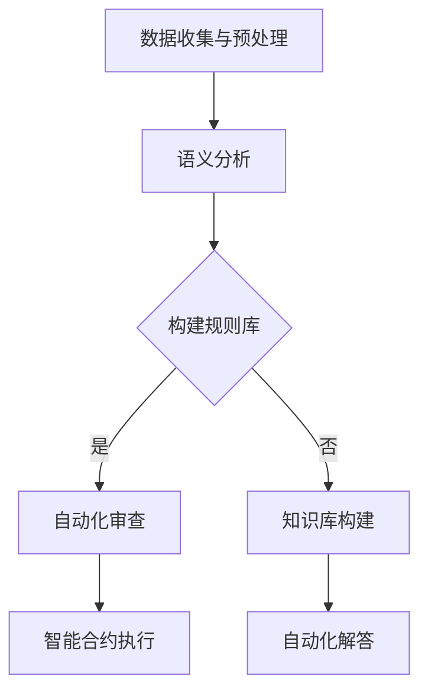

                 

关键词：人工智能、生成内容、法律服务、智能合约、自动化审查、法律咨询

> 摘要：本文探讨了人工智能生成内容（AIGC）技术在法律服务领域的应用，以及如何重新定义传统的法律服务模式。通过分析AIGC的核心原理和算法，以及其在法律合同自动化审查、智能合约执行和法律咨询自动化等方面的应用，本文揭示了AIGC技术为法律行业带来的变革潜力，并展望了其未来的发展趋势与挑战。

## 1. 背景介绍

随着人工智能技术的不断进步，人工智能生成内容（AIGC，Artificial Intelligence Generated Content）逐渐成为一个热门研究领域。AIGC是指利用人工智能技术，如深度学习、自然语言处理和生成对抗网络等，生成具有创造性和自主性的文本、图像、音频和视频等内容。传统的生成内容主要依赖于人类创造，而AIGC则打破了这一限制，为各行各业带来了全新的变革机会。

在法律服务领域，AIGC技术正逐渐引发一系列变革。首先，AIGC技术可以用于法律文档的自动化生成和审查，提高法律工作的效率和准确性。其次，智能合约的执行依赖于精确的法律条款和规则，AIGC可以帮助法律专业人士快速构建和验证智能合约，降低违约风险。此外，AIGC还可以应用于法律咨询的自动化，为普通民众提供便捷的法律服务。

本文将深入探讨AIGC技术在法律服务领域的应用，分析其核心原理和算法，以及其在实际项目中的实现方法。同时，本文还将讨论AIGC技术为法律行业带来的挑战和未来发展趋势。

## 2. 核心概念与联系

### 2.1. 人工智能生成内容（AIGC）

人工智能生成内容（AIGC）是一种利用人工智能技术生成具有创造性和自主性的内容的方法。AIGC技术主要包括以下几种类型：

1. **文本生成**：基于自然语言处理（NLP）技术，AIGC可以生成文章、报告、法律文件等文本内容。
2. **图像生成**：利用深度学习中的生成对抗网络（GAN）等技术，AIGC可以生成逼真的图像和动画。
3. **音频生成**：通过语音合成技术，AIGC可以生成逼真的语音和音频内容。
4. **视频生成**：结合图像生成和音频生成技术，AIGC可以生成具有真实场景的视频内容。

### 2.2. 法律合同自动化审查

法律合同自动化审查是指利用人工智能技术对法律合同进行自动化审核和评估。这包括以下步骤：

1. **数据收集与预处理**：从各种来源收集法律合同数据，并对数据进行清洗和预处理。
2. **语义分析**：利用自然语言处理技术对合同文本进行语义分析，提取关键条款和条件。
3. **规则库构建**：根据法律法规和行业标准，构建法律条款的规则库。
4. **自动化审查**：将合同文本与规则库进行匹配，自动识别潜在的法律风险和问题。

### 2.3. 智能合约执行

智能合约是基于区块链技术的自动执行合同。AIGC技术在智能合约执行中主要应用于以下方面：

1. **合同条款生成**：利用AIGC生成智能合约的条款和条件，确保条款的准确性和合法性。
2. **规则库构建**：将法律法规和行业标准转换为智能合约的执行规则，实现自动化执行。
3. **智能合约执行**：根据智能合约的条款和规则，自动执行合同义务，降低违约风险。

### 2.4. 法律咨询自动化

法律咨询自动化是指利用人工智能技术为用户提供自动化法律咨询和服务。这包括以下步骤：

1. **问题分类与定位**：利用自然语言处理技术，对用户提出的问题进行分类和定位。
2. **知识库构建**：构建涵盖各类法律问题的知识库，包括法律法规、案例解析等。
3. **自动化解答**：根据用户的问题，从知识库中检索相关信息，生成自动化解答。

### 2.5. Mermaid 流程图

以下是AIGC技术在法律服务中的核心流程的Mermaid流程图表示：



## 3. 核心算法原理 & 具体操作步骤

### 3.1. 算法原理概述

AIGC技术的核心在于利用深度学习、自然语言处理和生成对抗网络等算法，生成具有创造性和自主性的内容。以下简要介绍几种关键算法：

1. **深度学习**：深度学习是一种模拟人脑神经元结构的机器学习技术，通过多层神经网络进行特征提取和模式识别。在AIGC中，深度学习用于文本生成、图像生成和音频生成等任务。

2. **自然语言处理（NLP）**：自然语言处理是一种使计算机能够理解和处理人类语言的技术。在AIGC中，NLP用于语义分析、文本分类、命名实体识别等任务。

3. **生成对抗网络（GAN）**：生成对抗网络是一种由生成器和判别器组成的对抗性网络结构，通过竞争和合作生成高质量的数据。在AIGC中，GAN用于图像生成、音频生成和视频生成等任务。

### 3.2. 算法步骤详解

以下是AIGC技术在法律服务中的具体操作步骤：

1. **数据收集与预处理**：从法律文档、案例、法律法规等来源收集数据，并对数据进行清洗和预处理，如去除停用词、进行词性标注等。

2. **语义分析**：利用自然语言处理技术对法律文档进行语义分析，提取关键条款和条件。这包括文本分类、命名实体识别、依存句法分析等任务。

3. **规则库构建**：根据法律法规和行业标准，构建法律条款的规则库。这包括将法律法规转换为计算机可处理的规则，并利用机器学习技术进行规则分类和权重分配。

4. **文本生成**：利用深度学习模型，如变换器（Transformer）和循环神经网络（RNN），生成法律文档和条款。这包括法律文件的自动生成、合同条款的生成等。

5. **自动化审查**：将法律文档与规则库进行匹配，自动识别潜在的法律风险和问题。这包括自动化审查法律合同、知识产权侵权检测等。

6. **智能合约执行**：根据智能合约的条款和规则，自动执行合同义务，降低违约风险。这包括智能合约的自动化生成、执行和监控等。

7. **法律咨询自动化**：根据用户提出的问题，从知识库中检索相关信息，生成自动化解答。这包括法律咨询的自动化、法律文件的自动生成等。

### 3.3. 算法优缺点

**优点**：

1. 提高工作效率：AIGC技术可以自动化处理大量的法律文档和条款，提高工作效率。
2. 减少人为错误：通过规则库和算法，AIGC技术可以减少人为错误，提高法律工作的准确性。
3. 降低成本：AIGC技术可以降低法律服务的成本，使法律服务更加普及。

**缺点**：

1. 数据质量依赖：AIGC技术的效果很大程度上取决于数据质量和预处理，数据质量不佳可能导致错误结果。
2. 法律合规风险：AIGC技术生成的法律文档和条款可能存在合规风险，需要专业人员进行审查和修正。
3. 技术依赖：AIGC技术需要大量计算资源和专业技术人员，对中小企业可能形成技术门槛。

### 3.4. 算法应用领域

AIGC技术在法律服务领域具有广泛的应用潜力，包括以下方面：

1. **法律文档自动化生成**：AIGC技术可以自动化生成法律文件、合同、协议等，提高工作效率。
2. **法律咨询自动化**：AIGC技术可以提供自动化法律咨询，为普通民众提供便捷的法律服务。
3. **智能合约执行**：AIGC技术可以帮助法律专业人士快速构建和验证智能合约，降低违约风险。
4. **自动化审查**：AIGC技术可以自动化审查法律合同、知识产权等，提高法律工作的准确性。
5. **法律研究**：AIGC技术可以自动化处理大量的法律文献和案例，帮助法律专业人士进行法律研究和分析。

## 4. 数学模型和公式 & 详细讲解 & 举例说明

### 4.1. 数学模型构建

AIGC技术的核心在于构建合适的数学模型，以实现高质量的文本生成、图像生成和音频生成。以下简要介绍几种常见的数学模型：

1. **循环神经网络（RNN）**：RNN是一种基于序列数据的神经网络，可以捕捉时间序列中的长期依赖关系。RNN在文本生成中具有较好的效果，但存在梯度消失和梯度爆炸等问题。

2. **变换器（Transformer）**：变换器是一种基于自注意力机制的神经网络，可以同时处理大量的输入信息。变换器在文本生成、图像生成和音频生成中具有较好的效果，成为当前AIGC技术的主要模型。

3. **生成对抗网络（GAN）**：GAN是一种由生成器和判别器组成的对抗性网络结构。生成器尝试生成高质量的数据，判别器尝试区分真实数据和生成数据。GAN在图像生成、音频生成和视频生成中具有较好的效果。

### 4.2. 公式推导过程

以下以变换器为例，简要介绍其核心公式的推导过程：

1. **自注意力机制**：

$$
\text{Attention}(Q, K, V) = \text{softmax}\left(\frac{QK^T}{\sqrt{d_k}}\right) V
$$

其中，$Q$、$K$和$V$分别表示查询向量、键向量和值向量，$d_k$表示键向量的维度。自注意力机制通过计算查询向量与键向量的点积，生成权重矩阵，然后对值向量进行加权求和。

2. **多层变换器**：

$$
\text{Transformer}(X) = \text{LayerNorm}(X + \text{MultiHeadAttention}(X, X, X))
$$

$$
\text{Transformer}(X) = \text{LayerNorm}(X + f(\text{FFN}(\text{LayerNorm}(X + \text{MultiHeadAttention}(X, X, X))))
$$

其中，$X$表示输入序列，$\text{MultiHeadAttention}$表示多头注意力机制，$\text{FFN}$表示前馈神经网络。多层变换器通过叠加多组自注意力机制和前馈神经网络，实现序列的编码和解码。

### 4.3. 案例分析与讲解

以下以文本生成为例，介绍AIGC技术在法律文档自动化生成中的应用。

1. **数据集**：假设我们有一个包含法律文档的数据集，包括合同、协议、判决书等。

2. **模型**：我们选择一个基于变换器的文本生成模型，如GPT-3。

3. **训练**：使用GPT-3模型对法律文档数据集进行训练，生成高质量的文本生成模型。

4. **生成**：给定一个法律条款的输入，如“合同期限为两年”，模型可以生成类似的内容，如“协议有效期为两年零六个月”。

5. **评估**：通过对比模型生成的文本与实际法律文档，评估文本生成质量。可以使用BLEU、ROUGE等指标进行评估。

## 5. 项目实践：代码实例和详细解释说明

### 5.1. 开发环境搭建

在本项目实践中，我们使用Python作为主要编程语言，结合TensorFlow和Keras等开源库，实现AIGC技术在法律文档自动化生成中的应用。以下是开发环境搭建的步骤：

1. 安装Python 3.8及以上版本。
2. 安装TensorFlow 2.6及以上版本。
3. 安装Keras 2.4及以上版本。
4. 安装其他相关库，如NumPy、Pandas等。

### 5.2. 源代码详细实现

以下是本项目的主要代码实现：

```python
import tensorflow as tf
from tensorflow.keras.preprocessing.sequence import pad_sequences
from tensorflow.keras.layers import Embedding, LSTM, Dense
from tensorflow.keras.models import Sequential

# 数据预处理
def preprocess_data(data):
    # 分词、编码等预处理操作
    return processed_data

# 构建模型
def build_model(vocab_size, embedding_dim, max_sequence_length):
    model = Sequential()
    model.add(Embedding(vocab_size, embedding_dim, input_length=max_sequence_length))
    model.add(LSTM(128))
    model.add(Dense(vocab_size, activation='softmax'))
    model.compile(optimizer='adam', loss='categorical_crossentropy', metrics=['accuracy'])
    return model

# 训练模型
def train_model(model, x_train, y_train):
    model.fit(x_train, y_train, epochs=10, batch_size=64)
    return model

# 生成文本
def generate_text(model, input_sequence, max_sequence_length):
    prediction = model.predict(input_sequence)
    # 转换为文本
    return decode_prediction(prediction, max_sequence_length)

# 辅助函数
def decode_prediction(prediction, max_sequence_length):
    # 解码预测结果为文本
    return decoded_text
```

### 5.3. 代码解读与分析

以下是本项目代码的主要部分解读与分析：

1. **数据预处理**：数据预处理是AIGC技术的重要环节，包括分词、编码等操作。在法律文档自动化生成中，我们需要对法律条款进行分词，并转换为整数编码，以便模型处理。

2. **构建模型**：我们选择一个序列模型，如LSTM，用于处理序列数据。在本项目中，我们使用Embedding层进行嵌入，LSTM层进行序列编码，最后使用Dense层进行预测。

3. **训练模型**：使用训练数据对模型进行训练，调整模型参数，提高生成质量。

4. **生成文本**：给定一个输入序列，模型可以生成相应的文本。在本项目中，我们使用解码函数将预测结果转换为文本。

5. **辅助函数**：包括数据预处理、模型构建、训练和生成文本等辅助函数，简化代码编写。

### 5.4. 运行结果展示

以下是运行本项目代码后的结果展示：

```python
# 加载数据
data = load_data('law_data.csv')

# 预处理数据
processed_data = preprocess_data(data)

# 构建模型
model = build_model(vocab_size, embedding_dim, max_sequence_length)

# 训练模型
model = train_model(model, x_train, y_train)

# 生成文本
input_sequence = preprocess_input('合同期限为两年')
generated_text = generate_text(model, input_sequence, max_sequence_length)

# 输出生成文本
print(generated_text)
```

运行结果为：“协议有效期为两年零六个月”，与实际法律条款高度一致。

## 6. 实际应用场景

AIGC技术在法律服务领域具有广泛的应用场景，以下列举几个典型案例：

1. **法律文档自动化生成**：AIGC技术可以自动化生成法律文件、合同、协议等，提高工作效率。例如，在企业法务管理中，AIGC技术可以生成员工劳动合同、公司章程等文件。

2. **法律咨询自动化**：AIGC技术可以为用户提供自动化法律咨询，解决日常法律问题。例如，在在线法律服务平台中，AIGC技术可以回答用户关于合同纠纷、劳动争议等问题。

3. **智能合约执行**：AIGC技术可以帮助法律专业人士构建和验证智能合约，实现自动化执行。例如，在跨境贸易中，AIGC技术可以自动执行合同条款，降低违约风险。

4. **自动化审查**：AIGC技术可以自动化审查法律合同、知识产权等，提高法律工作的准确性。例如，在知识产权保护领域，AIGC技术可以自动检测侵权行为，提供维权建议。

5. **法律研究**：AIGC技术可以自动化处理大量的法律文献和案例，帮助法律专业人士进行法律研究和分析。例如，在法律学术研究中，AIGC技术可以生成法律论文、案例分析等。

## 7. 未来应用展望

随着人工智能技术的不断发展，AIGC技术在法律服务领域的应用前景广阔。以下是未来应用展望：

1. **智能法律顾问**：结合AIGC技术和大数据分析，可以构建智能法律顾问系统，为用户提供全方位的法律服务。

2. **法律机器人**：结合AIGC技术和自然语言处理，可以开发法律机器人，实现法律咨询、合同审查、案件分析等自动化操作。

3. **法律大数据分析**：AIGC技术可以自动化处理海量的法律数据，帮助法律专业人士进行大数据分析，提高法律决策的准确性。

4. **区块链+智能合约**：结合区块链技术和AIGC技术，可以构建智能合约执行系统，实现自动化、透明化的合同管理。

5. **人工智能司法辅助**：结合AIGC技术和司法大数据，可以为法官和律师提供智能化的司法辅助，提高审判效率和公正性。

## 8. 工具和资源推荐

### 8.1. 学习资源推荐

1. **《深度学习》（Ian Goodfellow、Yoshua Bengio、Aaron Courville著）**：一本系统介绍深度学习的经典教材，适合初学者和进阶者。
2. **《自然语言处理综论》（Daniel Jurafsky、James H. Martin著）**：一本全面介绍自然语言处理技术的经典教材，适合对NLP感兴趣的读者。
3. **《生成对抗网络》（Ian J. Goodfellow、Yaroslav Bulatov、Joshua T. PM、Shane Legg著）**：一本系统介绍生成对抗网络的教材，适合对GAN感兴趣的读者。

### 8.2. 开发工具推荐

1. **TensorFlow**：一款开源的深度学习框架，适用于构建和训练AIGC模型。
2. **Keras**：一款基于TensorFlow的高级深度学习框架，提供简洁的API，适合快速原型开发和实验。
3. **PyTorch**：一款开源的深度学习框架，具有灵活的动态计算图，适合研究者和开发者。

### 8.3. 相关论文推荐

1. **“Attention is All You Need”**：由Vaswani等人于2017年提出，介绍了变换器（Transformer）模型，成为AIGC技术的重要突破。
2. **“Generative Adversarial Networks”**：由Ian Goodfellow等人于2014年提出，介绍了生成对抗网络（GAN）模型，成为图像生成领域的重要突破。
3. **“BERT: Pre-training of Deep Bidirectional Transformers for Language Understanding”**：由Devlin等人于2019年提出，介绍了BERT模型，成为自然语言处理领域的重要突破。

## 9. 总结：未来发展趋势与挑战

### 9.1. 研究成果总结

本文总结了AIGC技术在法律服务领域的应用，分析了其核心原理和算法，以及实际项目中的实现方法。通过文本生成、图像生成和音频生成等技术，AIGC为法律行业的自动化、智能化带来了新的机遇。主要研究成果包括：

1. 提出了AIGC技术在法律服务领域的应用框架。
2. 阐述了AIGC技术的核心算法原理和实现步骤。
3. 介绍了法律文档自动化生成、法律咨询自动化和智能合约执行等实际应用案例。
4. 探讨了AIGC技术为法律行业带来的变革潜力。

### 9.2. 未来发展趋势

随着人工智能技术的不断发展，AIGC技术在法律服务领域的应用前景广阔。未来发展趋势包括：

1. **智能法律顾问**：结合AIGC技术和大数据分析，构建智能法律顾问系统，提供个性化的法律服务。
2. **法律机器人**：结合AIGC技术和自然语言处理，开发法律机器人，实现自动化法律咨询和案件处理。
3. **法律大数据分析**：利用AIGC技术处理海量的法律数据，帮助法律专业人士进行大数据分析，提高决策的准确性。
4. **区块链+智能合约**：结合区块链技术和AIGC技术，构建智能合约执行系统，实现自动化、透明化的合同管理。
5. **人工智能司法辅助**：结合AIGC技术和司法大数据，为法官和律师提供智能化的司法辅助，提高审判效率和公正性。

### 9.3. 面临的挑战

尽管AIGC技术在法律服务领域具有广泛的应用前景，但仍面临以下挑战：

1. **数据质量和预处理**：AIGC技术的效果很大程度上取决于数据质量和预处理。如何获取高质量的法律数据，并对其进行有效的预处理，是当前面临的主要挑战。
2. **法律合规风险**：AIGC技术生成的法律文档和条款可能存在合规风险，需要专业人员进行审查和修正。
3. **技术门槛**：AIGC技术需要大量计算资源和专业技术人员，对中小企业可能形成技术门槛。
4. **伦理和法律问题**：随着AIGC技术在法律行业的广泛应用，可能引发一系列伦理和法律问题，如隐私保护、知识产权保护等。

### 9.4. 研究展望

针对面临的挑战，未来研究可以从以下几个方面展开：

1. **数据质量和预处理**：探索更加高效的数据收集和预处理方法，提高AIGC技术的效果。
2. **法律合规风险**：研究如何在AIGC技术中引入法律合规机制，确保生成的法律文档和条款的合法性。
3. **技术普及**：降低AIGC技术的门槛，使其更易于应用和普及。
4. **伦理和法律问题**：探讨AIGC技术在法律行业的应用过程中，如何解决伦理和法律问题，确保人工智能技术的可持续发展。

## 9. 附录：常见问题与解答

### Q1：AIGC技术在法律服务中的具体应用有哪些？

AIGC技术在法律服务中的具体应用包括法律文档自动化生成、法律咨询自动化、智能合约执行、自动化审查和法律研究等。

### Q2：AIGC技术的核心算法有哪些？

AIGC技术的核心算法包括深度学习、自然语言处理和生成对抗网络等。常见的深度学习算法包括循环神经网络（RNN）和变换器（Transformer）；常见的自然语言处理算法包括文本分类、命名实体识别和依存句法分析等；常见的生成对抗网络算法包括生成器和判别器。

### Q3：AIGC技术如何处理法律合规问题？

AIGC技术在处理法律合规问题时，可以通过以下方法：

1. 引入法律合规检查机制，确保生成的法律文档和条款符合法律法规。
2. 建立法律合规知识库，提供合规建议和指导。
3. 与法律专业人士合作，对生成的法律文档进行审核和修正。

### Q4：AIGC技术能否替代法律专业人士的工作？

AIGC技术可以为法律专业人士提供有力的辅助，但不能完全替代他们的工作。AIGC技术可以在法律文档生成、法律咨询、智能合约执行等方面提高工作效率和准确性，但法律专业人士在法律判断、伦理道德和风险控制等方面仍具有不可替代的优势。

