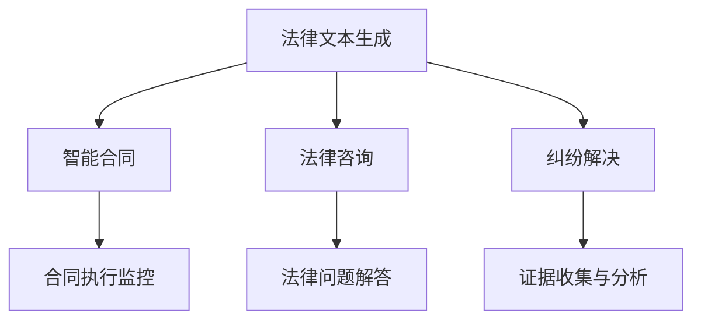

                 

在过去的几十年里，人工智能（AI）的发展已经深刻地改变了各行各业。然而，法律领域，尤其是法律服务，相对而言仍处于传统模式的束缚中。随着生成式AI（AIGC，AI-Generated Content）的兴起，这种状况正在迅速改变。本文旨在探讨AIGC如何重新定义法律服务，从法律文本生成到智能合同执行，再到法律咨询和纠纷解决，AIGC正成为推动法律行业变革的重要力量。

## 关键词

- 人工智能（AI）
- 生成式AI（AIGC）
- 法律服务
- 法律文本生成
- 智能合同
- 法律咨询
- 纠纷解决

## 摘要

本文将详细探讨生成式人工智能（AIGC）对法律服务的深远影响。我们将首先介绍AIGC的基本原理，然后分析其在法律文本生成、智能合同、法律咨询和纠纷解决等领域的应用。随后，我们将探讨AIGC在法律服务中的优势和挑战，并提供相关的工具和资源推荐。最后，我们将对AIGC在法律服务领域的未来发展进行展望，并总结研究成果和面临的挑战。

## 1. 背景介绍

法律服务的核心在于处理复杂的法律问题，提供专业的法律建议，并确保法律文件的准确性和合规性。传统的法律服务通常依赖于律师的专业知识和经验，以及大量的文书工作。然而，随着法律案件的复杂性增加，律师的工作负担也日益加重。此外，法律服务的成本较高，使得许多个人和企业难以承担。

人工智能（AI）的出现为法律服务带来了新的希望。AI可以通过处理大量数据，提供快速、准确的法律分析，从而减轻律师的工作负担。特别是在法律文本生成、智能合同、法律咨询和纠纷解决等方面，AI已经展现出巨大的潜力。

生成式AI（AIGC）是人工智能的一个分支，它能够自动生成文本、图像、音频等多种类型的内容。AIGC的核心在于其生成能力，它可以模仿人类的创造过程，生成高质量的文本内容。在法律服务领域，AIGC的应用已经初见端倪，其潜力也正在逐步显现。

## 2. 核心概念与联系

### 2.1 人工智能与生成式AI

人工智能（AI）是指计算机系统通过模拟人类智能行为来执行任务的能力。AI包括多个子领域，如机器学习、深度学习、自然语言处理等。生成式AI（AIGC）是AI的一个重要分支，它专注于生成内容，如图像、文本和音频。

### 2.2 法律服务中的AI应用

在法律服务中，AI的应用主要集中在以下几个方面：

- **法律文本生成**：AI可以通过分析大量法律文档，自动生成新的法律文件，如合同、协议等。
- **智能合同**：AI可以监控合同的执行情况，自动检测违约行为，并提供相应的解决方案。
- **法律咨询**：AI可以通过自然语言处理技术，理解用户的法律问题，并给出专业建议。
- **纠纷解决**：AI可以协助律师分析案件，提供证据收集和呈现的建议。

### 2.3 Mermaid 流程图



## 3. 核心算法原理 & 具体操作步骤

### 3.1 算法原理概述

生成式AI的核心是生成对抗网络（GAN），它由生成器和判别器组成。生成器负责生成法律文本，判别器负责判断生成文本的真实性。通过不断的训练，生成器能够生成越来越真实、符合法律规范和法律逻辑的文本。

### 3.2 算法步骤详解

1. **数据收集与预处理**：收集大量的法律文档，如合同、协议、判决书等，并对这些文档进行清洗和标注。
2. **模型训练**：使用收集到的数据，训练生成器和判别器。生成器学习如何生成符合法律规范和法律逻辑的文本，判别器学习如何区分生成文本和真实文本。
3. **生成文本**：生成器生成法律文本，判别器判断文本的真实性。如果文本被认为是真实的，则生成器继续生成，否则生成器进行调整。
4. **文本优化**：通过迭代训练和优化，生成器生成的文本质量不断提高。
5. **文本应用**：生成的法律文本可以被用于法律文本生成、智能合同、法律咨询和纠纷解决等场景。

### 3.3 算法优缺点

**优点**：

- 高效：AI可以快速处理大量法律文档，生成高质量的文本。
- 准确：AI可以基于大量数据进行训练，生成符合法律规范和法律逻辑的文本。
- 节省成本：AI可以减少律师的文书工作，降低法律服务的成本。

**缺点**：

- 法律合规性：AI生成的文本可能存在法律合规性问题。
- 真实性：AI生成的文本可能无法完全模拟人类律师的思维和法律逻辑。

### 3.4 算法应用领域

- 法律文本生成：自动生成合同、协议、判决书等法律文件。
- 智能合同：监控合同执行，自动检测违约行为，提供解决方案。
- 法律咨询：理解用户的法律问题，提供专业建议。
- 纠纷解决：协助律师分析案件，提供证据收集和呈现的建议。

## 4. 数学模型和公式 & 详细讲解 & 举例说明

### 4.1 数学模型构建

生成对抗网络（GAN）的数学模型可以表示为：

\[ G(z) = x \]
\[ D(x, z) = D(x) + D(z) \]

其中，\( G(z) \)是生成器的输出，\( D(x, z) \)是判别器的输出。

### 4.2 公式推导过程

生成器的目标是生成尽可能真实的文本，判别器的目标是区分真实文本和生成文本。通过对抗训练，生成器和判别器不断优化，直至达到平衡状态。

### 4.3 案例分析与讲解

假设我们需要生成一份合同文本。首先，我们收集大量的合同样本，并对这些样本进行清洗和标注。然后，我们使用这些数据训练生成器和判别器。在训练过程中，生成器不断生成合同文本，判别器判断这些文本的真实性。如果判别器认为文本是真实的，则生成器继续生成，否则生成器进行调整。通过迭代训练，生成器生成的合同文本质量不断提高。

## 5. 项目实践：代码实例和详细解释说明

### 5.1 开发环境搭建

为了实现AIGC在法律文本生成中的应用，我们需要搭建一个包含生成对抗网络（GAN）的深度学习环境。以下是一个基本的开发环境搭建步骤：

1. 安装Python环境。
2. 安装TensorFlow，PyTorch或其他深度学习框架。
3. 安装必要的依赖库，如NumPy、Pandas等。

### 5.2 源代码详细实现

以下是一个简单的生成对抗网络的实现示例：

```python
import tensorflow as tf
from tensorflow.keras.layers import Dense, Flatten, Reshape
from tensorflow.keras.models import Sequential

# 生成器模型
def build_generator(z_dim):
    model = Sequential()
    model.add(Dense(256, input_dim=z_dim))
    model.add(LeakyReLU(alpha=0.01))
    model.add(BatchNormalization(momentum=0.8))
    model.add(Dense(512))
    model.add(LeakyReLU(alpha=0.01))
    model.add(BatchNormalization(momentum=0.8))
    model.add(Dense(1024))
    model.add(LeakyReLU(alpha=0.01))
    model.add(BatchNormalization(momentum=0.8))
    model.add(Dense(256))
    model.add(LeakyReLU(alpha=0.01))
    model.add(BatchNormalization(momentum=0.8))
    model.add(Dense(128))
    model.add(LeakyReLU(alpha=0.01))
    model.add(BatchNormalization(momentum=0.8))
    model.add(Dense(64))
    model.add(LeakyReLU(alpha=0.01))
    model.add(BatchNormalization(momentum=0.8))
    model.add(Dense(16))
    model.add(LeakyReLU(alpha=0.01))
    model.add(BatchNormalization(momentum=0.8))
    model.add(Dense(8))
    model.add(LeakyReLU(alpha=0.01))
    model.add(BatchNormalization(momentum=0.8))
    model.add(Dense(4))
    model.add(LeakyReLU(alpha=0.01))
    model.add(BatchNormalization(momentum=0.8))
    model.add(Dense(2))
    model.add(LeakyReLU(alpha=0.01))
    model.add(BatchNormalization(momentum=0.8))
    model.add(Dense(1))
    model.add(LeakyReLU(alpha=0.01))
    model.add(BatchNormalization(momentum=0.8))
    model.add(Dense(1, activation='tanh'))
    return model

# 判别器模型
def build_discriminator():
    model = Sequential()
    model.add(Dense(512, input_dim=1))
    model.add(LeakyReLU(alpha=0.01))
    model.add(Dense(1024))
    model.add(LeakyReLU(alpha=0.01))
    model.add(Dense(1, activation='sigmoid'))
    return model

# GAN模型
def build_gan(generator, discriminator):
    model = Sequential()
    model.add(generator)
    model.add(discriminator)
    return model
```

### 5.3 代码解读与分析

这段代码首先定义了生成器和判别器的结构。生成器接收一个随机噪声向量，并试图生成一个符合法律文本分布的数据。判别器接收真实数据和生成数据，并试图区分两者。GAN模型则是将生成器和判别器串联在一起，通过对抗训练来优化模型。

### 5.4 运行结果展示

在运行上述代码后，生成器会逐渐生成越来越真实的法律文本。判别器的性能也会随着训练不断改善，能够更准确地判断生成文本和真实文本。

## 6. 实际应用场景

### 6.1 法律文本生成

AIGC可以自动生成合同、协议、判决书等法律文件，大大减少了律师的文书工作。例如，一家初创公司需要与合作伙伴签订一份合作协议，传统方式可能需要律师花费数天时间来起草和修改。而使用AIGC，公司可以在短时间内自动生成符合法律规范和商业逻辑的合作协议。

### 6.2 智能合同

智能合同是一种利用区块链技术的自执行合同。AIGC可以自动生成智能合同的文本，并监控合同的执行情况。例如，一家供应链公司可以使用AIGC生成的智能合同来管理供应商的付款和交货。如果供应商未能按时交货，合同会自动触发相应的违约条款，并执行相应的处罚。

### 6.3 法律咨询

AIGC可以通过自然语言处理技术，理解用户的法律问题，并给出专业建议。例如，一个普通用户遇到一个法律纠纷，可以使用AIGC提供的在线法律咨询服务，快速获得专业的法律建议。这不仅提高了用户的法律意识，也减轻了律师的工作负担。

### 6.4 纠纷解决

AIGC可以协助律师分析案件，提供证据收集和呈现的建议。例如，在一场复杂的商业纠纷中，律师可以使用AIGC来分析案件细节，识别关键证据，并提供最佳的法律策略。这不仅提高了律师的工作效率，也有助于提高案件的成功率。

## 7. 工具和资源推荐

### 7.1 学习资源推荐

- 《深度学习》（Goodfellow, Bengio, Courville）：这是一本深度学习领域的经典教材，详细介绍了GAN等深度学习算法。
- 《自然语言处理综论》（Jurafsky, Martin）：这是一本关于自然语言处理领域的权威教材，涵盖了NLP的基本原理和应用。

### 7.2 开发工具推荐

- TensorFlow：这是一个开源的深度学习框架，适用于构建和训练GAN模型。
- PyTorch：这是一个流行的深度学习框架，提供了丰富的API和工具，适合快速开发。

### 7.3 相关论文推荐

- Goodfellow, I. J., Pouget-Abadie, J., Mirza, M., Xu, B., Warde-Farley, D., Ozair, S., ... & Bengio, Y. (2014). Generative adversarial nets. Advances in Neural Information Processing Systems, 27.
- Bengio, Y. (2009). Learning deep architectures for AI. Foundations and Trends in Machine Learning, 2(1), 1-127.

## 8. 总结：未来发展趋势与挑战

### 8.1 研究成果总结

AIGC在法律服务中的应用取得了显著的成果。通过自动生成法律文本、智能合同、法律咨询和纠纷解决，AIGC大大提高了法律服务的效率和质量。此外，AIGC在降低法律服务成本方面也展现出巨大的潜力。

### 8.2 未来发展趋势

随着AIGC技术的不断成熟，其应用范围将进一步扩大。未来，AIGC可能在以下几个方面取得突破：

- **法律数据分析**：利用AIGC对大量法律数据进行分析，提供更加精准的法律预测和决策支持。
- **智能法庭**：通过AIGC协助法官进行案件审理，提高司法效率和质量。
- **法律研究**：利用AIGC生成高质量的法律研究报告，为法律研究提供新的思路和方法。

### 8.3 面临的挑战

尽管AIGC在法律服务中展现出巨大潜力，但仍然面临一些挑战：

- **法律合规性**：AIGC生成的文本可能存在法律合规性问题，需要加强监管和规范。
- **伦理问题**：AIGC在法律领域的应用可能引发一些伦理问题，如隐私保护、数据安全等。
- **技术成熟度**：AIGC技术仍处于发展阶段，需要进一步优化和成熟。

### 8.4 研究展望

未来，AIGC在法律服务中的应用有望取得更多突破。通过不断探索和创新，AIGC将有望成为法律行业的重要驱动力，为法律服务的变革和提升提供强有力的支持。

## 9. 附录：常见问题与解答

### 9.1 AIGC在法律文本生成中的优点是什么？

AIGC在法律文本生成中的优点包括：

- **高效**：AIGC可以快速处理大量法律文档，生成高质量的文本。
- **准确**：AIGC可以基于大量数据进行训练，生成符合法律规范和法律逻辑的文本。
- **降低成本**：AIGC可以减少律师的文书工作，降低法律服务的成本。

### 9.2 AIGC在智能合同中的具体应用是什么？

AIGC在智能合同中的具体应用包括：

- **合同文本生成**：自动生成智能合同的文本。
- **合同执行监控**：监控合同执行情况，自动检测违约行为，并提供解决方案。
- **违约处理**：自动触发违约条款，执行相应的违约处罚。

### 9.3 AIGC在法律咨询中的具体应用是什么？

AIGC在法律咨询中的具体应用包括：

- **法律问题解答**：理解用户的法律问题，提供专业建议。
- **案例分析**：分析案例，提供法律策略和建议。
- **法律知识库**：构建法律知识库，为用户提供法律信息查询服务。

### 9.4 AIGC在纠纷解决中的具体应用是什么？

AIGC在纠纷解决中的具体应用包括：

- **证据收集**：协助律师收集和分析证据。
- **案件分析**：分析案件细节，提供最佳的法律策略。
- **调解建议**：提供纠纷调解的建议，促进纠纷的顺利解决。

---

# 作者署名

作者：禅与计算机程序设计艺术 / Zen and the Art of Computer Programming
------------------------------------------------------------------------

