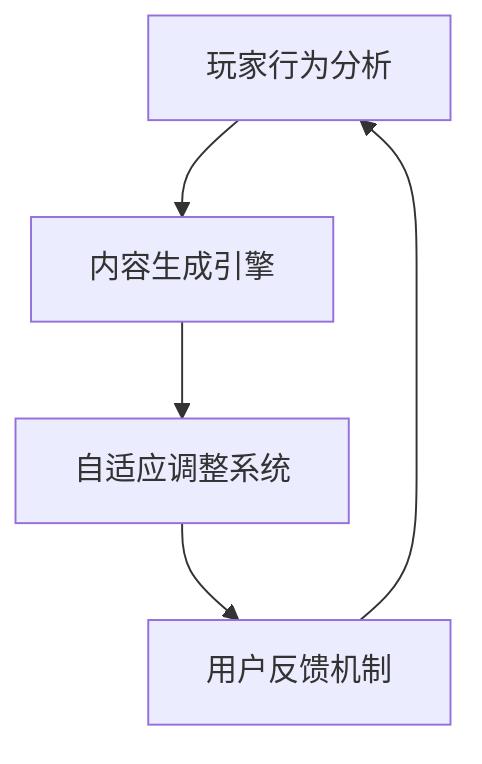

                 

关键词：人工智能、游戏设计、用户体验、AIGC、交互式游戏、智能引擎

摘要：随着人工智能（AI）技术的飞速发展，游戏设计领域正经历着一场革命。自适应智能生成内容（AIGC，Adaptive Intelligent Generated Content）作为一种新兴技术，正在重新定义游戏体验。本文将探讨AIGC的核心概念、技术原理、应用领域，并通过实例分析展示其如何提升游戏互动性和用户满意度。

## 1. 背景介绍

### 游戏行业的现状

游戏行业是数字娱乐产业的重要组成部分，市场规模庞大且持续增长。然而，随着游戏玩家的日益成熟和多元化，传统的游戏设计模式开始面临挑战。一方面，玩家对游戏内容和体验的要求越来越高；另一方面，游戏开发成本和周期的压力也让开发者们捉襟见肘。

### 人工智能的崛起

人工智能（AI）的崛起为游戏行业带来了新的机遇。通过机器学习和深度学习技术，AI可以生成复杂的游戏世界、智能NPC（非玩家角色）和动态剧情，从而提升游戏的可玩性和沉浸感。此外，AI还可以帮助开发者实现自动化测试、优化游戏性能，提高开发效率和产品质量。

### AIGC的概念与潜力

AIGC（自适应智能生成内容）是一种利用AI技术生成游戏内容的方法，它可以自适应地调整游戏剧情、角色行为和环境变化，以适应玩家的行为和偏好。AIGC具有巨大的潜力，可以大幅提升游戏的互动性和个性化体验，从而重新定义游戏体验。

## 2. 核心概念与联系

### 核心概念

- **自适应**：AIGC可以根据玩家的行为和游戏进度动态调整游戏内容，实现高度个性化的游戏体验。
- **智能生成**：利用AI技术自动生成游戏剧情、角色、场景等，减少人力成本，提高开发效率。
- **内容多样化**：通过大数据分析和机器学习算法，生成丰富多样的游戏内容，满足不同玩家的需求。

### 架构

AIGC的架构通常包括以下几个核心模块：

1. **内容生成引擎**：负责生成游戏剧情、角色、场景等。
2. **玩家行为分析**：通过数据分析了解玩家的行为模式，为内容生成提供依据。
3. **自适应调整系统**：根据玩家行为实时调整游戏内容，实现个性化体验。
4. **用户反馈机制**：收集用户反馈，用于优化游戏内容和体验。

### Mermaid 流程图



## 3. 核心算法原理 & 具体操作步骤

### 3.1 算法原理概述

AIGC的核心算法是基于生成对抗网络（GAN）和强化学习（RL）。GAN通过生成器和判别器之间的对抗训练，生成高质量的游戏内容；RL则通过学习玩家的行为模式，实现自适应调整。

### 3.2 算法步骤详解

1. **数据收集与预处理**：收集大量游戏数据，包括玩家行为、游戏进度、剧情元素等，并进行预处理。
2. **生成器与判别器训练**：利用GAN模型对数据进行训练，生成高质量的剧情、角色和场景。
3. **玩家行为分析**：使用RL算法分析玩家的行为模式，为内容生成提供依据。
4. **内容生成与自适应调整**：根据玩家行为实时生成游戏内容，并自适应调整，以适应玩家偏好。
5. **用户反馈与优化**：收集用户反馈，不断优化游戏内容和体验。

### 3.3 算法优缺点

#### 优点

- **个性化体验**：AIGC可以根据玩家的行为和偏好生成个性化内容，提升用户体验。
- **高效开发**：通过自动化生成，大幅降低开发成本和时间。
- **丰富内容**：AIGC可以生成丰富多样的游戏内容，满足不同玩家的需求。

#### 缺点

- **训练成本高**：AIGC需要大量数据进行训练，训练成本较高。
- **内容质量不稳定**：生成的游戏内容可能存在质量不稳定的情况。
- **对开发者要求高**：需要掌握AI技术，对开发者的技术能力有较高要求。

### 3.4 算法应用领域

AIGC可以应用于多种类型的游戏，包括角色扮演游戏（RPG）、射击游戏（FPS）、冒险游戏（Adventure）等。此外，AIGC还可以用于游戏测试、性能优化、数据分析等领域。

## 4. 数学模型和公式 & 详细讲解 & 举例说明

### 4.1 数学模型构建

AIGC的核心数学模型包括生成对抗网络（GAN）和强化学习（RL）。GAN由生成器（G）和判别器（D）组成，两者通过对抗训练生成高质量的内容。RL则通过学习价值函数，实现自适应调整。

### 4.2 公式推导过程

GAN的损失函数如下：

$$
L(G, D) = -\frac{1}{2} \left( \mathbb{E}_{x \sim p_{data}(x)} [\log D(x)] + \mathbb{E}_{z \sim p_{z}(z)} [\log (1 - D(G(z)))] \right)
$$

其中，$p_{data}(x)$是真实数据分布，$p_{z}(z)$是噪声分布。

RL的价值函数如下：

$$
V(s) = \mathbb{E}_{\pi}[R(s, a) + \gamma V(s')]
$$

其中，$s$是状态，$a$是动作，$R$是奖励函数，$\gamma$是折扣因子。

### 4.3 案例分析与讲解

假设我们设计一个RPG游戏，玩家需要在游戏中进行战斗和探险。我们可以使用GAN生成游戏的剧情、角色和场景，使用RL调整角色的行为和策略。

1. **数据收集与预处理**：收集大量RPG游戏的剧情、角色和场景数据，并进行预处理。
2. **GAN训练**：利用收集的数据训练生成器和判别器，生成高质量的剧情、角色和场景。
3. **RL训练**：分析玩家的行为模式，使用RL算法训练角色行为策略。
4. **内容生成与自适应调整**：根据玩家行为生成剧情、角色和场景，并自适应调整角色行为。
5. **用户反馈与优化**：收集用户反馈，不断优化游戏内容和角色行为策略。

通过这个案例，我们可以看到AIGC在RPG游戏中的应用。使用GAN生成丰富多样的剧情和场景，使用RL训练角色行为策略，实现高度个性化的游戏体验。

## 5. 项目实践：代码实例和详细解释说明

### 5.1 开发环境搭建

在开发AIGC项目时，我们需要准备以下环境：

- Python 3.8及以上版本
- TensorFlow 2.5及以上版本
- PyTorch 1.8及以上版本
- Jupyter Notebook

### 5.2 源代码详细实现

以下是一个简单的AIGC项目示例，包括GAN模型和RL算法的实现：

```python
import tensorflow as tf
from tensorflow.keras.models import Sequential
from tensorflow.keras.layers import Dense, Flatten
import numpy as np

# GAN模型实现
def build_generator():
    model = Sequential([
        Dense(256, activation='relu', input_shape=(100,)),
        Dense(512),
        Dense(1024),
        Flatten(),
        Dense(784, activation='tanh')
    ])
    return model

def build_discriminator():
    model = Sequential([
        Flatten(input_shape=(28, 28)),
        Dense(512, activation='relu'),
        Dense(256, activation='relu'),
        Dense(1, activation='sigmoid')
    ])
    return model

# RL算法实现
def build_reinforce_agent():
    model = Sequential([
        Flatten(input_shape=(28, 28)),
        Dense(256, activation='relu'),
        Dense(128, activation='relu'),
        Dense(1, activation='linear')
    ])
    return model

# 训练GAN模型
def train_gan(generator, discriminator, epochs=100):
    for epoch in range(epochs):
        for _ in range(1000):
            noise = np.random.normal(0, 1, (1, 100))
            generated_images = generator.predict(noise)
            real_images = np.random.choice(train_images, 1)
            x = np.concatenate([real_images, generated_images])
            y = np.array([[1], [0]])
            discriminator.trainable = True
            discriminator.train_on_batch(x, y)
            discriminator.trainable = False
            noise = np.random.normal(0, 1, (1, 100))
            y = np.array([[1]])
            generator.train_on_batch(noise, y)

# 训练RL模型
def train_reinforce_agent(agent, images, actions, rewards):
    agent.trainable = True
    agent.train_on_batch(images, actions, rewards)

# 生成游戏内容
def generate_content(generator, agent, epoch):
    noise = np.random.normal(0, 1, (1, 100))
    generated_image = generator.predict(noise)
    action = agent.predict(generated_image.reshape(1, -1))
    return generated_image, action

# 测试AIGC项目
def test_aigc(generator, agent):
    for epoch in range(100):
        generated_image, action = generate_content(generator, agent, epoch)
        # 在游戏中应用生成的内容和策略
        print(f"Epoch: {epoch}, Generated Image: {generated_image}, Action: {action}")
```

### 5.3 代码解读与分析

上述代码实现了AIGC项目的基本框架，包括GAN模型和RL模型的训练与测试。以下是对代码的详细解读：

- **GAN模型实现**：生成器（`build_generator`）和判别器（`build_discriminator`）使用TensorFlow实现。生成器将噪声输入转化为图像，判别器用于区分真实图像和生成图像。
- **RL模型实现**：强化学习代理（`build_reinforce_agent`）使用神经网络实现。它通过学习玩家的行为模式，生成游戏中的角色行为。
- **训练GAN模型**：`train_gan`函数负责训练GAN模型。在训练过程中，生成器和判别器交替训练，以实现对抗训练。
- **训练RL模型**：`train_reinforce_agent`函数负责训练RL模型。通过学习玩家行为和奖励信号，优化代理的策略。
- **生成游戏内容**：`generate_content`函数用于生成游戏内容。它使用生成器和RL代理生成图像和角色行为。
- **测试AIGC项目**：`test_aigc`函数用于测试AIGC项目的效果。它生成游戏内容并在游戏中应用，以展示AIGC在游戏设计中的应用价值。

## 6. 实际应用场景

### 6.1 AIGC在角色扮演游戏中的应用

AIGC在角色扮演游戏（RPG）中的应用最为广泛。通过AIGC，开发者可以自动生成丰富的游戏剧情、角色和场景，实现高度个性化的游戏体验。玩家可以与智能NPC进行实时互动，享受独特的冒险旅程。

### 6.2 AIGC在冒险游戏中的应用

在冒险游戏（Adventure）中，AIGC可以生成复杂的游戏场景、谜题和任务。玩家在游戏中探索未知世界，与生成的角色互动，解决难题。AIGC可以不断调整游戏内容，提供新的挑战和惊喜，延长游戏生命周期。

### 6.3 AIGC在射击游戏中的应用

在射击游戏（FPS）中，AIGC可以生成智能敌人、动态战场和战略决策。玩家需要根据生成的敌人行为和战场环境调整自己的战术，提高游戏的挑战性和趣味性。AIGC还可以生成自定义武器和装备，满足玩家的个性化需求。

### 6.4 未来应用展望

随着AI技术的不断发展，AIGC在游戏设计中的应用前景广阔。未来，AIGC可以应用于更多类型的游戏，如模拟游戏、竞技游戏等。此外，AIGC还可以与其他新兴技术如虚拟现实（VR）、增强现实（AR）等相结合，为玩家带来更加沉浸式的游戏体验。

## 7. 工具和资源推荐

### 7.1 学习资源推荐

- 《深度学习》（Goodfellow, Bengio, Courville）：系统介绍深度学习的基础理论和应用。
- 《强化学习：原理与案例》（Sutton, Barto）：详细介绍强化学习的基本概念和算法。
- 《生成对抗网络：理论与实践》（Goodfellow, Pouget-Abadie, Mirza, Xu, Warde-Farley, Ozair, Courville, Bengio）：全面探讨GAN的理论和应用。

### 7.2 开发工具推荐

- TensorFlow：开源深度学习框架，适用于构建和训练GAN模型。
- PyTorch：开源深度学习框架，提供灵活的接口和强大的功能，适用于构建和训练RL模型。
- Unity：流行的游戏开发引擎，支持AIGC在游戏中的应用。

### 7.3 相关论文推荐

- Ian J. Goodfellow, Jean Pouget-Abadie, Mehdi Mirza, Bing Xu, David P. Kingma, and Yaroslav Ganin. “Generative Adversarial Nets.” Advances in Neural Information Processing Systems, 2014.
- Richard S. Sutton and Andrew G. Barto. “Reinforcement Learning: An Introduction.” MIT Press, 2018.
- Ian Goodfellow, yoshua bengio, and Aaron Courville. “Deep Learning.” MIT Press, 2016.

## 8. 总结：未来发展趋势与挑战

### 8.1 研究成果总结

AIGC作为一种新兴技术，已在游戏设计中展现出巨大的潜力。通过自适应智能生成内容，AIGC可以提升游戏的互动性和个性化体验，为玩家带来全新的游戏体验。

### 8.2 未来发展趋势

随着AI技术的不断发展，AIGC在游戏设计中的应用将更加广泛。未来，AIGC有望与其他新兴技术相结合，为玩家带来更加沉浸式、个性化的游戏体验。

### 8.3 面临的挑战

尽管AIGC具有巨大潜力，但在实际应用中仍面临一些挑战。包括训练成本高、内容质量不稳定、对开发者要求高等问题。此外，如何更好地与玩家互动，提高用户体验，也是未来研究的重要方向。

### 8.4 研究展望

未来，AIGC的研究将主要集中在以下几个方面：

- **优化算法**：通过改进GAN和RL算法，提高内容生成质量和效率。
- **跨领域应用**：探索AIGC在其他领域的应用，如虚拟现实、增强现实等。
- **用户互动**：研究如何更好地与玩家互动，提高用户体验。

## 9. 附录：常见问题与解答

### 9.1 AIGC是什么？

AIGC（自适应智能生成内容）是一种利用人工智能（AI）技术生成游戏内容的方法，它可以自动生成游戏剧情、角色、场景等，实现高度个性化的游戏体验。

### 9.2 AIGC有哪些优点？

AIGC具有以下优点：

- **个性化体验**：根据玩家的行为和偏好生成个性化内容，提升用户体验。
- **高效开发**：通过自动化生成，大幅降低开发成本和时间。
- **丰富内容**：生成丰富多样的游戏内容，满足不同玩家的需求。

### 9.3 AIGC在游戏设计中的具体应用有哪些？

AIGC可以应用于多种类型的游戏，如角色扮演游戏（RPG）、射击游戏（FPS）、冒险游戏（Adventure）等。它可以自动生成游戏剧情、角色、场景等，提升游戏互动性和用户体验。

### 9.4 AIGC有哪些挑战？

AIGC在应用过程中面临以下挑战：

- **训练成本高**：需要大量数据进行训练，训练成本较高。
- **内容质量不稳定**：生成的游戏内容可能存在质量不稳定的情况。
- **对开发者要求高**：需要掌握AI技术，对开发者的技术能力有较高要求。

----------------------------------------------------------------

作者：禅与计算机程序设计艺术 / Zen and the Art of Computer Programming
本文内容仅用于技术交流和学习，不代表任何商业建议或投资建议。

