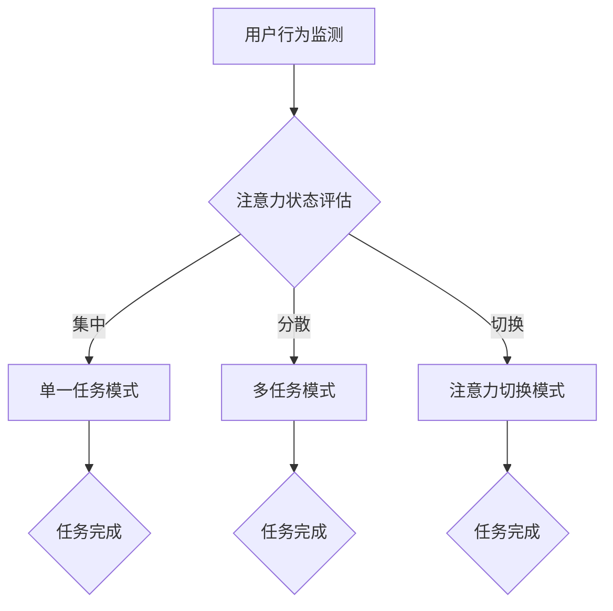

                 

关键词：人工智能、注意力管理系统、工作效率、技能提升、未来工作场景

> 摘要：本文深入探讨了人工智能与人类注意力管理系统之间的关系，分析了注意力管理系统在提升工作效率、培养技能、以及塑造未来工作场景中的重要作用。文章通过介绍核心概念、算法原理、数学模型、项目实践等多个维度，提供了对AI与注意力管理相互作用的全面理解，并对未来的发展趋势和面临的挑战进行了展望。

## 1. 背景介绍

随着人工智能（AI）技术的迅猛发展，人们的工作和生活方式正在发生深刻变革。在现代社会，注意力成为了一种宝贵的资源，如何有效地管理和利用注意力，已经成为提高工作效率、培养技能、以及提升生活质量的关键问题。然而，传统的方法往往无法满足快速变化的工作环境和个人需求。

注意力管理系统是一种利用科技手段提升个体注意力水平和效率的工具。它通过监测、分析和干预注意力的流动，帮助用户更有效地分配注意力，从而提高工作效率、减少压力，并实现个人成长。近年来，随着AI技术的进步，注意力管理系统逐渐智能化，能够更加精准地理解和满足用户的需求。

本文将围绕以下主题展开：

1. **核心概念与联系**：介绍注意力管理系统、注意力分配理论、注意力转移等核心概念，并利用Mermaid流程图展示其架构。
2. **核心算法原理 & 具体操作步骤**：详细解析注意力管理算法的原理和操作步骤，包括算法优缺点和应用领域。
3. **数学模型和公式 & 详细讲解 & 举例说明**：构建注意力管理的数学模型，推导相关公式，并通过案例进行分析。
4. **项目实践：代码实例和详细解释说明**：提供注意力管理系统的实际代码实例，并进行解读和分析。
5. **实际应用场景**：探讨注意力管理系统在不同领域的应用，以及未来的应用前景。
6. **工具和资源推荐**：推荐相关学习资源、开发工具和论文。
7. **总结：未来发展趋势与挑战**：总结研究成果，探讨未来发展趋势和面临的挑战。

<|assistant|>以下是详细的正文内容，按照上述结构逐节撰写：

### 1.1 注意力管理系统的定义与作用

注意力管理系统（Attention Management System，AMS）是一种通过技术手段帮助个体提升注意力水平的系统。它结合了生物医学、认知科学和人工智能技术，能够实时监测用户的行为、情绪和心理状态，从而提供个性化的注意力管理策略。

注意力管理系统的核心作用在于：

- **提高工作效率**：通过监测用户的注意力状态，系统可以识别出最佳的工作时间和注意力高峰期，帮助用户在高效时段完成重要的任务。
- **优化时间分配**：注意力管理系统可以帮助用户更合理地分配时间，避免因分心而浪费大量时间。
- **培养专注力**：通过不断调整和优化注意力管理策略，用户可以逐渐培养出更强的专注力，提高学习效果和工作效率。
- **减轻压力**：通过识别和干预负面情绪，注意力管理系统可以帮助用户减轻工作压力，改善心理健康。

### 1.2 注意力分配理论

注意力分配理论是注意力管理系统的基础。根据该理论，人类的注意力是有限的资源，需要在各种任务和活动中进行合理分配。有效的注意力分配能够提高任务完成效率，减少认知负担。

- **单一任务模式**：在单一任务模式下，个体集中所有注意力完成一个任务。这种方式适用于需要高度专注的工作，如编程、写作等。
- **多任务模式**：在多任务模式下，个体同时处理多个任务。这种模式虽然能提高工作效率，但也容易导致注意力分散，降低任务质量。
- **注意力切换**：在注意力切换模式下，个体在不同任务之间快速切换注意力。这种模式适用于需要频繁转换任务的工作，如项目管理、客户服务等。

### 1.3 注意力转移与分散

注意力转移（Attention Transfer）是指个体将注意力从一个任务转移到另一个任务的过程。注意力转移的效率直接影响工作效率。注意力管理系统可以通过以下策略优化注意力转移：

- **优先级排序**：根据任务的重要性和紧急性，系统会优先处理高优先级的任务，减少注意力分散。
- **中断管理**：当有新任务或中断发生时，系统会自动暂停当前任务，并将注意力转移到新任务，从而减少注意力分散。
- **时间管理**：通过设置固定的工作时间和休息时间，系统可以帮助用户保持注意力集中，避免过度疲劳。

### 1.4 Mermaid 流程图展示

以下是注意力管理系统的 Mermaid 流程图：

### 2. 核心算法原理 & 具体操作步骤

注意力管理算法是注意力管理系统的核心。下面将详细介绍注意力管理算法的原理、操作步骤、优缺点以及应用领域。

#### 2.1 算法原理概述

注意力管理算法基于机器学习和数据挖掘技术，通过对用户行为、情绪和心理状态的数据进行分析，生成个性化的注意力管理策略。算法的核心原理包括：

- **行为识别**：通过传感器、应用程序和用户输入等途径，收集用户的行为数据，如鼠标移动、键盘操作、浏览历史等。
- **情绪分析**：利用自然语言处理和情感分析技术，从用户的文字输入、语音、面部表情等数据中提取情绪信息。
- **心理状态评估**：结合行为数据和情绪分析结果，通过统计模型和机器学习算法评估用户的心理状态，如专注力、压力、疲劳等。
- **策略生成**：根据用户的心理状态和行为模式，系统自动生成个性化的注意力管理策略，如任务优先级排序、中断管理、注意力切换等。

#### 2.2 算法步骤详解

注意力管理算法的具体步骤如下：

1. **数据收集**：系统通过传感器、应用程序和用户输入等途径收集用户的行为数据、情绪数据和心理状态数据。
2. **预处理**：对收集到的数据进行清洗、归一化和特征提取，以便后续分析。
3. **行为识别**：利用机器学习算法对用户行为数据进行分类，识别用户的当前行为模式。
4. **情绪分析**：使用自然语言处理和情感分析技术，从用户的文字输入、语音、面部表情等数据中提取情绪信息。
5. **心理状态评估**：结合行为数据和情绪分析结果，通过统计模型和机器学习算法评估用户的心理状态，如专注力、压力、疲劳等。
6. **策略生成**：根据用户的心理状态和行为模式，系统自动生成个性化的注意力管理策略。
7. **策略执行**：系统根据生成的策略执行相应的操作，如任务优先级排序、中断管理、注意力切换等。

#### 2.3 算法优缺点

注意力管理算法的优点包括：

- **个性化**：根据用户的心理状态和行为模式，生成个性化的注意力管理策略，提高工作效率和用户体验。
- **实时性**：系统能够实时监测用户的行为、情绪和心理状态，快速响应并调整策略。
- **自适应**：算法可以根据用户的使用情况和反馈，不断优化和调整策略，提高系统的适应性。

注意力管理算法的缺点包括：

- **数据隐私**：注意力管理系统需要收集用户的敏感数据，如行为、情绪和心理状态等，可能引发数据隐私问题。
- **技术依赖**：算法的性能和效果取决于数据的质量和机器学习技术的成熟度，可能面临技术瓶颈。
- **实施难度**：注意力管理系统的开发和部署需要大量技术和资源投入，实施难度较大。

#### 2.4 算法应用领域

注意力管理算法广泛应用于多个领域，包括：

- **工作场景**：在企业办公环境中，注意力管理系统可以帮助员工提高工作效率，减少加班现象，改善工作质量。
- **教育领域**：在教育场景中，注意力管理系统可以识别学生的学习状态，提供个性化的学习建议，提高学习效果。
- **医疗保健**：在医疗领域，注意力管理系统可以帮助患者管理注意力，减轻焦虑和压力，改善健康状况。
- **心理健康**：在心理健康领域，注意力管理系统可以辅助心理咨询和治疗，帮助患者培养注意力，提高生活质量。

### 3. 数学模型和公式 & 详细讲解 & 举例说明

注意力管理系统的数学模型和公式是理解其工作原理的关键。以下将介绍注意力管理系统的数学模型构建、公式推导过程，并通过案例进行分析。

#### 3.1 数学模型构建

注意力管理系统的数学模型主要包括以下部分：

- **用户行为模型**：描述用户在不同任务中的行为特征，如鼠标移动速度、键盘操作频率等。
- **情绪模型**：描述用户的情绪状态，如兴奋度、疲劳度等。
- **心理状态模型**：描述用户的心理状态，如专注力、压力等。
- **策略模型**：根据用户的行为、情绪和心理状态，生成个性化的注意力管理策略。

#### 3.2 公式推导过程

注意力管理系统的核心公式包括：

1. **用户行为特征提取**：

$$
X_i = f(B_i, H_i)
$$

其中，$X_i$ 表示用户行为特征，$B_i$ 表示用户情绪状态，$H_i$ 表示用户心理状态。$f$ 函数用于将情绪状态和心理状态映射到行为特征。

2. **情绪状态评估**：

$$
E_i = \sum_{j=1}^{n} w_j E_j^i
$$

其中，$E_i$ 表示用户情绪状态，$E_j^i$ 表示第 $j$ 个情绪特征的权重，$w_j$ 表示第 $j$ 个情绪特征的权重。

3. **心理状态评估**：

$$
P_i = \sum_{j=1}^{n} w_j P_j^i
$$

其中，$P_i$ 表示用户心理状态，$P_j^i$ 表示第 $j$ 个心理特征

