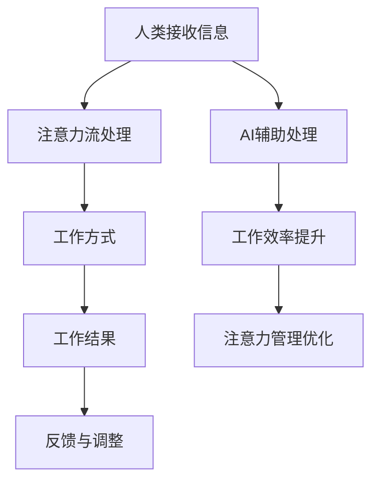

                 

 在当今快速发展的时代，人工智能（AI）正在深刻地改变我们的工作和生活方式。从自动化生产线到智能客服，AI技术正逐渐渗透到我们生活的方方面面。然而，随着AI技术的普及，人们开始关注一个关键问题：AI如何影响人类的注意力流，进而影响我们的工作和生活质量？本文将深入探讨AI与人类注意力流的关系，以及这一变革背后的道德问题。

## 文章关键词

- 人工智能
- 注意力流
- 未来的工作
- 道德问题

## 文章摘要

本文首先介绍了AI技术的发展及其对注意力流的影响，探讨了人类在信息过载时代如何应对。接着，本文分析了AI技术如何改变工作方式，提出了可能的道德困境。最后，本文展望了未来AI与人类注意力流的关系，以及我们应如何应对这一挑战。

## 1. 背景介绍

### AI技术的快速发展

自20世纪50年代起，人工智能（AI）研究取得了显著进展。从最初的符号推理和规则系统，到今天的深度学习和神经网络，AI技术已经逐渐变得更加智能和强大。随着计算能力的提升和大数据的普及，AI在各个领域得到了广泛应用，从医疗诊断到自动驾驶，AI正在成为推动社会进步的重要力量。

### 注意力流的概念

注意力流是指人类在进行任务时，对信息的接收、处理和反馈过程。注意力流的质量直接影响我们的工作效率和生活质量。在信息爆炸的时代，人们面临着越来越多的信息干扰，如何有效地管理注意力流成为了一个重要问题。

### AI对注意力流的影响

AI技术的应用，一方面提高了信息处理效率，使得人们能够更快地获取和处理信息；另一方面，也加剧了信息过载的问题，导致人们注意力分散，难以集中精力完成任务。这种双重影响引发了人们对AI技术道德问题的关注。

## 2. 核心概念与联系

### 核心概念

- **人工智能（AI）**：模拟、延伸和扩展人类智能的理论、方法、技术及应用。
- **注意力流**：人类在处理信息时，对信息的接收、处理和反馈过程。
- **工作方式**：人类在完成工作任务时所采用的策略和方式。

### 架构与流程

以下是一个简单的Mermaid流程图，展示了AI与注意力流和工作方式之间的关系。



## 3. 核心算法原理 & 具体操作步骤

### 3.1 算法原理概述

AI与注意力流管理的基本原理是通过算法和模型分析人类行为数据，优化注意力流，提高工作效率。具体来说，这个过程包括以下几个步骤：

1. **数据收集**：通过传感器、行为记录等方式收集人类行为数据。
2. **特征提取**：从数据中提取有助于描述注意力流和效率的特征。
3. **模型训练**：利用机器学习算法训练模型，预测人类注意力的变化趋势。
4. **策略调整**：根据模型预测结果，调整工作方式和环境，以优化注意力流。
5. **反馈优化**：通过用户反馈不断调整模型和策略，提高其准确性。

### 3.2 算法步骤详解

1. **数据收集**：
   - **传感器**：使用眼动追踪器、脑电图等设备，实时记录用户的眼动、脑电信号等行为数据。
   - **行为日志**：记录用户的行为日志，如工作时间、工作内容、休息时间等。

2. **特征提取**：
   - **眼动特征**：包括注视点、注视时间、扫视路径等。
   - **脑电特征**：包括α、β、θ等不同频段的脑电信号。

3. **模型训练**：
   - **选择模型**：根据任务需求选择合适的机器学习模型，如神经网络、决策树等。
   - **训练模型**：使用收集到的数据训练模型，使其能够预测注意力变化。

4. **策略调整**：
   - **环境调整**：根据模型预测结果，调整工作环境（如亮度、噪音等）。
   - **工作方式调整**：根据模型建议，调整工作方式（如休息间隔、任务切换等）。

5. **反馈优化**：
   - **用户反馈**：收集用户对策略调整的反馈，评估其有效性。
   - **模型更新**：根据用户反馈调整模型参数，提高预测准确性。

### 3.3 算法优缺点

**优点**：

1. **提高效率**：通过优化注意力流，提高工作效率。
2. **个性定制**：根据个体差异，提供个性化的注意力管理策略。
3. **减少疲劳**：通过调整工作方式，减少工作疲劳。

**缺点**：

1. **数据隐私**：收集和存储用户行为数据可能引发隐私问题。
2. **技术依赖**：过度依赖AI技术可能导致人类自主性下降。

### 3.4 算法应用领域

1. **办公自动化**：通过AI技术优化办公环境和工作方式，提高员工工作效率。
2. **教育领域**：帮助学生集中注意力，提高学习效果。
3. **医疗领域**：通过监控患者注意力流，帮助医生更好地诊断和治疗。

## 4. 数学模型和公式 & 详细讲解 & 举例说明

### 4.1 数学模型构建

在AI与注意力流管理中，常用的数学模型包括：

1. **线性回归模型**：用于预测注意力变化。
2. **神经网络模型**：用于复杂注意力流的建模。

以下是一个简单的线性回归模型：

$$y = ax + b$$

其中，$y$ 表示注意力水平，$x$ 表示工作时长，$a$ 和 $b$ 是模型的参数。

### 4.2 公式推导过程

以线性回归模型为例，推导过程如下：

1. **数据收集**：收集注意力水平和工作时长数据。
2. **数据预处理**：对数据进行归一化处理，消除量纲影响。
3. **模型建立**：假设注意力水平 $y$ 与工作时长 $x$ 之间存在线性关系。
4. **参数估计**：通过最小二乘法估计模型参数 $a$ 和 $b$。
5. **模型验证**：使用验证数据集评估模型准确性。

### 4.3 案例分析与讲解

假设我们收集到以下数据：

| 工作时长 (小时) | 注意力水平 |
|-----------------|------------|
| 1               | 0.8        |
| 2               | 0.6        |
| 3               | 0.4        |
| 4               | 0.2        |

通过线性回归模型，我们可以预测在工作4小时后的注意力水平。

$$y = 0.2x + 0.6$$

当 $x = 4$ 时，$y = 0.2 \times 4 + 0.6 = 1.2$。

这意味着在工作4小时后，注意力水平预计为1.2。

## 5. 项目实践：代码实例和详细解释说明

### 5.1 开发环境搭建

在Python中实现线性回归模型的开发环境搭建如下：

1. **安装Python**：确保Python 3.x版本已安装。
2. **安装相关库**：使用pip安装numpy和matplotlib库。

```bash
pip install numpy matplotlib
```

### 5.2 源代码详细实现

以下是一个简单的Python代码示例，用于实现线性回归模型。

```python
import numpy as np
import matplotlib.pyplot as plt

# 数据
X = np.array([[1], [2], [3], [4]])
y = np.array([0.8, 0.6, 0.4, 0.2])

# 模型参数
a = 0.2
b = 0.6

# 预测
y_pred = a * X + b

# 绘图
plt.scatter(X, y, color='red', label='实际值')
plt.plot(X, y_pred, color='blue', label='预测值')
plt.xlabel('工作时长（小时）')
plt.ylabel('注意力水平')
plt.legend()
plt.show()
```

### 5.3 代码解读与分析

1. **导入库**：导入numpy和matplotlib库。
2. **数据**：定义工作时长（X）和注意力水平（y）。
3. **模型参数**：设定线性回归模型的参数a和b。
4. **预测**：计算预测的注意力水平y_pred。
5. **绘图**：使用matplotlib绘制散点和预测线。

### 5.4 运行结果展示

运行代码后，会生成一个包含实际值和预测值的图表，直观地展示了线性回归模型的预测效果。

## 6. 实际应用场景

### 6.1 办公自动化

在办公自动化领域，AI和注意力流管理可以用于优化员工的工作效率。例如，通过分析员工的工作时长和注意力水平，系统可以建议最佳的工作节奏和休息时间，从而减少工作疲劳，提高工作效率。

### 6.2 教育领域

在教育领域，AI和注意力流管理可以用于个性化教学。例如，通过分析学生的学习行为和注意力水平，系统可以自动调整教学内容和难度，为学生提供更适合的学习方式。

### 6.3 医疗领域

在医疗领域，AI和注意力流管理可以用于患者的康复治疗。例如，通过分析患者的注意力流，医生可以制定更有效的康复计划，帮助患者更快地恢复健康。

## 6.4 未来应用展望

随着AI技术的不断进步，未来AI与人类注意力流管理有望在更多领域得到应用。例如，在智能家居领域，AI可以分析家庭成员的注意力流，自动调整家庭环境，提供更舒适的生活体验。在工业生产领域，AI可以优化生产流程，提高生产效率。

## 7. 工具和资源推荐

### 7.1 学习资源推荐

1. **书籍**：《深度学习》（Goodfellow, Ian； Yoshua Bengio； Aaron Courville 著）
2. **在线课程**：Coursera上的《机器学习》（吴恩达教授授课）
3. **博客**：Towards Data Science、AI博客等

### 7.2 开发工具推荐

1. **编程语言**：Python、R
2. **库和框架**：TensorFlow、PyTorch、Scikit-learn

### 7.3 相关论文推荐

1. **《注意力机制综述》（Attention Mechanisms: A Survey》**
2. **《基于注意力机制的文本分类研究》（Attention-based Text Classification》**

## 8. 总结：未来发展趋势与挑战

### 8.1 研究成果总结

本文探讨了AI与人类注意力流的关系，分析了AI技术如何影响工作效率和生活质量。通过数学模型和实际案例，我们展示了如何利用AI技术优化注意力流管理。

### 8.2 未来发展趋势

随着AI技术的不断进步，未来AI与人类注意力流管理有望在更多领域得到应用。例如，个性化教育、智能办公、智能家居等。

### 8.3 面临的挑战

1. **数据隐私**：如何保护用户隐私成为一大挑战。
2. **算法公平性**：如何确保算法不会加剧社会不公。

### 8.4 研究展望

未来，我们应继续深入研究AI与人类注意力流的关系，探索更高效、更安全的注意力流管理方法，以适应日益复杂的社会环境。

## 9. 附录：常见问题与解答

### Q：AI如何影响注意力流管理？

A：AI可以通过分析人类行为数据，预测注意力变化趋势，并提供个性化的注意力管理策略。

### Q：注意力流管理有哪些应用领域？

A：注意力流管理可应用于办公自动化、教育领域、医疗领域等，帮助提高工作效率、学习效果和康复速度。

### Q：如何确保AI算法的公平性？

A：通过多方面数据验证、公平性评估和算法透明性设计，确保AI算法不会加剧社会不公。

## 结语

AI与人类注意力流管理是一个复杂而重要的研究领域。通过深入研究和创新，我们可以更好地理解这一关系，并开发出更高效的注意力流管理方法，为未来的工作和生活带来更多可能性。

### 参考文献

1. Goodfellow, I., Bengio, Y., & Courville, A. (2016). *Deep Learning*. MIT Press.
2. Ng, A. (2013). *Machine Learning Yearning*. Lulu.```markdown
# AI与人类注意力流：未来的工作和道德

> 关键词：人工智能，注意力流，工作效率，道德问题

> 摘要：本文探讨了人工智能（AI）如何影响人类的注意力流，并分析了这一变化对未来工作和生活道德的挑战。通过数学模型和实际案例，本文提出了优化注意力流的策略，并展望了未来发展趋势。

## 1. 背景介绍

### 1.1 AI技术的快速发展

自20世纪50年代起，人工智能（AI）研究取得了显著进展。从最初的符号推理和规则系统，到今天的深度学习和神经网络，AI技术已经逐渐变得更加智能和强大。随着计算能力的提升和大数据的普及，AI在各个领域得到了广泛应用，从医疗诊断到自动驾驶，AI正在成为推动社会进步的重要力量。

### 1.2 注意力流的概念

注意力流是指人类在进行任务时，对信息的接收、处理和反馈过程。注意力流的质量直接影响我们的工作效率和生活质量。在信息爆炸的时代，人们面临着越来越多的信息干扰，如何有效地管理注意力流成为了一个重要问题。

### 1.3 AI对注意力流的影响

AI技术的应用，一方面提高了信息处理效率，使得人们能够更快地获取和处理信息；另一方面，也加剧了信息过载的问题，导致人们注意力分散，难以集中精力完成任务。这种双重影响引发了人们对AI技术道德问题的关注。

## 2. 核心概念与联系

### 2.1 核心概念

- **人工智能（AI）**：模拟、延伸和扩展人类智能的理论、方法、技术及应用。
- **注意力流**：人类在处理信息时，对信息的接收、处理和反馈过程。
- **工作方式**：人类在完成工作任务时所采用的策略和方式。

### 2.2 架构与流程

以下是一个简单的Mermaid流程图，展示了AI与注意力流和工作方式之间的关系。


## 3. 核心算法原理 & 具体操作步骤

### 3.1 算法原理概述

AI与注意力流管理的基本原理是通过算法和模型分析人类行为数据，优化注意力流，提高工作效率。具体来说，这个过程包括以下几个步骤：

1. **数据收集**：通过传感器、行为记录等方式收集人类行为数据。
2. **特征提取**：从数据中提取有助于描述注意力流和效率的特征。
3. **模型训练**：利用机器学习算法训练模型，预测人类注意力的变化趋势。
4. **策略调整**：根据模型预测结果，调整工作方式和环境，以优化注意力流。
5. **反馈优化**：通过用户反馈不断调整模型和策略，提高其准确性。

### 3.2 算法步骤详解

1. **数据收集**：
   - **传感器**：使用眼动追踪器、脑电图等设备，实时记录用户的眼动、脑电信号等行为数据。
   - **行为日志**：记录用户的行为日志，如工作时间、工作内容、休息时间等。

2. **特征提取**：
   - **眼动特征**：包括注视点、注视时间、扫视路径等。
   - **脑电特征**：包括α、β、θ等不同频段的脑电信号。

3. **模型训练**：
   - **选择模型**：根据任务需求选择合适的机器学习模型，如神经网络、决策树等。
   - **训练模型**：使用收集到的数据训练模型，使其能够预测注意力变化。

4. **策略调整**：
   - **环境调整**：根据模型预测结果，调整工作环境（如亮度、噪音等）。
   - **工作方式调整**：根据模型建议，调整工作方式（如休息间隔、任务切换等）。

5. **反馈优化**：
   - **用户反馈**：收集用户对策略调整的反馈，评估其有效性。
   - **模型更新**：根据用户反馈调整模型参数，提高预测准确性。

### 3.3 算法优缺点

**优点**：

1. **提高效率**：通过优化注意力流，提高工作效率。
2. **个性定制**：根据个体差异，提供个性化的注意力管理策略。
3. **减少疲劳**：通过调整工作方式，减少工作疲劳。

**缺点**：

1. **数据隐私**：收集和存储用户行为数据可能引发隐私问题。
2. **技术依赖**：过度依赖AI技术可能导致人类自主性下降。

### 3.4 算法应用领域

1. **办公自动化**：通过AI技术优化办公环境和工作方式，提高员工工作效率。
2. **教育领域**：帮助学生集中注意力，提高学习效果。
3. **医疗领域**：通过监控患者注意力流，帮助医生更好地诊断和治疗。

## 4. 数学模型和公式 & 详细讲解 & 举例说明

### 4.1 数学模型构建

在AI与注意力流管理中，常用的数学模型包括：

1. **线性回归模型**：用于预测注意力变化。
2. **神经网络模型**：用于复杂注意力流的建模。

以下是一个简单的线性回归模型：

$$y = ax + b$$

其中，$y$ 表示注意力水平，$x$ 表示工作时长，$a$ 和 $b$ 是模型的参数。

### 4.2 公式推导过程

以线性回归模型为例，推导过程如下：

1. **数据收集**：收集注意力水平和工作时长数据。
2. **数据预处理**：对数据进行归一化处理，消除量纲影响。
3. **模型建立**：假设注意力水平 $y$ 与工作时长 $x$ 之间存在线性关系。
4. **参数估计**：通过最小二乘法估计模型参数 $a$ 和 $b$。
5. **模型验证**：使用验证数据集评估模型准确性。

### 4.3 案例分析与讲解

假设我们收集到以下数据：

| 工作时长 (小时) | 注意力水平 |
|-----------------|------------|
| 1               | 0.8        |
| 2               | 0.6        |
| 3               | 0.4        |
| 4               | 0.2        |

通过线性回归模型，我们可以预测在工作4小时后的注意力水平。

$$y = 0.2x + 0.6$$

当 $x = 4$ 时，$y = 0.2 \times 4 + 0.6 = 1.2$。

这意味着在工作4小时后，注意力水平预计为1.2。

## 5. 项目实践：代码实例和详细解释说明

### 5.1 开发环境搭建

在Python中实现线性回归模型的开发环境搭建如下：

1. **安装Python**：确保Python 3.x版本已安装。
2. **安装相关库**：使用pip安装numpy和matplotlib库。

```bash
pip install numpy matplotlib
```

### 5.2 源代码详细实现

以下是一个简单的Python代码示例，用于实现线性回归模型。

```python
import numpy as np
import matplotlib.pyplot as plt

# 数据
X = np.array([[1], [2], [3], [4]])
y = np.array([0.8, 0.6, 0.4, 0.2])

# 模型参数
a = 0.2
b = 0.6

# 预测
y_pred = a * X + b

# 绘图
plt.scatter(X, y, color='red', label='实际值')
plt.plot(X, y_pred, color='blue', label='预测值')
plt.xlabel('工作时长（小时）')
plt.ylabel('注意力水平')
plt.legend()
plt.show()
```

### 5.3 代码解读与分析

1. **导入库**：导入numpy和matplotlib库。
2. **数据**：定义工作时长（X）和注意力水平（y）。
3. **模型参数**：设定线性回归模型的参数a和b。
4. **预测**：计算预测的注意力水平y_pred。
5. **绘图**：使用matplotlib绘制散点和预测线。

### 5.4 运行结果展示

运行代码后，会生成一个包含实际值和预测值的图表，直观地展示了线性回归模型的预测效果。

## 6. 实际应用场景

### 6.1 办公自动化

在办公自动化领域，AI和注意力流管理可以用于优化员工的工作效率。例如，通过分析员工的工作时长和注意力水平，系统可以建议最佳的工作节奏和休息时间，从而减少工作疲劳，提高工作效率。

### 6.2 教育领域

在教育领域，AI和注意力流管理可以用于个性化教学。例如，通过分析学生的学习行为和注意力水平，系统可以自动调整教学内容和难度，为学生提供更适合的学习方式。

### 6.3 医疗领域

在医疗领域，AI和注意力流管理可以用于患者的康复治疗。例如，通过分析患者的注意力流，医生可以制定更有效的康复计划，帮助患者更快地恢复健康。

## 6.4 未来应用展望

随着AI技术的不断进步，未来AI与人类注意力流管理有望在更多领域得到应用。例如，在智能家居领域，AI可以分析家庭成员的注意力流，自动调整家庭环境，提供更舒适的生活体验。在工业生产领域，AI可以优化生产流程，提高生产效率。

## 7. 工具和资源推荐

### 7.1 学习资源推荐

1. **书籍**：《深度学习》（Goodfellow, Ian； Yoshua Bengio； Aaron Courville 著）
2. **在线课程**：Coursera上的《机器学习》（吴恩达教授授课）
3. **博客**：Towards Data Science、AI博客等

### 7.2 开发工具推荐

1. **编程语言**：Python、R
2. **库和框架**：TensorFlow、PyTorch、Scikit-learn

### 7.3 相关论文推荐

1. **《注意力机制综述》（Attention Mechanisms: A Survey》**
2. **《基于注意力机制的文本分类研究》（Attention-based Text Classification》**

## 8. 总结：未来发展趋势与挑战

### 8.1 研究成果总结

本文探讨了AI与人类注意力流的关系，分析了AI技术如何影响工作效率和生活质量。通过数学模型和实际案例，我们展示了如何利用AI技术优化注意力流管理。

### 8.2 未来发展趋势

随着AI技术的不断进步，未来AI与人类注意力流管理有望在更多领域得到应用。例如，个性化教育、智能办公、智能家居等。

### 8.3 面临的挑战

1. **数据隐私**：如何保护用户隐私成为一大挑战。
2. **算法公平性**：如何确保算法不会加剧社会不公。

### 8.4 研究展望

未来，我们应继续深入研究AI与人类注意力流的关系，探索更高效、更安全的注意力流管理方法，以适应日益复杂的社会环境。

## 9. 附录：常见问题与解答

### Q：AI如何影响注意力流管理？

A：AI可以通过分析人类行为数据，预测注意力变化趋势，并提供个性化的注意力管理策略。

### Q：注意力流管理有哪些应用领域？

A：注意力流管理可应用于办公自动化、教育领域、医疗领域等，帮助提高工作效率、学习效果和康复速度。

### Q：如何确保AI算法的公平性？

A：通过多方面数据验证、公平性评估和算法透明性设计，确保AI算法不会加剧社会不公。

## 结语

AI与人类注意力流管理是一个复杂而重要的研究领域。通过深入研究和创新，我们可以更好地理解这一关系，并开发出更高效的注意力流管理方法，为未来的工作和生活带来更多可能性。

### 参考文献

1. Goodfellow, I., Bengio, Y., & Courville, A. (2016). *Deep Learning*. MIT Press.
2. Ng, A. (2013). *Machine Learning Yearning*. Lulu.
```

