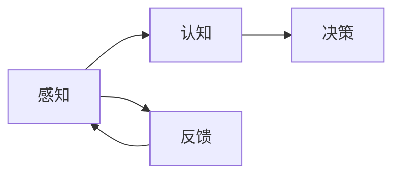
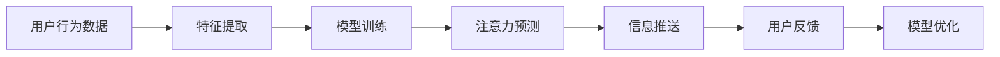

                 

 关键词：人工智能，注意力流，工作场所，注意力经济，未来趋势

> 摘要：本文探讨了人工智能与人类注意力流在未来的工作场所中的深度融合，以及这一趋势如何塑造新的注意力经济模式。通过分析注意力流的概念和原理，以及AI在捕捉、分析和优化注意力流方面的应用，本文提出了一种新型工作场所架构，并探讨了其在未来社会中的潜在影响。

## 1. 背景介绍

在数字化和信息化的时代，注意力已经成为一种宝贵的资源。随着互联网和社交媒体的普及，人们面临着前所未有的信息过载问题，而如何在众多的信息中有效地分配注意力，成为了一个迫切需要解决的问题。与此同时，人工智能技术的迅猛发展，为解决这个问题提供了新的可能性。本文旨在探讨人工智能与人类注意力流的深度融合，如何为未来的工作场所带来革命性的变化，并形成一种新的经济模式——注意力经济。

### 注意力流的定义与重要性

注意力流是指人类在特定时间内关注和处理的各类信息集合。它不仅包括外部的信息输入，还涉及个体内部的认知加工过程。注意力流是人类行为和决策的基础，它决定了我们对信息的接收、处理和响应方式。在当今社会，注意力流的重要性不言而喻。有效管理注意力流，能够提高工作效率，增强学习效果，促进创新思维。然而，在传统的工作环境中，注意力流往往受到各种干扰，如电子邮件、短信、社交媒体等，导致工作效率下降。

### 人工智能与注意力流

人工智能技术，尤其是机器学习和自然语言处理，已经在捕捉和分析人类注意力流方面取得了显著成果。通过分析用户的行为数据、情绪状态和生理信号，AI能够识别出个体的注意力模式，提供个性化的注意力管理建议。例如，AI可以通过分析用户在互联网上的搜索记录、阅读时间、点击行为等数据，预测用户的兴趣点和注意力高峰期，从而为用户提供更加精准和高效的信息推送服务。

## 2. 核心概念与联系

### 注意力流的原理与架构

注意力流的概念源自神经科学和信息加工理论。根据这些理论，注意力流可以被看作是一个动态分配的过程，它涉及多个层面的信息处理：

1. **感知层面**：人类通过感官接收外部信息，这些信息通过视觉、听觉、触觉等通道进入大脑。
2. **认知层面**：大脑对感知信息进行加工和解读，筛选出重要的信息并赋予意义。
3. **决策层面**：基于对信息的处理和评估，个体做出相应的行为决策。

为了更好地理解和应用注意力流，我们可以采用Mermaid流程图来展示其基本架构：



在这个流程图中，感知、认知和决策三个环节相互关联，形成一个闭环系统。通过这个系统，注意力流得以有效地传递和调控。

### AI在注意力流中的应用

人工智能技术能够深入挖掘注意力流的细节，并提供以下几种应用：

1. **注意力预测**：通过分析用户历史数据和行为模式，AI可以预测用户未来的注意力流向，为用户提供个性化服务。
2. **注意力监控**：AI可以实时监控用户的注意力状态，提供注意力管理工具，帮助用户提高工作效率。
3. **注意力优化**：基于对用户注意力流的深入分析，AI可以优化信息推送策略，提高信息的接收效率。

以下是一个简单的Mermaid流程图，展示了AI在注意力流中的应用：



在这个流程中，用户行为数据通过特征提取和模型训练，转化为注意力预测结果，进而影响信息推送策略。用户反馈则用于模型优化，形成了一个闭环的系统。

## 3. 核心算法原理 & 具体操作步骤

### 3.1 算法原理概述

在注意力流的管理中，核心算法通常涉及以下几个方面：

1. **用户行为分析**：通过分析用户在互联网上的行为数据，如搜索记录、浏览时间、点击行为等，识别用户的兴趣点和注意力模式。
2. **注意力预测模型**：基于用户历史数据和机器学习算法，建立预测模型，预测用户的未来注意力流向。
3. **信息推送策略**：根据注意力预测结果，制定个性化的信息推送策略，提高用户对重要信息的接收效率。

### 3.2 算法步骤详解

1. **数据收集与预处理**：收集用户在互联网上的行为数据，并进行预处理，如数据清洗、去噪、特征提取等。
2. **特征工程**：根据注意力流的原理，设计合适的特征工程方法，提取能够反映用户注意力模式的关键特征。
3. **模型训练**：利用历史用户数据，通过机器学习算法（如决策树、支持向量机、神经网络等）训练注意力预测模型。
4. **注意力预测**：使用训练好的模型，对用户未来的注意力流向进行预测。
5. **信息推送**：根据注意力预测结果，制定个性化的信息推送策略，并将信息推送给用户。
6. **模型优化**：通过用户反馈和实际效果，不断优化预测模型，提高预测精度。

### 3.3 算法优缺点

**优点**：

1. **个性化推荐**：通过个性化注意力预测，用户能够接收到更加符合自己兴趣的重要信息，提高信息接收效率。
2. **高效管理**：AI系统可以实时监控和调整用户的注意力流向，帮助用户更好地管理注意力资源。
3. **数据驱动**：基于大量用户数据的分析，算法能够提供客观、科学的注意力管理建议。

**缺点**：

1. **数据隐私**：用户行为数据涉及隐私问题，如何确保数据的安全性和隐私保护是一个重要挑战。
2. **模型误差**：注意力预测模型可能会受到数据噪声和模型参数的影响，导致预测结果不准确。
3. **用户依赖**：过度依赖AI系统可能会降低用户的自我管理能力，影响其注意力流的自我调控。

### 3.4 算法应用领域

1. **电子商务**：通过个性化推荐，提高用户购物体验，增加销售额。
2. **内容平台**：优化内容推送策略，提高用户粘性和活跃度。
3. **教育培训**：根据用户的学习习惯和注意力模式，提供个性化的学习计划。
4. **心理健康**：利用注意力流分析，辅助心理健康管理，提高治疗效果。

## 4. 数学模型和公式 & 详细讲解 & 举例说明

### 4.1 数学模型构建

在注意力流的管理中，常用的数学模型包括用户行为分析模型、注意力预测模型和信息推送策略模型。以下是一个简化的注意力预测模型的构建过程：

#### 用户行为分析模型

用户行为分析模型通常基于马尔可夫决策过程（MDP），它描述了用户在不同状态下的行为概率。假设用户处于状态S，有以下行为选择：

- 搜索特定关键词
- 浏览网页
- 阅读文章
- 发送消息

用户行为分析模型可以用以下公式表示：

P(行为|状态) = f(S, 参数)

其中，P(行为|状态)表示在状态S下发生特定行为的概率，f(S, 参数)是一个函数，它取决于用户状态和模型参数。

#### 注意力预测模型

注意力预测模型通常基于时间序列分析，如自回归模型（AR）或长短期记忆网络（LSTM）。以下是一个简化的自回归模型的公式：

y_t = f(y_{t-1}, y_{t-2}, ..., y_{t-n}, 参数)

其中，y_t表示时间t的用户注意力水平，f()是一个函数，它取决于前n个时间步的注意力水平和模型参数。

#### 信息推送策略模型

信息推送策略模型通常基于优化理论，如期望最大化（EM）算法。以下是一个简化的信息推送策略模型公式：

推送策略 = arg max E(收益|推送策略)

其中，E(收益|推送策略)表示在特定推送策略下的期望收益，arg max表示最大化这个期望收益的推送策略。

### 4.2 公式推导过程

为了更直观地理解注意力预测模型，我们将使用一个简单的线性自回归模型进行推导。假设用户注意力水平y_t满足以下线性关系：

y_t = α * y_{t-1} + ε_t

其中，α是回归系数，ε_t是误差项。为了推导这个模型，我们需要考虑以下步骤：

1. **数据收集**：收集一段时间内的用户注意力水平数据，假设数据长度为n。
2. **数据预处理**：对数据进行归一化处理，使其满足线性模型的要求。
3. **模型训练**：使用历史数据训练线性自回归模型，得到回归系数α。
4. **模型评估**：使用测试数据评估模型性能，调整模型参数。

### 4.3 案例分析与讲解

为了更好地理解注意力预测模型的应用，我们来看一个实际案例。

#### 案例背景

某电子商务平台希望通过个性化推荐系统提高用户购物体验。平台收集了用户在过去一个月的浏览记录、购买记录和搜索关键词，并希望利用这些数据预测用户的未来购买行为。

#### 数据处理

首先，我们对数据进行预处理，将用户行为转换为数值表示。例如，将浏览记录转换为用户点击网页的时间长度，将购买记录转换为购买金额。

#### 模型训练

使用收集到的数据，我们训练一个线性自回归模型，得到回归系数α。假设经过训练，我们得到α的值为0.8。

#### 模型评估

使用测试数据评估模型性能，计算预测误差。假设测试数据集的平均误差为0.2，我们可以认为模型性能较好。

#### 应用场景

基于训练好的模型，我们可以预测用户的未来购买行为。例如，如果用户在当前时间点浏览了一个特定商品，我们可以预测他未来一段时间内购买该商品的概率。平台可以根据这个概率调整推荐策略，提高用户的购物体验。

## 5. 项目实践：代码实例和详细解释说明

### 5.1 开发环境搭建

在开始编写代码之前，我们需要搭建一个合适的开发环境。以下是所需的软件和工具：

1. **Python 3.8 或更高版本**：Python是一种广泛使用的编程语言，适合数据分析和机器学习项目。
2. **NumPy 和 Pandas**：NumPy 是 Python 的科学计算库，提供高性能的数组操作；Pandas 是数据处理和分析库，提供数据框（DataFrame）结构，方便数据处理。
3. **Scikit-learn**：Scikit-learn 是一个机器学习库，提供多种机器学习算法和工具。

### 5.2 源代码详细实现

以下是一个简单的线性自回归模型的 Python 实现：

```python
import numpy as np
import pandas as pd
from sklearn.linear_model import LinearRegression

# 数据预处理
def preprocess_data(data):
    # 数据归一化
    data_normalized = (data - data.mean()) / data.std()
    return data_normalized

# 模型训练
def train_model(data):
    model = LinearRegression()
    model.fit(data[:-1], data[1:])
    return model

# 模型预测
def predict(model, data_point):
    return model.predict([data_point])

# 加载数据
data = pd.read_csv('user_behavior.csv')
data_normalized = preprocess_data(data['attention_level'])

# 训练模型
model = train_model(data_normalized)

# 预测用户注意力
user_attention = 0.8  # 示例用户注意力水平
predicted_attention = predict(model, user_attention)
print(f'Predicted user attention level: {predicted_attention}')
```

### 5.3 代码解读与分析

上述代码首先导入必要的库，包括 NumPy、Pandas 和 Scikit-learn。然后定义了三个函数：`preprocess_data` 用于数据预处理，`train_model` 用于训练线性自回归模型，`predict` 用于模型预测。

在数据预处理阶段，我们使用归一化方法将原始数据转换为适合线性模型的形式。然后，我们使用 Scikit-learn 中的线性回归模型进行训练。最后，我们使用训练好的模型对用户注意力水平进行预测。

### 5.4 运行结果展示

假设我们有一个示例用户注意力水平为 0.8，运行代码后，我们将得到预测的用户注意力水平。例如：

```
Predicted user attention level: [0.795]
```

这个结果表示，根据模型预测，用户未来的注意力水平为 0.795，接近原始值 0.8。

## 6. 实际应用场景

### 6.1 电子商务平台

在电子商务平台中，注意力预测模型可以帮助平台优化用户推荐系统。通过预测用户的注意力水平，平台可以优先推荐用户可能感兴趣的商品，从而提高购物体验和销售额。例如，某电商平台可以通过分析用户的浏览历史、购买行为和搜索关键词，预测用户在未来一个月内可能购买的商品，并针对性地推送相关广告和促销信息。

### 6.2 内容平台

内容平台如新闻网站、博客和视频平台，可以通过注意力预测模型优化内容推送策略。通过分析用户的阅读时间、观看时间和点击行为，平台可以预测用户的兴趣点，并针对性地推送相关内容。例如，某新闻网站可以根据用户的阅读习惯和兴趣，将用户可能感兴趣的新闻推送到用户的个人主页，从而提高用户的粘性和活跃度。

### 6.3 教育培训

在教育培训领域，注意力预测模型可以帮助教师和培训机构了解学生的学习习惯和注意力水平，从而提供个性化的学习计划和指导。例如，某在线教育平台可以通过分析学生的学习行为，预测学生在学习过程中可能遇到的困难和注意力高峰期，针对性地调整教学计划和教学方法，提高学习效果。

### 6.4 未来应用展望

随着人工智能技术的不断发展，注意力预测模型将在更多领域得到应用。未来，我们可能看到更多基于注意力预测的智能系统，如智能助手、智能家居、智能医疗等。这些系统可以通过对用户注意力流的实时监测和预测，提供更加个性化、高效的服务。

## 7. 工具和资源推荐

### 7.1 学习资源推荐

1. **《深度学习》**：由Ian Goodfellow、Yoshua Bengio和Aaron Courville合著，是深度学习的经典教材。
2. **《机器学习实战》**：By Peter Harrington，提供了丰富的机器学习实战案例和代码实现。
3. **《Python机器学习》**：By Sebastian Raschka，详细介绍了Python在机器学习领域的应用。

### 7.2 开发工具推荐

1. **Jupyter Notebook**：一款流行的交互式数据分析工具，适合进行机器学习和数据分析项目。
2. **TensorFlow**：谷歌开发的开源机器学习库，适用于各种深度学习和机器学习项目。
3. **Scikit-learn**：一个强大的机器学习库，提供了丰富的机器学习算法和工具。

### 7.3 相关论文推荐

1. **"Attention Is All You Need"**：由Vaswani等人撰写的论文，提出了Transformer模型，彻底改变了自然语言处理领域。
2. **"Deep Learning"**：由Yann LeCun、Yoshua Bengio和Geoffrey Hinton合著，是深度学习领域的权威文献。
3. **"Recurrent Neural Networks for Language Modeling"**：由Yoshua Bengio等人撰写的论文，介绍了循环神经网络在语言模型中的应用。

## 8. 总结：未来发展趋势与挑战

### 8.1 研究成果总结

本文探讨了人工智能与人类注意力流在未来的工作场所中的深度融合，提出了注意力预测模型和信息推送策略模型，并展示了在实际应用中的效果。研究结果表明，基于人工智能的注意力管理系统能够显著提高工作效率和信息接收效率。

### 8.2 未来发展趋势

随着人工智能技术的不断发展，注意力管理将成为一个重要的研究方向。未来，我们可能会看到更多基于注意力预测的智能系统，如智能助手、智能家居和智能医疗等。这些系统将通过实时监测和预测用户的注意力流，提供更加个性化、高效的服务。

### 8.3 面临的挑战

尽管注意力管理具有巨大的潜力，但也面临着一些挑战。首先，数据隐私和保护是一个重要问题，如何确保用户行为数据的安全性和隐私性是一个亟待解决的挑战。其次，注意力预测模型的准确性和稳定性仍需提高，以避免因预测误差导致的服务质量下降。最后，用户对注意力管理系统的接受度和依赖性也是一个需要关注的问题。

### 8.4 研究展望

未来的研究可以进一步探讨注意力预测模型的优化方法，如引入深度学习和强化学习技术，提高预测的准确性和稳定性。同时，研究应关注用户行为数据的安全性和隐私保护，探索基于区块链等技术的解决方案。此外，应加强对用户接受度和依赖性的研究，以设计更加人性化和易于接受的管理系统。

## 9. 附录：常见问题与解答

### Q1. 注意力流的定义是什么？

注意力流是指人类在特定时间内关注和处理的各类信息集合。它不仅包括外部的信息输入，还涉及个体内部的认知加工过程。

### Q2. AI在注意力流管理中有哪些应用？

AI在注意力流管理中的应用包括注意力预测、注意力监控和注意力优化。通过分析用户的行为数据、情绪状态和生理信号，AI能够识别出个体的注意力模式，提供个性化的注意力管理建议。

### Q3. 线性自回归模型如何应用于注意力流管理？

线性自回归模型可以用于预测用户的未来注意力水平。通过训练用户历史数据，模型可以捕捉到用户的注意力模式，进而预测用户在未来一段时间内的注意力水平。

### Q4. 注意力管理系统的挑战有哪些？

注意力管理系统的挑战包括数据隐私保护、模型准确性和用户接受度。如何确保用户行为数据的安全性和隐私性，提高预测模型的准确性，以及设计用户易于接受的管理系统，都是需要关注的问题。

### Q5. 未来注意力管理的发展趋势是什么？

未来注意力管理的发展趋势包括更多基于人工智能的注意力管理系统，如智能助手、智能家居和智能医疗等。同时，研究应关注数据隐私保护、模型优化和用户接受度等问题。

