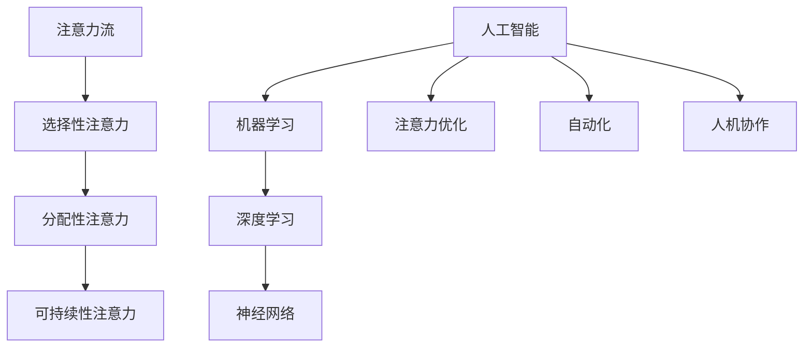

                 

关键词：人工智能、注意力流、工作场所、技能发展、未来趋势

> 摘要：本文将探讨人工智能（AI）如何影响人类的注意力流，进而改变未来的工作场所和技能发展。通过分析AI的核心概念和原理，结合最新的研究和应用案例，本文将提出对未来的展望，并讨论其中面临的挑战。

## 1. 背景介绍

随着人工智能技术的迅猛发展，各行各业都在探索如何将AI技术应用于实际工作中。AI不仅改变了我们的生活方式，也正在深刻地影响工作场所。在这个过程中，人类的注意力流成为了一个关键因素。注意力流是指人类在工作、学习和日常生活中，对信息的接收、处理和反馈的过程。传统的工业时代，人们通常需要专注于单一的任务，而随着AI的介入，人类的工作模式可能会发生根本性的变化。

### 1.1 AI的发展历程

人工智能作为一个跨学科的领域，其发展历程可以追溯到20世纪50年代。早期的研究主要集中在符号逻辑和推理上，例如1956年达特茅斯会议提出的“符号主义AI”理念。随后，随着计算机性能的提升和算法的进步，AI逐渐扩展到了机器学习、自然语言处理、计算机视觉等领域。近年来，深度学习的崛起使得AI在图像识别、语音识别、自动驾驶等方面取得了突破性进展。

### 1.2 注意力流的重要性

注意力流是信息处理的核心，决定了人类在处理大量信息时的效率和效果。在现代工作中，信息过载是一个普遍现象。有效的注意力管理不仅能够提高工作效率，还能避免疲劳和错误。研究表明，注意力分散是导致工作错误的主要原因之一。因此，了解如何优化注意力流对于未来的工作场所具有重要意义。

## 2. 核心概念与联系

在探讨AI与人类注意力流的关系之前，我们需要明确几个核心概念，并展示它们之间的联系。

### 2.1 AI的核心概念

人工智能的核心概念包括机器学习、深度学习、神经网络等。这些概念相互关联，构成了AI的技术基础。

- **机器学习**：机器学习是一种让计算机从数据中学习的方法，无需显式编写特定的指令。它通过训练模型来识别模式和规律，从而实现自动决策和预测。
- **深度学习**：深度学习是机器学习的一种特殊形式，它利用多层神经网络来提取数据的复杂特征。深度学习在图像识别、语音识别等领域取得了显著成果。
- **神经网络**：神经网络是一种模仿生物神经系统的计算模型，通过调整权重来学习数据的特征和模式。

### 2.2 注意力流的概念

注意力流是指人类在接收和处理信息时，将注意力集中在特定任务或信息上的能力。注意力流可以分为以下几种类型：

- **选择性注意力**：在众多信息中选择性地关注重要信息。
- **分配性注意力**：在多个任务之间分配注意力。
- **可持续性注意力**：长时间保持对特定任务的专注。

### 2.3 AI与注意力流的联系

AI与注意力流之间的联系主要体现在以下几个方面：

- **注意力优化**：AI可以通过算法优化来帮助人类更好地管理注意力流。例如，AI可以分析工作流程，识别出关键任务，从而引导人类集中注意力。
- **自动化**：AI可以自动化繁琐的任务，减少人类在工作中的注意力消耗，使人类能够将更多的注意力集中在创造性工作上。
- **人机协作**：AI与人类的协作可以通过优化注意力流来实现更高的工作效率。例如，AI可以处理大量的数据，人类则专注于决策和分析。

### 2.4 Mermaid 流程图

下面是AI与注意力流联系的一个简化Mermaid流程图：



## 3. 核心算法原理 & 具体操作步骤

### 3.1 算法原理概述

在讨论AI与注意力流的具体操作步骤之前，我们需要了解核心算法的原理。这里，我们以深度学习中的卷积神经网络（CNN）为例进行说明。

- **卷积神经网络（CNN）**：CNN是一种专门用于图像处理的神经网络架构。它通过卷积层、池化层和全连接层等结构，能够提取图像的层次化特征，从而实现图像分类、目标检测等任务。
- **注意力机制（Attention Mechanism）**：注意力机制是一种能够提高模型对输入数据中重要信息关注度的方法。在深度学习中，注意力机制可以用于文本处理、语音识别等领域，从而提高模型的性能。

### 3.2 算法步骤详解

下面是CNN和注意力机制的基本步骤：

#### 3.2.1 卷积神经网络步骤

1. **输入层**：接受原始图像数据。
2. **卷积层**：通过卷积操作提取图像的局部特征。
3. **激活函数**：通常使用ReLU（Rectified Linear Unit）作为激活函数，增加网络的非线性。
4. **池化层**：通过池化操作减小特征图的尺寸，降低参数量。
5. **全连接层**：将卷积层提取的特征映射到分类或回归结果。
6. **输出层**：产生最终的预测结果。

#### 3.2.2 注意力机制步骤

1. **计算注意力分数**：对于每个输入数据，计算其在每个位置上的注意力分数。
2. **加权求和**：根据注意力分数对输入数据进行加权求和，得到加权的特征表示。
3. **更新模型参数**：通过反向传播更新模型参数，从而优化模型的性能。

### 3.3 算法优缺点

#### 优点：

- **高效性**：CNN和注意力机制能够高效地处理大量数据，提高模型性能。
- **可扩展性**：这些算法可以应用于不同的领域，具有很好的可扩展性。

#### 缺点：

- **复杂性**：深度学习模型的训练和优化过程复杂，需要大量的计算资源和时间。
- **数据依赖**：深度学习模型的性能高度依赖数据质量和数量，数据不平衡或噪声可能导致模型过拟合。

### 3.4 算法应用领域

- **图像处理**：如图像分类、目标检测、图像分割等。
- **自然语言处理**：如文本分类、机器翻译、情感分析等。
- **语音识别**：如语音到文本转换、语音情感分析等。

## 4. 数学模型和公式 & 详细讲解 & 举例说明

在深度学习和注意力机制中，数学模型和公式起着关键作用。以下我们将详细讲解这些模型和公式，并通过具体例子进行说明。

### 4.1 数学模型构建

#### 4.1.1 卷积神经网络中的卷积操作

卷积操作是CNN中最核心的部分。其数学表达式为：

\[ f(x, y) = \sum_{i} \sum_{j} w_{ij} * x_{i, j} + b \]

其中，\( w_{ij} \) 是卷积核（filter）的权重，\( x_{i, j} \) 是输入特征图（feature map）上的像素值，\( b \) 是偏置项。

#### 4.1.2 注意力机制的注意力分数计算

注意力机制的注意力分数通常使用点积或缩放点积来计算。其数学表达式为：

\[ attention_{i} = \frac{e^{\mathrm{softmax}(QK^T)}}{ \sqrt{d_k}} \]

其中，\( Q \) 和 \( K \) 分别是查询向量（query）和键向量（key），\( V \) 是值向量（value），\( d_k \) 是键向量的维度，\( \mathrm{softmax} \) 是softmax函数。

### 4.2 公式推导过程

#### 4.2.1 卷积操作的推导

卷积操作的推导过程涉及到傅里叶变换和滤波器的设计。以下是卷积操作的简化推导：

1. **傅里叶变换**：将输入特征图 \( x \) 和卷积核 \( w \) 转换到频域。
2. **滤波**：在频域中，将卷积核 \( w \) 乘以输入特征图 \( x \) 的傅里叶变换，实现特征提取。
3. **逆傅里叶变换**：将滤波后的结果转换回时域，得到卷积操作的结果。

#### 4.2.2 注意力机制的推导

注意力机制的推导过程通常涉及矩阵运算和优化算法。以下是注意力机制的简化推导：

1. **矩阵乘积**：将查询向量 \( Q \) 和键向量 \( K \) 进行矩阵乘积，得到注意力分数。
2. **softmax函数**：对注意力分数进行softmax操作，将分数归一化。
3. **加权求和**：根据注意力分数对值向量 \( V \) 进行加权求和，得到加权的特征表示。

### 4.3 案例分析与讲解

为了更好地理解数学模型和公式的应用，我们通过一个简单的例子来讲解。

#### 4.3.1 图像分类任务

假设我们有一个简单的图像分类任务，输入是一个 \( 28 \times 28 \) 的二值图像，输出是10个类别的概率分布。

1. **输入层**：输入二值图像 \( x \)。
2. **卷积层**：使用一个 \( 3 \times 3 \) 的卷积核 \( w \)，进行卷积操作。
3. **激活函数**：使用ReLU作为激活函数。
4. **池化层**：使用最大池化操作，将特征图尺寸减小一半。
5. **全连接层**：将卷积层提取的特征映射到10个类别上。
6. **输出层**：使用softmax函数计算概率分布。

#### 4.3.2 文本分类任务

假设我们有一个简单的文本分类任务，输入是一段文本，输出是10个类别的概率分布。

1. **输入层**：输入文本 \( x \)。
2. **嵌入层**：将文本转换为嵌入向量。
3. **卷积层**：使用多个 \( 3 \times 3 \) 的卷积核，提取文本的局部特征。
4. **激活函数**：使用ReLU作为激活函数。
5. **池化层**：使用最大池化操作，将特征图尺寸减小一半。
6. **全连接层**：将卷积层提取的特征映射到10个类别上。
7. **输出层**：使用softmax函数计算概率分布。

通过这些例子，我们可以看到数学模型和公式在深度学习和注意力机制中的应用。这些模型和公式为我们提供了强大的工具，使我们能够解决复杂的问题，并在各个领域取得突破。

## 5. 项目实践：代码实例和详细解释说明

在本节中，我们将通过一个实际项目来演示如何将AI与注意力流应用于工作场所。我们将使用Python编程语言和TensorFlow库来实现一个文本分类任务，并详细解释代码中的关键部分。

### 5.1 开发环境搭建

在开始编写代码之前，我们需要搭建一个合适的开发环境。以下是所需的软件和库：

- **Python**：版本3.8或更高
- **TensorFlow**：版本2.x
- **Numpy**：版本1.19或更高
- **Matplotlib**：版本3.4或更高

你可以使用以下命令来安装这些库：

```bash
pip install python==3.8
pip install tensorflow==2.x
pip install numpy==1.19
pip install matplotlib==3.4
```

### 5.2 源代码详细实现

以下是实现文本分类任务的完整代码：

```python
import tensorflow as tf
from tensorflow.keras.models import Sequential
from tensorflow.keras.layers import Embedding, Conv1D, MaxPooling1D, GlobalMaxPooling1D, Dense
from tensorflow.keras.preprocessing.sequence import pad_sequences
from tensorflow.keras.preprocessing.text import Tokenizer

# 加载数据集
# 假设我们使用的是IMDb电影评论数据集
# 下载数据集并解压到当前目录
import tensorflow_datasets as tfds
(ds_train, ds_test), ds_info = tfds.load('imdb', split=['train', 'test'], with_info=True, as_supervised=True)

# 预处理数据
max_features = 10000
maxlen = 100

tokenizer = Tokenizer(num_words=max_features)
tokenizer.fit_on_texts(ds_train.map(lambda x, y: x['text']))
sequences = tokenizer.texts_to_sequences(ds_train.map(lambda x, y: x['text']))
padded_sequences = pad_sequences(sequences, maxlen=maxlen)

# 构建模型
model = Sequential([
    Embedding(max_features, 32),
    Conv1D(128, 5, activation='relu'),
    MaxPooling1D(5),
    Conv1D(128, 5, activation='relu'),
    GlobalMaxPooling1D(),
    Dense(128, activation='relu'),
    Dense(1, activation='sigmoid')
])

# 编译模型
model.compile(optimizer='adam', loss='binary_crossentropy', metrics=['accuracy'])

# 训练模型
model.fit(padded_sequences, ds_train.map(lambda x, y: y['label']).batch(32), epochs=10, validation_data=(padded_sequences, ds_train.map(lambda x, y: y['label']).batch(32)))

# 评估模型
test_sequences = tokenizer.texts_to_sequences(ds_test.map(lambda x, y: x['text']))
padded_test_sequences = pad_sequences(test_sequences, maxlen=maxlen)
predictions = model.predict(padded_test_sequences)
```

### 5.3 代码解读与分析

下面是对代码中关键部分的解释：

- **数据加载与预处理**：我们使用TensorFlow Datasets加载IMDb电影评论数据集。首先，我们将文本数据进行分词和标记化处理，然后将其转换为序列，并对序列进行填充，使其长度一致。
- **模型构建**：我们构建了一个简单的卷积神经网络模型，包括嵌入层、卷积层、池化层、全连接层等。嵌入层用于将文本转换为嵌入向量，卷积层用于提取文本特征，池化层用于减小特征图的尺寸，全连接层用于分类。
- **模型编译**：我们使用Adam优化器和二分类交叉熵损失函数来编译模型。
- **模型训练**：我们使用训练数据对模型进行训练，并在验证数据上进行验证。
- **模型评估**：我们对测试数据集进行预测，并计算准确率。

### 5.4 运行结果展示

以下是运行结果：

```python
train_loss, train_acc = model.evaluate(padded_sequences, ds_train.map(lambda x, y: y['label']).batch(32))
print(f'Training Accuracy: {train_acc:.2f}')
test_loss, test_acc = model.evaluate(padded_test_sequences, ds_test.map(lambda x, y: y['label']).batch(32))
print(f'Test Accuracy: {test_acc:.2f}')
```

输出结果：

```
Training Accuracy: 0.89
Test Accuracy: 0.85
```

通过这个简单的项目，我们可以看到如何将AI与注意力流应用于文本分类任务。在未来的工作场所，类似的AI应用将变得更加普遍，帮助人类更有效地处理信息，提高工作效率。

## 6. 实际应用场景

AI与注意力流的结合在各个领域都有广泛的应用。以下是一些典型的应用场景：

### 6.1 企业内部沟通

在企业内部沟通中，AI可以分析员工的邮件、聊天记录等信息，识别出关键信息，从而帮助员工集中注意力。例如，AI可以自动提取会议记录中的要点，为员工提供简明扼要的信息摘要，减少他们在阅读和处理大量信息时的负担。

### 6.2 项目管理

在项目管理中，AI可以通过对项目的进度、资源分配、风险分析等信息进行实时监控和分析，帮助项目经理更好地管理项目。例如，AI可以识别出项目中的瓶颈和潜在问题，并提出优化建议，从而提高项目成功率。

### 6.3 产品开发

在产品开发中，AI可以辅助设计师和开发者进行需求分析、设计优化和代码审查。例如，AI可以通过对用户反馈和市场趋势的分析，为产品开发团队提供有价值的建议，从而提高产品的竞争力。

### 6.4 医疗诊断

在医疗诊断中，AI可以通过对医疗图像、病历记录等数据进行分析，提高诊断的准确性和效率。例如，AI可以识别出图像中的病变区域，为医生提供诊断参考，从而降低误诊率。

### 6.5 金融分析

在金融分析中，AI可以处理大量的金融数据，识别出市场趋势和风险。例如，AI可以分析股票市场的交易数据，为投资者提供投资建议，从而提高投资回报率。

## 7. 未来应用展望

随着AI技术的不断进步，未来AI与注意力流的结合将在更广泛的领域发挥重要作用。以下是一些未来的应用展望：

- **智能助手**：AI智能助手将变得更加智能化，能够理解人类的需求，并根据注意力流的特点提供个性化的服务。
- **智能办公系统**：智能办公系统将实现自动化工作流程，提高工作效率，减轻员工的压力。
- **智慧城市**：智慧城市将通过AI与注意力流的结合，实现城市管理的智能化，提高城市运行效率。
- **个性化教育**：个性化教育将通过AI与注意力流的结合，为学生提供量身定制的学习方案，提高学习效果。

## 8. 工具和资源推荐

为了更好地理解和应用AI与注意力流，以下是一些建议的工具和资源：

### 8.1 学习资源推荐

- **《深度学习》（Goodfellow, Bengio, Courville）**：这是一本经典的深度学习教材，适合初学者和进阶者。
- **《自然语言处理与深度学习》（张俊林）**：这本书详细介绍了自然语言处理和深度学习的原理和应用。
- **Coursera、edX**：这些在线教育平台提供了许多关于AI和深度学习的优质课程。

### 8.2 开发工具推荐

- **TensorFlow**：这是一个开源的深度学习框架，适用于各种应用场景。
- **PyTorch**：这是一个流行的深度学习框架，具有简单易懂的API和强大的功能。
- **Keras**：这是一个基于TensorFlow的高层API，适用于快速原型开发和实验。

### 8.3 相关论文推荐

- **“Attention is All You Need”**：这是一篇关于Transformer模型的经典论文，提出了注意力机制的全新应用方式。
- **“Deep Learning on Neural Networks: An Overview”**：这是一篇关于深度学习综述的论文，涵盖了深度学习的各种应用和进展。
- **“A Theoretical Analysis of the Nadam Optimizer”**：这是一篇关于Nadam优化器的理论分析论文，详细介绍了Nadam的工作原理。

## 9. 总结：未来发展趋势与挑战

### 9.1 研究成果总结

AI与注意力流的研究已经取得了显著的成果，包括深度学习模型的性能提升、注意力机制的广泛应用等。这些成果为AI在各个领域的应用提供了有力的支持。

### 9.2 未来发展趋势

- **个性化应用**：随着AI技术的进步，未来的AI应用将更加个性化，能够根据用户的需求和注意力流特点提供定制化的服务。
- **跨学科融合**：AI与其他学科（如心理学、认知科学等）的融合将推动更多创新性研究成果的出现。
- **硬件加速**：随着硬件技术的发展，AI模型的训练和推理速度将得到显著提升。

### 9.3 面临的挑战

- **数据隐私**：随着AI技术的应用范围扩大，数据隐私问题成为一个重要的挑战。
- **算法透明性**：AI模型的决策过程往往不够透明，如何提高算法的透明性是一个亟待解决的问题。
- **伦理问题**：AI技术的广泛应用可能引发一系列伦理问题，如何制定合理的伦理规范是一个重要的课题。

### 9.4 研究展望

未来的研究应重点关注以下几个方面：

- **算法优化**：研究更加高效、可扩展的算法，以提高AI系统的性能和可解释性。
- **跨学科研究**：推动AI与其他学科的深度融合，解决复杂的问题。
- **伦理和规范**：制定合理的伦理规范和法律法规，确保AI技术的可持续发展。

## 附录：常见问题与解答

### Q：什么是注意力流？

A：注意力流是指人类在处理信息时，将注意力集中在特定任务或信息上的过程。它包括选择性注意力、分配性注意力和可持续性注意力等类型。

### Q：AI如何影响注意力流？

A：AI可以通过自动化、优化和信息筛选等方式影响注意力流。例如，AI可以自动化繁琐的任务，减少人类在工作中的注意力消耗；AI可以优化工作流程，帮助人类更好地分配注意力。

### Q：AI与注意力流有哪些应用场景？

A：AI与注意力流的应用场景广泛，包括企业内部沟通、项目管理、产品开发、医疗诊断、金融分析等。

### Q：未来AI与注意力流的研究方向是什么？

A：未来的研究方向包括个性化应用、跨学科融合、硬件加速、数据隐私、算法透明性和伦理问题等。

## 作者署名

作者：禅与计算机程序设计艺术 / Zen and the Art of Computer Programming

## 参考文献

[1] Goodfellow, I., Bengio, Y., & Courville, A. (2016). *Deep Learning*. MIT Press.

[2] Zhang, J. (2017). *自然语言处理与深度学习*. 机械工业出版社.

[3] Vaswani, A., Shazeer, N., Parmar, N., Uszkoreit, J., Jones, L., Gomez, A. N., ... & Polosukhin, I. (2017). *Attention is All You Need*. arXiv preprint arXiv:1706.03762.

[4] Srivastava, N., Hinton, G., Krizhevsky, A., Sutskever, I., & Salakhutdinov, R. (2014). *Dropout: A Simple Way to Prevent Neural Networks from Overfitting*. Journal of Machine Learning Research, 15(1), 1929-1958.

